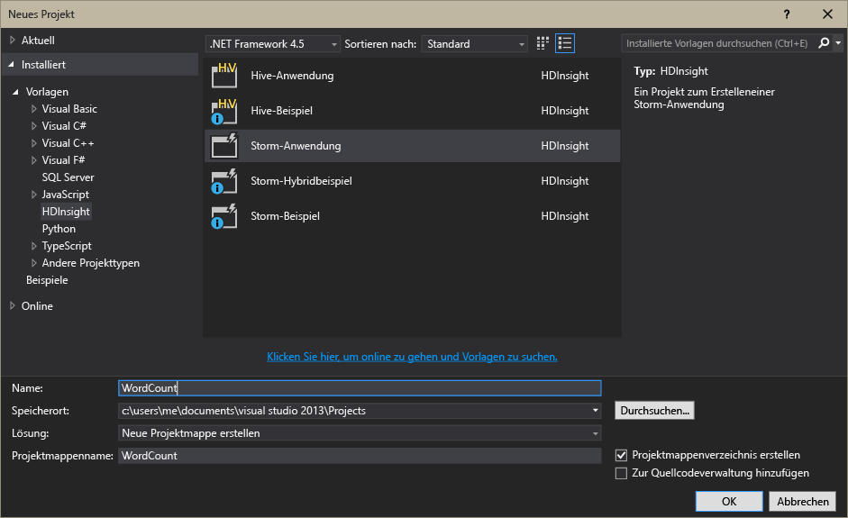

# Einführung in Apache Storm in HDInsight: Echtzeitanalysen für Hadoop
Mit Apache Storm in HDInsight können Sie verteilte Echtzeitanalyselösungen in der Azure-Umgebung mithilfe von [Apache Hadoop](http://hadoop.apache.org)erstellen.

## Was ist Apache Storm?
Apache Storm ist ein verteiltes, fehlertolerantes, Open-Source-Berechnungssystem für die Verarbeitung von Daten in Echtzeit mit Hadoop. Storm-Lösungen sind außerdem in der Lage, die Verarbeitung von Daten zu garantieren und Daten erneut abzuspielen, die beim ersten Versuch nicht erfolgreich verarbeitet wurden.

## Vorteile von Storm in HDInsight
Apache Storm in HDInsight wird als verwalteter Cluster angeboten, der in die Azure-Umgebung integriert ist. Die Lösung bietet folgende wichtige Vorteile:

* Ausführung als verwalteter Dienst mit einer SLA von 99,9 % Betriebszeit.
* Verwendung der Sprache Ihrer Wahl: Bietet Unterstützung für Storm-Komponenten in **Java**, **C#** und **Python**.
  
  * Unterstützung für gemischte Programmiersprachen: Daten werden mit Java gelesen und dann mit C verarbeitet.#
    
    > [!NOTE]
    > Um eine C#-Topologie mit einem Linux-basierten Cluster zu verwenden, müssen Sie das NuGet-Paket „Microsoft.SCP.Net.SDK“, das vom Projekt verwendet wird, auf Version 0.10.0.6 oder höher aktualisieren. Die Version des Pakets muss zudem mit der Hauptversion der Storm-Installation auf HDInsight übereinstimmen. Beispielsweise verwenden die Storm in HDInsight-Versionen 3.3 und 3.4 die Storm-Version 0.10.x, während HDInsight 3.5 Storm 1.0.x verwendet.
    > 
    > C#-Topologien in Linux-basierten Clustern müssen .NET 4.5 verwenden. Zudem muss Mono im HDInsight-Cluster ausgeführt werden. Das meiste ist funktionsfähig, Sie sollten jedoch das Dokument zur [Mono-Kompatibilität](http://www.mono-project.com/docs/about-mono/compatibility/) auf mögliche Inkompatibilitäten überprüfen.
    > 
  * Verwendung der **Trident** -Java-Schnittstelle zum Erstellen von Storm-Topologien, die eine "exakt einmalige" Verarbeitung von Nachrichten, "transaktionale" Datenspeicherpersistenz sowie eine Reihe allgemeiner Datenstrom-Analysevorgänge unterstützen.
* Integrierte Funktionen für zentrales Hoch- und Herunterskalieren: Skalieren Sie einen HDInsight-Cluster ohne Auswirkungen auf die Ausführung von Storm-Topologien.
* Integration in andere Azure-Dienste, einschließlich Event Hub, Azure Virtual Network, SQL-Datenbank, Blobspeicher und DocumentDB.
  
  * Kombinieren der Funktionen mehrerer HDInsight-Cluster mithilfe von Azure Virtual Network: Erstellen Sie analytische Pipelines, die HDInsight-, HBase- oder Hadoop-Cluster nutzen.

Eine Liste der Unternehmen, die Apache Storm für ihre Echtzeitanalyselösungen verwenden, finden Sie unter [Unternehmen, die Apache Storm verwenden](https://storm.apache.org/documentation/Powered-By.html).

Eine Einführung in Storm finden Sie unter [Erste Schritte mit Storm in HDInsight][gettingstarted].

### Einfache Bereitstellung
Sie können einen neuen Storm in HDInsight-Cluster in wenigen Minuten bereitstellen. Geben Sie den Clusternamen, die Größe, das Administratorkonto und das Speicherkonto an. Azure erstellt den Cluster, einschließlich Beispieltopologien und Dashboard zur Webverwaltung.

> [!NOTE]
> Sie können Storm-Cluster auch über die [Azure-Befehlszeilenschnittstelle](../xplat-cli-install.md) oder [Azure PowerShell](/powershell/azureps-cmdlets-docs) bereitstellen.
> 
> 

Innerhalb von 15 Minuten nach Übermittlung der Anforderung verfügen Sie über einen neuen Storm-Cluster, der bereit ist für die erste Echtzeitanalysepipeline.

### Einfache Bedienung
**Für Linux-basierte Storm in HDInsight-Cluster** können Sie mithilfe von SSH eine Verbindung zum Cluster herstellen und den Befehl `storm` zum Starten und Verwalten von Topologien verwenden. Darüber hinaus können Sie Ambari zur Überwachung des Storm-Diensts und der Storm-Benutzeroberfläche verwenden, um ausgeführte Topologien zu überwachen und zu verwalten.

Weitere Informationen zum Arbeiten mit Linux-basierten Storm-Clustern finden Sie unter [Erste Schritte mit Apache Storm auf Linux-basiertem HDInsight](hdinsight-apache-storm-tutorial-get-started-linux.md).

**Bei Windows-basierten Storm in HDInsight-Clustern**haben Sie mit den HDInsight-Tools für Visual Studio die Möglichkeit, C#- und hybride C#-/Java-Topologien zu erstellen, die Sie dann an diese Cluster senden können.  

Die HDInsight-Tools für Visual Studio bieten außerdem eine Schnittstelle, die die Überwachung und Verwaltung von Storm-Topologien in einem Cluster ermöglicht.

Ein Beispiel für die Verwendung der HDInsight-Tools zum Erstellen einer Storm-Anwendung finden Sie unter [Entwickeln von C#-Storm-Topologien mit HDInsight-Tools für Visual Studio](hdinsight-storm-develop-csharp-visual-studio-topology.md).

Informationen zu den HDInsight-Tools für Visual Studio finden Sie unter [Erste Schritte mit den HDInsight-Tools für Visual Studio](hdinsight-hadoop-visual-studio-tools-get-started.md).

Jeder Storm in HDInsight-Cluster bietet auch ein webbasiertes Storm-Dashboard, mit dem Sie im Cluster ausgeführte Storm-Topologien übermitteln, überwachen und verwalten können.

Weitere Informationen über das Storm-Dashboard finden Sie unter [Bereitstellen und Verwalten von Apache Storm-Topologien in HDInsight](hdinsight-storm-deploy-monitor-topology.md).

Storm in HDInsight bietet außerdem durch den **Event Hub-Spout**eine einfache Integration in Azure Event Hubs. Die neueste Version dieser Komponente finden Sie unter [https://github.com/hdinsight/hdinsight-storm-examples/tree/master/lib/eventhubs](https://github.com/hdinsight/hdinsight-storm-examples/tree/master/lib/eventhubs). Weitere Informationen zur Verwendung dieser Komponente finden Sie in den folgenden Dokumenten:

* [Entwickeln Sie eine C#-Topologie, die Azure Event Hubs verwendet](hdinsight-storm-develop-csharp-event-hub-topology.md)
* [Entwickeln Sie eine Java-Topologie, die Azure Event Hubs verwendet](hdinsight-storm-develop-java-event-hub-topology.md)

### Zuverlässigkeit
Mit Apache Storm ist garantiert, dass jede eingehende Nachricht auch dann vollständig verarbeitet wird, wenn die Datenanalyse über Hunderte von Knoten verteilt ist.

Der **Nimbus-Knoten** stellt dem Hadoop JobTracker ähnliche Funktionen zur Verfügung und weist über **Zookeeper** anderen Knoten im Cluster Aufgaben zu. Zookeeper-Knoten stellen Koordination für den Cluster bereit und erleichtern die Kommunikation zwischen Nimbus und dem **Supervisor** -Prozess der Workerknoten. Wenn ein Verarbeitungsknoten ausfällt, wird der Nimbus-Knoten darüber informiert, und die Aufgabe sowie zugehörige Daten werden einem anderen Knoten zugewiesen.

In der Standardkonfiguration verfügt Apache Storm über einen einzelnen Nimbus-Knoten. Storm in HDInsight betreibt zwei Nimbus-Knoten. Wenn der primäre Knoten ausfällt, wechselt der HDInsight-Cluster auf den sekundären Knoten, während der primäre Knoten wiederhergestellt wird.

### Skalieren
Obwohl Sie die Anzahl der Knoten im Cluster bei der Erstellung angeben können, sollten Sie den Cluster je nach Workload vergrößern oder verkleinern. Alle HDInsight-Cluster bieten die Möglichkeit, die Anzahl der Knoten im Cluster sogar während der Verarbeitung von Daten zu ändern.

> [!NOTE]
> Um neue Knoten zu nutzen, die über eine Skalierung hinzugefügt wurden, müssen Sie Topologien neu ausrichten, die vor dem Vergrößern des Clusters gestartet wurden.
> 
> 

### Support
Für Storm in HDInsight steht umfassender Support auf Unternehmensebene rund um die Uhr zur Verfügung. Storm in HDInsight bietet eine SLA von 99,9 %. Das bedeutet, dass der Cluster garantiert mindestens 99,9 % der Zeit über externe Konnektivität verfügt.

## Allgemeine Szenarien für Echtzeitanalysen
Hier finden Sie eine Liste der typischen Szenarien, in denen Apache Storm in HDInsight eingesetzt wird. Weitere Informationen zu realen Szenarien finden Sie unter [Companies using Apache Storm](https://storm.apache.org/documentation/Powered-By.html)(in englischer Sprache).

* Internet der Dinge (IoT, Internet of Things)
* Betrugserkennung
* Soziale Analysen
* Extraktions-, Umwandlungs- und Ladeprozesse (Extract, Transform and Load, ETL)
* Netzwerküberwachung
* Suche
* Mobile Engagement

## Wie werden die Daten in HDInsight Storm verarbeitet?
Apache Storm verarbeitet **Topologien** anstelle der MapReduce-Aufträge, die Sie möglicherweise aus HDInsight oder Hadoop kennen. Ein Storm in HDInsight-Cluster enthält zwei Arten von Knoten: Hauptknoten, auf denen **Nimbus** ausgeführt wird, und Workerknoten, auf denen **Supervisor** ausgeführt wird.

* **Nimbus**: Ähnelt dem JobTracker in Hadoop und verteilt den Code über das Cluster, weist Aufgaben an virtuelle Computer zu und überwacht das System auf Fehler. HDInsight stellt zwei Nimbus-Knoten bereit, um einzelne Fehlerquellen für Storm in HDInsight auszuschließen.
* **Supervisor**: Die Supervisoren der einzelnen Workerknoten sind dafür verantwortlich, die **Workerprozesse** im Knoten zu starten und zu beenden.
* **Workerprozess**: Ein Workerprozess führt eine Teilmenge einer **Topologie** aus. Eine laufende Topologie ist über viele Arbeitsprozesse im gesamten Cluster verteilt.
* **Topologie**: Definiert einen Berechnungsgraphen zur Verarbeitung von **Datenströmen**. Im Gegensatz zu MapReduce-Aufträgen werden Topologien so lange ausgeführt, bis sie beendet werden.
* **Datenstrom**: Eine ungebundene Sammlung von **Tupeln**. Datenströme werden von **Spouts** und **Bolts** erzeugt und von **Bolts** konsumiert.
* **Tupel**: Eine benannte Liste dynamisch typisierter Werte.
* **Spout**: Konsumiert Daten aus einer Datenquelle und gibt einen oder mehrere **Datenströme** aus.
  
  > [!NOTE]
  > Oft werden die Daten aus einer Warteschlange wie z. B. Kafka, Azure Service Bus-Warteschlangen oder Event Hubs gelesen. Die Warteschlange sorgt dafür, dass die Daten bei einem Ausfall in persistenter Form vorliegen.
  > 
  > 
* **Bolt**: Konsumiert **Datenströme**, verarbeitet **Tupel** und kann **Datenströme** ausgeben. Bolts sind außerdem dafür verantwortlich, Daten in externe Speicher zu schreiben, z. B. eine Warteschlange, HDInsight, HBase, Blobs oder andere Datenspeicher.
* **Apache Thrift**: Ein Software-Framework für die Entwicklung skalierbarer, sprachübergreifender Dienste. Mit Thrift können Sie Dienste entwickeln, die zwischen C++, Java, Python, PHP, Ruby, Erlang, Perl, Haskell, C#, Cocoa, JavaScript, Node.js, Smalltalk und anderen Sprachen funktionieren.
  
  * **Nimbus** ist ein Thrift-Dienst, und eine **Topologie** ist eine Thrift-Definition. Aus diesem Grund ist es möglich, Topologien in einer Vielzahl von Programmiersprachen zu entwickeln.

Weitere Informationen zu Storm-Komponenten finden Sie im [Storm-Tutorial][apachetutorial] auf „apache.org“.

## Welche Programmiersprachen kann ich verwenden?
Der Storm in HDInsight-Cluster unterstützt C#, Java und Python.

### C&#35;
Mit den HDInsight-Tools für Visual Studio können .NET-Entwickler eine Topologie in C# entwerfen und implementieren. Sie können auch Hybridtopologien erstellen, die Java- und C#-Komponenten verwenden.

Weitere Informationen finden Sie unter [Entwickeln von C#-Topologien für Apache Storm in HDInsight mithilfe von Visual Studio](hdinsight-storm-develop-csharp-visual-studio-topology.md).

### Java
Bei den meisten Java-Beispielen handelt es sich entweder um reines Java oder um Trident. Trident ist eine Abstraktion auf einer hohen Ebene zur Erleichterung von Aufgaben wie z. B. Joins, Aggregation, Gruppierung und Filterung. Trident arbeitet jedoch mit Stapeln von Tupeln, wohingegen Datenströme in reinen Java-Lösungen tupelweise verarbeitet werden.

Weitere Informationen zu Trident finden Sie im [Trident Tutorial](https://storm.apache.org/documentation/Trident-tutorial.html) (in englischer Sprache) auf apache.org.

Beispiele für Java- und Trident-Topologien finden Sie in der [Liste der Storm-Beispieltopologien](hdinsight-storm-example-topology.md) oder den Storm-Starterbeispielen für Ihr HDInsight-Cluster.

Die Storm-Starterbeispiele befinden sich im Verzeichnis **/usr/hdp/current/storm-client/contrib/storm-starter** für Linux-basierte Cluster und im Verzeichnis **%storm_home%\contrib\storm-starter** für Windows-basierte Cluster.

## Welche Entwicklungsmuster werden häufig verwendet?
### Garantierte Nachrichtenverarbeitung
Mit Storm lassen sich verschiedene Stufen der garantierten Nachrichtenverarbeitung implementieren. Eine einfache Storm-Anwendung kann z. B. die Verarbeitung nach dem "At-Least-Once"-Prinzip garantieren, während Trident Nachrichten nach dem "Exactly-Once"-Prinzip garantiert.

Weitere Informationen finden Sie unter [Guarantees on Data Processing](https://storm.apache.org/about/guarantees-data-processing.html) (in englischer Sprache) auf apache.org.

### IBasicBolt
Bei diesem Muster wird ein Eingangstupel gelesen, null oder mehr Tupel werden ausgegeben, und Ack wird für das Eingangstupel direkt am Ende der Verarbeitungsmethode aufgerufen. Dieses Muster wird häufig verwendet, und Storm bietet die [IBasicBolt](https://storm.apache.org/apidocs/backtype/storm/topology/IBasicBolt.html)-Schnittstelle zu dessen Automatisierung.

### Joins
Joins zwischen zwei Datenströmen unterscheiden sich je nach Anwendung. Sie können z. B. alle Tupel aus mehreren Datenströmen in einem neuen Datenstrom zusammenführen, oder Sie führen nur Stapel von Tupeln für ein bestimmtes Intervall zusammen. Die Zusammenführung erfolgt in beiden Fällen über [fieldsGrouping](http://javadox.com/org.apache.storm/storm-core/0.9.1-incubating/backtype/storm/topology/InputDeclarer.html#fieldsGrouping%28java.lang.String,%20backtype.storm.tuple.Fields%29), um zu definieren, wie Tupel an Bolts weitergeleitet werden.

Das folgende Java-Beispiel verwendet fieldsGrouping, um Tupel von den Komponenten "1", "2" und "3" an den **MyJoiner** -Bolt weiterzuleiten.

    builder.setBolt("join", new MyJoiner(), parallelism) .fieldsGrouping("1", new Fields("joinfield1", "joinfield2")) .fieldsGrouping("2", new Fields("joinfield1", "joinfield2")) .fieldsGrouping("3", new Fields("joinfield1", "joinfield2"));

### Batchverarbeitung
Batchverarbeitung kann auf unterschiedliche Arten implementiert werden. In einer einfachen Storm-Java-Topologie können Sie einen einfachen Zähler verwenden, um X Tupel vor der Ausgabe zu einem Batch zusammenzufassen, oder einen internen Timer-Mechanismus einsetzen, der auch als "Tick-Tupel" bezeichnet wird, um alle X Sekunden einen Batch auszugeben.

Ein Beispiel für Tick-Tupel finden Sie unter [Analysieren von Sensordaten mit Storm und HBase in HDInsight](hdinsight-storm-sensor-data-analysis.md).

Falls Sie Trident verwenden, erfolgt die Verarbeitung immer als Batches von Tupeln.

### Caching
Speicherinterne Zwischenspeicherung wird oft verwendet, um die Verarbeitung zu beschleunigen, da häufig verwendete Elemente im Speicher erhalten bleiben. Da eine Topologie über mehrere Knoten verteilt ist und jeder Knoten mehrere Prozesse enthält, können Sie mit [fieldsGrouping](http://javadox.com/org.apache.storm/storm-core/0.9.1-incubating/backtype/storm/topology/InputDeclarer.html#fieldsGrouping%28java.lang.String,%20backtype.storm.tuple.Fields%29) sicherstellen, dass Tupel mit Feldern, die für die Cachesuche verwendet werden, immer an denselben Prozess weitergeleitet werden. Auf diese Weise können Sie Duplikate von Cache-Einträgen zwischen Prozessen vermeiden.

### Streaming Top N
Wenn Ihre Topologie darauf abzielt, einen "Top N"-Wert zu ermitteln, z. B. die Top-5-Trends auf Twitter, dann sollten Sie den "Top N"-Wert parallel berechnen und die Ausgabe dieser Berechnungen in einen globalen Wert zusammenführen. Hierzu können Sie z.B. [fieldsGrouping](http://javadox.com/org.apache.storm/storm-core/0.9.1-incubating/backtype/storm/topology/InputDeclarer.html#fieldsGrouping%28java.lang.String,%20backtype.storm.tuple.Fields%29) verwenden, um Daten nach Feldern an parallele Bolts weiterzuleiten, die die Daten nach Feldwerten partitionieren, und dann an einen Bolt weiterleiten, der den „Top N“-Wert global ermittelt.

Ein Beispiel hierfür finden Sie im [RollingTopWords](https://github.com/nathanmarz/storm-starter/blob/master/src/jvm/storm/starter/RollingTopWords.java) -Beispiel.

## Welche Art der Protokollierung verwendet Storm?
Storm verwendet Apache Log4j für die Protokollierung von Informationen. Standardmäßig wird eine große Datenmenge protokolliert, was die Durchsicht der Informationen erschweren kann. Sie können eine Protokollierungskonfigurationsdatei als Teil Ihrer Storm-Topologie hinzufügen, um das Protokollierungsverhalten zu steuern.

Eine Beispieltopologie, die das Konfigurieren der Protokollierung veranschaulicht, finden Sie im [Java-basierten WordCount](hdinsight-storm-develop-java-topology.md) -Beispiel für Storm in HDInsight.

## Nächste Schritte
Weitere Informationen zu Lösungen für Echtzeitanalysen mit Apache Storm in HDInsight:

* [Erste Schritte mit Storm in HDInsight][gettingstarted]
* [Beispiele für Storm-Topologien für Storm in HDInsight](hdinsight-storm-example-topology.md)

[stormtrident]: https://storm.apache.org/documentation/Trident-API-Overview.html
[samoa]: http://yahooeng.tumblr.com/post/65453012905/introducing-samoa-an-open-source-platform-for-mining
[apachetutorial]: https://storm.apache.org/documentation/Tutorial.html
[gettingstarted]: hdinsight-apache-storm-tutorial-get-started-linux.md

<!--HONumber=Jan17_HO1-->

