# Erste Schritte mit einem Log Analytics-Arbeitsbereich
Azure Log Analytics ist im Handumdrehen eingerichtet und unterstützt Sie bei der Auswertung von Operational Intelligence aus Ihrer IT-Infrastruktur. In diesem Artikel erfahren Sie, wie Sie Ihre gesammelten Daten ganz einfach und *kostenlos* untersuchen, analysieren und als Grundlage für Aktionen verwenden können.

Dieser Artikel ist als Einführung in Log Analytics konzipiert und führt Sie im Rahmen eines kurzen Tutorials durch eine einfache Bereitstellung in Azure, damit Sie den Dienst verwenden können. Der logische Container, in dem Ihre Verwaltungsdaten in Azure gespeichert werden, wird als Arbeitsbereich bezeichnet. Nachdem Sie sich mit diesen Informationen vertraut gemacht und Ihre eigene Auswertung abgeschlossen haben, können Sie den Auswertungsarbeitsbereich entfernen. Da es sich bei diesem Artikel um ein Tutorial handelt, werden darin keine geschäftlichen Anforderungen, Planungsinformationen oder Architekturaspekte behandelt.

>[!NOTE]
>Falls Sie die Microsoft Azure Government-Cloud verwenden, lesen Sie stattdessen die [Dokumentation zu Azure Government-Überwachung und -Verwaltung](https://docs.microsoft.com/azure/azure-government/documentation-government-services-monitoringandmanagement#log-analytics).

Hier sehen Sie einen kurzen Überblick über die ersten Schritte:

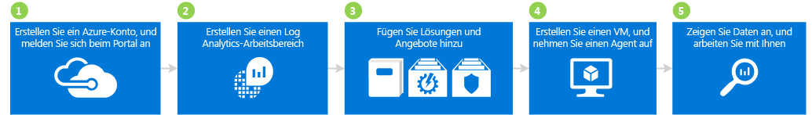

## 1. Erstellen eines Azure-Kontos und Anmelden

Falls Sie noch nicht über ein Azure-Konto verfügen, müssen Sie eines erstellen, um Log Analytics verwenden zu können. Sie können ein [kostenloses Konto](https://azure.microsoft.com/free/) erstellen und damit 30 Tage lang auf alle Azure-Dienste zugreifen.

### So können Sie ein kostenloses Konto erstellen und sich anmelden
1. Folgen Sie der Anleitung unter [Erstellen Sie noch heute Ihr kostenloses Azure-Konto](https://azure.microsoft.com/free/).
2. Wechseln Sie zum [Azure-Portal](https://portal.azure.com), und melden Sie sich an.

## 2. Erstellen eines Arbeitsbereichs

Im nächsten Schritt erstellen Sie einen Arbeitsbereich.

1. Suchen Sie im Azure-Portal in der Marketplace-Dienstliste nach *Log Analytics*, und wählen Sie **Log Analytics** aus.  
    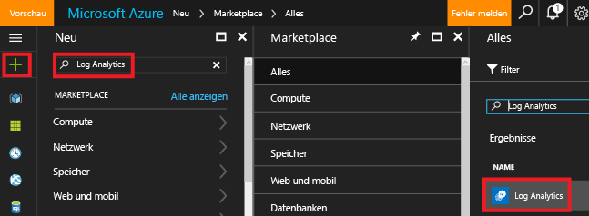
2. Klicken Sie auf **Erstellen**, und wählen Sie anschließend Optionen für die folgenden Elemente aus:
   * **OMS-Arbeitsbereich**: Geben Sie einen Namen für Ihren Arbeitsbereich ein.
   * **Abonnement** : Wenn Sie über mehrere Abonnements verfügen, wählen Sie das Abonnement aus, das Sie dem neuen Arbeitsbereich zuordnen möchten.
   * **Ressourcengruppe**
   * **Standort**
   * **Tarif**  
       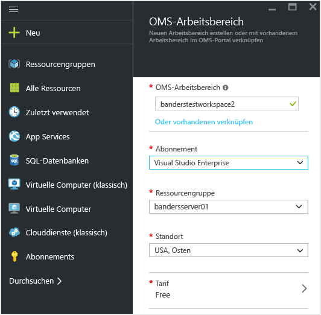
3. Klicken Sie auf **OK**, um eine Liste mit Ihren Arbeitsbereichen anzuzeigen.
4. Wählen Sie einen Arbeitsbereich aus, um dessen Details im Azure-Portal anzuzeigen.       
    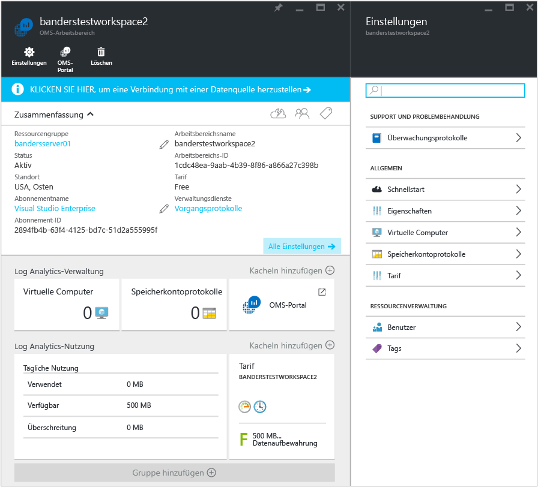         

## 3. Upgrade des Arbeitsbereichs auf eine neue Protokollsuche
Eine neue Log Analytics-Abfragesprache wurde veröffentlicht. Damit Sie sie nutzen können, müssen Sie Ihren Arbeitsbereich konvertieren.  Wenn die Region, in der Ihr Arbeitsbereich gehostet wird, aktualisiert wurde, wird oben im Arbeitsbereich normalerweise ein violettes Banner mit der Einladung zum Konvertieren angezeigt. Das Upgrade ist freiwillig und wirkt sich nicht auf Ihre Verwendung von Log Analytics und hinzugefügte Lösungen aus.  

Weitere Informationen zu den Vorteilen, Überlegungen und Upgradeschritten finden Sie unter [Upgrade des Azure Log Analytics-Arbeitsbereichs auf die neue Protokollsuche](log-analytics-log-search-upgrade.md).  

## 4. Hinzufügen von Lösungen und Lösungsangeboten

Fügen Sie als Nächstes Verwaltungslösungen und Lösungsangebote hinzu. Bei Verwaltungslösungen handelt es sich um eine Sammlung von Logik-, Visualisierungs- und Datenerfassungsregeln, die Metriken zu einem bestimmten Problembereich bereitstellen. In einem Lösungsangebot werden mehrere Verwaltungslösungen zusammengefasst.

Wenn Sie Ihrem Arbeitsbereich Lösungen hinzufügen, kann Log Analytics mithilfe von Agents verschiedene Arten von Daten von Computern sammeln, die mit Ihrem Arbeitsbereich verbunden sind. Auf die Integration von Agents gehen wir später noch ein.

### So fügen Sie Lösungen und Lösungsangebote hinzu

1. Klicken Sie im Azure-Portal auf **Neu**, geben Sie im Feld **Marketplace durchsuchen** den Suchbegriff **Aktivitätsprotokollanalyse** ein, und drücken Sie anschließend die EINGABETASTE.
2. Wählen Sie auf dem Blatt „Alles“ die Option **Aktivitätsprotokollanalyse** aus, und klicken Sie anschließend auf **Erstellen**.  
    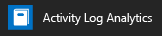  
3. Wählen Sie auf dem Blatt *Name der Verwaltungslösung* einen Arbeitsbereich aus, den Sie der Verwaltungslösung zuordnen möchten.
4. Klicken Sie auf **Create**.  
    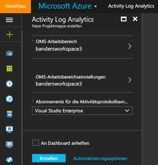  
5. Wiederholen Sie die Schritte 1 bis 4, um Folgendes hinzuzufügen:
    - Das Dienstangebot **Sicherheit und Compliance** mit den Lösungen „Antischadsoftwarebewertung“ und „Security and Audit“.
    - Das Dienstangebot **Automation & Control** mit den Lösungen „Automation Hybrid Worker“, „Change Tracking“ und „System Update Assessment“ (auch „Aktualisierungsverwaltung“ genannt). Sie müssen ein Automation-Konto erstellen, wenn Sie das Lösungsangebot hinzufügen.  
        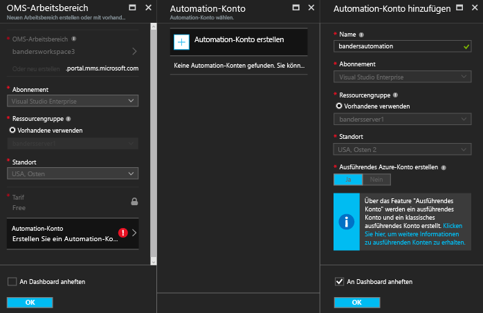  
6. Navigieren Sie zum Anzeigen der Verwaltungslösungen, die Sie Ihrem Arbeitsbereich hinzugefügt haben, zu **Log Analytics** > **Abonnements** > ***Name des Arbeitsbereichs*** > **Übersicht**. Die hinzugefügten Verwaltungslösungen werden als Kacheln angezeigt.  
    >[!NOTE]
    >Da wir noch keine Agents mit dem Arbeitsbereich verbunden haben, werden für die hinzugefügten Lösungen noch keine Daten angezeigt.  

    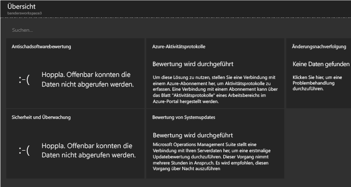

## 4. Erstellen eines virtuellen Computers und Integrieren eines Agents

Erstellen Sie als Nächstes einen einfachen virtuellen Computer in Azure. Integrieren Sie danach den OMS-Agent, um ihn zu aktivieren. Nach der Aktivierung des Agents werden Daten des virtuellen Computers gesammelt und an Log Analytics gesendet.

### So erstellen Sie einen virtuellen Computer

- Führen Sie die unter [Erstellen Ihres ersten virtuellen Windows-Computers im Azure-Portal](../virtual-machines/virtual-machines-windows-hero-tutorial.md) beschriebenen Schritte aus, und starten Sie den neuen virtuellen Computer.

### Herstellen einer Verbindung zwischen dem virtuellen Computer und Log Analytics

- Führen Sie die unter [Verbinden von virtuellen Azure-Computern mit Log Analytics](log-analytics-azure-vm-extension.md) beschriebenen Schritte aus, um über das Azure-Portal eine Verbindung zwischen dem virtuellen Computer und Log Analytics herzustellen.

## 6. Anzeigen und Nutzen der Daten

Sie haben bereits die Activity Log Analytics-Lösung und die Dienstangebote „Sicherheit und Compliance“ und „Automation & Control“ aktiviert. Als Nächstes sehen wir uns von den Lösungen gesammelte Daten und Ergebnisse in Protokollsuchen an.

Sehen Sie sich zunächst Daten an, die innerhalb der Lösungen angezeigt werden. Sehen Sie dann einige Protokollsuchen an, auf die über Protokollsuchen zugegriffen wird. Protokollsuchen ermöglichen Ihnen das Kombinieren und Korrelieren beliebiger Computerdaten aus mehreren Quellen in Ihrer Umgebung. Weitere Informationen finden Sie unter [Suchen von Daten mit Protokollsuchen in Log Analytics](log-analytics-log-searches.md). Wenn Sie den Arbeitsbereich in die neue Abfragesprache konvertiert haben, lesen Sie die Informationen unter [Grundlegendes zu Protokollsuchvorgängen in Log Analytics](log-analytics-log-search-new.md). 

### So zeigen Sie Antischadsoftware-Daten an

1. Navigieren Sie im Azure-Portal zu **Log Analytics** > ***Ihr Arbeitsbereich***.
2. Klicken Sie auf dem Blatt für Ihren Arbeitsbereich unter **Allgemein** auf **Übersicht**.  
    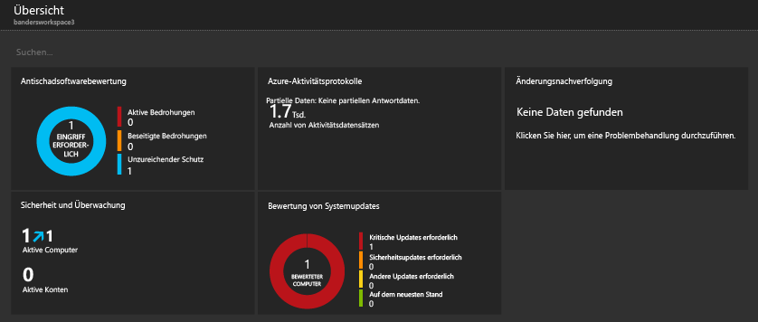
3. Klicken Sie auf die Kachel **Antischadsoftwarebewertung**. In diesem Beispiel sehen Sie, dass Windows Defender auf einem Computer installiert, die Signatur aber veraltet ist.  
    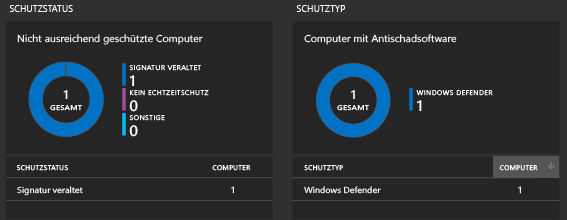
4. Klicken Sie in diesem Beispiel unter **Schutzstatus** auf **Veraltete Signatur**, um die Protokollsuche zu öffnen und Details zu den Computern mit veralteten Signaturen anzuzeigen. Der Name des Computers lautet in diesem Beispiel *getstarted*. Sollten mehrere Computer mit veralteten Signaturen vorhanden sein, werden alle in den Ergebnissen der Protokollsuche angezeigt.  
    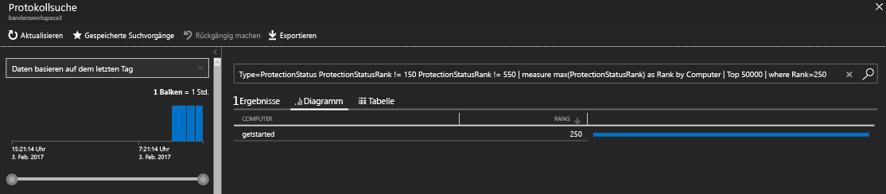

### So zeigen Sie Sicherheits- und Überwachungsdaten an

1. Klicken Sie auf dem Blatt für Ihren Arbeitsbereich unter **Allgemein** auf **Übersicht**.  
2. Klicken Sie auf die Kachel **Security and Audit**. In diesem Beispiel sehen Sie, dass zwei relevante Probleme vorliegen: Bei einem Computer fehlen kritische Updates, und ein Computer ist nicht ausreichend geschützt.  
    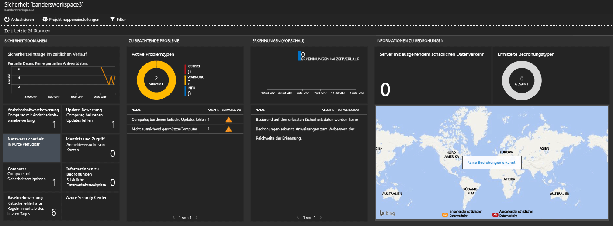
3. Klicken Sie in diesem Beispiel unter **Relevante Probleme** auf **Computers missing critical updates** (Computer mit fehlenden kritischen Updates), um die Protokollsuche zu öffnen und Details zu Computern anzuzeigen, auf denen kritische Updates fehlen. In diesem Beispiel fehlen ein kritisches Update noch 63 andere Updates.  
    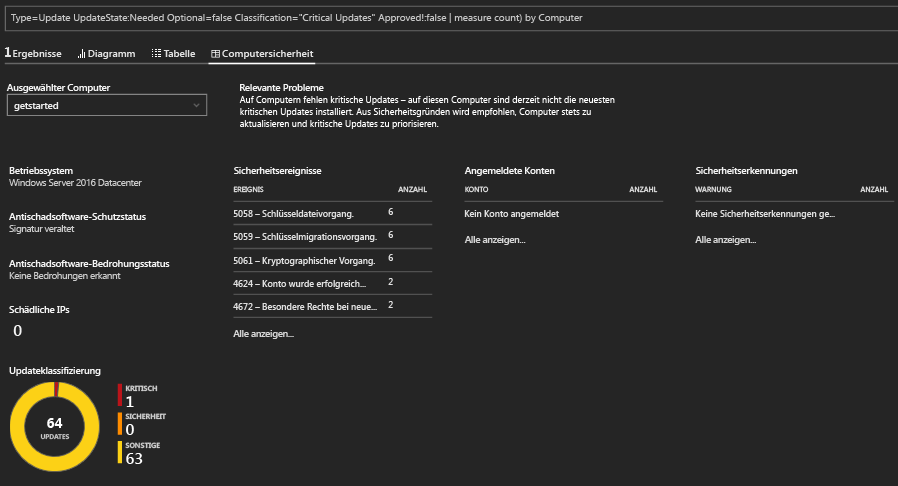

### So können Sie Systemupdatedaten anzeigen und als Grundlage für Aktionen verwenden

1. Klicken Sie auf dem Blatt für Ihren Arbeitsbereich unter **Allgemein** auf **Übersicht**.  
2. Klicken Sie auf die Kachel **System Update Assessment**. In diesem Beispiel sehen Sie, dass ein Windows-Computer namens *getstarted* kritische Updates und ein anderer Computer Definitionsupdates benötigt.  
    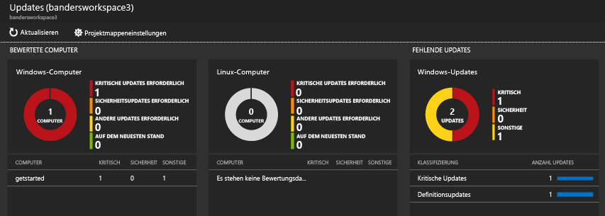
3. Klicken Sie in diesem Beispiel unter **Fehlende Updates** auf **Kritische Updates**, um die Protokollsuche zu öffnen und Details zu Computern anzuzeigen, auf denen kritische Updates fehlen. Dieses Beispiel umfasst ein fehlendes und ein erforderliches Update.  
    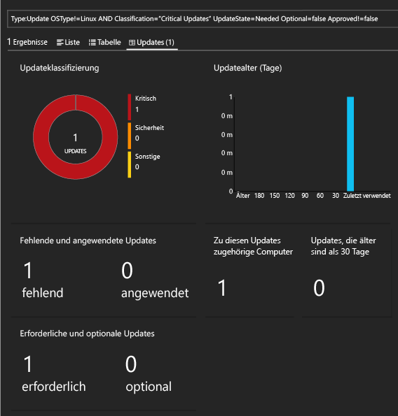
4. Melden Sie sich auf der Website der [Operations Management Suite](http://microsoft.com/oms) mit Ihrem Azure-Konto an. Nach der Anmeldung sehen Sie, dass die Lösungsinformationen den Informationen im Azure-Portal ähneln.  
    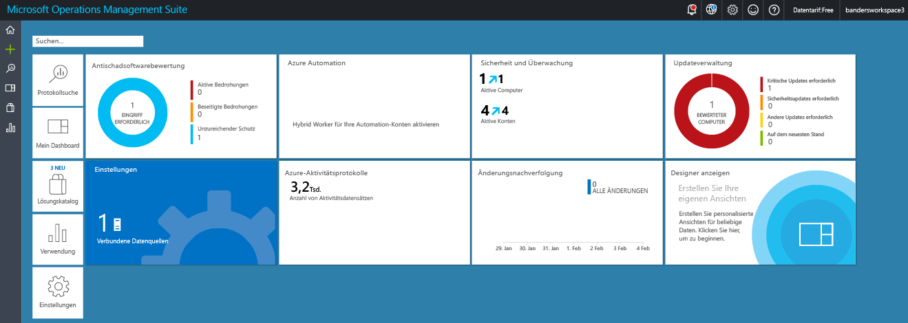
5. Klicken Sie auf die Kachel **Aktualisierungsverwaltung**.
6. Auf dem Dashboard der Aktualisierungsverwaltung sehen Sie, dass die angezeigten Systemupdateinformationen den Informationen im Azure-Portal ähneln. Die Kachel **Manage Update Deployments** (Updatebereitstellungen verwalten) ist allerdings neu. Klicken Sie auf die Kachel **Manage Update Deployments** (Updatebereitstellungen verwalten).  
    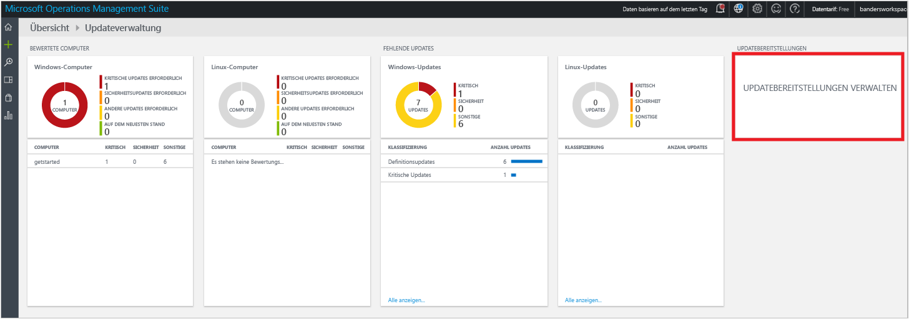
7. Klicken Sie auf der Seite **Updatebereitstellungen** auf **Hinzufügen**, um eine *Updateausführung* zu erstellen.  
    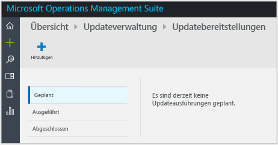
8.  Geben Sie auf der Seite **New Update Deployment** (Neue Updatebereitstellung) einen Namen für die Updatebereitstellung ein, wählen Sie die zu aktualisierenden Computer (in diesem Beispiel: *getstarted*) aus, wählen Sie einen Zeitplan, und klicken Sie anschließend auf **Speichern**.  
    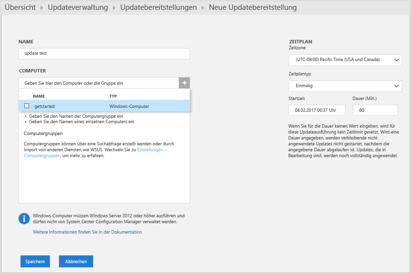  
    Nach dem Speichern der Bereitstellung wird die geplante Aktualisierung angezeigt.  
    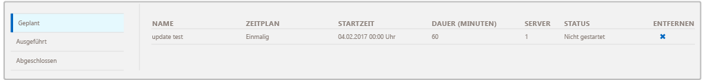  
    Nach Abschluss der Updateausführung wird der Status **Beendet** angezeigt.
    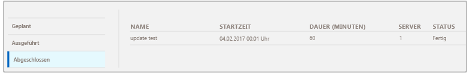
9. Nach Abschluss der Updateausführung können Sie überprüfen, ob die Ausführung erfolgreich war, und Details zu den angewendeten Updates anzeigen.

## Nach der Auswertung

In diesem Tutorial haben Sie einen Agent auf einem virtuellen Computer installiert und schnell Ergebnisse erzielt. Die erforderlichen Schritte waren schnell und einfach auszuführen. Die meisten großen Organisationen und Unternehmen verfügen jedoch über komplexe lokale IT-Infrastrukturen. Die Datenerfassung in solch komplexen Umgebungen ist daher mit zusätzlichem Planungs- und Arbeitsaufwand verbunden. Machen Sie sich mit den Informationen aus dem Abschnitt mit den nächsten Schritten vertraut. Dort finden Sie Links zu hilfreichen Artikeln.

Sie können optional auch den Arbeitsbereich entfernen, den Sie im Rahmen dieses Tutorials erstellt haben.

## Nächste Schritte
* Informieren Sie sich über das Herstellen einer Verbindung zwischen [Windows-Agents](log-analytics-windows-agents.md) und Log Analytics.
* Informieren Sie sich über das Herstellen einer Verbindung zwischen [Operations Manager-Agents](log-analytics-om-agents.md) und Log Analytics.
* [Fügen Sie Log Analytics-Lösungen aus dem Lösungskatalog hinzu](log-analytics-add-solutions.md) , um Funktionen hinzuzufügen und Daten zu sammeln.
* Machen Sie sich mit [Protokollsuchvorgängen](log-analytics-log-searches.md) vertraut, um ausführliche Informationen anzuzeigen, die von Lösungen gesammelt werden.

