# Erste Schritte mit Log Analytics
Log Analytics ist innerhalb weniger Minuten in der Microsoft Operations Management Suite (OMS) einsatzbereit. Bei der Erstellung eines OMS-Arbeitsbereichs, der einem Konto ähnelt, haben Sie zwei Möglichkeiten:

* Microsoft Operations Management Suite-Website
* Microsoft Azure-Abonnement

Über die OMS-Website können Sie einen kostenlosen OMS-Arbeitsbereich erstellen. Alternativ können Sie ein Microsoft Azure-Abonnement verwenden, um einen kostenlosen Log Analytics-Arbeitsbereich zu erstellen. Die erstellten Arbeitsbereiche bieten in beiden Fällen die gleichen Funktionen. Bei kostenlosen Arbeitsbereichen können pro Tag nur 500 MB an Daten an den OMS-Dienst gesendet werden. Da alle Arbeitsbereiche ein Azure-Abonnement erfordern, können Sie mit Ihrem Abonnement auch auf andere Azure-Dienste zugreifen. Unabhängig von der Methode, die Sie zum Erstellen des Arbeitsbereichs wählen, erstellen Sie den Arbeitsbereich entweder mit einem Microsoft-Konto oder einem Unternehmenskonto.

Hier wird die Vorgehensweise erläutert:

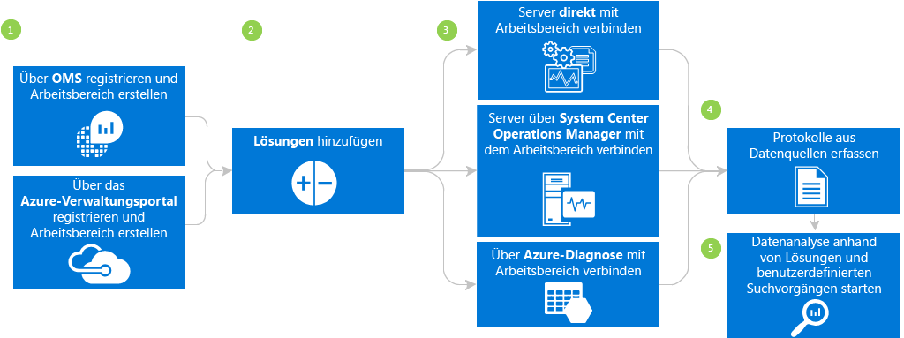

## Log Analytics-Voraussetzungen und -Bereitstellungsaspekte
* Sie benötigen ein kostenpflichtiges Microsoft Azure-Abonnement, um Log Analytics vollständig nutzen zu können. Falls Sie noch nicht über ein Azure-Abonnement verfügen, können Sie ein [kostenloses Konto](https://azure.microsoft.com/free/) erstellen und damit 30 Tage lang auf alle Azure-Dienste zugreifen. Sie können auch ein kostenloses OMS-Konto auf der Website [Operations Management Suite](http://microsoft.com/oms) erstellen.
* Sie müssen einen Arbeitsbereich erstellen.
* Auf jedem Windows-Computer, von dem Sie Daten erfassen möchten, muss Windows Server 2008 SP1 oder höher ausgeführt werden.
* [Firewall](log-analytics-proxy-firewall.md) zugriff auf die Adressen des OMS-Webdiensts
* Bestimmen Sie, ob Ihre Computer über direkten Internetzugang verfügen. Falls nicht, ist ein Gatewayserver für den Zugriff auf die Websites des OMS-Webdiensts erforderlich. Der gesamte Zugriff erfolgt per HTTPS. Sie können einen [OMS-Gatewayserver](log-analytics-oms-gateway.md) einrichten, um Datenverkehr von Servern an OMS weiterzuleiten, wenn über Computer kein Internetzugriff möglich ist.
* Bei Verwendung von Operations Manager unterstützt Log Analytics die Anwendungen Operations Manager 2012 SP1 UR6 und höher sowie Operations Manager 2012 R2 UR2 und höher. Proxyunterstützung wurde in Operations Manager 2012 SP1 UR7 und Operations Manager 2012 R2 UR3 hinzugefügt. Bestimmen Sie, wie die Integration in OMS erfolgt.
* Bestimmen Sie, welche Technologien und Server Daten an OMS senden. Beispiele: Domänencontroller, SQL Server usw.
* Gewähren Sie Benutzern in OMS und Azure Berechtigungen.
* Falls Sie Bedenken wegen der Datennutzung haben, können Sie jede Lösung einzeln bereitstellen und die Auswirkungen auf die Leistung testen, bevor Sie weitere Lösungen hinzufügen.
* Überprüfen Sie die Datennutzung und Leistung, wenn Sie Log Analytics Lösungen und Features hinzufügen. Dies umfasst die Ereignissammlung, Protokollsammlung, Leistungsdatensammlung usw. Es ist besser, mit einer minimalen Sammlung zu beginnen, bis die Auswirkungen der Datennutzung bzw. der Leistung ermittelt wurden.
* Stellen Sie sicher, dass Windows-Agents nicht auch mit Operations Manager verwaltet werden, da es sonst zu einer Duplizierung von Daten kommt. Dies gilt auch für Azure-basierte Agents, für die die Azure-Diagnose aktiviert ist.
* Vergewissern Sie sich nach dem Installieren von Agents, dass der Agent jeweils richtig funktioniert. Falls nicht, sollten Sie sicherstellen, dass die CNG-Schlüsselisolation (Cryptography API Next Generation) nicht durch die Gruppenrichtlinie deaktiviert wurde.
* Einige Log Analytics-Lösungen verfügen über zusätzliche Anforderungen

## Registrieren in drei Schritten mit OMS
1. Rufen Sie die Website [Operations Management Suite](http://microsoft.com/oms) auf. Melden Sie sich zur Verwendung mit Office 365 oder anderen Microsoft-Diensten mit Ihrem Microsoft-Konto, z. B. Outlook.com, oder mit einem vom Unternehmen oder der Bildungseinrichtung bereitgestellten Organisationskonto an.
2. Geben Sie einen eindeutigen Namen für den Arbeitsbereich ein. Ein Arbeitsbereich ist ein logischer Container, in dem die Verwaltungsdaten gespeichert werden. Er bietet eine Möglichkeit zum Partitionieren von Daten zwischen verschiedenen Teams in Ihrer Organisation, während die Daten für den Arbeitsbereich exklusiv sind. Geben Sie eine E-Mail-Adresse und die Region an, in der Ihre Daten gespeichert werden sollen.  
    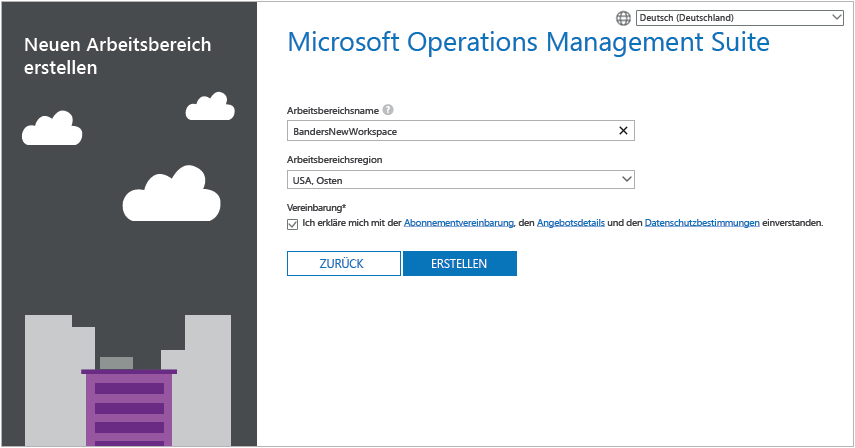
3. Erstellen Sie als Nächstes ein neues kostenloses Azure-Abonnement oder eine Verknüpfung mit einem bereits vorhandenen Azure-Abonnement.  
   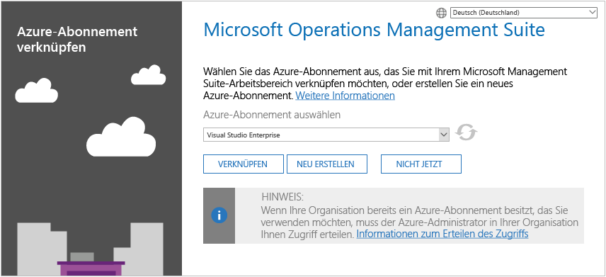

Sie sind nun bereit, im Operations Management Suite-Portal loszulegen.

Unter [Verwalten von Arbeitsbereichen](log-analytics-manage-access.md) erfahren Sie mehr über das Einrichten Ihres Arbeitsbereichs und das Verknüpfen vorhandener Azure-Konten mit Arbeitsbereichen, die mit Operations Management Suite erstellt wurden.

## Schnelles Registrieren mit Microsoft Azure
1. Wechseln Sie zum [Azure-Portal](https://portal.azure.com), und melden Sie sich an. Durchsuchen Sie die Liste mit den Diensten, und wählen Sie **Log Analytics** aus.  
    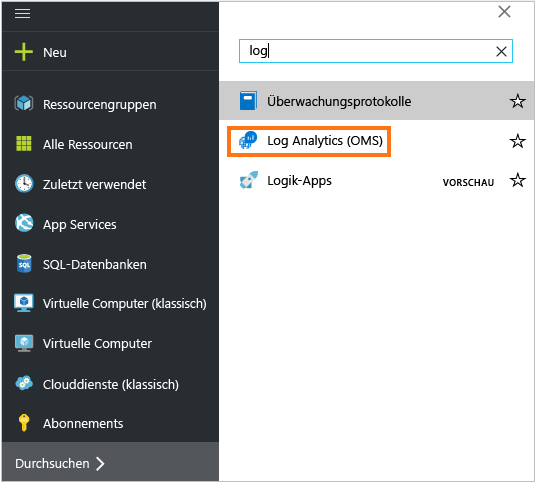
2. Klicken Sie auf **Hinzufügen**, und wählen Sie dann die Optionen für die folgenden Elemente:
   * **OMS-Arbeitsbereich**
   * **Abonnement** : Wenn Sie über mehrere Abonnements verfügen, wählen Sie das Abonnement aus, das Sie dem neuen Arbeitsbereich zuordnen möchten.
   * **Ressourcengruppe**
   * **Standort**
   * **Tarif**  
       
3. Klicken Sie auf **OK**. Eine Liste mit Ihren Arbeitsbereichen wird angezeigt.
4. Wählen Sie einen Arbeitsbereich aus, um dessen Details im Azure-Portal anzuzeigen.       
             
5. Klicken Sie auf den Link zum **OMS-Portal** , um die Operations Management Suite-Website mit Ihrem neuen Arbeitsbereich zu öffnen.

Sie sind jetzt bereit, das Portal der Operations Management Suite zu nutzen.

Unter [Verwalten des Zugriffs auf Log Analytics](log-analytics-manage-access.md)erfahren Sie mehr über das Einrichten des Arbeitsbereichs und das Verknüpfen vorhandener Arbeitsbereiche, die Sie mit Operations Management Suite für Azure-Abonnements erstellt haben.

## Erste Schritte mit dem Operations Management Suite-Portal
Um Lösungen zu wählen und die Server zu verbinden, die Sie verwalten möchten, klicken Sie auf die Kachel **Einstellungen** und führen die Schritte in diesem Abschnitt aus.  

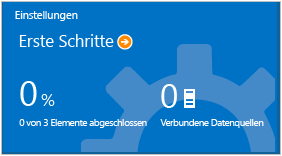  

1. **Lösungen anzeigen**: Zeigen Sie Ihre installierten Lösungen an.  
    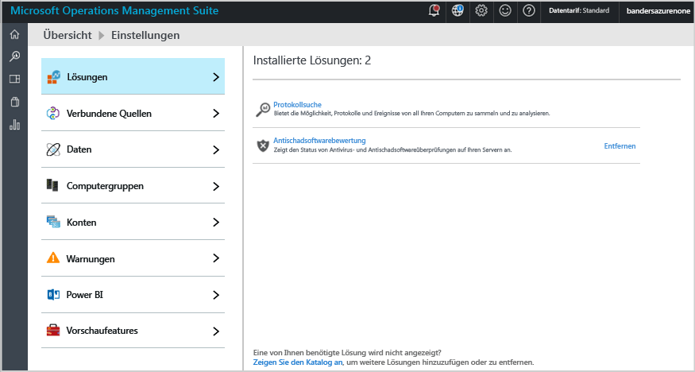  
    Klicken Sie auf **Zeigen Sie den Katalog an**, um weitere Lösungen hinzuzufügen.  
    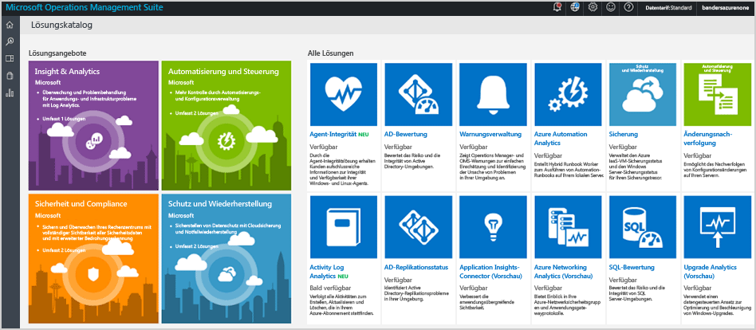  
    Wählen Sie eine Lösung aus, und klicken Sie auf **Hinzufügen**.
2. **Quelle verbinden**: Wählen Sie die Vorgehensweise aus, um eine Verbindung mit der Serverumgebung zum Sammeln von Daten herzustellen:

   * Verbinden Sie alle Windows-Server oder -Clients direkt durch Installieren eines Agents.
   * Stellen Sie für Linux-Server eine Verbindung mit dem OMS-Agent für Linux her.
   * Verwenden Sie ein Azure-Speicherkonto, das mit der Erweiterung der virtuellen Windows- oder Linux Azure-Maschine zur Diagnose konfiguriert ist.
   * Verwenden Sie System Center Operations Manager, um die Verwaltungsgruppen oder die gesamte Operations Manager-Bereitstellung anzufügen.
   * Aktivieren Sie die Windows-Telemetrie für die Verwendung von Upgrade Analytics.
       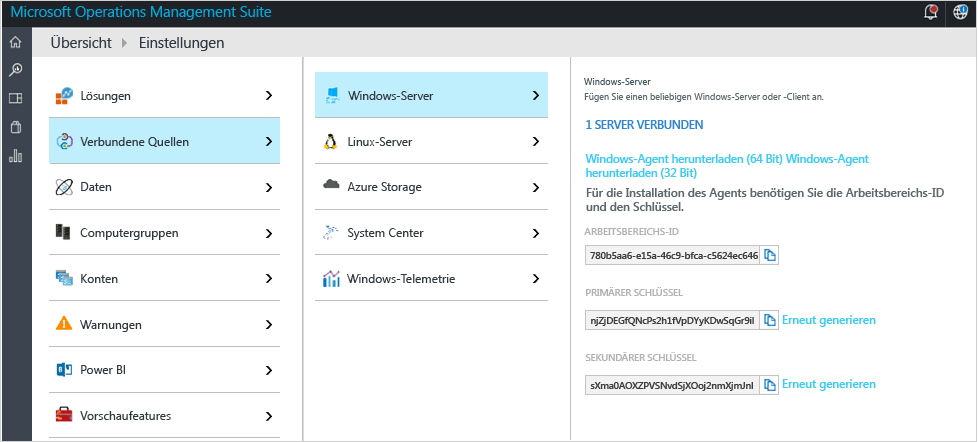    
3. **Daten sammeln**: Konfigurieren Sie mindestens eine Datenquelle für das Auffüllen des Arbeitsbereichs mit Daten. Klicken Sie anschließend auf **Speichern**.    

    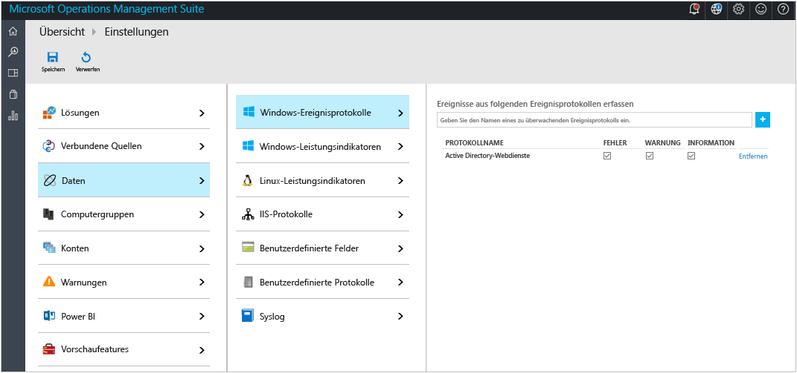    

## Durch Installieren eines Agents können Sie optional eine Verbindung mit Windows-Computern herstellen.
Im folgenden Beispiel wird veranschaulicht, wie Sie einen Windows-Agent installieren.

1. Klicken Sie nacheinander auf die Kachel **Einstellungen**, die Registerkarte **Verbundene Quellen** und eine Registerkarte für den hinzuzufügenden Quellentyp, und laden Sie entweder einen Agent herunter, oder informieren Sie sich über das Aktivieren eines Agents. Klicken Sie beispielsweise auf **Windows-Agent herunterladen (64 Bit)**. Bei Windows-Agents können Sie den Agent nur unter Windows Server 2008 SP1 oder höher oder unter Windows 7 SP1 oder höher installieren.
2. Installieren Sie den Agent auf einem oder mehreren Servern. Sie können Agents nacheinander oder mithilfe einer automatisierten Methode mit einem [benutzerdefinierten Skript](log-analytics-windows-agents.md)installieren, oder Sie nutzen eine bereits vorhandene Softwareverteilungslösung.
3. Nachdem Sie dem Lizenzvertrag zugestimmt und den Installationsordner ausgewählt haben, können Sie die Option **Connect the agent to Azure Log Analytics (OMS)** (Agent mit Azure Log Analytics (OMS) verbinden) wählen.   
    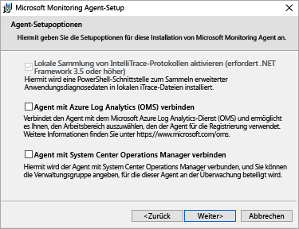
4. Auf der nächsten Seite müssen Sie Ihre Arbeitsbereichs-ID und den Arbeitsbereichsschlüssel eingeben. Ihre Arbeitsbereichs-ID und der Schlüssel werden auf dem Bildschirm angezeigt, auf dem Sie die Agent-Datei heruntergeladen haben.  
    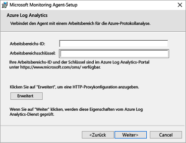  

    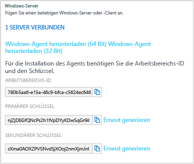
5. Während der Installation können Sie auf **Erweitert** klicken, um optional Ihren Proxyserver einzurichten und Authentifizierungsinformationen bereitzustellen. Klicken Sie auf die Schaltfläche **Weiter** , um zum Informationsbildschirm des Arbeitsbereichs zurückzukehren.
6. Klicken Sie auf **Weiter** , um Ihre Arbeitsbereichs-ID und den Schlüssel zu überprüfen. Wenn Fehler gefunden werden, können Sie auf **Zurück** klicken, um Korrekturen vorzunehmen. Wenn Ihr Arbeitsbereichs-ID und der Schlüssel erfolgreich überprüft wurden, klicken Sie zum Abschließen der Installation des Agents auf **Installieren** .
7. Klicken Sie in der Systemsteuerung auf „Microsoft Monitoring Agent“ > Registerkarte „Azure Log Analytics (OMS)“. Ein grünes Häkchen wird angezeigt, wenn die Agents mit dem Operations Management Suite-Dienst kommunizieren. Zunächst wird dies ungefähr 5 bis 10 Minuten dauern.

> [!NOTE]
> Kapazitätsverwaltungs- und Konfigurationsbewertungs-Lösungen werden von Servern derzeit nicht unterstützt, die direkt mit der Operations Management Suite verbunden sind.

Sie können auch den Agent mit System Center Operations Manager 2012 SP1 und höher verbinden. Zu diesem Zweck wählen Sie **Verbinden des Agents mit System Center Operations Manager**. Wenn Sie diese Option auswählen, senden Sie Daten an den Dienst, ohne dass zusätzliche Hardware oder Last für Ihre Verwaltungsgruppen erforderlich ist.

Weitere Informationen zum Verbinden von Agents mit der Operations Management Suite finden Sie unter [Verbinden von Windows-Computern mit Log Analytics](log-analytics-windows-agents.md).

## Optional können Sie Server mithilfe von System Center Operations Manager verbinden.
1. Wählen Sie in der Operations Manager-Konsole **Verwaltung**.
2. Erweitern Sie den Knoten **Operational Insights**, und wählen Sie dann **Operational Insights-Verbindung**.

   > [!NOTE]
   > Je nachdem, welches Updaterollup von SCOM Sie verwenden, wird Ihnen ein Knoten für *System Center Advisor*, *Operational Insights* oder *Operations Management Suite* angezeigt.
   >
   >
3. Klicken Sie oben rechts auf den Link **Registrieren bei Operational Insights** , und befolgen Sie die Anweisungen.
4. Klicken Sie nach Abschluss des Registrierungsassistenten auf den Link **Computer/Gruppe hinzufügen** .
5. Im Dialogfeld **Computersuche** können Sie nach Computern oder Gruppen suchen, die von Operations Manager überwacht werden. Wählen Sie Computer oder Gruppen aus, die in Log Analytics aufgenommen werden sollen, und klicken Sie auf **Hinzufügen** und dann auf **OK**. Sie können überprüfen, ob der OMS-Dienst Daten empfängt, indem Sie im Portal der Operations Management Suite zur Kachel **Nutzung** wechseln. Daten sollten in ungefähr 5 bis 10 Minuten angezeigt werden.

Weitere Informationen zum Verbinden von Operations Manager mit Operations Management Suite erhalten Sie unter [Herstellen einer Verbindung zwischen Operations Manager und Log Analytics](log-analytics-om-agents.md).

## Optional, können Sie Daten von Clouddiensten in Microsoft Azure analysieren.
Mit der Operations Management Suite können Sie schnell Ereignis- und IIS-Protokolle für Cloud-Dienste und virtuelle Computer durchsuchen, indem Sie die Diagnose für Azure Cloud-Dienste aktivieren. Weitere Erkenntnisse zu Ihren virtuellen Azure-Computern erhalten Sie auch durch Installieren von Microsoft Monitoring Agent. Weitere Informationen zum Konfigurieren der Azure-Umgebung für die Verwendung von Operations Management Suite erhalten Sie unter [Herstellen einer Verbindung zwischen Azure-Speichern und Log Analytics](log-analytics-azure-storage.md).

## Nächste Schritte
* [Fügen Sie Log Analytics-Lösungen aus dem Lösungskatalog hinzu](log-analytics-add-solutions.md) , um Funktionen hinzuzufügen und Daten zu sammeln.
* Vertrautmachen mit den [Suchprotokollen](log-analytics-log-searches.md) zur Anzeige von detaillierten Informationen, die von Lösungen gesammelt wurden.
* Verwenden von [Dashboards](log-analytics-dashboards.md) zum Speichern und Anzeigen von eigenen benutzerdefinierten Suchvorgängen.

<!--HONumber=Dec16_HO2-->

