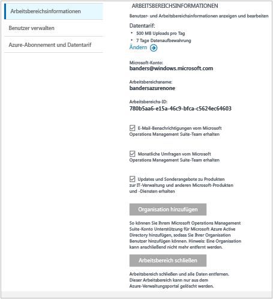

# Verwalten des Zugriffs auf Log Analytics
Zum Verwalten des Zugriffs auf Log Analytics werden verschiedene Verwaltungsaufgaben für Benutzer, Konten, OMS-Arbeitsbereiche und Azure-Konten verwendet. Wählen Sie zum Erstellen eines neuen Arbeitsbereichs in der Operations Management Suite (OMS) einen Arbeitsbereichsnamen, den Sie Ihrem Konto zuordnen, sowie einen geografischen Standort. Ein Arbeitsbereich ist im Wesentlichen ein Container, der Kontoinformationen und einfache Konfigurationsinformationen für das Konto enthält. Sie oder andere Mitglieder Ihrer Organisation können mehrere OMS-Arbeitsbereiche nutzen, um unterschiedliche Mengen von Daten zu verwalten, die in Ihrer gesamten IT-Infrastruktur oder Teilen davon erfasst werden.

Der Artikel [Erste Schritte mit Log Analytics](log-analytics-get-started.md) beschäftigt sich mit der Einrichtung. Der vorliegende Artikel hingegen beschreibt einige der Aktionen ausführlicher, die Sie zum Verwalten des Zugriffs auf OMS ausführen müssen.

Auch wenn Sie nicht alle Verwaltungsaufgaben gleich ausführen müssen, werden hier die häufig ausgeführten Aufgaben behandelt, die Sie in den folgenden Abschnitten unter Umständen benötigen:

* Bestimmen der benötigten Anzahl von Arbeitsbereichen
* Verwalten von Konten und Benutzern
* Hinzufügen einer Gruppe zu einem vorhandenen Arbeitsbereich
* Verknüpfen eines vorhandenen Arbeitsbereichs mit einem Azure-Abonnement
* Upgrade eines Arbeitsbereichs auf einen kostenpflichtigen Datenplan
* Ändern des Datenplantyps
* Hinzufügen einer Azure Active Directory-Organisation zu einem vorhandenen Arbeitsbereich
* Schließen Ihres OMS-Arbeitsbereichs

## Bestimmen der benötigten Anzahl von Arbeitsbereichen
Ein Arbeitsbereich ist eine Azure-Ressource. Es handelt sich hierbei um einen Container, in dem Daten gesammelt, aggregiert, analysiert und im OMS-Portal angezeigt werden.

Es ist möglich, mehrere OMS Log Analytics-Arbeitsbereiche zu erstellen, und Benutzer können Zugriff auf einen oder mehrere Arbeitsbereiche haben. Meist ist es ratsam, die Anzahl von Arbeitsbereichen zu reduzieren, da Sie auf diese Weise die meisten Daten abfragen und korrelieren können. In diesem Abschnitt wird beschrieben, wann es hilfreich sein kann, mehr als einen Arbeitsbereich zu erstellen.

Ein Log Analytics-Arbeitsbereich bietet derzeit Folgendes:

* Einen geografischen Standort für die Speicherung von Daten
* Granularität für die Abrechnung
* Datenisolation

Basierend auf den obigen Merkmalen sollten Sie mehrere Arbeitsbereiche erstellen, wenn Folgendes gilt:

* Sie sind ein globales Unternehmen und müssen Daten aus Gründen der Datensouveränität bzw. aus Compliancegründen in bestimmten Regionen speichern.
* Sie nutzen Azure und möchten Gebühren für ausgehende Datenübertragungen vermeiden, indem Sie einen Log Analytics-Arbeitsbereich in derselben Region wie die verwalteten Azure-Ressourcen nutzen.
* Sie möchten Gebühren basierend auf der Nutzung unterschiedlichen Abteilungen bzw. Geschäftseinheiten zuordnen. Wenn Sie einen Arbeitsbereich für jede Abteilung bzw. Geschäftseinheit erstellen, werden die Gebühren in Ihrer Azure-Rechnung und Nutzungsaufstellung für jeden Arbeitsbereich separat aufgeführt.
* Sie sind ein Service Provider mit Verwaltung und müssen die Log Analytics-Daten für jeden Kunden, den Sie verwalten, von den Daten der anderen Kunden isolieren.
* Sie verwalten mehrere Kunden und möchten erreichen, dass jeder Kunde, jede Abteilung oder jede Geschäftseinheit die eigenen Daten sieht, aber nicht die Daten für andere Kunden, Abteilungen oder Geschäftseinheiten.

Wenn Sie Agents zum Sammeln von Daten verwenden, können Sie jeden Agent so konfigurieren, dass er Daten an den erforderlichen Arbeitsbereich liefert.

Wenn Sie System Center Operations Manager verwenden, kann jede Operations Manager-Verwaltungsgruppe nur mit einem Arbeitsbereich verbunden werden. Sie können den Microsoft Monitoring Agent auf Computern installieren, die mit Operations Manager verwaltet werden, und den Agent so einrichten, dass er sowohl Daten an Operations Manager als auch an einen anderen Log Analytics-Arbeitsbereich liefert.

### Informationen zum Arbeitsbereich
Im OMS-Portal können Sie Ihre Informationen zum Arbeitsbereich anzeigen und angeben, ob Sie Informationen von Microsoft erhalten möchten.

#### Anzeigen von Informationen zum Arbeitsbereich
1. Klicken Sie in OMS auf die Kachel **Einstellungen** .
2. Klicken Sie auf Registerkarte **Konten** .
3. Klicken Sie auf die Registerkarte **Arbeitsbereichsinformationen**.  
   

## Verwalten von Konten und Benutzern
Jedem Arbeitsbereich können mehrere Benutzerkonten zugeordnet sein, wobei jedes Benutzerkonto (Microsoft- oder Organisationskonto) Zugriff auf mehrere OMS-Arbeitsbereiche hat.

Standardmäßig wird der Besitzer des Microsoft- oder Organisationskontos, das zum Erstellen des Arbeitsbereichs verwendet wird, zum Administrator des Arbeitsbereichs. Der Administrator kann anschließend zusätzliche Microsoft-Konten einladen oder Benutzer in Azure Active Directory auswählen.

Das Gewähren von Zugriff auf den OMS-Arbeitsbereich wird an zwei Stellen gesteuert:

* In Azure können Sie die rollenbasierte Zugriffssteuerung verwenden, um den Zugriff auf das Azure-Abonnement und die dazugehörigen Azure-Ressourcen bereitzustellen. Sie wird auch für den Zugriff auf PowerShell und die REST-API verwendet.
* Im OMS-Portal besteht nur Zugriff auf das OMS-Portal, nicht auf das zugeordnete Azure-Abonnement.

Wenn Sie Benutzern Zugriff auf das OMS-Portal gewähren, auf das damit verknüpfte Azure-Abonnement aber nicht, werden diesen Benutzern auf den Kacheln für Automation, Backup und Site Recovery keine Daten angezeigt, wenn sie sich am OMS-Portal anmelden.

Damit die Daten in diesen Lösungen allen Benutzern angezeigt werden, benötigen sie mindestens **Lesezugriff** für das mit dem OMS-Arbeitsbereich verknüpfte Automation-Konto, den Sicherungstresor und den Site Recovery-Tresor.   

### Verwalten des Zugriffs auf Log Analytics mit dem Azure-Portal
Wenn Sie Benutzern Zugriff auf den Log Analytics-Arbeitsbereich gewähren, indem Sie Azure-Berechtigungen verwenden (z.B. im Azure-Portal), können diese Benutzer auch auf das Log Analytics-Portal zugreifen. Wenn Benutzer sich im Azure-Portal befinden, können sie zum OMS-Portal navigieren, indem sie beim Anzeigen der Log Analytics-Arbeitsbereichressource auf die Aufgabe **OMS-Portal** klicken.

Wichtige Punkte zum Azure-Portal:

* Dies ist keine *rollenbasierte Zugriffssteuerung*. Wenn Sie im Azure-Portal für den Log Analytics-Arbeitsbereich Zugriffsberechtigungen vom Typ *Leser* haben, können Sie Änderungen über das OMS-Portal vornehmen. Für das OMS-Portal wird das Konzept „Administrator“, „Mitwirkender“ und „ReadOnly-Benutzer“ (nur Lesezugriff) verwendet. Wenn sich das Konto, mit dem Sie sich angemeldet haben, in der Azure Active Directory-Instanz mit Verknüpfung zum Arbeitsbereich befindet, gelten Sie im OMS-Portal als Administrator. Andernfalls sind Sie ein Mitwirkender.
* Wenn Sie sich mit „http://mms.microsoft.com“ am OMS-Portal anmelden, wird standardmäßig die Liste **Arbeitsbereich auswählen** angezeigt. Sie enthält nur die Arbeitsbereiche, die mit dem OMS-Portal hinzugefügt wurden. Zum Anzeigen der Arbeitsbereiche, auf die Sie mit Ihrem Abonnement Zugriff haben, müssen Sie einen Mandanten als Teil der URL angeben. Beispiel:
  
  `mms.microsoft.com/?tenant=contoso.com` Die Mandanten-ID ist häufig dieser letzte Teil der E-Mail-Adresse, mit der Sie sich anmelden.
* Wenn das Konto, mit dem Sie sich anmelden, ein Konto in der Mandanten-Azure Active Directory-Instanz ist (normalerweise der Fall, sofern Sie sich nicht als CSP anmelden), gelten Sie im OMS-Portal als *Administrator*. Wenn sich Ihr Konto nicht in der Mandanten-Azure Active Directory-Instanz befindet, sind Sie im OMS-Portal ein *Benutzer*.
* Wenn Sie direkt zu einem Portal navigieren möchten, auf das Sie mit Azure-Berechtigungen Zugriff haben, müssen Sie die Ressource als Teil der URL angeben. Es ist möglich, diese URL mit PowerShell abzurufen.
  
  Beispiel: `(Get-AzureRmOperationalInsightsWorkspace).PortalUrl`.
  
  Die URL sieht wie folgt aus: `https://eus.mms.microsoft.com/?tenant=contoso.com&resource=%2fsubscriptions%2faaa5159e-dcf6-890a-a702-2d2fee51c102%2fresourcegroups%2fdb-resgroup%2fproviders%2fmicrosoft.operationalinsights%2fworkspaces%2fmydemo12`

### Verwalten von Benutzern im OMS-Portal
Sie verwalten Benutzer und Gruppen auf der Registerkarte **Benutzer verwalten** unter der Registerkarte **Konten** auf der Seite „Einstellungen“. Dort können Sie in den folgenden Bereichen die Aufgaben ausführen.  

#### Hinzufügen eines Benutzers zu einem vorhandenen Arbeitsbereich
Gehen Sie folgendermaßen vor, um einen Benutzer oder eine Gruppe zu einem OMS-Arbeitsbereich hinzuzufügen. Der Benutzer oder die Gruppe kann alle Warnungen, die diesem Arbeitsbereich zugeordnet sind, anzeigen und darauf reagieren.

> [!NOTE]
> Wenn Sie einen Benutzer oder eine Gruppe aus Ihrem Azure Active Directory-Organisationskonto hinzufügen möchten, müssen Sie zunächst sicherstellen, dass Sie Ihr OMS-Konto mit Ihrer Active Directory-Domäne verknüpft haben. Siehe [Hinzufügen einer Azure Active Directory-Organisation zu einem vorhandenen Arbeitsbereich](#add-an-azure-active-directory-organization-to-an-existing-workspace).
> 
> 

1. Klicken Sie in OMS auf die Kachel **Einstellungen** .
2. Klicken Sie auf die Registerkarte **Konten** und dann auf die Registerkarte **Benutzer verwalten**.
3. Wählen Sie im Abschnitt **Benutzer verwalten** den hinzuzufügenden Kontotyp aus: **Unternehmenskonto**, **Microsoft-Konto** oder **Microsoft-Support**.
   
   * Wenn Sie „Microsoft-Konto“ auswählen, geben Sie die E-Mail-Adresse des Benutzers ein, der dem Microsoft-Konto zugeordnet ist.
   * Wenn Sie „Unternehmenskonto“ auswählen, können Sie einen Teil des Benutzer- oder Gruppennamens bzw. des E-Mail-Alias eingeben. Anschließend wird eine Liste der Benutzer und Gruppen angezeigt. Wählen Sie einen Benutzer oder eine Gruppe aus.
   * Verwenden Sie „Microsoft-Support“, um einem Microsoft-Supportmitarbeiter vorübergehenden Zugriff auf Ihren Arbeitsbereich zu gewähren, damit er bei der Problembehandlung behilflich sein kann.
     
     > [!NOTE]
     > Damit Sie eine optimale Leistung erzielen, sollten Sie die Anzahl von Active Directory-Gruppen, die einem einzelnen OMS-Konto zugeordnet sind, auf drei begrenzen – eines für Administratoren, eines für Mitwirkende und eines für ReadOnly-Benutzer. Mehr Gruppen können sich auf die Leistung von Log Analytics auswirken.
     > 
     > 
4. Wählen Sie den hinzuzufügenden Benutzer- oder Gruppentyp aus: **Administrator**, **Mitwirkender** oder **ReadOnly-Benutzer**.  
5. Klicken Sie auf **Hinzufügen**.
   
   Wenn Sie ein Microsoft-Konto hinzufügen, wird eine Einladung zur Teilnahme am Arbeitsbereich an die angegebene E-Mail-Adresse gesendet. Nachdem der Benutzer die Anweisungen in der Einladung zur Teilnahme an OMS befolgt hat, kann er die Warnungen und Kontoinformationen für dieses OMS-Konto anzeigen, und Sie können die Benutzerinformationen auf der Seite **Einstellungen** auf der Registerkarte **Konten** anzeigen.
   Wenn Sie ein Organisationskonto hinzufügen, kann der Benutzer sofort auf Log Analytics zugreifen.  
   

#### Bearbeiten eines vorhandenen Benutzertyps
Sie können die Kontorolle eines Benutzers ändern, der Ihrem OMS-Konto zugeordnet ist. Sie haben die folgenden Rollenoptionen:

* *Administrator*: Kann Benutzer verwalten, alle Warnungen anzeigen und darauf reagieren sowie Server hinzufügen und entfernen
* *Mitwirkender*: Kann alle Warnungen anzeigen und darauf reagieren sowie Server hinzufügen und entfernen
* *ReadOnly-Benutzer*: Benutzer, die als schreibgeschützt gekennzeichnet sind, können Folgendes nicht durchführen:
  
  1. Lösungen hinzufügen/entfernen Der Lösungskatalog ist ausgeblendet
  2. Kacheln unter **Mein Dashboard** hinzufügen/ändern/entfernen
  3. Seiten unter **Einstellungen** anzeigen Die Seiten sind ausgeblendet.
  4. In der Suchansicht: PowerBI-Konfiguration, gespeicherte Suchen und Warnungsaufgaben sind ausgeblendet

#### So bearbeiten Sie ein Konto
1. Klicken Sie in OMS auf die Kachel **Einstellungen** .
2. Klicken Sie auf die Registerkarte **Konten** und dann auf die Registerkarte **Benutzer verwalten**.
3. Wählen Sie die Rolle für den Benutzer, den Sie ändern möchten.
4. Klicken Sie im Bestätigungsdialogfeld auf **Ja**.

### Entfernen eines Benutzers aus einem OMS-Arbeitsbereich
Gehen Sie folgendermaßen vor, um einen Benutzer aus einem OMS-Arbeitsbereich zu entfernen. Beachten Sie, dass dadurch der Arbeitsbereich des Benutzers nicht geschlossen wird. Stattdessen wird die Zuordnung zwischen diesem Benutzer und dem Arbeitsbereich aufgehoben. Wenn ein Benutzer mehreren Arbeitsbereichen zugeordnet ist, kann sich dieser Benutzer weiter bei OMS anmelden und andere Arbeitsbereiche anzeigen.

1. Klicken Sie in OMS auf die Kachel **Einstellungen** .
2. Klicken Sie auf die Registerkarte **Konten** und dann auf die Registerkarte **Benutzer verwalten**.
3. Klicken Sie neben dem Namen des Benutzers, den Sie entfernen möchten, auf **Entfernen**.
4. Klicken Sie im Bestätigungsdialogfeld auf **Ja**.

### Hinzufügen einer Gruppe zu einem vorhandenen Arbeitsbereich
1. Führen Sie die oben unter „So fügen Sie einen Benutzer einem vorhandenen Arbeitsbereich hinzu“ beschriebenen Schritte 1–4 aus.
2. Wählen Sie unter **Benutzer/Gruppe auswählen** die Option **Gruppe**.
   
3. Geben Sie den Anzeigenamen oder die E-Mail-Adresse für die Gruppe ein, die Sie hinzufügen möchten.
4. Wählen Sie in der Liste die gewünschte Gruppe aus, und klicken Sie auf **Hinzufügen**.

## Verknüpfen eines vorhandenen Arbeitsbereichs mit einem Azure-Abonnement
Ein Arbeitsbereich kann auf der Webseite [microsoft.com/oms](https://microsoft.com/oms) erstellt werden.  Es gelten jedoch bestimmte Grenzwerte für diese Arbeitsbereiche. Der wichtigste bei der Verwendung eines kostenlosen Kontos ist die Beschränkung auf 500 MB/Tag für das Hochladen von Daten. Um Änderungen an diesem Arbeitsbereich vorzunehmen, müssen Sie *den vorhandenen Arbeitsbereich mit einem Azure-Abonnement verknüpfen*.

> [!IMPORTANT]
> Damit Sie einen Arbeitsbereich verknüpfen können, muss Ihr Azure-Konto bereits Zugriff auf den Arbeitsbereich haben, zu dem Sie eine Verknüpfung herstellen möchten.  Anders ausgedrückt: Das Konto, das Sie für den Zugriff auf das Azure-Portal verwenden, muss **identisch** mit dem Konto sein, mit dem Sie auf Ihren OMS-Arbeitsbereich zugreifen. Wenn dies nicht der Fall ist, finden Sie weitere Informationen unter [Hinzufügen eines Benutzers zu einem vorhandenen Arbeitsbereich](#add-a-user-to-an-existing-workspace).
> 
> 

### So verknüpfen Sie einen Arbeitsbereich mit einem Azure-Abonnement im OMS-Portal
Um einen Arbeitsbereich mit einem Azure-Abonnement im OMS-Portal zu verknüpfen, muss der angemeldete Benutzer bereits über ein kostenpflichtiges Azure-Konto verfügen. Der Arbeitsbereich, den Sie aktiv verwenden, wird mit dem Azure-Konto verknüpft.

1. Klicken Sie in OMS auf die Kachel **Einstellungen** .
2. Klicken Sie auf die Registerkarte **Konten****Azure Subscription & Data Plan** (Azure-Abonnement und -Datentarif).
3. Klicken Sie auf den Datentarif, den Sie verwenden möchten.
4. Klicken Sie auf **Speichern**.  
   

Der neue Datentarif wird oben auf der Webseite im Menüband des OMS-Portals angezeigt.

### So verknüpfen Sie einen Arbeitsbereich mit einem Azure-Abonnement im Azure-Portal
1. Melden Sie sich beim [Azure-Portal](http://portal.azure.com)an.
2. Suchen Sie nach **Log Analytics (OMS)** , und wählen Sie diese Option aus.
3. Ihre Liste mit den vorhandenen Arbeitsbereichen wird angezeigt. Klicken Sie auf **Hinzufügen**.  
   
4. Klicken Sie unter **OMS Workspace** (OMS-Arbeitsbereich) auf **Or link existing** (Oder vorhandenen einfügen).  
   
5. Klicken Sie auf **Erforderliche Einstellungen konfigurieren**.  
   
6. Daraufhin wird Ihnen eine Liste der Arbeitsbereiche angezeigt, die noch nicht mit Ihrem Azure-Konto verknüpft sind. Wählen Sie einen Arbeitsbereich aus.  
   
7. Bei Bedarf können Sie die Werte für die folgenden Elemente ändern:
   * Abonnement
   * Ressourcengruppe
   * Ort
   * Tarif   
       
8. Klicken Sie auf **Erstellen**. Der Arbeitsbereich ist jetzt mit Ihrem Azure-Konto verknüpft.

> [!NOTE]
> Wenn der Arbeitsbereich, den Sie verknüpfen möchten, hier nicht angezeigt wird, hat Ihr Azure-Abonnement keinen Zugriff auf den OMS-Arbeitsbereich, den Sie auf der OMS-Webseite erstellt haben.  Sie müssen in Ihrem OMS-Arbeitsbereich über die OMS-Webseite Zugriff auf dieses Konto gewähren. Informationen hierzu finden Sie unter [Hinzufügen eines Benutzers zu einem vorhandenen Arbeitsbereich](#add-a-user-to-an-existing-workspace).
> 
> 

## Upgrade eines Arbeitsbereichs auf einen kostenpflichtigen Datenplan
Es gibt drei Arten von Arbeitsbereichsdatenplänen für OMS: **Free**, **Standard** und **Premium**.  Wenn Sie mit einem Plan vom Typ *Free* arbeiten, ist Ihre Datenübertragung auf 500 MB begrenzt.  Sie müssen für den Arbeitsbereich die ***nutzungsbasierte Bezahlung*** aktivieren, um Daten über diesen Grenzwert hinaus erfassen zu können. Sie können Ihren Plantyp jederzeit ändern.  Weitere Informationen zu den Preisen für OMS finden Sie unter [Preise](https://www.microsoft.com/en-us/server-cloud/operations-management-suite/pricing.aspx).

> [!IMPORTANT]
> Pläne für Arbeitsbereiche können nur geändert werden, wenn sie mit einem Azure-Abonnement *verknüpft* sind.  Wenn Sie den Arbeitsbereich in Azure erstellt haben oder *bereits* eine Verknüpfung mit dem Arbeitsbereich hergestellt haben, können Sie diese Meldung ignorieren.  Wenn Sie den Arbeitsbereich mithilfe der [OMS-Website](http://www.microsoft.com/oms) erstellt haben, müssen Sie die unter [Verknüpfen eines vorhandenen Arbeitsbereichs mit einem Azure-Abonnement](#link-an-existing-workspace-to-an-azure-subscription) beschriebenen Schritte ausführen.
> 
> 

### Verwenden von Berechtigungen des OMS-Add-Ons für System Center
Das OMS-Add-On für System Center umfasst eine Berechtigung für den Premium-Plan von OMS Log Analytics (siehe [OMS-Preise](https://www.microsoft.com/en-us/server-cloud/operations-management-suite/pricing.aspx)).

Wenn Sie das OMS-Add-On für System Center kaufen, wird das OMS-Add-On in Ihrem System Center-Vertrag als Berechtigung hinzugefügt. Alle Azure-Abonnements, die im Rahmen dieses Vertrags erstellt werden, können die Berechtigung verwenden. Dadurch können Sie zum Beispiel mehrere OMS-Arbeitsbereiche haben, die die Berechtigung des OMS-Add-Ons verwenden.

Gehen Sie folgendermaßen vor, um sicherzustellen, dass die Berechtigungen des OMS-Add-Ons auf die Verwendung eines OMS-Arbeitsbereichs angewandt werden:

1. Verknüpfen Sie den OMS-Arbeitsbereich mit einem Azure-Abonnement, das zu dem Enterprise Agreement gehört, welches sowohl das gekaufte OMS-Add-On als auch die Azure-Abonnement-Nutzung umfasst.
2. Wählen Sie den Premium-Plan für den Arbeitsbereich aus.

Wenn Sie Ihre Nutzung im Azure- oder OMS-Portal überprüfen, werden die OMS-Add-On-Berechtigungen nicht angezeigt. Allerdings können Sie die Berechtigungen in Enterprise Portal anzeigen.  

Wenn Sie das Azure-Abonnement ändern möchten, mit dem Ihr OMS-Arbeitsbereich verknüpft ist, können Sie das Azure PowerShell-Cmdlet [Move-AzureRmResource](https://msdn.microsoft.com/library/mt652516.aspx) verwenden.

### Verwenden von Azure Commitment von einem Enterprise Agreement
Wenn Sie den eigenständigen Tarif für OMS-Komponenten auswählen, zahlen Sie für jede OMS-Komponenten separat, und die Nutzung wird auf Ihrer Azure-Rechnung ausgewiesen.

Wenn Sie über einen monetären Azure-Verpflichtungsbetrag für die Unternehmensanmeldung verfügen, mit der Ihre Azure-Abonnements verknüpft sind, wird jegliche Nutzung von Log Analytics automatisch mit dem verbleibenden monetären Verpflichtungsbetrag verrechnet.

Wenn Sie das Azure-Abonnement ändern möchten, mit dem der OMS-Arbeitsbereich verknüpft ist, können Sie das Azure PowerShell-Cmdlet [Move-AzureRmResource](https://msdn.microsoft.com/library/mt652516.aspx) verwenden.  

### So ändern Sie einen Arbeitsbereich in einen kostenpflichtigen Datenplan
1. Melden Sie sich beim [Azure-Portal](http://portal.azure.com)an.
2. Suchen Sie nach **Log Analytics (OMS)** , und wählen Sie diese Option aus.
3. Ihre Liste mit den vorhandenen Arbeitsbereichen wird angezeigt. Wählen Sie einen Arbeitsbereich aus.  
   
4. Klicken Sie unter **Einstellungen** auf **Tarif**.  
   
5. Wählen Sie unter **Tarif** einen Datentarif aus, und klicken Sie dann auf **Auswählen**.  
   
6. Wenn Sie die Ansicht im Azure-Portal aktualisieren, sehen Sie, dass der **Tarif** für den ausgewählten Plan aktualisiert wurde.  
   

Nun können Sie Daten erfassen, ohne dass die Beschränkung eines kostenlosen Plans gilt.

## Hinzufügen einer Azure Active Directory-Organisation zu einem vorhandenen Arbeitsbereich
Sie können Ihren Log Analytics-Arbeitsbereich (OMS) einer Azure Active Directory-Domäne zuordnen. Dies ermöglicht es Ihnen, Benutzer aus Active Directory direkt Ihrem OMS-Arbeitsbereich hinzuzufügen, ohne dass ein separates Microsoft-Konto erforderlich ist.

Wenn Sie den Arbeitsbereich über das Azure-Portal erstellen oder den Arbeitsbereich mit einem Azure-Abonnement verknüpfen, wird Azure Active Directory als Unternehmenskonto verknüpft.

Falls Sie den Arbeitsbereich über das OMS-Portal erstellen, werden Sie aufgefordert, eine Verknüpfung mit einem Azure-Abonnement und einem Unternehmenskonto zu erstellen.

### So fügen Sie eine Azure Active Directory-Organisation einem vorhandenen Arbeitsbereich hinzu
1. Klicken Sie in OMS auf der Seite mit den Einstellungen auf **Konten** und anschließend auf die Registerkarte **Workspace Information** (Arbeitsbereichsinformationen).  
2. Überprüfen Sie die Informationen zu Organisationskonten, und klicken Sie dann auf **Organisation hinzufügen**.  
    
3. Geben Sie die Identitätsinformationen des Administrators Ihrer Azure Active Directory-Domäne ein. Anschließend wird Ihnen eine Bestätigung angezeigt, in der angegeben ist, dass Ihr Arbeitsbereich mit Ihrer Azure Active Directory-Domäne verknüpft ist.
    

> [!NOTE]
> Nachdem Ihr Konto mit einem Unternehmenskonto verknüpft wurde, kann die Verknüpfung nicht mehr entfernt oder geändert werden.
> 
> 

## Schließen Ihres OMS-Arbeitsbereichs
Wenn Sie einen OMS-Arbeitsbereich schließen, werden alle Daten im Zusammenhang mit Ihrem Arbeitsbereich 30 Tage nach der Schließung des Arbeitsbereichs aus dem OMS-Dienst gelöscht.

Wenn Sie Administrator sind und mehrere Benutzer mit dem Arbeitsbereich verknüpft sind, wird die Zuordnung zwischen den Benutzern und dem Arbeitsbereich aufgehoben. Wenn die Benutzer anderen Arbeitsbereichen zugeordnet sind, können sie OMS mit diesen Arbeitsbereichen weiter nutzen. Wenn sie jedoch keinen anderen Arbeitsbereichen zugeordnet sind, müssen sie einen neuen Arbeitsbereich erstellen, um OMS verwenden zu können.

### So schließen Sie einen OMS-Arbeitsbereich
1. Klicken Sie in OMS auf die Kachel **Einstellungen** .
2. Klicken Sie auf die Registerkarte **Konten** und dann auf die Registerkarte **Workspace Information** (Arbeitsbereichsinformationen).
3. Klicken Sie auf **Arbeitsbereich schließen**.
4. Wählen Sie einen der Gründe für das Schließen des Arbeitsbereichs aus, oder geben Sie einen anderen Grund in das Textfeld ein.
5. Klicken Sie auf **Arbeitsbereich schließen**.

## Nächste Schritte
* Informationen zum Hinzufügen von Agents und zum Erfassen von Daten finden Sie unter [Verbinden von Windows-Computern mit Log Analytics](log-analytics-windows-agents.md) .
* [Fügen Sie Log Analytics-Lösungen aus dem Lösungskatalog hinzu](log-analytics-add-solutions.md) , um Funktionen hinzuzufügen und Daten zu sammeln.
* [Konfigurieren von Proxy- und Firewalleinstellungen in Log Analytics](log-analytics-proxy-firewall.md) beschreibt, wie Sie vorgehen müssen, damit Agents mit dem Log Analytics-Dienst kommunizieren können, wenn Ihre Organisation einen Proxyserver oder eine Firewall verwendet.

<!--HONumber=Oct16_HO2-->

