# Verwalten von Arbeitsbereichen

Zum Verwalten des Zugriffs auf Log Analytics führen Sie verschiedene Verwaltungsaufgaben für Arbeitsbereiche durch. Dieser Artikel enthält Informationen zu den bewährten Methoden und Verfahren für die Arbeitsbereichsverwaltung. Ein Arbeitsbereich ist im Wesentlichen ein Container, der Kontoinformationen und einfache Konfigurationsinformationen für das Konto enthält. Sie oder andere Mitglieder Ihrer Organisation können mehrere Arbeitsbereiche nutzen, um unterschiedliche Mengen von Daten zu verwalten, die in Ihrer gesamten IT-Infrastruktur oder Teilen davon erfasst werden.

Sie benötigen Folgendes, um einen Arbeitsbereich zu erstellen:

1. Ein Azure-Abonnement
2. Einen Namen für den Arbeitsbereich
3. Zuordnung des Arbeitsbereichs zum Abonnement
4. Ausgewählten geografischen Standort

## Bestimmen der benötigten Anzahl von Arbeitsbereichen
Ein Arbeitsbereich ist eine Azure-Ressource. Es handelt sich hierbei um einen Container, in dem Daten gesammelt, aggregiert, analysiert und im Azure-Portal angezeigt werden.

Es ist möglich, mehrere Arbeitsbereiche zu erstellen, damit Benutzer Zugriff auf einen oder mehrere Arbeitsbereiche haben. Durch Minimieren der Anzahl von Arbeitsbereichen können Sie die meisten Daten übergreifend abfragen und korrelieren. In diesem Abschnitt wird beschrieben, wann es hilfreich sein kann, mehr als einen Arbeitsbereich zu erstellen.

Ein Arbeitsbereich bietet jetzt Folgendes:

* Einen geografischen Standort für die Speicherung von Daten
* Granularität für die Abrechnung
* Datenisolation
* Bereich für die Konfiguration

Auf der Grundlage der obigen Merkmale können Sie in folgenden Szenarien mehrere Arbeitsbereiche erstellen:

* Sie sind ein globales Unternehmen und müssen Daten aus Gründen der Datensouveränität bzw. aus Compliancegründen in bestimmten Regionen speichern.
* Sie nutzen Azure und möchten Gebühren für ausgehende Datenübertragungen vermeiden, indem Sie einen Arbeitsbereich in derselben Region wie die verwalteten Azure-Ressourcen nutzen.
* Sie möchten Gebühren basierend auf der Nutzung unterschiedlichen Abteilungen bzw. Geschäftseinheiten zuordnen. Wenn Sie einen Arbeitsbereich für jede Abteilung bzw. Geschäftseinheit erstellen, werden die Gebühren in Ihrer Azure-Rechnung und Nutzungsaufstellung für jeden Arbeitsbereich separat aufgeführt.
* Sie sind ein Service Provider mit Verwaltung und müssen die Log Analytics-Daten für jeden Kunden, den Sie verwalten, von den Daten der anderen Kunden isolieren.
* Sie verwalten mehrere Kunden und möchten, dass den einzelnen Kunden/Abteilungen/Geschäftseinheiten jeweils nur die eigenen Daten angezeigt werden.

Wenn Sie Agents zum Sammeln von Daten verwenden, können Sie jeden Agent so konfigurieren, dass er Informationen zu mindestens einem Arbeitsbereich meldet.

Bei Verwendung von System Center Operations Manager kann jede Operations Manager-Verwaltungsgruppe mit nur einem Arbeitsbereich verbunden werden. Sie können den Microsoft Monitoring Agent auf Computern installieren, die mit Operations Manager verwaltet werden, und den Agent so einrichten, dass er sowohl Daten an Operations Manager als auch an einen anderen Log Analytics-Arbeitsbereich liefert.

### Informationen zum Arbeitsbereich

Sie können im Azure-Portal die Details zu Ihrem Arbeitsbereich anzeigen. Außerdem können Sie im OMS-Portal Details anzeigen.

#### Anzeigen von Arbeitsbereichsinformationen im Azure-Portal

1. Melden Sie sich mit Ihrem Azure-Abonnement beim [Azure-Portal](https://portal.azure.com) an, sofern Sie noch nicht angemeldet sind.
2. Klicken Sie im Menü **Hub** auf **Weitere Dienste**, und geben Sie in der Liste mit den Ressourcen **Log Analytics** ein. Sobald Sie mit der Eingabe beginnen, wird die Liste auf der Grundlage Ihrer Eingabe gefiltert. Klicken Sie auf **Log Analytics**.  
    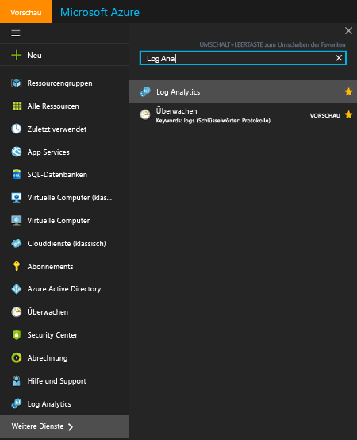  
3. Wählen Sie auf dem Blatt mit den Log Analytics-Abonnements einen Arbeitsbereich aus.
4. Auf dem Blatt zum Arbeitsbereich werden Details zum Arbeitsbereich und Links zu weiteren Informationen angezeigt.  
    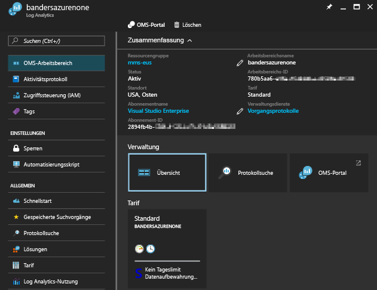  

## Verwalten von Konten und Benutzern
Jedem Arbeitsbereich können mehrere Benutzerkonten zugeordnet sein, wobei jedes Benutzerkonto (Microsoft- oder Organisationskonto) Zugriff auf mehrere Arbeitsbereiche hat.

Standardmäßig wird der Besitzer des Microsoft- oder Organisationskontos, das zum Erstellen des Arbeitsbereichs verwendet wird, zum Administrator des Arbeitsbereichs. Der Administrator kann anschließend zusätzliche Microsoft-Konten einladen oder Benutzer in Azure Active Directory auswählen.

Der Zugriff auf den Arbeitsbereich wird an zwei Stellen gesteuert:

* In Azure können Sie die rollenbasierte Zugriffssteuerung verwenden, um den Zugriff auf das Azure-Abonnement und die dazugehörigen Azure-Ressourcen bereitzustellen. Diese Berechtigungen werden auch für den PowerShell- und den REST-API-Zugriff verwendet.
* Im OMS-Portal besteht nur Zugriff auf das OMS-Portal, nicht auf das zugeordnete Azure-Abonnement.

Daten werden nur dann auf den Kacheln der Backup- und der Site Recovery-Lösung angezeigt, wenn Sie für das Azure-Abonnement, mit dem der Arbeitsbereich verknüpft ist, über die Administrator- oder Co-Administratorberechtigung verfügen.   

### Verwalten des Zugriffs auf Log Analytics mit dem Azure-Portal
Wenn Sie Benutzern Zugriff auf den Log Analytics-Arbeitsbereich gewähren, indem Sie Azure-Berechtigungen verwenden (z.B. im Azure-Portal), können diese Benutzer auch auf das Log Analytics-Portal zugreifen. Wenn Benutzer sich im Azure-Portal befinden, können sie zum OMS-Portal navigieren, indem sie beim Anzeigen der Log Analytics-Arbeitsbereichressource auf die Aufgabe **OMS-Portal** klicken.

Wichtige Punkte zum Azure-Portal:

* Dies ist keine *rollenbasierte Zugriffssteuerung*. Wenn Sie im Azure-Portal für den Log Analytics-Arbeitsbereich Zugriffsberechtigungen vom Typ *Leser* haben, können Sie Änderungen über das OMS-Portal vornehmen. Für das OMS-Portal wird das Konzept „Administrator“, „Mitwirkender“ und „ReadOnly-Benutzer“ (nur Lesezugriff) verwendet. Wenn sich das Konto, mit dem Sie sich angemeldet haben, in der mit dem Arbeitsbereich verknüpften Azure Active Directory-Instanz befindet, sind Sie Administrator im OMS-Portal. Andernfalls sind Sie Mitwirkender.
* Wenn Sie sich über „http://mms.microsoft.com“ beim OMS-Portal anmelden, wird standardmäßig die Liste **Arbeitsbereich auswählen** angezeigt. Sie enthält nur die Arbeitsbereiche, die mit dem OMS-Portal hinzugefügt wurden. Zum Anzeigen der Arbeitsbereiche, auf die Sie mit Azure-Abonnements zugreifen können, müssen Sie als Teil der URL einen Mandanten angeben. Beispiel:

  `mms.microsoft.com/?tenant=contoso.com` Die Mandanten-ID ist häufig dieser letzte Teil der E-Mail-Adresse, die Sie bei der Anmeldung verwenden.
* Wenn das Konto, mit dem Sie sich anmelden, ein Konto in der Azure Active Directory-Mandanteninstanz ist, sind Sie *Administrator* im OMS-Portal. Solange Sie sich nicht als CSP anmelden, ist dies in der Regel der Fall.  Falls sich Ihr Konto nicht in der Azure Active Directory-Mandanteninstanz befindet, sind Sie *Benutzer* im OMS-Portal.
* Wenn Sie direkt zu einem Portal navigieren möchten, auf das Sie mit Azure-Berechtigungen Zugriff haben, müssen Sie die Ressource als Teil der URL angeben. Es ist möglich, diese URL mit PowerShell abzurufen.

  Beispiel: `(Get-AzureRmOperationalInsightsWorkspace).PortalUrl`.

  Die URL sieht wie folgt aus: `https://eus.mms.microsoft.com/?tenant=contoso.com&resource=%2fsubscriptions%2faaa5159e-dcf6-890a-a702-2d2fee51c102%2fresourcegroups%2fdb-resgroup%2fproviders%2fmicrosoft.operationalinsights%2fworkspaces%2fmydemo12`

### Verwalten von Benutzern im OMS-Portal
Sie verwalten Benutzer und Gruppen auf der Registerkarte **Benutzer verwalten** unter der Registerkarte **Konten** auf der Seite „Einstellungen“.   

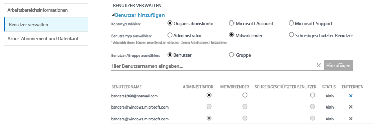

#### Hinzufügen eines Benutzers zu einem vorhandenen Arbeitsbereich
Gehen Sie wie folgt vor, um einen Benutzer oder eine Gruppe einem Arbeitsbereich hinzuzufügen.

1. Klicken Sie im OMS-Portal auf die Kachel **Einstellungen**.
2. Klicken Sie auf die Registerkarte **Konten** und dann auf die Registerkarte **Benutzer verwalten**.
3. Wählen Sie im Abschnitt **Benutzer verwalten** den hinzuzufügenden Kontotyp aus: **Unternehmenskonto**, **Microsoft-Konto** oder **Microsoft-Support**.

   * Wenn Sie „Microsoft-Konto“ auswählen, geben Sie die E-Mail-Adresse des Benutzers ein, der dem Microsoft-Konto zugeordnet ist.
   * Wenn Sie „Unternehmenskonto“ auswählen, können Sie einen Teil des Benutzer- oder Gruppennamens bzw. des E-Mail-Alias eingeben. Anschließend wird in einem Dropdownfeld eine Liste mit passenden Benutzern und Gruppen angezeigt. Wählen Sie einen Benutzer oder eine Gruppe aus.
   * Verwenden Sie „Microsoft-Support“, um einem Microsoft-Supporttechniker oder einem anderen Microsoft-Mitarbeiter vorübergehenden Zugriff auf Ihren Arbeitsbereich zu gewähren, damit er bei der Problembehandlung behilflich sein kann.

     > [!NOTE]
     > Damit Sie eine optimale Leistung erzielen, sollten Sie die Anzahl von Active Directory-Gruppen, die einem einzelnen OMS-Konto zugeordnet sind, auf drei begrenzen – eines für Administratoren, eines für Mitwirkende und eines für ReadOnly-Benutzer. Mehr Gruppen können sich auf die Leistung von Log Analytics auswirken.
     >
     >
4. Wählen Sie den hinzuzufügenden Benutzer- oder Gruppentyp aus: **Administrator**, **Mitwirkender** oder **ReadOnly-Benutzer**.  
5. Klicken Sie auf **Hinzufügen**.

   Wenn Sie ein Microsoft-Konto hinzufügen, wird eine Einladung zur Teilnahme am Arbeitsbereich an die angegebene E-Mail-Adresse gesendet. Nachdem der Benutzer die Anweisungen in der Einladung zur Teilnahme an OMS befolgt hat, kann er auf den Arbeitsbereich zugreifen.
   Wenn Sie ein Organisationskonto hinzufügen, kann der Benutzer sofort auf Log Analytics zugreifen.  

#### Bearbeiten eines vorhandenen Benutzertyps
Sie können die Kontorolle eines Benutzers ändern, der Ihrem OMS-Konto zugeordnet ist. Sie haben die folgenden Rollenoptionen:

* *Administrator*: Kann Benutzer verwalten, alle Warnungen anzeigen und darauf reagieren sowie Server hinzufügen und entfernen
* *Mitwirkender*: Kann alle Warnungen anzeigen und darauf reagieren sowie Server hinzufügen und entfernen
* *ReadOnly-Benutzer*: Als schreibgeschützt gekennzeichnete Benutzer können folgende Aktionen nicht ausführen:

  1. Lösungen hinzufügen/entfernen Der Lösungskatalog ist ausgeblendet
  2. Kacheln unter **Mein Dashboard** hinzufügen/ändern/entfernen
  3. Seiten unter **Einstellungen** anzeigen Die Seiten sind ausgeblendet.
  4. In der Suchansicht: PowerBI-Konfiguration, gespeicherte Suchen und Warnungsaufgaben sind ausgeblendet

#### So bearbeiten Sie ein Konto
1. Klicken Sie im OMS-Portal auf die Kachel **Einstellungen**.
2. Klicken Sie auf die Registerkarte **Konten** und dann auf die Registerkarte **Benutzer verwalten**.
3. Wählen Sie die Rolle für den Benutzer, den Sie ändern möchten.
4. Klicken Sie im Bestätigungsdialogfeld auf **Ja**.

### Entfernen eines Benutzers aus einem Arbeitsbereich
Führen Sie die unten angegebenen Schritte aus, um einen Benutzer aus einem Arbeitsbereich zu entfernen. Durch Entfernen des Benutzers wird der Arbeitsbereich nicht geschlossen. Stattdessen wird die Zuordnung zwischen diesem Benutzer und dem Arbeitsbereich aufgehoben. Wenn ein Benutzer mehreren Arbeitsbereichen zugeordnet ist, kann er sich weiterhin bei OMS anmelden und seine anderen Arbeitsbereiche anzeigen.

1. Klicken Sie im OMS-Portal auf die Kachel **Einstellungen**.
2. Klicken Sie auf die Registerkarte **Konten** und dann auf die Registerkarte **Benutzer verwalten**.
3. Klicken Sie neben dem Namen des Benutzers, den Sie entfernen möchten, auf **Entfernen**.
4. Klicken Sie im Bestätigungsdialogfeld auf **Ja**.

### Hinzufügen einer Gruppe zu einem vorhandenen Arbeitsbereich
1. Führen Sie die oben unter „So fügen Sie einen Benutzer einem vorhandenen Arbeitsbereich hinzu“ beschriebenen Schritte 1–4 aus.
2. Wählen Sie unter **Benutzer/Gruppe auswählen** die Option **Gruppe**.  
   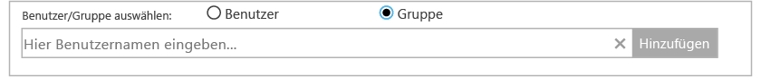
3. Geben Sie den Anzeigenamen oder die E-Mail-Adresse für die Gruppe ein, die Sie hinzufügen möchten.
4. Wählen Sie in der Liste die gewünschte Gruppe aus, und klicken Sie auf **Hinzufügen**.

## Verknüpfen eines vorhandenen Arbeitsbereichs mit einem Azure-Abonnement
Ab dem 26. September 2016 müssen alle Arbeitsbereiche bei der Erstellung mit einem Azure-Abonnement verknüpft werden. Vor diesem Datum erstellte Arbeitsbereiche müssen bei der nächsten Anmeldung mit einem Abonnement verknüpft werden. Wenn Sie den Arbeitsbereich über das Azure-Portal erstellen oder den Arbeitsbereich mit einem Azure-Abonnement verknüpfen, wird Azure Active Directory als Organisationskonto verknüpft.

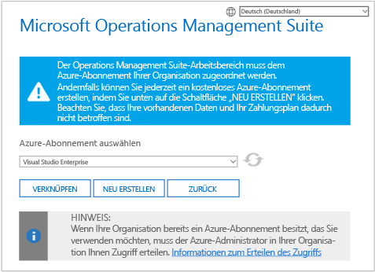

> [!IMPORTANT]
> Damit Sie einen Arbeitsbereich verknüpfen können, muss Ihr Azure-Konto bereits Zugriff auf den zu verknüpfenden Arbeitsbereich haben.  Anders ausgedrückt: Das Konto, das Sie für den Zugriff auf das Azure-Portal verwenden, muss **identisch** mit dem Konto sein, mit dem Sie auf den Arbeitsbereich zugreifen. Ist dies nicht der Fall, lesen Sie unter [Hinzufügen eines Benutzers zu einem vorhandenen Arbeitsbereich](#add-a-user-to-an-existing-workspace) weiter.
>
>

### So verknüpfen Sie einen Arbeitsbereich mit einem Azure-Abonnement im OMS-Portal
Um einen Arbeitsbereich mit einem Azure-Abonnement im OMS-Portal zu verknüpfen, muss der angemeldete Benutzer bereits über ein kostenpflichtiges Azure-Konto verfügen.

1. Klicken Sie im OMS-Portal auf die Kachel **Einstellungen**.
2. Klicken Sie auf die Registerkarte **Konten****Azure Subscription & Data Plan** (Azure-Abonnement und -Datentarif).
3. Klicken Sie auf den Datentarif, den Sie verwenden möchten.
4. Klicken Sie auf **Speichern**.  
   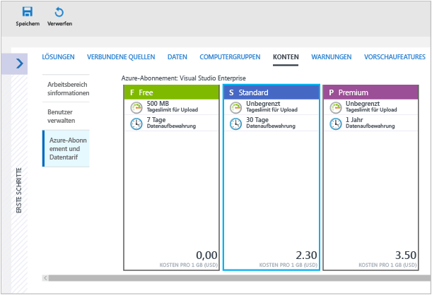

Der neue Datentarif wird oben auf der Webseite im Menüband des OMS-Portals angezeigt.

### So verknüpfen Sie einen Arbeitsbereich mit einem Azure-Abonnement im Azure-Portal
1. Melden Sie sich beim [Azure-Portal](http://portal.azure.com)an.
2. Suchen Sie nach **Log Analytics**, und wählen Sie diese Option aus.
3. Ihre Liste mit den vorhandenen Arbeitsbereichen wird angezeigt. Klicken Sie auf **Hinzufügen**.  
   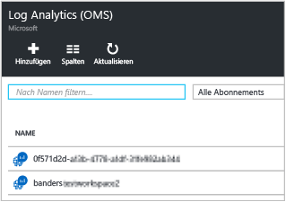
4. Klicken Sie unter **OMS Workspace** (OMS-Arbeitsbereich) auf **Or link existing** (Oder vorhandenen einfügen).  
   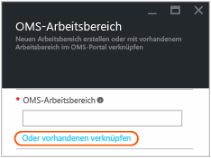
5. Klicken Sie auf **Erforderliche Einstellungen konfigurieren**.  
   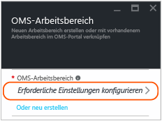
6. Daraufhin wird eine Liste mit Arbeitsbereichen angezeigt, die noch nicht mit Ihrem Azure-Konto verknüpft sind. Wählen Sie einen Arbeitsbereich aus.  
   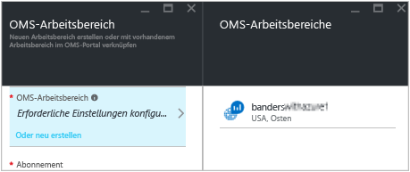
7. Bei Bedarf können Sie die Werte für die folgenden Elemente ändern:
   * Abonnement
   * Ressourcengruppe
   * Ort
   * Tarif   
     
8. Klicken Sie auf **OK**. Der Arbeitsbereich ist jetzt mit Ihrem Azure-Konto verknüpft.

> [!NOTE]
> Wenn der Arbeitsbereich, den Sie verknüpfen möchten, hier nicht angezeigt wird, hat Ihr Azure-Abonnement keinen Zugriff auf den Arbeitsbereich, den Sie auf der OMS-Website erstellt haben.  Unter [Hinzufügen eines Benutzers zu einem vorhandenen Arbeitsbereich](#add-a-user-to-an-existing-workspace) erfahren Sie, wie Sie über das OMS-Portal Zugriff auf dieses Konto gewähren.
>
>

## Upgraden eines Arbeitsbereichs auf einen kostenpflichtigen Plan
Für OMS stehen drei Arten von Arbeitsbereichsplänen zur Verfügung: **Free**, **Eigenständig** und **OMS**.  Bei der Planoption *Free* ist das an Log Analytics gesendete Datenvolumen auf 500 MB pro Tag beschränkt.  Wenn Sie diese Menge überschreiten, müssen Sie Ihren Arbeitsbereich auf einen kostenpflichtigen Plan upgraden, um zu vermeiden, dass die über diesen Grenzwert hinausgehenden Daten nicht erfasst werden. Der Plantyp kann jederzeit geändert werden.  Weitere Informationen zu den Preisen für OMS finden Sie unter [Preise](https://www.microsoft.com/en-us/cloud-platform/operations-management-suite-pricing).

### Verwenden von Berechtigungen aus einem OMS-Abonnement
Wenn Sie die Berechtigungen nutzen möchten, die Sie durch den Kauf von OMS E1, OMS E2 oder des OMS-Add-Ons für System Center erwerben, wählen Sie die Planoption *OMS* von OMS Log Analytics aus.

Beim Kauf eines OMS-Abonnements werden die Berechtigungen Ihrem Enterprise Agreement hinzugefügt. Die Berechtigungen stehen für alle Azure-Abonnements zur Verfügung, die im Rahmen dieses Vertrags erstellt werden. Dadurch können Sie zum Beispiel mehrere Arbeitsbereiche verwenden, die die Berechtigung der OMS-Abonnements verwenden.

Gehen Sie wie folgt vor, um sicherzustellen, dass die Verwendung eines Arbeitsbereichs auf Ihre Berechtigungen des OMS-Abonnements angewendet wird:

1. Erstellen Sie Ihren Arbeitsbereich unter einem Azure-Abonnement, das zum Enterprise Agreement mit dem OMS-Abonnement gehört.
2. Wählen Sie für den Arbeitsbereich die Planoption *OMS* aus.

> [!NOTE]
> Wenn Ihr Arbeitsbereich vor dem 26. September 2016 erstellt wurde und Ihr Log Analytics-Preisplan *Premium* lautet, verwendet dieser Arbeitsbereich Berechtigungen aus dem OMS-Add-On für System Center. Die Berechtigungen können auch durch einen Wechsel zum Tarif *OMS* genutzt werden.
>
>

Die OMS-Abonnementberechtigungen werden im Azure- oder im OMS-Portal nicht angezeigt. Die Berechtigungen und die Nutzung können im Enterprise Portal angezeigt werden.  

Wenn Sie das Azure-Abonnement ändern möchten, mit dem Ihr Arbeitsbereich verknüpft ist, können Sie das Azure PowerShell-Cmdlet [Move-AzureRmResource](https://msdn.microsoft.com/library/mt652516.aspx) verwenden.

### Verwenden von Azure Commitment von einem Enterprise Agreement
Wenn Sie über kein OMS-Abonnement verfügen, wird jede OMS-Komponente separat abgerechnet, und die Nutzung wird auf Ihrer Azure-Rechnung ausgewiesen.

Wenn Sie über einen monetären Azure-Verpflichtungsbetrag für die Unternehmensanmeldung verfügen, mit der Ihre Azure-Abonnements verknüpft sind, wird jegliche Nutzung von Log Analytics automatisch mit dem verbleibenden monetären Verpflichtungsbetrag verrechnet.

Zum Ändern des Azure-Abonnements, mit dem der Arbeitsbereich verknüpft ist, können Sie das Azure PowerShell-Cmdlet [Move-AzureRmResource](https://msdn.microsoft.com/library/mt652516.aspx) verwenden.  

### Umstellen eines Arbeitsbereichs auf einen kostenpflichtigen Tarif
1. Melden Sie sich beim [Azure-Portal](http://portal.azure.com)an.
2. Suchen Sie nach **Log Analytics**, und wählen Sie diese Option aus.
3. Ihre Liste mit den vorhandenen Arbeitsbereichen wird angezeigt. Wählen Sie einen Arbeitsbereich aus.  
4. Klicken Sie auf dem Blatt für den Arbeitsbereich unter **Allgemein** auf **Tarif**.  
5. Klicken Sie unter **Tarif** auf einen Tarif und anschließend auf **Auswählen**.  
    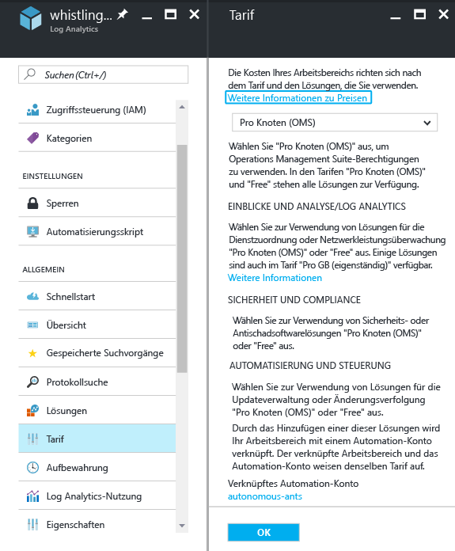
6. Wenn Sie die Ansicht im Azure-Portal aktualisieren, sehen Sie, dass der **Tarif** mit dem ausgewählten Plan aktualisiert wurde.  
    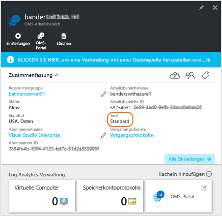

> [!NOTE]
> Falls Ihr Arbeitsbereich mit einem Automation-Konto verknüpft ist und Sie den Tarif *Standalone (Per GB)* (Eigenständig (pro GB)) auswählen möchten, müssen Sie zuvor alle Lösungen vom Typ **Automation & Control** löschen und die Verknüpfung mit dem Automation-Konto aufheben. Klicken Sie auf dem Blatt für den Arbeitsbereich unter **Allgemein** auf **Lösungen**, um die Lösungen anzuzeigen und zu löschen. Klicken Sie zum Aufheben der Verknüpfung mit dem Automation-Konto auf dem Blatt **Tarif** auf den Namen des Automatisierungskontos.
>
>

## Ändern des Speicherzeitraums für Daten in Log Analytics

Im Tarif „Free“ werden in Log Analytics die Daten der letzten sieben Tage verfügbar gemacht.
Im Tarif „Standard“ werden in Log Analytics die Daten der letzten 30 Tage verfügbar gemacht.
Im Tarif „Premium“ werden in Log Analytics die Daten der letzten 365 Tage verfügbar gemacht.
In den Tarifen „Standalone“ und „OMS“ werden in Log Analytics standardmäßig die Daten der letzten 31 Tage verfügbar gemacht.

Bei Verwendung der Tarife „Standalone“ und „OMS“ können Sie die Daten von bis zu zwei Jahren (730 Tage) aufbewahren. Wenn Daten länger als die standardmäßig verfügbaren 31 Tage gespeichert werden, wird eine Gebühr für die Aufbewahrung der Daten berechnet. Weitere Informationen zu Preisen finden Sie unter [Überschreitungsgebühren](https://azure.microsoft.com/pricing/details/log-analytics/).

Gehen Sie wie folgt vor, um die Länge der Datenaufbewahrung zu ändern:

1. Melden Sie sich beim [Azure-Portal](http://portal.azure.com)an.
2. Suchen Sie nach **Log Analytics**, und wählen Sie diese Option aus.
3. Ihre Liste mit den vorhandenen Arbeitsbereichen wird angezeigt. Wählen Sie einen Arbeitsbereich aus.  
4. Klicken Sie auf dem Blatt für den Arbeitsbereich unter **Allgemein** auf **Aufbewahrung**.  
5. Verwenden Sie den Schieberegler, um die Anzahl der Aufbewahrungstage zu erhöhen oder zu verringern, und klicken Sie dann auf **Speichern**.
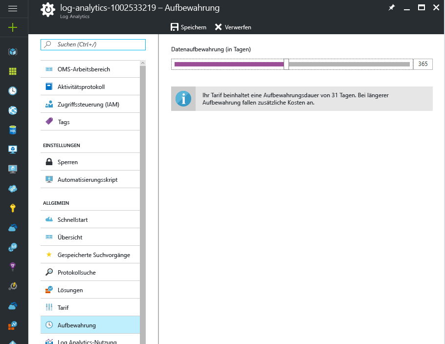

## Ändern einer Azure Active Directory-Organisation für einen Arbeitsbereich

Sie können die Azure Active Directory-Organisation eines Arbeitsbereichs ändern. Wenn Sie die Azure Active Directory-Organisation ändern, können Sie dem Arbeitsbereich Benutzer und Gruppen aus diesem Verzeichnis hinzufügen.

### So ändern Sie eine Azure Active Directory-Organisation für einen Arbeitsbereich

1. Klicken Sie im OMS-Portal auf der Seite mit den Einstellungen auf **Konten** und anschließend auf die Registerkarte **Benutzer verwalten**.  
2. Überprüfen Sie die Informationen zu Organisationskonten, und klicken Sie dann auf **Organisation ändern**.  
    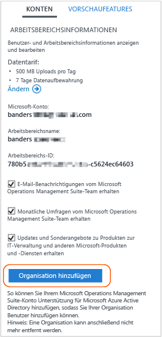
3. Geben Sie die Identitätsinformationen des Administrators Ihrer Azure Active Directory-Domäne ein. Anschließend wird bestätigt, dass Ihr Arbeitsbereich mit Ihrer Azure Active Directory-Domäne verknüpft ist.  
    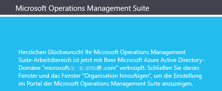

## Löschen eines Log Analytics-Arbeitsbereichs
Wenn Sie einen Log Analytics-Arbeitsbereich löschen, werden alle damit zusammenhängenden Daten innerhalb von 30 Tagen aus dem OMS-Dienst gelöscht.

Wenn Sie Administrator sind und mehrere Benutzer mit dem Arbeitsbereich verknüpft sind, wird die Zuordnung zwischen den Benutzern und dem Arbeitsbereich aufgehoben. Wenn die Benutzer anderen Arbeitsbereichen zugeordnet sind, können sie OMS mit diesen Arbeitsbereichen weiter nutzen. Wenn sie jedoch keinen anderen Arbeitsbereichen zugeordnet sind, müssen sie einen Arbeitsbereich erstellen, um OMS verwenden zu können.

### So löschen Sie einen Arbeitsbereich
1. Melden Sie sich beim [Azure-Portal](http://portal.azure.com)an.
2. Suchen Sie nach **Log Analytics**, und wählen Sie diese Option aus.
3. Ihre Liste mit den vorhandenen Arbeitsbereichen wird angezeigt. Wählen Sie den Arbeitsbereich aus, den Sie löschen möchten.
4. Klicken Sie auf dem Blatt für den Arbeitsbereich auf **Löschen**.  
    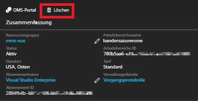
5. Klicken Sie im Bestätigungsdialogfeld für den Löschvorgang auf **Ja**.

## Nächste Schritte
* Informationen zum Hinzufügen von Agents und zum Erfassen von Daten finden Sie unter [Verbinden von Windows-Computern mit Log Analytics](log-analytics-windows-agents.md) .
* [Fügen Sie Log Analytics-Lösungen aus dem Lösungskatalog hinzu](log-analytics-add-solutions.md) , um Funktionen hinzuzufügen und Daten zu sammeln.
* [Konfigurieren von Proxy- und Firewalleinstellungen in Log Analytics](log-analytics-proxy-firewall.md) beschreibt, wie Sie vorgehen müssen, damit Agents mit dem Log Analytics-Dienst kommunizieren können, wenn Ihre Organisation einen Proxyserver oder eine Firewall verwendet.

<!--HONumber=Feb17_HO1-->

