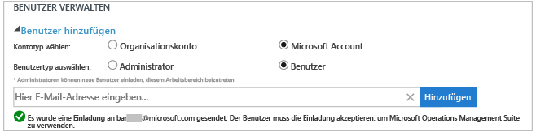
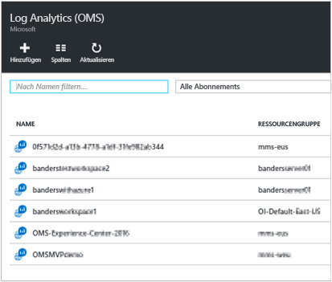
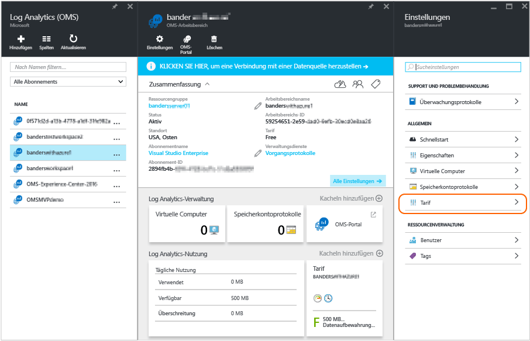

<properties
	pageTitle="Verwalten des Zugriffs auf Log Analytics | Microsoft Azure"
	description="Zum Verwalten des Zugriffs auf Log Analytics werden verschiedene Verwaltungsaufgaben für Benutzer, Konten, OMS-Arbeitsbereiche und Azure-Konten verwendet."
	services="log-analytics"
	documentationCenter=""
	authors="bandersmsft"
	manager="jwhit"
	editor=""/>

<tags
	ms.service="log-analytics"
	ms.workload="na"
	ms.tgt_pltfrm="na"
	ms.devlang="na"
	ms.topic="article"
	ms.date="04/28/2016"
	ms.author="banders"/>

# Verwalten des Zugriffs auf Log Analytics

Zum Verwalten des Zugriffs auf Log Analytics werden verschiedene Verwaltungsaufgaben für Benutzer, Konten, OMS-Arbeitsbereiche und Azure-Konten verwendet. Wählen Sie zum Erstellen eines neuen Arbeitsbereichs in der Operations Management Suite (OMS) einen Arbeitsbereichsnamen, den Sie Ihrem Konto zuordnen, sowie einen geografischen Standort. Ein Arbeitsbereich ist im Wesentlichen ein Container, der Kontoinformationen und einfache Konfigurationsinformationen für das Konto enthält. Sie oder andere Mitglieder Ihrer Organisation können mehrere OMS-Arbeitsbereiche nutzen, um unterschiedliche Mengen von Daten zu verwalten, die in Ihrer gesamten IT-Infrastruktur oder Teilen davon erfasst werden.

Der Artikel [Get started with Log Analytics](log-analytics-get-started.md) (Erste Schritte mit Log Analytics) beschäftigt sich mit der Einrichtung. Der vorliegende Artikel hingegen beschreibt einige der Aktionen ausführlicher, die Sie zum Verwalten des Zugriffs auf OMS ausführen müssen.

Auch wenn Sie nicht alle Verwaltungsaufgaben gleich ausführen müssen, werden hier die häufig ausgeführten Aufgaben behandelt, die Sie in den folgenden Abschnitten unter Umständen benötigen:

- Verwalten von Konten und Benutzern
- Hinzufügen einer Gruppe zu einem vorhandenen Arbeitsbereich
- Bestimmen der benötigten Anzahl von Arbeitsbereichen
- Verknüpfen eines vorhandenen Arbeitsbereichs mit einem Azure-Abonnement
- Upgrade eines Arbeitsbereichs auf einen kostenpflichtigen Datenplan
- Ändern des Datenplantyps
- Hinzufügen einer Azure Active Directory-Organisation zu einem vorhandenen Arbeitsbereich
- Steuern des Zugriffs auf OMS-Log Analytics-Ressourcen
- Schließen Ihres OMS-Arbeitsbereichs

## Verwalten von Konten und Benutzern
Sie verwalten Konten und Benutzer mithilfe der Registerkarte **Konten** auf der Einstellungsseite. Dort können Sie in den folgenden Bereichen die Aufgaben ausführen.

### Hinzufügen eines Benutzers zu einem vorhandenen Arbeitsbereich

Gehen Sie folgendermaßen vor, um einen Benutzer oder eine Gruppe zu einem OMS-Arbeitsbereich hinzuzufügen. Der Benutzer oder die Gruppe kann alle Warnungen, die diesem Arbeitsbereich zugeordnet sind, anzeigen und darauf reagieren.

>[AZURE.NOTE] Wenn Sie einen Benutzer oder eine Gruppe aus Ihrem Azure Active Directory-Organisationskonto hinzufügen möchten, müssen Sie zunächst sicherstellen, dass Sie Ihr OMS-Konto mit Ihrer Active Directory-Domäne verknüpft haben. Siehe [Hinzufügen einer Azure Active Directory-Organisation zu einem vorhandenen Arbeitsbereich](#add-an-azure-active-directory-organization-to-an-existing-workspace).

#### So fügen Sie einen Benutzer einem vorhandenen Arbeitsbereich hinzu
1. Klicken Sie in OMS auf die Kachel **Einstellungen**.
2. Klicken Sie auf Registerkarte **Konten**.
3. Wählen Sie im Abschnitt **Benutzer verwalten** den hinzuzufügenden Kontotyp aus: **Unternehmenskonto** oder **Microsoft-Konto**.
    - Wenn Sie „Microsoft-Konto“ auswählen, geben Sie die E-Mail-Adresse des Benutzers ein, der dem Microsoft-Konto zugeordnet ist.
    - Wenn Sie „Unternehmenskonto“ auswählen, können Sie einen Teil des Benutzer- oder Gruppennamens bzw. des E-Mail-Alias eingeben. Anschließend wird eine Liste der Benutzer und Gruppen angezeigt. Wählen Sie einen Benutzer oder eine Gruppe aus.

    >[AZURE.NOTE] Damit Sie eine optimale Leistung erzielen, begrenzen Sie die Anzahl von Active Directory-Gruppen, die einem einzelnen OMS-Konto zugeordnet sind, auf zwei – eines für Administratoren und eines für Benutzer. Mehr Gruppen können sich auf die Leistung von Log Analytics auswirken.

7. Wählen Sie den hinzuzufügenden Benutzer- oder Gruppentyp aus: **Administrator** oder **Benutzer**.
8. Klicken Sie auf **Hinzufügen**.

  Wenn Sie ein Microsoft-Konto hinzufügen, wird eine Einladung zur Teilnahme am Arbeitsbereich an die angegebene E-Mail-Adresse gesendet. Nachdem der Benutzer die Anweisungen in der Einladung zur Teilnahme an OMS befolgt hat, kann er die Warnungen und Kontoinformationen für dieses OMS-Konto anzeigen, und Sie können die Benutzerinformationen auf der Seite **Einstellungen** auf der Registerkarte **Konten** anzeigen. Wenn Sie ein Organisationskonto hinzufügen, kann der Benutzer sofort auf Log Analytics zugreifen. 

### Bearbeiten eines vorhandenen Benutzertyps

Sie können die Kontorolle eines Benutzers ändern, der Ihrem OMS-Konto zugeordnet ist. Sie haben die folgenden Rollenoptionen:

 - *Administrator*: Kann Benutzer verwalten, alle Warnungen anzeigen und darauf reagieren sowie Server hinzufügen und entfernen

 - *Benutzer*: Kann alle Warnungen anzeigen und darauf reagieren sowie Server hinzufügen und entfernen

#### So bearbeiten Sie ein Konto
1. Wählen Sie in OMS auf der Seite **Einstellungen** auf der Registerkarte **Konten** die Rolle für den Benutzer aus, die Sie ändern möchten.
2. Klicken Sie auf **OK**.

## Entfernen eines Benutzers aus einem OMS-Arbeitsbereich

Gehen Sie folgendermaßen vor, um einen Benutzer aus einem OMS-Arbeitsbereich zu entfernen. Beachten Sie, dass dadurch der Arbeitsbereich des Benutzers nicht geschlossen wird. Stattdessen wird die Zuordnung zwischen diesem Benutzer und dem Arbeitsbereich aufgehoben. Wenn ein Benutzer mehreren Arbeitsbereichen zugeordnet ist, kann sich dieser Benutzer weiter bei OMS anmelden.

### So entfernen Sie einen Benutzer aus einem Arbeitsbereich

1. Klicken Sie in OMS auf der Seite **Einstellungen** auf der Registerkarte **Konten** neben dem Benutzernamen, den Sie entfernen möchten, auf „Entfernen“.
2. Klicken Sie auf **OK**, um zu bestätigen, dass Sie den Benutzer entfernen möchten.

## Hinzufügen einer Gruppe zu einem vorhandenen Arbeitsbereich

1.	Führen Sie die oben unter „So fügen Sie einen Benutzer einem vorhandenen Arbeitsbereich hinzu“ beschriebenen Schritte 1–4 aus.
2.	Wählen Sie unter **Choose User/Group** (Benutzer/Gruppe auswählen) die Option **Gruppe** aus. 
3.	Geben Sie den Anzeigenamen oder die E-Mail-Adresse für die Gruppe ein, die Sie hinzufügen möchten.
4.	Wählen Sie aus der Liste die gewünschte Gruppe aus, und klicken Sie auf **Hinzufügen**.

## Bestimmen der benötigten Anzahl von Arbeitsbereichen

Ein Arbeitsbereich wird im Azure-Verwaltungsportal als Azure-Ressource angezeigt.

Sie können entweder einen neuen Arbeitsbereich erstellen oder eine Verknüpfung mit einem vorhandenen Arbeitsbereich herstellen, den Sie zuvor für die Verwendung mit System Center Operations Manager geöffnet, aber möglicherweise noch keinem Azure-Abonnement zugeordnet haben (was für die Abrechnung erforderlich ist).

Ein Arbeitsbereich stellt die Ebene dar, auf der Daten erfasst, aggregiert, analysiert und im OMS-Portal angezeigt werden. Sie können nach Wunsch mit mehreren Arbeitsbereichen arbeiten, um Daten aus verschiedenen Umgebungen und Systemen zu trennen. Jede Operations Manager-Verwaltungsgruppe (und alle ihre Agents) oder einzelne VMs/Agents können jeweils mit nur einem Arbeitsbereich verbunden werden.

Jedem Arbeitsbereich können mehrere Benutzerkonten zugeordnet sein, wobei jedes Benutzerkonto (Microsoft- oder Organisationskonto) Zugriff auf mehrere OMS-Arbeitsbereiche hat.

Standardmäßig wird der Besitzer des Microsoft- oder Organisationskontos, das zum Erstellen des Arbeitsbereichs verwendet wird, zum Administrator des Arbeitsbereichs. Der Administrator kann anschließend zusätzliche Microsoft-Konten einladen oder Benutzer in seinem Azure Active Directory auswählen.

## Verknüpfen eines vorhandenen Arbeitsbereichs mit einem Azure-Abonnement

Ein Arbeitsbereich kann auf der Webseite [microsoft.com/oms](https://microsoft.com/oms) erstellt werden. Es gelten jedoch bestimmte Grenzwerte für diese Arbeitsbereiche. Der wichtigste bei der Verwendung eines kostenlosen Kontos ist die Beschränkung auf 500 MB/Tag für das Hochladen von Daten. Um Änderungen für diesen Arbeitsbereich vorzunehmen, müssen Sie Ihren **vorhandenen Arbeitsbereich mit einem Azure-Abonnement verknüpfen**.

>[AZURE.IMPORTANT] Damit Sie einen Arbeitsbereich verknüpfen können, muss Ihr Azure-Konto bereits Zugriff auf den Arbeitsbereich haben, zu dem Sie eine Verknüpfung herstellen möchten. Anders ausgedrückt muss das Konto, das Sie für den Zugriff auf das Azure-Portal verwenden, **identisch** mit dem Konto sein, mit dem Sie auf Ihren OMS-Arbeitsbereich zugreifen. Wenn dies nicht der Fall ist, finden Sie weitere Informationen unter [Hinzufügen eines Benutzers zu einem vorhandenen Arbeitsbereich](#add-a-user-to-an-existing-workspace).

1.	Melden Sie sich beim [Azure-Portal](http://portal.azure.com) an.
2.	Suchen Sie nach **Log Analytics (OMS)**, und wählen Sie die Lösung aus.
3.	Ihre Liste mit den vorhandenen Arbeitsbereichen wird angezeigt. Klicken Sie auf **Hinzufügen**. 
4.	Klicken Sie unter **OMS Workspace** (OMS-Arbeitsbereich) auf **Or link existing** (Oder vorhandenen einfügen). 
5.	Klicken Sie auf **Erforderliche Einstellungen konfigurieren**. 
6.	Daraufhin wird Ihnen eine Liste der Arbeitsbereiche angezeigt, die noch nicht mit Ihrem Azure-Konto verknüpft sind. Wählen Sie einen Arbeitsbereich aus. 
7.	Bei Bedarf können Sie die Werte für die folgenden Elemente ändern:
    - Abonnement
    - Ressourcengruppe
    - Ort
    - Tarif 
8.	Klicken Sie auf **Erstellen**. Der Arbeitsbereich ist jetzt mit Ihrem Azure-Konto verknüpft.

>[AZURE.NOTE] Wenn der Arbeitsbereich, den Sie verknüpfen möchten, hier nicht angezeigt wird, hat Ihr Azure-Abonnement keinen Zugriff auf den OMS-Arbeitsbereich, den Sie auf der OMS-Webseite erstellt haben. Sie müssen in Ihrem OMS-Arbeitsbereich über die OMS-Webseite Zugriff auf dieses Konto gewähren. Informationen hierzu finden Sie unter [Hinzufügen eines Benutzers zu einem vorhandenen Arbeitsbereich](#add-a-user-to-an-existing-workspace).

## Upgrade eines Arbeitsbereichs auf einen kostenpflichtigen Datenplan

Es gibt drei Arten von Arbeitsbereichsdatenplänen für OMS: **Kostenlos**, **Standard** und **Premium**. Wenn Sie mit einem Plan vom Typ *Kostenlos* arbeiten, ist Ihre Datenübertragung auf 500 MB begrenzt. Sie müssen für den Arbeitsbereich die **nutzungsbasierte Bezahlung** aktivieren, um Daten über diesen Grenzwert hinaus erfassen zu können. Sie können Ihren Plantyp jederzeit ändern. Weitere Informationen zu den Preisen für OMS finden Sie unter [Preise](https://www.microsoft.com/de-DE/server-cloud/operations-management-suite/pricing.aspx).

>[AZURE.IMPORTANT] Pläne für Arbeitsbereiche können nur geändert werden, wenn sie mit einem Azure-Abonnement *verknüpft* sind. Wenn Sie den Arbeitsbereich in Azure erstellt haben oder *bereits* eine Verknüpfung mit dem Arbeitsbereich hergestellt haben, können Sie diese Meldung ignorieren. Wenn Sie den Arbeitsbereich mithilfe der [OMS-Webseite](http://www.microsoft.com/oms) erstellt haben, müssen Sie die unter [Verknüpfen eines vorhandenen Arbeitsbereichs mit einem Azure-Abonnement](#link-an-existing-workspace-to-an-azure-subscription) beschriebenen Schritte ausführen.

### Verwenden von Berechtigungen des OMS-Add-Ons für System Center

Das OMS-Add-On für System Center umfasst eine Berechtigung für den Premium-Plan von OMS Log Analytics (siehe [Preise](https://www.microsoft.com/de-DE/server-cloud/operations-management-suite/pricing.aspx)).

Wenn Sie das OMS-Add-On für System Center kaufen, wird Ihr Microsoft-Konto-Team oder der Händler die OMS-Add-Ons Ihrem Enterprise Agreement, das Ihre Azure-Käufe enthält, zuordnen. Ihr OMS-Add-On erstellt eine Berechtigung für Ihre Vereinbarung, und jedes Azure-Abonnement kann diese Berechtigung verwenden. Dadurch können Sie zum Beispiel mehrere OMS-Arbeitsbereiche haben, die die Berechtigung des OMS-Add-Ons verwenden.

Gehen Sie folgendermaßen vor, um sicherzustellen, dass die Berechtigungen des OMS-Add-Ons auf die Verwendung eines OMS-Arbeitsbereichs angewandt werden:

1. Verknüpfen Sie den OMS-Arbeitsbereich mit einem Azure-Abonnement, das zu dem Enterprise Agreement gehört, welches sowohl das gekaufte OMS-Add-On als auch die Azure-Abonnement-Nutzung umfasst.
2. Wählen Sie den Premium-Plan für den Arbeitsbereich aus.

Wenn Sie Ihre Nutzung im Azure- oder OMS-Portal überprüfen, werden die OMS-Add-On-Berechtigungen nicht angezeigt. Allerdings können Sie die Berechtigungen in Enterprise Portal anzeigen.

Wenn Sie das Azure-Abonnement ändern möchten, mit dem Ihr OMS-Arbeitsbereich verknüpft ist, können Sie das Azure PowerShell-Cmdlet [Move-AzureRMResource](https://msdn.microsoft.com/library/mt652516.aspx) verwenden.

### Verwenden von Azure Commitment von einem Enterprise Agreement

Wenn Sie den eigenständigen Tarif für OMS-Komponenten auswählen, zahlen Sie für jede OMS-Komponenten separat, und die Nutzung wird auf Ihrer Azure-Rechnung ausgewiesen.

Wenn Sie die Azure-Nutzung in einem gewissen Umfang als Teil Ihres Enterprise Agreements bezahlt haben, wird die Nutzung von OMS mit Ihrer vorausgezahlten Nutzung verrechnet. Damit Sie die Azure Commitment-Preise für OMS-Log Analytics verwenden können, muss das Abonnement, mit dem der OMS-Arbeitsbereich verknüpft ist, zum Azure Enterprise Agreement gehören.

Wenn Sie das Azure-Abonnement ändern möchten, mit dem der OMS-Arbeitsbereich verknüpft ist, können Sie das Azure PowerShell-Cmdlet [Move-AzureRMResource](https://msdn.microsoft.com/library/mt652516.aspx) verwenden.

### So ändern Sie einen Arbeitsbereich in einen kostenpflichtigen Datenplan

1.	Melden Sie sich beim [Azure-Portal](http://portal.azure.com) an.
2.	Suchen Sie nach **Log Analytics (OMS)**, und wählen Sie diese Option aus.
3.	Ihre Liste mit den vorhandenen Arbeitsbereichen wird angezeigt. Wählen Sie einen Arbeitsbereich aus. 
4.	Klicken Sie unter **Einstellungen** auf **Tarif**. 
5.	Wählen Sie unter **Tarif** einen Datenplan aus, und klicken Sie dann auf **Auswählen**. 
6.	Wenn Sie die Ansicht im Azure-Portal aktualisieren, sehen Sie, dass der **Tarif** für den ausgewählten Plan aktualisiert wurde. 

Nun können Sie Daten erfassen, ohne dass die Beschränkung eines kostenlosen Plans gilt.

## Hinzufügen einer Azure Active Directory-Organisation zu einem vorhandenen Arbeitsbereich

Sie können Ihren Operational Insights (OMS)-Arbeitsbereich einer Azure Active Directory-Domäne zuordnen. Dies ermöglicht es Ihnen, Benutzer aus Active Directory direkt Ihrem OMS-Arbeitsbereich hinzuzufügen, ohne dass ein separates Microsoft-Konto erforderlich ist.

### So fügen Sie eine Azure Active Directory-Organisation einem vorhandenen Arbeitsbereich hinzu

1. Klicken Sie in OMS auf der Seite mit den Einstellungen auf **Konten** und anschließend auf **Workspace Information** (Arbeitsbereichsinformationen).  
2. Überprüfen Sie die Informationen zu Organisationskonten, und klicken Sie dann auf **Organisation hinzufügen**. 
3. Geben Sie die Identitätsinformationen des Administrators Ihrer Azure Active Directory-Domäne ein. Anschließend wird Ihnen eine Bestätigung angezeigt, in der angegeben ist, dass Ihr Arbeitsbereich mit Ihrer Azure Active Directory-Domäne verknüpft ist. 

## Steuern des Zugriffs auf OMS-Log Analytics-Ressourcen

Das Gewähren von Zugriff auf den OMS-Arbeitsbereich wird an zwei Stellen gesteuert:

- Der Zugriff auf das OMS-Portal wird innerhalb des OMS-Portals gesteuert. Der Zugriff auf die Azure-Abonnements, in denen sich diese Ressourcen befinden, ist davon getrennt.
- Bei PowerShell und direktem REST-API-Zugriff erfolgt die Verwaltung innerhalb von Azure mithilfe von Azure RBAC.

Wenn Sie Benutzern Zugriff auf das OMS-Portal gewährt haben, auf das damit verknüpfte Azure-Abonnement jedoch nicht, werden diesen Benutzern auf den Kacheln für Automation, Backup und Site Recovery keine Daten angezeigt, wenn sie sich beim OMS-Portal anmelden.

Damit die Daten in diesen Lösungen allen Benutzern angezeigt werden, benötigen Sie mindestens **Lesezugriff** für das mit dem OMS-Arbeitsbereich verknüpfte Automation-Konto, den Sicherungstresor und den Site Recovery-Tresor.

## Schließen Ihres OMS-Arbeitsbereichs

Wenn Sie einen OMS-Arbeitsbereich schließen, werden alle Daten im Zusammenhang mit Ihrem Arbeitsbereich 30 Tage nach Schließen des Arbeitsbereichs aus dem OMS-Dienst gelöscht.

Wenn Sie Administrator sind und mehrere Benutzer mit dem Arbeitsbereich verknüpft sind, wird die Zuordnung zwischen den Benutzern und dem Arbeitsbereich aufgehoben. Wenn die Benutzer anderen Arbeitsbereichen zugeordnet sind, können sie OMS mit diesen Arbeitsbereichen weiter nutzen. Wenn sie jedoch keinen anderen Arbeitsbereichen zugeordnet sind, müssen sie einen neuen Arbeitsbereich erstellen, um OMS verwenden zu können.

### So schließen Sie einen OMS-Arbeitsbereich

1. Klicken Sie in OMS auf der Seite **Einstellungen** auf der Registerkarte **Konten** auf **Arbeitsbereich schließen**.

2. Wählen Sie einen der Gründe für das Schließen des Arbeitsbereichs aus, oder geben Sie einen anderen Grund in das Textfeld ein.

3. Klicken Sie auf **Arbeitsbereich schließen**.

## Nächste Schritte

- Informationen zum Hinzufügen von Agents und zum Erfassen von Daten finden Sie unter [Connect Windows computers to Log Analytics](log-analytics-windows-agents.md) (Verbinden von Windows-Computern mit Log Analytics).
- [Add Log Analytics solutions from the Solutions Gallery](log-analytics-add-solutions.md) (Hinzufügen von Log Analytics-Lösungen aus dem Lösungskatalog) beschreibt das Hinzufügen von Funktionen und das Sammeln von Daten.
- [Configure proxy and firewall settings in Log Analytics](log-analytics-proxy-firewall.md) (Konfigurieren von Proxy- und Firewalleinstellungen in Log Analytics) beschreibt, wie Sie vorgehen müssen, damit die Agents mit dem Log Analytics-Dienst kommunizieren können, wenn Ihre Organisation einen Proxyserver oder eine Firewall verwendet.

<!---HONumber=AcomDC_0504_2016-->