<properties
	pageTitle="Konfigurieren von Proxy- und Firewalleinstellungen in Log Analytics | Microsoft Azure"
	description="Konfigurieren Sie Proxy- und Firewalleinstellungen, wenn die Agents oder OMS-Dienste bestimmte Ports verwenden müssen."
	services="log-analytics"
	documentationCenter=""
	authors="bandersmsft"
	manager="jwhit"
	editor=""/>

<tags
	ms.service="log-analytics"
	ms.workload="na"
	ms.tgt_pltfrm="na"
	ms.devlang="na"
	ms.topic="get-started-article"
	ms.date="04/28/2016"
	ms.author="banders"/>

# Konfigurieren von Proxy- und Firewalleinstellungen in Log Analytics


Die erforderlichen Aktionen zum Konfigurieren von Proxy- und Firewalleinstellungen für Log Analytics in OMS unterscheiden sich bei Verwendung von Operations Manager und den zugehörigen Agents im Vergleich zu Microsoft Monitoring Agent-Instanzen, die direkte Verbindungen mit Servern herstellen. Lesen Sie die folgenden Abschnitte für den verwendeten Agenttyp.

## Konfigurieren von Proxy- und Firewalleinstellungen mit dem Microsoft Monitoring Agent

Damit der Microsoft Monitoring Agent eine Verbindung herstellen und sich beim OMS-Dienst registrieren kann, benötigt er Zugriff auf die Portnummer Ihrer Domänen und die URLs. Wenn Sie einen Proxyserver für die Kommunikation zwischen dem Agent und dem OMS-Dienst verwenden, müssen Sie sicherstellen, dass auf die entsprechenden Ressourcen zugegriffen werden kann. Wenn Sie eine Firewall verwenden, um den Zugriff auf das Internet einzuschränken, müssen Sie die Firewall so konfigurieren, dass OMS Zugriff erhält. In den folgenden Tabellen werden die von OMS benötigten Ports aufgelistet.

|**Agent-Ressource**|**Ports**|
|--------------|-----|
|*.ods.opinsights.azure.com|Port 443| 
|*.oms.opinsights.azure.com|Port 443|
|ods.systemcenteradvisor.com|Port 443|
|*.blob.core.windows.net|Port 443|

Mit dem folgenden Verfahren können Sie Proxyeinstellungen für den Microsoft Monitoring Agent über die Systemsteuerung konfigurieren. Sie müssen diese Schritte für jeden Server ausführen. Wenn Sie viele Server konfigurieren müssen, ist es möglicherweise einfacher, diesen Prozess mithilfe eines Skripts zu automatisieren. Wenn dies der Fall ist, finden Sie entsprechende Anweisungen unter [So konfigurieren Sie Proxyeinstellungen für den Microsoft Monitoring Agent mithilfe eines Skripts](#to-configure-proxy-settings-for-the-microsoft-monitoring-agent-using-a-script).

### So konfigurieren Sie Proxyeinstellungen für den Microsoft Monitoring Agent über die Systemsteuerung

1. Öffnen Sie die **Systemsteuerung**.

2. Öffnen Sie **Microsoft Monitoring Agent**.

3. Klicken Sie auf die Registerkarte **Proxyeinstellungen**. 
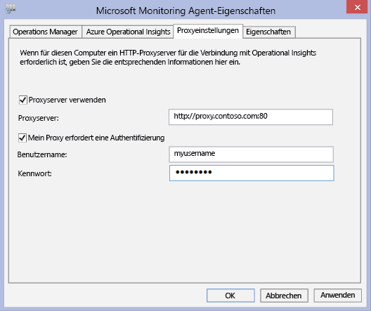

4. Wählen Sie **Proxyserver verwenden** aus, und geben Sie die URL und gegebenenfalls die Portnummer ein (siehe dazu das Beispiel oben). Wenn der Proxyserver eine Authentifizierung erfordert, geben Sie den Benutzernamen und das Kennwort für den Zugriff auf den Proxyserver ein.

Gehen Sie wie folgt vor, um ein PowerShell-Skript zu erstellen, mit dem Sie die Proxyeinstellungen für die einzelnen Agents festlegen können, die direkte Verbindungen mit dem Server herstellen.

### So konfigurieren Sie Proxyeinstellungen für den Microsoft Monitoring Agent mithilfe eines Skripts


- Kopieren Sie das folgende Beispiel, aktualisieren Sie es mit den tatsächlichen Informationen für Ihre Umgebung, und speichern Sie es mit der Dateinamenerweiterung PS1. Führen Sie das Skript dann auf jedem Computer aus, der eine direkte Verbindung mit dem OMS-Dienst herstellt.


```
param($ProxyDomainName="http://proxy.contoso.com:80", $cred=(Get-Credential))

# First we get the health service configuration object.  We need to determine if we
# have the right update rollup with the API we need.  If not, no need to run the rest of the script.
$healthServiceSettings = New-Object -ComObject 'AgentConfigManager.MgmtSvcCfg'

$proxyMethod = $healthServiceSettings | Get-Member -Name 'SetProxyInfo'

if (!$proxyMethod)
{
    Write-Output 'Health Service proxy API not present, will not update settings.'
    return
}


Write-Output "Clearing proxy settings."
$healthServiceSettings.SetProxyInfo('', '', '')

$ProxyUserName = $cred.username;


Write-Output "Setting Proxy to ${ProxyDomainName} with proxy username of (${ProxyUserName})."
$healthServiceSettings.SetProxyInfo($ProxyDomainName, $ProxyUserName, $cred.GetNetworkCredential().password)
```

## Konfigurieren von Proxy- und Firewalleinstellungen mit Operations Manager

Damit eine Operations Manager-Verwaltungsgruppe eine Verbindung herstellen und sich beim OMS-Dienst registrieren kann, benötigt sie Zugriff auf die Portnummern Ihrer Domänen und die URLs. Wenn Sie einen Proxyserver für die Kommunikation zwischen dem Operations Manager-Verwaltungsserver und dem OMS-Dienst verwenden, müssen Sie sicherstellen, dass auf die entsprechenden Ressourcen zugegriffen werden kann. Wenn Sie eine Firewall verwenden, um den Zugriff auf das Internet einzuschränken, müssen Sie die Firewall so konfigurieren, dass OMS Zugriff erhält. Selbst, wenn ein Operations Manager-Verwaltungsserver nicht hinter einem Proxyserver ist, könnte dies bei dessen Agents der Fall sein. In diesem Fall sollte der Proxyserver auf dieselbe Weise wie die Agents konfiguriert sein, damit die Daten der Sicherheits- und Protokollverwaltungslösung an den OMS-Webdienst gesendet werden können.

Damit Operations Manager-Agents mit dem OMS-Dienst kommunizieren können, sollte Ihre Operations Manager-Infrastruktur (einschließlich Agents) über die korrekten Proxyeinstellungen und die richtige Version verfügen. Die Proxyeinstellung für Agents wird in der Operations Manager-Konsole angegeben. Sie sollten über eine der folgenden Versionen verfügen:

- Operations Manager 2012 SP1 Updaterollup 7 oder höher
- Operations Manager 2012 R2 Updaterollup 3 oder höher


In der folgenden Tabelle sind die Ports im Zusammenhang mit diesen Aufgaben aufgelistet.

>[AZURE.NOTE] In einigen der folgenden Ressourcen werden Advisor und Operational Insights erwähnt, es handelt sich um vorherige Versionen von OMS. Die aufgelisteten Ressourcen werden jedoch in Zukunft geändert.

Es folgt eine Liste der Ressourcen und Ports für Agents:

|**Agent-Ressource**|**Ports**|
|--------------|-----|
|*.ods.opinsights.azure.com|Port 443| 
|*.oms.opinsights.azure.com|Port 443|
|ods.systemcenteradvisor.com|Port 443|
|*. blob.core.windows.net|Port 443|

Es folgt eine Liste der Ressourcen und Ports für Verwaltungsserver:

|**Verwaltungsserver-Ressource**|**Ports**|
|--------------|-----|
|*.ods.opinsights.azure.com|Port 443| 
|service.systemcenteradvisor.com|Port 443| 
|scadvisor.accesscontrol.windows.net|Port 443| 
|scadvisorservice.accesscontrol.windows.net|Port 443| 
|*.blob.core.windows.net|Port 443|
|data.systemcenteradvisor.com|Port 443|
|ods.systemcenteradvisor.com|Port 443|
|*.systemcenteradvisor.com|Port 443|

Es folgt eine Liste der Ressourcen und Ports für OMS und die Operations Manager-Konsole.

|**Ressourcen für OMS und Operations Manager-Konsole**|**Ports**|
|----|----|
|*.systemcenteradvisor.com|Port 80 und 443| 
|*.live.com|Ports 80 und 443|
|*.microsoftonline.com|Port 80 und 443| 
|login.windows.net|Port 80 und 443|


Verwenden Sie die folgenden Verfahren, um die Operations Manager-Verwaltungsgruppe beim OMS-Dienst zu registrieren. Wenn Sie Probleme mit der Kommunikation zwischen der Verwaltungsgruppe und dem OMS-Dienst haben, verwenden Sie die Validierungsverfahren für eine Problembehandlung der Datenübertragung an den OMS-Dienst.

### So fordern Sie Ausnahmen für die OMS-Dienstendpunkte an

1. Verwenden Sie die Informationen aus der ersten Tabelle weiter oben, um sicherzustellen, dass die erforderlichen Ressourcen für den Operations Manager-Verwaltungsserver über eventuell vorhandene Firewalls zugänglich sind.
2. Verwenden Sie die Informationen aus der zweiten Tabelle weiter oben, um sicherzustellen, dass die erforderlichen Ressourcen für die Operations-Konsole in Operations Manager und OMS über eventuell vorhandene Firewalls zugänglich sind.
3. Wenn Sie einen Proxyserver mit Internet Explorer verwenden, stellen Sie sicher, dass dieser konfiguriert ist und ordnungsgemäß funktioniert. Um dies zu überprüfen, können Sie eine sichere Verbindung (https) öffnen, z. B. [https://bing.com](https://bing.com). Wenn die sichere Internetverbindung in einem Browser nicht funktioniert, funktioniert sie wahrscheinlich in der Operations Manager-Verwaltungskonsole mit Webdiensten in der Cloud ebenfalls nicht.

### So konfigurieren Sie den Proxyserver in der Operations Manager-Konsole

1. Öffnen Sie die Operations Manager-Konsole, und wählen Sie den Arbeitsbereich **Administration** aus.

2. Erweitern Sie **Operational Insights**, und wählen Sie dann **Operational Insights-Verbindung** aus.  
    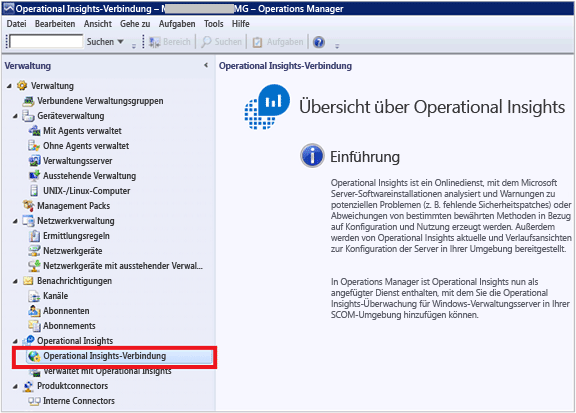
3. Klicken Sie in der Ansicht „OMS-Verbindung“ auf **Proxyserver konfigurieren**.  
    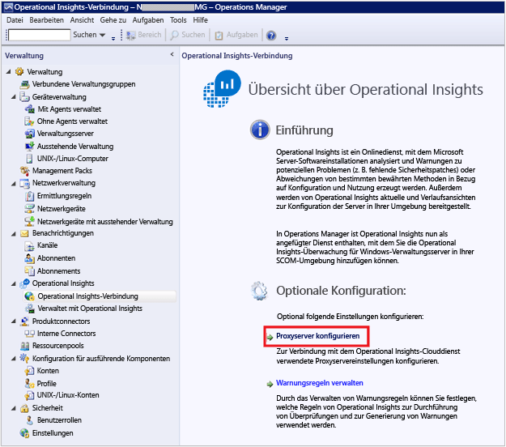
4. Wählen Sie unter „Operational Insights-Einstellungsassistent: Proxyserver“ die Option **Einen Proxyserver verwenden, um auf den Operational Insights-Webdienst zuzugreifen** aus, und geben Sie dann die URL mit der Portnummer ein, z. B. **http://myproxy:80**.  
    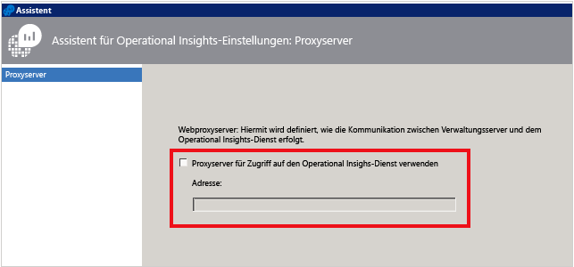


### So geben Sie Anmeldeinformationen ein, wenn der Proxyserver eine Authentifizierung erfordert
 Anmeldeinformationen und Einstellungen von Proxyservern müssen an verwaltete Computer weitergegeben werden, die an OMS Bericht erstatten. Diese Server sollten sich in der *Microsoft System Center Advisor-Überwachungsservergruppe* befinden. Anmeldeinformationen werden in der Registrierung jedes Servers in der Gruppe verschlüsselt.

1. Öffnen Sie die Operations Manager-Konsole, und wählen Sie den Arbeitsbereich **Administration** aus.
2. Wählen Sie unter **RunAs-Konfiguration** die Option **Profile** aus.
3. Öffnen Sie das Profil **System Center Advisor Run As Profile Proxy**.  
    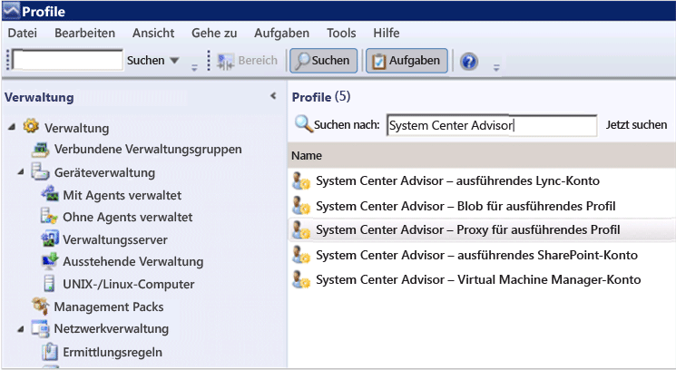
4. Klicken Sie im Assistenten für das ausführende Profil auf **Hinzufügen**, um ein ausführendes Konto zu verwenden. Sie können ein neues ausführendes Konto erstellen oder ein vorhandenes Konto verwenden. Dieses Konto muss über ausreichende Berechtigungen für die Weiterleitung über den Proxyserver verfügen.  
    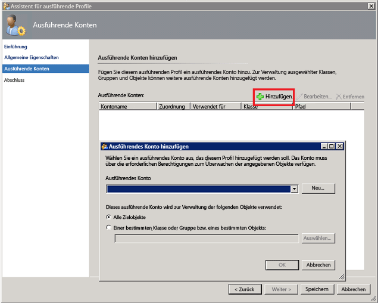
5. Um das zu verwaltende Konto festzulegen, wählen Sie **Einer bestimmten Klasse oder Gruppe bzw. eines bestimmten Objekts** aus, um das Dialogfeld „Objektsuche“ zu öffnen.  
    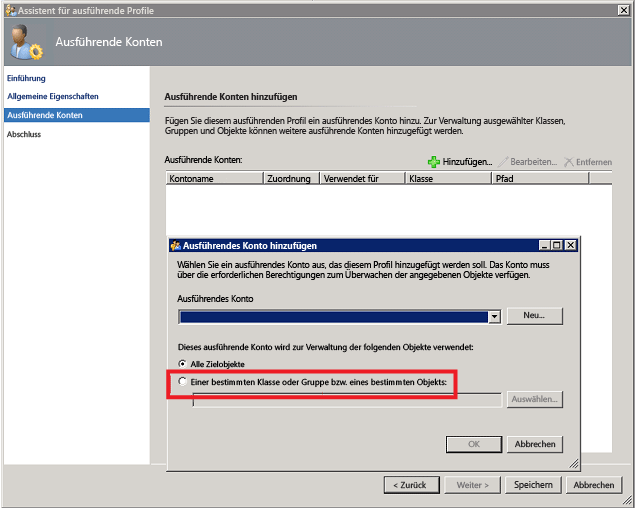
6. Suchen Sie die **Microsoft System Center Advisor-Überwachungsservergruppe**, und wählen Sie sie dann aus.  
    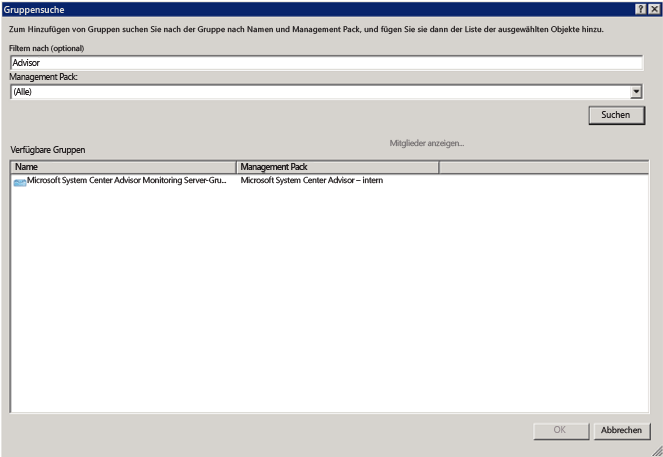
7. Klicken Sie auf **OK**, um das Dialogfeld „Ausführendes Konto hinzufügen“ zu schließen.  
    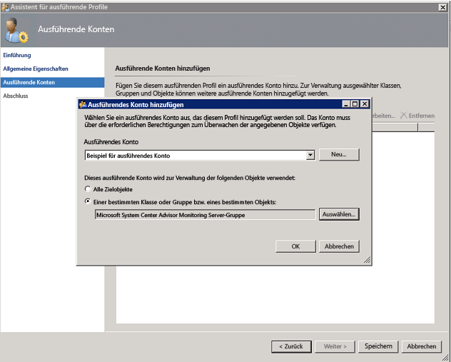
8. Schließen Sie den Assistenten ab, und speichern Sie die Änderungen.  
    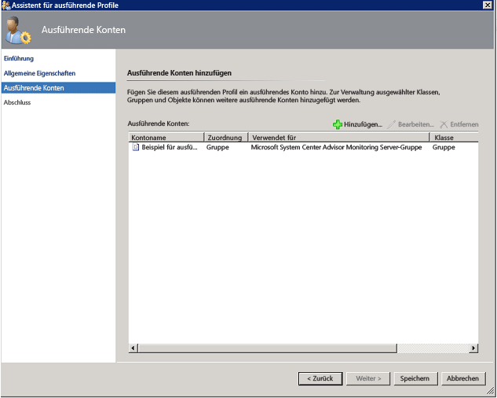


### So überprüfen Sie, ob OMS-Management Packs heruntergeladen werden

- Wenn Sie Lösungen zu OMS hinzugefügt haben, können Sie sie in der Operations Manager-Konsole unter **Administration** als Management Packs anzeigen. Suchen Sie nach *System Center Advisor*, um sie schnell zu finden.  
    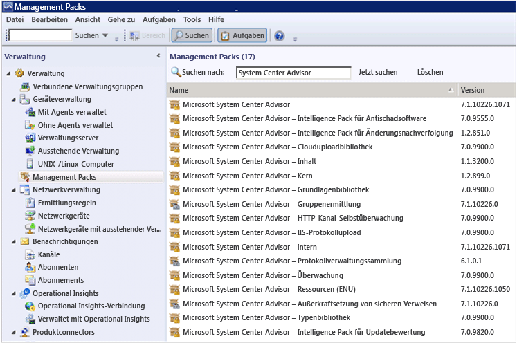
- Sie können auch mithilfe der folgenden Windows PowerShell-Befehle auf dem Operations Manager-Verwaltungsserver nach OMS-Management Packs suchen:

        get-scommanagementpack | where {$_.DisplayName -match 'Advisor'} | select Name,DisplayName,Version,KeyToken

        get-scommanagementpack | where {$_.DisplayName -match 'Advisor'} | select Name,DisplayName,Version | ft

### So überprüfen Sie, ob Operations Manager Daten an den OMS-Dienst sendet

1. Öffnen Sie auf dem Operations Manager-Verwaltungsserver den Systemmonitor (perfmon.exe), und wählen Sie **Systemmonitor** aus.
2. Klicken Sie auf **Hinzufügen**, und wählen Sie **Verwaltungsgruppen des Integritätsdiensts** aus.
3. Fügen Sie alle Leistungsindikatoren hinzu, die mit **HTTP** beginnen.  
    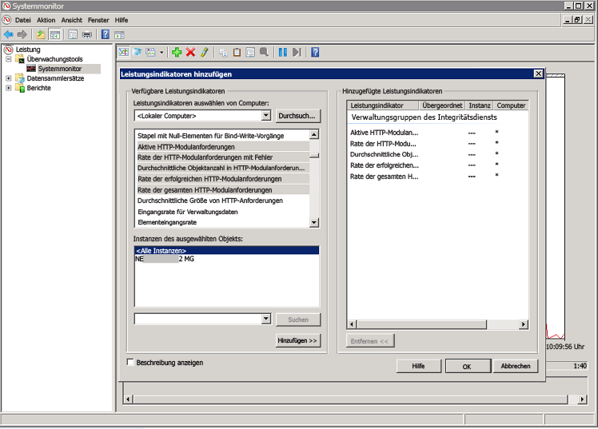
4. Wenn die Operations Manager-Konfiguration in Ordnung ist, werden Aktivitäten zu Leistungsindikatoren der Integritätsdienstverwaltung für Ereignisse und andere Datenelemente angezeigt. Die Grundlage bilden die in OMS hinzugefügten Management Packs und die konfigurierten Richtlinien für die Protokollerfassung.  
    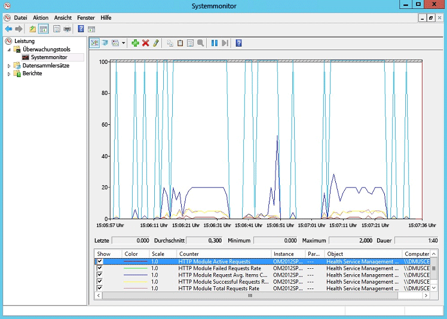


## Azure Automation – Hybrid Runbook Worker

Es gelten keine eingehenden Firewallanforderungen zur Unterstützung von Hybrid Runbook Workern.

Der auf dem lokalen Computer ausgeführte Hybrid Runbook Worker muss an Port 443, 9354 und 30000-30199 über ausgehenden Zugriff auf *.cloudapp.net verfügen.

## Nächste Schritte

- [Add Log Analytics solutions from the Solutions Gallery](log-analytics-add-solutions.md) (Hinzufügen von Log Analytics-Lösungen aus dem Lösungskatalog) beschreibt das Hinzufügen von Funktionen und das Sammeln von Daten.
- Machen Sie sich mit [Protokollsuchvorgängen](log-analytics-log-searches.md) vertraut, um ausführliche Informationen anzuzeigen, die von Lösungen gesammelt werden.

<!---HONumber=AcomDC_0525_2016-->