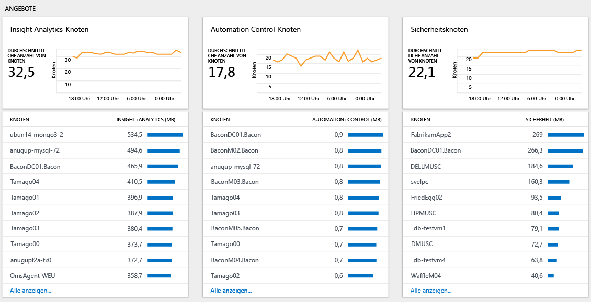

# Analysieren der Datennutzung in Log Analytics
Log Analytics enthält Informationen zur Menge der gesammelten Daten, zu den Computern, die Daten gesendet haben, und zu den unterschiedlichen Arten von gesendeten Daten.  Verwenden Sie das Dashboard zur **Log Analytics-Nutzung**, um anzuzeigen, welche Datenmenge an den Log Analytics-Dienst gesendet wird. Im Dashboard ist angegeben, wie viele Daten von jeder Lösung gesammelt werden und wie viele Daten von den Computern gesendet werden.

## Grundlagen des Dashboards „Nutzung“
Im Log Analytics-Dashboard zur **Nutzung** werden die folgenden Informationen angezeigt:

- Datenvolume
    - Datenvolume im Zeitverlauf (basierend auf dem aktuellen Zeitbereich)
    - Datenvolumen nach Lösung
    - Daten, die keinem Computer zugeordnet sind
- Computer
    - Computer, die Daten senden
    - Computer ohne Daten in den letzten 24 Stunden
- Angebote
    - Knoten vom Typ „Insight & Analytics“
    - Knoten vom Typ „Automation & Control“
    - Knoten vom Typ „Security“
- Leistung
    - Zeit zum Erfassen und Indizieren von Daten
- Liste der Abfragen

### So arbeiten Sie mit Nutzungsdaten
1. Melden Sie sich mit Ihrem Azure-Abonnement beim [Azure-Portal](https://portal.azure.com) an, sofern Sie noch nicht angemeldet sind.
2. Klicken Sie im Menü **Hub** auf **Weitere Dienste**, und geben Sie in der Liste mit den Ressourcen **Log Analytics** ein. Sobald Sie mit der Eingabe beginnen, wird die Liste auf der Grundlage Ihrer Eingabe gefiltert. Klicken Sie auf **Log Analytics**.  
    
3. Im Dashboard **Log Analytics** wird eine Liste mit Ihren Arbeitsbereichen angezeigt. Wählen Sie einen Arbeitsbereich aus.
4. Klicken Sie im Dashboard *Arbeitsbereich* auf **Log Analytics Usage** (Log Analytics-Nutzung).
5. Klicken Sie im Log Analytics-Dashboard zur **Nutzung** auf **Zeit: Letzte 24 Stunden**, um das Zeitintervall zu ändern.  
    
6. Zeigen Sie die Blätter mit der Nutzungskategorie an, auf denen die für Sie interessanten Bereiche enthalten sind. Wählen Sie ein Blatt aus, und klicken Sie darin dann auf ein Element, um für die [Protokollsuche](log-analytics-log-searches.md) mehr Details anzuzeigen.  
    
7. Überprüfen Sie im Dashboard „Protokollsuche“ die Ergebnisse, die für die Suche ausgegeben werden.  
    

## Erstellen einer Warnung für den Fall, dass die Datensammlung höher als erwartet ist
In diesem Abschnitt wird beschrieben, wie Sie eine Warnung erstellen, wenn Folgendes gilt:
- Das Datenvolumen übersteigt eine angegebene Menge.
- Für das Datenvolumen besteht die Vorhersage, dass eine bestimmte Menge überschritten wird.

Für Log Analytics-[Warnungen](log-analytics-alerts-creating.md) werden Suchabfragen verwendet. Für die folgende Abfrage wird ein Ergebnis erzielt, wenn innerhalb der letzten 24 Stunden mehr als 100 GB an Daten gesammelt wurden:

`Type=Usage QuantityUnit=MBytes IsBillable=true | measure sum(div(Quantity,1024)) as DataGB by Type | where DataGB > 100`

Für die folgende Abfrage wird eine einfache Formel verwendet, um vorherzusagen, wenn an einem Tag mehr als 100 GB an Daten gesendet werden: 

`Type=Usage QuantityUnit=MBytes IsBillable=true | measure sum(div(mul(Quantity,8),1024)) as EstimatedGB by Type | where EstimatedGB > 100`

Wenn die Warnung für ein anderes Datenvolumen gelten soll, ändern Sie den Wert 100 in den Abfragen einfach in den gewünschten GB-Wert.

Führen Sie die Schritte unter [Erstellen einer Warnungsregel](log-analytics-alerts-creating.md#create-an-alert-rule) aus, um eine Benachrichtigung zu erhalten, wenn die Datensammlung höher als erwartet ausfällt.

Legen Sie beim Erstellen der Warnung für die erste Abfrage Folgendes fest, wenn mehr als 100 GB an Daten innerhalb von 24 Stunden anfallen:
- **Name** auf *Datenvolumen größer als 100 GB in 24 Stunden*
- **Schweregrad** auf *Warnung*
- **Suchabfrage** auf `Type=Usage QuantityUnit=MBytes IsBillable=true | measure sum(div(Quantity,1024)) as DataGB by Type | where DataGB > 100`
- **Zeitfenster** auf *24 Stunden*
- **Warnungshäufigkeit** auf eine Stunde, da die Nutzungsdaten nur einmal pro Stunde aktualisiert werden
- **Warnung generieren basierend auf** auf *Anzahl von Ergebnissen*
- **Anzahl von Ergebnissen** auf *Größer als 0*

Führen Sie die Schritte aus, die unter [Hinzufügen von Aktionen zu Warnungsregeln](log-analytics-alerts-actions.md) beschrieben sind, um eine E-Mail-, Webhook- oder Runbookaktion für die Warnungsregel zu konfigurieren.

Legen Sie beim Erstellen der Warnung für die zweite Abfrage Folgendes fest, wenn die Vorhersage besteht, dass innerhalb von 24 Stunden mehr als 100 GB an Daten anfallen:
- **Name** auf *Erwartetes Datenvolumen von mehr als 100 GB in 24 Stunden*
- **Schweregrad** auf *Warnung*
- **Suchabfrage** auf `Type=Usage QuantityUnit=MBytes IsBillable=true | measure sum(div(mul(Quantity,8),1024)) as EstimatedGB by Type | where EstimatedGB > 100`
- **Zeitfenster** auf *3 Stunden*
- **Warnungshäufigkeit** auf eine Stunde, da die Nutzungsdaten nur einmal pro Stunde aktualisiert werden
- **Warnung generieren basierend auf** auf *Anzahl von Ergebnissen*
- **Anzahl von Ergebnissen** auf *Größer als 0*

Wenn Sie eine Warnung erhalten, können Sie die Schritte im folgenden Abschnitt verwenden, um per Problembehandlung zu ermitteln, warum die Nutzung höher als erwartet ist.

## Ermittlung per Problembehandlung, warum die Nutzung höher als erwartet ist
Mit dem Dashboard „Nutzung“ können Sie ermitteln, warum die Nutzung (und somit die Kosten) höher als erwartet ist.

Eine höhere Nutzung wird durch eine bzw. beide der folgenden Bedingungen verursacht:
- Mehr Daten als erwartet werden an Log Analytics gesendet
- Mehr Knoten als erwartet senden Daten an Log Analytics

### Überprüfen, ob mehr Daten als erwartet vorhanden sind 
Die Seite „Nutzung“ enthält zwei wichtige Abschnitte, in denen Sie identifizieren können, welche Gründe die vermehrte Sammlung von Daten hat.

Das Diagramm *Datenmenge im Zeitverlauf* enthält die Informationen zum Gesamtvolumen der gesendeten Daten und zu den Computern, die die meisten Daten senden. Im Diagramm im oberen Bereich können Sie ablesen, ob die Gesamtdatennutzung zunimmt, stabil ist oder abnimmt. In der Liste mit den Computern sind die zehn Computer angegeben, die die meisten Daten senden.

Im Diagramm *Datenmenge nach Lösung* werden das Volumen der Daten, die von den einzelnen Lösungen gesendet werden, und die Lösungen angezeigt, von denen die meisten Daten gesendet werden. Im Diagramm im oberen Bereich ist das Gesamtvolumen der Daten angegeben, die von den einzelnen Lösungen im Zeitverlauf gesendet werden. Mit diesen Informationen können Sie ermitteln, ob von einer Lösung in Abhängigkeit der Zeit eine größere Datenmenge, ungefähr die gleiche Menge an Daten oder eine kleinere Datenmenge gesendet wird. In der Liste mit den Lösungen sind die zehn Lösungen aufgeführt, die die meisten Daten senden. 

Diese beiden Diagramme zeigen alle Daten an. Einige Daten sind gebührenpflichtig, andere sind kostenlos. Um nur gebührenpflichtige Daten zu berücksichtigen, ändern Sie die Abfrage auf der Suchseite, um `IsBillable=true` einzuschließen.  

Sehen Sie sich das Diagramm *Datenmenge im Zeitverlauf* an. Klicken Sie jeweils auf den Namen eines Computers, um die Lösungen und Datentypen anzuzeigen, die für einen Computer die meisten Daten senden. Klicken Sie auf den Namen des ersten Computers in der Liste.

Im folgenden Screenshot werden für den Computer vom Datentyp *LogManagement/Perf* (Protokollverwaltung/Leistung) die meisten Daten gesendet. 

Wechseln Sie als Nächstes zurück zum Dashboard *Nutzung*, und sehen Sie sich das Diagramm *Datenmenge nach Lösung* an. Klicken Sie in der Liste auf den Namen einer Lösung, um die Computer anzuzeigen, die die meisten Daten für die Lösung senden. Klicken Sie auf den Namen der ersten Lösung in der Liste. 

Im folgenden Screenshot ist zu erkennen, dass der Computer *acmetomcat* die meisten Daten für die Lösung „LogManagement“ (Protokollverwaltung) sendet.

Führen Sie bei Bedarf zusätzliche Analysen aus, um große Mengen innerhalb einer Lösung oder eines Datentyps zu identifizieren. Beispiele für Abfragen:

+ **Sicherheitslösung**
  - `Type=SecurityEvent | measure count() by EventID`
+ **Protokollverwaltungslösung**
  - `Type=Usage Solution=LogManagement IsBillable=true | measure count() by DataType`
+ Datentyp **Perf**
  - `Type=Perf | measure count() by CounterPath`
  - `Type=Perf | measure count() by CounterName`
+ Datentyp **Event**
  - `Type=Event | measure count() by EventID`
  - `Type=Event | measure count() by EventLog, EventLevelName`
+ Datentyp **Syslog**
  - `Type=Syslog | measure count() by Facility, SeverityLevel`
  - `Type=Syslog | measure count() by ProcessName`

Führen Sie die folgenden Schritte aus, um das Volumen der erfassten Protokolle zu reduzieren:

| Quelle mit hohem Datenvolumen | Reduzieren des Datenvolumens |
| -------------------------- | ------------------------- |
| Sicherheitsereignisse            | Wählen Sie [Sicherheitsereignisse vom Typ „Allgemein“ oder „Minimal“](https://blogs.technet.microsoft.com/msoms/2016/11/08/filter-the-security-events-the-oms-security-collects/) aus.   Ändern der Sicherheitsüberwachungsrichtlinie, sodass nur benötigte Ereignisse erfasst werden. Überprüfen Sie insbesondere die Notwendigkeit zum Erfassen von Ereignissen für die   - [Überwachung der Filterplattform](https://technet.microsoft.com/library/dd772749(WS.10).aspx)   - [Überwachung der Registrierung](https://docs.microsoft.com/windows/device-security/auditing/audit-registry)  - [Überwachung des Dateisystems](https://docs.microsoft.com/windows/device-security/auditing/audit-file-system)  - [Überwachung des Kernelobjekts](https://docs.microsoft.com/windows/device-security/auditing/audit-kernel-object)  - [Überwachung der Handleänderung](https://docs.microsoft.com/windows/device-security/auditing/audit-handle-manipulation)  - [Überwachung von Wechselmedien](https://docs.microsoft.com/windows/device-security/auditing/audit-removable-storage) |
| Leistungsindikatoren       | Ändern Sie [Leistungsindikatoren-Konfiguration](log-analytics-data-sources-performance-counters.md) in:   - Reduzieren der Sammlungshäufigkeit   - Reduzieren der Anzahl von Leistungsindikatoren |
| Ereignisprotokolle                 | Ändern Sie die [Ereignisprotokollkonfiguration](log-analytics-data-sources-windows-events.md) in:   - Reduzieren der Anzahl von erfassten Ereignisprotokollen   - Ausschließliches Erfassen von erforderlichen Ereignisebenen. Erfassen Sie beispielsweise keine Ereignisse der Ebene *Informationen*. |
| syslog                     | Ändern Sie die [syslog-Konfiguration](log-analytics-data-sources-syslog.md) in:   - Reduzieren der Anzahl von erfassten Einrichtungen   - Ausschließliches Erfassen von erforderlichen Ereignisebenen. Erfassen Sie beispielsweise keine Ereignisse der Ebenen *Informationen* und *Debuggen*. |
| Lösungsdaten von Computern, für die die Lösung nicht erforderlich ist | Verwenden Sie die [Zielgruppenadressierung für Lösungen](../operations-management-suite/operations-management-suite-solution-targeting.md), um Daten nur für erforderliche Gruppen mit Computern zu erfassen. |

### Überprüfen, ob mehr Knoten als erwartet vorhanden sind
Wenn Sie den Tarif *Pro Knoten (OMS)* nutzen, werden Ihre Gebühren basierend auf der Anzahl von genutzten Knoten und Lösungen berechnet. Sie können im Dashboard „Nutzung“ im Abschnitt mit den *Angeboten* anzeigen, wie viele Knoten eines Angebots jeweils verwendet werden.

Klicken Sie auf **Alle anzeigen...**, um die vollständige Liste mit Computern anzuzeigen, von denen für das ausgewählte Angebot Daten gesendet werden.

Verwenden Sie die [Zielgruppenadressierung für Lösungen](../operations-management-suite/operations-management-suite-solution-targeting.md), um Daten nur für erforderliche Gruppen mit Computern zu erfassen.

## Nächste Schritte
* Informationen dazu, wie Sie die Suchsprache verwenden, finden Sie unter [Protokollsuchen in Log Analytics](log-analytics-log-searches.md). Sie können Suchabfragen verwenden, um für die Nutzungsdaten eine zusätzliche Analyse durchzuführen.
* Führen Sie die unter [Erstellen einer Warnungsregel](log-analytics-alerts-creating.md#create-an-alert-rule) beschriebenen Schritte aus, um benachrichtigt zu werden, wenn ein Suchkriterium erfüllt ist.
* Verwenden Sie die [Zielgruppenadressierung für Lösungen](../operations-management-suite/operations-management-suite-solution-targeting.md), um Daten nur für erforderliche Gruppen mit Computern zu erfassen.
* Wählen Sie [Sicherheitsereignisse vom Typ „Allgemein“ oder „Minimal“](https://blogs.technet.microsoft.com/msoms/2016/11/08/filter-the-security-events-the-oms-security-collects/) aus.
* Ändern Sie die [Leistungsindikatoren-Konfiguration](log-analytics-data-sources-performance-counters.md).
* Ändern Sie die [Ereignisprotokollkonfiguration](log-analytics-data-sources-windows-events.md).
* Ändern Sie die [Syslog-Konfiguration](log-analytics-data-sources-syslog.md).

