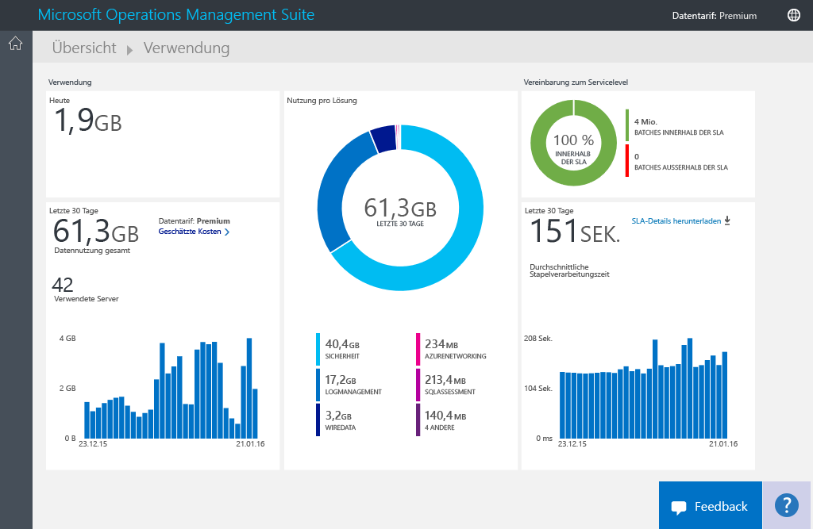
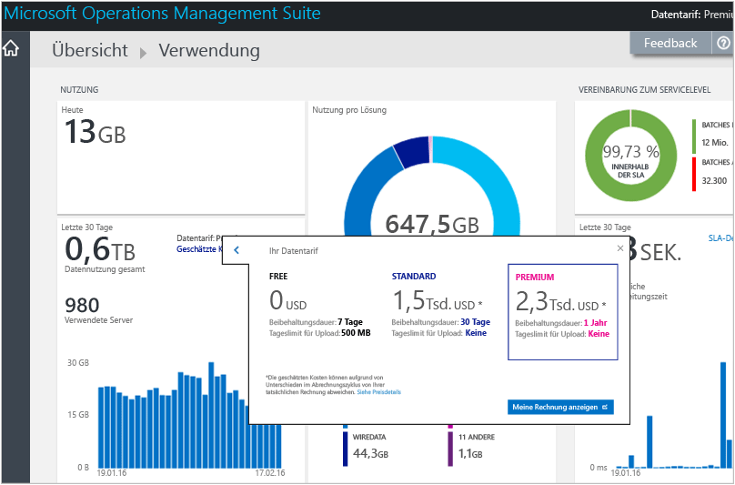
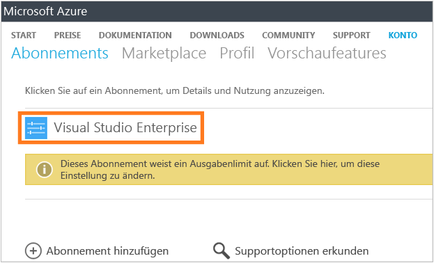
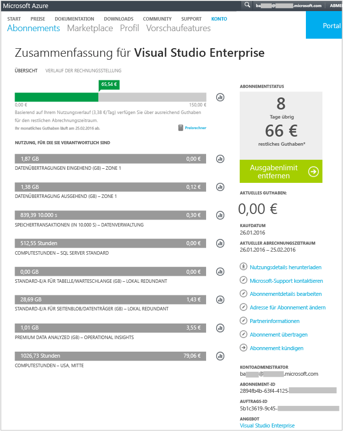
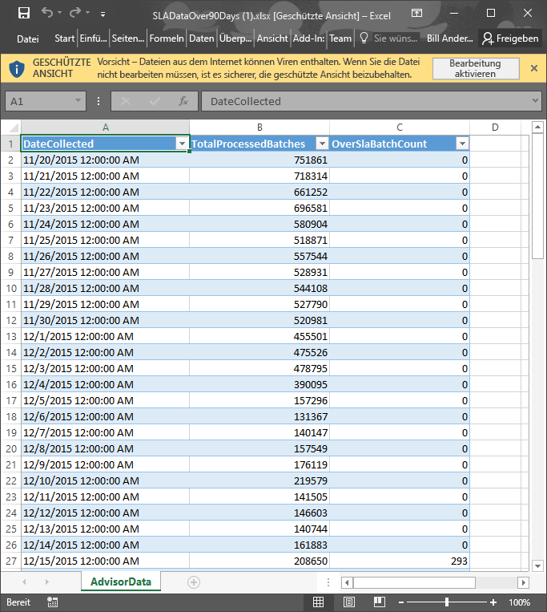

# Analysieren der Datennutzung in Log Analytics
Log Analytics in der Operations Management Suite (OMS) sammelt in regelmäßigen Abständen Daten und sendet sie an den OMS-Dienst.  Auf der Seite **Nutzung** können Sie anzeigen, wie viele Daten an den OMS-Dienst gesendet werden. Die Seite **Nutzung** zeigt Ihnen auch, wie viele Daten täglich von Lösungen gesendet werden und wie häufig Ihre Server Daten senden.

> [!NOTE]
> Wenn Sie ein über die [OMS-Website](http://www.microsoft.com/oms)erstelltes kostenloses Konto verwenden, ist die Datenmenge, die täglich an den OMS-Dienst gesendet wird, auf 500 MB begrenzt. Ist die Tagesgrenze erreicht, wird die Datenanalyse beendet und zu Beginn des nächsten Tages fortgesetzt. Sie müssen zudem alle Daten erneut senden, die von OMS nicht akzeptiert oder verarbeitet wurden.
> 
> 

Sie können Ihre Nutzung im OMS-Dashboard **Übersicht** auf der Kachel **Nutzung** anzeigen.

Wenn Sie die tägliche Nutzungsgrenze überschritten haben oder sich dem Grenzwert nähern, können Sie optional eine Lösung entfernen, um die an den OMS-Dienst gesendete Datenmenge zu reduzieren. Weitere Informationen zum Entfernen von Lösungen finden Sie unter [Hinzufügen von Log Analytics-Lösungen aus dem Lösungskatalog](log-analytics-add-solutions.md).

Auf der Seite **Nutzung** werden die folgenden Informationen angezeigt:

* Durchschnittliche Nutzung pro Tag
* Datennutzung für jede Lösung in den letzten 30 Tagen
* Menge der Daten, die von den Servern in Ihrer Umgebung in den letzten 30 Tagen an den OMS-Dienst gesendet wurden
* Preisstufe und geschätzte Kosten für Ihren Datentarif
* Informationen über die Vereinbarung zum Servicelevel (Service Level Agreement, SLA), einschließlich des von OMS zur Verarbeitung Ihrer Daten erforderlichen Zeitraums

## So arbeiten Sie mit Nutzungsdaten
1. Klicken Sie auf der Seite **Übersicht** auf die Kachel **Nutzung**.
2. Zeigen Sie auf der Seite **Nutzung** die Nutzungskategorien für Bereiche an, die Sie interessieren.
3. Wenn eine Ihrer Lösungen eine zu große Menge Ihres täglichen Uploadkontingents verbraucht, sollten Sie erwägen, diese Lösung zu entfernen.

## Anzeigen der geschätzten Kosten und Abrechnungsinformationen
1. Klicken Sie auf der Seite **Übersicht** auf die Kachel **Nutzung**.
2. Klicken Sie auf der Seite **Nutzung** im Bereich **Nutzung** auf das Chevron (**>**) neben **Geschätzte Kosten**.
3. In den erweiterten Informationen unter **Ihr Datentarif** können Sie die geschätzten monatlichen Kosten anzeigen.  
    
4. Wenn Sie Ihre Abrechnungsinformationen anzeigen möchten, klicken Sie auf **Meine Rechnung anzeigen** , um die Informationen zu Ihrem Abonnement anzuzeigen.
   * Klicken Sie auf der Abonnementseite auf Ihr Abonnement, um Details und eine Nutzungsliste pro Position anzuzeigen.  
       
   * Auf der Übersichtsseite für Ihr Abonnement können Sie verschiedene Aufgaben ausführen, um Ihr Abonnement zu verwalten und weitere Informationen dazu anzuzeigen.  
       

## Anzeigen von Datenbatches für Ihre SLA
1. Klicken Sie auf der Seite **Übersicht** auf die Kachel **Nutzung**.
2. Klicken Sie unter **Vereinbarung zum Servicelevel** auf **SLA-Details herunterladen**.
3. Es wird eine Excel-XLSX-Datei heruntergeladen, die Sie überprüfen können.  
    

## Nächste Schritte
* Detaillierte Informationen zu Daten, die von Lösungen gesammelt werden, finden Sie unter [Protokollsuchvorgänge in Log Analytics](log-analytics-log-searches.md) .

<!--HONumber=Nov16_HO2-->

