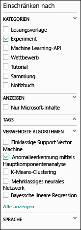
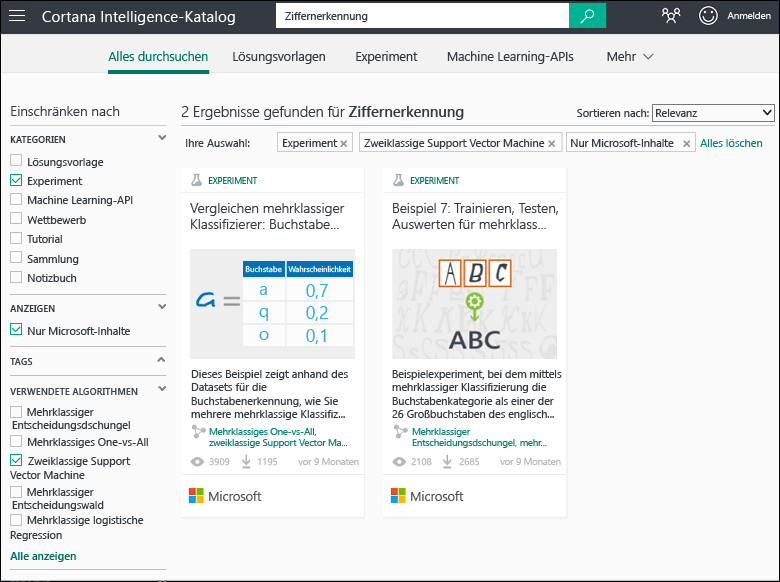
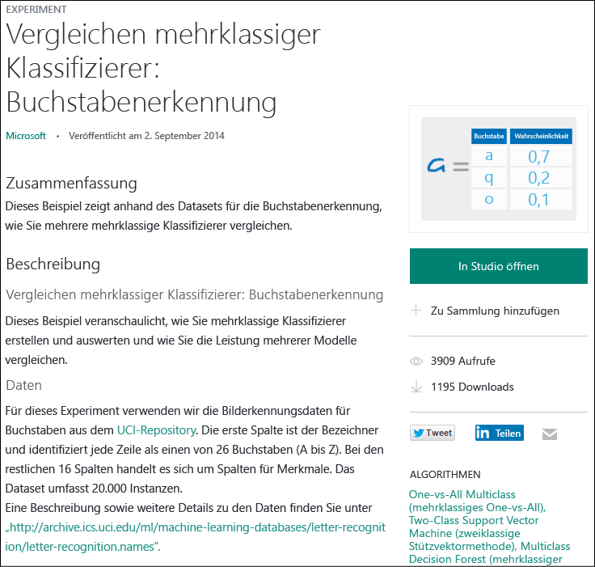

# Kopieren von Beispielexperimenten zum Erstellen neuer Machine Learning-Experimente
Es wird beschrieben, wie Sie mit Beispielexperimenten aus dem [Cortana Intelligence-Katalog](https://gallery.cortanaintelligence.com/) beginnen, anstatt Machine Learning-Experimente von Grund auf neu zu erstellen. Sie können die Beispiele verwenden, um eine eigene Machine Learning-Lösung zu erstellen.

Der Katalog enthält Beispielexperimente des Microsoft Azure Machine Learning-Teams und Beispiele aus der Machine Learning-Community. Sie können zudem auch Fragen stellen oder Anmerkungen zu Experimenten veröffentlichen.

Die Nutzung des Katalogs wird in dem dreiminütigen Video [Kopieren der Arbeit anderer für Ihre Data Science](machine-learning-data-science-for-beginners-copy-other-peoples-work-to-do-data-science.md) der Reihe [Data Science für Einsteiger](machine-learning-data-science-for-beginners-the-5-questions-data-science-answers.md) veranschaulicht.

[!INCLUDE [machine-learning-free-trial](../../includes/machine-learning-free-trial.md)]

## Suchen nach einem zu kopierenden Experiment im Cortana Intelligence-Katalog
Navigieren Sie zum [Katalog](https://gallery.cortanaintelligence.com/) und klicken Sie oben auf der Seite auf **Experiments** (Experimente), um anzuzeigen, welche Experimente verfügbar sind.

### Suchen nach den neuesten oder beliebtesten Experimenten
Auf dieser Seite können Sie Experimente der Kategorie **Recently added** anzeigen oder nach unten zu **What‘s popular** oder den neuesten **Popular Microsoft experiments** scrollen.

### Suchen nach einem Experiment, das bestimmte Anforderungen erfüllt
So durchsuchen Sie alle Experimente:

1. Klicken Sie oben auf der Seite auf **Browse all** (Alle durchsuchen).
2. Wählen Sie unter **Refine by** die Option **Experiment** aus, um alle im Katalog enthaltenen Experimente anzuzeigen.
3. Es gibt verschiedene Möglichkeiten zur Ermittlung von Experimenten, die Ihre Anforderungen erfüllen:
   * **Wählen Sie auf der linken Seite Filter aus.** Wenn Sie beispielsweise Experimente durchsuchen möchten, die einen Algorithmus zur PCA-basierten Erkennung von Anomalien verwenden, wählen Sie unter **Categories** die Option **Experiment** und unter **Algorithms Used** die Option **PCA-Based Anomaly Detection** aus. (Wenn Ihnen dieser Algorithmus nicht angezeigt wird, klicken Sie unten in der Liste auf **Show all**.)  
     
   * **Verwenden Sie das Suchfeld.**  Wenn Sie etwa nach Experimenten von Microsoft zur Ziffernerkennung suchen möchten, bei denen ein zweiklassiger Support Vector Machine-Algorithmus verwendet wird, geben Sie im Suchfeld „digit recognition“ (Ziffernerkennung) ein. Wählen Sie anschließend die Filter **Experiment**, **Microsoft content only** und **Two-Class Support Vector Machine** aus: 
4. Klicken Sie auf ein Experiment, um mehr darüber zu erfahren.
5. Zum Ausführen und/oder Ändern des Experiments klicken Sie auf der Seite des Experiments auf **Open in Studio** (In Studio öffnen).

   > [!NOTE]
   > Wenn Sie ein Experiment in Machine Learning Studio öffnen möchten, müssen Sie sich mit den Anmeldeinformationen für Ihr Microsoft-Konto anmelden. Wenn Sie noch keinen Machine Learning-Arbeitsbereich besitzen, wird ein Arbeitsbereich in der kostenlosen Testversion erstellt. [Informieren Sie sich über den Funktionsumfang der kostenlosen Testversion von Machine Learning](https://azure.microsoft.com/pricing/details/machine-learning/)
   >
   >

    

## Verwenden einer Vorlage in Machine Learning Studio
Sie können in Machine Learning Studio auch ein neues Experiment erstellen, indem Sie ein Beispiel aus dem Katalog als Vorlage verwenden.

1. Melden Sie sich mit den Anmeldeinformationen für Ihr Microsoft-Konto bei [Studio](https://studio.azureml.net)an, und klicken Sie dann auf **New** (Neu), um ein neues Experiment zu erstellen.
2. Durchsuchen Sie die Beispiele, und wählen Sie eines aus.

In Ihrem Arbeitsbereich wird ein neues Experiment erstellt, bei dem das Beispielexperiment als Vorlage genutzt wird.

## Nächste Schritte
* [Vorbereiten der Daten](machine-learning-data-science-import-data.md)
* [Verwenden von R im Experiment](machine-learning-r-quickstart.md)
* [Überprüfen der R-Beispielexperimente](machine-learning-r-csharp-web-service-examples.md)
* [Erstellen einer Webdienst-API](machine-learning-publish-a-machine-learning-web-service.md)

<!--HONumber=Nov16_HO3-->

