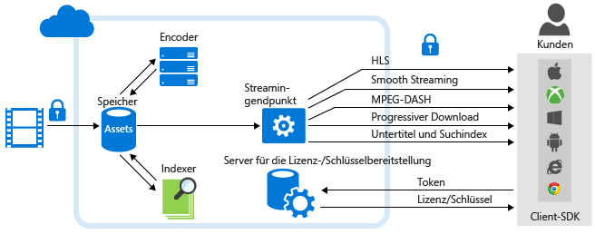

<properties
	pageTitle="Azure Media Services Analytics – Übersicht | Microsoft Azure"
	description="Azure Media Services bietet die öffentliche Vorschau von Azure Media Analytics, einer Zusammenstellung von Diensten in den Bereichen Sprache und maschinelles Sehen auf Unternehmensniveau, Compliance, Sicherheit und globale Reichweite. Azure Media Analytics Services werden unter Verwendung der Kernkomponenten der Azure Media Services-Plattform erstellt und können daher die skalierte Medienverarbeitung ab dem ersten Tag bewältigen. "
	services="media-services"
	documentationCenter=""
	authors="juliako"
	manager="erikre"
	editor=""/>

<tags
	ms.service="media-services"
	ms.workload="media"
	ms.tgt_pltfrm="na"
	ms.devlang="dotnet"
	ms.topic="article"
	ms.date="09/14/2016"   
	ms.author="milanga;juliako;johndeu"/>

# Azure Media Services Analytics – Übersicht | Microsoft Azure

##Übersicht

Immer mehr Organisationen und Unternehmen sehen in Video das bevorzugte Medium zum Trainieren ihrer Mitarbeiter, Binden ihrer Kunden und Dokumentieren von Geschäftsfunktionen. Mit Cloud Computing lassen sich diese großen Mediendateien effektiv speichern und streamen, und das Gleiche gilt für den Zugriff, aber mit den Unternehmen wachsen auch ihre Videoinhaltsbibliotheken, und sie benötigen ein gleichermaßen effektives Mittel zum Extrahieren neuer Erkenntnisse aus Videos, um aussagekräftigere, personalisiertere Interaktionen mit ihren Zielgruppen durchzuführen und so neue geschäftliche Erfolge zu erzielen.

Um diesen wachsenden Bedarf im Marketplace zu decken, bietet Azure Media Services Media Analytics an, eine Sammlung von Sprach- und Anzeigekomponenten (auf Unternehmensebene zu Compliance, Sicherheit und globaler Reichweite). Daraus können Organisationen und Unternehmen nutzbringende Einblicke aus ihren Videodateien erhalten. Azure Media Analytics Services werden unter Verwendung der Kernkomponenten der Azure Media Services-Plattform erstellt und können daher die skalierte Medienverarbeitung ab dem ersten Tag bewältigen.

Mit Azure Media Analytics können Entwickler schnell erste Schritte mit Funktionen für maschinelles Sehen für Video in begrenztem Umfang machen und diese erweiterte Funktionalität in Bots und Anwendungen einbringen. Azure Media Analytics ist für den Einsatz in Unternehmensumgebungen in vollem Umfang, mit Compliance, Sicherheit und globaler Reichweite bestimmt, wie von großen Organisationen gefordert.

Im folgenden Diagramm werden **Media Analytics** und andere wichtige Bestandteile der Media Services-Plattform dargestellt. Beachten Sie, dass Media Analytics-Medienprozessoren MP4- oder JSON-Dateien generieren. Wenn ein Medienprozessor eine MP4-Datei erstellt hat, können Sie die Datei progressiv herunterladen. Wenn ein Medienprozessor eine JSON-Datei erstellt hat, können Sie die Datei aus dem Azure-Blobspeicher herunterladen.

## Azure Media Analytics Services

- **Indexer:** Mit Azure Media Indexer können Sie Inhalte durchsuchbar machen und Untertitelspuren generieren. Azure Media Services hat **Azure Media Indexer 2 Preview** mit schnellerer Indizierung und umfassenderer Sprachunterstützung veröffentlicht. Zu den unterstützten Sprachen zählen Englisch, Spanisch, Französisch, Deutsch, Italienisch, Chinesisch, Portugiesisch und Arabisch. Ausführliche Informationen und Beispiele finden Sie unter [Indizieren von Mediendateien mit Azure Media Indexer 2 Preview](media-services-process-content-with-indexer2.md).
 
- **Hyperlapse:** Microsoft Hyperlapse ist das Ergebnis von mehr als 20 Jahren Forschung zu maschinellem Sehen bei Microsoft Research (MSR). Dabei werden Videostabilisierung und Zeitraffung kombiniert, um zusammenfassende, angenehm zu betrachtende, schöne Videos aus Ihren Langforminhalten zu erstellen. Außer zur Zeitraffererstellung können Sie Hyperlapse auch zum Erstellen von Videos mit stabilen Bildern aus verwackelten, mit Mobiltelefonen und Camcordern aufgezeichneten Videos verwenden. Ausführliche Informationen und Beispiele finden Sie unter [Hyperlapsing von Mediendateien mit Azure Media Hyperlapse](media-services-hyperlapse-content.md).
 
- **Bewegungserkennung:** Sie können diesen Dienst verwenden, um Bewegung in einem Video mit unbewegtem Hintergrund zu erkennen. Dies ist ideal für Kunden, die auf Überwachungsvideos von Überwachungskameras erkannte Bewegungsereignisse auf falsch-positive Ergebnisse überprüfen möchten. Ausführliche Informationen und Beispiele finden Sie unter [Bewegungserkennung mit Azure Media Analytics](media-services-motion-detection.md).
 
- **Gesichtserkennung und Gesichtsausdrücke:** Mit diesem Dienst können Sie Gesichter von Personen und ihre Gesichtsausdrücke erkennen, einschließlich Glück, Trauer, Ärger, Verachtung, Angst, Ekel und Gleichgültigkeit/Neutralität. Dies dient mehreren unten beschriebenen professionellen Anwendungen, inklusive dem Aggregieren und Analysieren der Reaktionen von Personen, die an einem Ereignis teilnehmen. Ausführliche Informationen und Beispiele finden Sie unter [Gesichts- und Gesichtsausdruckerkennung mit Azure Media Analytics](media-services-face-and-emotion-detection.md).
 
- **Videozusammenfassung:** Die Videozusammenfassung kann Ihnen dabei helfen, Zusammenfassungen von langen Videos durch das automatische Auswählen von interessanten Ausschnitten aus dem Quellvideo zu erstellen. Dies ist hilfreich, wenn Sie einen schnellen Überblick darüber bieten wollen, was man in einem langen Video zu sehen bekommt. Ausführliche Informationen und Beispiele finden Sie unter [Verwenden von Azure Media-Videominiaturansichten zum Erstellen einer Videozusammenfassung](media-services-video-summarization.md).

- **Optische Zeichenerkennung**: Azure Media Analytics OCR (Optical Character Recognition, Optische Zeichenerkennung) dient zum Umwandeln von Textinhalten in Videodateien in bearbeitbaren, durchsuchbaren digitalen Text. Dadurch können Sie die Extraktion aussagekräftiger Metadaten aus dem Videosignal Ihrer Medien automatisieren.
 
- **Skalierbare Gesichtsbearbeitung**: **Azure Media Redactor** ist ein Azure Media Analytics-Medienprozessor (MP), der eine skalierbare Gesichtsbearbeitung in der Cloud ermöglicht. Mit der Gesichtsbearbeitung können Sie Ihr Video ändern, um Gesichter von ausgewählten Personen unscharf anzuzeigen und so unkenntlich zu machen. Es kann beispielsweise sein, dass Sie den Gesichtsbearbeitungsdienst nutzen möchten, wenn es um die öffentliche Sicherheit oder Medienarbeit geht. Die Bearbeitung von Material mit einer Länge von einigen Minuten, das mehrere Gesichter enthält, kann bei manueller Vorgehensweise Stunden dauern. Mit diesem Dienst sind für den Prozess der Gesichtsbearbeitung aber nur einige einfache Schritte erforderlich. Weitere Informationen dazu finden Sie in [diesem Artikel](media-services-face-redaction.md).

 
## Häufige Szenarios

Die folgenden Szenarien zeigen, wie Azure Media Analytics Organisationen und Unternehmen aus allen Bereichen helfen kann, neue Erkenntnisse aus Videos zu gewinnen, um sowohl die Kommunikation mit Zielgruppen und Mitarbeitern personalisierter zu gestalten, als auch effektiver große Mengen an Videoinhalten zu verwalten:

- **Callcenter**: Trotz des Aufkommens sozialer Medien sind Kundencallcenter weiterhin für einen hohen Prozentsatz der Transaktionen im Kundendienst zuständig. In diesen Audiodaten ist eine Fülle von Informationen über Kunden verschlüsselt, die analysiert werden kann, um Produktroadmaps zu verbessern und auch Callcentermitarbeiter zu trainieren, um eine höhere Kundenzufriedenheit zu erreichen. Mithilfe von Azure Media Indexer können Kunden Text extrahieren sowie einen Suchindex und Dashboards erstellen, um Informationen zu den häufigsten Beschwerden, der Quelle von Beschwerden und anderen solchen relevanten Daten zu extrahieren.

- **Moderation benutzergenerierten Inhalts:** Viele Organisationen von Nachrichtenkanälen bis zu Polizeibehörden verfügen über Öffentlichkeitsportale, in denen sie benutzergenerierte Medien wie Videos und Bilder akzeptieren. Bei unerwarteten Ereignissen kann die Menge der Inhalte eskalieren. In diesen Szenarien ist es nahezu unmöglich, eine effektive manuelle Auswertung des Inhalts auf Angemessenheit durchzuführen. Kunden können sich darauf verlassen, dass der Inhaltsmoderationsdienst sich auf geeignete Inhalte konzentriert.

- **Überwachung:** Mit der Zunahme von IP-Kameras ist die Zahl von Überwachungsvideos explosionsartig gestiegen. Die manuelle Auswertung von Überwachungsvideos ist zeitintensiv und anfällig für menschliches Versagen. Azure Media Analytics bietet verschiedene Komponenten wie Bewegungserkennung, Gesichtserkennung und Hyperlapse, um das Auswerten, Verwalten und Erstellen von Derivaten zu vereinfachen.

## Media Services Analytics-Medienprozessoren 

In diesem Abschnitt sind alle Media Services Analytics-Medienprozessoren (MP) aufgeführt. Zudem wird gezeigt, wie Sie mithilfe von .NET oder REST ein MP-Objekt abrufen.

### MP-Namen

- Azure Media Indexer 2 Preview
- Azure Media Indexer
- Azure Media Hyperlapse
- Azure Media Face Detector
- Azure Media Motion Detector
- Azure Media Video Thumbnails
- Azure Media OCR

### .NET

Die folgende Funktion verwendet einen der angegebenen MP-Namen und gibt ein MP-Objekt zurück.

    static IMediaProcessor GetLatestMediaProcessorByName(string mediaProcessorName)
    {
        var processor = _context.MediaProcessors
            .Where(p => p.Name == mediaProcessorName)
            .ToList()
            .OrderBy(p => new Version(p.Version))
            .LastOrDefault();

        if (processor == null)
            throw new ArgumentException(string.Format("Unknown media processor",
                                                       mediaProcessorName));

        return processor;
    }

## REST

Anforderung:

	GET https://media.windows.net/api/MediaProcessors()?$filter=Name%20eq%20'Azure%20Media%20OCR' HTTP/1.1
	DataServiceVersion: 1.0;NetFx
	MaxDataServiceVersion: 3.0;NetFx
	Accept: application/json
	Accept-Charset: UTF-8
	User-Agent: Microsoft ADO.NET Data Services
	Authorization: Bearer <token>
	x-ms-version: 2.12
	Host: media.windows.net
	
Antwort:
		
	. . .
	
	{  
	   "odata.metadata":"https://media.windows.net/api/$metadata#MediaProcessors",
	   "value":[  
	      {  
	         "Id":"nb:mpid:UUID:074c3899-d9fb-448f-9ae1-4ebcbe633056",
	         "Description":"Azure Media OCR",
	         "Name":"Azure Media OCR",
	         "Sku":"",
	         "Vendor":"Microsoft",
	         "Version":"1.1"
	      }
	   ]
	}

##Demos

[Azure Media Analytics-Demos](http://azuremedialabs.azurewebsites.net/demos/Analytics.html)

##Nächster Schritt

Überprüfen Sie die Media Services-Lernpfade.

[AZURE.INCLUDE [media-services-learning-paths-include](../../includes/media-services-learning-paths-include.md)]

##Feedback geben

[AZURE.INCLUDE [media-services-user-voice-include](../../includes/media-services-user-voice-include.md)]

##Verwandte Artikel

[Media Services Analytics – Ankündigung](https://azure.microsoft.com/blog/introducing-azure-media-analytics/)
  

<!-- Images -->

[overview]: ./media/media-services-video-on-demand-workflow/media-services-video-on-demand.png

<!---HONumber=AcomDC_0921_2016-->