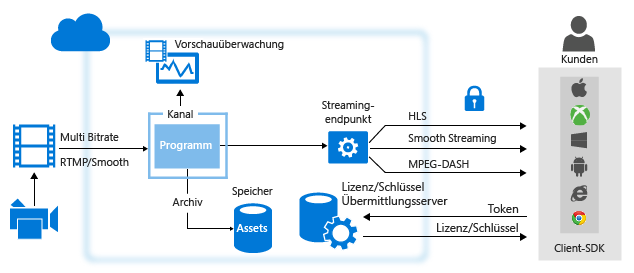
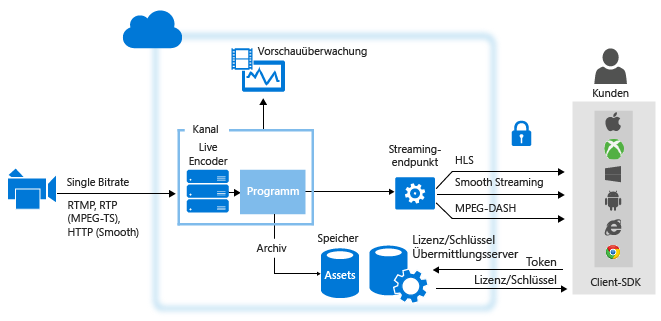

# Übersicht über Livestreaming mit Azure Media Services
## Übersicht
Beim Bereitstellen von Livestreamingereignissen mit Azure Media Services sind häufig die folgenden Komponenten beteiligt:

* Eine Kamera, mit der ein Ereignis übertragen wird.
* Ein Live-Video-Encoder, der Signale von der Kamera in Datenströme konvertiert, die an einen Livestreaming-Dienst gesendet werden.

    Optional: mehrere zeitsynchronisierte Liveencoder. Für bestimmte kritische Liveereignisse, die eine sehr hohe Verfügbarkeit und Quality of Experience erfordern, wird der Einsatz redundanter Aktiv-Aktiv-Encoder mit Zeitsynchronisierung empfohlen, um ein nahtloses Failover ohne Datenverlust zu erreichen.
* Ein Livestreaming-Dienst, der Ihnen Folgendes ermöglicht:

  * Erfassen von Liveinhalten über verschiedene Livestreaming-Protokolle (z. B. RTMP oder Smooth Streaming)
  * Optional: Codieren des Datenstroms in einen Datenstrom mit adaptiver Bitrate
  * Vorschau des Livestreams
  * Aufzeichnen und Speichern des erfassten Inhalts für ein späteres Streaming (Video-on-Demand)
  * Übermitteln der Inhalte über häufig verwendete Streamingprotokolle (etwa MPEG DASH, Smooth oder HLS) direkt an die Kunden oder an ein Content Delivery Network (CDN) zur weiteren Verteilung

**Microsoft Azure Media Services** (AMS) können Sie Livestreaminginhalte erfassen, codieren, in der Vorschau anzeigen, speichern und bereitstellen.

Bei der Übermittlung Ihrer Inhalte für Kunden besteht Ihr Ziel darin, qualitativ hochwertige Videos für unterschiedliche Geräte unter verschiedenen Netzwerkbedingungen bereitzustellen. Dazu codieren Sie den Datenstrom mit Liveencodern in einen Videodatenstrom mit mehreren Bitraten (adaptive Bitrate).  Verwenden Sie die [dynamische Paketerstellung](media-services-dynamic-packaging-overview.md) von Media Services, um den Datenstrom dynamisch erneut in verschiedene Protokolle zu packen. Media Services unterstützt die folgenden Technologien mit Adaptive Bitrate Streaming: HTTP Live Streaming (HLS), Smooth Streaming und MPEG DASH.

In Azure Media Services verarbeiten die **Kanäle**, **Programme** und **Streamingendpunkte** alle Livestreamingfunktionen, einschließlich Erfassung, Formatierung, DVR, Sicherheit, Skalierbarkeit und Redundanz.

Ein **Kanal** stellt eine Pipeline zum Verarbeiten von Livestreaming-Inhalten dar. Ein Kanal kann Live-Eingabedatenströme auf folgende Arten empfangen:

* Von einem lokalen Liveencoder wird Mehrfachbitraten-basiertes **RTMP** oder **Smooth Streaming** (fragmentiertes MP4) an den für **Pass-Through** konfigurierten Kanal gesendet. Bei der **Pass-Through-Übertragung** durchlaufen die erfassten Datenströme die **Kanäle** ohne weitere Verarbeitung. Sie können die folgenden Liveencoder verwenden, von denen Smooth Streaming mit Mehrfachbitrate ausgegeben werden kann: MediaExcel, Ateme, Imagine Communications, Envivio, Cisco und Elemental. Die folgenden Liveencoder geben RTMP aus: Transcoder für Adobe Flash Media Live Encoder (FMLE), Telestream Wirecast, Haivision, Teradek und Tricaster.  Ein Liveencoder kann auch einen Single-Bitrate-Datenstrom an einen Kanal senden, der nicht für Live Encoding konfiguriert ist. Dies wird jedoch nicht empfohlen. Auf Anforderung wird der Datenstrom den Kunden von Media Services bereitgestellt.

  > [!NOTE]
  > Die Verwendung der Pass-Through-Methode ist die wirtschaftlichste Form des Livestreamings, wenn mehrere Ereignisse über einen längeren Zeitraum gestreamt werden und Sie bereits in lokale Encoder investiert haben. Preisdetails finden Sie [hier](https://azure.microsoft.com/pricing/details/media-services/) .
  > 
  > 
* Ein lokaler Liveencoder sendet einen Single-Bitrate-Datenstrom an den Kanal, der zum Ausführen von Live Encoding mit Media Services in einem der folgenden Formate aktiviert wurde: RTMP oder Smooth Streaming (fragmentiertes MP4). RTP (MPEG-TS) wird ebenfalls unterstützt, sofern Sie über eine dedizierte Verbindung mit dem Azure-Rechenzentrum verfügen. Bei den folgenden Liveencodern mit RTMP-Ausgabe ist bekannt, dass sie mit Kanälen dieses Typs funktionieren: Telestream Wirecast, FMLE. Vom Kanal wird dann eine Livecodierung des Single-Bitrate-Eingabedatenstroms in einen Multi-Bitrate-Videodatenstrom (adaptiv) ausgeführt. Auf Anforderung wird der Datenstrom den Kunden von Media Services bereitgestellt.

Mit Media Services-Version 2.10 können Sie beim Erstellen eines Kanals angeben, wie der Eingabedatenstrom vom Kanal empfangen werden soll und ob vom Kanal eine Livecodierung des Datenstroms ausgeführt werden soll. Sie haben zwei Möglichkeiten:

* **Keine** (Pass-Through): Geben Sie diesen Wert an, wenn ein lokaler Liveencoder verwendet werden soll, von dem ein Multi-Bitrate-Datenstrom (Pass-Through-Datenstrom) ausgegeben wird. In diesem Fall wird der Eingabedatenstrom ohne Codierung an die Ausgabe geleitet. Bis zur Version 2.10 ist dies das Standardkanalverhalten.  
* **Standard** : Wählen Sie diesen Wert, wenn Sie Media Services verwenden möchten, um einen Single-Bitrate-Livedatenstrom in einen Multi-Bitrate-Datenstrom zu codieren. Diese Methode ist effizient für das schnelle Skalieren selten auftretender Ereignisse. Beachten Sie, dass das Live Encoding sich auf die Abrechnung auswirkt und dass die Beibehaltung des Status „Wird ausgeführt“ für einen Live Encoding-Kanal mit Gebühren verbunden ist.  Es wird empfohlen, die Ausführung der Kanäle sofort zu beenden, wenn das Livestreaming-Ereignis abgeschlossen ist, um das Anfallen zusätzlicher Stundengebühren zu vermeiden.

## Vergleich von Kanaltypen
Die folgende Tabelle enthält eine Anleitung für den Vergleich der beiden von Media Services unterstützten Kanaltypen.

| Feature | Pass-Through-Kanal | Standardkanal |
| --- | --- | --- |
| Die Single-Bitrate-Eingabe wird in mehreren Bitraten in der Cloud codiert. |Nein |Ja |
| Maximale Auflösung, Anzahl der Ebenen |1080p, 8 Ebenen, 60 fps oder mehr |720p, 6 Ebenen, 30 fps |
| Eingabeprotokolle |RTMP, Smooth Streaming |RTMP, Smooth Streaming und RTP |
| Preis |Informieren Sie sich auf der [Preisseite](https://azure.microsoft.com/pricing/details/media-services/) , und klicken Sie auf die Registerkarte „Live-Video“. |Informieren Sie sich auf der [Preisseite](https://azure.microsoft.com/pricing/details/media-services/) |
| Maximale Laufzeit |Rund um die Uhr |8 Stunden |
| Unterstützung für das Einfügen von Slates |Nein |Ja |
| Unterstützung für Werbeeinblendungen |Nein |Ja |
| Pass-Through-CEA-608/708-Untertitel |Ja |Ja |
| Möglichkeit zum Wiederherstellen nach kurzen Unterbrechungen im Beitrag |Ja |Nein (Kanal beginnt Slating nach 6 Sekunden ohne Dateneingabe) |
| Unterstützung für nicht einheitliche Eingabe-GOPs |Ja |Nein, Eingabe muss aus festen 2-Sekunden-GOPs bestehen |
| Unterstützung für Eingaben mit variable Bildwiederholrate |Ja |Nein, Eingabe muss eine feste Bildfrequenz aufweisen. Kleinere Abweichungen, beispielsweise bei Szenen mit viel Bewegung, werden toleriert. Der Encoder kann aber nicht bis auf 10 Frames pro Sekunde zurückfallen. |
| Automatische Abschaltung der Kanäle, wenn der Eingabefeed verloren geht |Nein |Nach 12 Stunden, wenn kein Programm ausgeführt wird |

## Arbeiten mit Kanälen, die Livedatenströme mit mehreren Bitraten von lokalen Encodern empfangen (Pass-Through)
Das folgende Diagramm zeigt die Hauptkomponenten der AMS-Plattform, die am **Pass-Through-Workflow** beteiligt sind:

Weitere Informationen finden Sie unter [Arbeiten mit Kanälen, die Livedatenströme mit mehreren Bitraten von lokalen Encodern empfangen](media-services-live-streaming-with-onprem-encoders.md).

## Arbeiten mit Kanälen, die zum Ausführen von Livecodierung mit Azure Media Services aktiviert wurden
Das folgende Diagramm zeigt die Hauptkomponenten der AMS-Plattform, die in Livestreaming-Workflows beteiligt sind, wenn ein Kanal zum Ausführen der Livecodierung mit Media Services aktiviert ist.

Weitere Informationen finden Sie unter [Arbeiten mit Kanälen, die zum Ausführen von Livecodierung mit Azure Media Services aktiviert wurden](media-services-manage-live-encoder-enabled-channels.md).

## Beschreibung von Kanälen und zugehörigen Komponenten
### Kanal
In Media Services sind [Kanäle](https://docs.microsoft.com/rest/api/media/operations/channel)für die Verarbeitung von Livestreaminginhalten zuständig. Ein Kanal stellt einen Eingabeendpunkt (Erfassungs-URL) bereit, den Sie dann einem Live-Transcoder vorlegen. Der Kanal empfängt Live-Eingabestreams aus dem Live-Transcoder und stellt diese zum Streamen durch einen oder mehrere StreamingEndpoints zur Verfügung. Zudem bieten Kanäle einen Vorschauendpunkt (Vorschau-URL), mit dem Sie eine Vorschau des Streams anzeigen und überprüfen können, bevor Sie diesen weiter verarbeiten und übermitteln.

Beim Erstellen des Kanals können Sie die Erfassungs-URL und die Vorschau-URL erhalten. Zum Abfragen dieser URLs muss sich der Kanal nicht im gestarteten Zustand befinden. Wenn Sie zum Übermitteln von Daten aus einem Live-Transcoder an den Kanal bereit sind, muss der Kanal gestartet werden. Sobald der Live-Transcoder mit dem Erfassen von Daten beginnt, können Sie eine Vorschau des Streams anzeigen.

Jedes Media Services-Konto kann mehrere Kanäle, mehrere Programme und mehrere StreamingEndpoints enthalten. Je nach den Anforderungen an Bandbreite und Sicherheit können StreamingEndpoint-Dienste einem oder mehreren Kanälen zugeordnet werden. Jeder StreamingEndpoint kann von jedem Kanal abrufen.

### Programm
Mit einem [Programm](https://docs.microsoft.com/rest/api/media/operations/program) können Sie die Veröffentlichung und Speicherung von Segmenten in einem Livestream steuern. Kanäle verwalten Programme. Die Beziehung zwischen Kanal und Programm ähnelt herkömmlichen Medien, bei denen ein Kanal einen konstanten Stream von Inhalten aufweist und ein Programm auf ein zeitlich festgelegtes Ereignis in diesem Kanal ausgerichtet ist.
Über die Eigenschaft **ArchiveWindowLength** können Sie die Anzahl der Stunden festlegen, für die Sie den aufgezeichneten Inhalt für das Programm beibehalten möchten. Dieser Wert kann von mindestens 5 Minuten bis zu einem Höchstwert von 25 Stunden eingestellt werden.

ArchiveWindowLength bestimmt außerdem die maximale Dauer, für die Clients von der aktuellen Liveposition aus rückwärts suchen können. Programme können über die angegebene Zeitspanne laufen. Inhalte, die über das Zeitfenster hinausgehen, werden jedoch fortlaufend verworfen. Durch den Wert dieser Eigenschaft wird außerdem festgelegt, wie lange Clientmanifeste wachsen können.

Jedes Programm ist mit einem Medienobjekt verknüpft. Zum Veröffentlichen des Programms müssen Sie einen Locator für das zugehörige Medienobjekt erstellen. Mithilfe dieses Locators können Sie eine Streaming-URL erstellen, die Sie Ihren Kunden bereitstellen können.

Ein Kanal unterstützt bis zu drei gleichzeitig ausgeführte Programme, sodass Sie mehrere Archive desselben eingehenden Datenstroms erstellen können. Auf diese Weise können Sie verschiedene Teile eines Ereignisses nach Bedarf veröffentlichen und archivieren. Beispielsweise könnte Ihre Geschäftsanforderung darin bestehen, 6 Stunden eines Programms zu archivieren, jedoch nur die letzten 10 Minuten zu senden. Dazu müssen Sie zwei Programme erstellen, die gleichzeitig ausgeführt werden. Ein Programm wird auf die Archivierung von 6 Stunden des Ereignisses festgelegt. Dieses Programm wird jedoch nicht veröffentlicht. Das andere Programm wird auf die Archivierung von 10 Minuten festgelegt. Dieses Programm wird veröffentlicht.

## Hinweise zur Gebührenberechnung
Für einen Kanal beginnt die Berechnung von Gebühren, sobald der Status über die API in „Wird ausgeführt“ geändert wird.  

In der folgenden Tabelle ist dargestellt, wie Kanalzustände den Abrechnungszuständen in der API und im Azure-Portal zugeordnet werden. Beachten Sie, dass sich die Zustände zwischen der API und der Benutzeroberfläche des Portals leicht unterscheiden. Sobald ein Kanal über die API in den Zustand „Wird ausgeführt“ oder im Azure-Portal in den Zustand „Bereit“ oder „Streaming“ versetzt wird, wird die Abrechnung aktiv.

Um die weitere Gebührenberechnung für den Kanal zu beenden, müssen Sie den Kanal über die API oder im Azure-Portal beenden.
Sie sind für das Beenden Ihrer Kanäle verantwortlich, wenn Sie die Nutzung des Kanals abgeschlossen haben. Wenn Sie den Kanal nicht beenden, werden weiter Gebühren berechnet.

> [!NOTE]
> Bei der Arbeit mit Standardkanälen deaktiviert AMS alle Kanäle automatisch, die 12 Stunden nach Verlust des Eingabefeeds immer noch den Status „Wird ausgeführt“ haben, und wenn keine Programme ausgeführt werden. Allerdings wird Ihnen dennoch die Zeit in Rechnung gestellt, die der Kanal den Status „Wird ausgeführt“ hatte.
>
>

### Kanalstatus und ihre Zuordnung zum Abrechnungsmodus
Dies ist der aktuelle Status des Kanals. Mögliche Werte sind:

* **Stopped**(Beendet): Dies ist der anfängliche Status des Kanals nach seiner Erstellung (es sei denn, im Portal wurde das automatische Starten gewählt). Dies ist der anfängliche Status des Kanals nach seiner Erstellung (es sei denn, im Portal wurde das automatische Starten gewählt). In diesem Status werden keine Gebühren berechnet. Ein Streaming ist jedoch nicht zulässig.
* **Wird gestartet**. Der Kanal wird gestartet. In diesem Status werden keine Gebühren berechnet. In diesem Status sind weder Updates noch Streaming zulässig. Wenn ein Fehler auftritt, wird der Kanal in den Status „Stopped“ (Angehalten) geschaltet.
* **Wird ausgeführt**. Vom Kanal können Livestreams verarbeitet werden. Die Nutzung wird jetzt berechnet. Sie müssen den Kanal beenden, um zu verhindern, dass weiter Gebühren berechnet werden.
* **Wird beendet**. Der Kanal wird beendet. In diesem Übergangszustand erfolgt keine Berechnung. In diesem Status sind weder Updates noch Streaming zulässig.
* **Wird gelöscht**. Der Kanal wird gelöscht. In diesem Übergangszustand erfolgt keine Berechnung. In diesem Status sind weder Updates noch Streaming zulässig.

In der folgenden Tabelle ist die Zuordnung der Kanalstatus mit den Abrechnungsmodi aufgeführt.

| Kanalstatus | Portal-UI-Indikatoren | Werden Gebühren berechnet? |
| --- | --- | --- |
| Wird gestartet |Wird gestartet |Nein (Übergangsstatus) |
| Wird ausgeführt |Bereit (keine ausgeführten Programme) oder Streaming (mindestens ein laufendes Programm) |JA |
| Wird beendet |Wird beendet |Nein (Übergangsstatus) |
| Stopped |Stopped |Nein |

## Media Services-Lernpfade
[!INCLUDE [media-services-learning-paths-include](../../includes/media-services-learning-paths-include.md)]

## Feedback geben
[!INCLUDE [media-services-user-voice-include](../../includes/media-services-user-voice-include.md)]

## Verwandte Themen
[Spezifikation der Fragmented MP4-Echtzeiterfassung für Azure Media Services](media-services-fmp4-live-ingest-overview.md)

[Arbeiten mit Kanälen, die zum Ausführen von Livecodierung mit Azure Media Services aktiviert wurden](media-services-manage-live-encoder-enabled-channels.md)

[Arbeiten mit Kanälen, die Livedatenströme mit mehreren Bitraten von lokalen Encodern empfangen](media-services-live-streaming-with-onprem-encoders.md)

[Kontingente und Einschränkungen](media-services-quotas-and-limitations.md).  

[Media Services-Konzepte](media-services-concepts.md)

