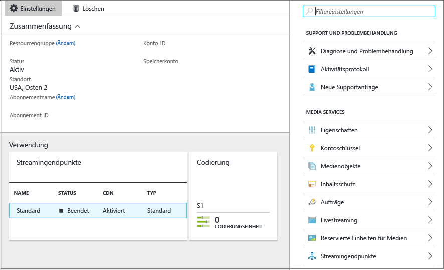
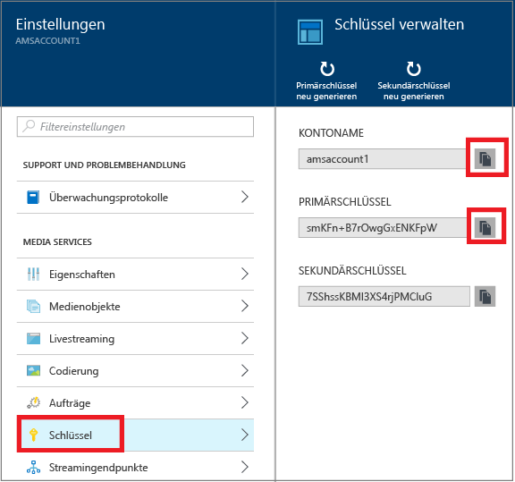

# Erstellen eines Azure Media Services-Kontos mithilfe des Azure-Portals
> [!div class="op_single_selector"]
> * [Portal](media-services-portal-create-account.md)
> * [PowerShell](media-services-manage-with-powershell.md)
> * [REST](https://docs.microsoft.com/rest/api/media/mediaservice)
> 
> [!NOTE]
> Sie benötigen ein Azure-Konto, um dieses Lernprogramm auszuführen. Weitere Informationen finden Sie unter [Kostenloses Azure-Testkonto](https://azure.microsoft.com/pricing/free-trial/). 
> 
> 

Über das Azure-Portal können Sie schnell ein AMS-Konto (Azure Media Services) erstellen. Sie können mit Ihrem Konto auf Mediendienste zugreifen, die Funktionen zum Speichern, Verschlüsseln, Codieren, Verwalten und Streamen von Medieninhalten in Azure bereitstellen. Beim Erstellen eines Media Services-Kontos erstellen Sie auch ein zugehöriges Speicherkonto (oder verwenden ein vorhandenes) in der gleichen geografischen Region wie das Media Services-Konto.

In diesem Artikel werden einige allgemeine Konzepte erläutert, und Sie erfahren, wie Sie ein Media Services-Konto über das Azure-Portal erstellen.

## Konzepte
Für den Zugriff auf Media Services sind zwei zugeordnete Konten erforderlich:

* Media Services-Konto. Über Ihr Konto erhalten Sie Zugriff auf eine Reihe cloudbasierter Mediendienste in Azure. In einem Media Services-Konto wird kein Medieninhalt gespeichert. Stattdessen werden Metadaten über die Medieninhalte und Medienverarbeitungsaufträge in Ihrem Konto gespeichert. Beim Erstellen des Kontos wählen Sie eine verfügbare Media Services-Region aus. Bei der ausgewählten Region handelt es sich um ein Rechenzentrum, in dem Metadaten-Datensätze für Ihr Konto gespeichert werden.
  
    Folgende Media Services-Regionen (AMS) sind verfügbar: "Nordeuropa", "Westeuropa", "USA, Westen", "USA, Osten", "Südostasien", "Ostasien", "Japan, Westen", "Japan, Osten". Media Services verwendet keine Affinitätsgruppen.
  
    AMS ist jetzt auch in den folgenden Rechenzentren verfügbar: „Brasilien, Süden“, „Indien, Westen“, „Indien, Süden“ und „Indien, Mitte“. Über das Azure-Portal können Sie nun Media Service-Konten erstellen und verschiedene hier beschriebene Aufgaben ausführen. Live Encoding ist in diesen Datencentern jedoch nicht aktiviert. Darüber hinaus sind nicht alle Arten von für die Codierung reservierten Einheiten in diesen Datencentern verfügbar.
  
  * „Brasilien, Süden“: Reservierte Einheiten für die Codierung stehen nur im Standard- und Basic-Tarif zur Verfügung.
  * „Indien, Westen“, „Indien, Süden“: 
* Ein Azure-Speicherkonto. Das Speicherkonto muss sich in der gleichen geografischen Region befinden wie das Media Services-Konto. Bei der Erstellung eines Media Services-Kontos können Sie entweder ein vorhandenes Speicherkonto in derselben Region auswählen oder ein neues Speicherkonto in derselben Region erstellen. Wenn Sie ein Media Services-Konto löschen, bleiben die Blobs im zugehörigen Speicherkonto erhalten.

## Erstellen eines AMS-Kontos
In diesem Abschnitt erfahren Sie, wie Sie ein AMS-Konto erstellen.

1. Melden Sie sich beim [Azure-Portal](https://portal.azure.com/)an.
2. Klicken Sie auf **+Neu** > **Web und mobil** > **Media Services**.
   
    
3. Geben Sie unter **CREATE MEDIA SERVICES ACCOUNT** (MEDIA SERVICES-KONTO ERSTELLEN) die erforderlichen Werte ein.
   
    
   
   1. Geben Sie unter **Kontoname**den Namen des neuen AMS-Kontos ein. Der Name eines Media Services-Kontos darf nur Kleinbuchstaben oder Ziffern ohne Leerzeichen enthalten und muss aus 3 bis 24 Zeichen bestehen.
   2. Wählen Sie unter „Abonnement“ das Azure-Abonnement aus, auf das Sie Zugriff haben.
   3. Wählen Sie unter **Ressourcengruppe**die neue oder vorhandene Ressource aus.  Eine Ressourcengruppe ist eine Sammlung von Ressourcen mit gleichem Lebenszyklus, gleichen Berechtigungen und gleichen Richtlinien. [Hier](../azure-resource-manager/resource-group-overview.md#resource-groups) erhalten Sie weitere Informationen.
   4. Wählen Sie unter **Standort** die geografische Region aus, in der die Medien- und Metadaten-Datensätze für Ihr Media Services-Konto gespeichert werden sollen. Diese Region wird zum Verarbeiten und Streamen Ihrer Medien verwendet. Im Dropdownlistenfeld werden nur die verfügbaren Media Services-Regionen angezeigt. 
   5. Wählen Sie unter **Speicherkonto**ein Speicherkonto aus, das als Blobspeicher für die Medieninhalte aus Ihrem Media Services-Konto dienen soll. Sie können ein vorhandenes Speicherkonto in der gleichen geografischen Region auswählen, in der sich auch Ihr Media Services-Konto befindet, oder ein Speicherkonto erstellen. Ein neues Speicherkonto wird in derselben Region erstellt. Für Namen von Speicherkonten gelten die gleichen Regeln wie für Namen von Media Services-Konten.
      
       Weitere Informationen zum Speicher finden Sie [hier](../storage/storage-introduction.md).
   6. Wählen Sie **An Dashboard anheften** aus, um den Status der Kontobereitstellung anzuzeigen.
4. Klicken Sie unten im Formular auf **Erstellen** .
   
    Nachdem die Erstellung des Kontos erfolgreich abgeschlossen wurde, wird die Seite mit der Übersicht geladen. In der Streamingendpunkt-Tabelle ist für das Konto ein Standard-Streamingendpunkt mit dem Status **Beendet** angegeben. 

    >[!NOTE]
    >Beim Erstellen Ihres AMS-Kontos wird dem Konto ein **Standard**-Streamingendpunkt mit dem Status **Beendet** hinzugefügt. Um mit dem Streamen der Inhalte zu beginnen und die dynamische Paketerstellung und dynamische Verschlüsselung zu nutzen, muss der Streamingendpunkt, von dem Sie Inhalte streamen möchten, den Status **Wird ausgeführt** aufweisen. 
   
    
   
    Verwenden Sie zum Verwalten Ihres AMS-Kontos (Hochladen von Videos, Codieren von Ressourcen, Überwachen des Auftragsstatus und Ähnliches) das Fenster **Einstellungen** .

## Schlüssel verwalten
Sie benötigen den Kontonamen und den Primärschlüssel, um programmgesteuert auf das Media Services-Konto zugreifen zu können.

1. Wählen Sie im Azure-Portal Ihr Konto aus. 
   
    Das Fenster **Einstellungen** wird auf der rechten Seite angezeigt. 
2. Wählen Sie im Fenster **Einstellungen** die Option **Schlüssel** aus. 
   
    Im Fenster **Schlüssel verwalten** werden der Kontoname sowie der Primär- und Sekundärschlüssel angezeigt. 
3. Kopieren Sie die Werte mithilfe der Kopierschaltfläche.
   
    

## Nächste Schritte
Nun können Sie Dateien in Ihrer AMS-Konto hochladen. Weitere Informationen finden Sie unter [Upload files](media-services-portal-upload-files.md)(Hochladen von Dateien).

## Media Services-Lernpfade
[!INCLUDE [media-services-learning-paths-include](../../includes/media-services-learning-paths-include.md)]

## Feedback geben
[!INCLUDE [media-services-user-voice-include](../../includes/media-services-user-voice-include.md)]

<!--HONumber=Jan17_HO2-->

