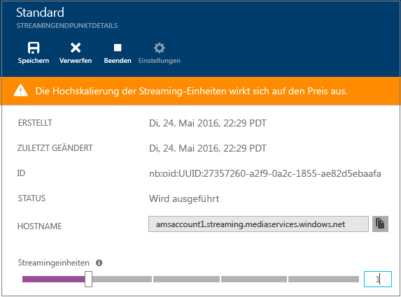
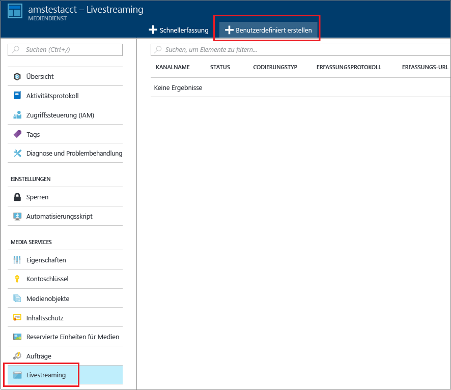
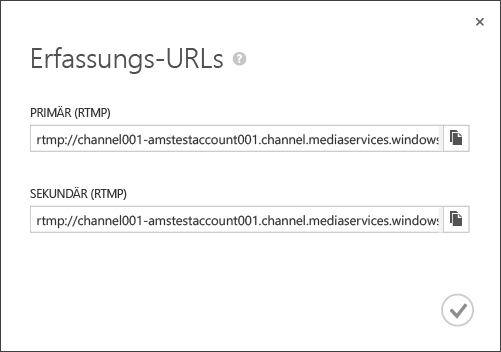
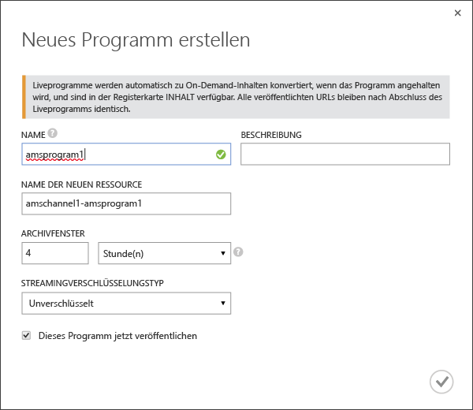
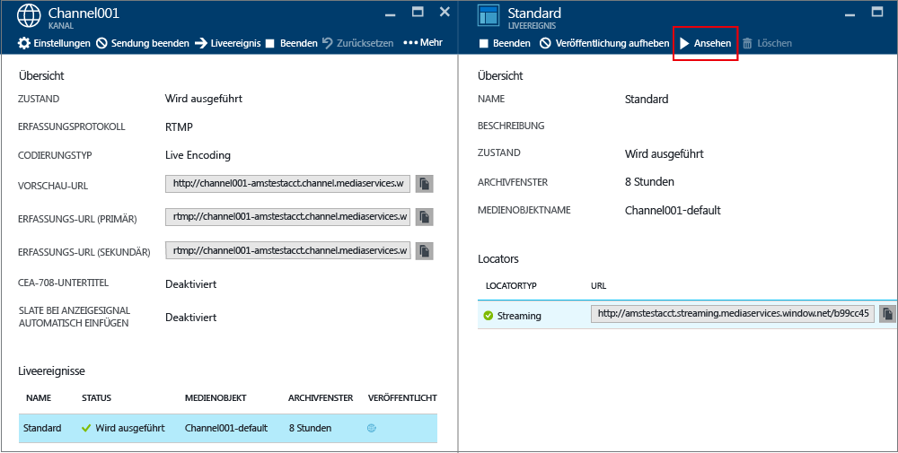
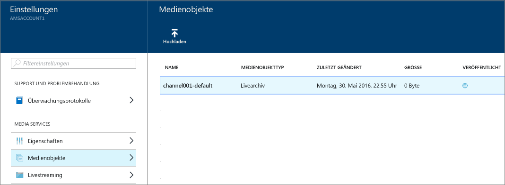

<properties 
	pageTitle="Gewusst wie: Livestreaming mit Azure Media Services zum Erstellen von Datenströmen mit Mehrfachbitrate im Azure-Portal | Microsoft Azure" 
	description="In diesem Lernprogramm werden Sie durch die Schritte zum Erstellen eines Kanals über das Azure-Portal geführt, von dem ein Single-Bitrate-Livedatenstrom empfangen und in einen Multi-Bitrate-Datenstrom codiert wird." 
	services="media-services" 
	documentationCenter="" 
	authors="anilmur" 
	manager="erikre" 
	editor=""/>

<tags 
	ms.service="media-services" 
	ms.workload="media" 
	ms.tgt_pltfrm="na" 
	ms.devlang="na" 
	ms.topic="get-started-article"
	ms.date="09/06/2016"
	ms.author="juliako;juliako"/>

#Gewusst wie: Livestreaming mit Azure Media Services zum Erstellen von Datenströmen mit Mehrfachbitrate im Azure-Portal

> [AZURE.SELECTOR]
- [Portal](media-services-portal-creating-live-encoder-enabled-channel.md)
- [.NET](media-services-dotnet-creating-live-encoder-enabled-channel.md)
- [REST-API](https://msdn.microsoft.com/library/azure/dn783458.aspx)

In diesem Lernprogramm werden Sie durch die Schritte zum Erstellen eines **Kanals** geführt, von dem ein Single-Bitrate-Livedatenstrom empfangen und in einen Multi-Bitrate-Datenstrom codiert wird.

>[AZURE.NOTE]Weitere grundlegende Informationen zu Kanälen, die für Livecodierung aktiviert sind, finden Sie unter [Arbeiten mit Kanälen, die zum Ausführen von Livecodierung mit Azure Media Services aktiviert wurden](media-services-manage-live-encoder-enabled-channels.md).

##Allgemeines Livestreamingszenario

Im Folgenden werden grundlegende Schritte zum Erstellen allgemeiner Livestreaminganwendungen erläutert.

>[AZURE.NOTE] Die maximal empfohlene Dauer eines Liveereignisses beträgt derzeit 8 Stunden. Wenden Sie sich an „AMSLiveD at Microsoft.com“, wenn Sie einen Kanal für längere Zeit laufen lassen müssen.

1. Schließen Sie eine Videokamera an einen Computer an. Starten und konfigurieren Sie einen lokalen Liveencoder, von dem ein Single-Bitrate-Datenstrom in einem der folgenden Protokolle ausgegeben wird: RTMP, Smooth Streaming oder RTP (MPEG-TS). Weitere Informationen finden Sie unter [Microsoft Azure Media Services RTMP-Support und Liveencoder](http://go.microsoft.com/fwlink/?LinkId=532824).
	
	Dieser Schritt kann auch nach der Erstellung des Kanals ausgeführt werden.

1. Erstellen Sie einen Kanal, und starten Sie ihn.

1. Rufen Sie die Erfassungs-URL des Kanals ab.

	Die Erfassungs-URL wird vom Liveencoder verwendet, um den Datenstrom an den Kanal zu senden.
1. Rufen Sie die Vorschau-URL des Kanals ab.

	Verwenden Sie diese URL, um sicherzustellen, dass der Livestream ordnungsgemäß vom Kanal empfangen wird.

3. Erstellen Sie ein Ereignis/Programm (dadurch wird auch ein Asset erstellt).
1. Veröffentlichen Sie das Ereignis (dadurch wird ein OnDemand-Locator für das zugehörige Asset erstellt).

	Stellen Sie sicher, dass auf dem Streamingendpunkt, von dem Sie Inhalte streamen möchten, mindestens eine für das Streaming reservierte Einheit verfügbar ist.
1. Wenn Sie zum Starten von Streaming und Archivierung bereit sind, starten Sie das Ereignis.
2. Optional kann vom Liveencoder eine Ankündigung gestartet werden. Die Ankündigung wird in den Ausgabedatenstrom eingefügt.
1. Sie können das Ereignis und damit das Streaming und die Archivierung des Ereignisses jederzeit beenden.
1. Löschen Sie das Ereignis (und optional das Asset).

##Dieses Lernprogramm umfasst folgende Punkte

In diesem Lernprogramm wird das Azure-Portal verwendet, um die folgenden Aufgaben auszuführen:

2.  Konfigurieren von Streamingendpunkten
3.  Erstellen eines Kanals, der zum Ausführen von Livecodierung aktiviert ist
1.  Abrufen der Erfassungs-URL, um sie dem Liveencoder bereitzustellen Diese URL wird vom Liveencoder verwendet, um den Datenstrom in den Kanal zu leiten.
1.  Erstellen eines Ereignisses/Programms (und eines Assets)
1.  Veröffentlichen des Medienobjekts und Abrufen von Streaming-URLs
1.  Wiedergeben Ihrer Inhalte
2.  Bereinigen

##Voraussetzungen
Zum Abschließen dieses Lernprogramms müssen folgende Voraussetzungen erfüllt sein:

- Sie benötigen ein Azure-Konto, um dieses Lernprogramm auszuführen. Wenn Sie noch kein Konto haben, können Sie in nur wenigen Minuten ein kostenloses Testkonto erstellen. Ausführliche Informationen finden Sie unter [Kostenlose Azure-Testversion](https://azure.microsoft.com/pricing/free-trial/).
- Media Services-Konto. Informationen zum Erstellen eines Media Services-Kontos finden Sie unter [Konto erstellen](media-services-create-account.md).
- Sie benötigen eine Webcam und einen Encoder, von dem ein Single-Bitrate-Livedatenstrom gesendet wird.

##Konfigurieren von Streamingendpunkten 

Media Services umfasst die dynamische Paketerstellung, bei der Sie MP4-Dateien mit variablen Bitraten in den folgenden Streamingformaten bereitstellen können: MPEG DASH, HLS, Smooth Streaming oder HDS. Hierbei ist es nicht erforderlich, diese Streamingformate erneut zu verpacken. Mit der dynamischen Paketerstellung müssen Sie die Dateien nur in einem Speicherformat speichern und bezahlen. Media Services erstellt und verarbeitet die entsprechende Antwort basierend auf Anforderungen von einem Client.

Um die dynamische Paketerstellung nutzen zu können, ist mindestens eine Streamingeinheit für den Streamingendpunkt erforderlich, aus dem die Inhalte geliefert werden sollen.

Gehen Sie wie folgt vor, um die Anzahl von Einheiten zu erstellen und zu ändern, die für das Streaming reserviert sind:

1. Melden Sie sich beim [Azure-Portal](https://portal.azure.com/) an.
1. Klicken Sie im Fenster **Einstellungen** auf **Streamingendpunkte**.

2. Klicken Sie auf den Standard-Streamingendpunkt.

	Das Fenster **DEFAULT STREAMING ENDPOINT DETAILS** (DETAILS ZUM STANDARD-STREAMINGENDPUNKT) wird angezeigt.

3. Die Anzahl von Streamingeinheiten kann mithilfe des Schiebereglers **Streamingeinheiten** angegeben werden.

	

4. Klicken Sie auf die Schaltfläche **Speichern**, um die Änderungen zu speichern.

	>[AZURE.NOTE]Es kann bis zu 20 Minuten dauern, bis die Zuordnung neuer Einheiten abgeschlossen ist.

##Erstellen eines KANALS

1. Klicken Sie im [Azure-Portal](https://portal.azure.com/) auf „Media Services“ und dann auf den Media Services-Kontonamen.
2. Wählen Sie **Livestreaming**.
3. Wählen Sie **Benutzerdefiniert erstellen**. Mit dieser Option können Sie einen Kanal erstellen, der für Live Encoding aktiviert ist.

	
	
4. Klicken Sie auf **Einstellungen**.
	
	1.  Wählen Sie den Kanaltyp **Live Encoding**. Mit diesem Typen geben Sie an, dass Sie einen Kanal erstellen möchten, der für Livecodierung aktiviert ist. Dies bedeutet, dass der eingehende Single-Bitrate-Datenstrom an den Kanal gesendet und mithilfe angegebener Liveencodereinstellungen in einen Multi-Bitrate-Datenstrom codiert wird. Weitere Informationen finden Sie unter [Livestreaming mit Azure Media Services zum Erstellen von Datenströmen mit Mehrfachbitrate](media-services-manage-live-encoder-enabled-channels.md). Klicken Sie auf OK.
	2. Geben Sie den Namen eines Kanals an.
	3. Klicken Sie unten auf dem Bildschirm auf „OK“.
	
5. Wählen Sie die Registerkarte **Erfassen**.

	1. Auf dieser Seite können Sie ein Streamingprotokoll auswählen. Für den Kanaltyp **Live Encoding** stehen folgende gültige Protokolloptionen zur Verfügung:
		
		- Fragmentiertes Single-Bitrate-MP4 (Smooth Streaming)
		- Single-Bitrate-RTMP
		- RTP (MPEG-TS): MPEG-2-Transportdatenstrom über RTP
		
		Ausführliche Informationen zu den einzelnen Protokollen finden Sie unter [Livestreaming mit Azure Media Services zum Erstellen von Datenströmen mit Mehrfachbitrate](media-services-manage-live-encoder-enabled-channels.md).
	
		Sie können die Protokolloption nicht ändern, während der Kanal oder seine zugehörigen Ereignisse bzw. Programme ausgeführt werden. Wenn Sie andere Protokolle benötigen, erstellen Sie für jedes Streamingprotokoll einen separaten Kanal.

	2. Sie können IP-Einschränkungen auf die Erfassung anwenden.
	
		Sie können die IP-Adressen definieren, die zum Erfassen von Videos in diesem Kanal zugelassen sind. Zulässige IP-Adressen können als eine einzelne IP-Adresse (z. B. „10.0.0.1“), als IP-Adressbereich mithilfe einer IP-Adresse und einer CIDR-Subnetzmaske (z.B. „10.0.0.1/22“) oder als IP-Adressbereich mithilfe einer IP-Adresse und einer Subnetzmaske in punktierter Dezimalschreibweise (z.B. „10.0.0.1(255.255.252.0)“) angegeben werden.

		Wenn keine IP-Adressen angegeben werden und keine Regeldefinition vorhanden ist, so ist keine IP-Adresse zulässig. Um alle IP-Adressen zuzulassen, erstellen Sie eine Regel und legen 0.0.0.0/0 fest.

6. Wenden Sie auf der Registerkarte **Vorschau** die IP-Einschränkung auf die Vorschau an.
7. Geben Sie auf der Registerkarte **Codierung** die Codierungsvoreinstellung an.

	Derzeit ist die einzige Systemvoreinstellung, die Sie auswählen können, **Default 720p**. Öffnen Sie ein Microsoft-Support-Ticket, um eine benutzerdefinierte Voreinstellung anzugeben. Geben Sie anschließend den Namen der für Sie erstellten Voreinstellung ein.

>[AZURE.NOTE] Derzeit kann der Kanalstart bis zu 30 Minuten dauern. Das Zurücksetzen des Kanals kann bis zu 5 Minuten dauern.

Nachdem Sie den Kanal erstellt haben, können Sie auf den Kanal klicken und **Einstellungen** auswählen, um die Konfigurationen Ihrer Kanäle anzusehen.

Weitere Informationen finden Sie unter [Livestreaming mit Azure Media Services zum Erstellen von Datenströmen mit Mehrfachbitrate](media-services-manage-live-encoder-enabled-channels.md).

##Abrufen von Erfassungs-URLs

Wenn der Kanal erstellt wurde, können Sie Erfassungs-URLs abrufen, die Sie dem Liveencoder bereitstellen. Diese URLs werden vom Encoder zur Eingabe eines Livedatenstroms verwendet.

##Erstellen und Verwalten von Ereignissen

###Übersicht

Einem Kanal sind Ereignisse/Programme zugeordnet, mit denen Sie das Veröffentlichen und Speichern von Segmenten in einem Livedatenstrom steuern können. Kanäle verwalten Ereignisse/Programme. Die Beziehung zwischen Kanal und Programm ähnelt herkömmlichen Medien, bei denen ein Kanal einen konstanten Stream von Inhalten aufweist und ein Programm auf ein zeitlich festgelegtes Ereignis in diesem Kanal ausgerichtet ist.

Über die Länge des **Archivierungsfensters** können Sie die Anzahl der Stunden angeben, für die Sie den aufgezeichneten Inhalt des Ereignisses beibehalten möchten. Es können Werte zwischen mindestens 5 Minuten und höchstens 25 Stunden eingestellt werden. Von der Länge des Archivierungsfensters wird außerdem bestimmt, wie lange von Clients von der aktuellen Liveposition aus maximal rückwärts gesucht werden kann. Ereignisse können über die angegebene Zeitspanne laufen. Inhalte, die über das Zeitfenster hinausgehen, werden jedoch fortlaufend verworfen. Durch den Wert dieser Eigenschaft wird außerdem festgelegt, wie lange Clientmanifeste wachsen können.

Jedes Ereignis ist mit einem Asset verknüpft. Zum Veröffentlichen des Ereignisses müssen Sie einen OnDemand-Locator für das zugehörige Medienobjekt erstellen. Mithilfe dieses Locators können Sie eine Streaming-URL erstellen, die Sie Ihren Kunden bereitstellen können.

Ein Kanal unterstützt bis zu drei gleichzeitig ausgeführte Ereignisse, sodass Sie mehrere Archive desselben eingehenden Datenstroms erstellen können. Auf diese Weise können Sie verschiedene Teile eines Ereignisses nach Bedarf veröffentlichen und archivieren. Beispielsweise könnte Ihre Geschäftsanforderung darin bestehen, sechs Stunden eines Ereignisses zu archivieren, jedoch nur die letzten zehn Minuten zu senden. Dazu müssen Sie zwei Ereignisse erstellen, die gleichzeitig ausgeführt werden. Ein Ereignis wird auf die Archivierung von sechs Stunden des Ereignisses festgelegt. Dieses Programm wird jedoch nicht veröffentlicht. Das andere Ereignis wird auf die Archivierung von zehn Minuten festgelegt. Dieses Programm wird veröffentlicht.

Verwenden Sie vorhandene Programme nicht erneut für nachfolgende Ereignisse. Erstellen und starten Sie stattdessen für jedes Ereignis ein neues Programm.

Wenn Sie zum Starten von Streaming und Archivierung bereit sind, starten Sie ein Ereignis bzw. Programm. Sie können das Ereignis und damit das Streaming und die Archivierung des Ereignisses jederzeit beenden.

Zum Löschen von archivierten Inhalten beenden und löschen Sie das Ereignis und löschen anschließend das zugehörige Medienobjekt. Assets können nicht gelöscht werden, wenn sie vom Ereignis verwendet werden. Zuerst muss das betreffende Ereignis gelöscht werden.

Auch nach dem Beenden und Löschen des Ereignisses können die Benutzer archivierte Inhalte als bedarfsgesteuertes Video streamen, solange das Medienobjekt nicht gelöscht wurde.

Wenn Sie die archivierten Inhalte beibehalten möchten, diese aber nicht für das Streaming verfügbar sein sollen, löschen Sie den Streaminglocator.

###Erstellen, Starten und Beenden von Ereignissen

Wenn der Datenstrom in den Kanal gelangt, können Sie das Streamingereignis starten, indem Sie ein Medienobjekt, ein Programm und einen Streaminglocator erstellen. Dadurch wird der Datenstrom archiviert und über den Streamingendpunkt für die Zuschauer verfügbar gemacht.

Es gibt zwei Möglichkeiten, das Ereignis zu starten:

1. Klicken Sie auf der Seite **Kanal** auf **Live Event** (Liveereignis), um ein neues Ereignis hinzuzufügen.

	Geben Sie Folgendes an: Name des Ereignisses, Name des Assets, Archivfenster, Verschlüsselungsoption.
	
	
	
	Wenn Sie das Kontrollkästchen **Publish this live event now** (Dieses Liveereignis jetzt veröffentlichen) aktiviert gelassen haben, werden das Ereignis und die VERÖFFENTLICHUNGS-URLs erstellt.
	
	Sie können auf **Start** klicken, wenn Sie bereit zum Streamen des Ereignisses sind.

	Wenn Sie das Ereignis gestartet haben, können Sie auf **Watch** (Ansehen) klicken, um die Wiedergabe der Inhalte zu starten.

2. Alternativ können Sie einfach auf der Seite **Kanal** auf die Schaltfläche **Go Live** (Live schalten) klicken. Dadurch erstellen Sie ein Standardasset, ein Programm und einen Streaminglocator.

	Das Ereignis hat den Namen **default**, und das Archivfenster ist auf acht Stunden festgelegt.

Sie können das veröffentlichte Ereignis auf der Seite **Live event** (Liveereignis) ansehen.

Wenn Sie auf **Off Air** (Deaktivieren) klicken, werden alle Liveereignisse beendet.

##Ansehen des Ereignisses

Klicken Sie zum Überwachen des Ereignisses im Azure-Portal auf **Überwachen**, oder kopieren Sie die Streaming-URL, und verwenden Sie einen Player Ihrer Wahl.
 

Das Liveereignis konvertiert Ereignisse automatisch in On-Demand-Inhalt, wenn es beendet wird.

##Bereinigen

Wenn die Streamingereignisse beendet sind und Sie die zuvor bereitgestellten Ressourcen bereinigen möchten, führen Sie das folgende Verfahren aus:

- Beenden Sie die Datenstromeingabe vom Encoder.
- Beenden Sie den Kanal. Wenn der Kanal beendet ist, fallen keine Kosten an. Wenn Sie den Kanal erneut starten, weist er die gleiche Erfassungs-URL auf, damit Sie den Encoder nicht erneut konfigurieren müssen.
- Sie können Ihren Streamingendpunkt beenden, sofern Sie das Archiv Ihres Liveereignisses nicht als bedarfsgesteuerten Datenstrom bereitstellen möchten. Durch Kanäle im angehaltenen Zustand fallen keine Kosten an.
  
##Anzeigen von archivierten Inhalten

Auch nach dem Beenden und Löschen des Ereignisses können die Benutzer archivierte Inhalte als bedarfsgesteuertes Video streamen, solange das Medienobjekt nicht gelöscht wurde. Medienobjekte können nicht gelöscht werden, wenn sie von Ereignissen verwendet werden. Zuerst muss das betreffende Ereignis gelöscht werden.

Wählen Sie zum Verwalten der Objekte die Option **Einstellung** aus, und klicken Sie auf **Ressourcen**.

##Überlegungen

- Die maximal empfohlene Dauer eines Liveereignisses beträgt derzeit 8 Stunden. Wenden Sie sich an „AMSLiveD at Microsoft.com“, wenn Sie einen Kanal für längere Zeit laufen lassen müssen.
- Stellen Sie sicher, dass auf dem Streamingendpunkt, von dem Sie Inhalte streamen möchten, mindestens eine für das Streaming reservierte Einheit verfügbar ist.

##Nächster Schritt

Überprüfen Sie die Media Services-Lernpfade.

[AZURE.INCLUDE [media-services-learning-paths-include](../../includes/media-services-learning-paths-include.md)]

##Feedback geben

[AZURE.INCLUDE [media-services-user-voice-include](../../includes/media-services-user-voice-include.md)]

 

<!---HONumber=AcomDC_0921_2016-->