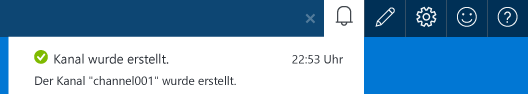
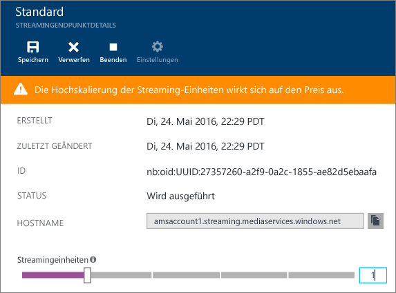
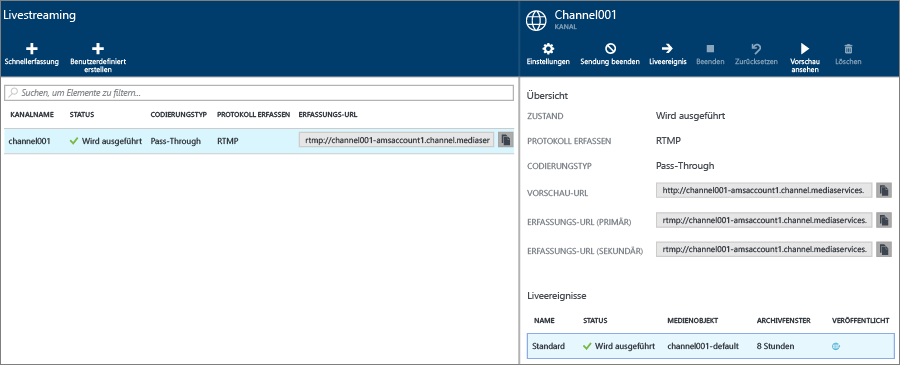
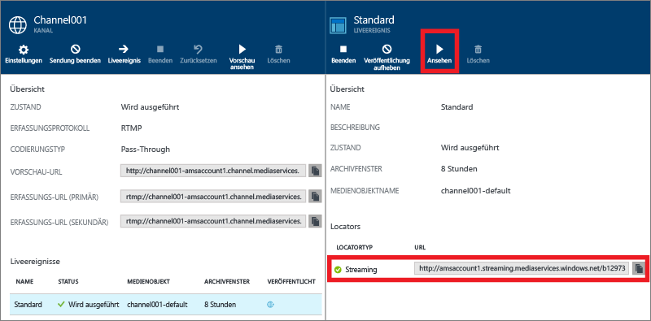
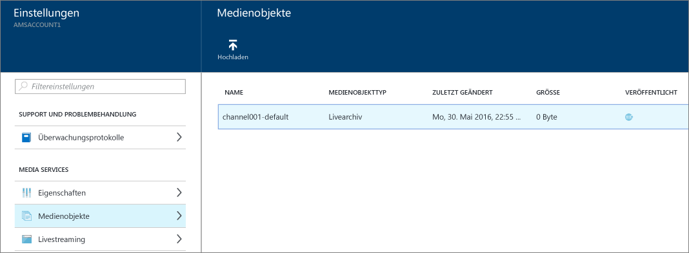

<properties 
	pageTitle="Gewusst wie: Durchführen von Livestreaming mit lokalen Encodern im Azure-Portal | Microsoft Azure" 
	description="In diesem Tutorial werden Sie durch die Schritte zum Erstellen eines Kanals geführt, der für eine Pass-Through-Bereitstellung konfiguriert ist." 
	services="media-services" 
	documentationCenter="" 
	authors="juliako" 
	manager="erikre" 
	editor=""/>

<tags 
	ms.service="media-services" 
	ms.workload="media" 
	ms.tgt_pltfrm="na" 
	ms.devlang="na" 
	ms.topic="get-started-article"
	ms.date="08/30/2016" 
	ms.author="juliako"/>

#Gewusst wie: Durchführen von Livestreaming mit lokalen Encodern im Azure-Portal

In diesem Tutorial werden Sie durch die Schritte des Azure-Portals zum Erstellen eines **Kanals** geführt, der für eine Pass-Through-Bereitstellung konfiguriert ist.

##Voraussetzungen

Zum Abschließen dieses Lernprogramms müssen folgende Voraussetzungen erfüllt sein:

- Ein Azure-Konto. Ausführliche Informationen finden Sie unter [Einen Monat kostenlos testen](https://azure.microsoft.com/pricing/free-trial/).
- Media Services-Konto. Informationen zum Erstellen eines Media Services-Kontos finden Sie unter [Erstellen eines Media Services Kontos](media-services-create-account.md).
- Eine Webcam. Beispielsweise den [Telestream Wirecast-Encoder](http://www.telestream.net/wirecast/overview.htm).

Wir empfehlen Ihnen dringend, die folgenden Artikel zu lesen:

- [Azure Media Services RTMP Support and Live Encoders (in englischer Sprache).](https://azure.microsoft.com/blog/2014/09/18/azure-media-services-rtmp-support-and-live-encoders/)
- [Übersicht über Livestreaming mit Azure Media Services](media-services-manage-channels-overview.md)
- [Livestreaming mit lokalen Encodern, die Multi-Bitrate-Datenströme erstellen](media-services-live-streaming-with-onprem-encoders.md)

##Allgemeines Livestreamingszenario

In den folgenden Schritten werden Aufgaben beschrieben, die beim Erstellen von gängigen Livestreaming-Anwendungen mit Kanälen ausgeführt werden, die für die Pass-Through-Bereitstellung konfiguriert sind. In diesem Tutorial wird veranschaulicht, wie Sie einen Pass-Through-Kanal und Liveereignisse erstellen und verwalten.

1. Schließen Sie eine Videokamera an einen Computer an. Starten und konfigurieren Sie einen lokalen Liveencoder, der einen RTMP- oder Fragmented MP4-Datenstrom mit mehreren Bitraten ausgibt. Weitere Informationen finden Sie unter [Microsoft Azure Media Services RTMP-Support und Liveencoder](http://go.microsoft.com/fwlink/?LinkId=532824).
	
	Dieser Schritt kann auch nach der Erstellung des Kanals ausgeführt werden.

1. Erstellen und starten Sie einen Pass-Through-Kanal.
1. Rufen Sie die Erfassungs-URL des Kanals ab.

	Die Erfassungs-URL wird vom Liveencoder verwendet, um den Datenstrom an den Kanal zu senden.
1. Rufen Sie die Vorschau-URL des Kanals ab.

	Verwenden Sie diese URL, um sicherzustellen, dass der Livestream ordnungsgemäß vom Kanal empfangen wird.

3. Erstellen Sie ein Liveereignis/-programm.

	Bei Verwendung des Azure-Portals wird beim Erstellen eines Liveereignisses auch ein Objekt erstellt.
	  
	>[AZURE.NOTE]Stellen Sie sicher, dass auf dem Streamingendpunkt, von dem Sie Inhalte streamen möchten, mindestens eine für das Streaming reservierte Einheit verfügbar ist.
1. Wenn Sie zum Starten von Streaming und Archivierung bereit sind, starten Sie das Ereignis bzw. Programm.
2. Optional kann vom Liveencoder eine Ankündigung gestartet werden. Die Ankündigung wird in den Ausgabedatenstrom eingefügt.
1. Sie können das Ereignis/Programm und damit das Streaming und die Archivierung des Ereignisses jederzeit beenden.
1. Löschen Sie das Ereignis/Programm (und optional das Medienobjekt).

>[AZURE.IMPORTANT] Lesen Sie sich den Artikel [Livestreaming mit lokalen Encodern, die Multi-Bitrate-Datenströme erstellen](media-services-live-streaming-with-onprem-encoders.md) durch, um sich über die Konzepte und Aspekte zu informieren, die für das Livestreaming mit lokalen Encodern und Pass-Through-Kanälen wichtig sind.

##So zeigen Sie Benachrichtigungen und Fehler an

Klicken Sie auf das Symbol „Benachrichtigung“, wenn Sie Benachrichtigungen und Fehler anzeigen möchten, die vom Azure-Portal generiert wurden.

##Konfigurieren von Streamingendpunkten 

Media Services umfasst die dynamische Paketerstellung, bei der Sie MP4-Dateien mit variablen Bitraten in den folgenden Streamingformaten bereitstellen können: MPEG DASH, HLS, Smooth Streaming oder HDS. Hierbei ist es nicht erforderlich, diese Streamingformate erneut zu verpacken. Mit der dynamischen Paketerstellung müssen Sie die Dateien nur in einem Speicherformat speichern und bezahlen. Media Services erstellt und verarbeitet die entsprechende Antwort basierend auf Anforderungen von einem Client.

Um die dynamische Paketerstellung nutzen zu können, ist mindestens eine Streamingeinheit für den Streamingendpunkt erforderlich, aus dem die Inhalte geliefert werden sollen.

Gehen Sie wie folgt vor, um die Anzahl von Einheiten zu erstellen und zu ändern, die für das Streaming reserviert sind:

1. Klicken Sie im Fenster **Einstellungen** auf **Streamingendpunkte**.

2. Klicken Sie auf den Standard-Streamingendpunkt.

	Das Fenster **DEFAULT STREAMING ENDPOINT DETAILS** (DETAILS ZUM STANDARD-STREAMINGENDPUNKT) wird angezeigt.

3. Die Anzahl von Streamingeinheiten kann mithilfe des Schiebereglers **Streamingeinheiten** angegeben werden.

	

4. Klicken Sie auf die Schaltfläche **Speichern**, um die Änderungen zu speichern.

	>[AZURE.NOTE]Es kann bis zu 20 Minuten dauern, bis die Zuordnung neuer Einheiten abgeschlossen ist.
	
##Erstellen und Starten von Pass-Through-Kanälen und -Ereignissen

Einem Kanal sind Ereignisse/Programme zugeordnet, mit denen Sie das Veröffentlichen und Speichern von Segmenten in einem Livedatenstrom steuern können. Kanäle verwalten Ereignisse.
	
Über die Länge des **Archivierungsfensters** können Sie die Anzahl der Stunden angeben, für die Sie den aufgezeichneten Inhalt des Programms beibehalten möchten. Es können Werte zwischen mindestens 5 Minuten und höchstens 25 Stunden eingestellt werden. Von der Länge des Archivierungsfensters wird außerdem bestimmt, wie lange von Clients von der aktuellen Liveposition aus maximal rückwärts gesucht werden kann. Ereignisse können über die angegebene Zeitspanne laufen. Inhalte, die über das Zeitfenster hinausgehen, werden jedoch fortlaufend verworfen. Durch den Wert dieser Eigenschaft wird außerdem festgelegt, wie lange Clientmanifeste wachsen können.

Jedes Ereignis ist mit einem Medienobjekt verknüpft. Zum Veröffentlichen des Ereignisses müssen Sie einen OnDemand-Locator für das zugehörige Medienobjekt erstellen. Mithilfe dieses Locators können Sie eine Streaming-URL erstellen, die Sie Ihren Kunden bereitstellen können.

Ein Kanal unterstützt bis zu drei gleichzeitig ausgeführte Ereignisse, sodass Sie mehrere Archive desselben eingehenden Datenstroms erstellen können. Auf diese Weise können Sie verschiedene Teile eines Ereignisses nach Bedarf veröffentlichen und archivieren. Beispielsweise könnte Ihre Geschäftsanforderung darin bestehen, 6 Stunden eines Programms zu archivieren, jedoch nur die letzten 10 Minuten zu senden. Dazu müssen Sie zwei Programme erstellen, die gleichzeitig ausgeführt werden. Ein Programm wird auf die Archivierung von 6 Stunden des Ereignisses festgelegt. Dieses Programm wird jedoch nicht veröffentlicht. Das andere Programm wird auf die Archivierung von 10 Minuten festgelegt. Dieses Programm wird veröffentlicht.

Es ist nicht ratsam, vorhandene Liveereignisse wiederzuverwenden. Erstellen und starten Sie stattdessen für jedes Ereignis ein neues Ereignis.

Wenn Sie zum Starten von Streaming und Archivierung bereit sind, starten Sie das Ereignis. Sie können das Programm und damit das Streaming und die Archivierung des Ereignisses jederzeit beenden.

Zum Löschen von archivierten Inhalten beenden und löschen Sie das Ereignis und löschen anschließend das zugehörige Medienobjekt. Medienobjekte können nicht gelöscht werden, wenn sie von Ereignissen verwendet werden. Zuerst muss das betreffende Ereignis gelöscht werden.

Auch nach dem Beenden und Löschen des Ereignisses können die Benutzer archivierte Inhalte als bedarfsgesteuertes Video streamen, solange das Medienobjekt nicht gelöscht wurde.

Wenn Sie die archivierten Inhalte beibehalten möchten, diese aber nicht für das Streaming verfügbar sein sollen, löschen Sie den Streaminglocator.

###So erstellen Sie mit dem Portal einen Kanal 

In diesem Abschnitt erfahren Sie, wie Sie mithilfe der Option **Schnellerfassung** einen Pass-Through-Kanal erstellen.

Weitere Informationen zu Pass-Through-Kanälen finden Sie unter [Livestreaming mit lokalen Encodern, die Multi-Bitrate-Datenströme erstellen](media-services-live-streaming-with-onprem-encoders.md).

1. Klicken Sie im Fenster **Einstellungen** auf **Livestreaming**.

	
	
	Das Fenster **Livestreaming** wird angezeigt.

3. Klicken Sie auf **Schnellerfassung**, um einen Pass-Through-Kanal mit dem RTMP-Erfassungsprotokoll zu erstellen.

	Das Fenster **EINEN NEUEN KANAL ERSTELLEN** wird angezeigt.
4. Geben Sie dem neuen Kanal einen Namen, und klicken Sie auf **Erstellen**.

	Der Pass-Through-Kanal mit dem RTMP-Erfassungsprotokoll wird erstellt.

	Der Kanal führt auch das Hinzufügen, Starten und Veröffentlichen eines standardmäßigen Liveereignisses bzw. Programms durch. Das Ereignis wird mit einem Archivierungsfenster von acht Stunden konfiguriert.

	Klicken Sie zum Hinzufügen weiterer Ereignisse auf die Schaltfläche **Liveereignis**.

##Abrufen von Erfassungs-URLs

Wenn der Kanal erstellt wurde, können Sie Erfassungs-URLs abrufen, die Sie dem Liveencoder bereitstellen. Diese URLs werden vom Encoder zur Eingabe eines Livedatenstroms verwendet.

##Überwachen eines Ereignisses

Klicken Sie zum Überwachen des Ereignisses im Azure-Portal auf **Überwachen**, oder kopieren Sie die Streaming-URL, und verwenden Sie einen Player Ihrer Wahl.
 

Das Liveereignis wird automatisch in On-Demand-Inhalt konvertiert, wenn es beendet wird.

##Bereinigen

Weitere Informationen zu Pass-Through-Kanälen finden Sie unter [Livestreaming mit lokalen Encodern, die Multi-Bitrate-Datenströme erstellen](media-services-live-streaming-with-onprem-encoders.md).

- Ein Kanal kann nur beendet werden, wenn auch alle Ereignisse/Programme des Kanals beendet wurden. Wenn der Kanal beendet ist, fallen keine Kosten an. Wenn Sie den Kanal erneut starten, weist er die gleiche Erfassungs-URL auf, damit Sie den Encoder nicht erneut konfigurieren müssen.
- Ein Kanal kann nur gelöscht werden, wenn auch alle Liveereignisse des Kanals gelöscht wurden.

##Anzeigen von archivierten Inhalten

Auch nach dem Beenden und Löschen des Ereignisses können die Benutzer archivierte Inhalte als bedarfsgesteuertes Video streamen, solange das Medienobjekt nicht gelöscht wurde. Medienobjekte können nicht gelöscht werden, wenn sie von Ereignissen verwendet werden. Zuerst muss das betreffende Ereignis gelöscht werden.

Wählen Sie zum Verwalten der Objekte die Option **Einstellung** aus, und klicken Sie auf **Ressourcen**.

##Media Services-Lernpfade

[AZURE.INCLUDE [media-services-learning-paths-include](../../includes/media-services-learning-paths-include.md)]

##Feedback geben

[AZURE.INCLUDE [media-services-user-voice-include](../../includes/media-services-user-voice-include.md)]

<!---HONumber=AcomDC_0831_2016-->