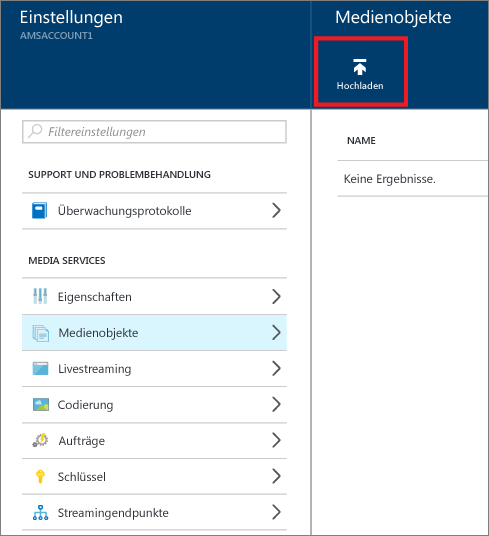
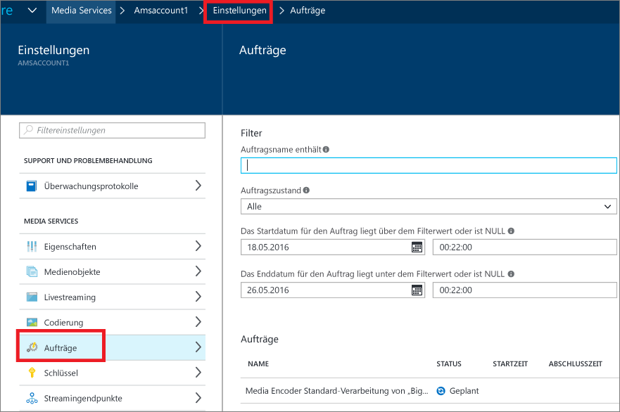
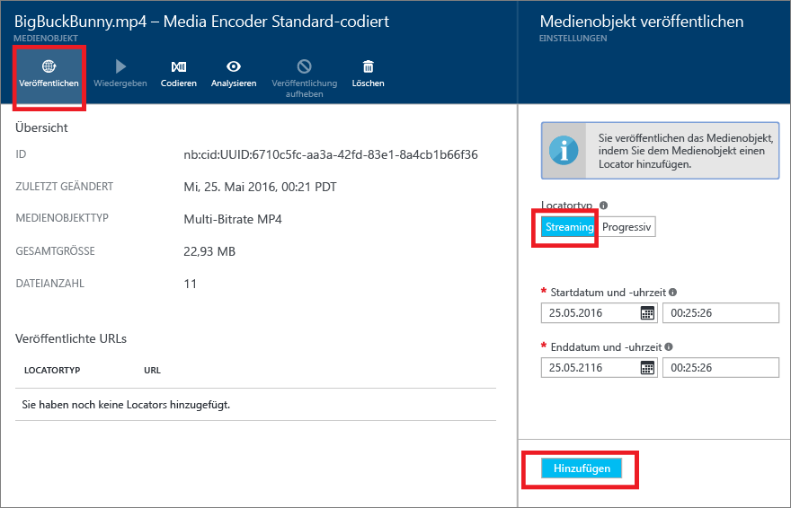
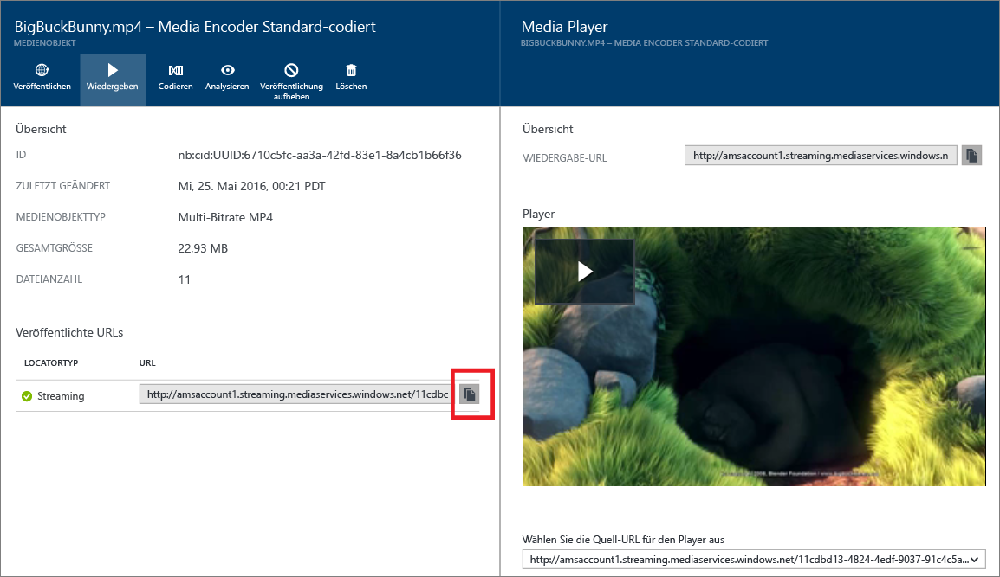

<properties
	pageTitle="Erste Schritte zum Bereitstellen von Inhalten nach Bedarf mit dem Azure-Portal | Microsoft Azure"
	description="In diesem Tutorial werden Sie durch die Schritte zum Implementieren eines einfachen Diensts zur Video-on-Demand-Inhaltsübermittlung (VoD) mit der Azure Media Services-Anwendung (AMS) mithilfe des Azure-Portals geführt."
	services="media-services"
	documentationCenter=""
	authors="Juliako"
	manager="erikre"
	editor=""/>

<tags
	ms.service="media-services"
	ms.workload="media"
	ms.tgt_pltfrm="na"
	ms.devlang="na"
	ms.topic="get-started-article"
	ms.date="06/05/2016"
	ms.author="juliako"/>

# Erste Schritte zum Bereitstellen von Inhalten nach Bedarf mit dem Azure-Portal (Vorschau)

In diesem Tutorial werden Sie durch die Schritte zum Implementieren eines einfachen Diensts zur Video-on-Demand (VoD)-Inhaltsübermittlung mit der Azure Media Services-Anwendung (AMS) mithilfe des Azure-Portals geführt.

Azure Media Services im Azure-Portal befindet sich derzeit in der Vorschauphase.

> [AZURE.NOTE] Um dieses Lernprogramm abzuschließen, benötigen Sie ein Azure-Konto. Ausführliche Informationen finden Sie unter [Kostenlose Azure-Testversion](https://azure.microsoft.com/pricing/free-trial/).

Dieses Lernprogramm enthält die folgenden Aufgaben:

1.  Erstellen eines Azure Media Services-Kontos
2.  Konfigurieren eines Streamingendgeräts
1.  Hochladen einer Videodatei
1.  Codieren der Quelldatei in einen Satz von MP4-Dateien mit adaptiver Bitrate
1.  Veröffentlichen des Medienobjekts und Abrufen von URLs für Streaming und progressiven Download  
1.  Wiedergeben Ihrer Inhalte

## Erstellen eines Azure Media Services-Kontos

Die Schritte in diesem Abschnitt verdeutlichen, wie Sie ein neues AMS-Konto erstellen.

1. Melden Sie sich beim [Azure-Portal](https://portal.azure.com/) an.
2. Klicken Sie auf **+Neu** > **Media Service + CDN** (Media Service + CDN) > **Media Services**.

	

3. Geben Sie unter **CREATE MEDIA SERVICES ACCOUNT** (MEDIA SERVICES-KONTO ERSTELLEN) die erforderlichen Werte ein.

	
	
	1. Geben Sie unter **Kontoname** den Namen des neuen AMS-Kontos ein. Der Name eines Media Services-Kontos darf nur Kleinbuchstaben oder Ziffern ohne Leerzeichen enthalten und muss aus 3 bis 24 Zeichen bestehen.
	2. Wählen Sie unter „Abonnement“ das Azure-Abonnement aus, auf das Sie Zugriff haben.
	
	2. Wählen Sie unter **Ressourcengruppe** die neue oder die vorhandene Ressource aus. Eine Ressourcengruppe ist eine Sammlung von Ressourcen, die in Bezug auf Lebenszyklus, Berechtigungen und Richtlinien gleich sind. [Hier](resource-group-overview.md#resource-groups) erhalten Sie weitere Informationen.
	3. Wählen Sie unter **Standort** die geografische Region aus, in der die Medien- und Metadaten-Datensätze für Ihr Media Services-Konto gespeichert werden sollen. Dieser Bereich wird zum Verarbeiten und Streamen Ihrer Medien verwendet. Im Dropdownlistenfeld werden nur die verfügbaren Media Services-Regionen angezeigt. 
	
	3. Wählen Sie unter **Speicherkonto** ein Speicherkonto aus, das als Blobspeicher für die Medieninhalte aus Ihrem Media Services-Konto dienen soll. Sie können ein vorhandenes Speicherkonto in derselben geografischen Region wie Ihr Media Services-Konto auswählen oder ein neues Speicherkonto erstellen. Ein neues Speicherkonto wird in derselben Region erstellt. Für Namen von Speicherkonten gelten die gleichen Regeln wie für Namen von Media Services-Konten.

		Weitere Informationen zum Speicher finden Sie [hier](storage-introduction.md).

	4. Wählen Sie **An Dashboard anheften**, um den Status der Kontobereitstellung anzuzeigen.
	
7. Klicken Sie unten im Formular auf **Erstellen**.

	Nachdem das Konto erfolgreich erstellt wurde, ändert sich der Status in **Wird ausgeführt**.

	

	Verwenden Sie zum Verwalten Ihres AMS-Kontos (z.B. Videos hochladen, Assets codieren, Auftragsstatus überwachen) das Fenster **Einstellungen**.

## Schlüssel verwalten

Sie benötigen den Kontonamen und den Primärschlüssel, um programmgesteuert auf das Media Services-Konto zugreifen zu können.

1. Wählen Sie Ihr Konto im Azure-Portal aus. 

	Das Fenster **Einstellungen** wird auf der rechten Seite angezeigt.

2. Wählen Sie im Fenster **Einstellungen** die Option **Schlüssel**.

	Im Fenster **Schlüssel verwalten** werden der Kontoname und die Primär- und Sekundärschlüssel angezeigt. 
3. Betätigen Sie die Schaltfläche „Kopieren“, um die Werte zu kopieren.
	
	

## Konfigurieren von Streamingendpunkten

Wenn Sie mit Azure Media Services arbeiten, besteht eines der häufigsten Szenarien darin, Videos per Adaptive Bitrate Streaming an Ihre Clients zu übermitteln. Mit Adaptive Bitrate Streaming kann der Client während der Videodarstellung auf einen höheren oder niedrigeren Bitraten-Stream wechseln, basierend auf der aktuellen Netzwerkbandbreite, CPU-Auslastung und anderen Faktoren. Von Media Services werden die folgenden Streamingtechnologien mit adaptiver Bitrate unterstützt: HTTP Live Streaming (HLS), Smooth Streaming, MPEG DASH und HDS (nur mit Adobe PrimeTime/Access-Lizenz).

Media Services bietet dynamische Paketerstellung für die Just-in-Time-Übermittlung von Daten vom Typ „MP4-codierte Inhalte mit adaptiver Bitrate“ in Streamingformaten, die von Media Services unterstützt werden (MPEG DASH, HLS, Smooth Streaming, HDS), ohne dass Sie jeweils vorab verpackte Versionen dieser Streamingformate speichern müssen.

Um die dynamische Paketerstellung nutzen zu können, müssen Sie folgende Schritte ausführen:

- Codieren Ihrer Zwischendatei (Quelle) in einen Satz von MP4-Dateien mit adaptiver Bitrate (die Codierungsschritte werden weiter unten in diesem Tutorial beschrieben)  
- Erstellen von mindestens einer Streamingeinheit für den *Streamingendpunkt*, von dem aus Sie die Bereitstellung Ihrer Inhalte planen In den folgenden Schritten wird gezeigt, wie Sie die Anzahl von Streamingeinheiten ändern.

Mit der dynamischen Paketerstellung müssen Sie die Dateien nur in einem Speicherformat speichern und bezahlen. Media Services erstellt und verarbeitet die entsprechende Antwort basierend auf Anforderungen von einem Client.

Gehen Sie wie folgt vor, um die Anzahl von Einheiten zu erstellen und zu ändern, die für das Streaming reserviert sind:

1. Klicken Sie im Fenster **Einstellungen** auf **Streamingendpunkte**. 

2. Klicken Sie auf den Standard-Streamingendpunkt.

	Das Fenster **DEFAULT STREAMING ENDPOINT DETAILS** (DETAILS ZUM STANDARD-STREAMINGENDPUNKT) wird angezeigt.

3. Die Anzahl von Streamingeinheiten können Sie mit dem Schieberegler **Streamingeinheiten** angeben.

	

4. Klicken Sie auf die Schaltfläche **Speichern**, um die Änderungen zu speichern.

	>[AZURE.NOTE]Es kann bis zu 20 Minuten dauern, bis die Zuordnung neuer Einheiten abgeschlossen ist.

## Hochladen von Dateien

Zum Streamen von Videos mit Azure Media Services müssen Sie die Quellvideos hochladen und in mehreren Bitraten codieren und das Ergebnis veröffentlichen. Der erste Schritt ist in diesem Abschnitt beschrieben.

1. Klicken Sie im Fenster **Einstellungen** auf **Ressourcen**.

	

3. Klicken Sie auf die Schaltfläche **Upload**.

	Das Fenster **Upload a video asset** (Videoobjekt hochladen) wird angezeigt.

	>[AZURE.NOTE] Es gibt in Bezug auf die Dateigröße keinerlei Beschränkung.
	
4. Suchen Sie auf Ihrem Computer nach dem gewünschten Video, wählen Sie es aus, und klicken Sie auf „OK“.

	Der Upload beginnt, und der Status wird unter dem Dateinamen angezeigt.

Nach Abschluss des Uploads sehen Sie, dass das neue Objekt im Fenster **Ressourcen** aufgeführt ist.

## Codieren von Medienobjekten

Bei der Arbeit mit Azure Media Services ist eines der häufigsten Szenarios das Streaming mit adaptiver Bitrate an Clients. Von Media Services werden die folgenden Streamingtechnologien mit adaptiver Bitrate unterstützt: HTTP Live Streaming (HLS), Smooth Streaming, MPEG DASH und HDS (nur mit Adobe PrimeTime/Access-Lizenz). Um die Videos für das Adaptive Bitrate Streaming vorzubereiten, müssen Sie das Quellvideo in Dateien mit mehreren Bitraten codieren. Es ist ratsam, den Encoder **Media Encoder Standard** zum Codieren der Videos zu verwenden.

Media Services umfasst auch die dynamische Paketerstellung, bei der Sie MP4-Dateien mit variablen Bitraten in den folgenden Streamingformaten bereitstellen können: MPEG DASH, HLS, Smooth Streaming oder HDS. Hierbei ist es nicht erforderlich, diese Streamingformate erneut zu verpacken. Mit der dynamischen Paketerstellung müssen Sie die Dateien nur in einem Speicherformat speichern und bezahlen. Media Services erstellt und verarbeitet die entsprechende Antwort basierend auf Anforderungen von einem Client.

Um die dynamische Paketerstellung nutzen zu können, müssen Sie folgende Schritte ausführen:

- Codieren Ihrer Quelldatei in einen Satz von MP4-Dateien mit variablen Bitraten (die Codierungsschritte werden weiter unten in diesem Abschnitt beschrieben)
- Abrufen von mindestens einer Streamingeinheit für den Streamingendpunkt, von dem aus Sie die Bereitstellung Ihrer Inhalte planen Weitere Informationen finden Sie unter [Konfigurieren von Streamingendpunkten](media-services-portal-vod-get-started.md#configure-streaming-endpoints). 

### So verwenden Sie das Portal zum Codieren

In diesem Abschnitt werden die Schritte beschrieben, die Sie ausführen können, um Ihre Inhalte mit Media Encoder Standard zu codieren.

1.  Wählen Sie im Fenster **Einstellungen** die Option **Ressourcen**.  
2.  Wählen Sie im Fenster **Ressourcen** das Objekt aus, das Sie codieren möchten.
3.  Betätigen Sie die Schaltfläche **Codieren**.
4.  Wählen Sie im Fenster **Encode an asset** (Ressource codieren) den Prozessor „Media Encoder Standard“ und eine Voreinstellung aus. Wenn Sie beispielsweise wissen, dass das Eingabevideo eine Auflösung von 1920x1080 Pixel hat, können Sie die Voreinstellung „H264 Multiple Bitrate 1080p“ wählen. Weitere Informationen zu Voreinstellungen finden Sie in [diesem Artikel](https://msdn.microsoft.com/library/azure/mt269960.aspx). Es ist wichtig, dass Sie die Voreinstellung auswählen, die für Ihr Eingabevideo am besten geeignet ist. Wenn Sie über ein Video mit niedriger Auflösung (640x360) verfügen, sollten Sie nicht die standardmäßige Voreinstellung „H264 Multiple Bitrate 1080p“ verwenden.
	
	Zur Vereinfachung der Verwaltung besteht die Möglichkeit, den Namen des Ausgabemedienobjekts und den Namen des Auftrags zu bearbeiten.
		
	
5. Klicken Sie auf **Erstellen**.

### Überwachen des Codierauftragsstatus

Klicken Sie zum Überwachen des Codierauftragsstatus auf **Einstellungen** (oben auf der Seite), und wählen Sie dann **Aufträge**.

## Veröffentlichen von Inhalten

Um Ihren Benutzern eine URL für das Streaming bzw. Herunterladen des Inhalts angeben zu können, müssen Sie zunächst das Medienobjekt "veröffentlichen", indem Sie einen Locator erstellen. Locators ermöglichen den Zugriff auf Dateien im Medienobjekt. Media Services unterstützt zwei Arten von Locatorobjekten:

- Streaminglocators (OnDemandOrigin), die für das adaptive Streaming verwendet werden (z.B. zum Streamen von MPEG DASH, HLS oder Smooth Streaming). Für die Erstellung eines Streaminglocators muss das Objekt eine ISM-Datei enthalten. 
- Progressive Locators (SAS), die für die Bereitstellung von Videos per progressivem Download verwendet werden.

Eine Streaming-URL weist das folgende Format auf. Mit dieser URL können Sie Smooth Streaming-Medienobjekte wiedergeben.

	{streaming endpoint name-media services account name}.streaming.mediaservices.windows.net/{locator ID}/{filename}.ism/Manifest

Um eine HLS-Streaming-URL zu erstellen, fügen Sie "(format=m3u8-aapl)" an die URL an.

	{streaming endpoint name-media services account name}.streaming.mediaservices.windows.net/{locator ID}/{filename}.ism/Manifest(format=m3u8-aapl)

Um eine MPEG DASH-Streaming-URL zu erstellen, fügen Sie „(format=mpd-time-csf)“ an die URL an.

	{streaming endpoint name-media services account name}.streaming.mediaservices.windows.net/{locator ID}/{filename}.ism/Manifest(format=mpd-time-csf)

Eine SAS-URL weist das folgende Format auf.

	{blob container name}/{asset name}/{file name}/{SAS signature}

>[AZURE.NOTE] Die vor März 2015 über das Portal erstellten Locator weisen ein Ablaufdatum von zwei Jahren auf.

Verwenden Sie zum Aktualisieren eines Ablaufdatums für einen Locator die [REST](http://msdn.microsoft.com/library/azure/hh974308.aspx#update_a_locator)- oder [.NET](http://go.microsoft.com/fwlink/?LinkID=533259)-APIs. Wenn Sie das Ablaufdatum eines SAS-Locators aktualisieren, ändert sich auch die URL.

### So verwenden Sie das Portal zum Veröffentlichen eines Objekts

So veröffentlichen Sie ein Medienobjekt über das Portal:

1. Wählen Sie **Einstellungen** > **Ressourcen**.
1. Wählen Sie das Objekt aus, das Sie veröffentlichen möchten.
1. Klicken Sie auf die Schaltfläche **Veröffentlichen**.
1. Wählen Sie den Locatortyp aus.
2. Klicken Sie auf **Hinzufügen**.

	

Die URL wird der Liste mit den **veröffentlichten URLs** hinzugefügt.

## Wiedergeben von Inhalten im Portal

Im Azure-Portal wird ein Inhaltsplayer bereitgestellt, mit dem Sie Ihre Videos testen können.

Klicken Sie auf das gewünschte Video und dann auf die Schaltfläche **Wiedergeben**.

Folgende Überlegungen sollten berücksichtigt werden:

- Vergewissern Sie sich, dass das Video veröffentlicht wurde.
- Dieser *Media Player** wird über den standardmäßigen Streamingendpunkt wiedergegeben. Wenn Sie die Wiedergabe von einem anderen Streamingendpunkt starten möchten, können Sie die URL per Klick kopieren und einen anderen Player verwenden. Sie können beispielsweise den [Azure Media Services-Player](http://amsplayer.azurewebsites.net/azuremediaplayer.html) nutzen.

##Nächste Schritte: Media Services-Lernpfade

[AZURE.INCLUDE [media-services-learning-paths-include](../../includes/media-services-learning-paths-include.md)]

##Feedback geben

[AZURE.INCLUDE [media-services-user-voice-include](../../includes/media-services-user-voice-include.md)]

<!---HONumber=AcomDC_0608_2016-->