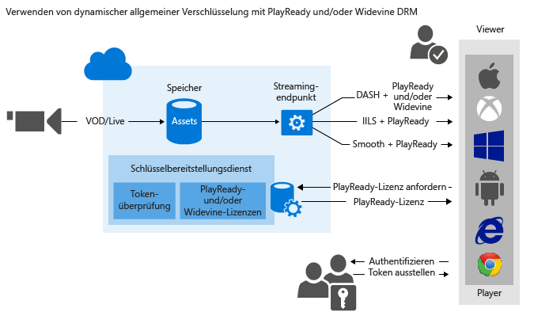

# Verwenden von dynamischer allgemeiner Verschlüsselung mit PlayReady und/oder Widevine

> [!div class="op_single_selector"]
> * [.NET](media-services-protect-with-drm.md)
> * [Java](https://github.com/southworkscom/azure-sdk-for-media-services-java-samples)
> * [PHP](https://github.com/Azure/azure-sdk-for-php/tree/master/examples/MediaServices)
>
>

Mit Microsoft Azure Media Services können Sie MPEG-DASH-, Smooth Streaming- und HTTP-Live-Streaming (HLS)-Streams übermitteln, die mit [Microsoft PlayReady DRM](https://www.microsoft.com/playready/overview/)geschützt sind. Sie können außerdem verschlüsselte DASH-Streams mit Widevine-DRM-Lizenzen bereitstellen. PlayReady und Widevine sind gemäß der Spezifikation Common Encryption (ISO/IEC 23001-7 CENC) verschlüsselt. Sie können das [AMS .NET SDK](https://www.nuget.org/packages/windowsazure.mediaservices/) (ab Version 3.5.1) oder die REST-API verwenden, um die AssetDeliveryConfiguration für die Verwendung von Widevine zu konfigurieren.

Media Services bietet einen Dienst zum Übermitteln von PlayReady- und Widevine-DMR-Lizenzen. Mithilfe der von Media Services bereitgestellten APIs können Sie die Rechte und Einschränkungen konfigurieren, die für die PlayReady- oder Widevine-DRM-Laufzeit erzwungen werden sollen, wenn ein Benutzer geschützte Inhalte wiedergibt. Wenn ein Benutzer die mit DRM geschützten Inhalte anfordert, fordert die Playeranwendung eine Lizenz vom AMS-Lizenzdienst an. Die AMS-Lizenzdienst stellt dem Player eine Lizenz aus, sofern dieser autorisiert ist. Eine PlayReady- oder Widevine-Lizenz enthält den Entschlüsselungsschlüssel, der vom Clientplayer zum Entschlüsseln und Streamen des Inhalts verwendet werden kann.

Sie können sich auch von folgenden AMS-Partnern bei der Übermittlung von Widevine-Lizenzen unterstützen lassen: [Axinom](http://www.axinom.com/press/ibc-axinom-drm-6/), [EZDRM](http://ezdrm.com/), [castLabs](http://castlabs.com/company/partners/azure/). Weitere Informationen finden Sie in den Artikeln zur Integration in [Axinom](media-services-axinom-integration.md) und [castLabs](media-services-castlabs-integration.md).

Media Services unterstützt mehrere Möglichkeiten zur Autorisierung von Benutzern, die Schlüssel anfordern. Die Autorisierungsrichtlinie für Inhaltsschlüssel kann eine oder mehrere Autorisierungseinschränkungen aufweisen: offen oder Tokeneinschränkung. Die durch Token eingeschränkte Richtlinie gilt nur zusammen mit einem Token, das von einem Secure Token Service (STS) ausgestellt wurde. Media Services unterstützt Token im SWT-Format ([Simple Web Tokens](https://msdn.microsoft.com/library/gg185950.aspx#BKMK_2)) und im JWT-Format ([JSON Web Token](https://msdn.microsoft.com/library/gg185950.aspx#BKMK_3)). Weitere Informationen finden Sie unter "Konfigurieren einer Autorisierungsrichtlinie für Inhaltsschlüssel".

Damit dynamische Verschlüsselung genutzt werden kann, müssen Sie über ein Medienobjekt verfügen, das eine Sammlung aus MP4-Dateien mit mehreren Bitraten oder Smooth Streaming-Quelldateien mit mehreren Bitraten enthält. Außerdem müssen Sie die Übermittlungsrichtlinien für das Medienobjekt konfigurieren (weiter unten in diesem Thema beschrieben). Basierend auf dem angegebenen Format in der Streaming-URL stellt der On-Demand-Streaming-Server dann sicher, dass der Datenstrom im ausgewählten Protokoll übermittelt wird. So müssen Sie die Dateien nur in einem einzelnen Speicherformat speichern und bezahlen. Die entsprechende HTTP-Antwort wird von Media Services basierend auf jeder einzelnen Clientanforderung erstellt und verfügbar gemacht.

Dieses Thema ist für Entwickler hilfreich, die an Anwendungen arbeiten, bei denen mit mehreren DRMs, z.B. PlayReady und Widevine, geschützte Medien übermittelt werden. In diesem Thema erfahren Sie, wie der PlayReady-Lizenzbereitstellungsdienst mit Autorisierungsrichtlinien so konfiguriert wird, dass nur autorisierte Clients PlayReady- oder Widevine-Lizenzen erhalten können. Es wird gezeigt, wie die dynamische Verschlüsselung mit PlayReady oder Widevine DRM über DASH genutzt wird.

>[!NOTE]
>Beim Erstellen Ihres AMS-Kontos wird dem Konto ein **Standard**-Streamingendpunkt mit dem Status **Beendet** hinzugefügt. Um mit dem Streamen der Inhalte zu beginnen und die dynamische Paketerstellung und dynamische Verschlüsselung zu nutzen, muss der Streamingendpunkt, von dem Sie Inhalte streamen möchten, den Status **Wird ausgeführt** aufweisen. 

## Beispiel herunterladen
Sie können das in diesem Artikel beschriebene Beispiel [hier](https://github.com/Azure-Samples/media-services-dotnet-dynamic-encryption-with-drm)herunterladen.

## Konfigurieren der dynamischen allgemeinen Verschlüsselung und von DRM-Lizenzbereitstellungsdiensten

Die folgenden allgemeinen Schritte müssen ausgeführt werden, wenn Sie Ihre Medienobjekte mit PlayReady mithilfe des Media Services-Lizenzbereitstellungsdiensts schützen und außerdem dynamische Verschlüsselung verwenden möchten.

1. Erstellen eines Medienobjekts und Hochladen von Dateien in das Medienobjekt.
2. Codieren eines Medienobjekts, das die Sammlung von MP4-Dateien mit adaptiver Bitrate enthält.
3. Erstellen eines Inhaltsschlüssels und Zuordnen des Schlüssels zum codierten Medienobjekt In Media Services enthält der Inhaltsschlüssel den Verschlüsselungsschlüssel des Medienobjekts.
4. Konfigurieren der Autorisierungsrichtlinie des Inhaltsschlüssels. Die Inhaltsschlüssel-Authentifizierungsrichtlinie muss von Ihnen konfiguriert und vom Client erfüllt werden, damit der Inhaltsschlüssel an den Client übermittelt wird.

    Bei der Erstellung der Inhaltsschlüssel-Autorisierungsrichtlinie müssen Sie Folgendes angeben: Übermittlungsmethode (PlayReady oder Widevine), Einschränkungen (offen oder Token) und Informationen zu den wichtigsten Übermittlungstypen, die definieren, wie der Schlüssel an den Client übermittelt wird ([PlayReady](media-services-playready-license-template-overview.md)- oder [Widevine](media-services-widevine-license-template-overview.md)-Lizenzvorlage).

5. Konfigurieren der Übermittlungsrichtlinie für ein Medienobjekt. Die Konfiguration der Bereitstellungsrichtlinie umfasst Folgendes: das Bereitstellungsprotokoll (beispielsweise MPEG DASH, HLS, Smooth Streaming oder alle), die Art der dynamischen Verschlüsselung (beispielsweise allgemeine Verschlüsselung) sowie die Lizenzerwerbs-URL für PlayReady oder Widevine.

    Sie können unterschiedliche Richtlinien für jedes Protokoll für das gleiche Medienobjekt anwenden. Sie können z. B. PlayReady-Verschlüsselung auf Smooth/DASH und AES Envelope auf HLS anwenden. Alle Protokolle, die nicht in einer Übermittlungsrichtlinie definiert sind (wenn Sie z. B. eine einzelne Richtlinie hinzufügen, die nur HLS als Protokoll angibt), werden vom Streaming ausgeschlossen. Die einzige Ausnahme besteht darin, wenn Sie überhaupt keine Übermittlungsrichtlinie für Medienobjekte definiert haben. In diesem Fall sind alle Protokolle ohne Verschlüsselung zulässig.

6. Erstellen eines "OnDemand"-Locators, um eine Streaming-URL zu erhalten.

Ein vollständiges .NET-Beispiel finden Sie am Ende des Themas.

In der folgenden Abbildung wird der oben beschriebene Workflow gezeigt. Hier wird das Token zur Authentifizierung verwendet.

Im weiteren Verlauf finden Sie ausführliche Beschreibungen, Codebeispiele und Links zu Themen, die Sie informieren, wie die oben beschriebenen Aufgaben ausgeführt werden.

## Aktuelle Einschränkungen
Wenn Sie die Übermittlungsrichtlinie eines Medienobjekts hinzufügen oder aktualisieren, müssen Sie den zugeordneten Locator (sofern vorhanden) löschen und einen neuen Locator erstellen.

Einschränkung bei der Verschlüsselung mit Widevine mit Azure Media Services: Die Verwendung mehrerer Inhaltsschlüssel wird derzeit nicht unterstützt.

## Erstellen eines Medienobjekts und Hochladen von Dateien in das Medienobjekt
Damit Sie Ihre Videos verwalten, codieren und streamen können, müssen Sie Ihre Inhalte zuerst in Microsoft Azure Media Services hochladen. Nachdem dies geschehen ist, sind Ihre Inhalte sicher in der Cloud zur weiteren Verarbeitung und zum weiteren Streaming gespeichert.

Ausführliche Informationen finden Sie unter [Hochladen von Dateien in ein Media Services-Konto](media-services-dotnet-upload-files.md).

## Codieren eines Medienobjekts, das die Sammlung von MP4-Dateien mit adaptiver Bitrate enthält
Bei der dynamischen Verschlüsselung müssen Sie nur ein Medienobjekt erstellen, das eine Sammlung aus MP4-Dateien mit mehreren Bitraten oder Smooth Streaming-Quelldateien mit mehreren Bitraten enthält. Dann wird durch den bedarfsgesteuerten Streamingserver auf Basis des in der Manifest- und Fragmentanforderung angegebenen Formats sichergestellt, dass Sie den Datenstrom im ausgewählten Protokoll erhalten. So müssen Sie die Dateien nur in einem Speicherformat speichern und bezahlen. Die entsprechende Antwort wird von Media Services basierend auf Clientanforderungen erstellt und verfügbar gemacht. Weitere Informationen finden Sie unter [Dynamische Paketerstellung – Übersicht](media-services-dynamic-packaging-overview.md).

Informationen zum Codieren finden Sie unter [Codieren eines Assets mit Media Encoder Standard](media-services-dotnet-encode-with-media-encoder-standard.md).

## Erstellen eines Inhaltsschlüssels und Zuordnen des Schlüssels zum codierten Medienobjekt
In Media Services enthält der Inhaltsschlüssel den Schlüssel, mit dem ein Medienobjekt verschlüsselt werden soll.

Ausführliche Informationen finden Sie unter [Erstellen eines Inhaltsschlüssels](media-services-dotnet-create-contentkey.md).

## Konfigurieren einer Autorisierungsrichtlinie für Inhaltsschlüssel
Media Services unterstützt mehrere Möglichkeiten zur Authentifizierung von Benutzern, die Schlüssel anfordern. Die Inhaltsschlüssel-Authentifizierungsrichtlinie muss von Ihnen konfiguriert und vom Client (Player) erfüllt werden, damit der Schlüssel an den Client übermittelt wird. Die Autorisierungsrichtlinie für Inhaltsschlüssel kann eine oder mehrere Autorisierungseinschränkungen aufweisen: offen oder Tokeneinschränkung.

Weitere Informationen finden Sie unter [Konfigurieren einer Autorisierungsrichtlinie für Inhaltsschlüssel](media-services-dotnet-configure-content-key-auth-policy.md#playready-dynamic-encryption).

## Konfigurieren der Übermittlungsrichtlinie für Medienobjekte
Konfigurieren Sie die Übermittlungsrichtlinie für Medienobjekte. Die Konfiguration der Übermittlungsrichtlinie für Medienobjekte umfasst Folgendes:

* Die DRM-Lizenzerwerbs-URL.
* Das Übermittlungsprotokoll für Medienobjekte (beispielsweise MPEG DASH, HLS, Smooth Streaming oder alle).
* Typ der dynamischen Verschlüsselung (in diesem Fall Common Encryption).

Weitere Informationen finden Sie unter [Konfigurieren der Übermittlungsrichtlinie für Medienobjekte ](media-services-rest-configure-asset-delivery-policy.md).

## Erstellen eines OnDemand-Streaminglocators, um eine Streaming-URL abzurufen
Sie müssen die Streaming-URL für Smooth Streaming, DASH oder HLS für Ihre Benutzer bereitstellen.

> [!NOTE]
> Wenn Sie die Übermittlungsrichtlinie eines Medienobjekts hinzufügen oder aktualisieren, müssen Sie einen vorhandenen Locator (sofern vorhanden) löschen und einen neuen Locator erstellen.
>
>

Anweisungen zum Veröffentlichen eines Medienobjekts und Erstellen einer Streaming-URL finden Sie unter [Erstellen einer Streaming-URL](media-services-deliver-streaming-content.md).

## Abrufen eines Testtokens
Rufen Sie ein Testtoken ab, das auf der Tokeneinschränkung basiert, die für die Schlüsselautorisierungsrichtlinie verwendet wurde.

    // Deserializes a string containing an Xml representation of a TokenRestrictionTemplate
    // back into a TokenRestrictionTemplate class instance.
    TokenRestrictionTemplate tokenTemplate =
        TokenRestrictionTemplateSerializer.Deserialize(tokenTemplateString);

    // Generate a test token based on the data in the given TokenRestrictionTemplate.
    //The GenerateTestToken method returns the token without the word “Bearer” in front
    //so you have to add it in front of the token string.
    string testToken = TokenRestrictionTemplateSerializer.GenerateTestToken(tokenTemplate);
    Console.WriteLine("The authorization token is:\nBearer {0}", testToken);

Sie können den [AMS Player](http://amsplayer.azurewebsites.net/azuremediaplayer.html) zum Testen des Datenstroms verwenden.

## Erstellen und Konfigurieren eines Visual Studio-Projekts

1. Richten Sie Ihre Entwicklungsumgebung ein, und füllen Sie die Datei „app.config“ mit Verbindungsinformationen, wie unter [Media Services-Entwicklung mit .NET](media-services-dotnet-how-to-use.md) beschrieben. 
2. Fügen Sie den **appSettings** in Ihrer Datei „app.config“ die folgenden Elemente hinzu:

        <add key="Issuer" value="http://testacs.com"/>
        <add key="Audience" value="urn:test"/>

## Beispiel

Das folgende Beispiel veranschaulicht die Funktionen, die im Azure Media Services SDK für .NET, Version 3.5.2, hinzugefügt wurden (insbesondere die Möglichkeit zum Definieren einer Widevine-Lizenzvorlage und zum Anfordern einer Widevine-Lizenz aus Azure Media Services).

Überschreiben Sie den Code in Ihrer Datei "Program.cs" mit dem in diesem Abschnitt gezeigten Code.

>[!NOTE]
>Es gilt ein Grenzwert von 1.000.000 Richtlinien für verschiedene AMS-Richtlinien (z.B. für die Locator-Richtlinie oder für ContentKeyAuthorizationPolicy). Wenn Sie immer die gleichen Tage/Zugriffsberechtigungen verwenden, z.B. Richtlinien für Locator, die für einen längeren Zeitraum vorgesehen sind (Richtlinien ohne Upload), sollten Sie dieselbe Richtlinien-ID verwenden. Weitere Informationen finden Sie in [diesem](media-services-dotnet-manage-entities.md#limit-access-policies) Thema.

Stellen Sie sicher, dass die Variablen so aktualisiert werden, dass sie auf die Ordner zeigen, in denen sich Ihre Eingabedateien befinden.

    using System;
    using System.Collections.Generic;
    using System.Configuration;
    using System.IO;
    using System.Linq;
    using System.Threading;
    using Microsoft.WindowsAzure.MediaServices.Client;
    using Microsoft.WindowsAzure.MediaServices.Client.ContentKeyAuthorization;
    using Microsoft.WindowsAzure.MediaServices.Client.DynamicEncryption;
    using Microsoft.WindowsAzure.MediaServices.Client.Widevine;
    using Newtonsoft.Json;

    namespace DynamicEncryptionWithDRM
    {
        class Program
        {
        // Read values from the App.config file.
        private static readonly string _AADTenantDomain =
        ConfigurationManager.AppSettings["AADTenantDomain"];
        private static readonly string _RESTAPIEndpoint =
        ConfigurationManager.AppSettings["MediaServiceRESTAPIEndpoint"];

        private static readonly Uri _sampleIssuer =
            new Uri(ConfigurationManager.AppSettings["Issuer"]);
        private static readonly Uri _sampleAudience =
            new Uri(ConfigurationManager.AppSettings["Audience"]);

        // Field for service context.
        private static CloudMediaContext _context = null;

        private static readonly string _mediaFiles =
            Path.GetFullPath(@"../..\Media");

        private static readonly string _singleMP4File =
            Path.Combine(_mediaFiles, @"BigBuckBunny.mp4");

        static void Main(string[] args)
        {
            var tokenCredentials = new AzureAdTokenCredentials(_AADTenantDomain, AzureEnvironments.AzureCloudEnvironment);
            var tokenProvider = new AzureAdTokenProvider(tokenCredentials);

            _context = new CloudMediaContext(new Uri(_RESTAPIEndpoint), tokenProvider);

            bool tokenRestriction = false;
            string tokenTemplateString = null;

            IAsset asset = UploadFileAndCreateAsset(_singleMP4File);
            Console.WriteLine("Uploaded asset: {0}", asset.Id);

            IAsset encodedAsset = EncodeToAdaptiveBitrateMP4Set(asset);
            Console.WriteLine("Encoded asset: {0}", encodedAsset.Id);

            IContentKey key = CreateCommonTypeContentKey(encodedAsset);
            Console.WriteLine("Created key {0} for the asset {1} ", key.Id, encodedAsset.Id);
            Console.WriteLine("PlayReady License Key delivery URL: {0}", key.GetKeyDeliveryUrl(ContentKeyDeliveryType.PlayReadyLicense));
            Console.WriteLine();

            if (tokenRestriction)
            tokenTemplateString = AddTokenRestrictedAuthorizationPolicy(key);
            else
            AddOpenAuthorizationPolicy(key);

            Console.WriteLine("Added authorization policy: {0}", key.AuthorizationPolicyId);
            Console.WriteLine();

            CreateAssetDeliveryPolicy(encodedAsset, key);
            Console.WriteLine("Created asset delivery policy. \n");
            Console.WriteLine();

            if (tokenRestriction && !String.IsNullOrEmpty(tokenTemplateString))
            {
            // Deserializes a string containing an Xml representation of a TokenRestrictionTemplate
            // back into a TokenRestrictionTemplate class instance.
            TokenRestrictionTemplate tokenTemplate =
                TokenRestrictionTemplateSerializer.Deserialize(tokenTemplateString);

            // Generate a test token based on the the data in the given TokenRestrictionTemplate.
            // Note, you need to pass the key id Guid because we specified
            // TokenClaim.ContentKeyIdentifierClaim in during the creation of TokenRestrictionTemplate.
            Guid rawkey = EncryptionUtils.GetKeyIdAsGuid(key.Id);
            string testToken = TokenRestrictionTemplateSerializer.GenerateTestToken(tokenTemplate, null, rawkey,
                                        DateTime.UtcNow.AddDays(365));
            Console.WriteLine("The authorization token is:\nBearer {0}", testToken);
            Console.WriteLine();
            }

            // You can use the http://amsplayer.azurewebsites.net/azuremediaplayer.html player to test streams.
            // Note that DASH works on IE 11 (via PlayReady), Edge (via PlayReady), Chrome (via Widevine).

            string url = GetStreamingOriginLocator(encodedAsset);
            Console.WriteLine("Encrypted DASH URL: {0}/manifest(format=mpd-time-csf)", url);

            Console.ReadLine();
        }

        static public IAsset UploadFileAndCreateAsset(string singleFilePath)
        {
            if (!File.Exists(singleFilePath))
            {
            Console.WriteLine("File does not exist.");
            return null;
            }

            var assetName = Path.GetFileNameWithoutExtension(singleFilePath);
            IAsset inputAsset = _context.Assets.Create(assetName, AssetCreationOptions.None);

            var assetFile = inputAsset.AssetFiles.Create(Path.GetFileName(singleFilePath));

            Console.WriteLine("Created assetFile {0}", assetFile.Name);

            Console.WriteLine("Upload {0}", assetFile.Name);

            assetFile.Upload(singleFilePath);
            Console.WriteLine("Done uploading {0}", assetFile.Name);

            return inputAsset;
        }

        static public IAsset EncodeToAdaptiveBitrateMP4Set(IAsset inputAsset)
        {
            var encodingPreset = "Adaptive Streaming";

            IJob job = _context.Jobs.Create(String.Format("Encoding into Mp4 {0} to {1}",
                        inputAsset.Name,
                        encodingPreset));

            var mediaProcessors =
            _context.MediaProcessors.Where(p => p.Name.Contains("Media Encoder Standard")).ToList();

            var latestMediaProcessor =
            mediaProcessors.OrderBy(mp => new Version(mp.Version)).LastOrDefault();

            ITask encodeTask = job.Tasks.AddNew("Encoding", latestMediaProcessor, encodingPreset, TaskOptions.None);
            encodeTask.InputAssets.Add(inputAsset);
            encodeTask.OutputAssets.AddNew(String.Format("{0} as {1}", inputAsset.Name, encodingPreset), AssetCreationOptions.StorageEncrypted);

            job.StateChanged += new EventHandler<JobStateChangedEventArgs>(JobStateChanged);
            job.Submit();
            job.GetExecutionProgressTask(CancellationToken.None).Wait();

            return job.OutputMediaAssets[0];
        }

        static public IContentKey CreateCommonTypeContentKey(IAsset asset)
        {

            Guid keyId = Guid.NewGuid();
            byte[] contentKey = GetRandomBuffer(16);

            IContentKey key = _context.ContentKeys.Create(
                        keyId,
                        contentKey,
                        "ContentKey",
                        ContentKeyType.CommonEncryption);

            // Associate the key with the asset.
            asset.ContentKeys.Add(key);

            return key;
        }

        static public void AddOpenAuthorizationPolicy(IContentKey contentKey)
        {

            // Create ContentKeyAuthorizationPolicy with Open restrictions
            // and create authorization policy          

            List<ContentKeyAuthorizationPolicyRestriction> restrictions = new List<ContentKeyAuthorizationPolicyRestriction>
                {
                new ContentKeyAuthorizationPolicyRestriction
                {
                    Name = "Open",
                    KeyRestrictionType = (int)ContentKeyRestrictionType.Open,
                    Requirements = null
                }
                };

            // Configure PlayReady and Widevine license templates.
            string PlayReadyLicenseTemplate = ConfigurePlayReadyLicenseTemplate();

            string WidevineLicenseTemplate = ConfigureWidevineLicenseTemplate();

            IContentKeyAuthorizationPolicyOption PlayReadyPolicy =
            _context.ContentKeyAuthorizationPolicyOptions.Create("",
                ContentKeyDeliveryType.PlayReadyLicense,
                restrictions, PlayReadyLicenseTemplate);

            IContentKeyAuthorizationPolicyOption WidevinePolicy =
            _context.ContentKeyAuthorizationPolicyOptions.Create("",
                ContentKeyDeliveryType.Widevine,
                restrictions, WidevineLicenseTemplate);

            IContentKeyAuthorizationPolicy contentKeyAuthorizationPolicy = _context.
                ContentKeyAuthorizationPolicies.
                CreateAsync("Deliver Common Content Key with no restrictions").
                Result;

            contentKeyAuthorizationPolicy.Options.Add(PlayReadyPolicy);
            contentKeyAuthorizationPolicy.Options.Add(WidevinePolicy);
            // Associate the content key authorization policy with the content key.
            contentKey.AuthorizationPolicyId = contentKeyAuthorizationPolicy.Id;
            contentKey = contentKey.UpdateAsync().Result;
        }

        public static string AddTokenRestrictedAuthorizationPolicy(IContentKey contentKey)
        {
            string tokenTemplateString = GenerateTokenRequirements();

            List<ContentKeyAuthorizationPolicyRestriction> restrictions = new List<ContentKeyAuthorizationPolicyRestriction>
                {
                new ContentKeyAuthorizationPolicyRestriction
                {
                    Name = "Token Authorization Policy",
                    KeyRestrictionType = (int)ContentKeyRestrictionType.TokenRestricted,
                    Requirements = tokenTemplateString,
                }
                };

            // Configure PlayReady and Widevine license templates.
            string PlayReadyLicenseTemplate = ConfigurePlayReadyLicenseTemplate();

            string WidevineLicenseTemplate = ConfigureWidevineLicenseTemplate();

            IContentKeyAuthorizationPolicyOption PlayReadyPolicy =
            _context.ContentKeyAuthorizationPolicyOptions.Create("Token option",
                ContentKeyDeliveryType.PlayReadyLicense,
                restrictions, PlayReadyLicenseTemplate);

            IContentKeyAuthorizationPolicyOption WidevinePolicy =
            _context.ContentKeyAuthorizationPolicyOptions.Create("Token option",
                ContentKeyDeliveryType.Widevine,
                restrictions, WidevineLicenseTemplate);

            IContentKeyAuthorizationPolicy contentKeyAuthorizationPolicy = _context.
                ContentKeyAuthorizationPolicies.
                CreateAsync("Deliver Common Content Key with token restrictions").
                Result;

            contentKeyAuthorizationPolicy.Options.Add(PlayReadyPolicy);
            contentKeyAuthorizationPolicy.Options.Add(WidevinePolicy);

            // Associate the content key authorization policy with the content key
            contentKey.AuthorizationPolicyId = contentKeyAuthorizationPolicy.Id;
            contentKey = contentKey.UpdateAsync().Result;

            return tokenTemplateString;
        }

        static private string GenerateTokenRequirements()
        {
            TokenRestrictionTemplate template = new TokenRestrictionTemplate(TokenType.SWT);

            template.PrimaryVerificationKey = new SymmetricVerificationKey();
            template.AlternateVerificationKeys.Add(new SymmetricVerificationKey());
            template.Audience = _sampleAudience.ToString();
            template.Issuer = _sampleIssuer.ToString();
            template.RequiredClaims.Add(TokenClaim.ContentKeyIdentifierClaim);

            return TokenRestrictionTemplateSerializer.Serialize(template);
        }

        static private string ConfigurePlayReadyLicenseTemplate()
        {
            // The following code configures PlayReady License Template using .NET classes
            // and returns the XML string.

            //The PlayReadyLicenseResponseTemplate class represents the template for the response sent back to the end user.
            //It contains a field for a custom data string between the license server and the application
            //(may be useful for custom app logic) as well as a list of one or more license templates.
            PlayReadyLicenseResponseTemplate responseTemplate = new PlayReadyLicenseResponseTemplate();

            // The PlayReadyLicenseTemplate class represents a license template for creating PlayReady licenses
            // to be returned to the end users.
            //It contains the data on the content key in the license and any rights or restrictions to be
            //enforced by the PlayReady DRM runtime when using the content key.
            PlayReadyLicenseTemplate licenseTemplate = new PlayReadyLicenseTemplate();
            //Configure whether the license is persistent (saved in persistent storage on the client)
            //or non-persistent (only held in memory while the player is using the license).  
            licenseTemplate.LicenseType = PlayReadyLicenseType.Nonpersistent;

            // AllowTestDevices controls whether test devices can use the license or not.  
            // If true, the MinimumSecurityLevel property of the license
            // is set to 150.  If false (the default), the MinimumSecurityLevel property of the license is set to 2000.
            licenseTemplate.AllowTestDevices = true;

            // You can also configure the Play Right in the PlayReady license by using the PlayReadyPlayRight class.
            // It grants the user the ability to playback the content subject to the zero or more restrictions
            // configured in the license and on the PlayRight itself (for playback specific policy).
            // Much of the policy on the PlayRight has to do with output restrictions
            // which control the types of outputs that the content can be played over and
            // any restrictions that must be put in place when using a given output.
            // For example, if the DigitalVideoOnlyContentRestriction is enabled,
            //then the DRM runtime will only allow the video to be displayed over digital outputs
            //(analog video outputs won’t be allowed to pass the content).

            //IMPORTANT: These types of restrictions can be very powerful but can also affect the consumer experience.
            // If the output protections are configured too restrictive,
            // the content might be unplayable on some clients. For more information, see the PlayReady Compliance Rules document.

            // For example:
            //licenseTemplate.PlayRight.AgcAndColorStripeRestriction = new AgcAndColorStripeRestriction(1);

            responseTemplate.LicenseTemplates.Add(licenseTemplate);

            return MediaServicesLicenseTemplateSerializer.Serialize(responseTemplate);
        }

        private static string ConfigureWidevineLicenseTemplate()
        {
            var template = new WidevineMessage
            {
            allowed_track_types = AllowedTrackTypes.SD_HD,
            content_key_specs = new[]
            {
                    new ContentKeySpecs
                    {
                    required_output_protection = new RequiredOutputProtection { hdcp = Hdcp.HDCP_NONE},
                    security_level = 1,
                    track_type = "SD"
                    }
                },
            policy_overrides = new
            {
                can_play = true,
                can_persist = true,
                can_renew = false
            }
            };

            string configuration = JsonConvert.SerializeObject(template);
            return configuration;
        }

        static public void CreateAssetDeliveryPolicy(IAsset asset, IContentKey key)
        {
            // Get the PlayReady license service URL.
            Uri acquisitionUrl = key.GetKeyDeliveryUrl(ContentKeyDeliveryType.PlayReadyLicense);

            // GetKeyDeliveryUrl for Widevine attaches the KID to the URL.
            // For example: https://amsaccount1.keydelivery.mediaservices.windows.net/Widevine/?KID=268a6dcb-18c8-4648-8c95-f46429e4927c.  
            // The WidevineBaseLicenseAcquisitionUrl (used below) also tells Dynamaic Encryption
            // to append /? KID =< keyId > to the end of the url when creating the manifest.
            // As a result Widevine license acquisition URL will have KID appended twice,
            // so we need to remove the KID that in the URL when we call GetKeyDeliveryUrl.

            Uri widevineUrl = key.GetKeyDeliveryUrl(ContentKeyDeliveryType.Widevine);
            UriBuilder uriBuilder = new UriBuilder(widevineUrl);
            uriBuilder.Query = String.Empty;
            widevineUrl = uriBuilder.Uri;

            Dictionary<AssetDeliveryPolicyConfigurationKey, string> assetDeliveryPolicyConfiguration =
            new Dictionary<AssetDeliveryPolicyConfigurationKey, string>
            {
                    {AssetDeliveryPolicyConfigurationKey.PlayReadyLicenseAcquisitionUrl, acquisitionUrl.ToString()},
                    {AssetDeliveryPolicyConfigurationKey.WidevineBaseLicenseAcquisitionUrl, widevineUrl.ToString()}

            };

            // In this case we only specify Dash streaming protocol in the delivery policy,
            // All other protocols will be blocked from streaming.
            var assetDeliveryPolicy = _context.AssetDeliveryPolicies.Create(
                "AssetDeliveryPolicy",
            AssetDeliveryPolicyType.DynamicCommonEncryption,
            AssetDeliveryProtocol.Dash,
            assetDeliveryPolicyConfiguration);

            // Add AssetDelivery Policy to the asset
            asset.DeliveryPolicies.Add(assetDeliveryPolicy);

        }

        /// 

        /// Gets the streaming origin locator.
        /// 

        /// <param name="assets"></param>
        /// <returns></returns>
        static public string GetStreamingOriginLocator(IAsset asset)
        {

            // Get a reference to the streaming manifest file from the  
            // collection of files in the asset.

            var assetFile = asset.AssetFiles.Where(f => f.Name.ToLower().
                         EndsWith(".ism")).
                         FirstOrDefault();

            // Create a 30-day readonly access policy.
            IAccessPolicy policy = _context.AccessPolicies.Create("Streaming policy",
            TimeSpan.FromDays(30),
            AccessPermissions.Read);

            // Create a locator to the streaming content on an origin.
            ILocator originLocator = _context.Locators.CreateLocator(LocatorType.OnDemandOrigin, asset,
            policy,
            DateTime.UtcNow.AddMinutes(-5));

            // Create a URL to the manifest file.
            return originLocator.Path + assetFile.Name;
        }

        static private void JobStateChanged(object sender, JobStateChangedEventArgs e)
        {
            Console.WriteLine(string.Format("{0}\n  State: {1}\n  Time: {2}\n\n",
            ((IJob)sender).Name,
            e.CurrentState,
            DateTime.UtcNow.ToString(@"yyyy_M_d__hh_mm_ss")));
        }

        static private byte[] GetRandomBuffer(int length)
        {
            var returnValue = new byte[length];

            using (var rng =
            new System.Security.Cryptography.RNGCryptoServiceProvider())
            {
            rng.GetBytes(returnValue);
            }

            return returnValue;
        }
        }
    }

## Nächster Schritt
Überprüfen Sie die Media Services-Lernpfade.

[!INCLUDE [media-services-learning-paths-include](../../includes/media-services-learning-paths-include.md)]

## Feedback geben
[!INCLUDE [media-services-user-voice-include](../../includes/media-services-user-voice-include.md)]

## Siehe auch
[CENC mit Multi-DRM und Access Control](media-services-cenc-with-multidrm-access-control.md)

[Konfigurieren der Widevine-Paketerstellung mit AMS](http://mingfeiy.com/how-to-configure-widevine-packaging-with-azure-media-services)

[Ankündigung von Google Widevine-Diensten zur Lizenzbereitstellung in Azure Media Services](https://azure.microsoft.com/blog/announcing-general-availability-of-google-widevine-license-services/)

