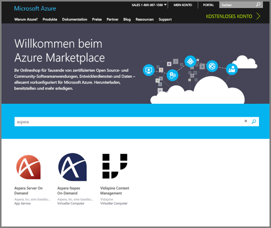
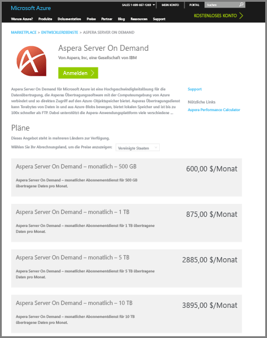
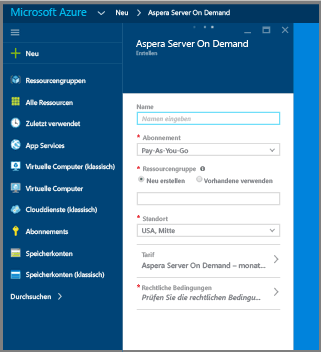
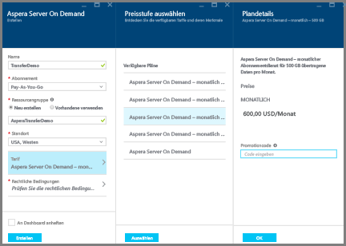
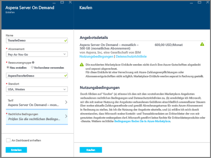
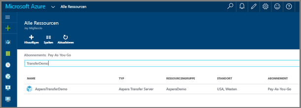
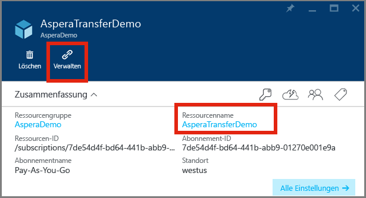

# Hochladen von Dateien in ein Media Services-Konto mithilfe des Diensts „Aspera Server On Demand“ in Azure

## Übersicht

**Aspera** ist eine Software für Dateiübertragungen mit hoher Geschwindigkeit. Mit **Aspera Server On Demand** für Azure lassen sich große Dateien schnell und direkt in den Azure-Blobobjektspeicher hochladen und daraus herunterladen. Informationen zu **Aspera On Demand** finden Sie auf der Website [Aspera Cloud](http://cloud.asperasoft.com/). 
  
**Aspera Server On Demand** für Azure kann über den [Azure Marketplace](https://azure.microsoft.com/en-us/marketplace/) erworben werden. Melden Sie sich beim Azure Marketplace bitte mit Ihrer Windows Live ID an, wenn Sie **Aspera Server On Demand** für Azure erwerben möchten.

In diesem Tutorial erfahren Sie Schritt für Schritt, wie Sie in Azure mithilfe des Diensts **Aspera Server On Demand** Dateien in ein Speicherkonto hochladen, das einem Media Services-Konto zugeordnet ist. 

Ein Beispiel für die Verwendung von Azure-Funktionen mit Aspera und Media Services finden Sie [hier](https://github.com/Azure-Samples/media-services-dotnet-functions-integration/tree/master/103-aspera-ingest).

>[!NOTE]
>Mit Azure Media Services-Medienprozessoren (MPs) können nur Dateien bis zu einer bestimmten Größe verarbeitet werden. Ausführliche Informationen zur Dateigrößenbeschränkung finden Sie in [diesem Thema](media-services-quotas-and-limitations.md).
>

## Voraussetzungen 

Für dieses Tutorial benötigen Sie Folgendes:

* Eine Windows Live ID.
* Ein [Azure-Konto](https://azure.microsoft.com). Ausführliche Informationen finden Sie unter [Kostenlose Azure-Testversion](https://azure.microsoft.com/pricing/free-trial/). 
* Ein [Azure Media Services-Konto](media-services-portal-create-account.md).

## Erwerben von Aspera On Demand für Azure

Melden Sie sich beim Azure Marketplace an, und gehen Sie anschließend wie hier beschrieben vor, um Aspera On Demand für Azure zu erwerben:

1. Suchen Sie nach „Aspera“, und wählen Sie „Server On Demand“ aus.

   

2. Machen Sie sich mit den Abonnementplänen vertraut, und klicken Sie auf „Registrieren“.

   

3. Geben Sie die spezifischen Informationen für Ihr Server On Demand-Abonnement an.

   

4. Klicken Sie auf **Tarif**, und wählen Sie im Unterbereich das gewünschte monatliche Volumen aus. Wählen Sie im Bereich **Plan details** (Plandetails) die Option **OK** aus. Wählen Sie anschließend im Bereich **Wählen Sie Ihren Tarif** die Option **Auswählen** aus.

   

5. Klicken Sie auf **Rechtliche Bedingungen**, um die rechtlichen Bedingungen im Unterbereich anzuzeigen und zu akzeptieren. Klicken Sie nach der Prüfung der rechtlichen Bedingungen auf **Kaufen**.

   

6. Klicken Sie auf **Erstellen**, um den Kauf abzuschließen.

   

7. Im Azure-Dashboard wird eine Benachrichtigung mit dem Hinweis angezeigt, dass der Dienst bereitgestellt wird.  Nach Abschluss des Bereitstellungsvorgangs können Sie Ihre Ressourcen nach dem Namen des Diensts durchsuchen, um das neue Abonnement zu finden. Doppelklicken Sie auf den Dienst, um das Dienstverwaltungsportal zu starten.

   

8. Starten Sie das Aspera-Verwaltungsportal. Wenn Sie Ihren neuen Aspera-Dienst gefunden haben, können Sie auf den Dienst klicken, um auf das Verwaltungsportal zuzugreifen.  Ein neuer Bereich wird gestartet. Klicken Sie in diesem neuen Bereich auf den **Ressourcennamen** Ihres neuen Diensts.  Im folgenden Screenshot lautet der Ressourcenname „AsperaTransferDemo“. Nachdem Sie auf den Ressourcennamen geklickt haben, wird ein weiterer Bereich gestartet. In diesem neu gestarteten Bereich befindet sich ein Link namens „Verwalten“. Klicken Sie auf den Link „Verwalten“, um das Aspera-Verwaltungsportal zu starten.

   

9. Durch Klicken auf den Link „Verwalten“ gelangen Sie zur Registrierungsseite. Dies ist für den Zugriff auf den Dienst erforderlich.

   

10. Sie sollten nun Zugriff auf das Aspera-Dienstverwaltungsportal haben. Hier können Sie Zugriffsschlüssel erstellen, Aspera-Clients und -Lizenzen herunterladen, Nutzungsinformationen anzeigen und sich über die APIs informieren.

    Der folgende Screenshot zeigt die Zugriffserstellung: 

   

    Der folgende Screenshot zeigt die Oberflächen für die Nutzungsberichte im Portal: 

   

## Hochladen von Dateien mit Aspera

1. Laden Sie die Aspera-Clientsoftware herunter, und installieren Sie sie:
    
    * [Browser-Plug-In](http://downloads.asperasoft.com/connect2/)
    * [Rich Client](http://downloads.asperasoft.com/en/downloads/2)

2. Führen Sie Ihre erste Übertragung durch. Gehen Sie wie folgt vor, wenn Sie mithilfe des Aspera-Clients Daten über den Aspera-Übertragungsdienst übertragen möchten: 

    1. Erstellen Sie über das Aspera-Portal einen Zugriffsschlüssel.  
    2. Laden Sie den Aspera-Client herunter, und installieren/lizenzieren Sie ihn. (Die Software finden Sie im Aspera-Portal.)  

    >[!NOTE]
    >Konfigurationsinformationen finden Sie im Aspera-Clienthandbuch.
    
    3. Rufen Sie über das [Azure-Portal](https://portal.azure.com/) einige Informationen des Speicherkontos ab, das Ihrem Azure Media-Konto zugeordnet ist. Hierzu zählen insbesondere Name und Schlüssel sowie der Name des Speicherblobcontainers, in dem der Inhalt platziert werden soll. 

        * Die Speicherinformationen können Sie im Portal wie folgt ermitteln: Suchen Sie nach Ihrem Speicherkonto, klicken Sie auf die Zugriffsschlüssel, und kopieren Sie den Namen und den Schlüssel Ihres Kontos.
        * Gehen Sie zum Ermitteln des Containernamens wie folgt vor: Suchen Sie nach Ihrem Speicherkonto, wählen Sie **Blobs** aus, und wählen Sie anschließend den Namen des Containers aus, in den Sie den Inhalt hochladen möchten. 

    Der folgende Screenshot zeigt den **Verbindungs-Manager** des Aspera-Clients, in dem Sie den Speichertyp „Azure“, die Anmeldeinformationen und den Blobcontainer angeben müssen:

    

## Ressourcen

In diesem Artikel wurden die folgenden Ressourcen erwähnt: 

* [Connect-Browser-Plug-In](http://downloads.asperasoft.com/connect2/)
* [Connect-Handbuch](http://downloads.asperasoft.com/en/documentation/8)
* [Aspera-Client](http://downloads.asperasoft.com/en/downloads/2)
* [Clienthandbuch](http://downloads.asperasoft.com/en/documentation/2)

## Nächste Schritte

Jetzt können Sie [Blobs aus einem Speicherkonto in ein AMS-Konto kopieren](media-services-copying-existing-blob.md#copy-blobs-from-a-storage-account-into-an-ams-account).

## Media Services-Lernpfade
[!INCLUDE [media-services-learning-paths-include](../../includes/media-services-learning-paths-include.md)]

## Feedback geben
[!INCLUDE [media-services-user-voice-include](../../includes/media-services-user-voice-include.md)]

