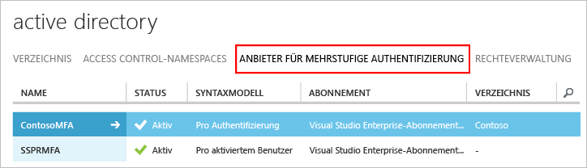

# Erste Schritte mit Azure Multi-Factor Authentication-Server

Nachdem wir nun geklärt haben, dass wir den lokalen Multi-Factor Authentication-Server verwenden möchten, können wir mit der Einrichtung beginnen. Auf dieser Seite werden eine Neuinstallation des Servers und die Einrichtung mit einer lokalen Active Directory-Instanz behandelt. Wenn Sie den PhoneFactor-Server bereits installiert haben und ihn aktualisieren möchten, finden Sie weitere Informationen unter [Aktualisieren auf Azure Multi-Factor-Server](multi-factor-authentication-get-started-server-upgrade.md). Wenn Sie wissen möchten, wie Sie nur den Webdienst installieren, finden Sie weitere Informationen unter [Bereitstellen des Webdiensts der mobilen App für den Azure Multi-Factor Authentication-Server](multi-factor-authentication-get-started-server-webservice.md).

## Herunterladen des Azure Multi-Factor Authentication-Servers
Es gibt zwei Möglichkeiten, den Azure Multi-Factor Authentication-Server herunterzuladen. Bei beiden wird das Azure-Portal verwendet. Die erste besteht darin, den Multi-Factor Authentication-Anbieter direkt zu verwalten. Die zweite erfolgt über die Diensteinstellungen. Für die zweite Option ist entweder ein Multi-Factor Authentication-Anbieter oder eine Azure MFA-, Azure AD Premium- oder Enterprise Mobility Suite-Lizenz erforderlich.

> [!Important]
> Diese beiden scheinen Ähnlichkeiten aufzuweisen, es ist jedoch wichtig zu wissen, welche Option verwendet werden soll. Erstellen Sie keinen Multi-Factor Authentication-Anbieter, um den Serverdownload zu erhalten, falls Ihre Benutzer über Lizenzen verfügen, die in MFA (Azure MFA, Azure AD Premium oder Enterprise Mobility + Security) enthalten sind. Verwenden Sie stattdessen Option 2, um den Server von der Seite mit den Diensteinstellungen herunterzuladen. 

### Option 1: Herunterladen des Azure Multi-Factor Authentication-Servers im klassischen Azure-Portal

Verwenden Sie diese Downloadoption, falls Sie bereits über einen Multi-Factor Authentication-Anbieter verfügen, da Sie für MFA pro aktiviertem Benutzer oder pro Authentifizierung bezahlen. 

1. Melden Sie sich beim [klassischen Azure-Portal](https://manage.windowsazure.com) als Administrator an.
2. Wählen Sie im linken Bereich **Active Directory**aus.
3. Klicken Sie auf der Active Directory-Seite auf **Anbieter für mehrstufige Authentifizierung**
    .
4. Klicken Sie unten auf **Verwalten**. Eine neue Seite wird geöffnet.
5. Klicken Sie auf **Downloads**.
6. Klicken Sie oberhalb von **Anmeldeinformationen für Aktivierung generieren** auf den Link **Download**.
   
7. Speichern Sie den Download.

### Option 2: Herunterladen des Azure Multi-Factor Authentication-Server über die Diensteinstellungen

Verwenden Sie diese Downloadoption, wenn Sie Enterprise Mobility Suite-, Azure AD Premium- oder Enterprise Cloud Suite-Lizenzen besitzen. 

1. Melden Sie sich beim [klassischen Azure-Portal](https://manage.windowsazure.com) als Administrator an.
2. Wählen Sie im linken Bereich **Active Directory**aus.
3. Doppelklicken Sie auf Ihre Instanz von Azure AD.
4. Klicken Sie oben auf **Konfigurieren**
5. Scrollen Sie nach unten zum Abschnitt **Multi-Factor Authentication**, und wählen Sie die Option **Diensteinstellungen verwalten**.
6. Klicken Sie auf der Seite "Diensteinstellungen" am unteren Rand des Bildschirms auf **Portal aufrufen**. Eine neue Seite wird geöffnet.
   
7. Klicken Sie auf **Downloads**
8. Klicken Sie oberhalb von **Anmeldeinformationen für Aktivierung generieren** auf den Link **Download**.
    
9. Speichern Sie den Download.

## Installieren und Konfigurieren des Azure Multi-Factor Authentication-Servers
Nachdem Sie den Server heruntergeladen haben, können Sie ihn installieren und konfigurieren.  Achten Sie darauf, dass der Server, den Sie installieren möchten, die folgenden Anforderungen erfüllt:

| Anforderungen an den Azure Multi-Factor Authentication-Server | Beschreibung |
|:--- |:--- |
| Hardware |<li>200 MB Festplattenspeicher</li><li>x32- oder x64-fähiger Prozessor</li><li>1 GB oder mehr RAM</li> |
| Software |<li>Windows Server 2008 oder höher, wenn der Host ein Serverbetriebssystem ist</li><li>Windows 7 oder höher, wenn der Host ein Clientbetriebssystem ist</li><li>Microsoft .NET 4.0 Framework</li><li>IIS 7.0 oder höher bei Installation des Benutzerportals oder des Webdienst-SDK</li> |

### Anforderungen an die Azure Multi-Factor Authentication-Server-Firewall
- - -
Für jeden MFA-Server muss die Kommunikation über den ausgehenden Port 443 zu folgenden Adressen möglich sein:

* https://pfd.phonefactor.net
* https://pfd2.phonefactor.net
* https://css.phonefactor.net

Öffnen Sie die folgenden IP-Adressbereiche, wenn Firewalls auf den ausgehenden Port 443 beschränkt sind:

| IP-Subnetz | Netzmaske | IP-Bereich |
|:--- |:--- |:--- |
| 134.170.116.0/25 |255.255.255.128 |134.170.116.1–134.170.116.126 |
| 134.170.165.0/25 |255.255.255.128 |134.170.165.1–134.170.165.126 |
| 70.37.154.128/25 |255.255.255.128 |70.37.154.129–70.37.154.254 |

Wenn Sie das Feature „Ereignisbestätigung“ nicht verwenden und Benutzer keine mobilen Apps nutzen, um über Geräte im Unternehmensnetzwerk Überprüfungen durchzuführen, können die IP-Adressen auf die folgenden Bereiche reduziert werden:

| IP-Subnetz | Netzmaske | IP-Bereich |
|:--- |:--- |:--- |
| 134.170.116.72/29 |255.255.255.248 |134.170.116.72–134.170.116.79 |
| 134.170.165.72/29 |255.255.255.248 |134.170.165.72–134.170.165.79 |
| 70.37.154.200/29 |255.255.255.248 |70.37.154.201–70.37.154.206 |

### So installieren und konfigurieren Sie den Azure Multi-Factor Authentication-Server

1. Doppelklicken Sie auf die ausführbare Datei. Die Installation beginnt.
2. Vergewissern Sie sich, dass auf dem Bildschirm „Installationsordner auswählen“ der richtige Ordner ausgewählt ist, und klicken Sie auf **Weiter**.
3. Klicken Sie nach Abschluss der Installation auf **Fertig stellen**.  Der Konfigurations-Assistent wird gestartet.
4. Aktivieren Sie auf der Willkommensseite des Konfigurations-Assistenten das Kontrollkästchen **Verwendung des Authentifizierungskonfigurations-Assistenten überspringen**, und klicken Sie auf **Weiter**.  Der Assistent wird geschlossen, und der Server wird gestartet.
    
5. Wechseln Sie zurück zu der Seite, von der Sie den Server heruntergeladen haben, und klicken Sie auf die Schaltfläche **Anmeldeinformationen für Aktivierung generieren** . Kopieren Sie diese Informationen auf dem Azure MFA-Server in die angezeigten Felder, und klicken Sie auf **Aktivieren**.

Die Schritte oben beschreiben ein Express-Setup mit dem Konfigurations-Assistenten.  Sie können den Authentifizierungs-Assistenten erneut ausführen, indem Sie im Menü „Extras“ auf dem Server die entsprechende Option auswählen.

## Importieren von Benutzern aus Active Directory
Nachdem Sie den Server installiert und konfiguriert haben, können Sie Benutzer schnell in den Azure MFA-Server importieren.

1. Wählen Sie auf dem Azure MFA-Server auf der linken Seite **Benutzer**aus.
2. Wählen Sie unten **Aus Active Directory importieren**aus.
3. Sie können jetzt entweder nach einzelnen Benutzern suchen oder im AD-Verzeichnis nach Organisationseinheiten suchen, die die gewünschten Benutzer enthalten.  In diesem Beispiel wird die Benutzer-Organisationseinheit angegeben.
4. Markieren Sie alle Benutzer auf der rechten Seite, und klicken Sie auf **Importieren**.  Es wird ein Popupfenster angezeigt, wenn der Vorgang erfolgreich ausgeführt wurde.  Schließen Sie das Fenster "Importieren".

## Senden einer E-Mail an Benutzer
Nachdem Sie die Benutzer in den MFA-Server importiert haben, empfehlen wir Ihnen, den Benutzern eine E-Mail mit dem Hinweis zu senden, dass sie für die Überprüfung in zwei Schritten registriert wurden.

Die gesendete E-Mail sollte sich danach richten, wie Sie die Benutzer für die Überprüfung in zwei Schritten konfiguriert haben. Falls Sie beispielsweise die Telefonnummern der Benutzer aus dem Telefonverzeichnis Ihres Unternehmens importieren können, sollte die E-Mail die Standardnummern enthalten, damit die Benutzer wissen, was sie erwartet. Wenn die Telefonnummern der Benutzer nicht importiert werden oder die Benutzer für die Verwendung der mobilen App konfiguriert wurden, können Sie entsprechend eine E-Mail senden, in der über einen Hyperlink auf das Benutzerportal für die Azure Multi-Factor Authentication verwiesen wird, um die Kontoregistrierung durchführen zu können.

Der Inhalt der E-Mail variiert auch abhängig von der Überprüfungsmethode, die für den Benutzer festgelegt wurde (Telefonanruf, SMS oder mobile App).  Wenn der Benutzer beispielsweise bei der Authentifizierung eine PIN verwenden muss, wird er per E-Mail informiert, wie seine anfängliche PIN festgelegt wurde.  Benutzer müssen ihre PIN während der ersten Überprüfung ändern.

### Konfigurieren von E-Mails und E-Mail-Vorlagen
Klicken Sie auf das E-Mail-Symbol auf der linken Seite, um die Einstellungen zum Senden dieser E-Mails einzurichten. Hier können Sie die SMTP-Informationen Ihres Mailservers eingeben und E-Mails senden, indem Sie das Kontrollkästchen **E-Mails an Benutzer senden** aktivieren.

Auf der Registerkarte „E-Mail-Inhalt“ werden alle E-Mail-Vorlagen angezeigt, die Sie auswählen können. Je nachdem, wie Sie Ihre Benutzer für die Überprüfung in zwei Schritten konfiguriert haben, können Sie also die am besten geeignete Vorlage auswählen.

## Verarbeitung von Benutzerdaten durch den Azure Multi-Factor Authentication-Server
Bei lokaler Verwendung des Multi-Factor Authentication (MFA)-Servers werden die Daten eines Benutzers auf den lokalen Servern gespeichert. Daten werden nicht dauerhaft in der Cloud gespeichert. Wenn der Benutzer eine Überprüfung in zwei Schritten durchführt, sendet der MFA-Server Daten an den Azure MFA-Clouddienst, um die Überprüfung durchzuführen. Wenn diese Authentifizierungsanforderungen an den Clouddienst gesendet werden, werden in der Anforderung und den Protokollen die folgenden Felder gesendet, damit sie in den Authentifizierungs-/Verwendungsberichten des Kunden verfügbar sind. Einige Felder sind optional und können für den Multi-Factor Authentication-Server aktiviert oder deaktiviert werden. Für die Kommunikation zwischen MFA-Server und MFA-Clouddienst wird SSL/TLS über den ausgehenden Port 443 verwendet. Die Felder lauten:

* Eindeutige ID: Benutzername oder interne ID des MFA-Servers
* Vor- und Nachname (optional)
* E-Mail-Adresse (optional)
* Rufnummer: für eine Anruf- oder SMS-Authentifizierung
* Gerätetoken: für die Authentifizierung einer mobilen App
* Authentifizierungsmodus
* Authentifizierungsergebnis
* Name des MFA-Servers
* MFA-Server-IP
* Client-IP – falls verfügbar

Zusätzlich zu den obigen Feldern werden auch das Überprüfungsergebnis (Erfolg/Ablehnung) und der Grund für etwaige Ablehnungen mit den Authentifizierungsdaten gespeichert. Sie stehen in den Authentifizierungs- bzw. Verwendungsberichten zur Verfügung.

## Nächste Schritte
Weitere Informationen zu erweiterten Einstellungen und Konfigurationsinformationen finden Sie unter den Links in der folgenden Tabelle:

| Methode | Beschreibung |
|:--- |:--- |
| [Benutzerportal](multi-factor-authentication-get-started-portal.md) |Informationen zum Einrichten und Konfigurieren des Benutzerportals einschließlich der Bereitstellung und Benutzer-Self-Service. |
| [Active Directory-Verbunddienste](multi-factor-authentication-get-started-adfs.md) |Informationen zum Einrichten von Multi-Factor Authentication mit AD FS. |
| [RADIUS-Authentifizierung](multi-factor-authentication-get-started-server-radius.md) |Informationen über Einrichtung und Konfiguration des Azure MFA-Servers mit RADIUS. Mit RADIUS können Sie verschiedene Drittanbietersysteme in Azure MFA Server integrieren. |
| [IIS-Authentifizierung](multi-factor-authentication-get-started-server-iis.md) |Informationen über Einrichtung und Konfiguration des Azure MFA-Servers mit IIS. Mit IIS können Sie verschiedene Drittanbietersysteme in Azure MFA Server integrieren. |
| [Windows-Authentifizierung](multi-factor-authentication-get-started-server-windows.md) |Informationen über Einrichtung und Konfiguration des Azure MFA-Servers mit Windows-Authentifizierung. |
| [LDAP-Authentifizierung](multi-factor-authentication-get-started-server-ldap.md) |Informationen über Einrichtung und Konfiguration des Azure MFA-Servers mit LDAP-Authentifizierung. Mit LDAP können Sie verschiedene Drittanbietersysteme in Azure MFA Server integrieren. |
| [Remotedesktop-Gateway und Azure Multi-Factor Authentication-Server mithilfe von RADIUS](multi-factor-authentication-get-started-server-rdg.md) |Informationen zum Einrichten und Konfigurieren des Azure MFA-Servers mit Remotedesktop-Gateway unter Verwendung von RADIUS. |
| [Synchronisieren mit Windows Server Active Directory](multi-factor-authentication-get-started-server-dirint.md) |Informationen zum Einrichten und Konfigurieren der Synchronisierung zwischen Active Directory und dem Azure MFA-Server. |
| [Bereitstellen des mobilen App-Webdienstes für den Azure Multi-Factor Authentication-Server](multi-factor-authentication-get-started-server-webservice.md) |Informationen über das Einrichten und Konfigurieren des Azure MFA-Server-Webdienstes. |
| [Erweiterte Szenarien mit Azure Multi-Factor Authentication und Drittanbieter-VPNs](multi-factor-authentication-advanced-vpn-configurations.md) | Enthält Schritt-für-Schritt-Anleitungen zur Konfiguration für Cisco-, Citrix- und Juniper VPN-Geräte. |

