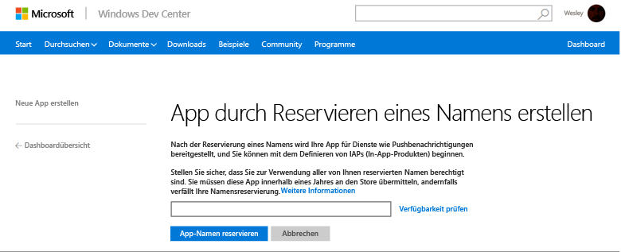
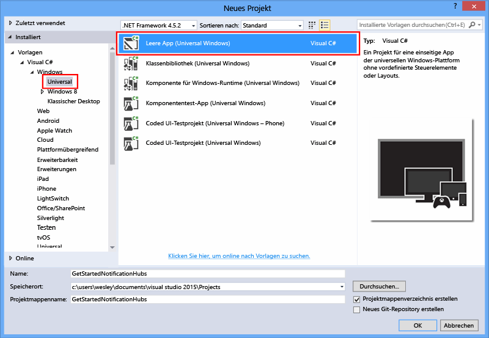
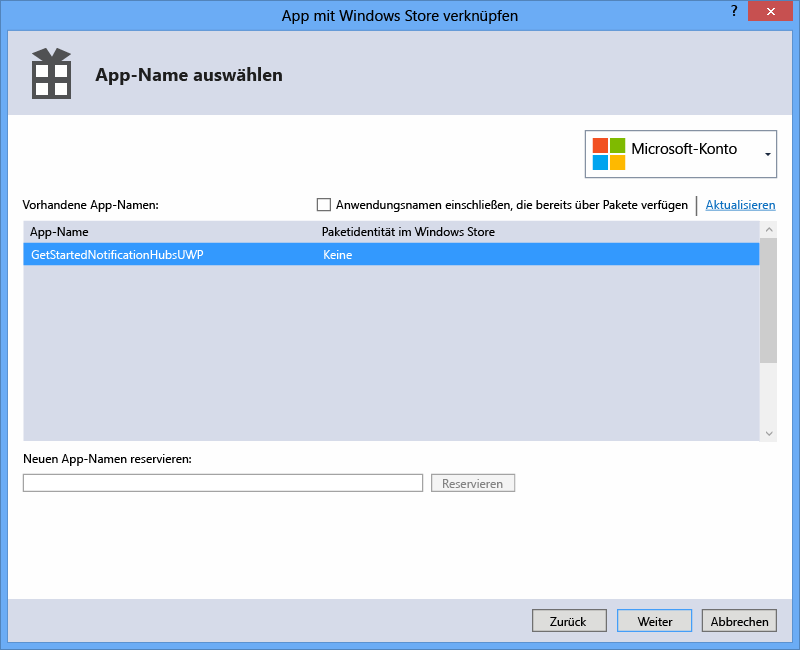
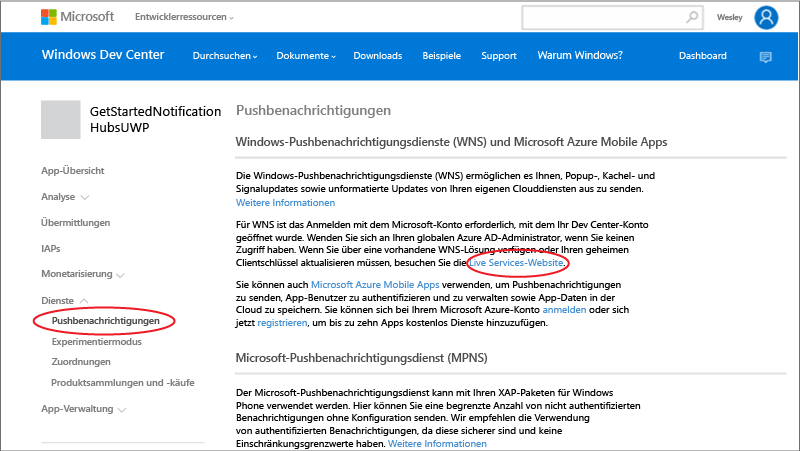
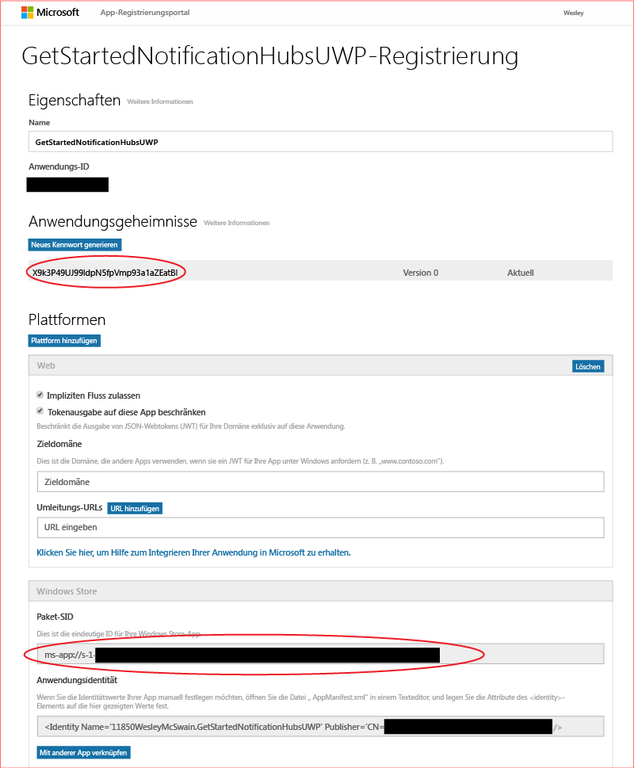
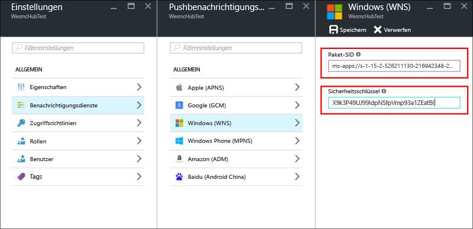

<properties
	pageTitle="Erste Schritte mit Azure Notification Hubs für Apps der universellen Windows-Plattform | Microsoft Azure"
	description="In diesem Tutorial erfahren Sie, wie Sie mithilfe von Azure Notification Hubs Pushbenachrichtigungen an eine App für die universelle Windows-Plattform senden."
	services="notification-hubs"
	documentationCenter="windows"
	authors="wesmc7777"
	manager="erikre"
	editor="erikre"/>

<tags
	ms.service="notification-hubs"
	ms.workload="mobile"
	ms.tgt_pltfrm="mobile-windows"
	ms.devlang="dotnet"
	ms.topic="hero-article"
	ms.date="07/21/2016"
	ms.author="wesmc"/>

# Erste Schritte mit Notification Hubs für Apps für die universelle Windows-Plattform

[AZURE.INCLUDE [Notification-Hubs-Auswahl-Erste-Schritte](../../includes/notification-hubs-selector-get-started.md)]

##Übersicht

In diesem Lernprogramm wird gezeigt, wie Sie mit Azure Notification Hubs Pushbenachrichtigungen an eine App für die universelle Windows-Plattform senden können.

In diesem Lernprogramm erstellen Sie eine leere Windows Store-App, die Pushbenachrichtigungen mithilfe des Windows-Pushbenachrichtigungsdiensts (WNS) empfängt. Sobald Sie dieses Lernprogramm abgeschlossen haben, können Sie über Ihren Notification Hub Pushbenachrichtigungen an alle Geräte senden, die Ihre App ausführen.

## Voraussetzungen

[AZURE.INCLUDE [notification-hubs-hero-slug](../../includes/notification-hubs-hero-slug.md)]

Den vollständigen Code für dieses Tutorial finden Sie [hier](https://github.com/Azure/azure-notificationhubs-samples/tree/master/dotnet/GetStartedWindowsUniversal) auf GitHub.

##Voraussetzungen

Für dieses Lernprogramm ist Folgendes erforderlich:

+ [Microsoft Visual Studio Community 2015](https://www.visualstudio.com/products/visual-studio-community-vs) oder höher

+ [Installation von Entwicklungstools für universelle Windows-Apps](https://msdn.microsoft.com/windows/uwp/get-started/get-set-up)

+ Ein aktives Azure-Konto  Wenn Sie noch kein Konto haben, können Sie in nur wenigen Minuten ein kostenloses Testkonto erstellen. Einzelheiten finden Sie unter [Kostenlose Azure-Testversion](https://azure.microsoft.com/pricing/free-trial/?WT.mc_id=A0E0E5C02&amp;returnurl=http%3A%2F%2Fazure.microsoft.com%2Fde-DE%2Fdocumentation%2Farticles%2Fnotification-hubs-windows-store-dotnet-get-started%2F).

+ Ein aktives Windows Store-Konto

Das Abschließen dieses Tutorials ist eine Voraussetzung für alle anderen Notification Hub-Tutorials zu Apps für die universelle Windows-Plattform.

##Registrieren der App für den Windows Store

Sie müssen die App dem Windows Store zuordnen, um Pushbenachrichtigungen an UWP-Apps senden zu können. Sie müssen anschließend den Benachrichtigungshub zur Integration in den WNS konfigurieren.

1. Falls Sie Ihre App noch nicht registriert haben, navigieren Sie zum [Windows-Entwicklungscenter](https://dev.windows.com/overview), melden Sie sich dort mit Ihrem Microsoft-Konto an, und klicken Sie dann auf **Neue App erstellen**.

2. Geben Sie einen Namen für die App ein, und klicken Sie auf **App-Namen reservieren**.

   	

   	Auf diese Weise wird eine neue Windows Store-Registrierung für Ihre App erstellt.

3. Erstellen Sie in Visual Studio ein neues Visual C# Store-App-Projekt mit der Vorlage **Leere App**, und klicken Sie auf **OK**.

   	

4. Übernehmen Sie die Standardwerte für die Zielversion und die Mindestversion der Plattform.

5. Klicken Sie im Projektmappen-Explorer mit der rechten Maustaste auf das Windows Store-App-Projekt, klicken Sie auf **Store**, und klicken Sie dann auf **App mit Store verknüpfen**.

   	

   	Der Assistent zum Verknüpfen der App mit dem Windows Store wird angezeigt.

6. Klicken Sie im Assistenten auf **Anmelden**. Melden Sie sich dann mit Ihrem Microsoft-Konto an.

7. Klicken Sie auf die App, die Sie in Schritt 2 registriert haben. Klicken Sie auf **Weiter** und dann auf **Zuordnen**.

   	

   	Auf diese Weise werden die erforderlichen Windows Store-Registrierungsinformationen zum Anwendungsmanifest hinzugefügt.

8. Wechseln Sie wieder zur Seite des [Windows-Entwicklungscenters](http://go.microsoft.com/fwlink/p/?LinkID=266582) für Ihre neue App. Klicken Sie auf **Services** und **Pushbenachrichtigungen**, und klicken Sie dann unter **Windows-Pushbenachrichtigungsdienste (WNS) und Microsoft Azure Mobile Apps** auf **Live Services-Website**.

   	

9. Notieren Sie sich auf der Registrierungsseite für Ihre App das Kennwort unter **Geheimer Anwendungsschlüssel** und die **Paketsicherheits-ID (SID)** in den Einstellungen der Plattform **Windows Store**.

   	

 	> [AZURE.WARNING]
	Der geheime Schlüssel der Anwendung und die Paket-SID sind wichtige Sicherheitsanmeldeinformationen. Geben Sie diese Werte nicht weiter, und verteilen Sie sie nicht mit Ihrer Anwendung.

##Konfigurieren Ihres Notification Hub

[AZURE.INCLUDE [notification-hubs-portal-create-new-hub](../../includes/notification-hubs-portal-create-new-hub.md)]

<ol start="6">
<li>
Wählen Sie die Option <b>Notification Services</b> und die Option <b>Windows (WNS)</b>. Geben Sie anschließend im Feld <b>Sicherheitsschlüssel</b> das Kennwort für <b>Geheimer Anwendungsschlüssel</b> ein. Geben Sie den Wert für die <b>Paket-SID</b> ein, den Sie über WNS im vorherigen Abschnitt ermittelt haben, und klicken Sie auf <b>Speichern</b>.

</li>
</ol>

&emsp;&emsp;

Der Benachrichtigungshub ist nun konfiguriert, um mit dem WNS arbeiten zu können. Außerdem besitzen Sie die Verbindungszeichenfolgen zum Registrieren der App und zum Senden von Benachrichtigungen.

##Verbinden Ihrer App mit dem Notification Hub

1. Klicken Sie in Visual Studio mit der rechten Maustaste auf die Projektmappe, und klicken Sie dann auf **NuGet-Pakete verwalten**.

	Daraufhin wird das Dialogfeld **NuGet-Pakete verwalten** angezeigt.

2. Suchen Sie nach `WindowsAzure.Messaging.Managed`, klicken Sie auf **Installieren**, und akzeptieren Sie die Nutzungsbedingungen.

	![][20]

	Damit wird ein Verweis auf die Azure Messaging-Bibliothek für Windows mit dem <a href="http://nuget.org/packages/WindowsAzure.Messaging.Managed/">WindowsAzure.Messaging.Managed NuGet-Paket</a> heruntergeladen, installiert und hinzugefügt.

3. Öffnen Sie die Projektdatei „App.xaml.cs“, und fügen Sie die folgenden `using`-Anweisungen hinzu.

        using Windows.Networking.PushNotifications;
        using Microsoft.WindowsAzure.Messaging;
		using Windows.UI.Popups;

4. Fügen Sie auch in der Datei "App.xaml.cs" der **App**-Klasse folgende **InitNotificationsAsync**-Methodendefinition hinzu:

	    private async void InitNotificationsAsync()
        {
            var channel = await PushNotificationChannelManager.CreatePushNotificationChannelForApplicationAsync();

            var hub = new NotificationHub("< your hub name>", "<Your DefaultListenSharedAccessSignature connection string>");
			var result = await hub.RegisterNativeAsync(channel.Uri);

            // Displays the registration ID so you know it was successful
            if (result.RegistrationId != null)
            {
                var dialog = new MessageDialog("Registration successful: " + result.RegistrationId);
                dialog.Commands.Add(new UICommand("OK"));
                await dialog.ShowAsync();
            }

        }

    Dieser Code ruft den Kanal-URI für die App von WNS ab und registriert dann diesen Kanal-URI bei Ihrem Benachrichtigungshub.

    >[AZURE.NOTE] Stellen Sie sicher, dass Sie den Platzhalter „your hub name“ durch den Namen des Notification Hub ersetzen, der im Azure-Portal angezeigt wird. Ersetzen Sie außerdem den Verbindungszeichenfolgen-Platzhalter durch die **DefaultListenSharedAccessSignature**-Verbindungszeichenfolge, die Sie in einem der vorherigen Abschnitte über die Seite **Zugriffsrichtlinien** Ihres Notification Hub ermittelt haben.

5. Fügen Sie in der Datei "App.xaml.cs" am Anfang des **OnLaunched**-Ereignishandlers den folgenden Aufruf zu der neuen **InitNotificationsAsync**-Methode hinzu:

        InitNotificationsAsync();

    Dadurch wird gewährleistet, dass der Kanal-URI bei jedem Start der Anwendung im Notification Hub registriert wird.

6. Drücken Sie **F5**, um die App auszuführen. Ein Dialogfenster mit dem Registrierungsschlüssel wird angezeigt.

   	![][19]

Ihre App kann jetzt Popupbenachrichtigungen empfangen.

##Senden von Benachrichtigungen 

Sie können den Empfang von Benachrichtigungen in Ihrer App schnell testen, indem Sie Benachrichtigungen im [Azure-Portal](https://portal.azure.com/) mithilfe der Schaltfläche **Testsendung** im Notification Hub senden. Dies ist hier dargestellt:

Pushbenachrichtigungen werden normalerweise in einem Back-End-Dienst wie z. B. Mobile Services oder ASP.NET mit einer kompatiblen Bibliothek gesendet. Sie können Benachrichtigungsmeldungen zudem direkt über die REST-API senden, wenn für Ihr Back-End keine Bibliothek verfügbar ist.

In diesem Lernprogramm gehen wir einfach vor und veranschaulichen nur das Testen der Client-App, indem wir Benachrichtigungen mit dem .NET SDK für Notification Hubs in einer Konsolenanwendung senden, anstatt über einen Back-End-Dienst. Es wird empfohlen, das Tutorial [Verwenden von Notification Hubs für Pushbenachrichtigungen an Benutzer] als nächsten Schritt zum Senden von Benachrichtigungen von einem ASP.NET-Back-End zu nutzen. Sie können aber die folgenden Vorgehensweisen zum Senden von Benachrichtigungen verwenden:

* **REST-Schnittstelle**: Sie können die Benachrichtigung auf allen Back-End-Plattformen unterstützen, indem Sie die [REST-Schnittstelle](http://msdn.microsoft.com/library/windowsazure/dn223264.aspx) verwenden.

* **Microsoft Azure Notification Hubs .NET SDK**: Führen Sie im Nuget-Paket-Manager für Visual Studio die Option [Install-Package Microsoft.Azure.NotificationHubs](https://www.nuget.org/packages/Microsoft.Azure.NotificationHubs/) aus.

* **Node.js** : [Verwenden von Notification Hubs mit Node.js](notification-hubs-nodejs-push-notification-tutorial.md).

* **Azure Mobile Apps**: Ein Beispiel für das Senden von Benachrichtigungen von einer in Notification Hubs integrierten Azure Mobile Services-Instanz finden Sie unter [Hinzufügen von Pushbenachrichtigungen für Mobile Apps](../app-service-mobile/app-service-mobile-windows-store-dotnet-get-started-push.md).

* **Java/PHP**: Ein Beispiel zum Senden von Benachrichtigungen über die REST-APIs finden Sie unter „Verwenden von Notification Hubs von Java/PHP“ ([Java](notification-hubs-java-push-notification-tutorial.md) | [PHP](notification-hubs-php-push-notification-tutorial.md)).

## (Optional) Senden von Benachrichtigungen aus einer Konsolenanwendung

Führen Sie die folgenden Schritte aus, um Benachrichtigungen mithilfe einer .NET-Konsolenanwendung zu senden.

1. Klicken Sie mit der rechten Maustaste auf die Projektmappe, wählen Sie **Hinzufügen** und **Neues Projekt...** aus, und klicken Sie dann unter **Visual C#** auf **Windows**, **Konsolenanwendung** und **OK**.

   	![][13]

	Damit wird der Projektmappe eine neue Visual C#-Konsolenanwendung hinzugefügt. Sie können dies auch in einer separaten Projektmappe durchführen.

2. Klicken Sie in Visual Studio auf **Extras**, auf **NuGet-Paket-Manager** und dann auf **Paket-Manager-Konsole**.

	Daraufhin wird in Visual Studio die Paket-Manager-Konsole angezeigt.

3. Legen Sie im Fenster der Paket-Manager-Konsole als **Standardprojekt** das neue Konsolenanwendungsprojekt fest, und führen Sie dann im Konsolenfenster den folgenden Befehl aus:

        Install-Package Microsoft.Azure.NotificationHubs

	Dies fügt mithilfe des <a href="http://www.nuget.org/packages/Microsoft.Azure.NotificationHubs/">Microsoft.Azure.NotificationHubs-NuGet-Pakets</a> einen Verweis auf das Azure Notification Hubs-SDK hinzu.

	

4. Öffnen Sie die Datei „Program.cs“, und fügen Sie die folgende `using`-Anweisung hinzu:

        using Microsoft.Azure.NotificationHubs;

5. Fügen Sie in der Klasse **Program** folgende Methode hinzu:

        private static async void SendNotificationAsync()
        {
            NotificationHubClient hub = NotificationHubClient
				.CreateClientFromConnectionString("<connection string with full access>", "<hub name>");
            var toast = @"<toast><visual><binding template=""ToastText01""><text id=""1"">Hello from a .NET App!</text></binding></visual></toast>";
            await hub.SendWindowsNativeNotificationAsync(toast);
        }

   	Stellen Sie sicher, dass Sie den Platzhalter „hub name“ durch den Namen des Notification Hub ersetzen, wie er im Azure-Portal angezeigt wird. Ersetzen Sie außerdem den Verbindungszeichenfolgen-Platzhalter durch die **DefaultFullSharedAccessSignature**-Verbindungszeichenfolge, die Sie im Abschnitt „Konfigurieren Ihres Notification Hub“ über die Seite **Zugriffsrichtlinien** Ihres Notification Hub ermittelt haben.

	>[AZURE.NOTE]Stellen Sie sicher, dass Sie die Verbindungszeichenfolge mit Vollzugriff (**Full**) und nicht mit dem Zugriff (**Listen**) verwenden. Die Verbindungszeichenfolge mit Abhörzugriff verfügt nicht über die Berechtigungen zum Senden von Benachrichtigungen.

6. Fügen Sie die folgenden Zeilen zur **Main**-Methode hinzu:

         SendNotificationAsync();
		 Console.ReadLine();

7. Klicken Sie in Visual Studio mit der rechten Maustaste auf das Konsolenanwendungsprojekt, und klicken Sie auf **Als Startprojekt festlegen**, um es als Startprojekt festzulegen. Drücken Sie dann die Taste **F5**, um die Anwendung auszuführen.

   	![][14]

	Sie erhalten eine Popupbenachrichtigung auf allen registrierten Geräten. Durch Klicken oder Tippen auf das Popupbanner wird die App geladen.

Sie finden alle unterstützten Nutzlasten auf MSDN in den Themen [Toast-Katalog], [Kachelkatalog] und [Übersicht über Signale].

##Nächste Schritte

In diesem einfachen Beispiel haben Sie Übertragungsbenachrichtigungen mit dem Portal oder einer Konsolen-App an alle Ihre Windows-Geräte gesendet. Als nächster Schritt wird das Tutorial [Verwenden von Notification Hubs für Pushbenachrichtigungen an Benutzer] empfohlen. Darin wird beschrieben, wie Sie Benachrichtigungen von einem ASP.NET-Back-End für bestimmte Benutzer mithilfe von Tags senden.

Wenn Sie Ihre Benutzer nach Interessengruppen unterteilen möchten, lesen Sie [Verwenden von Benachrichtigungshubs zum Senden von neuesten Nachrichten].

Weitere allgemeine Informationen zu Notification Hubs finden Sie im [Notification Hubs-Leitfaden](notification-hubs-push-notification-overview.md).

<!-- Images. -->
[13]: ./media/notification-hubs-windows-store-dotnet-get-started/notification-hub-create-console-app.png
[14]: ./media/notification-hubs-windows-store-dotnet-get-started/notification-hub-windows-toast.png
[19]: ./media/notification-hubs-windows-store-dotnet-get-started/notification-hub-windows-reg.png
[20]: ./media/notification-hubs-windows-store-dotnet-get-started/notification-hub-windows-universal-app-install-package.png

<!-- URLs. -->

[Verwenden von Notification Hubs für Pushbenachrichtigungen an Benutzer]: notification-hubs-aspnet-backend-windows-dotnet-notify-users.md
[Verwenden von Benachrichtigungshubs zum Senden von neuesten Nachrichten]: notification-hubs-windows-store-dotnet-send-breaking-news.md

[Toast-Katalog]: http://msdn.microsoft.com/library/windows/apps/hh761494.aspx
[Kachelkatalog]: http://msdn.microsoft.com/library/windows/apps/hh761491.aspx
[Übersicht über Signale]: http://msdn.microsoft.com/library/windows/apps/hh779719.aspx

<!---HONumber=AcomDC_0817_2016-->