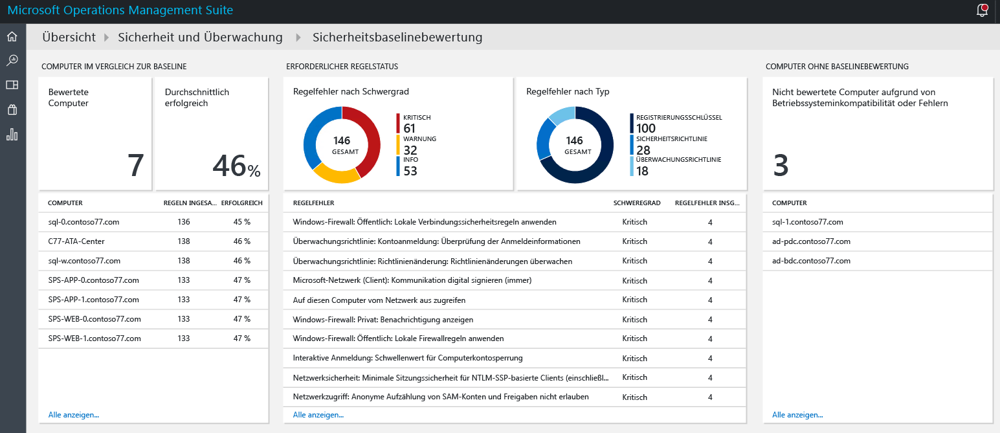
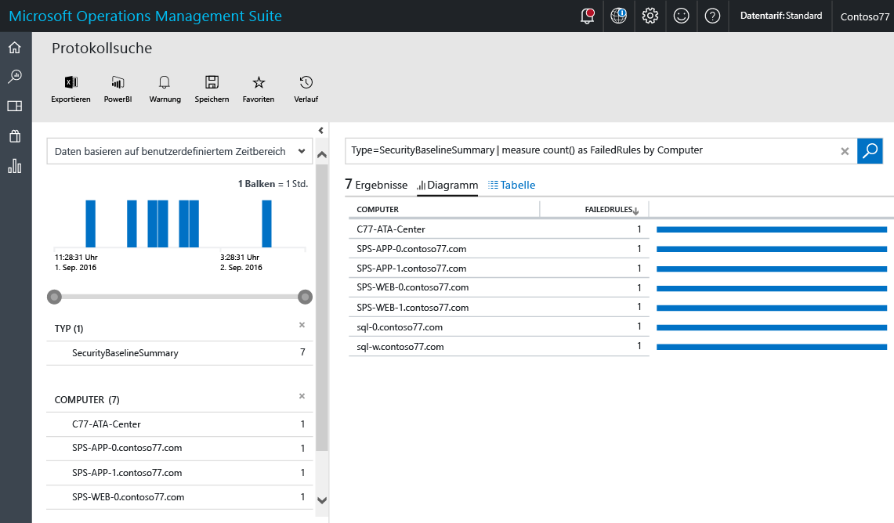
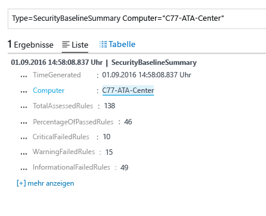
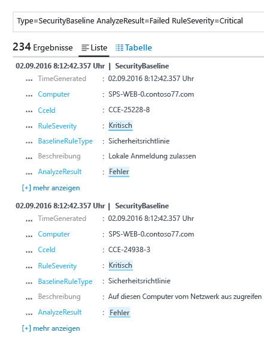

# Baselinebewertung in der Sicherheits- und Überwachungslösung von Operations Management Suite
In diesem Dokument erhalten Sie Informationen zur Verwendung der Baselinebewertung der [Sicherheits- und Überwachungslösung von Operations Management Suite (OMS)](operations-management-suite-overview.md), um auf den Zustand Ihrer überwachten Ressourcen zuzugreifen.

## Was ist eine Baselinebewertung?
Microsoft definiert in Zusammenarbeit mit Branchenunternehmen und Behörden weltweit eine Windows-Konfiguration für Serverbereitstellungen mit hoher Sicherheit. Diese Konfiguration umfasst einen Satz von Registrierungsschlüsseln, Überwachungsrichtlinieneinstellungen und Sicherheitsrichtlinieneinstellungen sowie von Microsoft empfohlene Werte für diese Einstellungen. Dieser Regelsatz wird als Sicherheitsbaseline bezeichnet. Mit der Baselinebewertung der Sicherheits- und Überwachungslösung von OMS können Sie die Compliance für Ihre gesamten Computer nahtlos testen. 

Es gibt drei Arten von Regeln:

* **Registrierungsregeln**: Hiermit wird überprüft, ob die Registrierungsschlüssel richtig festgelegt wurden.
* **Überwachungsrichtlinienregeln**: Dies sind Regeln für Ihre Überwachungsrichtlinie.
* **Sicherheitsrichtlinienregeln**: Dies sind Regeln, die die Berechtigungen des Benutzers auf dem Computer betreffen.

> [!NOTE]
> Eine kurze Übersicht über dieses Feature finden Sie unter [Use OMS Security to assess the Security Configuration Baseline](https://blogs.technet.microsoft.com/msoms/2016/08/12/use-oms-security-to-assess-the-security-configuration-baseline/) (Verwenden der OMS-Sicherheitslösung zum Bewerten der Baseline der Sicherheitskonfiguration).
> 
> 

## Bewertung der Sicherheitsbaseline
Sie können über das Dashboard Ihre aktuelle Bewertung der Sicherheitsbaseline für alle Computer prüfen, die mit der Sicherheits- und Überwachungslösung von OMS überwacht werden.  Führen Sie die folgenden Schritte aus, um auf das Dashboard für die Bewertung der Sicherheitsbaseline zuzugreifen:

1. Klicken Sie im Hauptdashboard von **Microsoft Operations Management Suite** auf die Kachel **Security and Audit** (Sicherheit und Überwachung).
2. Klicken Sie im Dashboard **Security and Audit** (Sicherheit und Überwachung) unter **Security Domains** (Sicherheitsdomänen) auf **Baseline Assessment** (Baselinebewertung). Das Dashboard für die **Bewertung der Sicherheitsbaseline** wird wie in der folgenden Abbildung angezeigt:
   
    

Dieses Dashboard ist in drei Hauptbereiche unterteilt:

* **Mit Baseline verglichene Computer**: Dieser Abschnitt enthält eine Zusammenfassung mit der Anzahl von Computern, auf die zugegriffen wurde, und dem Prozentsatz der Computer, die die Bewertung bestanden haben. Außerdem werden die Top 10 der Computer und das prozentuale Ergebnis für die Bewertung angegeben.
* **Erforderlicher Regelstatus**: Dieser Abschnitt enthält Informationen zu den fehlgeschlagenen Regeln nach Schweregrad und nach Typ. Indem Sie sich den ersten Graphen ansehen, können Sie schnell ermitteln, ob die meisten fehlgeschlagenen Regeln kritische Fälle sind. Außerdem ist eine Liste mit den Top 10 der fehlgeschlagenen Regeln und dem jeweiligen Schweregrad angegeben. Im zweiten Graphen wird die Art der Regel angezeigt, die während der Bewertung einen Fehler ergeben hat. 
* **Computer mit fehlender Baselinebewertung**: In diesem Abschnitt werden die Computer aufgeführt, auf die aufgrund einer Inkompatibilität des Betriebssystems oder von Fehlern nicht zugegriffen wurde. 

### Zugreifen auf „Mit Baseline verglichene Computer“
Im Idealfall bestehen alle Ihre Computer die Bewertung der Sicherheitsbaseline. Es ist aber zu erwarten, dass dies in einigen Fällen nicht realisierbar ist. Im Rahmen der Sicherheitsverwaltung ist es wichtig, die Überprüfung der Computer mit Fehlern durchzuführen und sicherzustellen, dass alle Tests der Sicherheitsbewertung bestanden werden. Eine schnelle Möglichkeit zur Visualisierung ist die Auswahl der Option **Computer, auf die zugegriffen wurde** unter **Mit Baseline verglichene Computer**. Die Liste mit den Computern sollte im Ergebnis der Protokollsuche wie hier dargestellt angezeigt werden:

Das Suchergebnis wird im Tabellenformat angezeigt. Die erste Spalte enthält den Computernamen, und in der zweiten Spalte wird die Anzahl von Regeln mit Fehlern angegeben. Klicken Sie neben dem Computernamen auf die Anzahl von Regeln mit Fehlern, um die Informationen zum Typ der Regel abzurufen, die einen Fehler ergeben hat. Das Ergebnis sollte in etwa wie in der folgenden Abbildung aussehen:

Bei diesem Suchergebnis werden die Gesamtzahl der Regeln des Zugriffs, die Anzahl von kritischen Regeln mit Fehlern, die Warnregeln und die Informationsregeln mit Fehlern angegeben.

### Zugreifen auf den erforderlichen Regelstatus
Nach dem Abrufen der Informationen zur prozentualen Anzahl von Computern, die die Bewertung bestanden haben, möchten Sie unter Umständen weitere nach Wichtigkeit sortierte Informationen dazu erhalten, welche Regeln Fehler ergeben. Diese Visualisierung hilft Ihnen bei der Priorisierung, um welche Computer Sie sich zuerst kümmern müssen, damit sichergestellt ist, dass sie bei der nächsten Bewertung kompatibel sind. Zeigen Sie auf den Teil „Kritisch“ des Graphen in der Kachel **Regeln mit Fehlern nach Schweregrad** unter **Erforderlicher Regelstatus**, und klicken Sie darauf. Das Ergebnis sollte in etwa wie hier dargestellt aussehen:

 

In diesem Protokollergebnis werden der Typ der Baselineregel mit Fehler, die Beschreibung der Regel und die CCE-ID (Common Configuration Enumeration) der Sicherheitsregel angegeben. Diese Attribute sollten für die Durchführung einer Korrekturmaßnahme ausreichen, um das Problem auf dem Zielcomputer zu beheben.

> [!NOTE]
> Weitere Informationen zu CCE finden Sie in der [National Vulnerability Database](https://nvd.nist.gov/cce/index.cfm) (Nationale Datenbank zu Sicherheitsrisiken).
> 
> 

### Zugreifen auf Computer ohne Baselinebewertung
OMS unterstützt das Domänenmitglied- und Domänencontroller-Baselineprofil unter Windows Server 2008 R2 bis zu Windows Server 2012 R2. Die Baseline für Windows Server 2016 ist noch nicht endgültig und wird hinzugefügt, sobald sie veröffentlicht wurde. Alle anderen Betriebssysteme, die mit der Baselinebewertung der Sicherheits- und Überwachungslösung von OMS untersucht werden, sind im Abschnitt **Computer mit fehlender Baselinebewertung** aufgeführt.

## Weitere Informationen
In diesem Dokument wurde die Baselinebewertung der Sicherheits- und Überwachungslösung von OMS beschrieben. Weitere Informationen zur Sicherheitslösung von OMS finden Sie in den folgenden Artikeln:

* [Operations Management Suite (OMS) – Übersicht](operations-management-suite-overview.md)
* [Überwachen von und Reagieren auf Sicherheitswarnungen in der Sicherheits- und Überwachungslösung von Operations Management Suite](oms-security-responding-alerts.md)
* [Überwachen von Ressourcen in der Sicherheits- und Überwachungslösung von Operations Management Suite](oms-security-monitoring-resources.md)

<!--HONumber=Dec16_HO1-->

