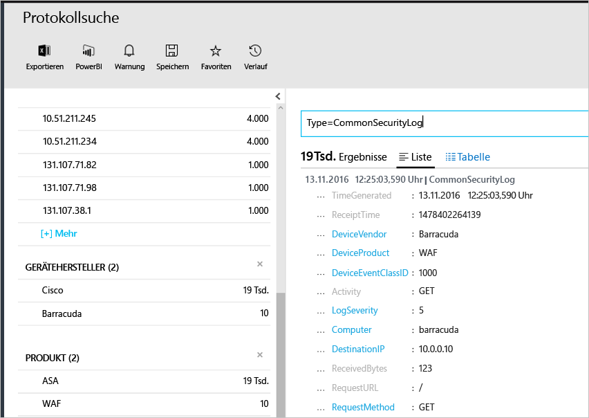

# <a name="connecting-your-security-products-to-the-operations-management-suite-oms-security-and-audit-solution"></a>Verbinden Ihrer Sicherheitsprodukte mit der Sicherheits- und Überwachungslösung der Operations Management Suite (OMS) 
Dieses Dokument enthält Informationen zum Verbinden Ihrer Sicherheitsprodukte mit der Sicherheits- und Überwachungslösung der OMS. Die folgenden Quellen werden unterstützt:

- CEF-Ereignisse (Common Event Format)
- Cisco ASA-Ereignisse


## <a name="what-is-cef"></a>Was ist CEF?
Das Common Event Format (CEF) ist ein branchenübliches Standardformat, das in Verbindung mit Syslog-Nachrichten von vielen Sicherheitsanbietern verwendet wird, um die Interoperabilität von Ereignissen zwischen unterschiedlichen Plattformen zu ermöglichen. Die Sicherheits- und Überwachungslösung der OMS unterstützt die Datenerfassung per CEF, damit Sie für Ihre Sicherheitsprodukte eine Verbindung mit der OMS-Sicherheit herstellen können. 

Wenn Sie Ihre Datenquelle mit der OMS verbinden, können Sie die folgenden Funktionen nutzen, die Teil dieser Plattform sind:

- Suche und Korrelation
- Überwachung
- Warnung
- Threat Intelligence
- Relevante Probleme

## <a name="collection-of-security-solution-logs"></a>Sammlung mit Protokollen von Sicherheitslösungen

OMS-Sicherheit unterstützt die Sammlung von Protokollen per CEF für Syslogs und [Cisco ASA](https://blogs.technet.microsoft.com/msoms/2016/08/25/add-your-cisco-asa-logs-to-oms-security/)-Protokolle. In diesem Beispiel ist die Quelle (Computer, der die Protokolle generiert) ein Linux-Computer, auf dem der Daemon „syslog-ng“ ausgeführt wird, und das Ziel ist die OMS-Sicherheit. Zum Vorbereiten des Linux-Computers müssen Sie die folgenden Aufgaben durchführen:

- Laden Sie den OMS-Agent für Linux, Version 1.2.0-25 oder höher, herunter.
- Befolgen Sie die Anleitung im Abschnitt mit der **Schnellanleitung für die Installation** in [diesem Artikel](https://github.com/Microsoft/OMS-Agent-for-Linux/blob/master/docs/OMS-Agent-for-Linux.md#steps-to-install-the-oms-agent-for-linux), um den Agent zu installieren und in den Arbeitsbereich aufzunehmen.

Normalerweise wird der Agent auf einem anderen Computer als dem Computer installiert, auf dem die Protokolle generiert werden. Für die Weiterleitung der Protokolle an den Agent-Computer sind in der Regel die folgenden Schritte erforderlich:

- Konfigurieren Sie das protokollierende Produkt bzw. den Computer so, dass die erforderlichen Ereignisse an den Syslog-Daemon (rsyslog oder syslog-ng) auf dem Agent-Computer weitergeleitet werden.
- Aktivieren Sie den Syslog-Daemon auf dem Agent-Computer so, dass Nachrichten von einem Remotesystem empfangen werden.

Auf dem Agent-Computer müssen die Ereignisse vom Syslog-Daemon an den lokalen UDP-Port 25226 gesendet werden. Der Agent lauscht über diesen Port auf eingehende Ereignisse. Unten ist eine Beispielkonfiguration zum Senden aller Ereignisse aus dem lokalen System an den Agent angegeben (Sie können die Konfiguration an Ihre lokalen Einstellungen anpassen):

1. Öffnen Sie das Terminalfenster, und wechseln Sie zum Verzeichnis */etc/syslog-ng/*. 
2. Erstellen Sie die neue Datei *security-config-omsagent.conf*, und fügen Sie den folgenden Inhalt hinzu: OMS_facility = local4
    
    filter f_local4_oms { facility(local4); };

    destination security_oms { tcp("127.0.0.1" port(25226)); };

    log { source(src); filter(f_local4_oms); destination(security_oms); };
    
3. Laden Sie die Datei *security_events.conf* herunter, und fügen Sie sie auf dem OMS-Agent-Computer unter */etc/opt/microsoft/omsagent/conf/omsagent.d/* ein.
4. Geben Sie den unten angegebenen Befehl ein, um den Syslog-Daemon neu zu starten:  *Für syslog-ng:*
    
    ```
    sudo service rsyslog restart
    ```

    *Für rsyslog:*
    
    ```
    /etc/init.d/syslog-ng restart
    ```
5. Geben Sie diesen Befehl ein, um den OMS-Agent neu zu starten:

    *Für syslog-ng run:*
    
    ```
    sudo service omsagent restart
    ```

    *Für rsyslog:*
    
    ```
    systemctl restart omsagent
    ```
6. Geben Sie den folgenden Befehl ein, und prüfen Sie das Ergebnis, um sicherzustellen, dass im OMS-Agent-Protokoll keine Fehler enthalten sind:

    ``` 
    tail /var/opt/microsoft/omsagent/log/omsagent.log
    ```

## <a name="reviewing-collected-security-events"></a>Überprüfen der gesammelten Sicherheitsereignisse

Nachdem die Konfiguration abgeschlossen ist, beginnt die Erfassung des Sicherheitsereignisses durch die OMS-Sicherheit. Öffnen Sie zum Visualisieren dieser Ereignisse die Protokollsuche, geben Sie im Suchfeld den Befehl *Type=CommonSecurityLog* ein, und drücken Sie die EINGABETASTE. Im folgenden Beispiel wird das Ergebnis dieses Befehls veranschaulicht. Beachten Sie, dass die OMS-Sicherheit in diesem Fall bereits Sicherheitsprotokolle von mehreren Anbietern erfasst hat:
   


Sie können diese Suche für einen einzelnen Anbieter verfeinern. Geben Sie beispielsweise Folgendes ein, um Cisco-Onlineprotokolle zu visualisieren: *Type=CommonSecurityLog DeviceVendor=Cisco*. „CommonSecurityLog“ verfügt über vordefinierte Felder für alle CEF-Header, einschließlich der grundlegenden Erweiterungen, während alle anderen Erweiterungen (benutzerdefiniert oder nicht) in das Feld „AdditionalExtensions“ eingefügt werden. Sie können das Feature „Benutzerdefinierte Felder“ verwenden, um dedizierte Felder zu erhalten. 

### <a name="accessing-computers-missing-baseline-assessment"></a>Zugreifen auf Computer ohne Baselinebewertung
OMS unterstützt das Domänenmitglied-Baselineprofil unter Windows Server 2008 R2 bis zu Windows Server 2012 R2. Die Baseline für Windows Server 2016 ist noch nicht endgültig und wird hinzugefügt, sobald sie veröffentlicht wurde. Alle anderen Betriebssysteme, die mit der Baselinebewertung der Sicherheits- und Überwachungslösung von OMS untersucht werden, sind im Abschnitt **Computer mit fehlender Baselinebewertung** aufgeführt.

## <a name="see-also"></a>Siehe auch
In diesem Dokument wurde beschrieben, wie Sie Ihre CEF-Lösung mit OMS verbinden. Weitere Informationen zur Sicherheitslösung von OMS finden Sie in den folgenden Artikeln:

* [Operations Management Suite (OMS) – Übersicht](operations-management-suite-overview.md)
* [Überwachen von und Reagieren auf Sicherheitswarnungen in der Sicherheits- und Überwachungslösung von Operations Management Suite](oms-security-responding-alerts.md)
* [Überwachen von Ressourcen in der Sicherheits- und Überwachungslösung von Operations Management Suite](oms-security-monitoring-resources.md)


<!--HONumber=Dec16_HO1-->


