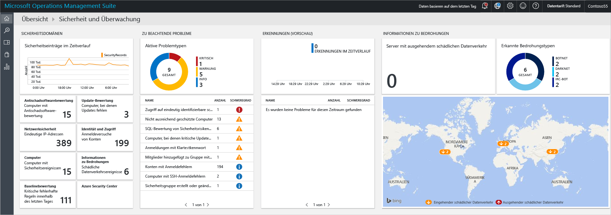
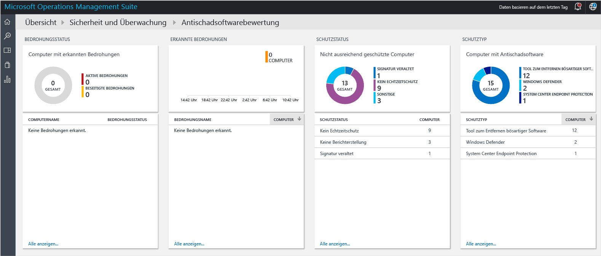
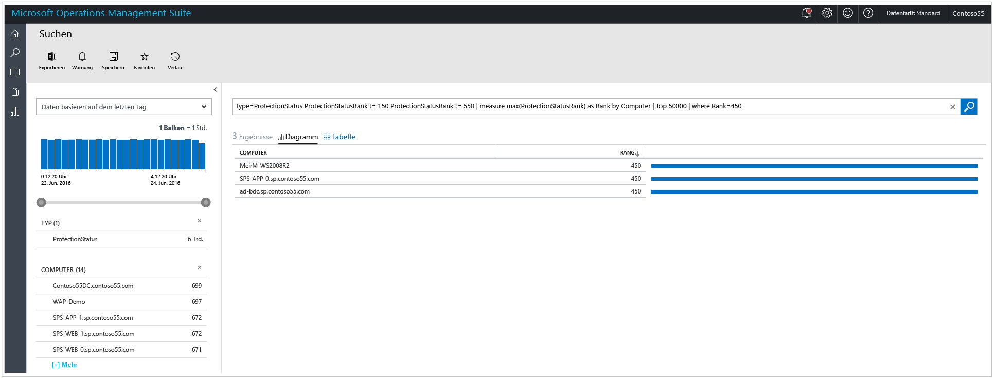
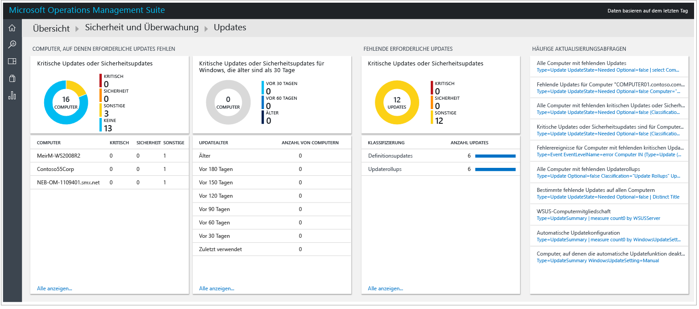
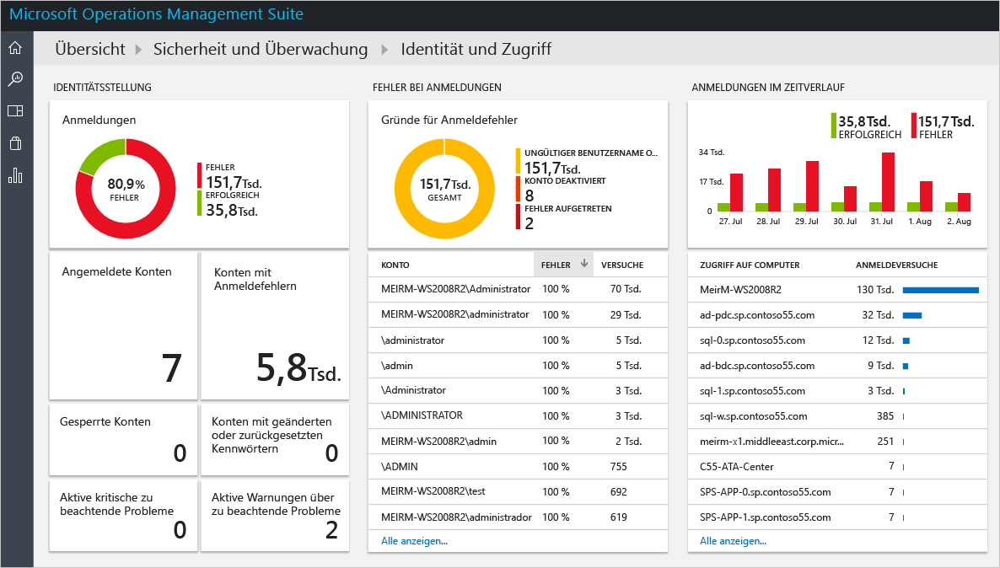
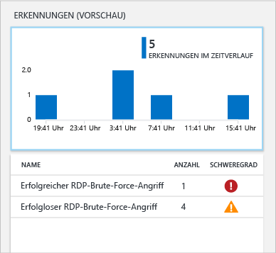
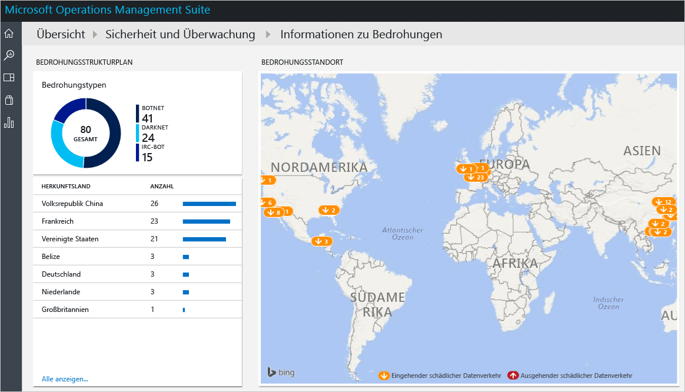

<properties
   pageTitle="Erste Schritte mit der Sicherheits- und Überwachungslösung von Operations Management Suite | Microsoft Azure"
   description="Dieses Dokument dient Ihnen als Hilfe bei den ersten Schritten mit den Funktionen der Sicherheits- und Überwachungslösung von Operations Management Suite zur Überwachung Ihrer Hybridcloud."
   services="operations-management-suite"
   documentationCenter="na"
   authors="YuriDio"
   manager="swadhwa"
   editor=""/>

<tags
   ms.service="operations-management-suite"
   ms.topic="get-started-article" 
   ms.devlang="na"
   ms.tgt_pltfrm="na"
   ms.workload="na"
   ms.date="09/20/2016"
   ms.author="yurid"/>
 

# Erste Schritte mit der Sicherheits- und Überwachungslösung von Operations Management Suite
Dieses Dokument dient Ihnen als Hilfe bei den ersten Schritten mit den Funktionen der Sicherheits- und Überwachungslösung von Operations Management Suite (OMS) und enthält eine Vorstellung aller Optionen.

## Was ist OMS?
Microsoft Operations Management Suite (OMS) ist die cloudbasierte IT-Verwaltungslösung von Microsoft, die Ihnen das Verwalten und Schützen Ihrer Infrastruktur lokal und in der Cloud erleichtert. Weitere Informationen zu OMS finden Sie im Artikel [Operations Management Suite](https://technet.microsoft.com/library/mt484091.aspx).

## OMS-Dashboard „Security and Audit“ (Sicherheit und Überwachung)

Die Sicherheits- und Überwachungslösung von OMS ermöglicht mit integrierten Suchabfragen für relevante Probleme, die Ihre Aufmerksamkeit erfordern, einen umfassenden Einblick in die Lage der IT-Sicherheit Ihres Unternehmens. Das Dashboard **Security and Audit** (Sicherheit und Überwachung) ist die Startseite für alle Aspekte, die sich in OMS auf die Sicherheit beziehen. Hier erhalten Sie einen allgemeinen Überblick über den Sicherheitszustand Ihres Computers. Darüber hinaus können Sie alle Ereignisse der letzten 24 Stunden, sieben Tage oder eines anderen benutzerdefinierten Zeitraums anzeigen. Führen Sie die unten angegebenen Schritte aus, um auf das Dashboard **Security and Audit** (Sicherheit und Überwachung) zuzugreifen:

1. Klicken Sie im Hauptdashboard von **Microsoft Operations Management Suite** links auf die Kachel **Einstellungen**.
2. Klicken Sie auf dem Blatt **Einstellungen** unter **Lösungen** auf die Option **Security and Audit** (Sicherheit und Überwachung).
3. Das Dashboard **Security and Audit** (Sicherheit und Überwachung) wird angezeigt:

    

Wenn Sie zum ersten Mal auf dieses Dashboard zugreifen und keine Geräte von OMS überwachen lassen, sind die Kacheln nicht mit vom Agent erfassten Daten gefüllt. Nach der Installation des Agents kann das Auffüllen einige Zeit dauern. Daher fehlen am Anfang unter Umständen einige Daten, weil sie noch in die Cloud hochgeladen werden.  Es ist also normal, wenn einige Kacheln noch keine aussagekräftigen Informationen enthalten. Weitere Informationen zur Installation des OMS-Agents in einem Windows-System finden Sie unter [Direktes Verbinden von Windows-Computern mit der OMS](https://technet.microsoft.com/library/mt484108.aspx). Weitere Informationen zur Durchführung dieser Aufgabe in einem Linux-System finden Sie unter [Verbinden von Linux-Computern mit OMS](https://technet.microsoft.com/library/mt622052.aspx).

> [AZURE.NOTE] Der Agent sammelt die Informationen basierend auf den aktuellen Ereignissen, die aktiviert sind, z.B. Computername, IP-Adresse und Benutzername. Es werden aber keine Dokumente/Dateien, Datenbanknamen oder privaten Daten erfasst.   

Lösungen sind Sammlungen von Logik-, Visualisierungs- und Datenerfassungsregeln für die wichtigsten Kundenherausforderungen. Die Sicherheits- und Überwachungslösung ist eine Lösung, und andere Lösungen können separat hinzugefügt werden. Weitere Informationen zum Hinzufügen einer neuen Lösung finden Sie unter [Hinzufügen von Lösungen](https://technet.microsoft.com/library/mt674635.aspx) .

Das OMS-Dashboard „Security and Audit“ (Sicherheit und Überwachung) ist in vier Hauptkategorien unterteilt:

- **Security Domains (Sicherheitsdomänen)** In diesem Bereich können Sie die Sicherheitsdatensätze in Abhängigkeit der Zeit näher untersuchen. Außerdem können Sie die Bereiche Bewertung von Schadsoftware, Updatebewertung, Netzwerksicherheit, Informationen zu Identität und Zugriff und Computer mit Sicherheitsereignissen nutzen und schnell auf das Azure Security Center-Dashboard zugreifen.
- **Notable Issues (Relevante Probleme)**: Mit dieser Option können Sie schnell identifizieren, wie viele aktive Probleme vorhanden sind und welchen Schweregrad sie jeweils haben.
- **Detections (Preview) (Erkennungen (Vorschau))**: Ermöglicht die Identifizierung von Angriffsmustern, indem Sicherheitswarnungen visualisiert werden, wenn sie für Ihre Ressourcen auftreten.
- **Threat Intelligence (Informationen zu Bedrohungen)**: Ermöglicht die Identifizierung von Angriffsmustern, indem die Gesamtzahl der Server mit ausgehendem schädlichem IP-Datenverkehr, der Bedrohungstyp und eine Karte mit den Ursprungsorten dieser IP-Adressen visualisiert werden. 
- **Common security queries (Allgemeine Sicherheitsabfragen)**: Diese Option liefert Ihnen eine Liste mit den häufigsten Sicherheitsabfragen, die Sie zum Überwachen der Umgebung verwenden können. Wenn Sie in eine dieser Abfragen klicken, wird das Blatt **Suche** mit den Ergebnissen der Abfrage geöffnet.

> [AZURE.NOTE] Weitere Informationen dazu, wie OMS Ihre Daten schützt, finden Sie unter „Schützen von Daten mit OMS“.

## Sicherheitsdomänen

Beim Überwachen von Ressourcen ist es wichtig, dass Sie den aktuellen Status der Umgebung schnell abrufen können. Es ist aber auch wichtig, dass Sie Ereignisse zurückverfolgen können, die in der Vergangenheit eingetreten sind. So können Sie ein besseres Verständnis dafür entwickeln, was zu einem bestimmten Zeitpunkt in der Umgebung passiert ist. 

> [AZURE.NOTE] Die Datenaufbewahrung wird gemäß OMS-Tarif durchgeführt. Weitere Informationen finden Sie auf der Seite mit den Preisen von [Microsoft Operations Management Suite](https://www.microsoft.com/server-cloud/operations-management-suite/pricing.aspx) .

Szenarien, bei denen es um Reaktionen auf Vorfälle und forensische Untersuchungen geht, profitieren direkt von den Ergebnissen, die auf der Kachel **Security Records over Time** (Sicherheitsdatensätze nach Zeit) verfügbar sind.

Wenn Sie auf diese Kachel klicken, wird das Blatt **Suche** mit einem Abfrageergebnis für **Sicherheitsereignisse** (Type=SecurityEvents) und Daten der letzten sieben Tage geöffnet. Dies ist hier dargestellt:

Das Suchergebnis ist in zwei Bereiche unterteilt: Links sehen Sie eine Übersicht über die Anzahl von gefundenen Sicherheitsereignissen, die Computer, auf denen diese Ereignisse gefunden wurden, die Anzahl von Konten auf diesen Computern und die Arten der Aktivitäten. Rechts sind die Gesamtergebnisse und eine Chronologie der Sicherheitsereignisse mit dem Namen des Computers und der Ereignisaktivität angegeben. Sie können auch auf **Show more** (Mehr anzeigen) klicken, um weitere Details zum Ereignis anzuzeigen, z.B. Ereignisdaten, die Ereignis-ID und die Ereignisquelle.

> [AZURE.NOTE] Weitere Informationen zur OMS-Suchabfrage finden Sie unter [Referenz für die OMS-Suche](https://technet.microsoft.com/library/mt450427.aspx).

### Antischadsoftwarebewertung

Mit dieser Option können Sie Computer mit unzureichendem Schutz und Computer, die mit Schadsoftware kompromittiert wurden, schnell identifizieren. Der Status der Bewertung von Schadsoftware und erkannte Bedrohungen auf den überwachten Servern werden gelesen. Anschließend werden die Daten zur Verarbeitung an den OMS-Dienst in der Cloud gesendet. Server mit erkannten Bedrohungen und Server mit unzureichendem Schutz werden im Dashboard für die Bewertung von Schadsoftware angezeigt. Sie können darauf zugreifen, wenn Sie auf die Kachel **Antischadsoftwarebewertung** klicken. 

Wie bei anderen Live-Kacheln auch, die im OMS-Dashboard verfügbar sind, gilt Folgendes: Wenn Sie darauf klicken, wird das Blatt **Suche** mit dem Abfrageergebnis geöffnet. Wenn Sie unter **Schutzstatus** auf die Option **Keine Berichterstattung** klicken, wird bei dieser Option das Abfrageergebnis mit diesem einzelnen Eintrag angezeigt, der den Namen des Computers und die Rangfolgeneinstufung enthält. Dies ist hier dargestellt:

> [AZURE.NOTE] *Rang* ist eine Einstufung, mit der der Schutzstatus (Ein, Aus, Aktualisiert usw.) und gefundene Bedrohungen widergespiegelt werden. Das Vorhandensein dieser Zahl vereinfacht die Erstellung von Aggregationen.

Wenn Sie auf den Namen des Computers klicken, wird die chronologische Übersicht des Schutzstatus für den Computer angezeigt. Dies ist sehr nützlich für Szenarien, bei denen Sie ermitteln müssen, ob die Antischadsoftware installiert war und zu einem bestimmten Zeitpunkt entfernt wurde.   

### Updatebewertung 

Mit dieser Option können Sie schnell ermitteln, wie hoch die allgemeine Gefährdung durch potenzielle Sicherheitsprobleme ist und wie wichtig diese Updates für Ihre Umgebung sind. Die Sicherheits- und Überwachungslösung von OMS ermöglicht nur die Visualisierung von Updates. Die echten Daten stammen von der [Lösung „System Updates“](https://technet.microsoft.com/library/mt484096.aspx), wobei es sich um ein anderes Modul von OMS handelt. Hier ist ein Beispiel für die Updates angegeben:

> [AZURE.NOTE] Weitere Informationen zur Updates-Lösung finden Sie unter [Aktualisieren von Servern mit der Lösung „System Updates“](https://technet.microsoft.com/library/mt484096.aspx).

### Identität und Zugriff

Die Identität sollte die Kontrollebene für Ihr Unternehmen darstellen, und der Schutz der Identität sollte höchste Priorität haben. In der Vergangenheit haben Unternehmen über Grenzen verfügt, bei denen es sich quasi um eine der „Hauptverteidigungslinien“ gehandelt hat. Da heutzutage immer mehr Daten und Apps in die Cloud verlagert werden, ist die Identität zur neuen Grenze geworden. 

> [AZURE.NOTE] Derzeit basieren die Daten nur auf Sicherheitsereignis-Anmeldedaten (Ereignis-ID 4624). In Zukunft sollen auch Office 365-Anmeldungen und Azure AD-Daten einbezogen werden.

Indem Sie Ihre Identitätsaktivitäten überwachen, können Sie proaktive Aktionen durchführen, bevor es zu einem Vorfall kommt, bzw. reaktive Aktionen, um einen Angriffsversuch zu stoppen. Das Dashboard **Identität und Zugriff** enthält eine Übersicht über den Identitätszustand, z.B. die Anzahl von fehlgeschlagenen Anmeldeversuchen, das bei den Versuchen verwendete Benutzerkonto, gesperrte Konten, Konten mit geänderten oder zurückgesetzten Kennwörtern und die Anzahl von derzeit angemeldeten Konten. 

Wenn Sie auf die Kachel **Identität und Zugriff** klicken, wird das folgende Dashboard angezeigt:

Die in diesem Dashboard verfügbaren Informationen dienen Ihnen als direkte Hilfe beim Identifizieren einer potenziellen verdächtigen Aktivität. Es sind beispielsweise 338 versuchte Anmeldungen als **Administrator** mit einer Fehlschlagquote von 100% angegeben. Die Ursache hierfür kann ein Brute-Force-Angriff auf das Konto sein. Wenn Sie auf dieses Konto klicken, erhalten Sie weitere Informationen, die bei der Ermittlung der Zielressource für diesen potenziellen Angriff hilfreich sind:

Der ausführliche Bericht enthält wichtige Informationen zu diesem Ereignis: den Zielcomputer, die Art der Anmeldung (in diesem Fall die Netzwerkanmeldung), die Aktivität (in diesem Fall Ereignis 4625) und eine umfassende Zeitachse zu jedem Versuch. 

### Computer

Sie können diese Kachel verwenden, um auf alle Computer zuzugreifen, die aktiv über Sicherheitsereignisse verfügen. Wenn Sie auf diese Kachel klicken, wird eine Liste der Computer mit Sicherheitsereignissen und der Anzahl von Ereignissen auf jedem Computer angezeigt:

Sie können die Untersuchung fortsetzen, indem Sie auf die einzelnen Computer klicken und sich die angegebenen Sicherheitsereignisse ansehen.

### Azure Security Center

Diese Kachel ist eigentlich eine Verknüpfung für den Zugriff auf das Azure Security Center-Dashboard. Weitere Informationen zu dieser Lösung finden Sie unter [Erste Schritte mit Azure Security Center](../security-center/security-center-get-started.md) .

## Relevante Probleme

Der Hauptzweck dieser Gruppe von Optionen besteht darin, eine schnelle Übersicht über die Probleme zu ermöglichen, die in der Umgebung vorliegen. Hierzu wird eine Kategorisierung in „Kritisch“, „Warnung“ und „Information“ vorgenommen. Die Kachel „Active issue types“ (Aktive Problemtypen) bietet eine Visualisierung dieser Probleme, aber Sie können hier keine weiteren Details anzeigen. Hierfür können Sie den unteren Teil dieser Kachel verwenden, in dem der Name des Problems (NAME), die Anzahl der betroffenen Objekte (COUNT) und der Schweregrad (SEVERITY) angegeben sind.

Sie sehen, dass diese Probleme bereits in unterschiedlichen Bereichen der Gruppe **Security Domains** (Sicherheitsdomänen) behandelt wurden. Dies verdeutlicht noch einmal die Absicht dieser Ansicht: Visualisieren der wichtigsten Probleme in der Umgebung an einem zentralen Ort.

## Detections (Preview) (Erkennungen (Vorschau))

Der Hauptzweck dieser Option besteht darin, dass die Mitarbeiter der IT-Abteilung potenzielle Bedrohungen der Umgebung und den Schweregrad der Bedrohung schnell identifizieren können.

Diese Option kann auch bei der Untersuchung im Rahmen einer Reaktion auf Vorfälle verwendet werden, um die Bewertung durchzuführen und weitere Informationen zum Angriff zu erhalten.

> [AZURE.NOTE] Weitere Informationen zur Verwendung von OMS für die Reaktion auf Vorfälle enthält das Video [How to Leverage the Azure Security Center & Microsoft Operations Management Suite for an Incident Response](https://channel9.msdn.com/Blogs/Taste-of-Premier/ToP1703) (Verwenden von Azure Security Center und Microsoft Operations Management Suite für die Reaktion auf Vorfälle).

## Threat Intelligence

Im neuen Abschnitt „Threat Intelligence“ der Sicherheits- und Überwachungslösung werden die möglichen Angriffsmuster auf mehrere Arten visualisiert: die Gesamtzahl der Server mit ausgehendem schädlichem IP-Datenverkehr, der Bedrohungstyp und eine Karte mit den Ursprungsorten dieser IP-Adressen. Sie können mit der Karte interagieren und auf die IP-Adressen klicken, um weitere Informationen zu erhalten.

Gelbe Nadeln auf der Karte zeigen den eingehenden Datenverkehr von schädlichen IP-Adressen an. Es ist nicht ungewöhnlich, dass für über das Internet zugängliche Server eingehender schädlicher Datenverkehr anfällt. Wir empfehlen Ihnen aber, sich diese Anmeldeversuche trotzdem anzusehen, um sicherzustellen, dass keiner der Versuche erfolgreich war. Diese Indikatoren basieren auf IIS-Protokollen, WireData und Protokollen der Windows-Firewall.  

## Common security queries (Allgemeine Sicherheitsabfragen)

Die Liste mit den verfügbaren allgemeinen Sicherheitsabfragen kann hilfreich für Sie sein, um schnell auf die Informationen zu Ressourcen zuzugreifen und sie gemäß den Anforderungen Ihrer Umgebung anzupassen. Diese allgemeinen Abfragen lauten:

- Alle Sicherheitsaktivitäten
- Sicherheitsaktivitäten auf dem Computer „computer01.contoso.com“ (durch den Namen des eigenen Computers ersetzen)
- Sicherheitsaktivitäten auf dem Computer „computer01.contoso.com“ für Konto „Administrator“ (durch den Namen des eigenen Computers bzw. Kontos ersetzen)
- Anmeldeaktivität nach Computer
- Konten, für die Microsoft Antimalware auf einem Computer beendet wurde
- Computer, auf denen der Microsoft Antimalware-Prozess beendet wurde
- Computer, auf denen „hash.exe“ ausgeführt wurde (durch anderen Prozessnamen ersetzen)
- Namen aller Prozesse, die ausgeführt wurden
- Anmeldeaktivität nach Konto
- Konten mit Remoteanmeldung auf dem Computer „computer01.contoso.com“ (durch den Namen des eigenen Computers ersetzen)

## Weitere Informationen

In diesem Dokument wurde die Sicherheits- und Überwachungslösung von OMS vorgestellt. Weitere Informationen zur Sicherheitslösung von OMS finden Sie in den folgenden Artikeln:

- [Operations Management Suite (OMS) – Übersicht](operations-management-suite-overview.md)
- [Überwachen von und Reagieren auf Sicherheitswarnungen in der Sicherheits- und Überwachungslösung von Operations Management Suite](oms-security-responding-alerts.md)
- [Überwachen von Ressourcen in der Sicherheits- und Überwachungslösung von Operations Management Suite](oms-security-monitoring-resources.md)

<!--HONumber=Oct16_HO2-->

