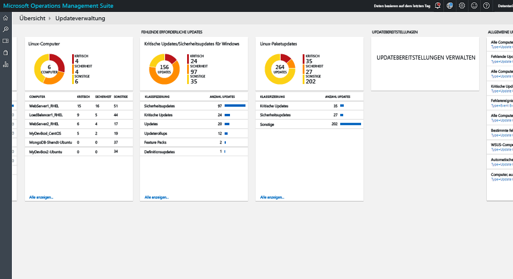
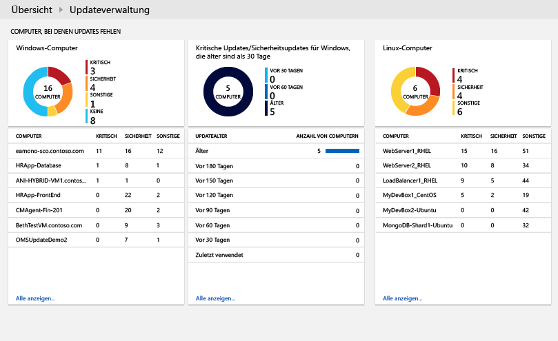
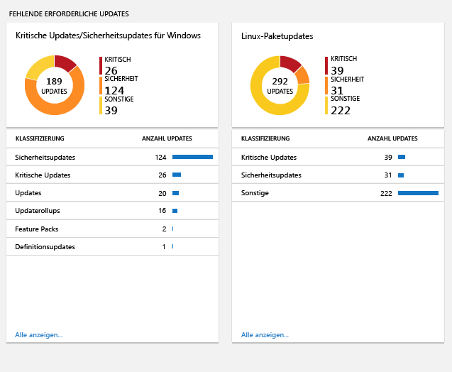
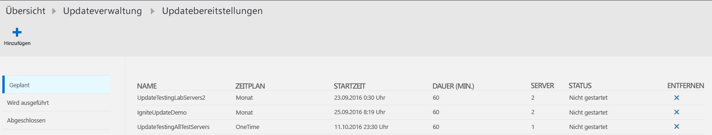
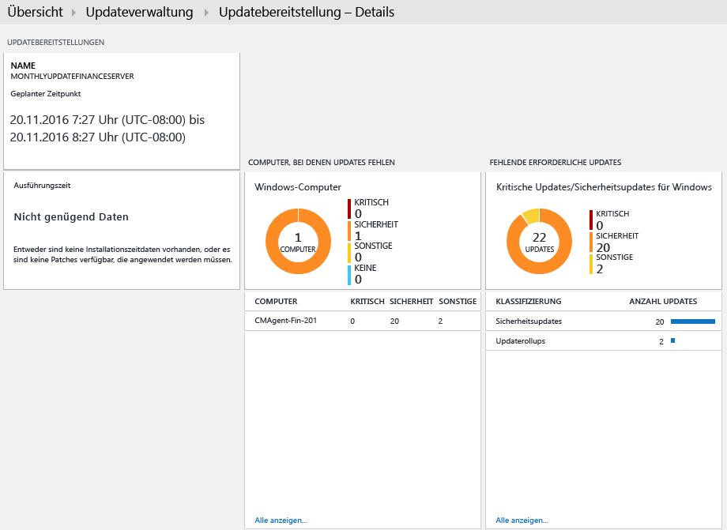
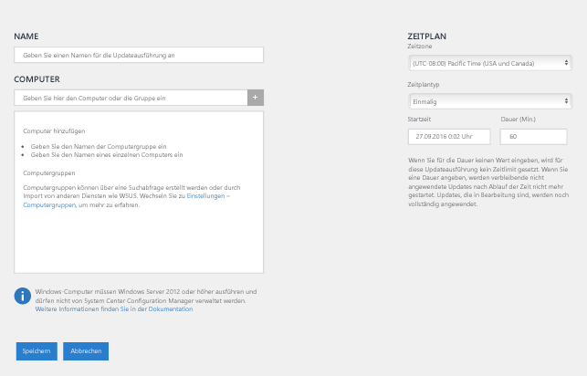
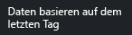
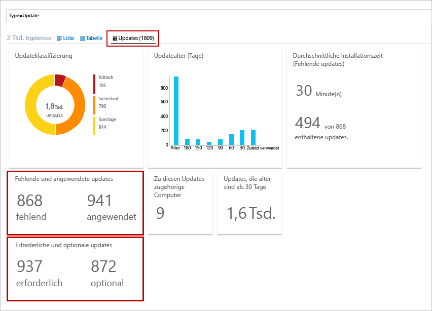
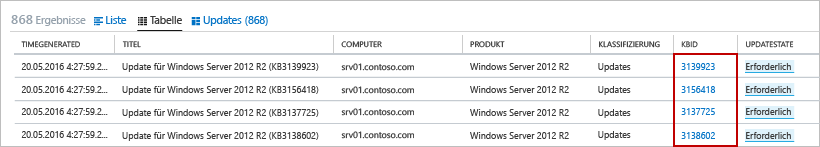
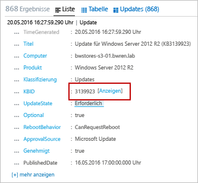

<properties
    pageTitle="Lösung für die Updateverwaltung in OMS | Microsoft Azure"
    description="In diesem Artikel soll vermittelt werden, wie Sie diese Lösung zum Verwalten von Updates für Ihre Windows- und Linux-Computer verwenden."
    services="operations-management-suite"
    documentationCenter=""
    authors="MGoedtel"
    manager="jwhit"
    editor=""
    />
<tags
    ms.service="operations-management-suite"
    ms.workload="tbd"
    ms.tgt_pltfrm="na"
    ms.devlang="na"
    ms.topic="get-started-article"
    ms.date="09/28/2016"
    ms.author="magoedte"/>

#  Lösung für die Updateverwaltung in OMS

Mit der Lösung für die Updateverwaltung in OMS können Sie Updates für Ihre Windows- und Linux-Computer verwalten.  Sie können den Status der verfügbaren Updates auf allen Agent-Computern schnell bewerten und den Installationsvorgang initiieren, der für die Serverupdates erforderlich ist. 

## Voraussetzungen

-   Windows-Agents müssen entweder für die Kommunikation mit einem WSUS-Server (Windows Server Update Services) konfiguriert sein oder über Zugriff auf Microsoft-Update verfügen.  

    >[AZURE.NOTE] Der Windows-Agent kann nicht gleichzeitig mit System Center Configuration Manager verwaltet werden.  
  
-   Für Linux-Agents muss Zugriff auf ein Updaterepository bestehen.  Der OMS-Agent für Linux kann von [GitHub](https://github.com/microsoft/oms-agent-for-linux) heruntergeladen werden. 

## Konfiguration

Führen Sie die folgenden Schritte aus, um die Lösung für die Updateverwaltung dem OMS-Arbeitsbereich und Linux-Agents hinzuzufügen.  Windows-Agents werden automatisch ohne weitere Konfiguration hinzugefügt.

1.  Fügen Sie mithilfe des unter [Hinzufügen von Log Analytics-Lösungen aus dem Lösungskatalog](../log-analytics/log-analytics-add-solutions.md) beschriebenen Verfahrens Ihrem OMS-Arbeitsbereich die Lösung für die Updateverwaltung hinzu.  
2.  Wählen Sie im OMS-Portal die Option **Einstellungen** und dann **Verbundene Quellen**.  Notieren Sie sich die **Arbeitsbereich-ID** und den **Primären Schlüssel** oder **Sekundären Schlüssel**.
3.  Führen Sie die folgenden Schritte für jeden Linux-Computer aus.

    a.  Installieren Sie die aktuelle Version des OMS-Agents für Linux, indem Sie die folgenden Befehle ausführen.  Ersetzen Sie <Workspace ID> durch die Arbeitsbereich-ID und <Key> durch den primären bzw. sekundären Schlüssel.

        cd ~
        wget https://github.com/Microsoft/OMS-Agent-for-Linux/releases/download/v1.2.0-75/omsagent-1.2.0-75.universal.x64.sh
        sudo bash omsagent-1.2.0-75.universal.x64.sh --upgrade -w <Workspace ID> -s <Key>

     b. Führen Sie den folgenden Befehl aus, um den Agent zu entfernen.

        sudo bash omsagent-1.2.0-75.universal.x64.sh --purge

## Management Packs

Wenn Ihre System Center Operations Manager-Verwaltungsgruppe mit Ihrem OMS-Arbeitsbereich verbunden ist, werden beim Hinzufügen dieser Lösung die folgenden Management Packs in Operations Manager installiert. Für diese Management Packs ist keine Konfiguration oder Wartung erforderlich. 

-   Microsoft System Center Advisor Update Assessment Intelligence Pack (Microsoft.IntelligencePacks.UpdateAssessment)
-   Microsoft.IntelligencePack.UpdateAssessment.Configuration (Microsoft.IntelligencePack.UpdateAssessment.Configuration)
-   Update Deployment MP

Weitere Informationen zur Aktualisierung von Management Packs finden Sie unter [Herstellen einer Verbindung zwischen Operations Manager und Log Analytics](../log-analytics/log-analytics-om-agents.md).

## Datensammlung

### Unterstützte Agents

In der folgenden Tabelle sind die verbundenen Quellen beschrieben, die von der Lösung unterstützt werden.

Verbundene Quelle | Unterstützt | Beschreibung|
----------|----------|----------|
Windows-Agents | Ja | Die Lösung sammelt Informationen zu Systemupdates aus Windows-Agents und initiiert die Installation von erforderlichen Updates.|
Linux-Agents | Ja | Die Lösung sammelt Informationen zu Systemupdates von Linux-Agents.|
Operations Manager-Verwaltungsgruppe | Ja | Die Lösung sammelt Informationen zu Systemupdates von Agents in einer verbundenen Verwaltungsgruppe. Es ist keine direkte Verbindung von Operations Manager mit Log Analytics erforderlich. Daten werden von der Verwaltungsgruppe an das OMS-Repository weitergeleitet.|
Azure-Speicherkonto | Nein | Azure-Speicher enthält keine Informationen zu Systemupdates.|  

### Sammlungshäufigkeit

Für jeden verwalteten Windows-Computer wird zweimal pro Tag ein Scanvorgang durchgeführt.  Wenn ein Update installiert wurde, werden die zugehörigen Informationen innerhalb von 15 Minuten aktualisiert.  

Für jeden verwalteten Linux-Computer wird alle drei Stunden ein Scanvorgang durchgeführt.  

## Verwenden der Lösung

Wenn Sie dem OMS-Arbeitsbereich die Lösung für die Updateverwaltung hinzufügen, wird Ihrem OMS-Dashboard die Kachel **Update Management** (Updateverwaltung) hinzugefügt. Auf dieser Kachel werden ein Zahlenwert und eine grafische Darstellung der Anzahl von Computern in Ihrer Umgebung angezeigt, für die derzeit Systemupdates erforderlich sind.  
  

## Anzeigen von Updatebewertungen

Klicken Sie auf die Kachel **Updateverwaltung**, um das Dashboard **Update Management** (Updateverwaltung) zu öffnen. Das Dashboard enthält die Spalten, die in der folgenden Tabelle angegeben sind. In jeder Spalte sind bis zu zehn Einträge enthalten, die die Spaltenkriterien für den angegebenen Bereich und Zeitraum erfüllen. Sie können eine Protokollsuche durchführen, mit der alle Einträge zurückgegeben werden, indem Sie unten in der Spalte auf **Alle anzeigen** oder auf die Spaltenüberschrift klicken.

Spalte | Beschreibung|
----------|----------|
**Computer mit fehlenden Updates** ||
Kritische Updates oder Sicherheitsupdates | Hier werden die wichtigsten zehn Computer aufgeführt, auf denen Updates fehlen, sortiert nach der Anzahl von fehlenden Updates. Klicken Sie auf einen Computernamen, um eine Protokollsuche durchzuführen, bei der alle Updatedatensätze für den jeweiligen Computer zurückgegeben werden.|
Kritische Updates oder Sicherheitsupdates älter als 30 Tage| Identifiziert die Anzahl von Computern, auf denen kritische Updates oder Sicherheitsupdates fehlen, gruppiert nach dem Zeitraum seit der Veröffentlichung des Updates. Klicken Sie auf einen der Einträge, um eine Protokollsuche durchzuführen, bei der alle fehlenden und kritischen Updates zurückgegeben werden.|
**Erforderliche fehlende Updates**||
Kritische Updates oder Sicherheitsupdates | Listet die Klassifizierungen von Updates auf, die auf Computern fehlen, sortiert nach der Anzahl von Computern, für die in der Kategorie Updates fehlen. Klicken Sie auf eine Klassifizierung, um eine Protokollsuche durchzuführen, bei der alle Updatedatensätze für die Klassifizierung zurückgegeben werden.|
**Updatebereitstellungen**||
Updatebereitstellungen | Gibt die Anzahl von derzeit geplanten Updatebereitstellungen und die Dauer bis zur nächsten geplanten Ausführung an.  Klicken Sie auf die Kachel, um Zeitpläne, aktuell ausgeführte Updates und abgeschlossene Updates anzuzeigen oder um eine neue Bereitstellung zu planen.|  
   
   
 
   
 
   

## Installieren von Updates

Nachdem die Updates für alle Computer der Umgebung bewertet wurden, erreichen Sie die Installation der erforderlichen Updates, indem Sie eine *Updatebereitstellung* erstellen.  Eine Updatebereitstellung ist eine geplante Installation von erforderlichen Updates für mindestens einen Windows-Computer.  Sie geben das Datum und die Uhrzeit für die Bereitstellung und einen Computer bzw. eine Gruppe von Computern an, die einbezogen werden sollen.  

Updates werden mit Runbooks in Azure Automation installiert.  Sie können diese Runbooks derzeit nicht anzeigen, und für die Runbooks ist keine Konfiguration erforderlich.  Bei der Erstellung einer Updatebereitstellung wird ein Zeitplan erstellt, nach dem für die einbezogenen Computer zur angegebenen Zeit ein Masterrunbook für das Update gestartet wird.  Über dieses Masterrunbook wird ein untergeordnetes Runbook auf jedem Windows-Agent gestartet, mit dem die Installation von erforderlichen Updates durchgeführt wird.  

### Anzeigen von Updatebereitstellungen

Klicken Sie auf die Kachel **Bereitstellung aktualisieren**, um die Liste mit den vorhandenen Updatebereitstellungen anzuzeigen.  Sie sind nach dem Status gruppiert: **Geplant**, **Wird ausgeführt** und **Abgeschlossen**.      

Die Eigenschaften, die für die Updatebereitstellung angezeigt werden, sind in der folgenden Tabelle beschrieben.

Eigenschaft | Beschreibung|
----------|----------|
Name | Name der Updatebereitstellung|
Zeitplan | Typ des Zeitplans  *OneTime* ist derzeit der einzige mögliche Wert.|
Startzeit|Datum und Uhrzeit des Starts der Updatebereitstellung|
Dauer | Zulässige Ausführungsdauer der Updatebereitstellung in Minuten.  Wenn innerhalb dieses Zeitraums nicht alle Updates installiert werden, muss für die verbleibenden Updates bis zur nächsten Updatebereitstellung gewartet werden.|
Server | Anzahl von Computern, die von der Updatebereitstellung betroffen sind|
Status | Aktueller Status der Updatebereitstellung  Mögliche Werte: - Nicht gestartet - Wird ausgeführt - Abgeschlossen|  

Klicken Sie auf eine Updatebereitstellung, um den Detailbildschirm anzuzeigen, der die Spalten in der folgenden Tabelle enthält.  Diese Spalten werden nicht aufgefüllt, wenn die Updatebereitstellung noch nicht gestartet wurde. 

Spalte | Beschreibung|
----------|----------|
**Computerergebnisse**||
Erfolgreich abgeschlossen | Listet die Anzahl von Computern der Updatebereitstellung nach Status auf.  Klicken Sie auf einen Status, um eine Protokollsuche auszuführen, bei der alle Updatedatensätze mit diesem Status für die Updatebereitstellung zurückgegeben werden.|
Installationsstatus des Computers| Listet die Computer auf, die an der Updatebereitstellung beteiligt sind, und den Prozentsatz der Updates, die erfolgreich installiert wurden. Klicken Sie auf einen der Einträge, um eine Protokollsuche durchzuführen, bei der alle fehlenden und kritischen Updates zurückgegeben werden.|
**Ergebnisse der Instanzaktualisierung**||
Installationsstatus der Instanz | Listet die Klassifizierungen von Updates auf, die auf Computern fehlen, sortiert nach der Anzahl von Computern, für die in der Kategorie Updates fehlen. Klicken Sie auf einen Computer, um eine Protokollsuche durchzuführen, bei der alle Updatedatensätze für den jeweiligen Computer zurückgegeben werden.|  
   

### Erstellen einer Updatebereitstellung

Erstellen Sie eine neue Updatebereitstellung, indem Sie oben auf dem Bildschirm auf die Schaltfläche **Hinzufügen** klicken, um die Seite **New Update Deployment** (Neue Updatebereitstellung) zu öffnen.  Sie müssen Werte für die Eigenschaften in der folgenden Tabelle angeben.

Eigenschaft | Beschreibung|
----------|----------|
Name | Eindeutiger Name zum Identifizieren der Updatebereitstellung|
Zeitzone | Zeitzone für die Startzeit|
Startzeit | Datum und Uhrzeit für den Start der Updatebereitstellung|
Dauer | Zulässige Ausführungsdauer der Updatebereitstellung in Minuten.  Wenn innerhalb dieses Zeitraums nicht alle Updates installiert werden, muss für die verbleibenden Updates bis zur nächsten Updatebereitstellung gewartet werden.|
Computer | Namen von Computern oder Computergruppen, die in die Updatebereitstellung einbezogen werden sollen.  Wählen Sie in der Dropdownliste mindestens einen Eintrag aus.|
   

### Zeitbereich

Standardmäßig umfasst der Bereich der Daten, die mit der Lösung für die Updateverwaltung analysiert werden, alle verbundenen Verwaltungsgruppen, die innerhalb des letzten Tags generiert wurden. 

Um den Zeitraum der Daten zu ändern, wählen Sie oben im Dashboard die Option **Data based on** (Daten basierend auf). Sie können Einträge auswählen, die innerhalb der letzten sieben Tage, eines Tages oder der letzten sechs Stunden erstellt oder aktualisiert wurden. Außerdem können Sie **Benutzerdefiniert** auswählen und einen benutzerdefinierten Datumsbereich angeben.     

## Log Analytics-Datensätze

Mit der Lösung für die Updateverwaltung werden zwei Arten von Datensätzen im OMS-Repository erstellt.

### Updatedatensätze

Ein Datensatz vom Typ **Update** wird für jedes Update erstellt, dass auf jedem Computer entweder installiert ist oder benötigt wird. Die Eigenschaften der Updatedatensätze sind in der folgenden Tabelle aufgeführt.

Eigenschaft | Beschreibung|
----------|----------|
Typ | *Update*|
SourceSystem | Die Quelle, von der die Installation des Updates genehmigt wurde. Mögliche Werte: - Microsoft Update - Windows Update - SCCM - Linux-Server (von Paket-Managern)|
Genehmigt | Gibt an, ob die Installation des Updates genehmigt wurde.  Für Linux-Server ist dies derzeit optional, da das Patchen nicht über OMS verwaltet wird.|
Klassifizierung für Windows | Klassifizierung des Updates Mögliche Werte: - Anwendungen - Kritische Updates - Definitionsupdate - Feature Packs - Sicherheitsupdates - Service Packs - Updaterollups - Updates|
Klassifizierung für Linux | Klassifizierung des Updates Mögliche Werte: - Kritische Updates - Sicherheitsupdates - Andere Updates|
Computer | Name des Computers|
InstallTimeAvailable | Gibt an, ob die Installationsdauer über andere Agents verfügbar ist, für die das gleiche Update installiert wurde.|
InstallTimePredictionSeconds | Geschätzte Installationsdauer in Sekunden, basierend auf anderen Agents, für die das gleiche Update installiert wurde.|
KBID | ID des KB-Artikels, in dem das Update beschrieben wird.|
ManagementGroupName | Bei SCOM-Agents: Der Name der Verwaltungsgruppe.  Bei anderen Agents lautet diese „AOI-<workspace ID>“.|
MSRCBulletinID | ID des Microsoft-Sicherheitsbulletins, in dem das Update beschrieben wird.|
MSRCSeverity | Schweregrad des Microsoft-Sicherheitsbulletins Mögliche Werte: - Kritisch - Wichtig - Mittel|
Optional | Gibt an, ob das Update optional ist.|
Produkt | Name des Produkts, zu dem das Update gehört.  Klicken Sie auf die Schaltfläche zum **Anzeigen**, um den Artikel im Browser zu öffnen.|
PackageSeverity | Schweregrad des Sicherheitsrisikos, das mit diesem Update behoben wird, wie von den Anbietern der Linux-Distribution gemeldet. | 
PublishDate | Datum und Uhrzeit der Installation des Updates|
RebootBehavior | Gibt an, ob beim Updatevorgang ein Neustart erzwungen wird. Mögliche Werte: - canrequestreboot - neverreboots|
RevisionNumber | Revisionsnummer des Updates|
SourceComputerId | GUID zur eindeutigen Identifizierung des Computers|
TimeGenerated | Datum und Uhrzeit der letzten Aktualisierung des Datensatzes|
Titel | Titel des Updates|
UpdateID | GUID zur eindeutigen Identifizierung des Updates|
UpdateState | Gibt an, ob das Update auf diesem Computer installiert ist. Mögliche Werte: - Installiert: Das Update ist auf diesem Computer installiert. - Erforderlich: Das Update ist nicht installiert und wird auf diesem Computer benötigt.|  

 
Wenn Sie eine Protokollsuche durchführen, bei der Datensätze mit dem Typ **Update** zurückgegeben werden, können Sie die Ansicht **Updates** wählen. Darin werden mehrere Kacheln angezeigt, auf denen die von der Suche zurückgegebenen Updates zusammengefasst sind. Sie können auf die Einträge der Kacheln **Fehlende und angewendete Updates** und **Erforderliche und optionale Updates** klicken, um die Ansicht auf die jeweiligen Updates zu begrenzen. Wählen Sie die Ansicht **Liste** oder **Tabelle**, um die einzelnen Datensätze zurückzugeben.  

  

In der Ansicht **Tabelle** können Sie für einen Datensatz jeweils auf die **KBID** klicken, um den KB-Artikel im Browser zu öffnen. So können Sie die Details des jeweiligen Updates schnell anzeigen und lesen.  

Klicken Sie in der Ansicht **Liste** auf den Link **Ansicht** neben der KBID, um den KB-Artikel zu öffnen. 

###UpdateSummary-Datensätze

Ein Datensatz vom Typ **UpdateSummary** wird für jeden Windows-Agent-Computer erstellt. Dieser Datensatz wird jedes Mal aktualisiert, wenn der Computer auf erforderliche Updates untersucht wird. Die Eigenschaften der **UpdateSummary**-Datensätze sind in der folgenden Tabelle aufgeführt.

Eigenschaft | Beschreibung|
----------|----------|
Typ | UpdateSummary|
SourceSystem | OpsManager |
Computer | Name des Computers|
CriticalUpdatesMissing | Anzahl von wichtigen Updates, die auf dem Computer nicht vorhanden sind|
ManagementGroupName | Bei SCOM-Agents: Der Name der Verwaltungsgruppe. Bei anderen Agents lautet diese „AOI-<workspace ID>“.|
NETRuntimeVersion | Version der .NET-Laufzeit, die auf dem Computer installiert ist|
OldestMissingSecurityUpdateBucket | Bucket zum Kategorisieren des Zeitraums seit der Veröffentlichung des ältesten fehlenden Sicherheitsupdates auf diesem Computer Mögliche Werte: - Älter - Vor 180 Tagen - Vor 150 Tagen - Vor 120 Tagen - Vor 90 Tagen - Vor 60 Tagen - Vor 30 Tagen - Aktuell|
OldestMissingSecurityUpdateInDays | Anzahl von Tagen seit der Veröffentlichung des ältesten fehlenden Sicherheitsupdates auf diesem Computer|
OsVersion | Version des Betriebssystems, das auf dem Computer installiert ist|
OtherUpdatesMissing | Anzahl von anderen Updates, die auf dem Computer nicht vorhanden sind|
SecurityUpdatesMissing | Anzahl von Sicherheitsupdates, die auf dem Computer nicht vorhanden sind|
SourceComputerId | GUID zur eindeutigen Identifizierung des Computers|
TimeGenerated | Datum und Uhrzeit der letzten Aktualisierung des Datensatzes|
TotalUpdatesMissing |Gesamtzahl von Updates, die auf dem Computer nicht vorhanden sind|
WindowsUpdateAgentVersion | Versionsnummer des Windows Update-Agents auf dem Computer|
WindowsUpdateSetting | Einstellung für die Vorgehensweise des Computers beim Installieren wichtiger Updates Mögliche Werte: - Deaktiviert - Vor der Installation benachrichtigen - Geplante Installation|
WSUSServer | URL des WSUS-Servers, wenn der Computer für dessen Nutzung konfiguriert ist|  

## Beispiele für Protokollsuchen

Die folgende Tabelle enthält Beispiele für Protokollsuchen für Updatedatensätze, die mit dieser Lösung erfasst wurden. 

Abfrage | Beschreibung|
----------|----------|
Alle Computer, auf denen Updates fehlen | Type=Update UpdateState=Needed Optional=false &#124; select Computer,Title,KBID,Classification,UpdateSeverity,PublishedDate|
Fehlende Updates für Computer „COMPUTER01.contoso.com“ (durch eigenen Computernamen ersetzen) | Type=Update UpdateState=Needed Optional=false Computer="COMPUTER01.contoso.com" &#124; select Computer,Title,KBID,Product,UpdateSeverity,PublishedDate|
Alle Computer, auf denen kritische Updates oder Sicherheitsupdates fehlen | Type=Update UpdateState=Needed Optional=false (Classification="Security Updates" OR Classification="Critical Updates")|
Für Computer erforderliche kritische Updates oder Sicherheitsupdates, die manuell angewendet wurden | Type=Update UpdateState=Needed Optional=false (Classification="Security Updates" OR Classification="Critical Updates") Computer IN {Type=UpdateSummary WindowsUpdateSetting=Manual &#124; Distinct Computer} &#124; Distinct KBID|
Fehlerereignisse für Computer, auf denen erforderliche kritische oder Sicherheitsupdates fehlen | Type=Event EventLevelName=error Computer IN {Type=Update (Classification="Security Updates" OR Classification="Critical Updates") UpdateState=Needed Optional=false &#124; Distinct Computer}|
Alle Computer, auf denen Updaterollups fehlen | Type=Update Optional=false Classification="Update Rollups" UpdateState=Needed &#124; select Computer,Title,KBID,Classification,UpdateSeverity,PublishedDate|
Eindeutig identifizierbare fehlende Updates auf allen Computern | Type=Update UpdateState=Needed Optional=false &#124; Distinct Title|
WSUS-Computermitgliedschaft | Type=UpdateSummary &#124; measure count() by WSUSServer|
Konfiguration automatischer Updates | Type=UpdateSummary &#124; measure count() by WindowsUpdateSetting|
Computer, auf denen automatische Updates deaktiviert wurden | Type=UpdateSummary WindowsUpdateSetting=Manual|  
Liste mit allen Linux-Computern, für die ein Paketupdate verfügbar ist | Type=Update and OSType=Linux and UpdateState!="Not needed" &#124; measure count() by Computer|
Liste mit allen Linux-Computern, für die ein Paketupdate zur Behebung von kritischen oder sicherheitsrelevanten Sicherheitsrisiken verfügbar ist | Type=Update and OSType=Linux and UpdateState!="Not needed" and (Classification="Critical Updates" OR Classification="Security Updates") &#124; measure count() by Computer|
Liste mit allen Paketen, für die ein Update verfügbar ist | Type=Update and OSType=Linux and UpdateState!="Not needed"|
Liste mit allen Paketen, für die ein Update zur Behebung von kritischen oder sicherheitsrelevanten Sicherheitsrisiken verfügbar ist | Type=Update and OSType=Linux and UpdateState!="Not needed" and (Classification="Critical Updates" OR Classification="Security Updates")|
Liste mit allen „Ubuntu“-Computern mit verfügbaren Updates | Type=Update and OSType=Linux and OSName = Ubuntu &#124; measure count() by Computer|

## Nächste Schritte

- Verwenden Sie die Protokollsuche in [Log Analytics](../log-analytics/log-analytics-log-searches.md), um ausführliche Daten zu Updates anzuzeigen.

- [Erstellen Sie eigene Dashboards](../log-analytics/log-analytics-dashboards.md), um die Einhaltung der erforderlichen Updates für Ihre verwalteten Computer anzuzeigen.

- [Erstellen Sie Warnungen](../log-analytics/log-analytics-alerts.md), wenn kritische Updates für Computer als fehlend erkannt werden oder für einen Computer die automatischen Updates deaktiviert sind.  

<!--HONumber=Oct16_HO2-->

