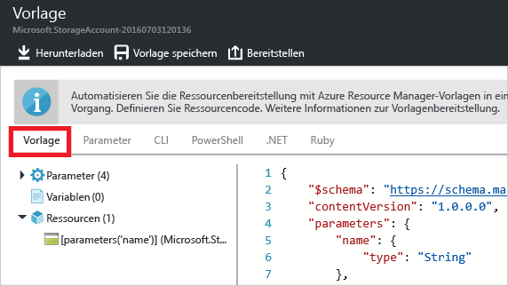

<properties
	pageTitle="Exportieren einer Azure Resource Manager-Vorlage | Microsoft Azure"
	description="Verwenden Sie Azure Resource Manager zum Exportieren einer Vorlage aus einer vorhandenen Ressourcengruppe."
	services="azure-resource-manager"
	documentationCenter=""
	authors="tfitzmac"
	manager="timlt"
	editor="tysonn"/>

<tags
	ms.service="azure-resource-manager"
	ms.workload="multiple"
	ms.tgt_pltfrm="na"
	ms.devlang="na"
	ms.topic="get-started-article"
	ms.date="08/03/2016"
	ms.author="tomfitz"/>

# Exportieren einer Azure Resource Manager-Vorlage aus vorhandenen Ressourcen

Mit Resource Manager können Sie eine Resource Manager-Vorlage aus vorhandenen Ressourcen in Ihrem Abonnement exportieren. Auf der Grundlage dieser generierten Vorlage können Sie sich über die Vorlagensyntax informieren oder ggf. die erneute Bereitstellung Ihrer Lösung automatisieren.

Es ist wichtig zu beachten, dass es zwei Möglichkeiten zum Exportieren einer Vorlage gibt:

- Sie können die Vorlage exportieren, die Sie für eine Bereitstellung verwendet haben. Die exportierte Vorlage enthält alle Parameter und Variablen so, wie sie in der Originalvorlage angezeigt wurden. Dieser Ansatz ist hilfreich, wenn Sie Ressourcen über das Portal bereitgestellt haben. Nun wird beschrieben, wie Sie die Vorlage zum Erstellen dieser Ressourcen zusammenstellen.
- Sie können eine Vorlage exportieren, die den aktuellen Zustand der Ressourcengruppe darstellt. Die exportierte Vorlage basiert nicht auf einer Vorlage, die Sie für die Bereitstellung verwendet haben. Stattdessen wird eine Vorlage erstellt, bei der es sich um eine Momentaufnahme der Ressourcengruppe handelt. Die exportierte Vorlage verfügt über viele hartcodierte Werte und vermutlich nicht über so viele Parameter, wie Sie sonst definieren. Dieser Ansatz ist hilfreich, wenn Sie die Ressourcengruppe über das Portal oder mit Skripts geändert haben. Nun müssen Sie die Ressourcengruppe als Vorlage erfassen.

In diesem Thema werden beide Ansätze beschrieben. Im Artikel [Anpassen einer exportierten Azure Resource Manager-Vorlage](resource-manager-customize-template.md) wird gezeigt, wie Sie eine Vorlage, die Sie aus dem aktuellen Zustand der Ressourcengruppe generiert haben, nützlicher für die erneute Bereitstellung Ihrer Lösung gestalten.

In diesem Tutorial melden Sie sich beim Azure-Portal an, erstellen ein Speicherkonto und exportieren die Vorlage für dieses Speicherkonto. Außerdem fügen Sie ein virtuelles Netzwerk hinzu, um die Ressourcengruppe zu ändern. Und schließlich exportieren Sie eine neue Vorlage, die den aktuellen Zustand darstellt. In diesem Artikel geht es zwar hauptsächlich um eine vereinfachte Infrastruktur, die beschriebenen Schritte können aber auch zum Exportieren einer Vorlage für eine kompliziertere Lösung verwendet werden.

## Erstellen Sie ein Speicherkonto.

1. Wählen Sie im [Azure-Portal](https://portal.azure.com) Folgendes aus: **Neu** > **Daten und Speicher** > **Speicherkonto**.

      

2. Erstellen Sie ein Speicherkonto mit dem Namen **storage**, gefolgt von Ihren Initialen und dem Datum. Der Name des Speicherkontos muss innerhalb von Azure eindeutig sein. Falls der ursprünglich gewählte Name bereits verwendet wird, versuchen Sie es mit einer Abwandlung. Verwenden Sie als Ressourcengruppe **ExportGroup**. Sie können für die anderen Eigenschaften die Standardwerte verwenden. Klicken Sie auf **Erstellen**.

      

Nach Abschluss der Bereitstellung enthält das Abonnement das Speicherkonto.

## Exportieren der Vorlage aus dem Bereitstellungsverlauf

1. Navigieren Sie zum Blatt „Ressourcengruppe“ für die neue Ressourcengruppe. Beachten Sie, dass auf dem Blatt das Ergebnis der letzten Bereitstellung angezeigt wird. Wählen Sie diesen Link aus.

      

2. Der Verlauf der Bereitstellungen für die Gruppe wird angezeigt. In Ihrem Fall ist auf dem Blatt wahrscheinlich nur eine Bereitstellung aufgeführt. Wählen Sie diese Bereitstellung aus.

     

3. Auf dem Blatt wird eine Zusammenfassung der Bereitstellung angezeigt. Die Zusammenfassung enthält den Status der Bereitstellung und die dazugehörigen Vorgänge sowie die Werte, die Sie für die Parameter angegeben haben. Wählen Sie **Vorlage anzeigen**, um die Vorlage anzuzeigen, die Sie für die Bereitstellung verwendet haben.

     

4. Resource Manager ruft die folgenden sechs Dateien ab:

   1. **Vorlage**: Die Vorlage, mit der die Infrastruktur für Ihre Lösung definiert wird. Wenn Sie das Speicherkonto über das Portal erstellt haben, hat Resource Manager eine Vorlage für die Bereitstellung verwendet und die Vorlage zur späteren Verwendung gespeichert.
   2. **Parameter**: Eine Parameterdatei, die Sie zum Übergeben von Werten während der Bereitstellung verwenden können. Sie enthält die Werte, die Sie bei der ersten Bereitstellung angegeben haben. Diese Werte können aber geändert werden, wenn Sie die Vorlage erneut bereitstellen.
   3. **CLI**: Eine Skriptdatei der Azure-Befehlszeilenschnittstelle, die Sie zum Bereitstellen der Vorlage verwenden können.
   4. **PowerShell**: Eine Azure PowerShell-Skriptdatei, die Sie zum Bereitstellen der Vorlage verwenden können.
   5. **.NET**: Eine .NET-Klasse, die Sie zum Bereitstellen der Vorlage verwenden können.
   6. **Ruby**: Eine Ruby-Klasse, die Sie zum Bereitstellen der Vorlage verwenden können.

     Die Dateien sind über die Links im Blatt verfügbar. Standardmäßig wird die Vorlage auf dem Blatt angezeigt.

       

     Wir sehen uns die Vorlage nun genauer an. Die Vorlage sollte in etwa wie folgt aussehen:

        {
          "$schema": "https://schema.management.azure.com/schemas/2015-01-01/deploymentTemplate.json#",
          "contentVersion": "1.0.0.0",
          "parameters": {
            "name": {
              "type": "String"
            },
            "accountType": {
              "type": "String"
            },
            "location": {
              "type": "String"
            },
            "encryptionEnabled": {
              "defaultValue": false,
              "type": "Bool"
            }
          },
          "resources": [
            {
              "type": "Microsoft.Storage/storageAccounts",
              "sku": {
                "name": "[parameters('accountType')]"
              },
              "kind": "Storage",
              "name": "[parameters('name')]",
              "apiVersion": "2016-01-01",
              "location": "[parameters('location')]",
              "properties": {
                "encryption": {
                  "services": {
                    "blob": {
                      "enabled": "[parameters('encryptionEnabled')]"
                    }
                  },
                  "keySource": "Microsoft.Storage"
                }
              }
            }
          ]
        }
 
Dies ist die Vorlage, die zum Erstellen Ihres Speicherkontos verwendet wurde. Beachten Sie, dass sie Parameter enthält, mit denen Sie unterschiedliche Arten von Speicherkonten bereitstellen können. Weitere Informationen zur Struktur einer Vorlage finden Sie unter [Erstellen von Azure Resource Manager-Vorlagen](resource-group-authoring-templates.md). Unter [Funktionen von Azure Resource Manager-Vorlagen](resource-group-template-functions.md) finden Sie eine vollständige Liste mit den Funktionen, die Sie in einer Vorlage verwenden können.


## Hinzufügen eines virtuellen Netzwerks

Die Vorlage, die Sie im vorherigen Abschnitt heruntergeladen haben, stellt die Infrastruktur für die ursprüngliche Bereitstellung dar. Es werden aber keine Änderungen berücksichtigt, die Sie nach der Bereitstellung vornehmen. Um dieses Problem zu veranschaulichen, ändern wir die Ressourcengruppe, indem wir über das Portal ein virtuelles Netzwerk hinzufügen.

1. Wählen Sie auf dem Blatt „Ressourcengruppe“ die Option **Hinzufügen**.

      

2. Wählen Sie **Virtuelles Netzwerk** aus den verfügbaren Ressourcen aus.

      

2. Geben Sie dem virtuellen Netzwerk den Namen **VNET**, und übernehmen Sie für die anderen Eigenschaften die Standardwerte. Klicken Sie auf **Erstellen**.

      

3. Sehen Sie sich den Bereitstellungsverlauf erneut an, nachdem das virtuelle Netzwerk erfolgreich für die Ressourcengruppe bereitgestellt wurde. Zwei Bereitstellungen werden angezeigt. Falls die zweite Bereitstellung nicht angezeigt wird, müssen Sie das Blatt „Ressourcengruppe“ ggf. schließen und erneut öffnen. Wählen Sie die neuere Bereitstellung aus.

      

4. Sehen Sie sich die Vorlage für diese Bereitstellung an. Beachten Sie, dass damit nur die Änderungen definiert werden, die Sie für das Hinzufügen des virtuellen Netzwerks vorgenommen haben.

In der Regel besteht die bewährte Methode darin, eine Vorlage zu verwenden, mit der die gesamte Infrastruktur für Ihre Lösung mit einem Vorgang bereitgestellt wird. Dieser Ansatz ist zuverlässiger als eine Vorgehensweise, bei der die Bereitstellung vieler unterschiedlicher Vorlagen bedacht werden muss.


## Exportieren der Vorlage aus der Ressourcengruppe

Auch wenn für jede Bereitstellung nur die Änderungen angezeigt werden, die Sie an der Ressourcengruppe vorgenommen haben, können Sie jederzeit eine Vorlage exportieren, um die Attribute der gesamten Ressourcengruppe anzuzeigen.

> [AZURE.NOTE] Sie können keine Vorlage für eine Ressourcengruppe mit mehr als 200 Ressourcen exportieren.

1. Wählen Sie zum Anzeigen der Vorlage für eine Ressourcengruppe die Option **Automatisierungsskript**.

      

     Nicht alle Ressourcentypen unterstützen die Funktion zum Exportieren von Vorlagen. Wenn die Ressourcengruppe wie in diesem Artikel gezeigt nur das Speicherkonto und das virtuelle Netzwerk enthält, wird kein Fehler angezeigt. Falls Sie andere Ressourcentypen erstellt haben, wird aber unter Umständen ein Fehler mit dem Hinweis angezeigt, dass ein Problem mit dem Export besteht. Informationen zum Umgang mit diesen Problemen finden Sie im Abschnitt [Beheben von Exportproblemen](#fix-export-issues).

      

2. Es werden wieder die sechs Dateien angezeigt, die Sie zum erneuten Bereitstellen der Lösung verwenden können. Dieses Mal sieht die Vorlage allerdings etwas anders aus. Diese Vorlage verfügt nur über zwei Parameter: einen für den Speicherkontonamen und einen für den Namen des virtuellen Netzwerks.

        "parameters": {
          "virtualNetworks_VNET_name": {
            "defaultValue": "VNET",
            "type": "String"
          },
          "storageAccounts_storagetf05092016_name": {
            "defaultValue": "storagetf05092016",
            "type": "String"
          }
        },

     Resource Manager hat die Vorlagen, die Sie während der Bereitstellung verwendet haben, nicht abgerufen. Stattdessen wurde basierend auf der aktuellen Konfiguration der Ressourcen eine neue Vorlage generiert. Der Standort des Speicherkontos und der Replikationswert werden von der Vorlage beispielsweise wie folgt festgelegt:

        "location": "northeurope",
        "tags": {},
        "properties": {
            "accountType": "Standard_RAGRS"
        },

3. Laden Sie die Vorlage herunter, um sie lokal verwenden zu können.

      

4. Suchen Sie nach der ZIP-Datei, die Sie heruntergeladen haben, und extrahieren Sie den Inhalt. Mit dieser heruntergeladenen Vorlage können Sie die Infrastruktur erneut bereitstellen.

## Beheben von Exportproblemen

Nicht alle Ressourcentypen unterstützen die Funktion zum Exportieren von Vorlagen. Vom Resource Manager werden einige bestimmte Ressourcentypen nicht exportiert, um die Offenlegung vertraulicher Daten zu verhindern. Wenn Sie in Ihrer Websitekonfiguration beispielsweise über eine Verbindungszeichenfolge verfügen, möchten Sie vermutlich nicht, dass sie in einer exportierten Vorlage explizit angezeigt wird. Sie können dieses Problem beheben, indem Sie die fehlenden Ressourcen der Vorlage manuell erneut hinzufügen.

> [AZURE.NOTE] Exportprobleme treten nur dann auf, wenn Sie aus einer Ressourcengruppe exportieren, anstatt aus Ihrem Bereitstellungsverlauf. Falls die letzte Bereitstellung genau den aktuellen Status der Ressourcengruppe widerspiegelt, sollten Sie die Vorlage nicht aus der Ressourcengruppe, sondern aus dem Bereitstellungsverlauf exportieren. Führen Sie den Export aus einer Ressourcengruppe nur dann durch, wenn Sie Änderungen an der Ressourcengruppe vorgenommen haben, die in einer einzelnen Vorlage nicht definiert sind.

Wenn Sie beispielsweise eine Vorlage für eine Ressourcengruppe exportieren, die eine Web-App, SQL-Datenbank und eine Verbindungszeichenfolge in der Websitekonfiguration enthält, wird die folgende Meldung angezeigt:


Wenn Sie die Meldung auswählen, wird genau angezeigt, welche Ressourcentypen nicht exportiert wurden.
     


In diesem Thema werden die folgenden häufigen Fixes beschrieben. Zum Implementieren dieser Ressourcen müssen Sie der Vorlage Parameter hinzufügen. Weitere Informationen finden Sie unter [Anpassen und erneutes Bereitstellen der exportierten Vorlage](resource-manager-customize-template.md).

### Verbindungszeichenfolge

Fügen Sie in der Websiteressource eine Definition für die Verbindungszeichenfolge der Datenbank hinzu:

```
{
  "type": "Microsoft.Web/sites",
  ...
  "resources": [
    {
      "apiVersion": "2015-08-01",
      "type": "config",
      "name": "connectionstrings",
      "dependsOn": [
          "[concat('Microsoft.Web/Sites/', parameters('<site-name>'))]"
      ],
      "properties": {
          "DefaultConnection": {
            "value": "[concat('Data Source=tcp:', reference(concat('Microsoft.Sql/servers/', parameters('<database-server-name>'))).fullyQualifiedDomainName, ',1433;Initial Catalog=', parameters('<database-name>'), ';User Id=', parameters('<admin-login>'), '@', parameters('<database-server-name>'), ';Password=', parameters('<admin-password>'), ';')]",
              "type": "SQLServer"
          }
      }
    }
  ]
}
```    

### Websiteerweiterung

Fügen Sie in der Websiteressource eine Definition für den zu installierenden Code hinzu:

```
{
  "type": "Microsoft.Web/sites",
  ...
  "resources": [
    {
      "name": "MSDeploy",
      "type": "extensions",
      "location": "[resourceGroup().location]",
      "apiVersion": "2015-08-01",
      "dependsOn": [
        "[concat('Microsoft.Web/sites/', parameters('<site-name>'))]"
      ],
      "properties": {
        "packageUri": "[concat(parameters('<artifacts-location>'), '/', parameters('<package-folder>'), '/', parameters('<package-file-name>'), parameters('<sas-token>'))]",
        "dbType": "None",
        "connectionString": "",
        "setParameters": {
          "IIS Web Application Name": "[parameters('<site-name>')]"
        }
      }
    }
  ]
}
```

### VM-Erweiterung

Beispiele für VM-Erweiterungen finden Sie unter [Konfigurationsbeispiele für Windows-VM-Erweiterungen in Azure](./virtual-machines/virtual-machines-windows-extensions-configuration-samples.md).

### Gateway des virtuellen Netzwerks

Fügen Sie einen Ressourcentyp für das Gateway des virtuellen Netzwerks hinzu.

```
{
  "type": "Microsoft.Network/virtualNetworkGateways",
  "name": "[parameters('<gateway-name>')]",
  "apiVersion": "2015-06-15",
  "location": "[resourceGroup().location]",
  "properties": {
    "gatewayType": "[parameters('<gateway-type>')]",
    "ipConfigurations": [
      {
        "name": "default",
        "properties": {
          "privateIPAllocationMethod": "Dynamic",
          "subnet": {
            "id": "[resourceId('Microsoft.Network/virtualNetworks/subnets', parameters('<vnet-name>'), parameters('<new-subnet-name>'))]"
          },
          "publicIpAddress": {
            "id": "[resourceId('Microsoft.Network/publicIPAddresses', parameters('<new-public-ip-address-Name>'))]"
          }
        }
      }
    ],
    "enableBgp": false,
    "vpnType": "[parameters('<vpn-type>')]"
  },
  "dependsOn": [
    "Microsoft.Network/virtualNetworks/codegroup4/subnets/GatewaySubnet",
    "[concat('Microsoft.Network/publicIPAddresses/', parameters('<new-public-ip-address-Name>'))]"
  ]
},
```

### Lokales Netzwerkgateway

Fügen Sie einen Ressourcentyp für das lokale Netzwerkgateway hinzu.

```
{
    "type": "Microsoft.Network/localNetworkGateways",
    "name": "[parameters('<local-network-gateway-name>')]",
    "apiVersion": "2015-06-15",
    "location": "[resourceGroup().location]",
    "properties": {
      "localNetworkAddressSpace": {
        "addressPrefixes": "[parameters('<address-prefixes>')]"
      }
    }
}
```

### Verbindung

Fügen Sie einen Ressourcentyp für die Verbindung hinzu.

```
{
    "apiVersion": "2015-06-15",
    "name": "[parameters('<connection-name>')]",
    "type": "Microsoft.Network/connections",
    "location": "[resourceGroup().location]",
    "properties": {
        "virtualNetworkGateway1": {
        "id": "[resourceId('Microsoft.Network/virtualNetworkGateways', parameters('<gateway-name>'))]"
      },
      "localNetworkGateway2": {
        "id": "[resourceId('Microsoft.Network/localNetworkGateways', parameters('<local-gateway-name>'))]"
      },
      "connectionType": "IPsec",
      "routingWeight": 10,
      "sharedKey": "[parameters('<shared-key>')]"
    }
},
```


## Nächste Schritte

Glückwunsch! Sie haben gelernt, wie Sie eine Vorlage aus Ressourcen exportieren, die Sie im Portal erstellt haben.

- Im zweiten Teil dieses Tutorials passen Sie die heruntergeladene Vorlage an, indem Sie weitere Parameter hinzufügen und die erneute Bereitstellung per Skript durchführen. Weitere Informationen finden Sie unter [Anpassen und erneutes Bereitstellen der exportierten Vorlage](resource-manager-customize-template.md).
- Informationen zum Exportieren einer Vorlage mithilfe von PowerShell finden Sie unter [Verwenden von Windows PowerShell mit Azure Resource Manager](powershell-azure-resource-manager.md).
- Informationen zum Exportieren einer Vorlage mithilfe der Azure-Befehlszeilenschnittstelle finden Sie unter [Verwalten von Azure-Ressourcen und -Ressourcengruppen mithilfe der Azure-Befehlszeilenschnittstelle](xplat-cli-azure-resource-manager.md).

<!---HONumber=AcomDC_0928_2016-->