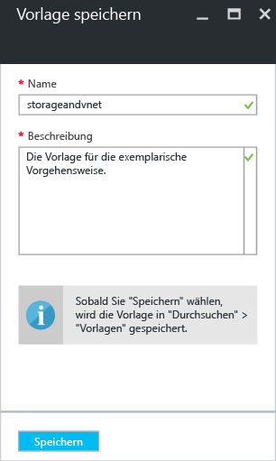
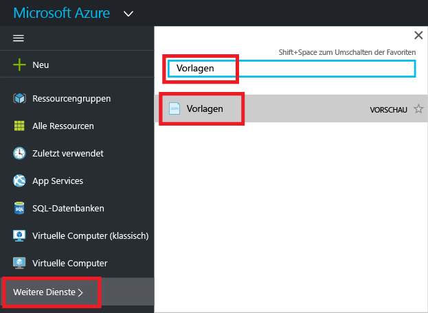
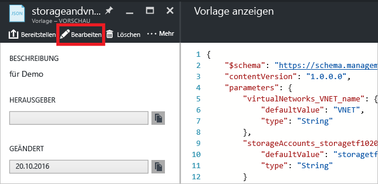
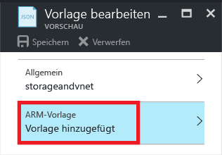
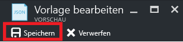
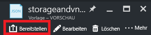

# <a name="export-an-azure-resource-manager-template-from-existing-resources"></a>Exportieren einer Azure Resource Manager-Vorlage aus vorhandenen Ressourcen
Mit Resource Manager können Sie eine Resource Manager-Vorlage aus vorhandenen Ressourcen in Ihrem Abonnement exportieren. Auf der Grundlage dieser generierten Vorlage können Sie sich über die Vorlagensyntax informieren oder ggf. die erneute Bereitstellung Ihrer Lösung automatisieren.

Es ist wichtig zu beachten, dass es zwei Möglichkeiten zum Exportieren einer Vorlage gibt:

* Sie können die Vorlage exportieren, die Sie für eine Bereitstellung verwendet haben. Die exportierte Vorlage enthält alle Parameter und Variablen so, wie sie in der Originalvorlage angezeigt wurden. Dieser Ansatz ist hilfreich, wenn Sie Ressourcen über das Portal bereitgestellt haben. Nun wird beschrieben, wie Sie die Vorlage zum Erstellen dieser Ressourcen zusammenstellen.
* Sie können eine Vorlage exportieren, die den aktuellen Zustand der Ressourcengruppe darstellt. Die exportierte Vorlage basiert nicht auf einer Vorlage, die Sie für die Bereitstellung verwendet haben. Stattdessen wird eine Vorlage erstellt, bei der es sich um eine Momentaufnahme der Ressourcengruppe handelt. Die exportierte Vorlage verfügt über viele hartcodierte Werte und vermutlich nicht über so viele Parameter, wie Sie sonst definieren. Dieser Ansatz ist hilfreich, wenn Sie die Ressourcengruppe über das Portal oder mit Skripts geändert haben. Nun müssen Sie die Ressourcengruppe als Vorlage erfassen.

In diesem Thema werden beide Ansätze beschrieben.

In diesem Tutorial melden Sie sich beim Azure-Portal an, erstellen ein Speicherkonto und exportieren die Vorlage für dieses Speicherkonto. Außerdem fügen Sie ein virtuelles Netzwerk hinzu, um die Ressourcengruppe zu ändern. Und schließlich exportieren Sie eine neue Vorlage, die den aktuellen Zustand darstellt. In diesem Artikel geht es zwar hauptsächlich um eine vereinfachte Infrastruktur, die beschriebenen Schritte können aber auch zum Exportieren einer Vorlage für eine kompliziertere Lösung verwendet werden.

## <a name="create-a-storage-account"></a>Erstellen Sie ein Speicherkonto.
1. Klicken Sie im [Azure-Portal](https://portal.azure.com) auf **Neu** > **Speicher** > **Speicherkonto**.
   
      
2. Erstellen Sie ein Speicherkonto mit dem Namen **storage**, gefolgt von Ihren Initialen und dem Datum. Der Name des Speicherkontos muss innerhalb von Azure eindeutig sein. Sollte der Name bereits verwendet werden, erscheint eine entsprechende Fehlermeldung. Verwenden Sie eine andere Variante. Erstellen Sie eine neue Ressourcengruppe namens **ExportGroup**. Sie können für die anderen Eigenschaften die Standardwerte verwenden. Klicken Sie auf **Erstellen**.
   
      

Die Bereitstellung kann etwas dauern. Nach Abschluss der Bereitstellung enthält das Abonnement das Speicherkonto.

## <a name="view-a-template-from-deployment-history"></a>Anzeigen einer Vorlage aus dem Bereitstellungsverlauf
1. Navigieren Sie zum Blatt „Ressourcengruppe“ für die neue Ressourcengruppe. Beachten Sie, dass auf dem Blatt das Ergebnis der letzten Bereitstellung angezeigt wird. Wählen Sie diesen Link aus.
   
      
2. Der Verlauf der Bereitstellungen für die Gruppe wird angezeigt. In Ihrem Fall ist auf dem Blatt wahrscheinlich nur eine Bereitstellung aufgeführt. Wählen Sie diese Bereitstellung aus.
   
     
3. Auf dem Blatt wird eine Zusammenfassung der Bereitstellung angezeigt. Die Zusammenfassung enthält den Status der Bereitstellung und die dazugehörigen Vorgänge sowie die Werte, die Sie für die Parameter angegeben haben. Wählen Sie **Vorlage anzeigen**, um die Vorlage anzuzeigen, die Sie für die Bereitstellung verwendet haben.
   
     
4. Resource Manager ruft die folgenden sechs Dateien ab:
   
   1. **Vorlage** : Die Vorlage, mit der die Infrastruktur für Ihre Lösung definiert wird. Wenn Sie das Speicherkonto über das Portal erstellt haben, hat Resource Manager eine Vorlage für die Bereitstellung verwendet und die Vorlage zur späteren Verwendung gespeichert.
   2. **Parameter**: Eine Parameterdatei, die Sie zum Übergeben von Werten während der Bereitstellung verwenden können. Sie enthält die Werte, die Sie bei der ersten Bereitstellung angegeben haben. Diese Werte können aber geändert werden, wenn Sie die Vorlage erneut bereitstellen.
   3. **CLI** : Eine Skriptdatei der Azure-Befehlszeilenschnittstelle, die Sie zum Bereitstellen der Vorlage verwenden können.
   4. **PowerShell** : Eine Azure PowerShell-Skriptdatei, die Sie zum Bereitstellen der Vorlage verwenden können.
   5. **.NET** : Eine .NET-Klasse, die Sie zum Bereitstellen der Vorlage verwenden können.
   6. **Ruby** : Eine Ruby-Klasse, die Sie zum Bereitstellen der Vorlage verwenden können.
      
      Die Dateien sind über die Links im Blatt verfügbar. Standardmäßig wird die Vorlage auf dem Blatt angezeigt.
      
       
      
      Wir sehen uns die Vorlage nun genauer an. Die Vorlage sollte in etwa wie folgt aussehen:
      
        {
      
          "$schema": "https://schema.management.azure.com/schemas/2015-01-01/deploymentTemplate.json#",
          "contentVersion": "1.0.0.0",
          "parameters": {
            "name": {
              "type": "String"
            },
            "accountType": {
              "type": "String"
            },
            "location": {
              "type": "String"
            },
            "encryptionEnabled": {
              "defaultValue": false,
              "type": "Bool"
            }
          },
          "resources": [
            {
              "type": "Microsoft.Storage/storageAccounts",
              "sku": {
                "name": "[parameters('accountType')]"
              },
              "kind": "Storage",
              "name": "[parameters('name')]",
              "apiVersion": "2016-01-01",
              "location": "[parameters('location')]",
              "properties": {
                "encryption": {
                  "services": {
                    "blob": {
                      "enabled": "[parameters('encryptionEnabled')]"
                    }
                  },
                  "keySource": "Microsoft.Storage"
                }
              }
            }
          ]
        }

Dies ist die Vorlage, die zum Erstellen Ihres Speicherkontos verwendet wurde. Beachten Sie, dass sie Parameter enthält, mit denen Sie unterschiedliche Arten von Speicherkonten bereitstellen können. Weitere Informationen zur Struktur einer Vorlage finden Sie unter [Erstellen von Azure Resource Manager-Vorlagen](resource-group-authoring-templates.md). Unter [Funktionen von Azure Resource Manager-Vorlagen](resource-group-template-functions.md)finden Sie eine vollständige Liste mit den Funktionen, die Sie in einer Vorlage verwenden können.

## <a name="add-a-virtual-network"></a>Hinzufügen eines virtuellen Netzwerks
Die Vorlage, die Sie im vorherigen Abschnitt heruntergeladen haben, stellt die Infrastruktur für die ursprüngliche Bereitstellung dar. Es werden aber keine Änderungen berücksichtigt, die Sie nach der Bereitstellung vornehmen.
Um dieses Problem zu veranschaulichen, ändern wir die Ressourcengruppe, indem wir über das Portal ein virtuelles Netzwerk hinzufügen.

1. Wählen Sie auf dem Blatt „Ressourcengruppe“ die Option **Hinzufügen**.
   
      
2. Wählen Sie **Virtuelles Netzwerk** aus den verfügbaren Ressourcen aus.
   
      
3. Geben Sie dem virtuellen Netzwerk den Namen **VNET**, und übernehmen Sie für die anderen Eigenschaften die Standardwerte. Klicken Sie auf **Erstellen**.
   
      
4. Sehen Sie sich den Bereitstellungsverlauf erneut an, nachdem das virtuelle Netzwerk erfolgreich für die Ressourcengruppe bereitgestellt wurde. Zwei Bereitstellungen werden angezeigt. Falls die zweite Bereitstellung nicht angezeigt wird, müssen Sie das Blatt „Ressourcengruppe“ ggf. schließen und erneut öffnen. Wählen Sie die neuere Bereitstellung aus.
   
      
5. Sehen Sie sich die Vorlage für diese Bereitstellung an. Beachten Sie, dass sie nur das virtuelle Netzwerk definiert. Das zuvor erstellte Speicherkonto ist hingegen nicht enthalten. Sie verfügen nicht mehr über eine Vorlage, die alle Ressourcen in der Ressourcengruppe darstellt.

## <a name="export-the-template-from-resource-group"></a>Exportieren der Vorlage aus der Ressourcengruppe
Um den aktuellen Zustand der Ressourcengruppe abzurufen, exportieren Sie eine Vorlage, die eine Momentaufnahme der Ressourcengruppe zeigt.  

> [!NOTE]
> Sie können keine Vorlage für eine Ressourcengruppe mit mehr als 200 Ressourcen exportieren.
> 
> 

1. Wählen Sie zum Anzeigen der Vorlage für eine Ressourcengruppe die Option **Automatisierungsskript**.
   
      
   
     Nicht alle Ressourcentypen unterstützen die Funktion zum Exportieren von Vorlagen. Wenn die Ressourcengruppe wie in diesem Artikel gezeigt nur das Speicherkonto und das virtuelle Netzwerk enthält, wird kein Fehler angezeigt. Falls Sie andere Ressourcentypen erstellt haben, wird aber unter Umständen ein Fehler mit dem Hinweis angezeigt, dass ein Problem mit dem Export besteht. Informationen zum Umgang mit diesen Problemen finden Sie im Abschnitt [Beheben von Exportproblemen](#fix-export-issues) .
2. Es werden wieder die sechs Dateien angezeigt, die Sie zum erneuten Bereitstellen der Lösung verwenden können. Dieses Mal sieht die Vorlage allerdings etwas anders aus. Diese Vorlage verfügt nur über zwei Parameter: einen für den Speicherkontonamen und einen für den Namen des virtuellen Netzwerks.
   
        "parameters": {
          "virtualNetworks_VNET_name": {
            "defaultValue": "VNET",
            "type": "String"
          },
          "storageAccounts_storagetf05092016_name": {
            "defaultValue": "storagetf05092016",
            "type": "String"
          }
        },
   
     Resource Manager hat die Vorlagen, die Sie während der Bereitstellung verwendet haben, nicht abgerufen. Stattdessen wurde basierend auf der aktuellen Konfiguration der Ressourcen eine neue Vorlage generiert. Der Standort des Speicherkontos und der Replikationswert werden von der Vorlage beispielsweise wie folgt festgelegt:
   
        "location": "northeurope",
        "tags": {},
        "properties": {
            "accountType": "Standard_RAGRS"
        },
3. Die Arbeit mit dieser Vorlage kann auf unterschiedliche Weise fortgesetzt werden: Sie können die Vorlage herunterladen und lokal mit einem JSON-Editor bearbeiten. Alternativ können Sie die Vorlage in Ihrer Bibliothek speichern und über das Portal bearbeiten.
   
     Wenn Sie mit einem JSON-Editor wie [VS Code](resource-manager-vs-code.md) oder [Visual Studio](vs-azure-tools-resource-groups-deployment-projects-create-deploy.md) vertraut sind, möchten Sie die Vorlage unter Umständen lieber herunterladen und den vertrauten Editor verwenden. Falls Sie über keinen JSON-Editor verfügen, bearbeiten Sie die Vorlage wahrscheinlich lieber über das Portal. In weiteren Verlauf dieses Themas wird davon ausgegangen, dass Sie die Vorlage in Ihrer Bibliothek im Portal gespeichert haben. Für die Vorlage müssen jedoch in beiden Fällen (also sowohl bei der lokalen Bearbeitung mit einem JSON-Editor als auch bei der Bearbeitung über das Portal) die gleichen Syntaxänderungen vorgenommen werden.
   
     Wählen Sie für die lokale Variante die Option **Herunterladen** aus.
   
      
   
     Wenn Sie über das Portal arbeiten möchten, wählen Sie **Zur Bibliothek hinzufügen** aus.
   
      
   
     Geben Sie einen Namen und eine Beschreibung für die Vorlage an, wenn Sie sie der Bibliothek hinzufügen. Wählen Sie anschließend **Speichern** aus.
   
     
4. Wenn Sie eine in der Bibliothek gespeicherte Vorlage anzeigen möchten, wählen Sie **Weitere Dienste** aus, geben Sie **Vorlagen** ein, um die Ergebnisse zu filtern, und wählen Sie **Vorlagen** aus.
   
      
5. Wählen Sie die Vorlage mit dem von Ihnen gespeicherten Namen aus.
   
      

## <a name="customize-the-template"></a>Anpassen der Vorlage
Die exportierte Vorlage funktioniert einwandfrei, wenn Sie für jede Bereitstellung das gleiche Speicherkonto und das gleiche virtuelle Netzwerk erstellen möchten. Mit den in Resource Manager verfügbaren Optionen können Vorlagen jedoch erheblich flexibler bereitgestellt werden. So können Sie etwa bei der Bereitstellung die Art des zu erstellenden Speicherkontos oder die Werte angeben, die für Adresspräfix und Subnetzpräfix des virtuellen Netzwerks verwendet werden sollen.

In diesem Abschnitt werden der exportierten Vorlage Parameter hinzugefügt, um die Vorlage wieder verwenden zu können, wenn Sie die Ressourcen in anderen Umgebungen bereitstellen. Außerdem werden der Vorlage einige Features hinzugefügt, die das Fehlerrisiko beim Bereitstellen der Vorlage verringern. Sie müssen sich keinen eindeutigen Namen für das Speicherkonto mehr ausdenken. Dieser wird stattdessen von der Vorlage erstellt. Darüber hinaus werden die Werte, die für den Speicherkontotyp angegeben werden können, auf gültige Optionen beschränkt.

1. Wählen Sie **Bearbeiten** aus, um die Vorlage anzupassen.
   
     
2. Wählen Sie die Vorlage aus.
   
     
3. Um die Übergabe der Werte zu ermöglichen, die Sie unter Umständen bei der Bereitstellung angeben möchten, muss der Abschnitt **parameters** durch neue Parameterdefinitionen ersetzt werden. Beachten Sie die Werte von **allowedValues** für **storageAccount_accountType**. Falls Sie versehentlich einen ungültigen Wert angeben, wird dieser Fehler vor dem Start der Bereitstellung erkannt. Beachten Sie außerdem, dass Sie nur ein Präfix für den Namen des Speicherkontos angeben und das Präfix auf 11 Zeichen beschränkt ist. Durch die Beschränkung auf 11 Zeichen wird sichergestellt, dass der vollständige Name die maximal zulässige Zeichenanzahl für ein Speicherkonto nicht überschreitet. Das Präfix ermöglicht die Verwendung einer Benennungskonvention für Speicherkonten. Die Vorgehensweise zum Erstellen eines eindeutigen Namens wird im nächsten Schritt erläutert.
   
        "parameters": {
          "storageAccount_prefix": {
            "type": "string",
            "maxLength": 11
          },
          "storageAccount_accountType": {
            "defaultValue": "Standard_RAGRS",
            "type": "string",
            "allowedValues": [
              "Standard_LRS",
              "Standard_ZRS",
              "Standard_GRS",
              "Standard_RAGRS",
              "Premium_LRS"
            ]
          },
          "virtualNetwork_name": {
            "type": "string"
          },
          "addressPrefix": {
            "defaultValue": "10.0.0.0/16",
            "type": "string"
          },
          "subnetName": {
            "defaultValue": "subnet-1",
            "type": "string"
          },
          "subnetAddressPrefix": {
            "defaultValue": "10.0.0.0/24",
            "type": "string"
          }
        },
4. Der Abschnitt **variables** der Vorlage ist momentan noch leer. Im Abschnitt **variables** können Sie Werte erstellen, die die Syntax der restlichen Vorlage vereinfachen. Ersetzen Sie diesen Abschnitt durch eine neue Variablendefinition. Die Variable **storageAccount_name** verkettet das Präfix aus dem Parameter zu einer eindeutigen Zeichenfolge, die auf der Grundlage des Bezeichners der Ressourcengruppe generiert wird. Dadurch müssen Sie sich beim Angeben eines Parameterwerts keinen eindeutigen Namen mehr ausdenken.
   
        "variables": {
          "storageAccount_name": "[concat(parameters('storageAccount_prefix'), uniqueString(resourceGroup().id))]"
        },
5. Zur Verwendung der Parameter und Variablen in den Ressourcendefinitionen muss der Abschnitt **resources** durch neue Ressourcendefinitionen ersetzt werden. Abgesehen von dem Wert, der der Ressourceneigenschaft zugewiesen wird, hat sich an den Ressourcendefinitionen nicht viel geändert. Die Eigenschaften entsprechen den Eigenschaften aus der exportierten Vorlage. Anstelle von hartcodierten Werten werden den Parameterwerten allerdings Eigenschaften zugewiesen. Mithilfe des Ausdrucks **resourceGroup().location** wird der Ort der Ressourcen auf den Ort der Ressourcengruppe festgelegt. Als Referenz für die Variable, die für den Namen des Speicherkontos erstellt wurde, wird der Ausdruck **variables** verwendet.
   
        "resources": [
          {
            "type": "Microsoft.Network/virtualNetworks",
            "name": "[parameters('virtualNetwork_name')]",
            "apiVersion": "2015-06-15",
            "location": "[resourceGroup().location]",
            "properties": {
              "addressSpace": {
                "addressPrefixes": [
                  "[parameters('addressPrefix')]"
                ]
              },
              "subnets": [
                {
                  "name": "[parameters('subnetName')]",
                  "properties": {
                    "addressPrefix": "[parameters('subnetAddressPrefix')]"
                  }
                }
              ]
            },
            "dependsOn": []
          },
          {
            "type": "Microsoft.Storage/storageAccounts",
            "name": "[variables('storageAccount_name')]",
            "apiVersion": "2015-06-15",
            "location": "[resourceGroup().location]",
            "tags": {},
            "properties": {
                "accountType": "[parameters('storageAccount_accountType')]"
            },
            "dependsOn": []
          }
        ]
6. Wählen Sie **OK** aus, wenn Sie mit der Bearbeitung der Vorlage fertig sind.
7. Wählen Sie **Speichern** aus, um die Änderungen an der Vorlage zu speichern.
   
     
8. Wählen Sie **Bereitstellen** aus, um die aktualisierte Vorlage bereitzustellen.
   
     
9. Geben Sie Parameterwerte an, und wählen Sie eine neue Ressourcengruppe für die Bereitstellung der Ressourcen aus.

## <a name="update-the-downloaded-parameters-file"></a>Aktualisieren der heruntergeladenen Parameterdatei
Wenn Sie anstelle der Portalbibliothek heruntergeladene Dateien verwenden, müssen Sie die heruntergeladene Parameterdatei aktualisieren. Diese entspricht nicht mehr den Parametern in Ihrer Vorlage. Die Verwendung einer Parameterdatei ist zwar nicht zwingend notwendig, kann aber die erneute Bereitstellung einer Umgebung vereinfachen. Für die meisten Parameter werden die in der Vorlage definierten Standardwerte verwendet, sodass für die Parameterdatei lediglich zwei Werte benötigt werden.

Ersetzen Sie den Inhalt der JSON-Parameterdatei durch Folgendes:

```
{
  "$schema": "https://schema.management.azure.com/schemas/2015-01-01/deploymentParameters.json#",
  "contentVersion": "1.0.0.0",
  "parameters": {
    "storageAccount_prefix": {
      "value": "storage"
    },
    "virtualNetwork_name": {
      "value": "VNET"
    }
  }
}
```

Die aktualisierte Parameterdatei stellt nur Werte für Parameter bereit, die über keinen Standardwert verfügen. Sie können auch Werte für andere Parameter angeben, wenn Sie nicht den Standardwert verwenden möchten.

## <a name="fix-export-issues"></a>Beheben von Exportproblemen
Nicht alle Ressourcentypen unterstützen die Funktion zum Exportieren von Vorlagen. Vom Resource Manager werden einige bestimmte Ressourcentypen nicht exportiert, um die Offenlegung vertraulicher Daten zu verhindern. Wenn Sie in Ihrer Websitekonfiguration beispielsweise über eine Verbindungszeichenfolge verfügen, möchten Sie vermutlich nicht, dass sie in einer exportierten Vorlage explizit angezeigt wird. Sie können dieses Problem beheben, indem Sie die fehlenden Ressourcen der Vorlage manuell erneut hinzufügen.

> [!NOTE]
> Exportprobleme treten nur dann auf, wenn Sie aus einer Ressourcengruppe exportieren, anstatt aus Ihrem Bereitstellungsverlauf. Falls die letzte Bereitstellung genau den aktuellen Status der Ressourcengruppe widerspiegelt, sollten Sie die Vorlage nicht aus der Ressourcengruppe, sondern aus dem Bereitstellungsverlauf exportieren. Führen Sie den Export aus einer Ressourcengruppe nur dann durch, wenn Sie Änderungen an der Ressourcengruppe vorgenommen haben, die in einer einzelnen Vorlage nicht definiert sind.
> 
> 

Wenn Sie beispielsweise eine Vorlage für eine Ressourcengruppe exportieren, die eine Web-App, SQL-Datenbank und eine Verbindungszeichenfolge in der Websitekonfiguration enthält, wird die folgende Meldung angezeigt:


Wenn Sie die Meldung auswählen, wird genau angezeigt, welche Ressourcentypen nicht exportiert wurden. 


Dieses Thema enthält allgemeine Korrekturen.

### <a name="connection-string"></a>Verbindungszeichenfolge
Fügen Sie in der Websiteressource eine Definition für die Verbindungszeichenfolge der Datenbank hinzu:

```
{
  "type": "Microsoft.Web/sites",
  ...
  "resources": [
    {
      "apiVersion": "2015-08-01",
      "type": "config",
      "name": "connectionstrings",
      "dependsOn": [
          "[concat('Microsoft.Web/Sites/', parameters('<site-name>'))]"
      ],
      "properties": {
          "DefaultConnection": {
            "value": "[concat('Data Source=tcp:', reference(concat('Microsoft.Sql/servers/', parameters('<database-server-name>'))).fullyQualifiedDomainName, ',1433;Initial Catalog=', parameters('<database-name>'), ';User Id=', parameters('<admin-login>'), '@', parameters('<database-server-name>'), ';Password=', parameters('<admin-password>'), ';')]",
              "type": "SQLServer"
          }
      }
    }
  ]
}
```    

### <a name="web-site-extension"></a>Websiteerweiterung
Fügen Sie in der Websiteressource eine Definition für den zu installierenden Code hinzu:

```
{
  "type": "Microsoft.Web/sites",
  ...
  "resources": [
    {
      "name": "MSDeploy",
      "type": "extensions",
      "location": "[resourceGroup().location]",
      "apiVersion": "2015-08-01",
      "dependsOn": [
        "[concat('Microsoft.Web/sites/', parameters('<site-name>'))]"
      ],
      "properties": {
        "packageUri": "[concat(parameters('<artifacts-location>'), '/', parameters('<package-folder>'), '/', parameters('<package-file-name>'), parameters('<sas-token>'))]",
        "dbType": "None",
        "connectionString": "",
        "setParameters": {
          "IIS Web Application Name": "[parameters('<site-name>')]"
        }
      }
    }
  ]
}
```

### <a name="virtual-machine-extension"></a>VM-Erweiterung
Beispiele für VM-Erweiterungen finden Sie unter [Konfigurationsbeispiele für Windows-VM-Erweiterungen in Azure](virtual-machines/virtual-machines-windows-extensions-configuration-samples.md).

### <a name="virtual-network-gateway"></a>Gateway des virtuellen Netzwerks
Fügen Sie einen Ressourcentyp für das Gateway des virtuellen Netzwerks hinzu.

```
{
  "type": "Microsoft.Network/virtualNetworkGateways",
  "name": "[parameters('<gateway-name>')]",
  "apiVersion": "2015-06-15",
  "location": "[resourceGroup().location]",
  "properties": {
    "gatewayType": "[parameters('<gateway-type>')]",
    "ipConfigurations": [
      {
        "name": "default",
        "properties": {
          "privateIPAllocationMethod": "Dynamic",
          "subnet": {
            "id": "[resourceId('Microsoft.Network/virtualNetworks/subnets', parameters('<vnet-name>'), parameters('<new-subnet-name>'))]"
          },
          "publicIpAddress": {
            "id": "[resourceId('Microsoft.Network/publicIPAddresses', parameters('<new-public-ip-address-Name>'))]"
          }
        }
      }
    ],
    "enableBgp": false,
    "vpnType": "[parameters('<vpn-type>')]"
  },
  "dependsOn": [
    "Microsoft.Network/virtualNetworks/codegroup4/subnets/GatewaySubnet",
    "[concat('Microsoft.Network/publicIPAddresses/', parameters('<new-public-ip-address-Name>'))]"
  ]
},
```

### <a name="local-network-gateway"></a>Lokales Netzwerkgateway
Fügen Sie einen Ressourcentyp für das lokale Netzwerkgateway hinzu.

```
{
    "type": "Microsoft.Network/localNetworkGateways",
    "name": "[parameters('<local-network-gateway-name>')]",
    "apiVersion": "2015-06-15",
    "location": "[resourceGroup().location]",
    "properties": {
      "localNetworkAddressSpace": {
        "addressPrefixes": "[parameters('<address-prefixes>')]"
      }
    }
}
```

### <a name="connection"></a>Verbindung
Fügen Sie einen Ressourcentyp für die Verbindung hinzu.

```
{
    "apiVersion": "2015-06-15",
    "name": "[parameters('<connection-name>')]",
    "type": "Microsoft.Network/connections",
    "location": "[resourceGroup().location]",
    "properties": {
        "virtualNetworkGateway1": {
        "id": "[resourceId('Microsoft.Network/virtualNetworkGateways', parameters('<gateway-name>'))]"
      },
      "localNetworkGateway2": {
        "id": "[resourceId('Microsoft.Network/localNetworkGateways', parameters('<local-gateway-name>'))]"
      },
      "connectionType": "IPsec",
      "routingWeight": 10,
      "sharedKey": "[parameters('<shared-key>')]"
    }
},
```


## <a name="next-steps"></a>Nächste Schritte
Glückwunsch! Sie haben gelernt, wie Sie eine Vorlage aus Ressourcen exportieren, die Sie im Portal erstellt haben.

* Eine Vorlage kann mithilfe von [PowerShell](resource-group-template-deploy.md), mit der [Azure-Befehlszeilenschnittstelle](resource-group-template-deploy-cli.md) oder per [REST-API](resource-group-template-deploy-rest.md) bereitgestellt werden.
* Informationen zum Exportieren einer Vorlage mithilfe von PowerShell finden Sie unter [Verwenden von Windows PowerShell mit Azure Resource Manager](powershell-azure-resource-manager.md).
* Informationen zum Exportieren einer Vorlage mithilfe der Azure-Befehlszeilenschnittstelle finden Sie unter [Verwalten von Azure-Ressourcen und -Ressourcengruppen mithilfe der Azure-Befehlszeilenschnittstelle](xplat-cli-azure-resource-manager.md).


<!--HONumber=Nov16_HO2-->


