<properties
   pageTitle="Sicherheitswarnungen nach Typ in Azure Security Center | Microsoft Azure"
   description="In diesem Dokument werden die Arten von Sicherheitswarnungen beschrieben, die in Azure Security Center verfügbar sind."
   services="security-center"
   documentationCenter="na"
   authors="YuriDio"
   manager="swadhwa"
   editor=""/>

<tags
   ms.service="security-center"
   ms.topic="hero-article"
   ms.devlang="na"
   ms.tgt_pltfrm="na"
   ms.workload="na"
   ms.date="09/20/2016"
   ms.author="yurid"/>

# Sicherheitswarnungen nach Typ in Azure Security Center
In diesem Dokument werden die verschiedenen Arten von Sicherheitswarnungen beschrieben, die in Azure Security Center verfügbar sind. Weitere Informationen zur Verwaltung von Warnungen finden Sie unter [Verwalten von und Reagieren auf Sicherheitswarnungen in Azure Security Center](security-center-managing-and-responding-alerts.md).

> [AZURE.NOTE] Führen Sie ein Upgrade auf Azure Security Center Standard durch, um erweiterte Erkennungsfunktionen zu aktivieren. Sie können auch eine kostenlose 90-Tage-Testversion nutzen. Wenn Sie ein Upgrade durchführen möchten, wählen Sie in der [Sicherheitsrichtlinie](security-center-policies.md) die Tarifoption aus. Weitere Informationen finden Sie auf der [Preisseite](https://azure.microsoft.com/pricing/details/security-center/).

## Welche Art von Warnungen ist verfügbar?
Azure Security Center verfügt über viele verschiedene Warnungen, die den Phasen der „Cyber Kill Chain“ entsprechen. Die folgende Abbildung enthält Beispiele für verschiedene Warnungen in Bezug auf einige dieser Phasen.

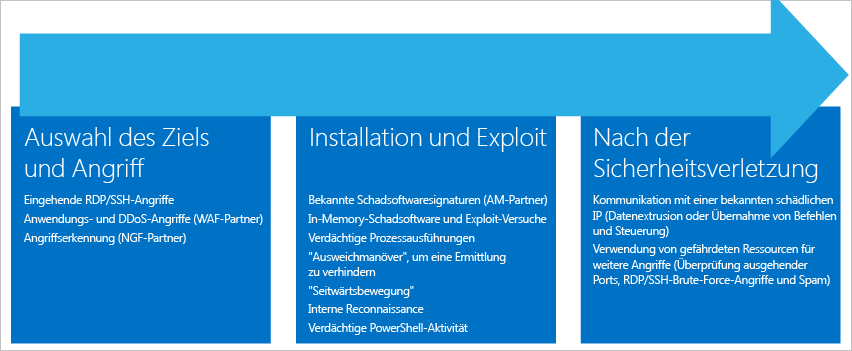

**Ziel und Angriff**

- Eingehende RDP/SSH-Angriffe
- Anwendungs- und DDoS-Angriffe (WAF-Partner)
- Angriffserkennung (NG Firewall-Partner)

**Installation und Ausnutzung (Exploit)**

- Bekannte Schadsoftwaresignaturen (AM-Partner)
- Versuche mit In-Memory-Schadsoftware und Exploits
- Ausführung verdächtiger Prozesse
- Ausweichmanöver zur Vermeidung der Entdeckung
- Seitwärtsbewegung
- Interne Erkundung
- Verdächtige PowerShell-Aktivität

**Nach einer Sicherheitsverletzung**

- Kommunikation mit einer bekannten schädlichen IP (Herausfilterung von Daten oder Befehl und Steuerung)
- Verwendung von kompromittierten Ressourcen zum Starten zusätzlicher Angriffe (Überwachung von ausgehenden Ports, RDP/SSH-Brute-Force-Angriffe und Spam)

Jeder Phase sind unterschiedliche Arten von Angriffen zugeordnet, die jeweils auf andere Subsysteme abzielen. Security Center verfügt über drei Kategorien von Warnungen für Angriffe während dieser Phasen:

- Verhaltensanalyse von VMs (Virtual Machine Behavioral Analysis, VMBA)
- Netzwerkanalyse
- Ressourcenanalyse

## Verhaltensanalyse von VMs

In Azure Security Center kann die Verhaltensanalyse verwendet werden, um kompromittierte Ressourcen basierend auf der Analyse von VM-Ereignisprotokollen zu ermitteln (z.B Prozesserstellungsereignisse, Anmeldeereignisse usw.). Außerdem ist eine Korrelation mit anderen Signalen vorhanden, damit weitere Beweise für eine größere Aktion ermittelt werden können.

> [AZURE.NOTE] Weitere Informationen zur Funktionsweise der Security Center-Erkennungsfunktionen finden Sie unter [Azure Security Center-Erkennungsfunktionen](security-center-detection-capabilities.md).

### Absturzanalyse

Die Absturzabbild-Speicheranalyse ist ein Verfahren zum Erkennen von anspruchsvoller Schadsoftware, mit der herkömmliche Sicherheitslösungen umgangen werden können. Mit verschiedenen Arten von Schadsoftware wird versucht, die Wahrscheinlichkeit für die Entdeckung durch Antivirenprogramme zu verringern. Zu diesem Zweck werden niemals Daten auf Datenträger geschrieben oder auf Datenträger geschriebene Softwarekomponenten verschlüsselt. So wird erreicht, dass die Schadsoftware mit herkömmlichen Antischadsoftware-Verfahren nur schwer erkannt werden kann. Schadsoftware dieser Art kann aber mithilfe der Arbeitsspeicheranalyse erkannt werden, da Schadsoftware Spuren im Arbeitsspeicher hinterlassen muss, um funktionieren zu können.

Beim Absturz von Software wird in einem Absturzabbild ein Teil des Arbeitsspeichers zum Zeitpunkt des Absturzes erfasst. Der Absturz kann durch Schadsoftware, allgemeine Anwendungsprobleme oder Systemfehler verursacht werden. Indem die Arbeitsspeicherdaten im Absturzabbild analysiert werden, kann Security Center Verfahren erkennen, die für folgende Zwecke verwendet werden: Ausnutzen von Schwachstellen in Software, Zugreifen auf vertrauliche Daten und Bewegen auf einem kompromittierten Computer. Dies wird mit einer minimalen Auswirkung auf die Leistung von Hosts erreicht, da die Analyse vom Security Center-Back-End durchgeführt wird.

Die folgenden Felder gelten für die unten aufgeführten Warnungen für Absturzabbildanalysen:

- DUMPFILE: Name der Absturzabbilddatei
- PROCESSNAME: Name des abstürzenden Prozesses
- PROCESSVERSION: Version des abstürzenden Prozesses

### Erkennung von Shellcode

Shellcode ist die Nutzlast, die ausgeführt wird, nachdem eine Schadsoftware ein Sicherheitsrisiko einer Software ausgenutzt hat. Diese Warnung gibt an, dass bei einer Absturzabbild-Analyse ausführbarer Code mit einem Verhalten erkannt wurde, das üblicherweise von schädlichen Nutzlasten gezeigt wird. Zwar kann auch nicht schädliche Software dieses Verhalten aufweisen, aber es ist nicht typisch für normale Vorgehensweisen bei der Softwareentwicklung.

Diese Warnung enthält das folgende zusätzliche Feld:

- ADDRESS: Speicherort im Arbeitsspeicher des Shellcodes

Hier ist ein Beispiel für diese Art von Warnung angegeben:

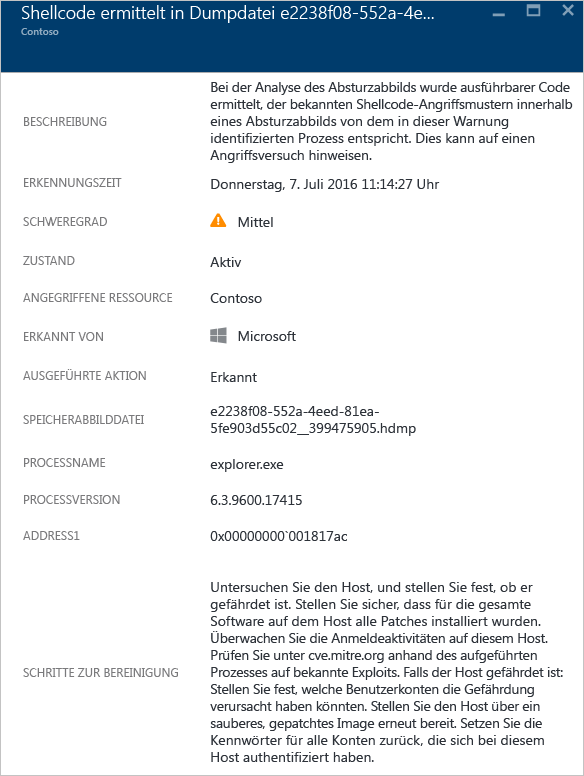

### Erkennung von Modul-Hijacking

In Windows werden DLLs (Dynamic Link Libraries) verwendet, um für Software die Nutzung von allgemeinen Windows-Systemfunktionen zu ermöglichen. „DLL-Hijacking“ tritt auf, wenn von Schadsoftware die DLL-Ladereihenfolge geändert wird, um schädliche Nutzlasten in den Arbeitsspeicher zu laden und darin beliebigen Code auszuführen. Diese Warnung weist darauf hin, dass bei der Absturzabbildanalyse das Laden eines Moduls aus zwei unterschiedlichen Pfaden erkannt wurde, wobei einer der geladenen Pfade von einem gemeinsamen binären Speicherort des Windows-Systems stammt.

Seriöse Softwareentwickler ändern gelegentlich die DLL-Ladereihenfolge zu nicht schädlichen Zwecken, z.B. zur Instrumentierung, um das Windows-Betriebssystem oder Windows-Anwendungen zu erweitern. Zur besseren Unterscheidung zwischen schädlichen und potenziell unkritischen Änderungen an der DLL-Ladereihenfolge überprüft Azure Security Center, ob ein geladenes Modul einem verdächtigen Profil entspricht. Das Ergebnis dieser Überprüfung wird im Feld „SIGNATURE“ der Warnung angegeben und im Schweregrad der Warnung, der Warnungsbeschreibung und der Schritte zur Behebung der Warnung widergespiegelt. Die Analyse der auf dem Datenträger befindlichen Kopie des Hijacking-Moduls, z.B. durch das Überprüfen der digitalen Signatur von Dateien oder das Durchführen eines Virenscans, kann weitere Informationen dazu liefern, ob das Hijacking-Modul unschädlich oder schädlich ist.

Zusätzlich zu den allgemeinen Feldern, die oben im Abschnitt „Erkennung von Shellcode“ beschrieben werden, verfügt diese Warnung über die folgenden Felder:

- SIGNATURE: Gibt an, ob das Hijacking-Modul einem Profil mit verdächtigem Verhalten entspricht.
- HIJACKEDMODULE: Name des Windows-Systemmoduls, das Opfer des Hijacking-Vorgangs geworden ist.
- HIJACKEDMODULEPATH: Pfad des Windows-Systemmoduls, das Opfer des Hijacking-Vorgangs geworden ist.
- HIJACKINGMODULEPATH: Enthält den Pfad des Hijacking-Moduls.

Hier ist ein Beispiel für diese Art von Warnung angegeben:

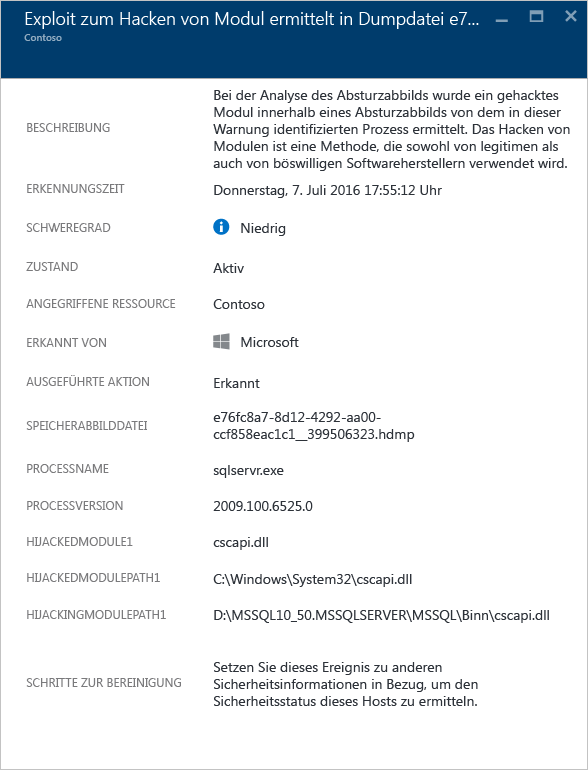

### Erkennung eines Windows-Maskerademoduls

Für Schadsoftware werden unter Umständen gängige Namen von Windows-Systembinärdateien (z.B. SVCHOST.EXE) oder Modulen (z.B. NTDLL.DLL) genutzt, um eine Verschleierung zu erzielen und die Schadsoftware vor Systemadministratoren zu verbergen. Diese Warnung gibt an, dass bei der Absturzabbildanalyse in der Absturzabbilddatei Module erkannt wurden, in denen Modulnamen des Windows-Systems verwendet werden, für die andere typische Kriterien von Windows-Modulen nicht erfüllt sind. Die Analyse der auf dem Datenträger befindlichen Kopie des Maskerademoduls kann weitere Informationen darüber liefern, ob das Modul unschädlich oder schädlich ist. Die Analyse kann Folgendes umfassen:

- Bestätigen, dass die fragliche Datei im Rahmen eines legitimen Softwarepakets bereitgestellt wird
- Überprüfen der digitalen Signatur der Datei
- Ausführen eines Virenscans für die Datei

Zusätzlich zu den allgemeinen Feldern, die oben im Abschnitt „Erkennung von Shellcode“ beschrieben werden, verfügt diese Warnung über die folgenden weiteren Felder:

- DETAILS: Beschreibt, ob die Metadaten des Moduls gültig sind und ob das Modul aus einem Systempfad geladen wurde.
- NAME: Gibt den Namen des Windows-Maskerademoduls an.
- PATH: Gibt den Pfad zum Windows-Maskerademodul an.

Diese Warnung extrahiert auch die jeweiligen Felder aus dem PE-Header des Moduls, z.B. „CHECKSUM“ und „TIMESTAMP“, und zeigt sie an. Diese Felder werden nur angezeigt, wenn sie im Modul vorhanden sind. Details zu diesen Feldern finden Sie in der [Microsoft PE- und COFF-Spezifikation](https://msdn.microsoft.com/windows/hardware/gg463119.aspx).

Hier ist ein Beispiel für diese Art von Warnung angegeben:

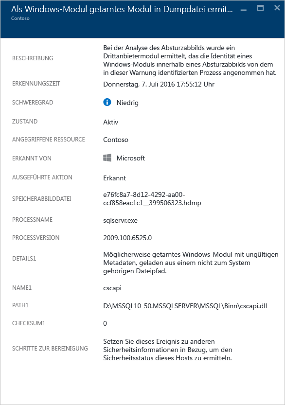

### Erkennung der Änderung einer Systembinärdatei

Mit Schadsoftware können wichtige Systembinärdateien geändert werden, um unerkannt auf Daten zuzugreifen oder sich heimlich dauerhaft auf einem kompromittierten System aufzuhalten. Diese Warnung gibt an, dass bei der Absturzabbildanalyse erkannt wurde, dass wichtige Binärdateien des Windows-Betriebssystems im Arbeitsspeicher oder auf dem Datenträger geändert wurden. Seriöse Softwareentwickler ändern Systemmodule im Arbeitsspeicher gelegentlich zu nicht schädlichen Zwecken, z.B. für Umwege oder aus Gründen der Anwendungskompatibilität. Zur besseren Unterscheidung zwischen schädlichen und potenziell unschädlichen Modulen wird von Azure Security Center überprüft, ob das geänderte Modul einem verdächtigen Profil entspricht. Das Ergebnis dieser Überprüfung wird im Schweregrad der Warnung, der Warnungsbeschreibung und der Schritte zur Behebung der Warnung widergespiegelt.

Zusätzlich zu den allgemeinen Feldern, die oben im Abschnitt „Erkennung von Shellcode“ beschrieben werden, verfügt diese Warnung über die folgenden weiteren Felder:

- MODULENAME: Enthält den Namen der geänderten Systembinärdatei.
- MODULEVERSION: Enthält die Version der geänderten Systembinärdatei.

Hier ist ein Beispiel für diese Art von Warnung angegeben:

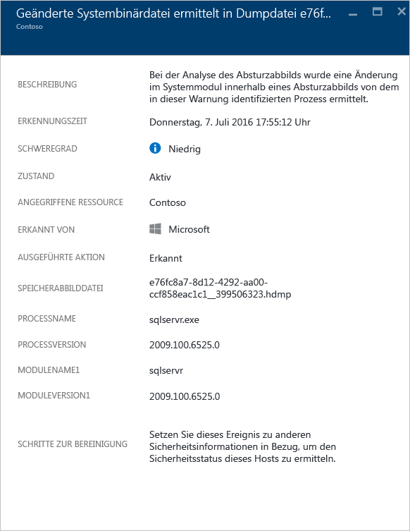

### Ausgeführter verdächtiger Prozess

Security Center identifiziert einen ausgeführten verdächtigen Prozesse auf dem virtuellen Zielcomputer und löst eine Warnung aus. Bei der Erkennung wird nicht nach dem spezifischen Namen gesucht, sondern nach dem dazugehörigen Parameter. So kann Security Center die ausführbare Datei auch dann erkennen, wenn sie vom Angreifer umbenannt wird.
 
Hier ist ein Beispiel für diese Art von Warnung angegeben:

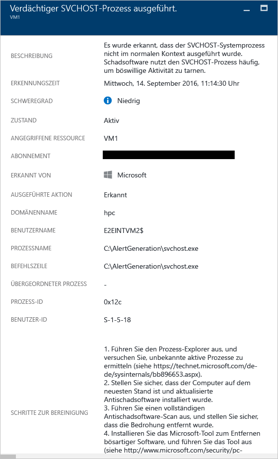

### Vermehrte Abfragen von Domänenkonten

Security Center kann mehrere Abfrageversuche für Domänenkonten erkennen. Dies wird von Angreifern normalerweise während der Netzwerkerkundung durchgeführt. Angreifer können dieses Verfahren nutzen, um die Domäne für folgende Zwecke abzufragen: Wer sind die Benutzer, wie lauten die Administratorkonten der Domäne, welche Computer sind Domänencontroller und welche potenziellen Vertrauensstellungen mit anderen Domänen bestehen für die Domäne?

Hier ist ein Beispiel für diese Art von Warnung angegeben:

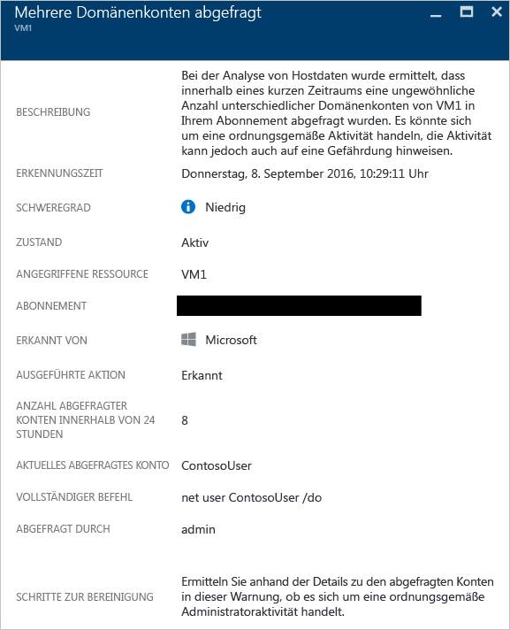

## Netzwerkanalyse

Bei der Security Center-Bedrohungserkennung für Netzwerke werden automatisch Sicherheitsinformationen für Ihren Azure IPFIX-Datenverkehr (Internet Protocol Flow Information Export) erfasst. Diese Informationen, bei denen es sich häufig um korrelierende Informationen aus mehreren Quellen handelt, werden analysiert, um Bedrohungen zu identifizieren.

### Erkennung von verdächtigem ausgehendem Datenverkehr

Für Netzwerkgeräte ist die Ermittlung und Profilerstellung nahezu genauso wie für andere Arten von Systemen möglich. Angreifer beginnen in der Regel mit der Portüberwachung bzw. Port-Sweeping. Im folgenden Beispiel ist es zu verdächtigem SSH-Datenverkehr von einer VM gekommen, für den die Gefahr eines Brute-Force-SSH-Angriffs oder Port-Sweeping-Angriffs gegen eine externe Ressource besteht.

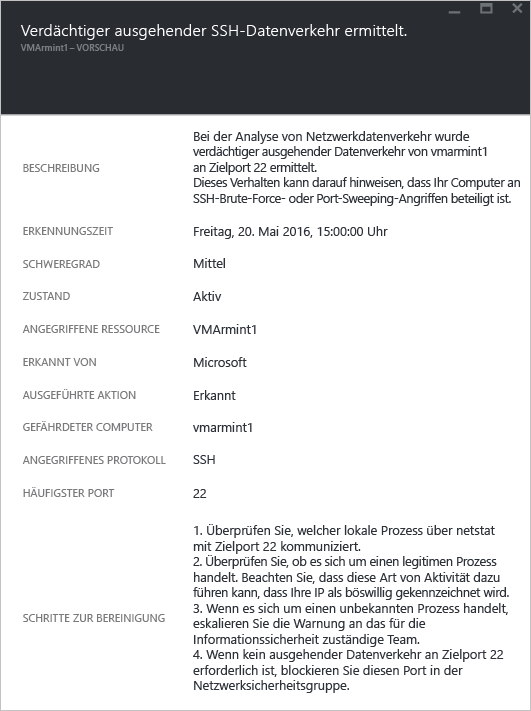

Diese Warnung enthält Informationen, mit denen Sie die für die Initiierung verwendete Ressource, den kompromittierten Computer, die Erkennungsdauer und das verwendete Protokoll und den Port identifizieren können. Auf diesem Blatt ist auch eine Liste mit Lösungsschritten angegeben, die Sie ausführen können, um das Problem zu beseitigen.

### Netzwerkkommunikation mit einem schädlichen Computer

Durch die Nutzung von Microsoft Threat Intelligence-Feeds kann Azure Security Center kompromittierte Computer erkennen, die mit schädlichen IP-Adressen kommunizieren. Häufig ist dies ein Befehls- und Steuerungszentrum (Command and Control Center). In diesem Fall hat Azure Security Center erkannt, dass für die Kommunikation die Schadsoftware „Pony Loader“ (auch als [Fareit](https://www.microsoft.com/security/portal/threat/encyclopedia/entry.aspx?Name=PWS:Win32/Fareit.AF) bekannt) verwendet wurde.

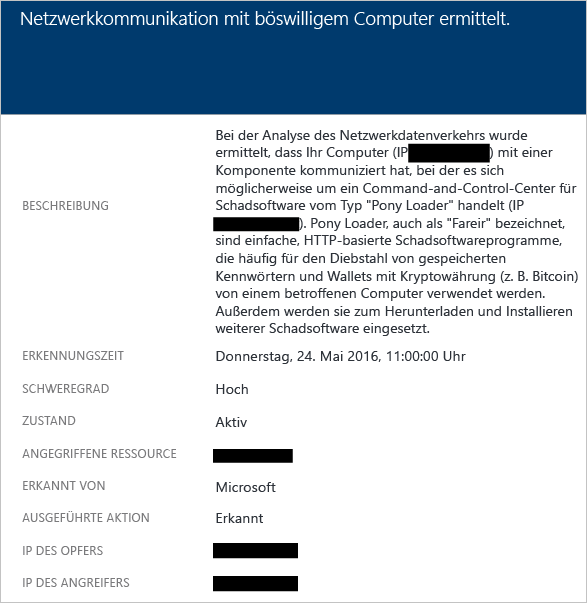

Diese Warnung enthält Informationen, mit denen Sie die für den Angriff verwendete Ressource, die Ziel-IP-Adresse, die IP-Adresse des Angreifers und die Erkennungsdauer identifizieren können.

[AZURE.NOTE] Aus Datenschutzgründen wurden die realen IP-Adressen aus diesem Screenshot entfernt.

### Möglichen Denial-of-Service-Angriff in ausgehender Richtung erkannt

Anomaler Netzwerkdatenverkehr, der von einem virtuellen Computer stammt, kann dazu führen, dass Security Center eine Warnung vor einem potenziellen Denial-of-Service-Angriff auslöst.
 
Hier ist ein Beispiel für diese Art von Warnung angegeben:

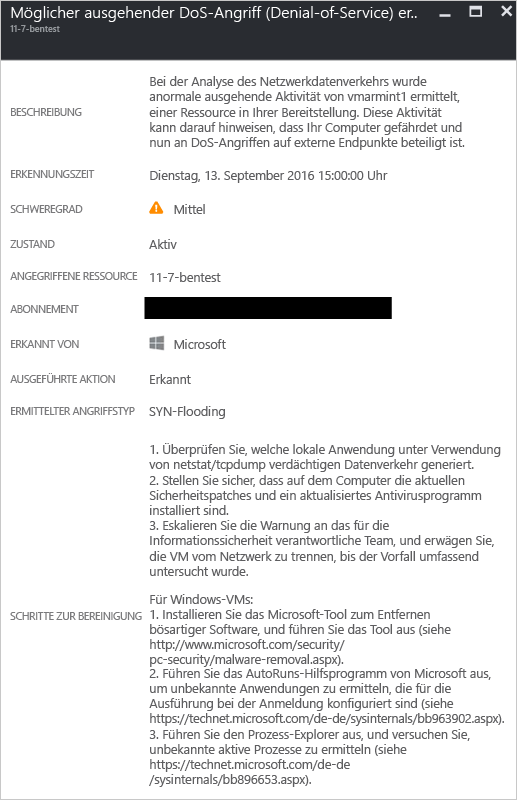

## Ressourcenanalyse

Bei der Security Center-Ressourcenanalyse liegt der Schwerpunkt auf PaaS-Diensten, z.B. der Integration in das Feature für die Azure SQL DB-Bedrohungserkennung (siehe [Erste Schritte mit der Bedrohungserkennung von SQL-Datenbank](../sql-database/sql-database-threat-detection-get-started.md)). Basierend auf den Analyseergebnissen aus diesen Bereichen löst Security Center eine ressourcenbezogene Warnung aus.

### Potenzielle Einschleusung von SQL-Befehlen

Eine Einschleusung von SQL-Befehlen ist ein Angriff, bei dem Schadcode in Zeichenfolgen eingefügt wird, die später zur Analyse und Ausführung an eine Instanz von SQL Server übergeben werden. Jedes Verfahren, bei dem SQL-Anweisungen erstellt werden, sollte auf Sicherheitsrisiken in Bezug auf Einschleusungen überprüft werden, da SQL Server alle syntaktisch gültigen Abfragen ausführt, die empfangen werden. Für die SQL-Bedrohungserkennung werden Machine Learning, Verhaltensanalyse und Anomalieerkennung genutzt, um verdächtige Ereignisse zu ermitteln, die in Ihren Azure SQL-Datenbanken unter Umständen auftreten. Beispiel:

- Versuchter Datenbankzugriff durch einen früheren Mitarbeiter
- Angriffe mit Einschleusung von SQL-Befehlen
- Ungewöhnlicher Zugriff auf eine Produktionsdatenbank durch einen Benutzer von zu Hause

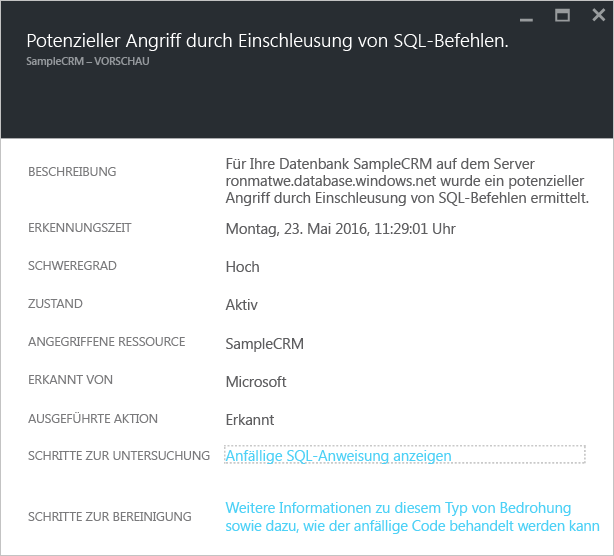

Diese Warnung enthält Informationen, mit denen Sie die angegriffene Ressource, die Erkennungsdauer und den Status des Angriffs identifizieren können. Außerdem ist ein Link zu weiteren Untersuchungsschritten angegeben.

### Anfälligkeit für die Einschleusung von SQL-Befehlen

Diese Warnung wird ausgelöst, wenn ein Anwendungsfehler in einer Datenbank erkannt wurde, bei dem es Hinweise auf eine mögliche Anfälligkeit für die Einschleusung von SQL-Befehlen gibt.

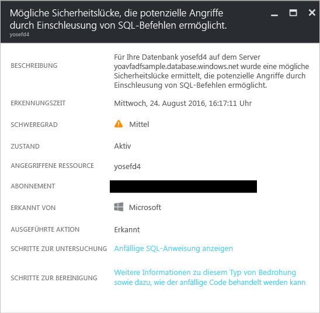

### Ungewöhnlicher Zugriff von unbekanntem Standort

Diese Warnung wird ausgelöst, wenn ein Zugriff von einer unbekannten IP-Adresse auf einem Server entdeckt wurde, der in der letzten Periode nicht aufgetreten ist.

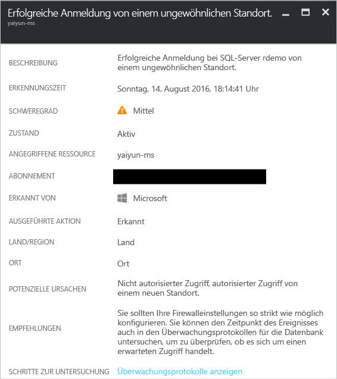

## Siehe auch

In diesem Dokument wurden die unterschiedlichen Arten von Sicherheitswarnungen in Security Center beschrieben. Weitere Informationen zu Security Center finden Sie in den folgenden Quellen:

- [Behandeln von Sicherheitswarnungen in Azure Security Center](security-center-incident.md)
- [Azure Security Center-Erkennungsfunktionen](security-center-detection-capabilities.md)
- [Planungs- und Betriebshandbuch für Azure Security Center](security-center-planning-and-operations-guide.md)
- [Azure Security Center – Häufig gestellte Fragen:](security-center-faq.md) Hier finden Sie häufig gestellte Fragen zur Verwendung des Diensts.
- [Azure Security Blog](http://blogs.msdn.com/b/azuresecurity/) (Blog zur Azure-Sicherheit): Hier finden Sie Blogbeiträge zur Azure-Sicherheit und -Compliance.

<!---HONumber=AcomDC_0921_2016-->