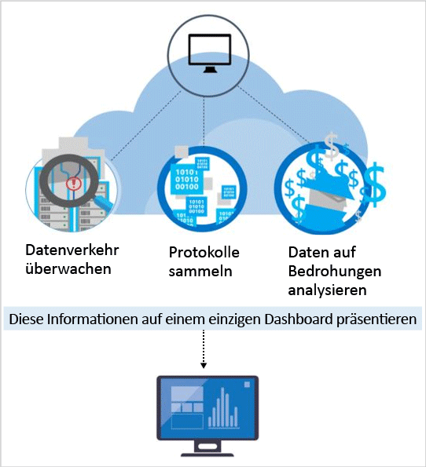

<properties
   pageTitle="Erkennungsfunktionen in Azure Security Center | Microsoft Azure"
   description="In diesem Dokument erfahren Sie, wie die Erkennungsfunktionen von Azure Security Center funktionieren."
   services="security-center"
   documentationCenter="na"
   authors="YuriDio"
   manager="swadhwa"
   editor=""/>

<tags
   ms.service="security-center"
   ms.topic="hero-article"
   ms.devlang="na"
   ms.tgt_pltfrm="na"
   ms.workload="na"
   ms.date="09/22/2016"
   ms.author="yurid"/>

# Azure Security Center-Erkennungsfunktionen
In diesem Dokument werden die erweiterten Erkennungsfunktionen von Azure Security Center beschrieben. Mit diesen Funktionen können aktive Bedrohungen Ihrer Microsoft Azure-Ressourcen identifiziert werden, und Sie erhalten die Einblicke, die zum schnellen Ergreifen von Maßnahmen erforderlich sind.

> [AZURE.NOTE] Im Standard-Tarif von Azure Security Center sind erweiterte Erkennungsverfahren verfügbar. Sie können auch eine kostenlose 90-Tage-Testversion nutzen. Über die [Sicherheitsrichtlinie](security-center-policies.md) können Sie die Tarifauswahl ändern. Weitere Informationen zu den Preisen finden Sie auf der [Security Center-Seite](https://azure.microsoft.com/pricing/details/security-center/).

## Reagieren auf die heutigen Bedrohungen
In den letzten 20 Jahren hat sich die Bedrohungslandschaft stark verändert. In der Vergangenheit mussten sich Unternehmen in der Regel nur Sorgen um eine mögliche Verunstaltung Ihrer Websites durch einzelne Angreifer machen, die häufig nur Ihre Fähigkeiten austesten wollten. Die Angreifer von heute sind dagegen viel besser vorbereitet und ausgerüstet. Sie verfolgen häufig bestimmte finanzielle oder strategische Ziele. Außerdem stehen ihnen mehr Ressourcen zur Verfügung, da sie von Staaten oder der organisierten Kriminalität finanziert werden.

Dies hat dazu geführt, dass Angreifer heutzutage sehr professionell vorgehen können. Sie sind nicht mehr daran interessiert, nur Websites zu verunstalten. Es geht vielmehr um das Stehlen von Informationen, Finanzkonten und privaten Daten. Diese Daten werden dann auf dem freien Markt zu Geld gemacht oder für bestimmte geschäftliche, politische oder militärische Zwecke genutzt. Noch gefährlicher als Angreifer mit finanziellen Motiven sind Angreifer, die in Netzwerke eindringen, um die Infrastruktur oder Personen zu schädigen.

Als Reaktion stellen Organisationen häufig verschiedene Punktlösungen bereit, die nach bekannten Angriffssignaturen suchen, um die Grenzen oder Endpunkte des Unternehmens abzusichern. Diese Lösungen neigen dazu, eine große Menge von so genannten Low-Fidelity-Warnungen zu generieren, die von einem Sicherheitsexperten selektiert und untersucht werden müssen. Die meisten Organisationen verfügen nicht über die Zeit und das Wissen, um auf diese Warnungen zu reagieren, sodass diese häufig nicht untersucht werden können. In der Zwischenzeit haben die Angreifer ihre Methoden weiterentwickelt und können viele signaturbasierte Verteidigungen umgehen und sich [an Cloudumgebungen anpassen](https://azure.microsoft.com/blog/detecting-threats-with-azure-security-center/). Neue Ansätze sind erforderlich, um neue Bedrohungen schnell identifizieren und die Erkennung und Reaktion beschleunigen zu können.

## Erkennen von und Reagieren auf Bedrohungen mit Azure Security Center

Microsoft-Sicherheitsexperten suchen ständig nach neuen Bedrohungen. Sie haben Zugriff auf umfassende Telemetriedaten, die auf der globalen Präsenz von Microsoft in der Cloud und in lokalen Umgebungen basieren. Aufgrund dieser weit reichenden und verschiedenartigen Sammlung von Datasets kann Microsoft neue Angriffsmuster und Trends für seine lokalen Privatkunden- und Unternehmensprodukte sowie für seine Onlinedienste erkennen. Auf diese Weise können die Erkennungsalgorithmen von Security Center schnell aktualisiert werden, wenn Angreifer neue und immer anspruchsvollere Exploit-Verfahren nutzen. So können Sie mit der rasanten Entwicklung von Bedrohungen Schritt halten.

Bei der Bedrohungserkennung von Security Center werden automatisch Sicherheitsinformationen von Ihren Azure-Ressourcen, aus dem Netzwerk und von verbundenen Partnerlösungen gesammelt. Diese Informationen, bei denen es sich häufig um korrelierende Informationen aus mehreren Quellen handelt, werden analysiert, um Bedrohungen zu identifizieren. Sicherheitswarnungen werden in Security Center zusammen mit Empfehlungen zur Lösung der Bedrohung priorisiert.

Für Security Center werden professionelle Sicherheitsanalysen genutzt, die weit über signaturbasierte Ansätze hinausgehen. Bahnbrechende Weiterentwicklungen der Big Data- und [Machine Learning](https://azure.microsoft.com/blog/machine-learning-in-azure-security-center/)-Technologie werden genutzt, um Ereignisse in der gesamten Cloud-Fabric auszuwerten. So können Bedrohungen erkannt werden, die bei Verwendung von manuellen Konzepten nicht identifiziert werden können, und die Entwicklung von Angriffen kann vorhergesagt werden. Zu diesen Sicherheitsanalysen gehört Folgendes:

- **Integrierte Informationen zu Bedrohungen**: Es wird nach bekannten Angreifern gesucht. Hierzu werden globale Bedrohungsinformationen (Threat Intelligence) von Microsoft-Produkten und -Diensten, von der Microsoft Digital Crimes Unit (DCU), vom Microsoft Security Response Center (MSRC) sowie von externen Feeds genutzt.
- **Verhaltensanalyse**: Es werden bekannte Muster angewendet, um schädliches Verhalten zu erkennen.
- **Anomalieerkennung**: Es werden statistische Profile erstellt, um typische Verlaufsdaten zu erhalten. Sie werden benachrichtigt, wenn es zu Abweichungen von der Baseline kommt, die einem potenziellen Angriffsvektor entsprechen.

### Threat Intelligence
Microsoft verfügt über eine große Menge von Informationen zu globalen Bedrohungen. Die Telemetriedaten stammen aus mehreren Quellen, z.B. Azure, Office 365, Microsoft CRM Online, Microsoft Dynamics AX, outlook.com, MSN.com, Microsoft Digital Crimes Unit (DCU) und Microsoft Security Response Center (MSRC). Die Sicherheitsexperten erhalten außerdem Informationen zu Bedrohungen, die zwischen großen Cloudanbietern ausgetauscht werden, und haben Threat Intelligence-Feeds von Drittanbietern abonniert. Azure Security Center kann diese Informationen verwenden, um Sie vor Bedrohungen durch bekannte Angreifer zu warnen. Beispiele hierfür sind:

- **Ausgehende Kommunikation an eine schädliche IP-Adresse**: Ausgehender Datenverkehr an ein bekanntes Botnet oder ins Darknet weist meist darauf hin, dass Ihre Ressource kompromittiert wurde und ein Angreifer versucht, Befehle im System auszuführen oder Daten zu entwenden. Azure Security Center vergleicht den Netzwerkdatenverkehr mit der globalen Bedrohungsdatenbank von Microsoft und warnt Sie, wenn eine Kommunikation mit einer schädlichen IP-Adresse erkannt wird.

## Verhaltensanalyse

Die Verhaltensanalyse ist ein Verfahren, bei dem Daten mit einer Sammlung bekannter Muster analysiert und verglichen werden. Bei diesen Mustern handelt es sich aber nicht nur um einfache Signaturen. Sie werden anhand von komplexen Machine Learning-Algorithmen bestimmt, die auf große Datasets angewendet werden. Außerdem werden sie anhand einer sorgfältigen Analyse von schädlichem Verhalten durch erfahrene Analysten bestimmt. Azure Security Center kann die Verhaltensanalyse verwenden, um kompromittierte Ressourcen basierend auf der Analyse der Protokolle von virtuellen Computern, virtuellen Netzwerkgeräten, Fabric-Protokolle, Absturzabbilder und anderen Quellen zu identifizieren.

Außerdem ist eine Korrelation mit anderen Signalen vorhanden, damit weitere Beweise für eine größere Aktion ermittelt werden können. So können Ereignisse identifiziert werden, die mit vorhandenen Indikatoren für eine Kompromittierung übereinstimmen. Beispiele hierfür sind:

- **Ausführung von verdächtigen Prozessen**: Angreifer nutzen verschiedene Verfahren, um unbemerkt Schadsoftware auszuführen. Beispielsweise können Angreifer Schadsoftware mit dem Namen regulärer Systemdateien versehen, diese dann aber an einem anderen Speicherort ablegen. Alternativ können sie einen Namen verwenden, der dem Namen einer unbedenklichen Datei ähnelt, oder die tatsächliche Dateinamenerweiterung verschleiern. Security Center modelliert Prozessverhalten und überwacht die Prozessausführung, um Ausreißer dieser Art zu erkennen.
- **Versteckte Schadsoftware und versuchte Ausnutzung von Schwachstellen**: Professionelle Schadsoftware kann herkömmliche Antischadsoftware-Produkte umgehen, indem sie entweder nie auf den Datenträger schreibt oder auf dem Datenträger gespeicherte Softwarekomponenten verschlüsselt. Schadsoftware dieser Art kann aber mithilfe der Arbeitsspeicheranalyse erkannt werden, da die Schadsoftware Spuren im Arbeitsspeicher hinterlassen muss, um funktionieren zu können. Beim Absturz von Software wird in einem Absturzabbild ein Teil des Arbeitsspeichers zum Zeitpunkt des Absturzes erfasst. Indem die Arbeitsspeicherdaten im Absturzabbild analysiert werden, kann Azure Security Center Verfahren erkennen, die für folgende Zwecke verwendet werden: Ausnutzen von Schwachstellen in Software, Zugreifen auf vertrauliche Daten und Bewegen auf einem kompromittierten Computer ohne Auswirkung auf die Leistung des Computers.
- **Seitwärtsbewegung und interne Aufklärung**: Um wertvolle Daten in einem kompromittierten Netzwerk ausfindig machen und abschöpfen zu können, versuchen Angreifer häufig, vom kompromittierten Computer aus auf andere Computer im gleichen Netzwerk zuzugreifen. Security Center überwacht die Verarbeitungs- und Anmeldeaktivitäten, um versuchte Aktionen aufzudecken, mit denen Angreifer ihre Basis im Netzwerk ausbauen möchten, z.B. Ausführung von Remotebefehlen im Netzwerk und Kontoauflistung.
- **Schädliche PowerShell-Skripts**: PowerShell wird von Angreifern verwendet, um mit den unterschiedlichsten Zielen Schadcode auf virtuellen Zielcomputern auszuführen. Security Center untersucht die PowerShell-Aktivitäten auf Beweise für verdächtige Vorgänge.
- **Ausgehende Angriffe**: Angreifer nehmen häufig Cloudressourcen ins Visier, um diese zur Durchführung weiterer Angriffe zu nutzen. Kompromittierte virtuelle Computer können beispielsweise verwendet werden, um Brute-Force-Angriffe auf andere virtuelle Computer zu starten, Spam zu senden oder nach offenen Ports und anderen Geräten im Internet zu suchen. Indem Machine Learning-Verfahren auf den Netzwerkdatenverkehr angewendet werden, kann Security Center erkennen, wenn ausgehende Netzwerkkommunikation außerhalb der Norm liegt. In Bezug auf Spam korreliert Security Center außerdem ungewöhnlichen E-Mail-Datenverkehr mit Informationen aus Office 365, um zu ermitteln, ob die E-Mail vermutlich schädlich oder das Ergebnis einer legitimen E-Mail-Kampagne ist.

### Anomalieerkennung

Azure Security Center nutzt auch die Anomalieerkennung, um Bedrohungen zu identifizieren. Im Gegensatz zur Verhaltensanalyse (basiert auf bekannten Mustern, die aus großen Datasets abgeleitet werden) ist die Anomalieerkennung „personalisierter“ und nutzt Baselines, die speziell für Ihre Bereitstellungen gelten. Machine Learning wird angewendet, um die normale Aktivität für Ihre Bereitstellungen zu ermitteln. Anschließend werden Regeln generiert, um Ausreißerbedingungen zu definieren, die ein Sicherheitsereignis darstellen können. Hier ist ein Beispiel angegeben:

- **Eingehende RDP/SSH-Brute-Force-Angriffe**: Es kann sein, dass Ihre Bereitstellungen gleichzeitig stark ausgelastete virtuelle Computer mit vielen täglichen Anmeldungen und andere virtuelle Computer mit sehr wenigen oder gar keinen Anmeldungen umfassen. Azure Security Center kann eine Baseline der Anmeldeaktivität für diese virtuellen Computer ermitteln und anhand von Machine Learning-Verfahren definieren, welche Aktionen außerhalb der normalen Anmeldeaktivität liegen. Es wird unter Umständen eine Warnung generiert, wenn die Anzahl von Anmeldungen, die Tageszeit der Anmeldungen, die Standorte, von denen aus die Anmeldungen angefordert werden, oder andere Anmeldemerkmale stark von der Baseline abweichen. Auch hier wird wieder per Machine Learning-Verfahren ermittelt, was relevant ist.

## Fortlaufende Threat Intelligence-Überwachung

Für Azure Security Center arbeiten Sicherheitsforschungs- und Data Science-Teams, die ständig Änderungen der Bedrohungslandschaft überwachen. Dies umfasst Folgendes:

- **Threat Intelligence-Überwachung**: Informationen zu Bedrohungen (Threat Intelligence) beinhalten Mechanismen, Indikatoren, Auswirkungen und nützliche Hinweise zu vorhandenen oder neuen Bedrohungen. Diese Informationen werden in der Sicherheitscommunity bereitgestellt, und Microsoft überwacht fortlaufend Threat Intelligence-Feeds von internen und externen Quellen.
- **Signalaustausch**: Die Erkenntnisse der Sicherheitsteams aus dem großen Microsoft-Portfolio mit Clouddiensten und lokalen Diensten, Servern und Clientendpunkt-Geräten werden ausgetauscht und analysiert.
- **Microsoft-Sicherheitsexperten**: Ständiger Austausch mit Teams von Microsoft, die sich mit speziellen Sicherheitsfeldern beschäftigen, z.B. Forensik und Erkennung von Webangriffen.
- **Erkennungsoptimierung**: Algorithmen werden für echte Kundendatasets ausgeführt, und Sicherheitsexperten arbeiten mit Kunden zusammen, um die Ergebnisse zu prüfen. Richtige und falsche Positivmeldungen werden verwendet, um Machine Learning-Algorithmen zu verfeinern.

Diese kombinierten Verfahren führen zu neuen und verbesserten Erkennungsergebnissen, von denen Sie sofort profitieren können. Sie müssen dabei nichts unternehmen.

## Siehe auch
In diesem Dokument wurde beschrieben, wie die Erkennungsfunktionen von Azure Security Center funktionieren. Weitere Informationen zu Security Center finden Sie in den folgenden Quellen:

- [Planungs- und Betriebshandbuch für Azure Security Center](security-center-planning-and-operations-guide.md)
- [Verwalten von und Reagieren auf Sicherheitswarnungen in Azure Security Center](security-center-managing-and-responding-alerts.md)
- [Sicherheitswarnungen nach Typ in Azure Security Center](security-center-alerts-type.md)
- [Überwachen der Sicherheitsintegrität in Azure Security Center:](security-center-monitoring.md) Erfahren Sie, wie Sie die Integrität Ihrer Azure-Ressourcen überwachen.
- [Überwachen von Partnerlösungen mit Azure Security Center:](security-center-partner-solutions.md) Erfahren Sie, wie der Integritätsstatus Ihrer Partnerlösungen überwacht wird.
- [Azure Security Center – Häufig gestellte Fragen:](security-center-faq.md) Hier finden Sie häufig gestellte Fragen zur Verwendung des Diensts.
- [Azure Security Blog](http://blogs.msdn.com/b/azuresecurity/) (Blog zur Azure-Sicherheit): Hier finden Sie Blogbeiträge zur Sicherheit und Compliance von Azure.

<!---HONumber=AcomDC_0928_2016-->