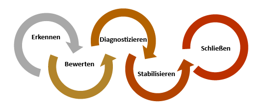
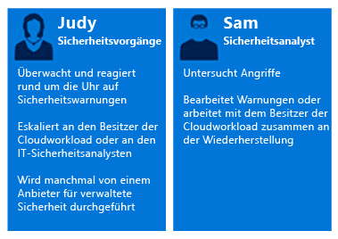
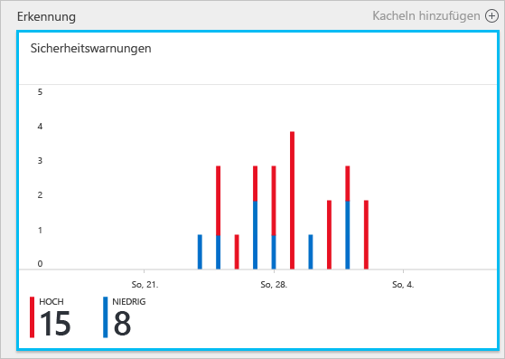
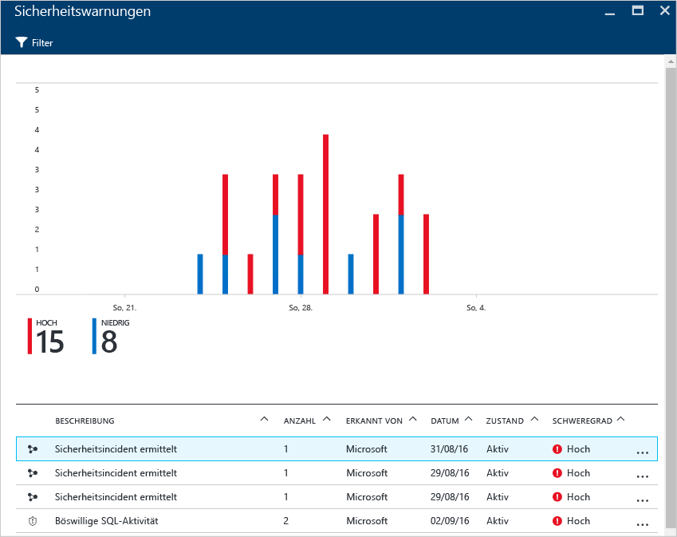
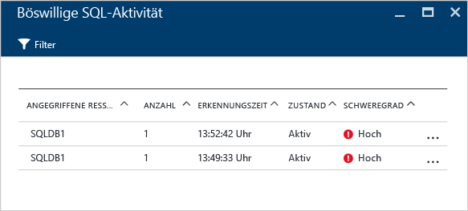
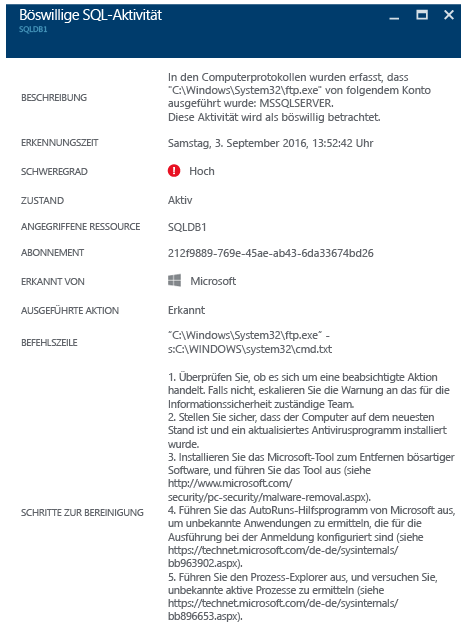

# Verwenden von Azure Security Center zur Reaktion auf Vorfälle
Viele Organisationen lernen erst nach einem Angriff, wie auf Sicherheitsvorfälle reagiert werden sollte. Zur Reduzierung von Kosten und Schäden ist es wichtig, dass ein Plan zur Reaktion auf Vorfälle vorhanden ist, bevor es zu einem Angriff kommt. Sie können Azure Security Center in unterschiedlichen Phasen einer Reaktion auf Vorfälle nutzen.

## Planen der Reaktion auf Vorfälle
Ein effektiver Plan basiert auf drei Hauptmaßnahmen, und zwar auf der Fähigkeit, den Schutz, die Erkennung und die Reaktion auf Bedrohungen zu gewährleisten. Beim Schutz geht es um die Verhinderung von Vorfällen, bei der Erkennung sollen Bedrohungen zu einem frühen Zeitpunkt erkannt werden, und bei der Reaktion geht es um das Aussperren des Angreifers und das Wiederherstellen der Systeme, um die Auswirkungen einer Sicherheitsverletzung möglichst gering zu halten.

In diesem Artikel werden die Phasen zur Reaktion auf Sicherheitsvorfälle aus dem Artikel [Microsoft Azure Security Response in the Cloud](https://gallery.technet.microsoft.com/Azure-Security-Response-in-dd18c678) (Microsoft Azure Security Response in der Cloud) verwendet. Diese sind in der folgenden Abbildung dargestellt:

Sie können Security Center während der Erkennungs-, Bewertungs- und Diagnosephase verwenden. Es folgen Beispiele dafür, wie Security Center in den drei ersten Phasen der Reaktion auf Vorfälle nützlich sein kann:

* **Erkennen**: Prüfen des ersten Anzeichens zur Untersuchung eines Vorfalls
  * Beispiel: Überprüfen der ersten Bestätigung, dass eine Sicherheitswarnung mit hoher Priorität im Security Center-Dashboard ausgelöst wurde.
* **Bewerten**: Durchführen der ersten Bewertung, um weitere Informationen zur verdächtigen Aktivität zu erhalten
  * Beispiel: Beschaffen weiterer Informationen zur Sicherheitswarnung.
* **Diagnostizieren**: Durchführen einer technischen Untersuchung und Identifizieren von Strategien in Bezug auf Einschluss, Eindämmung und Problemlösung
  * Beispiel: Ausführen der Schritte zur Behebung, die von Security Center in der jeweiligen Sicherheitswarnung angegeben werden.

Im folgenden Szenario wird gezeigt, wie Sie Security Center während der Erkennungs-, Bewertungs- und Diagnose-/Reaktionsphasen eines Sicherheitsvorfalls nutzen können. In Security Center ist ein [Sicherheitsvorfall](security-center-incident.md) eine Aggregation aller Warnungen für eine Ressource, die [Kill Chain](https://blogs.technet.microsoft.com/office365security/addressing-your-cxos-top-five-cloud-security-concerns/)-Mustern entsprechen. Vorfälle werden auf der Kachel bzw. dem Blatt [Sicherheitswarnungen](security-center-managing-and-responding-alerts.md) angezeigt. Bei einem Vorfall wird die Liste mit den dazugehörigen Warnungen eingeblendet, damit Sie mehr Informationen zu den einzelnen Fällen einsehen können. In Security Center werden auch eigenständige Sicherheitswarnungen angezeigt, die ebenfalls zum Nachverfolgen einer verdächtigen Aktivität verwendet werden können.

## Szenario
Contoso hat vor Kurzem einige lokale Ressourcen zu Azure migriert. Darunter sind auch einige VM-basierte Branchenworkloads und SQL-Datenbanken. Das Core Computer Security Incident Response Team (CSIRT) von Contoso hat ein Problem mit der Untersuchung von Sicherheitsvorfällen, da Security Intelligence-Funktionen nicht in die aktuellen Tools für die Reaktion auf Vorfälle integriert sind. Diese unzureichende Integration führt zu einem Problem während der Erkennungsphase (zu viele falsch positive Ergebnisse) und auch während der Bewertungs- und Diagnosephase. Im Rahmen der Migration wurde die Entscheidung getroffen, Security Center zu verwenden, um dieses Problem zu beheben.

Die erste Phase dieser Migration endete nach der Einbindung aller Ressourcen und der Umsetzung aller Sicherheitsempfehlungen aus Security Center. Contoso CSIRT ist der zentrale Anlaufpunkt für Vorfälle, die sich auf die Computersicherheit beziehen. Das Team besteht aus einer Gruppe von Personen, die für die Bearbeitung aller Sicherheitsvorfälle zuständig sind. Die Teammitglieder haben klar definierte Pflichten, damit sichergestellt ist, dass kein Verantwortungsbereich offen bleibt.

In diesem Szenario konzentrieren wir uns auf die Rollen der folgenden „Personae“, die Teil des Contoso CSIRT sind:

Judy arbeitet im Security Operations-Bereich. Zu ihren Aufgaben zählen:

* Überwachen von und Reagieren auf Sicherheitsbedrohungen rund um die Uhr
* Eskalieren an den Besitzer der Cloudworkload oder den Sicherheitsanalysten (falls erforderlich)

Sam ist Security Analyst und für folgende Aufgaben verantwortlich:

* Untersuchen von Angriffen
* Lösen von Warnungen
* Zusammenarbeiten mit Besitzern von Workloads zur Ermittlung und Anwendung von Lösungen

Sie sehen, dass Judy und Sam für unterschiedliche Aufgaben verantwortlich sind und zusammenarbeiten müssen, um Informationen aus Security Center auszutauschen.

## Empfohlene Lösung
Da Judy und Sam unterschiedliche Rollen haben, nutzen sie jeweils andere Bereiche von Security Center, um die benötigten Informationen für ihre täglichen Aktivitäten zu erhalten. Judy nutzt **Sicherheitswarnungen** im Rahmen der täglichen Überwachungsarbeit.

Judy nutzt Sicherheitswarnungen während der Erkennungs- und Bewertungsphase. Nachdem Judy die erste Bewertung durchgeführt hat, kann sie das Problem an Sam eskalieren, falls eine weiter gehende Untersuchung erforderlich ist. An diesem Punkt nutzt Sam die Informationen von Security Center – ggf. auch in Verbindung mit anderen Datenquellen –, um zur Phase „Diagnose“ zu gelangen.

## Implementieren dieser Lösung
Zur Veranschaulichung der Nutzung von Azure Security Center bei einer Reaktion auf einen Vorfall folgen wir den Schritten von Judy in den Phasen „Erkennen“ und „Bewerten“ und sehen uns dann an, wie Sam beim Diagnostizieren des Problems vorgeht.

### Erkennungs- und Bewertungsphase für die Reaktion auf Vorfälle
Judy hat sich am Azure-Portal angemeldet und verwendet die Security Center-Konsole. Im Rahmen ihrer täglichen Überwachungsaktivitäten überprüft sie Sicherheitswarnungen mit hoher Priorität, indem sie die folgenden Schritte ausführt:

1. Klicken Sie auf die Kachel **Sicherheitswarnungen**, und greifen Sie auf das Blatt **Sicherheitswarnungen** zu.
    
   
   > [!NOTE]
   > In diesem Szenario führt Judy eine Bewertung der Warnung zu einer Aktivität mit schädlichen SQL-Befehlen durch. Dies ist in der Abbildung oben dargestellt.
   > 
   > 
2. Klicken Sie auf die Warnung **Malicious SQL activity** (Aktivität mit schädlichen SQL-Befehlen), und überprüfen Sie die angegriffenen Ressourcen auf dem Blatt **Malicious SQL Activity** (Aktivität mit schädlichen SQL-Befehlen):  
   
    Auf diesem Blatt kann Judy sich Notizen dazu machen, welche Ressourcen angegriffen wurden, wie oft der Angriff durchgeführt wurde und wann er erkannt wurde.
3. Klicken Sie auf die **Angegriffene Ressource** , um weitere Informationen zum Angriff zu erhalten.

Nach dem Lesen der Beschreibung ist Judy davon überzeugt, dass es sich nicht um ein falsch positives Ergebnis handelt und dass die Eskalation an Sam erforderlich ist.

### Phase bei der Reaktion auf Vorfälle: Diagnose
Sam erhält die Informationen zu diesem Fall von Judy und beginnt damit, die von Security Center vorgeschlagenen Lösungsschritte zu sichten.

### Zusätzliche Ressourcen
Das Incident Response Team kann auch die [Security Center Power BI](security-center-powerbi.md)-Funktion nutzen, um verschiedene Arten von Berichten anzuzeigen. Diese Berichte können bei der weiteren Untersuchung und beim Visualisieren, Analysieren und Filtern von Empfehlungen und Sicherheitswarnungen hilfreich sein. Für Unternehmen mit einer eigenen SIEM-Lösung (Security Information and Event Management), die zur Untersuchung eingesetzt wird, ist auch die [Integration von Security Center in die Lösung](security-center-integrating-alerts-with-log-integration.md) möglich. Sie können auch Azure-Überwachungsprotokolle und VM-Sicherheitsereignisse integrieren, indem Sie das [Azure-Tool für die Integration von Protokollen](https://blogs.msdn.microsoft.com/azuresecurity/2016/07/21/microsoft-azure-log-integration-preview/) verwenden. Zum Untersuchen eines Angriffs können Sie diese Informationen zusammen mit den Informationen verwenden, die von Security Center bereitgestellt werden.

## Zusammenfassung
Es ist für Ihre Organisation sehr wichtig, vor dem Eintreten eines Vorfalls ein Team zusammenzustellen. Dies hat einen positiven Einfluss auf den Umgang mit Sicherheitsvorfällen. Mit den richtigen Tools für die Überwachung von Ressourcen kann das Team präzise Schritte zur Lösung eines Sicherheitsvorfalls ausführen. Mit den [Erkennungsfunktionen](security-center-detection-capabilities.md) von Security Center erhält die IT-Abteilung hilfreiche Werkzeuge zum schnellen Reagieren auf Sicherheitsvorfälle und Lösen von Sicherheitsproblemen.

<!--HONumber=Nov16_HO2-->

