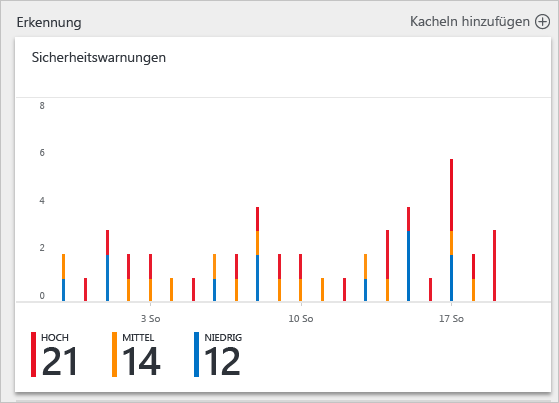
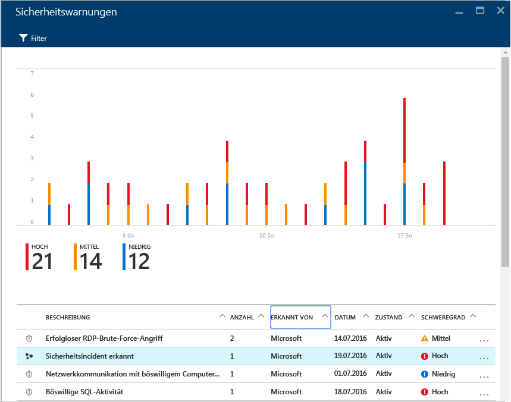
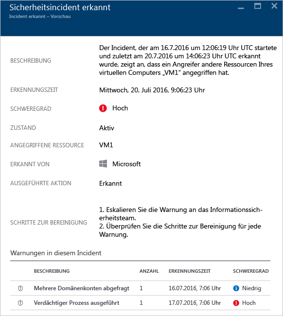
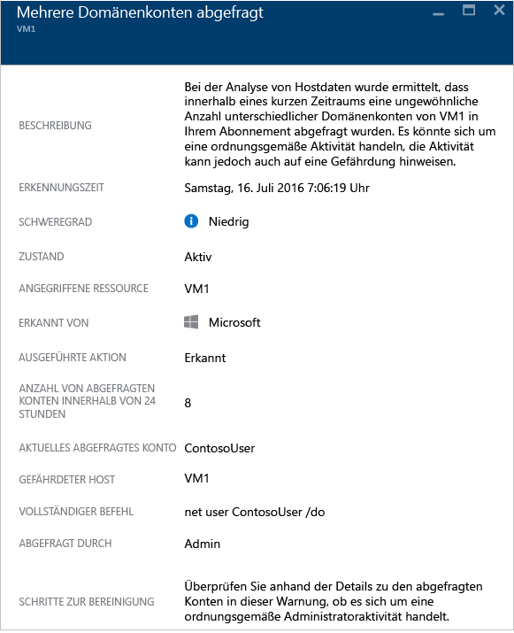

# Behandeln von Sicherheitswarnungen in Azure Security Center
Das Selektieren und Untersuchen von Sicherheitswarnungen kann auch für sehr erfahrene Sicherheitsanalysten zeitaufwändig sein, und häufig ist nur schwer zu erkennen, wo überhaupt begonnen werden soll. Mithilfe von [Analysen](security-center-detection-capabilities.md) zum Verknüpfen der Informationen der einzelnen [Sicherheitswarnungen](security-center-managing-and-responding-alerts.md) kann Security Center Ihnen eine zentrale Übersicht über einen Angriffsversuch und alle zugehörigen Warnungen bieten. So können Sie schnell überblicken, welche Aktionen der Angreifer unternommen hat und welche Ressourcen betroffen sind.

In diesem Dokument wird beschrieben, wie Sie die Sicherheitswarnungsfunktionen in Security Center verwenden, um die Behandlung von Sicherheitsvorfällen zu unterstützen.

## Was ist ein Sicherheitsvorfall?
In Security Center ist ein Sicherheitsvorfall eine Aggregation aller Warnungen für eine Ressource, die [Kill Chain](https://blogs.technet.microsoft.com/office365security/addressing-your-cxos-top-five-cloud-security-concerns/)-Mustern entsprechen. Vorfälle werden auf der Kachel bzw. dem Blatt [Sicherheitswarnungen](security-center-managing-and-responding-alerts.md) angezeigt. Bei einem Vorfall wird die Liste mit den dazugehörigen Warnungen eingeblendet, damit Sie mehr Informationen zu den einzelnen Fällen einsehen können.

## Verwalten von Sicherheitsvorfällen
Aktuelle Sicherheitsvorfälle können auf der Kachel „Sicherheitswarnungen“ geprüft werden. Greifen Sie auf das Azure-Portal zu, und führen Sie die unten angegebenen Schritte aus, um jeweils weitere Details zu einem Sicherheitsvorfall anzuzeigen:

1. Auf dem Security Center-Dashboard sehen Sie die Kachel **Sicherheitswarnungen** .

    

2. Klicken Sie auf diese Kachel, um sie zu erweitern. Wenn ein Sicherheitsvorfall erkannt wird, wird er im Diagramm für die Sicherheitswarnungen eingeblendet, wie hier dargestellt:

    

3. Beachten Sie, dass die Beschreibung des Sicherheitsvorfalls im Gegensatz zu anderen Warnungen ein anderes Symbol enthält. Klicken Sie darauf, um weitere Details zu diesem Vorfall anzuzeigen.

    

4. Auf dem Blatt **Vorfall** sind weitere Details zum Sicherheitsvorfall angegeben. Hierzu zählen beispielsweise die vollständige Beschreibung des Vorfalls, der Schweregrad (in diesem Fall „Hoch“) und der aktuelle Status des Vorfalls – hier noch *aktiv*, was bedeutet, dass der Benutzer noch keine Maßnahmen für den Vorfall ergriffen hat (durch Klicken auf den Vorfall mit der rechten Maustaste auf dem Blatt **Sicherheitswarnungen**). Darüber hinaus werden die angegriffene Ressource (hier *VM1*), die Lösungsschritte und im unteren Bereich die in diesem Vorfall enthaltenen Warnungen angezeigt. Weitere Informationen zu den einzelnen Warnungen erhalten Sie, indem Sie auf die jeweilige Warnung klicken. Daraufhin wird ein weiteres Blatt geöffnet, wie hier dargestellt:

    

Die Informationen auf diesem Blatt variieren je nach Warnung. Weitere Informationen zur Verwaltung dieser Warnungen finden Sie unter [Verwalten von und Reagieren auf Sicherheitswarnungen in Azure Security Center](security-center-managing-and-responding-alerts.md) . Wichtige Aspekte zu dieser Funktion:

* Mit einem neuen Filter können Sie Ihre Ansicht wie gewünscht anpassen (Nur Vorfall, Nur Warnungen oder beides).
* Die gleiche Warnung kann als Teil eines Vorfalls vorhanden sein (falls zutreffend) und als eigenständige Warnung angezeigt werden.

## Weitere Informationen
In diesem Dokument haben Sie erfahren, wie Sie die Sicherheitsvorfallfunktion in Security Center verwenden. Weitere Informationen zu Security Center finden Sie in den folgenden Quellen:

* [Verwalten von und Reagieren auf Sicherheitswarnungen in Azure Security Center](security-center-managing-and-responding-alerts.md)
* [Azure Security Center-Erkennungsfunktionen](security-center-detection-capabilities.md)
* [Planungs- und Betriebshandbuch für Azure Security Center](security-center-planning-and-operations-guide.md)
* [Verwalten von und Reagieren auf Sicherheitswarnungen in Azure Security Center](security-center-managing-and-responding-alerts.md)
* [Azure Security Center – Häufig gestellte Fragen](security-center-faq.md): Hier finden Sie häufig gestellte Fragen zur Verwendung des Diensts.
* [Azure Security Blog](http://blogs.msdn.com/b/azuresecurity/)(Blog zur Azure-Sicherheit): Hier finden Sie Blogbeiträge zur Sicherheit und Compliance von Azure.

<!--HONumber=Feb17_HO1-->

