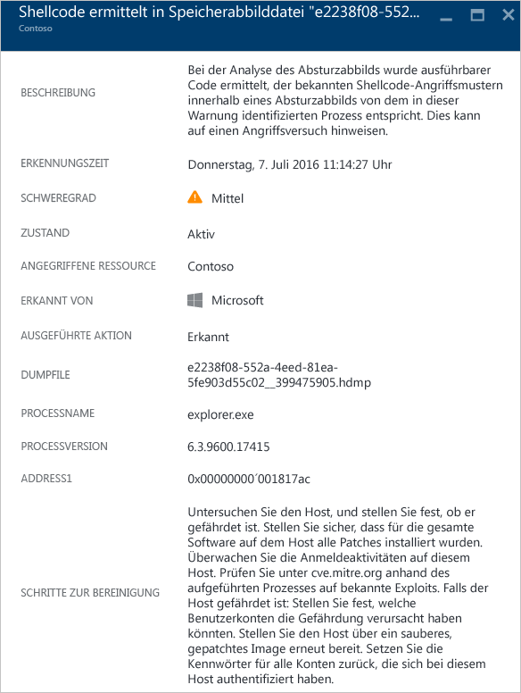
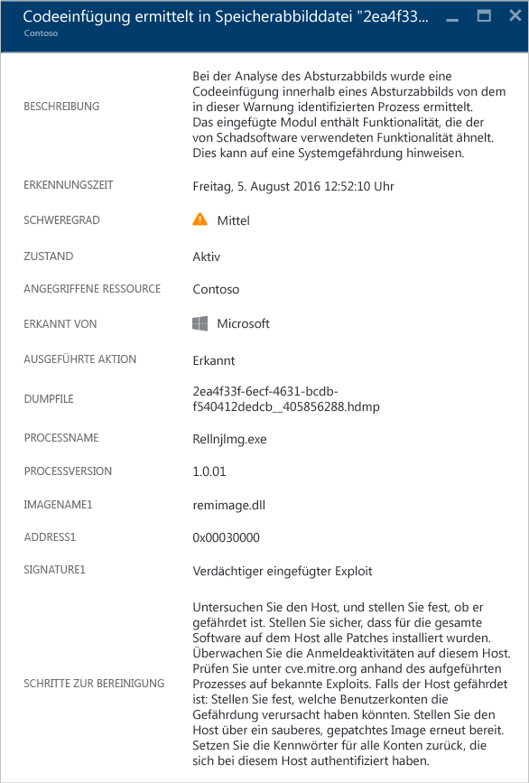
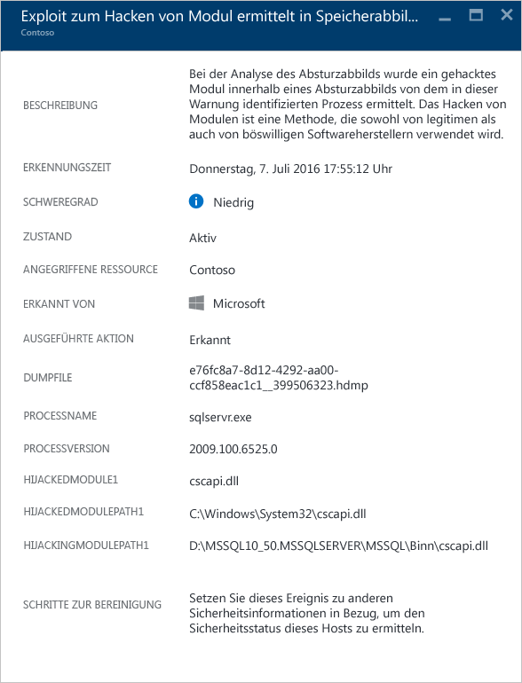
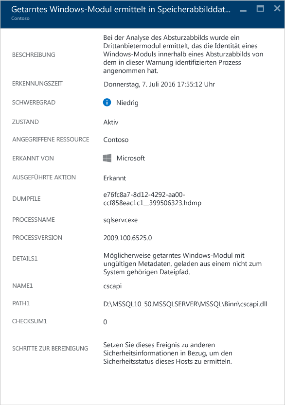
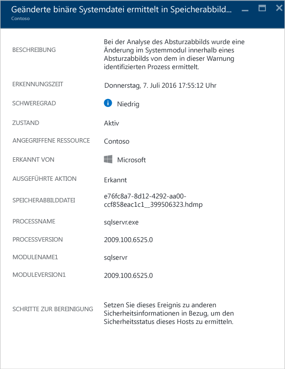

<properties
   pageTitle="Verwalten von und Reagieren auf Sicherheitswarnungen in Azure Security Center | Microsoft Azure"
   description="In diesem Dokument erfahren Sie, wie Sie Azure Security Center-Funktionen verwenden, um Sicherheitswarnungen zu verwalten und auf diese zu reagieren."
   services="security-center"
   documentationCenter="na"
   authors="YuriDio"
   manager="swadhwa"
   editor=""/>

<tags
   ms.service="security-center"
   ms.topic="hero-article"
   ms.devlang="na"
   ms.tgt_pltfrm="na"
   ms.workload="na"
   ms.date="08/07/2016"
   ms.author="yurid"/>

# Verwalten von und Reagieren auf Sicherheitswarnungen in Azure Security Center
In diesem Dokument erfahren Sie, wie Sie Azure Security Center verwenden, um Sicherheitswarnungen zu verwalten und auf diese zu reagieren.

## Was sind Sicherheitswarnungen?
Security Center erfasst, analysiert und vereinigt automatisch Protokolldaten von Ihren Azure-Ressourcen, vom Netzwerk und von verbundenen Partnerlösungen, z.B. Lösungen zum Schutz von Firewalls und Endpunkten, um echte Bedrohungen zu erkennen und falsch positive Ergebnisse zu reduzieren. Eine Liste mit priorisierten Sicherheitswarnungen wird im Security Center zusammen mit den Informationen angezeigt, die Sie zum schnellen Untersuchen des Problems benötigen. Außerdem sind Empfehlungen zum Reagieren auf einen Angriff vorhanden. Azure Security Center aggregiert auch Warnungen, die Kill Chain-Mustern entsprechen, in [Vorfällen](security-center-incident.md).

> [AZURE.NOTE] Weitere Informationen zur Funktionsweise der Security Center-Erkennungsfunktionen finden Sie unter [Azure Security Center-Erkennungsfunktionen](security-center-detection-capabilities.md).

## Verwalten von Sicherheitswarnungen

Sie können die aktuellen Warnungen prüfen, indem Sie sich die Kachel **Sicherheitswarnungen** ansehen. Öffnen Sie das Azure-Portal, und gehen Sie folgendermaßen vor, wenn Sie weitere Details zu jeder Warnung anzeigen möchten:

1. Auf dem Security Center-Dashboard sehen Sie die Kachel **Sicherheitswarnungen**.

    

2.  Klicken Sie auf die Kachel, um das Blatt **Sicherheitswarnungen** zu öffnen, das weitere Details zu den Warnungen enthält (siehe Abbildung unten).

    

Im unteren Teil dieses Blatts sind die Details für die einzelnen Warnungen zu sehen. Zum Sortieren klicken Sie auf die Spalte, nach der Sie sortieren möchten. Die Spalten sind wie folgt definiert:

- **Warnung**: Eine kurze Erläuterung der Warnung.
- **Anzahl**: Eine Liste aller Warnungen dieses bestimmten Typs, die an einem bestimmten Tag erkannt wurden.
- **Erkannt von**: Der Dienst, der die Warnung ausgelöst hat.
- **Datum**: Das Datum, an dem das Ereignis aufgetreten ist.
- **Status**: Der aktuelle Status für diese Warnung. Es gibt zwei Arten von Zuständen:
    - **Aktiv**: Die Sicherheitswarnung wurde erkannt.
    - **Verworfen**: Die Sicherheitswarnung wurde vom Benutzer verworfen. Dieser Status wird üblicherweise für Warnungen verwendet, die untersucht, aber gemindert oder als harmlos eingestuft wurden.

- **Schweregrad**: Gibt den Schweregrad an („Hoch“, „Mittel“ oder „Niedrig“).

### Filtern von Warnungen

Sie können Warnungen nach Datum, Status und Schweregrad filtern. Das Filtern von Warnungen kann nützlich für Szenarien sein, in denen Sie den Bereich der angezeigten Warnungen einschränken müssen. Es könnte beispielsweise sein, dass Sie während der Untersuchung einer möglichen Sicherheitsverletzung im System die Sicherheitswarnungen überprüfen möchten, die in den letzten 24 Stunden aufgetreten sind.

1. Klicken Sie auf dem Blatt **Sicherheitswarnungen** auf **Filter**. Das Blatt **Filter** wird geöffnet. Sie können Werte für Datum, Status und Schweregrad auswählen, die Sie anzeigen möchten.

	

2. 	Nach dem Untersuchen einer Sicherheitswarnung stellen Sie unter Umständen fest, dass es sich um falsch positive Warnung für Ihre Umgebung handelt oder ein erwartetes Verhalten für eine bestimmte Ressource darstellt. Falls Sie feststellen, dass eine Sicherheitswarnung nicht zutrifft, können Sie die Warnung immer verwerfen und dann aus der Ansicht herausfiltern. Es gibt zwei Möglichkeiten, eine Sicherheitswarnung zu verwerfen. Klicken Sie mit der rechten Maustaste auf eine Warnung, und wählen Sie **Verwerfen**, oder zeigen Sie auf ein Element, klicken Sie auf die drei Punkte, die rechts angezeigt werden, und wählen Sie **Verwerfen**. Sie können verworfene Sicherheitswarnungen anzeigen, indem Sie auf **Filter** klicken und **Verworfen** auswählen.

	

### Reagieren auf Sicherheitswarnungen

Wählen Sie eine Sicherheitswarnung aus, um weitere Informationen zu den Ereignissen zu erhalten, die die Warnung ausgelöst haben, sowie zu den Schritten, die Sie als Reaktion auf den Angriff ausführen müssen (falls zutreffend). Sicherheitswarnungen werden nach Typ und Datum gruppiert. Wenn Sie auf eine Sicherheitswarnung klicken, wird ein Blatt mit einer Liste der gruppierten Warnungen geöffnet.

In diesem Fall bezieht sich die ausgelöste Warnung auf eine verdächtige RDP-Aktivität (Remote Desktop Protocol). Die erste Spalte zeigt, welche Ressourcen angegriffen wurden. In der zweiten Spalte sehen Sie , wie häufig die Ressource angegriffen wurde. Die dritte Spalte enthält die Uhrzeit des Angriffs. Die vierte Spalte zeigt den Status der Warnung und die fünfte Spalte den Schweregrad des Angriffs. Klicken Sie nach dem Überprüfen dieser Informationen auf die Ressource, die angegriffen wurde. Ein neues Blatt wird geöffnet.

Im Feld **Beschreibung** auf diesem Blatt finden Sie weitere Informationen zu diesem Ereignis. Dank dieser zusätzlichen Details erhalten Sie Informationen dazu, wodurch die Sicherheitswarnung ausgelöst wurde, sowie die Zielressource, die IP-Quelladresse (falls zutreffend) und Empfehlungen zur Lösung. In einigen Fällen ist die IP-Quelladresse leer (nicht verfügbar), da nicht alle Windows-Sicherheitsereignisprotokolle die IP-Adresse enthalten.

> [AZURE.NOTE] Die von Security Center vorgeschlagene Wiederherstellung variiert je nach Sicherheitshinweis. In einigen Fällen müssen Sie möglicherweise weitere Azure-Funktionen verwenden, um die empfohlenen Lösungen zu implementieren. Beispielsweise kann die Abhilfe für diesen Angriff darin bestehen, die IP-Adresse, die den Angriff generiert, durch Verwendung einer [Netzwerk-ACL](../virtual-network/virtual-networks-acl.md) oder einer Regel für die [Netzwerksicherheitsgruppe](../virtual-network/virtual-networks-nsg.md) auf eine Negativliste zu setzen.

## Sicherheitswarnungen nach Typ
Die gleichen Schritte, die zum Zugreifen auf die Warnung zur verdächtigen RDP-Aktivität verwendet wurden, können auch zum Zugreifen auf andere Arten von Warnungen ausgeführt werden. Hier sind einige weitere Beispiele für Security Center-Warnungen angegeben:

### Potenzielle Einschleusung von SQL-Befehlen
Eine Einschleusung von SQL-Befehlen ist ein Angriff, bei dem Schadcode in Zeichenfolgen eingefügt wird, die später zur Analyse und Ausführung an eine Instanz von SQL Server übergeben werden. Jedes Verfahren, bei dem SQL-Anweisungen erstellt werden, sollte auf Sicherheitsrisiken in Bezug auf Einschleusungen überprüft werden, da SQL Server alle syntaktisch gültigen Abfragen ausführt, die empfangen werden.

Diese Warnung enthält Informationen, mit denen Sie die angegriffene Ressource, die Erkennungsdauer und den Status des Angriffs identifizieren können. Außerdem ist ein Link zu weiteren Untersuchungsschritten angegeben.

### Erkennung von verdächtigem ausgehendem Datenverkehr

Für Netzwerkgeräte ist die Ermittlung und Profilerstellung nahezu genauso wie für andere Arten von Systemen möglich. Angreifer beginnen in der Regel mit der Portüberwachung bzw. Port-Sweeping. Im folgenden Beispiel ist es zu verdächtigem SSH-Datenverkehr von einer VM gekommen, für den die Gefahr eines Brute-Force-SSH-Angriffs oder Port-Sweeping-Angriffs gegen eine externe Ressource besteht.

Diese Warnung enthält Informationen, mit denen Sie die für die Initiierung verwendete Ressource, den kompromittierten Computer, die Erkennungsdauer und das verwendete Protokoll und den Port identifizieren können. Auf diesem Blatt ist auch eine Liste mit Lösungsschritten angegeben, die Sie ausführen können, um das Problem zu beseitigen.

### Netzwerkkommunikation mit einem schädlichen Computer
 
Durch die Nutzung von Microsoft Threat Intelligence-Feeds kann Azure Security Center kompromittierte Computer erkennen, die mit schädlichen IP-Adressen kommunizieren. Häufig ist dies ein Befehls- und Steuerungszentrum (Command and Control Center). In diesem Fall hat Azure Security Center erkannt, dass für die Kommunikation die Schadsoftware „Pony Loader“ verwendet wurde (auch als [Fareit](https://www.microsoft.com/security/portal/threat/encyclopedia/entry.aspx?Name=PWS:Win32/Fareit.AF) bezeichnet).

Diese Warnung enthält Informationen, mit denen Sie die für den Angriff verwendete Ressource, die Ziel-IP-Adresse, die IP-Adresse des Angreifers und die Erkennungsdauer identifizieren können.

> [AZURE.NOTE] Aus Datenschutzgründen wurden die realen IP-Adressen aus diesem Screenshot entfernt.

### Erkennung von Shellcode 

Shellcode ist die Nutzlast, die ausgeführt wird, nachdem eine Schadsoftware ein Sicherheitsrisiko einer Software ausgenutzt hat. Diese Warnung gibt an, dass bei einer Absturzabbild-Analyse ausführbarer Code mit einem Verhalten erkannt wurde, das üblicherweise von schädlichen Nutzlasten gezeigt wird. Zwar kann auch nicht schädliche Software dieses Verhalten aufweisen, aber es ist nicht typisch für normale Vorgehensweisen bei der Softwareentwicklung.

Die folgenden Felder gelten für alle Absturzabbildwarnungen:

- DUMPFILE: Name der Absturzabbilddatei
- PROCESSNAME: Name des abstürzenden Prozesses
- PROCESSVERSION: Version des abstürzenden Prozesses

Diese Warnung enthält das folgende zusätzliche Feld:

- ADDRESS: Speicherort im Arbeitsspeicher des Shellcodes

Hier ist ein Beispiel für diese Art von Warnung angegeben:

### Erkennung einer Codeeinschleusung

Eine Codeeinschleusung ist das Einfügen von ausführbaren Modulen in laufende Prozesse oder Threads. Dieses Verfahren wird von Schadsoftware verwendet, um auf Daten zuzugreifen, Aktionen zu verschleiern und die Entfernung zu verhindern (z.B. Persistenz). Mit dieser Warnung wird angegeben, dass bei der Absturzabbildanalyse ein eingeschleustes Modul für das Absturzabbild entdeckt wurde.
 
Seriöse Softwareentwickler führen die Codeeinschleusung gelegentlich zu nicht schädlichen Zwecken durch, z.B. zum Ändern oder Erweitern einer vorhandenen Anwendung oder Betriebssystemkomponente. Um zwischen schädlichen und nicht schädlichen eingeschleusten Modulen unterscheiden zu können, überprüft Azure Security Center, ob das eingeschleuste Modul einem Profil mit verdächtigem Verhalten entspricht. Das Ergebnis dieser Überprüfung wird im Feld „SIGNATURE“ der Warnung angegeben und im Schweregrad der Warnung, der Warnungsbeschreibung und der Schritte zur Behebung der Warnung widergespiegelt.

Zusätzlich zu den allgemeinen Feldern, die oben im Abschnitt „Erkennung von Shellcode“ beschrieben werden, verfügt diese Warnung über die folgenden weiteren Felder:

- ADDRESS: Speicherort im Arbeitsspeicher des eingeschleusten Moduls
- IMAGENAME: Name des eingeschleusten Moduls. Beachten Sie, dass dieses Feld leer sein kann, wenn der Imagename im Image nicht angegeben wird.
- SIGNATURE: Gibt an, ob das eingeschleuste Modul einem Profil mit verdächtigem Verhalten entspricht. In der folgenden Tabelle sind Beispiele für Ergebnisse mit den dazugehörigen Beschreibungen aufgeführt:

| **Signaturwert** | **Beschreibung** |
|--------------------------------------|-------------------------------------------------------------------------------------------------------------------|
| Suspicious reflective loader exploit | Dieses verdächtige Verhalten korreliert häufig mit dem Laden von eingeschleustem Code, unabhängig vom Betriebssystem-Ladeprogramm. |
| Suspicious injected exploit | Weist auf Schädlichkeit hin, die häufig mit dem Einschleusen von Code in den Arbeitsspeicher korreliert. |
| Suspicious injecting exploit | Weist auf Schädlichkeit hin, die häufig mit der Nutzung von eingeschleustem Code im Arbeitsspeicher korreliert. |
| Suspicious injected debugger exploit | Weist auf Schädlichkeit hin, die häufig mit der Erkennung oder Umgehung eines Debuggers korreliert. |
| Suspicious injected remote exploit | Weist auf Schädlichkeit hin, die häufig mit Szenarien vom Typ „Befehl und Steuerung“ (Command and control (C2)) korreliert. |

Hier ist ein Beispiel für diese Art von Warnung angegeben:

### Erkennung von Modul-Hijacking

In Windows werden DLLs (Dynamic Link Libraries) verwendet, um für Software die Nutzung von allgemeinen Windows-Systemfunktionen zu ermöglichen. „DLL-Hijacking“ tritt auf, wenn von Schadsoftware die DLL-Ladereihenfolge geändert wird, um schädliche Nutzlasten in den Arbeitsspeicher zu laden und darin beliebigen Code auszuführen. Diese Warnung weist darauf hin, dass bei der Absturzabbildanalyse das Laden eines Moduls aus zwei unterschiedlichen Pfaden erkannt wurde, wobei einer der geladenen Pfade von einem gemeinsamen binären Speicherort des Windows-Systems stammt.

Seriöse Softwareentwickler ändern gelegentlich die DLL-Ladereihenfolge zu nicht schädlichen Zwecken, z.B. zur Instrumentierung, um das Windows-Betriebssystem oder Windows-Anwendungen zu erweitern. Zur besseren Unterscheidung zwischen schädlichen und potenziell unkritischen Änderungen an der DLL-Ladereihenfolge überprüft Azure Security Center, ob ein geladenes Modul einem verdächtigen Profil entspricht. Das Ergebnis dieser Überprüfung wird im Feld „SIGNATURE“ der Warnung angegeben und im Schweregrad der Warnung, der Warnungsbeschreibung und der Schritte zur Behebung der Warnung widergespiegelt. Die Analyse der auf dem Datenträger befindlichen Kopie des Hijacking-Moduls, z.B. durch das Überprüfen der digitalen Signatur von Dateien oder das Durchführen eines Virenscans, kann weitere Informationen dazu liefern, ob das Hijacking-Modul unschädlich oder schädlich ist.

Zusätzlich zu den allgemeinen Feldern, die oben im Abschnitt „Erkennung von Shellcode“ beschrieben werden, verfügt diese Warnung über die folgenden Felder:

- SIGNATURE: Gibt an, ob das Hijacking-Modul einem Profil mit verdächtigem Verhalten entspricht.
- HIJACKEDMODULE: Name des Windows-Systemmoduls, das Opfer des Hijacking-Vorgangs geworden ist.
- HIJACKEDMODULEPATH: Pfad des Windows-Systemmoduls, das Opfer des Hijacking-Vorgangs geworden ist.
- HIJACKINGMODULEPATH: Enthält den Pfad des Hijacking-Moduls.

Hier ist ein Beispiel für diese Art von Warnung angegeben:

### Erkennung eines Windows-Maskerademoduls

Für Schadsoftware werden unter Umständen gängige Namen von Windows-Systembinärdateien (z.B. SVCHOST.EXE) oder Modulen (z.B. NTDLL.DLL) genutzt, um eine Verschleierung zu erzielen und die Schadsoftware vor Systemadministratoren zu verbergen. Diese Warnung gibt an, dass bei der Absturzabbildanalyse in der Absturzabbilddatei Module erkannt wurden, in denen Modulnamen des Windows-Systems verwendet werden, für die andere typische Kriterien von Windows-Modulen nicht erfüllt sind. Die Analyse der auf dem Datenträger befindlichen Kopie des Maskerademoduls kann weitere Informationen darüber liefern, ob das Modul unschädlich oder schädlich ist. Die Analyse kann Folgendes umfassen:

- Bestätigen, dass die fragliche Datei im Rahmen eines legitimen Softwarepakets bereitgestellt wird
- Überprüfen der digitalen Signatur der Datei
- Ausführen eines Virenscans für die Datei

Zusätzlich zu den allgemeinen Feldern, die oben im Abschnitt „Erkennung von Shellcode“ beschrieben werden, verfügt diese Warnung über die folgenden weiteren Felder:

- DETAILS: Beschreibt, ob die Metadaten des Moduls gültig sind und ob das Modul aus einem Systempfad geladen wurde.
- NAME: Gibt den Namen des Windows-Maskerademoduls an.
- PATH: Gibt den Pfad zum Windows-Maskerademodul an.

Diese Warnung extrahiert auch die jeweiligen Felder aus dem PE-Header des Moduls, z.B. „CHECKSUM“ und „TIMESTAMP“, und zeigt sie an. Diese Felder werden nur angezeigt, wenn sie im Modul vorhanden sind. Details zu diesen Feldern finden Sie unter der [Microsoft PE- und COFF-Spezifikation](https://msdn.microsoft.com/windows/hardware/gg463119.aspx).

Hier ist ein Beispiel für diese Art von Warnung angegeben:

### Erkennung der Änderung einer Systembinärdatei 

Mit Schadsoftware können wichtige Systembinärdateien geändert werden, um unerkannt auf Daten zuzugreifen oder sich heimlich dauerhaft auf einem kompromittierten System aufzuhalten. Diese Warnung gibt an, dass bei der Absturzabbildanalyse erkannt wurde, dass wichtige Binärdateien des Windows-Betriebssystems im Arbeitsspeicher oder auf dem Datenträger geändert wurden.

Seriöse Softwareentwickler ändern Systemmodule im Arbeitsspeicher gelegentlich zu nicht schädlichen Zwecken, z.B. für Umwege oder aus Gründen der Anwendungskompatibilität. Zur besseren Unterscheidung zwischen schädlichen und potenziell unschädlichen Modulen wird von Azure Security Center überprüft, ob das geänderte Modul einem verdächtigen Profil entspricht. Das Ergebnis dieser Überprüfung wird im Schweregrad der Warnung, der Warnungsbeschreibung und der Schritte zur Behebung der Warnung widergespiegelt.

Zusätzlich zu den allgemeinen Feldern, die oben im Abschnitt „Erkennung von Shellcode“ beschrieben werden, verfügt diese Warnung über die folgenden weiteren Felder:

- MODULENAME: Enthält den Namen der geänderten Systembinärdatei.
- MODULEVERSION: Enthält die Version der geänderten Systembinärdatei.

Hier ist ein Beispiel für diese Art von Warnung angegeben:

## Siehe auch

In diesem Dokument haben Sie erfahren, wie Sie Sicherheitsrichtlinien in Security Center konfigurieren können. Weitere Informationen zu Security Center finden Sie in den folgenden Quellen:

- [Behandeln von Sicherheitswarnungen in Azure Security Center](security-center-incident.md)
- [Azure Security Center-Erkennungsfunktionen](security-center-detection-capabilities.md)
- [Planungs- und Betriebshandbuch für Azure Security Center](security-center-planning-and-operations-guide.md)
- [Azure Security Center – Häufig gestellte Fragen](security-center-faq.md): Hier finden Sie häufig gestellte Fragen zur Verwendung des Diensts.
- [Azure Security blog](http://blogs.msdn.com/b/azuresecurity/) (Blog zur Azure-Sicherheit): Hier finden Sie Blogbeiträge zur Sicherheit und Compliance von Azure.

<!---HONumber=AcomDC_0810_2016-->