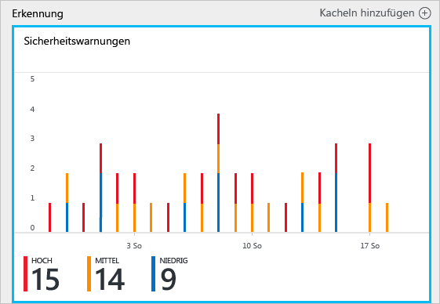
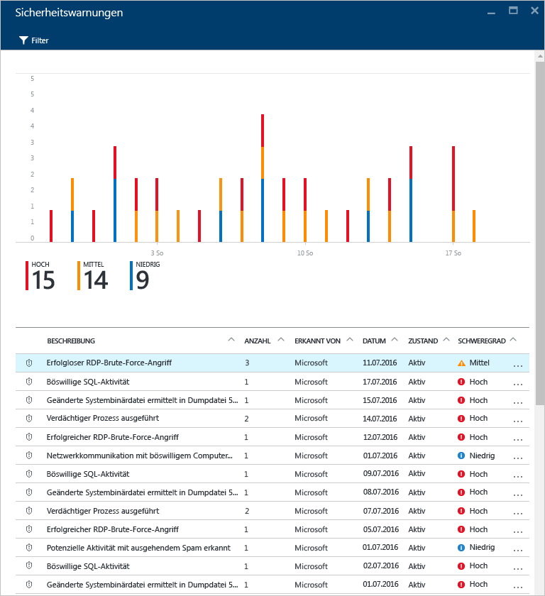
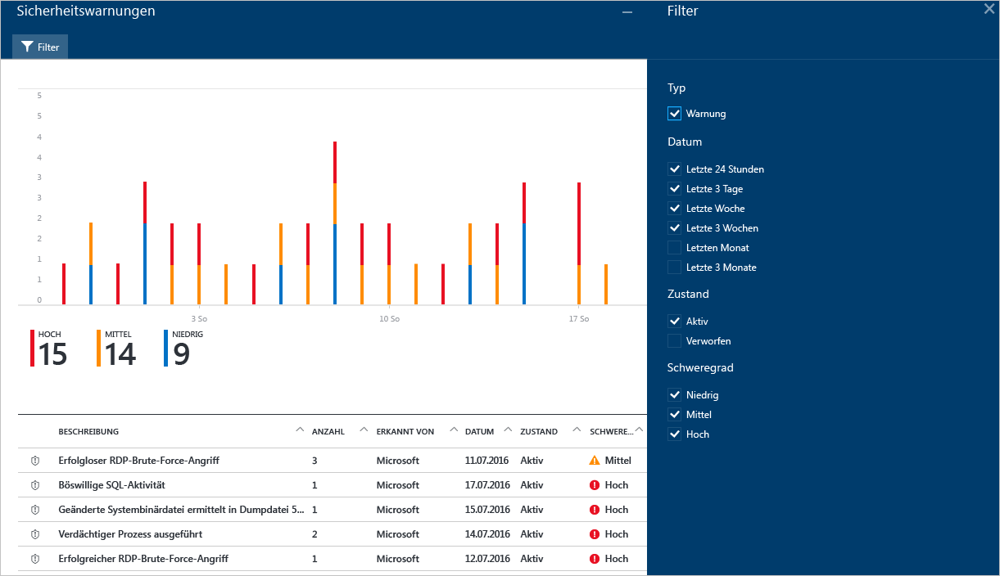
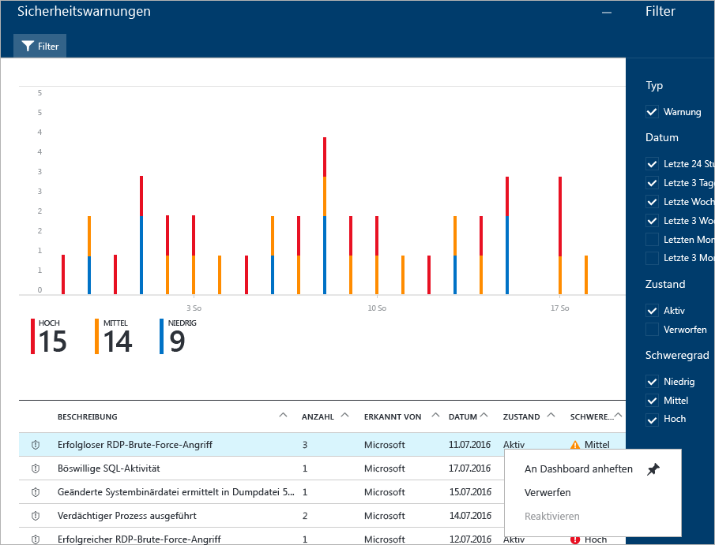
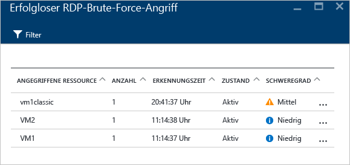
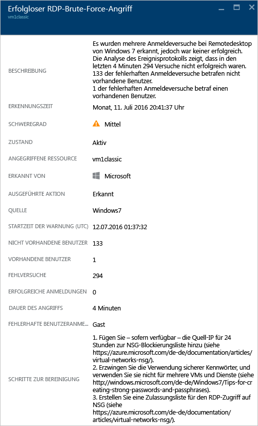

<properties
   pageTitle="Verwalten von und Reagieren auf Sicherheitswarnungen in Azure Security Center | Microsoft Azure"
   description="In diesem Dokument erfahren Sie, wie Sie Azure Security Center-Funktionen verwenden, um Sicherheitswarnungen zu verwalten und auf diese zu reagieren."
   services="security-center"
   documentationCenter="na"
   authors="YuriDio"
   manager="swadhwa"
   editor=""/>

<tags
   ms.service="security-center"
   ms.topic="hero-article"
   ms.devlang="na"
   ms.tgt_pltfrm="na"
   ms.workload="na"
   ms.date="09/19/2016"
   ms.author="yurid"/>

# Verwalten von und Reagieren auf Sicherheitswarnungen in Azure Security Center
In diesem Dokument erfahren Sie, wie Sie Azure Security Center verwenden, um Sicherheitswarnungen zu verwalten und auf diese zu reagieren.

> [AZURE.NOTE] Führen Sie ein Upgrade auf Azure Security Center Standard durch, um erweiterte Erkennungsfunktionen zu aktivieren. Sie können auch eine kostenlose 90-Tage-Testversion nutzen. Wenn Sie ein Upgrade durchführen möchten, wählen Sie in der [Sicherheitsrichtlinie](security-center-policies.md) die Tarifoption aus. Weitere Informationen finden Sie auf der [Preisseite](https://azure.microsoft.com/pricing/details/security-center/).

## Was sind Sicherheitswarnungen?
Security Center erfasst, analysiert und vereinigt automatisch Protokolldaten von Ihren Azure-Ressourcen, vom Netzwerk und von verbundenen Partnerlösungen, z.B. Lösungen zum Schutz von Firewalls und Endpunkten, um echte Bedrohungen zu erkennen und falsch positive Ergebnisse zu reduzieren. Eine Liste mit priorisierten Sicherheitswarnungen wird im Security Center zusammen mit den Informationen angezeigt, die Sie zum schnellen Untersuchen des Problems benötigen. Außerdem sind Empfehlungen zum Reagieren auf einen Angriff vorhanden. Azure Security Center aggregiert auch Warnungen, die Kill Chain-Mustern entsprechen, in [Vorfällen](security-center-incident.md).

> [AZURE.NOTE] Weitere Informationen zur Funktionsweise der Security Center-Erkennungsfunktionen finden Sie unter [Azure Security Center-Erkennungsfunktionen](security-center-detection-capabilities.md).

## Verwalten von Sicherheitswarnungen

Aktuelle Warnungen können Sie auf der Kachel **Sicherheitswarnungen** prüfen. Öffnen Sie das Azure-Portal, und gehen Sie folgendermaßen vor, wenn Sie weitere Details zu jeder Warnung anzeigen möchten:

1. Auf dem Security Center-Dashboard sehen Sie die Kachel **Sicherheitswarnungen**.

    

2.  Klicken Sie auf die Kachel, um das Blatt **Sicherheitswarnungen** mit weiteren Details zu den Warnungen zu öffnen, wie in der folgenden Abbildung zu sehen:

    

Im unteren Teil dieses Blatts sind die Details für die einzelnen Warnungen zu sehen. Zum Sortieren klicken Sie auf die Spalte, nach der Sie sortieren möchten. Die Spalten sind wie folgt definiert:

- **Warnung**: Eine kurze Erläuterung der Warnung.
- **Anzahl**: Eine Liste mit allen Warnungen dieses speziellen Typs, die an einem bestimmten Tag erkannt wurden.
- **Erkannt von**: Der Dienst, der die Warnung ausgelöst hat.
- **Datum**: Das Datum, an dem das Ereignis aufgetreten ist.
- **Zustand**: Der aktuelle Zustand für diese Warnung. Es gibt zwei Arten von Zuständen:
    - **Aktiv**: Die Sicherheitswarnung wurde erkannt.
    - **Verworfen**: Die Sicherheitswarnung wurde vom Benutzer verworfen. Dieser Status wird üblicherweise für Warnungen verwendet, die untersucht, aber gemindert oder als harmlos eingestuft wurden.

- **Schweregrad**: Gibt den Schweregrad an („Hoch“, „Mittel“ oder „Niedrig“).

### Filtern von Warnungen

Sie können Warnungen nach Datum, Status und Schweregrad filtern. Das Filtern von Warnungen kann nützlich für Szenarien sein, in denen Sie den Bereich der angezeigten Warnungen einschränken müssen. Es könnte beispielsweise sein, dass Sie während der Untersuchung einer möglichen Sicherheitsverletzung im System die Sicherheitswarnungen überprüfen möchten, die in den letzten 24 Stunden aufgetreten sind.

1. Klicken Sie auf dem Blatt **Sicherheitswarnungen** auf **Filter**. Das Blatt **Filter** wird geöffnet. Hier können Sie die gewünschten Werte für Datum, Zustand und Schweregrad auswählen.

	

2. 	Nach dem Untersuchen einer Sicherheitswarnung stellen Sie unter Umständen fest, dass es sich um falsch positive Warnung für Ihre Umgebung handelt oder ein erwartetes Verhalten für eine bestimmte Ressource darstellt. Falls Sie feststellen, dass eine Sicherheitswarnung nicht zutrifft, können Sie die Warnung immer verwerfen und dann aus der Ansicht herausfiltern. Es gibt zwei Möglichkeiten, eine Sicherheitswarnung zu verwerfen. Klicken Sie mit der rechten Maustaste auf eine Warnung, und wählen Sie **Verwerfen** aus, oder zeigen Sie auf ein Element, klicken Sie auf die drei Punkte, die rechts angezeigt werden, und wählen Sie **Verwerfen** aus. Sie können verworfene Sicherheitswarnungen anzeigen, indem Sie auf **Filter** klicken und **Verworfen** auswählen.

	

### Reagieren auf Sicherheitswarnungen

Wählen Sie eine Sicherheitswarnung aus, um weitere Informationen zu den Ereignissen zu erhalten, die die Warnung ausgelöst haben, sowie zu den Schritten, die Sie als Reaktion auf den Angriff ausführen müssen (falls zutreffend). Sicherheitswarnungen werden nach Typ und Datum gruppiert. Wenn Sie auf eine Sicherheitswarnung klicken, wird ein Blatt mit einer Liste der gruppierten Warnungen geöffnet.

In diesem Fall bezieht sich die ausgelöste Warnung auf eine verdächtige RDP-Aktivität (Remote Desktop Protocol). Die erste Spalte zeigt, welche Ressourcen angegriffen wurden. In der zweiten Spalte sehen Sie , wie häufig die Ressource angegriffen wurde. Die dritte Spalte enthält die Uhrzeit des Angriffs. Die vierte Spalte zeigt den Status der Warnung und die fünfte Spalte den Schweregrad des Angriffs. Klicken Sie nach dem Überprüfen dieser Informationen auf die Ressource, die angegriffen wurde. Ein neues Blatt wird geöffnet.

Das Feld **Beschreibung** auf diesem Blatt enthält weitere Informationen zu diesem Ereignis. Dank dieser zusätzlichen Details erhalten Sie Informationen dazu, wodurch die Sicherheitswarnung ausgelöst wurde, sowie die Zielressource, die IP-Quelladresse (falls zutreffend) und Empfehlungen zur Lösung. In einigen Fällen ist die IP-Quelladresse leer (nicht verfügbar), da nicht alle Windows-Sicherheitsereignisprotokolle die IP-Adresse enthalten.

Die von Security Center vorgeschlagene Wiederherstellung variiert je nach Sicherheitshinweis. In einigen Fällen müssen Sie möglicherweise weitere Azure-Funktionen verwenden, um die empfohlenen Lösungen zu implementieren. Beispielsweise kann die Abhilfe für diesen Angriff darin bestehen, die IP-Adresse, die den Angriff generiert, durch Verwendung einer [Netzwerk-ACL](../virtual-network/virtual-networks-acl.md) oder einer Regel für die [Netzwerksicherheitsgruppe](../virtual-network/virtual-networks-nsg.md) auf eine Negativliste zu setzen.

> [AZURE.NOTE] Weitere Informationen zu den verschiedenen Arten von Warnungen finden Sie unter [Sicherheitswarnungen nach Typ in Azure Security Center](security-center-alerts-type.md).

## Siehe auch

In diesem Dokument haben Sie erfahren, wie Sie Sicherheitsrichtlinien in Security Center konfigurieren können. Weitere Informationen zu Security Center finden Sie in den folgenden Quellen:

- [Behandeln von Sicherheitswarnungen in Azure Security Center](security-center-incident.md)
- [Azure Security Center-Erkennungsfunktionen](security-center-detection-capabilities.md)
- [Planungs- und Betriebshandbuch für Azure Security Center](security-center-planning-and-operations-guide.md)
- [Azure Security Center – Häufig gestellte Fragen:](security-center-faq.md) Hier finden Sie häufig gestellte Fragen zur Verwendung des Diensts.
- [Azure Security Blog](http://blogs.msdn.com/b/azuresecurity/) (Blog zur Azure-Sicherheit): Hier finden Sie Blogbeiträge zur Azure-Sicherheit und -Compliance.

<!----HONumber=AcomDC_0921_2016--->