<properties
   pageTitle="Überwachen der Sicherheitsintegrität in Azure Security Center | Microsoft Azure"
   description="Dieses Dokument bietet Ihnen einen Einstieg in die Überwachungsfunktionen in Azure Security Center."
   services="security-center"
   documentationCenter="na"
   authors="YuriDio"
   manager="swadhwa"
   editor=""/>

<tags
   ms.service="security-center"
   ms.devlang="na"
   ms.topic="hero-article"
   ms.tgt_pltfrm="na"
   ms.workload="na"
   ms.date="09/22/2016"
   ms.author="yurid"/>

#Überwachen der Sicherheitsintegrität in Azure Security Center
Dieses Dokument unterstützt Sie bei der Verwendung der Überwachungsfunktionen in Azure Security Center zur Überwachung der Richtliniencompliance.

##Was ist Überwachen der Sicherheitsintegrität?
Überwachung wird häufig als Beobachten und Warten auf ein Eintreten eines Ereignisses aufgefasst, damit auf diese Situation reagiert werden kann. Sicherheitsüberwachung bezieht sich auf eine proaktive Strategie, bei der Ihre Ressourcen überwacht werden, um Systeme zu erkennen, die nicht den Unternehmensstandards oder bewährten Methoden entsprechen.

##Überwachung der Sicherheitsintegrität
Nachdem Sie die [Sicherheitsrichtlinien](security-center-policies.md) für die Ressourcen des Abonnements aktiviert haben, analysiert Security Center die Sicherheit Ihrer Ressourcen, um mögliche Sicherheitsrisiken zu erkennen. Informationen zur Konfiguration Ihres Netzwerks sind sofort verfügbar, aber kann es eine Stunde oder länger dauern, bevor Informationen zur Konfiguration einer virtuellen Maschine – z. B. zu Sicherheitsupdatestatus und Betriebssystemkonfiguration – verfügbar sind. Sie können den Sicherheitsstatus Ihrer Ressourcen zusammen mit allen Problemen auf dem Blatt **Sicherheitsintegrität von Ressourcen** anzeigen. Eine Liste dieser Probleme können Sie auch auf dem Blatt **Empfehlungen** anzeigen.

Weitere Informationen zur Anwendung der Empfehlungen finden Sie unter [Implementieren von Sicherheitsempfehlungen in Azure Security Center](security-center-recommendations.md).

Auf der Kachel **Ressourcensicherheitsintegrität** können Sie den Sicherheitsstatus Ihrer Ressourcen überwachen. Im Beispiel unten sehen Sie eine Reihe von Problemen mit hohem und mittlerem Schweregrad, die Aufmerksamkeit erfordern. Die Sicherheitsrichtlinien, die aktiviert sind, wirken sich auf die Arten von Sicherheitsmechanismen aus, die überwacht werden.

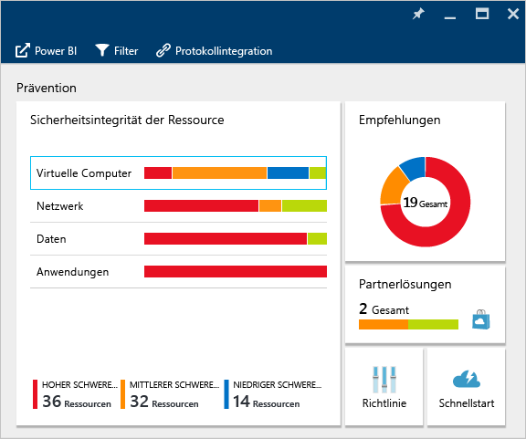

Erkennt Security Center ein Sicherheitsrisiko, das behoben werden muss – etwa ein virtueller Computer mit fehlenden Sicherheitsupdates oder ein Subnetz ohne [Netzwerksicherheitsgruppe](../virtual-network/virtual-networks-nsg.md) –, wird dies hier angegeben.

###Überwachen virtueller Maschinen
Wenn Sie auf der Kachel **Ressourcensicherheitsintegrität** auf **Virtuelle Computer** klicken, wird das Blatt **Virtuelle Computer** geöffnet. Dieses Blatt enthält weitere Details zu den Integrations- und Vorbeugungsschritten sowie eine Liste aller virtuellen Computer, die von Security Center überwacht werden (siehe folgende Abbildung).

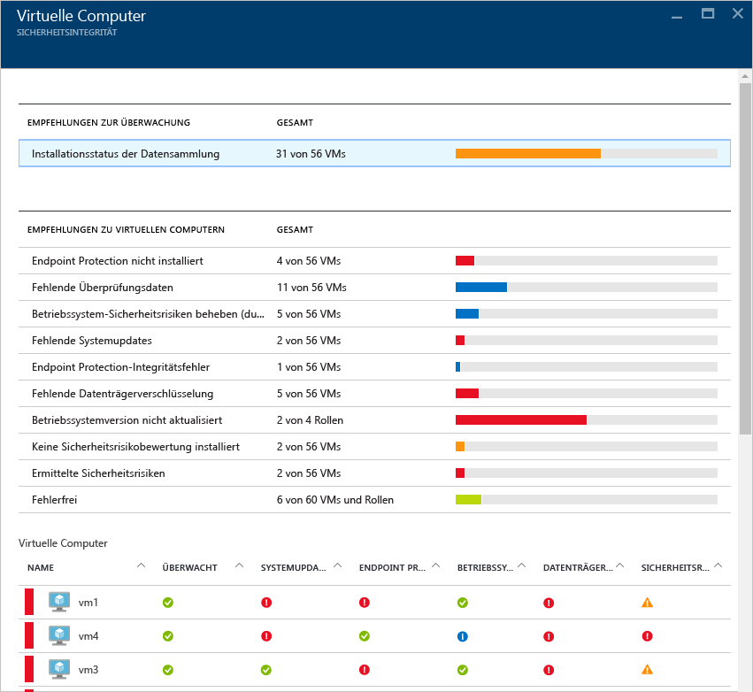

- Schritte zur Integration
- Empfehlungen für virtuelle Computer
- Virtuelle Computer

In jedem Abschnitt können Sie eine einzelne Option auswählen, um weitere Details zum empfohlenen Schritt für die Lösung des Problems anzuzeigen. In den folgenden Abschnitten werden diese Bereiche ausführlicher behandelt.

#### Überwachen der Empfehlungen
In diesem Abschnitt wird die Gesamtzahl der virtuellen Maschinen angezeigt, die für die Datensammlung initialisiert wurden, sowie deren aktueller Status. Sobald für alle virtuellen Maschinen die Datensammlung initialisiert wurde, sind sie bereit für den Empfang der Security Center-Sicherheitsrichtlinien. Wenn Sie auf diesen Eintrag klicken, wird das Blatt **Data collection installation status** (Installationsstatus der Datensammlung) angezeigt, und Sie sehen die Namen der virtuellen Computer und den aktuellen Status der Datensammlung in der Spalte **INSTALLATIONSSTATUS**. Dies ist unten dargestellt.

####Empfehlungen für virtuelle Computer
Dieser Abschnitt enthält eine Reihe von [Empfehlungen für jeden virtuellen Computer](security-center-virtual-machine-recommendations.md), der von Azure Security Center überwacht wird. Die erste Spalte enthält die Empfehlung, und in der zweiten Spalte wird die Gesamtzahl der VMs angegeben, die von der Empfehlung betroffen sind. Die dritte Spalte enthält den Schweregrad des Problems, wie in der folgenden Abbildung dargestellt.

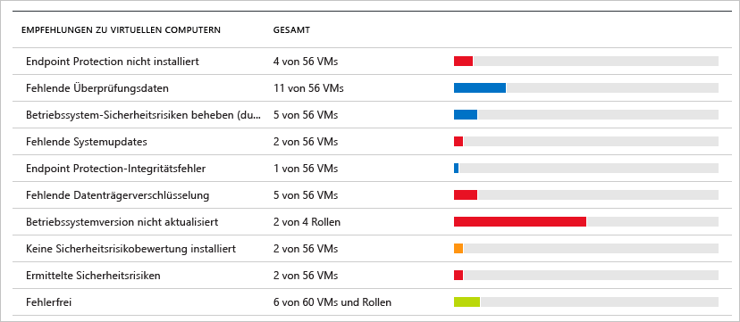

> [AZURE.NOTE] Nur VMs mit mindestens einem öffentlichen Endpunkt werden auf dem Blatt „Networking Health“ (Netzwerkintegrität) in der Liste „Network topology“ (Netzwerktopologie) angezeigt.

Jeder Empfehlung ist eine Reihe von Aktionen zugeordnet, die ausgeführt werden können, wenn Sie darauf klicken. Wenn Sie beispielsweise auf **Fehlende Systemupdates** klicken, wird das Blatt **Fehlende Systemupdates** geöffnet. Auf dem Blatt sind die VMs, für die Patches fehlen, und der Schweregrad des fehlendes Updates wie unten dargestellt aufgeführt.

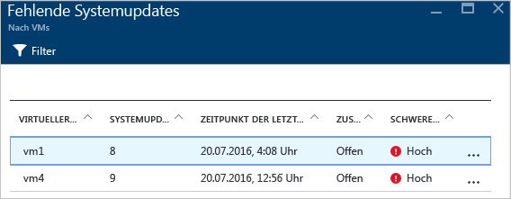

Auf dem Blatt **Fehlende Systemupdates** wird eine Tabelle mit folgenden Informationen angezeigt:

- **VIRTUELLER COMPUTER**: Der Name der virtuellen Maschine, für die Updates fehlen.
- **SYSTEMUPDATES**: Die Anzahl der fehlenden Systemupdates.
- **LETZTE ÜBERPRÜFUNGSZEIT**: Der Zeitpunkt, zu dem die virtuelle Maschine zuletzt von Security Center auf Updates überprüft wurde.
- **STATUS**: Der aktuelle Status der Empfehlung:
	- **Offen**: Die Empfehlung wurde noch nicht verarbeitet.
	- **In Bearbeitung**: Die Empfehlung wird derzeit auf die Ressourcen angewendet, und es ist keine Aktion Ihrerseits erforderlich.
	- **Gelöst**: Die Empfehlung wurde bereits abgeschlossen. (Wenn das Problem behoben ist, wird der Eintrag abgeblendet.)
- **SCHWEREGRAD**: Beschreibt den Schweregrad der jeweiligen Empfehlung:
	- **Hoch**: Ein Sicherheitsrisiko betrifft eine bedeutsame Ressource (Anwendung, VM, Netzwerksicherheitsgruppe) und erfordert Aufmerksamkeit.
	- **Mittel**: Nicht kritische oder zusätzliche Schritte sind erforderlich, um einen Prozess abzuschließen oder eine Sicherheitslücke zu beseitigen.
	- **Niedrig**: Ein Sicherheitsrisiko, das behandelt werden sollte, jedoch keine unmittelbare Aufmerksamkeit erfordert. (Standardmäßig werden Empfehlungen mit dem Status „Niedrig“ nicht angezeigt, aber Sie können bei Bedarf nach diesen Empfehlungen filtern.)

Um die Details zur Empfehlung anzuzeigen, klicken Sie auf den Namen der jeweiligen virtuellen Maschine. Es wird ein neues Blatt für die virtuelle Maschine mit der Liste geöffnet. Dies ist hier dargestellt:

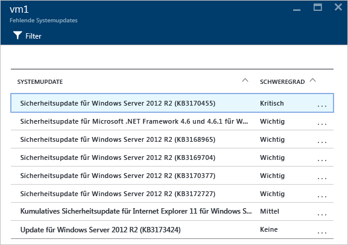

> [AZURE.NOTE] Die Sicherheitsempfehlungen hier sind mit denen auf dem Blatt für Empfehlungen identisch. Weitere Informationen zur Umsetzung der Empfehlungen finden Sie unter [Implementieren von Sicherheitsempfehlungen in Azure Security Center](security-center-recommendations.md). Dies gilt nicht nur für virtuelle Computer, sondern auch für alle Ressourcen, die auf der Kachel „Ressourcenintegrität“ verfügbar sind.

####Abschnitt „Virtuelle Computer“
Der Abschnitt „Virtuelle Computer“ enthält eine Übersicht über alle virtuellen Computer und Empfehlungen. Jede Spalte steht für eine Gruppe von Empfehlungen (siehe folgende Abbildung):

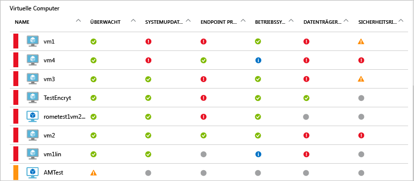

Anhand der Symbole, die unter jeder Empfehlung angezeigt werden, können Sie schnell erkennen, bei welchen virtuellen Maschinen Aufmerksamkeit nötig ist und welche Arten von Empfehlungen vorhanden sind.

Im obigen Beispiel wird für einen virtuellen Computer eine dringende Empfehlung in Bezug auf den Endpunktschutz angezeigt. Klicken Sie auf die VM, um weitere Informationen anzuzeigen. Es wird ein neues Blatt geöffnet, auf dem die Informationen zur VM wie unten dargestellt angegeben werden.

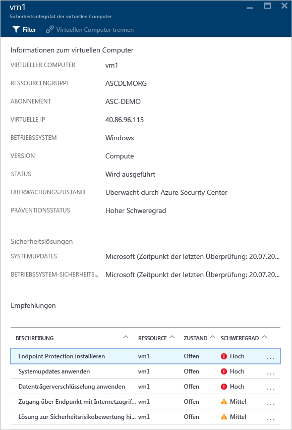

Dieses Blatt enthält die Sicherheitsdetails für den virtuellen Computer. Unten auf dem Blatt werden die empfohlenen Aktionen sowie der Schweregrad der einzelnen Probleme angezeigt.

#### Abschnitt „Clouddienste (Vorschau)“
Der Integritätsstatus für Clouddienste ist auf der Kachel für die Sicherheitsintegrität von virtuellen Computern enthalten. Wenn die Betriebssystemversion veraltet ist, wird eine Empfehlung erstellt. Dies ist hier dargestellt:

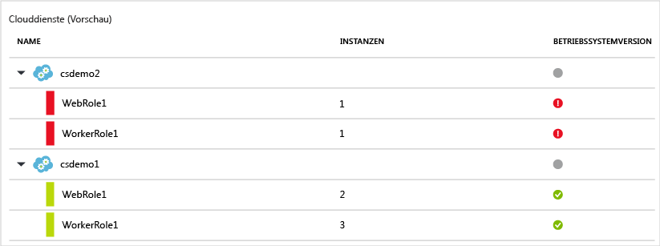

Sie müssen die Schritte in der Empfehlung ausführen, um die Betriebssystemversion zu aktualisieren. Wenn Sie in einer Webrolle (Ausführung von Windows Server mit automatischer Bereitstellung Ihrer Web-App für IIS) oder Workerrolle (Ausführung von Windows Server mit automatischer Bereitstellung Ihrer Web-App für IIS) in die rote Warnung klicken, wird ein neues Blatt mit weiteren Details zur Empfehlung geöffnet. Dies ist unten dargestellt:

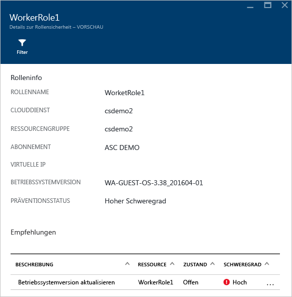

Um eine Anleitung zur Empfehlung zu erhalten, klicken Sie in der Spalte **BESCHREIBUNG** auf **Update OS version** (Betriebssystemversion aktualisieren). Das Blatt **Update OS version (Preview)** (Betriebssystemversion aktualisieren (Vorschau)) mit mehr Details wird geöffnet.

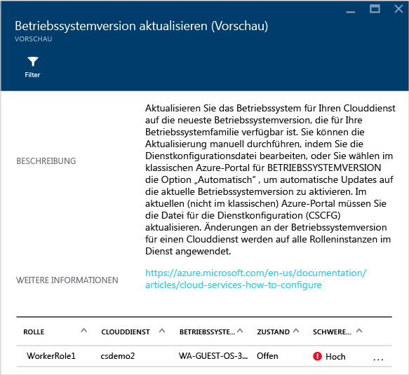

### Überwachen virtueller Netzwerke
Wenn Sie auf der Kachel **Ressourcensicherheitsintegrität** auf **Netzwerk** klicken, wird das Blatt **Netzwerk** mit weiteren Details geöffnet (siehe folgende Abbildung):

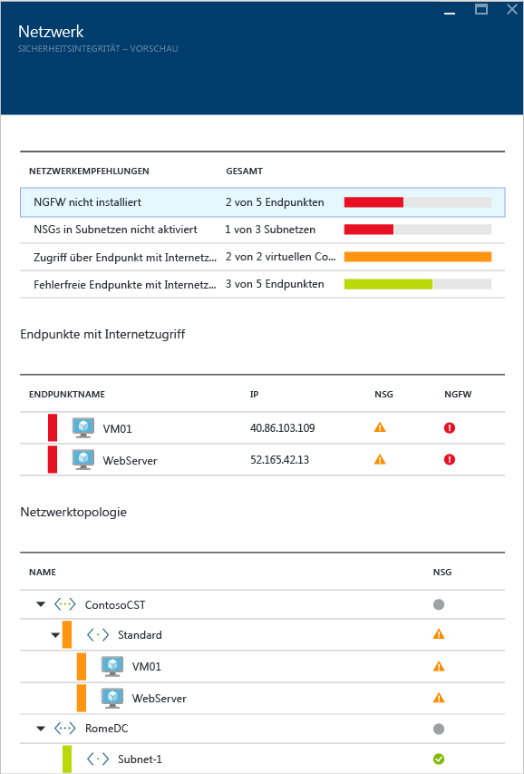

####Netzwerkempfehlungen

Ähnlich wie für die Ressourcenintegritätsinformationen für virtuelle Maschinen enthält dieses Blatt im oberen Bereich eine zusammengefasste Liste der Probleme und im unteren Bereich eine Liste der überwachten Netzwerke.

Im Abschnitt für die Statusanalyse der Netzwerke sind potenzielle Sicherheitsprobleme und entsprechende [Empfehlungen](security-center-network-recommendations.md) aufgeführt. Beispiele für Probleme:

- Die Firewall der nächsten Generation (Next Generation Firewall, NGFW) ist nicht installiert.
- Netzwerksicherheitsgruppen (NSGs) für Subnetze nicht aktiviert
- NSGs für virtuelle Computer nicht aktiviert
- Eingeschränkter Zugriff über öffentliche externe Endpunkte
- Fehlerfreie Endpunkte mit Internetanbindung

Wenn Sie auf eine dieser Empfehlungen klicken, wird ein neues Blatt mit weiteren Details zur Empfehlung angezeigt (siehe folgendes Beispiel).

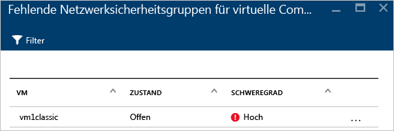

In diesem Beispiel befindet sich auf dem Blatt **Fehlende Netzwerksicherheitsgruppen für Subnetze konfigurieren** eine Liste mit Subnetzen und virtuellen Computern ohne NSG-Schutz. Wenn Sie auf das Subnetz klicken, auf das Sie die NSG anwenden möchten, wird ein weiteres Blatt geöffnet.

Auf dem Blatt **Netzwerksicherheitsgruppe auswählen** können Sie eine geeignete Netzwerksicherheitsgruppe für das Subnetz auswählen oder eine neue Netzwerksicherheitsgruppe erstellen.

####Abschnitt „Endpunkte mit Internetanbindung“

Im Abschnitt **Endpunkte mit Internetanbindung** werden die virtuellen Computer, die derzeit mit einem Endpunkt mit Internetanbindung konfiguriert sind, und der jeweilige Status angezeigt.

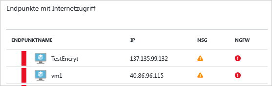

Diese Tabelle enthält den Endpunktnamen, der den virtuellen Computer darstellt, die Internet-IP-Adresse und den aktuellen Status der NSG und der NGFW. Die Tabelle ist nach Schweregrad sortiert, wie nachfolgend beschrieben:
- Rot (oben): hohe Priorität; sollte umgehend behoben werden
- Orange: mittlere Priorität; sollte zeitnah behoben werden
- Grün (ganz unten): fehlerfrei

####Abschnitt „Netzwerktopologie“

Der Abschnitt **Netzwerktopologie** enthält eine hierarchische Ansicht der Ressourcen:

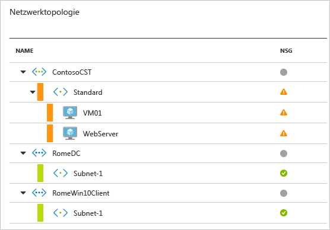

Diese Tabelle ist nach Schweregrad sortiert (virtuelle Computer und Subnetze):
- Rot (oben): hohe Priorität; sollte umgehend behoben werden
- Orange: mittlere Priorität; sollte zeitnah behoben werden
- Grün (ganz unten): fehlerfrei

In dieser Hierarchie umfasst die erste Ebene [virtuelle Netzwerke](../virtual-network/virtual-networks-overview.md), [Virtual Network-Gateways](../vpn-gateway/vpn-gateway-site-to-site-create.md) und [Virtual Network (klassisch)](../virtual-network/virtual-networks-create-vnet-classic-pportal.md). Die zweite Ebene umfasst Subnetze. Die dritte Ebene enthält die virtuellen Computer dieser Subnetze. Die rechte Spalte enthält den aktuellen Status der Netzwerksicherheitsgruppe (NSG) für diese Ressourcen. Dies wird im folgenden Beispiel veranschaulicht:

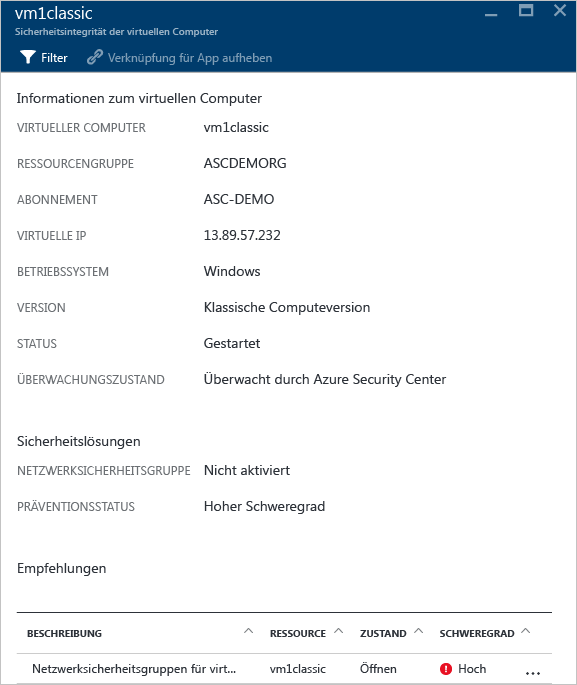

Im unteren Teil des Blatts befinden sich Empfehlungen für diesen virtuellen Computer (ähnlich wie weiter oben beschrieben). Sie können auf eine Empfehlung klicken, um weitere Informationen zu erhalten oder die erforderliche Sicherheitskontrolle/-konfiguration anzuwenden.

###Überwachen von Daten
Wenn Sie auf der Kachel **Ressourcensicherheitsintegrität** auf **Daten** klicken, wird das Blatt **SQL** geöffnet. Es enthält Empfehlungen zu Problemen, die mit der Überwachung oder der nicht aktivierten Transparent Data Encryption zusammenhängen. Außerdem werden [Empfehlungen](security-center-sql-service-recommendations.md) zum allgemeinen Integritätsstatus der Datenbank angegeben.

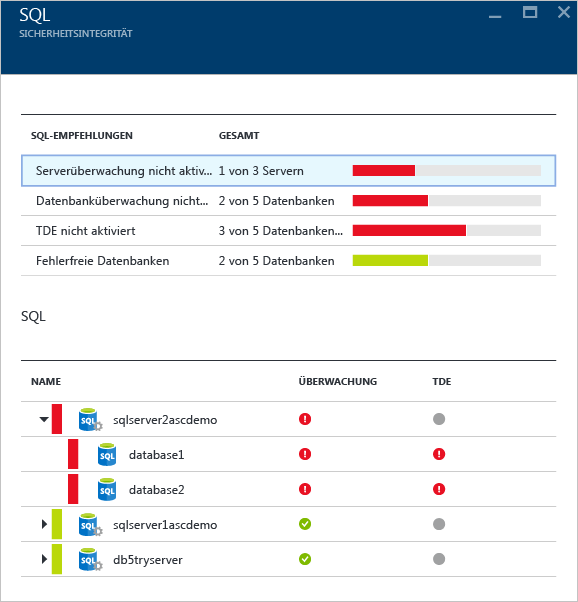

Sie können auf eine dieser Empfehlungen klicken, um weitere Details zu Aktionen zu erhalten, mit denen das jeweilige Problem behoben werden kann. Das folgende Beispiel zeigt die Erweiterung der Empfehlung **Datenbanküberwachung nicht aktiviert**.

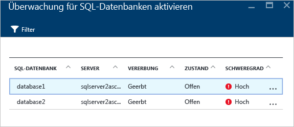

Das Blatt **Überwachung für SQL-Datenbanken aktivieren** enthält folgende Informationen:

- Liste der SQL-Datenbanken
- Server, auf dem sich eine Datenbank befindet
- Informationen dazu, ob die Einstellung vom Server geerbt wurde oder in der Datenbank eindeutig ist
- Aktueller Status
- Schweregrad des Problems

Wenn Sie auf die Datenbank klicken, um die Empfehlung umzusetzen, wird das Blatt **Überwachung und Bedrohungserkennung** angezeigt:

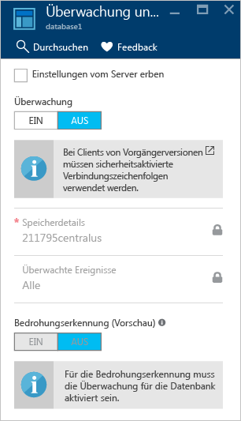

Um die Überwachung zu aktivieren, klicken Sie unter der Option **Überwachung** einfach auf **EIN**.

### Überwachen von Anwendungen

Wenn Ihre Azure-Workload Anwendungen umfasst, die sich auf [Resource Manager-VMs](../resource-manager-deployment-model.md) mit verfügbar gemachten Webports (TCP-Ports 80 und 443) befinden, kann Security Center diese Ports überwachen, um potenzielle Sicherheitsprobleme zu erkennen und Wartungsschritte zu empfehlen. Wenn Sie auf die Kachel **Anwendungen** klicken, wird das Blatt **Anwendungen** mit einer Reihe von Empfehlungen im Abschnitt „Vorbeugungsschritte“ geöffnet. Außerdem werden die Anwendungen nach Host/virtueller IP aufgeschlüsselt. Die ist unten dargestellt.

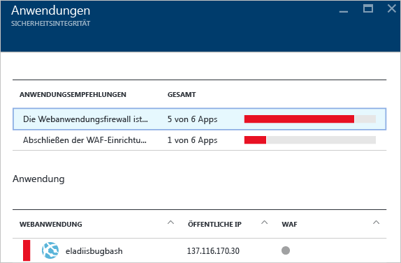

Sie können wie bei den anderen Empfehlungen auch auf eine Empfehlung klicken, um weitere Details zum Problem sowie Informationen zu dessen Beseitigung anzuzeigen. Das in der nächsten Abbildung gezeigte Beispiel ist eine Anwendung, die als unsichere Webanwendung identifiziert wurde. Wenn Sie die als unsicher angesehene Anwendung auswählen, wird ein weiteres Blatt mit der folgenden verfügbaren Option geöffnet:

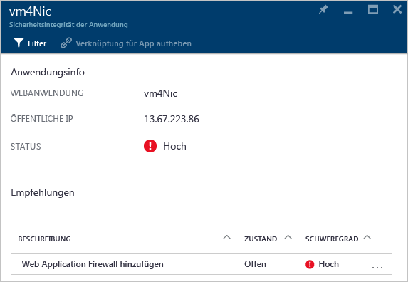

Dieses Blatt enthält eine Liste mit allen Empfehlungen für diese Anwendung. Wenn Sie auf die Empfehlung **Web Application Firewall hinzufügen** klicken, wird das Blatt **Web Application Firewall hinzufügen** mit Optionen zum Installieren einer Drittanbieter WAF (Web Application Firewall) geöffnet. Dies ist unten dargestellt.

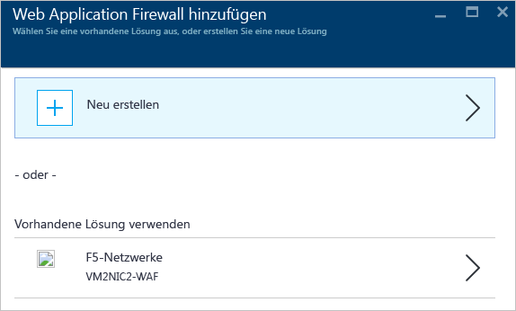

## Weitere Informationen
In diesem Dokument haben Sie erfahren, wie Sie die Überwachungsfunktionen in Azure Security Center verwenden können. Weitere Informationen zu Azure Security Center finden Sie in den folgenden Quellen:

- [Festlegen von Sicherheitsrichtlinien in Azure Security Center](security-center-policies.md): Erfahren Sie, wie Sie Sicherheitseinstellungen in Azure Security Center konfigurieren.
- [Verwalten von und Reagieren auf Sicherheitswarnungen in Azure Security Center](security-center-managing-and-responding-alerts.md): Erfahren Sie, wie Sie Sicherheitswarnungen verwalten und darauf reagieren.
- [Überwachen von Partnerlösungen mit Azure Security Center](security-center-partner-solutions.md): Erfahren Sie, wie der Integritätsstatus Ihrer Partnerlösungen überwacht wird.
- [Azure Security Center – Häufig gestellte Fragen](security-center-faq.md): Hier finden Sie häufig gestellte Fragen zur Verwendung des Diensts.
- [Azure Security Blog](http://blogs.msdn.com/b/azuresecurity/) (Blog zur Azure-Sicherheit): Hier finden Sie Blogbeiträge zur Sicherheit und Compliance von Azure.

<!---HONumber=AcomDC_0928_2016-->