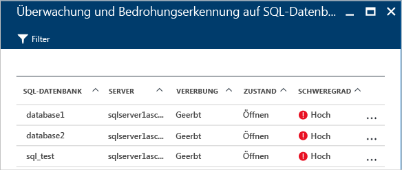

# Überwachen der Sicherheitsintegrität in Azure Security Center
Dieser Artikel unterstützt Sie bei der Überwachung der Richtliniencompliance mithilfe der Überwachungsfunktionen von Azure Security Center.

## Was ist Überwachen der Sicherheitsintegrität?
Überwachung wird häufig als Beobachten und Warten auf ein Eintreten eines Ereignisses aufgefasst, damit auf diese Situation reagiert werden kann. Sicherheitsüberwachung bezieht sich auf eine proaktive Strategie, bei der Ihre Ressourcen überwacht werden, um Systeme zu erkennen, die nicht den Unternehmensstandards oder bewährten Methoden entsprechen.

## Überwachung der Sicherheitsintegrität
Nach Aktivierung der [Sicherheitsrichtlinien](security-center-policies.md) für die Ressourcen eines Abonnements analysiert Security Center die Sicherheit Ihrer Ressourcen, um mögliche Sicherheitsrisiken zu erkennen. Informationen zur Netzwerkkonfiguration sind sofort verfügbar. Es kann jedoch eine Stunde oder länger dauern, bis Informationen zur VM-Konfiguration (wie Sicherheitsupdatestatus und Betriebssystemkonfiguration) zur Verfügung stehen. Der Sicherheitsstatus Ihrer Ressourcen sowie ggf. vorliegende Probleme werden auf dem Blatt **Sicherheitsintegrität der Ressource** angezeigt. Eine Liste mit diesen Problemen steht auch auf dem Blatt **Empfehlungen** zur Verfügung.

Weitere Informationen zur Anwendung der Empfehlungen finden Sie unter [Implementieren von Sicherheitsempfehlungen in Azure Security Center](security-center-recommendations.md).

Auf der Kachel **Sicherheitsintegrität der Ressource** können Sie den Sicherheitsstatus Ihrer Ressourcen überwachen. Im folgenden Beispiel sehen Sie eine Reihe von Problemen mit hohem und mittlerem Schweregrad, die eine Reaktion erfordern. Die Sicherheitsrichtlinien, die aktiviert sind, wirken sich auf die Arten von Sicherheitsmechanismen aus, die überwacht werden.

Erkennt Security Center ein Sicherheitsrisiko, das behoben werden muss (beispielsweise einen virtuellen Computer mit fehlenden Sicherheitsupdates oder ein Subnetz ohne [Netzwerksicherheitsgruppe](/virtual-network/virtual-networks-nsg.md)), wird dies hier angegeben.

### Überwachen von Compute
Wenn Sie auf der Kachel **Sicherheitsintegrität der Ressource** auf **Compute** klicken, wird das Blatt **Compute** geöffnet. Auf diesem Blatt stehen drei Registerkarten zur Verfügung:

- **Übersicht:** Überwachung und Empfehlungen zu virtuellen Computern.
- **Virtuelle Computer:** Liste mit allen virtuellen Computern und dem jeweils aktuellen Sicherheitsstatus.
- **Clouddienste:** Liste mit allen von Security Center überwachten Web- und Workerrollen.

Auf den einzelnen Registerkarten können sich jeweils mehrere Abschnitte befinden, und in jedem Abschnitt können Sie eine einzelne Option auswählen, um weitere Details zu den empfohlenen Problembehandlungsschritten für ein bestimmtes Problem anzuzeigen. 

#### Überwachen der Empfehlungen
In diesem Abschnitt werden die Gesamtanzahl und der aktuelle Status der virtuellen Computer angezeigt, die für die Datensammlung initialisiert wurden. Sobald die Datensammlung für alle virtuellen Computer initialisiert wurde, sind sie bereit für den Empfang der Security Center-Sicherheitsrichtlinien. Wenn Sie auf diesen Eintrag klicken, öffnet sich das Blatt **VM-Agent fehlt oder reagiert nicht**. 

#### Empfehlungen für virtuelle Computer
Dieser Abschnitt enthält eine Reihe von [Empfehlungen für die einzelnen virtuellen Computer](security-center-virtual-machine-recommendations.md), die von Azure Security Center überwacht werden. Die erste Spalte enthält die Empfehlung. Die zweite Spalte enthält die Gesamtanzahl virtueller Computer, die von dieser Empfehlung betroffen sind. Die dritte Spalte gibt Aufschluss über den Schweregrad des Problems, wie im folgenden Screenshot zu sehen.

> [!NOTE]
> Auf dem Blatt **Networking Health** (Netzwerkintegrität) werden in der Liste **Netzwerktopologie** nur virtuelle Computer mit mindestens einem öffentlichen Endpunkt angezeigt.
>
>

Jeder Empfehlung ist eine Reihe von Aktionen zugeordnet, die ausgeführt werden können, wenn Sie darauf klicken. Wenn Sie beispielsweise auf **Fehlende Systemupdates** klicken, wird das Blatt **Fehlende Systemupdates** geöffnet. Auf dem Blatt sind die virtuellen Computer mit fehlenden Patches sowie der Schweregrad des fehlenden Updates aufgeführt, wie im folgenden Screenshot zu sehen.

Auf dem Blatt **Fehlende Systemupdates** befindet sich eine Tabelle mit folgenden Informationen:

* **VIRTUELLER COMPUTER**: Der Name der virtuellen Maschine, für die Updates fehlen.
* **SYSTEMUPDATES**: Die Anzahl der fehlenden Systemupdates.
* **LETZTE ÜBERPRÜFUNGSZEIT**: Der Zeitpunkt, zu dem der virtuelle Computer zuletzt von Security Center auf Updates überprüft wurde.
* **STATUS**: Der aktuelle Status der Empfehlung:
  * **Offen**: Die Empfehlung wurde noch nicht umgesetzt.
  * **In Bearbeitung**: Die Empfehlung wird derzeit auf die Ressourcen angewendet, und es ist keine Aktion Ihrerseits erforderlich.
  * **Behoben**: Die Empfehlung wurde bereits umgesetzt. (Wenn das Problem behoben wurde, wird der Eintrag abgeblendet dargestellt.)
* **SCHWEREGRAD**: Beschreibt den Schweregrad der jeweiligen Empfehlung:
  * **Hoch**: Ein Sicherheitsrisiko betrifft eine wichtige Ressource (Anwendung, virtueller Computer oder Netzwerksicherheitsgruppe) und erfordert eine Reaktion.
  * **Mittel**: Es liegt ein nicht kritisches Problem vor, oder es sind zusätzliche Schritte erforderlich, um einen Prozess abzuschließen oder eine Sicherheitslücke zu schließen.
  * **Niedrig**: Ein Sicherheitsrisiko, das behandelt werden sollte, jedoch keine unmittelbare Aufmerksamkeit erfordert. (Standardmäßig werden Empfehlungen mit dem Status „Niedrig“ nicht angezeigt, aber Sie können bei Bedarf nach diesen Empfehlungen filtern.)

Um die Details zur Empfehlung anzuzeigen, klicken Sie auf den Namen des jeweiligen virtuellen Computers. Für den virtuellen Computer öffnet sich ein neues Blatt mit einer Updateliste, wie im folgenden Screenshot zu sehen.

> [!NOTE]
> Hier werden die gleichen Sicherheitsempfehlungen aufgeführt wie auf dem Blatt **Empfehlungen**. Weitere Informationen zur Anwendung von Empfehlungen finden Sie unter [Implementieren von Sicherheitsempfehlungen in Azure Security Center](security-center-recommendations.md). Dies gilt nicht nur für virtuelle Computer, sondern für alle Ressourcen, die auf der Kachel **Ressourcenintegrität** verfügbar sind.
>
>

#### Abschnitt „Virtuelle Computer“
Der Abschnitt „Virtuelle Computer“ enthält eine Übersicht über alle virtuellen Computer und Empfehlungen. Jede Spalte steht für eine Gruppe von Empfehlungen, wie im folgenden Screenshot zu sehen:

Anhand der Symbole, die unter jeder Empfehlung angezeigt werden, können Sie schnell erkennen, bei welchen virtuellen Computern eine Aktion erforderlich ist und um welche Art von Empfehlung es sich handelt.

Im vorherigen Beispiel liegt für einen einzelnen virtuellen Computer eine kritische Empfehlung im Zusammenhang mit dem Endpunktschutz vor. Weitere Informationen erhalten Sie, indem Sie auf den virtuellen Computer klicken. Daraufhin öffnet sich ein neues Blatt für diesen virtuellen Computer, wie im folgenden Screenshot zu sehen.

Dieses Blatt enthält die Sicherheitsdetails für den virtuellen Computer. Im unteren Bereich des Blatts werden jeweils die empfohlene Aktion und der Schweregrad des jeweiligen Problems angezeigt.

#### Abschnitt „Clouddienste“
Für Clouddienste wird eine Empfehlung erstellt, wenn die Betriebssystemversion nicht mehr aktuell ist, wie im folgenden Screenshot zu sehen:

In einem Szenario, in dem eine Empfehlung vorliegt (was im vorherigen Beispiel nicht der Fall ist), muss die Betriebssystemversion mithilfe der Schritte aus der Empfehlung aktualisiert werden. Ist ein Update verfügbar, erhalten Sie eine Warnung (rot oder orange, je nach Schweregrad des Problems). Wenn Sie in „WebRole1“ (Ausführung von Windows Server mit automatischer Bereitstellung Ihrer Web-App für IIS) oder „WorkerRole1“ (Ausführung von Windows Server mit automatischer Bereitstellung Ihrer Web-App für IIS) auf diese Warnung klicken, erscheint ein neues Blatt mit weiteren Details zur Empfehlung, wie im folgenden Screenshot zu sehen:

Eine Erläuterung der Empfehlung erhalten Sie, wenn Sie in der Spalte **BESCHREIBUNG** auf **Betriebssystemversion aktualisieren** klicken. Daraufhin öffnet sich das Blatt **Betriebssystemversion aktualisieren (Vorschau)** mit weiteren Details.

  

### Überwachen virtueller Netzwerke
Wenn Sie auf der Kachel **Sicherheitsintegrität der Ressource** auf **Netzwerk** klicken, wird das Blatt **Netzwerk** mit weiteren Details geöffnet, wie im folgenden Screenshot zu sehen:

#### Netzwerkempfehlungen
Dieses Blatt enthält (ähnlich wie bei den Ressourcenintegritätsinformationen des virtuellen Computers) im oberen Bereich eine zusammengefasste Liste mit Problemen und im unteren Bereich eine Liste mit den überwachten Netzwerken.

Im Abschnitt für die Statusanalyse der Netzwerke sind potenzielle Sicherheitsprobleme und entsprechende [Empfehlungen](security-center-network-recommendations.md)aufgeführt. Beispiele für Probleme:

* Keine Firewall der nächsten Generation (Next Generation Firewall, NGFW) installiert
* Keine Netzwerksicherheitsgruppen für Subnetze aktiviert
* Keine Netzwerksicherheitsgruppen für virtuelle Computer aktiviert
* Eingeschränkter Zugriff über öffentliche externe Endpunkte
* Fehlerfreie Endpunkte mit Internetzugriff

Wenn Sie auf eine Empfehlung klicken, öffnet sich ein neues Blatt mit weiteren Details, wie im folgenden Beispiel gezeigt.

In diesem Beispiel befindet sich auf dem Blatt **Fehlende Netzwerksicherheitsgruppen für Subnetze konfigurieren** eine Liste mit Subnetzen und virtuellen Computern, die nicht durch eine Netzwerksicherheitsgruppe geschützt sind. Wenn Sie auf das Subnetz klicken, auf das Sie die Netzwerksicherheitsgruppe anwenden möchten, öffnet sich ein weiteres Blatt.

Auf dem Blatt **Netzwerksicherheitsgruppe auswählen** können Sie eine geeignete Netzwerksicherheitsgruppe für das Subnetz auswählen oder eine neue Netzwerksicherheitsgruppe erstellen.

#### Abschnitt „Endpunkte mit Internetanbindung“
Im Abschnitt **Endpunkte mit Internetzugriff** werden die virtuellen Computer, die derzeit mit einem Endpunkt mit Internetzugriff konfiguriert sind, und der jeweilige Status angezeigt.

Diese Tabelle enthält den Endpunktnamen, der den virtuellen Computer darstellt, die Internet-IP-Adresse und den aktuellen Status der Netzwerksicherheitsgruppe und der NGFW. Die Tabelle ist nach Schweregrad sortiert:

* Rot (oben): Hohe Priorität; sollte umgehend behoben werden.
* Orange: Mittlere Priorität; sollte zeitnah behoben werden.
* Grün (ganz unten): Fehlerfrei.

#### Abschnitt „Netzwerktopologie“
Der Abschnitt **Netzwerktopologie** enthält eine hierarchische Ansicht der Ressourcen, wie im folgenden Screenshot zu sehen:

Diese Tabelle ist nach Schweregrad sortiert (virtuelle Computer und Subnetze):

* Rot (oben): Hohe Priorität; sollte umgehend behoben werden.
* Orange: Mittlere Priorität; sollte zeitnah behoben werden.
* Grün (ganz unten): Fehlerfrei.

In dieser Hierarchie umfasst die erste Ebene [virtuelle Netzwerke](../virtual-network/virtual-networks-overview.md), [virtuelle Netzwerkgateways](/vpn-gateway/vpn-gateway-site-to-site-create.md) und [virtuelle Netzwerke (klassisch)](/virtual-network/virtual-networks-create-vnet-classic-pportal.md). Die zweite Ebene umfasst Subnetze und die dritte Ebene die virtuellen Computer dieser Subnetze. Die rechte Spalte enthält den aktuellen Status der Netzwerksicherheitsgruppe für diese Ressourcen, wie im folgenden Beispiel zu sehen:

Im unteren Bereich des Blatts befinden sich die Empfehlungen für diesen virtuellen Computer (ähnlich wie weiter oben beschrieben). Sie können auf eine Empfehlung klicken, um weitere Informationen zu erhalten oder die erforderliche Sicherheitskontrolle/-konfiguration anzuwenden.

### Überwachen von Daten

Wenn Sie auf der Kachel **Sicherheitsintegrität der Ressource** auf **SQL & Data** (SQL und Daten) klicken, wird das Blatt **Data Resources** (Datenressourcen) mit Empfehlungen für SQL und Storage geöffnet. Außerdem werden [Empfehlungen](security-center-sql-service-recommendations.md) zum allgemeinen Integritätsstatus der Datenbank abgegeben. Weitere Informationen zur Speicherverschlüsselung finden Sie unter [Enable encryption for Azure storage account in Azure Security Center](security-center-enable-encryption-for-storage-account.md) (Aktivieren der Verschlüsselung für Azure-Speicherkonten in Azure Security Center).

Sie können unter **SQL Recommendations** (SQL-Empfehlungen) auf eine Empfehlung klicken und ausführlichere Informationen zu weiteren Aktionen erhalten, um ein Problem zu beheben. Das folgende Beispiel zeigt die Erweiterung der Empfehlung **Database Auditing & Threat detection on SQL databases** (Datenbanküberwachung und Bedrohungserkennung bei SQL-Datenbanken).

Das Blatt **Enable Auditing & Threat detection on SQL databases** (Überwachung und Bedrohungserkennung für SQL-Datenbanken aktivieren) enthält folgende Informationen:

* Liste der SQL-Datenbanken
* Server, auf dem sich eine Datenbank befindet
* Informationen dazu, ob die Einstellung vom Server geerbt wurde oder in der Datenbank eindeutig ist
* Aktueller Status
* Schweregrad des Problems

Wenn Sie auf die Datenbank klicken, um die Empfehlung umzusetzen, wird das Blatt **Überwachung und Bedrohungserkennung** angezeigt, wie im folgenden Screenshot dargestellt.

Um die Überwachung zu aktivieren, wählen Sie für **Überwachung** die Option **EIN** aus.

### Überwachen von Anwendungen

Wenn Ihre Azure-Workload Anwendungen umfasst, die sich auf [(über Azure Resource Manager erstellten) virtuellen Computern](../azure-resource-manager/resource-manager-deployment-model.md) mit verfügbar gemachten Webports (TCP-Ports 80 und 443) befinden, kann Security Center diese Ports überwachen, um potenzielle Sicherheitsprobleme zu erkennen und Problembehandlungsschritte zu empfehlen. Wenn Sie auf die Kachel **Anwendungen** klicken, wird das Blatt **Anwendungen** mit einer Reihe von Empfehlungen im Abschnitt **Application recommendations** (Anwendungsempfehlungen) geöffnet. Außerdem werden die Anwendungen nach Host/virtueller IP aufgeschlüsselt, wie im folgenden Screenshot zu sehen.

Auch hier können Sie auf eine Empfehlung klicken, um weitere Details zu einem Problem und Informationen zu dessen Behandlung anzuzeigen. Bei dem Beispiel in der folgenden Abbildung handelt es sich um eine Anwendung, die als unsichere Webanwendung identifiziert wurde. Wenn Sie die als unsicher eingestufte Anwendung auswählen, wird ein weiteres Blatt mit der folgenden Option geöffnet:

Dieses Blatt enthält eine Liste mit allen Empfehlungen für diese Anwendung. Wenn Sie auf die Empfehlung **Web Application Firewall hinzufügen** klicken, wird das Blatt **Web Application Firewall hinzufügen** mit Optionen zum Installieren einer WAF (Web Application Firewall) eines Partners geöffnet, wie im folgenden Screenshot zu sehen.

## Siehe auch
In diesem Artikel haben Sie erfahren, wie Sie die Überwachungsfunktionen in Azure Security Center verwenden können. Weitere Informationen zu Azure Security Center finden Sie in den folgenden Quellen:

* [Festlegen von Sicherheitsrichtlinien in Azure Security Center:](security-center-policies.md) Hier erfahren Sie, wie Sie Sicherheitseinstellungen in Azure Security Center konfigurieren.
* [Verwalten von und Reagieren auf Sicherheitswarnungen in Azure Security Center:](security-center-managing-and-responding-alerts.md) Hier erfahren Sie, wie Sie Sicherheitswarnungen verwalten und darauf reagieren.
* [Überwachen von Partnerlösungen mit Azure Security Center:](security-center-partner-solutions.md) Hier erfahren Sie, wie Sie den Integritätsstatus Ihrer Partnerlösungen überwachen.
* [Azure Security Center – Häufig gestellte Fragen:](security-center-faq.md) Hier finden Sie häufig gestellte Fragen zur Verwendung des Diensts.
* [Azure Security Blog](http://blogs.msdn.com/b/azuresecurity/) (Blog zur Azure-Sicherheit): Hier finden Sie Blogbeiträge zur Azure-Sicherheit und -Compliance.

