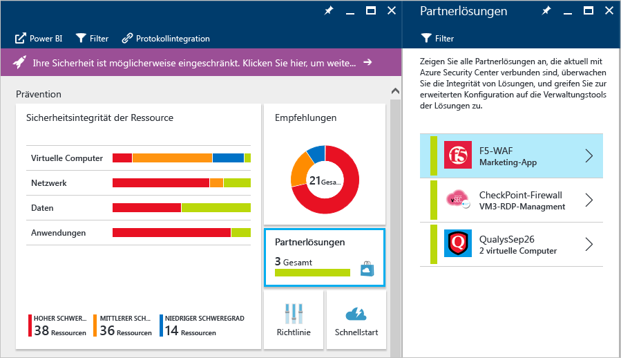

# Partnerintegration in Azure Security Center
In diesem Dokument wird erklärt, wie Azure Security Center mit Partnern integriert wird, um die allgemeine Sicherheit zu verbessern und eine integrierte Erfahrung in Azure bereitzustellen, und gleichzeitig Vorteile aus dem Azure Marketplace für die Zertifizierung von Partnern und die Abrechnung zu ziehen.

## Warum werden Partnerlösungen aus Security Center bereitgestellt?

Die vier Hauptgründe, warum die Partnerintegration in Security Center genutzt wird, sind:

- **Einfache Bereitstellung**: Das Bereitstellen einer Partnerlösung ist viel einfacher, wenn Sie die Security Center-Empfehlung befolgen. Der Bereitstellungsprozess kann mithilfe einer Standardkonfiguration und Netzwerktopologie vollständig automatisiert werden, oder Kunden können eine halbautomatische Option auswählen, um mehr Flexibilität und Anpassung der Konfiguration zu erlauben.
- **Integrierte Erkennungen**: Sicherheitsereignisse von Partnerlösungen werden automatisch gesammelt, aggregiert und im Rahmen der Security Center-Warnungen und Vorfälle angezeigt. Diese Ereignisse werden ebenso mit Erkennungen anderer Quellen verbunden, um erweiterte Bedrohungserkennungsfunktionen bereitzustellen.
- **Vereinheitlichte Systemüberwachung und -verwaltung**: Mit integrierten Integritätsereignissen können Kunden alle Partnerlösungen auf einen Blick überwachen. Die grundlegende Verwaltung ist mit einfachen Zugriff auf die erweiterte Konfiguration mithilfe der Partnerlösung verfügbar.
- **Exportieren auf SIEM**: Kunden können nun alle Security Center- und Partnerwarnungen im CEF-Format auf lokale SIEM-Systeme mithilfe der Microsoft Azure-Protokollintegration (Preview) exportieren.

## Welche Partner sind in Security Center integriert?
In Security Center sind derzeit folgende Partner integriert:

- Endpoint Protection (Trend Micro), 
- Web Application Firewall (Barracuda, F5, Imperva und bald Microsoft WAF sowie Fortinet), 
- Firewall-Lösungen der nächsten Generation (Check Point, Barracuda und bald Fortinet sowie Cisco). 
- Lösungen zur Sicherheitsrisikobewertung (Qualys – Preview) 

Im Laufe der Zeit wird Security Center die Anzahl der Partner innerhalb der vorhandenen Kategorien vergrößern sowie neue Kategorien hinzufügen. 

## Wie wird eine Partnerlösung bereitgestellt?

Sie können einfach auf Lösungen von Partnern, die bereits in Security Center bereitgestellt wurden, von der Kachel „Partnerlösung“ im Hautpdashboard „Security Center“ aus zugreifen.

Führen Sie die folgenden Schritte aus, um eine neue Partnerlösung auf Grundlage einer Security Center-Empfehlung bereitzustellen:

> [!NOTE]
> Im folgenden Beispiel wird davon ausgegangen, dass Sie über eine Workload verfügen, die Sie mit einer Web Application Firewall schützen möchten.

1. Klicken Sie im Security Center-Dashboard auf die Kachel **Empfehlungen**.
2. Klicken Sie auf dem Blatt **Empfehlungen** auf **Web Application Firewall hinzufügen**.
3. Klicken Sie auf den Anwendungsnamen unter dem Blatt **Web Application Firewall hinzufügen**.
4. Klicken Sie auf dem Blatt **Web Application Firewall hinzufügen** auf **Neue erstellen**.
5. Das Blatt **Create a new Web Application Firewall** (Erstellen einer neuen Web Application Firewall) zeigt eine Liste aller aktuellen Partner an, die Web Application Firewall-Funktionen anbieten.
6. Wählen Sie die entsprechende Partnerlösung aus, und befolgen Sie die notwendigen Schritte (die sich abhängig vom Partner möglicherweise unterscheiden).

Die allgemeine Bereitstellungserfahrung kann zu diesem Zeitpunkt je nach Partner variieren. Weitere Informationen zum Verwalten von Partnerlösungen in Security Center finden Sie unter [Überwachen von Partnerlösungen](security-center-partner-solutions.md) im Azure Security Center.

## Siehe auch
In diesem Dokument haben Sie erfahren, wie Sie eine Partnerlösung in Azure Security Center integrieren. Weitere Informationen zu Security Center finden Sie in den folgenden Quellen:

* [Planungs- und Betriebshandbuch für Azure Security Center](security-center-planning-and-operations-guide.md)
* [Verwalten von und Reagieren auf Sicherheitswarnungen in Azure Security Center](security-center-managing-and-responding-alerts.md)
* [Sicherheitswarnungen nach Typ in Azure Security Center](security-center-alerts-type.md)
* [Überwachen der Sicherheitsintegrität in Azure Security Center:](security-center-monitoring.md) Erfahren Sie, wie Sie die Integrität Ihrer Azure-Ressourcen überwachen.
* [Überwachen von Partnerlösungen mit Azure Security Center:](security-center-partner-solutions.md) Erfahren Sie, wie der Integritätsstatus Ihrer Partnerlösungen überwacht wird.
* [Azure Security Center – Häufig gestellte Fragen:](security-center-faq.md) Hier finden Sie häufig gestellte Fragen zur Verwendung des Diensts.
* [Azure Security Blog](http://blogs.msdn.com/b/azuresecurity/) (Blog zur Azure-Sicherheit): Hier finden Sie Blogbeiträge zur Azure-Sicherheit und -Compliance.

<!--HONumber=Nov16_HO5-->

