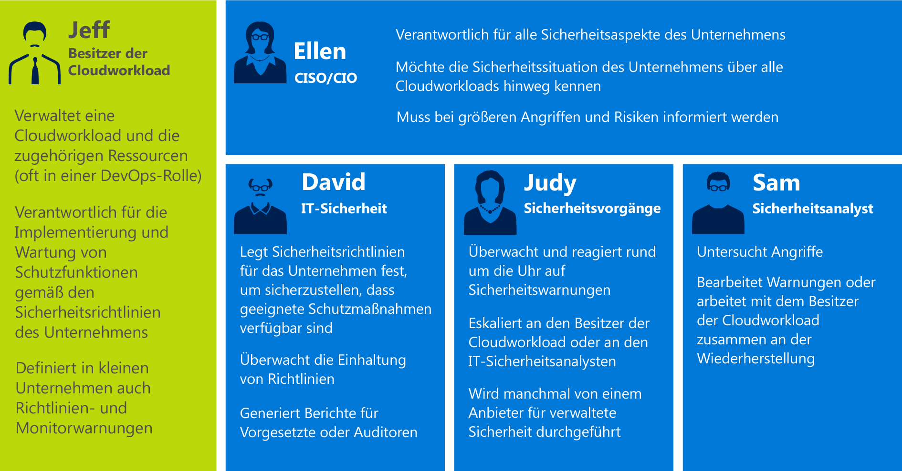
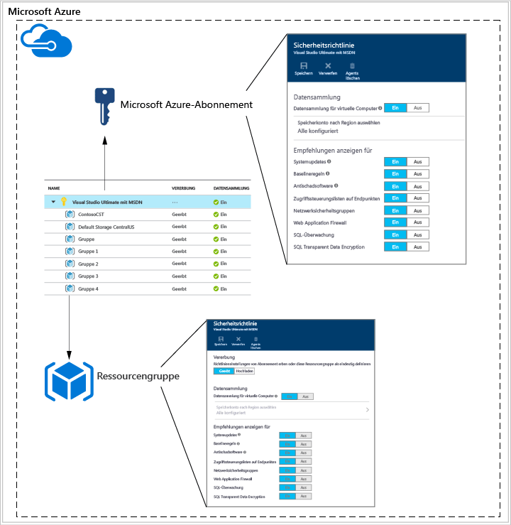
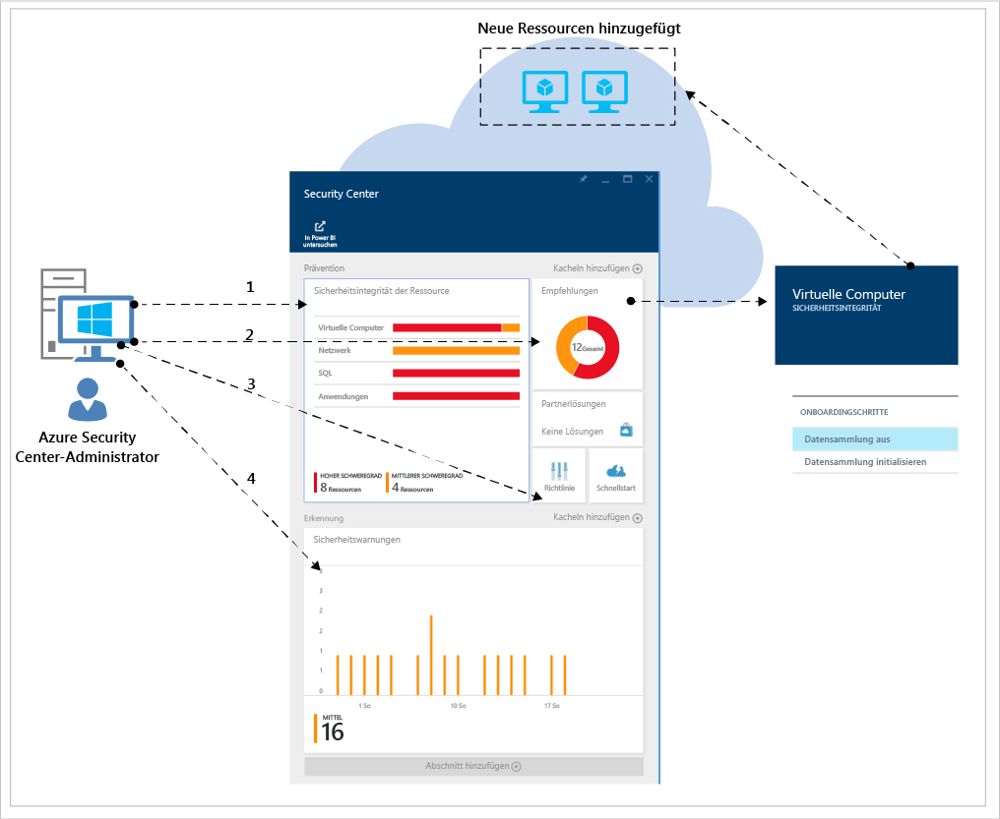
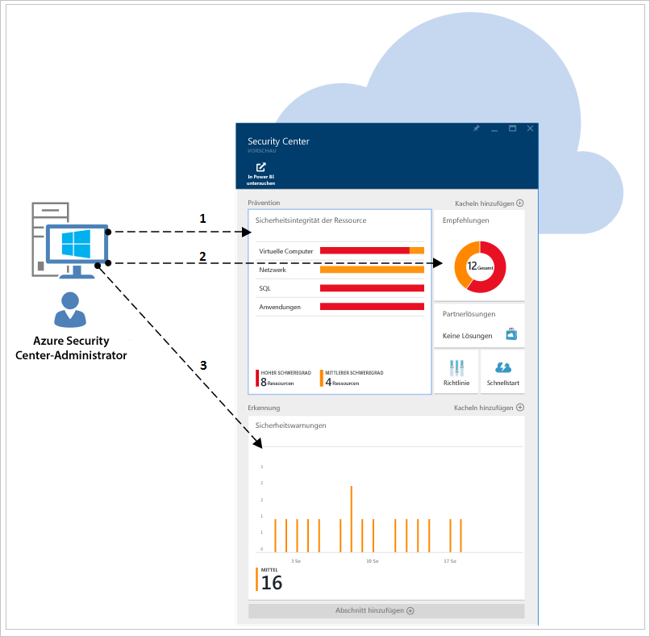
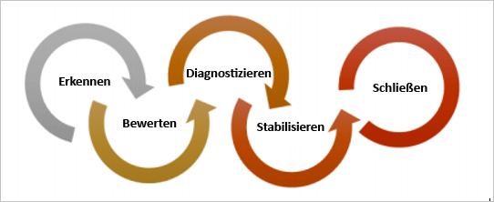
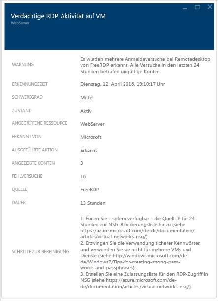

<properties
   pageTitle="Planungs- und Betriebshandbuch für Security Center | Microsoft Azure"
   description="Dieses Dokument ist hilfreich bei der Planung der Verwendung von Azure Security Center und informiert über Aspekte des täglichen Betriebs."
   services="security-center"
   documentationCenter="na"
   authors="YuriDio"
   manager="swadhwa"
   editor=""/>

<tags
   ms.service="security-center"
   ms.topic="hero-article"
   ms.devlang="na"
   ms.tgt_pltfrm="na"
   ms.workload="na"
   ms.date="09/22/2016"
   ms.author="yurid"/>

# Planungs- und Betriebshandbuch für Azure Security Center
Dieses Handbuch ist für IT-Experten, IT-Architekten, Informationssicherheitsanalysten und Cloudadministratoren konzipiert, deren Organisation Azure Security Center verwenden möchte.

## Planungshandbuch
Dieses Handbuch enthält eine Reihe von Schritten und Aufgaben, mit denen Sie die Verwendung von Security Center auf Grundlage der Sicherheitsanforderungen und des Cloudverwaltungsmodells Ihres Unternehmens optimieren können. Für eine optimale Nutzung von Security Center ist es wichtig zu verstehen, wie der Dienst von den verschiedenen Personen oder Teams in Ihrer Organisation genutzt wird, um die Anforderungen in puncto sichere Entwicklung und sicherer Betrieb, Überwachung, Governance und Reaktionen auf Vorfälle zu erfüllen. Bei der Planung zur Verwendung von Security Center sind insbesondere folgende Aspekte zu berücksichtigen:

- Sicherheitsrollen und Zugriffsteuerungen
- Sicherheitsrichtlinien und -empfehlungen
- Datensammlung und -speicherung
- Kontinuierliche Sicherheitsüberwachung
- Reaktion auf Vorfälle

Im nächsten Abschnitt erfahren Sie, wie Sie jeden dieser Aspekte bei Ihrer Planung berücksichtigen und die Empfehlungen auf der Grundlage Ihrer Anforderungen umsetzen.

> [AZURE.NOTE] Unter [Azure Security Center – Häufig gestellte Fragen](security-center-faq.md) finden Sie eine Liste mit häufig gestellten Fragen, die in der Entwurfs- und Planungsphase ebenfalls nützlich sein können.

## Sicherheitsrollen und Zugriffsteuerungen
Je nach Größe und Struktur Ihrer Organisation wird Azure Security Center unter Umständen von mehreren Einzelpersonen und Teams zur Durchführung unterschiedlicher sicherheitsbezogener Aufgaben verwenden. Im folgenden Diagramm sehen Sie ein Beispiel für fiktive Personae sowie ihre jeweiligen Rollen und Sicherheitsaufgaben:

Security Center ermöglicht es den Personen, diese unterschiedlichen Aufgaben auszuführen. Beispiel:

**Jeff (Cloudworkloadbesitzer)**

- Verwaltet eine Cloudworkload und die dazugehörigen Ressourcen
- Verantwortlich für die Implementierung und Verwaltung von Schutzmaßnahmen in Übereinstimmung mit der Sicherheitsrichtlinie des Unternehmens

**Ellen (CISO/CIO)**

- Verantwortlich für alle Sicherheitsaspekte im Unternehmen
- Möchte die Sicherheitssituation des Unternehmens in Bezug auf Cloudworkloads verstehen
- Muss über größere Angriffe und Risiken informiert werden

**David (IT-Sicherheit)**

- Legt die Sicherheitsrichtlinien des Unternehmens fest, um für die richtigen Schutzmaßnahmen zu sorgen
- Überwacht die Einhaltung von Richtlinien
- Erstellt Berichte für die Geschäftsleitung oder Prüfer

**Judy (Security Operations)**

- Überwacht und reagiert auf Sicherheitswarnungen rund um die Uhr
- Eskaliert zu Cloudworkloadbesitzer oder IT Security Analyst

**Sam (Security Analyst)**

- Untersucht Angriffe
- Findet Lösungen bei Warnungen oder arbeitet zusammen mit dem Cloudworkloadbesitzer an der Lösung

Security Center verwendet die [rollenbasierte Zugriffssteuerung (Role-Based Access Control, RBAC)](../active-directory/role-based-access-control-configure.md). Dabei werden [integrierte Rollen](../active-directory/role-based-access-built-in-roles.md) bereitgestellt, die Benutzern, Gruppen und Diensten in Azure zugewiesen werden können. Wenn Benutzer Security Center öffnen, werden nur Informationen zu den Ressourcen angezeigt, auf die jeweils Zugriff besteht. Dies bedeutet, dass dem Benutzer die Rolle „Besitzer“, „Mitwirkender“ oder „Leser“ für das Abonnement oder die Ressourcengruppe einer Ressource zugewiesen wird. Für die Personae im obigen Diagramm wären die folgenden RBAC-Einstellungen erforderlich:

**Jeff (Cloudworkloadbesitzer)**

- Ressourcengruppenbesitzer/-mitarbeiter

**David (IT-Sicherheit)**

- Abonnementbesitzer/-mitarbeiter

**Judy (Security Operations)**

- Abonnementleser zum Anzeigen von Warnungen
- Abonnementbesitzer/-mitarbeiter zum Verwerfen von Warnungen

**Sam (Security Analyst)**

- Abonnementleser zum Anzeigen von Warnungen
- Abonnementbesitzer/-mitarbeiter zum Beseitigen oder Verwerfen von Warnungen
- Zugriff auf den Speicher (bei Bedarf)

Einige weitere wichtige Informationen, die es zu berücksichtigen gilt:

- Nur Abonnementbesitzer und Mitwirkende können eine Sicherheitsrichtlinie bearbeiten.
- Nur Abonnement- und Ressourcengruppenbesitzer und Mitwirkende können Sicherheitsempfehlungen für eine Ressource umsetzen.

Bei der Planung der Zugriffssteuerung mit RBAC für Security Center müssen Sie zunächst ermitteln, wer in Ihrer Organisation Security Center verwendet. Außerdem muss ermittelt werden, welche Aufgaben diese Personen jeweils ausführen, und dann müssen die RBAC-Einstellungen entsprechend konfiguriert werden.

> [AZURE.NOTE] Es empfiehlt sich, den Benutzern eine Rolle zuzuweisen, die jeweils nur so viele Berechtigungen umfasst wie für die Erfüllung ihrer Aufgaben erforderlich sind. So sollte etwa Benutzern, die nur Informationen zum Sicherheitszustand von Ressourcen anzeigen, aber keine Aktionen durchführen müssen (also beispielsweise keine Empfehlungen umsetzen oder Richtlinien bearbeiten), nur die Leserrolle zugewiesen werden.

## Sicherheitsrichtlinien und -empfehlungen
In einer Sicherheitsrichtlinie wird der Satz von Sicherheitsmechanismen definiert, die für Ressourcen in dem angegebenen Abonnement oder der angegebenen Ressourcengruppe zu empfehlen sind. In Security Center definieren Sie Richtlinien auf Grundlage der Sicherheitsanforderungen Ihres Unternehmens sowie auf Grundlage der Art von Anwendungen oder der Vertraulichkeit der Daten.

Auf Abonnementebene aktivierte Richtlinien werden automatisch an alle Ressourcen innerhalb des Abonnements verteilt. Dies ist im folgenden Diagramm dargestellt:

Wie Sie in der obigen Abbildung sehen, können Sicherheitsrichtlinien für Ressourcengruppen von der Abonnementebene geerbt werden.

In Szenarien, in denen für Ressourcen in einer Ressourcengruppe abweichende Richtlinien benötigt werden, können Sie die Vererbung deaktivieren und benutzerdefinierte Richtlinien auf eine bestimmte Ressourcengruppe anwenden.

Falls Sie benutzerdefinierte Richtlinien für bestimmte Ressourcengruppen benötigen, müssen Sie die Vererbung in der Ressourcengruppe deaktivieren und die Sicherheitsrichtlinien ändern. Wenn Sie also etwa über Workloads verfügen, für die die Transparent Data Encryption-Richtlinie für SQL nicht benötigt wird, können Sie die Richtlinie auf der Abonnementebene deaktivieren und nur in den Ressourcengruppen aktivieren, in denen sie benötigt wird.

Wenn Sie benutzerdefinierte Richtlinien für verschiedene Ressourcengruppen erstellen, müssen Sie bei der Planung Ihrer Richtlinienbereitstellung berücksichtigen, dass im Falle eines Richtlinienkonflikts (Abonnement kontra Ressourcengruppe) die Ressourcengruppenrichtlinie Vorrang hat.

> [AZURE.NOTE] Welche Richtlinien geändert wurden, erfahren Sie in den [Azure-Überwachungsprotokollen](https://blogs.msdn.microsoft.com/cloud_solution_architect/2015/03/10/audit-logs-for-azure-events/). Richtlinienänderungen werden immer in Azure-Überwachungsprotokollen protokolliert.

### Sicherheitsempfehlungen

Ermitteln Sie vor dem Konfigurieren der Sicherheitsrichtlinien zunächst anhand der [Sicherheitsempfehlungen](security-center-recommendations.md), ob diese Richtlinien für Ihre verschiedenen Abonnements und Ressourcengruppen geeignet sind. Darüber hinaus müssen Sie wissen, mit welcher Aktion die Sicherheitsempfehlungen umgesetzt werden.

**Endpunktschutz**: Ist für einen virtuellen Computer keine Endpunktschutzlösung aktiviert, empfiehlt Security Center die Installation einer solchen Lösung. Wenn Sie Ihre bevorzugte Endpunktschutzlösung bereits lokal implementiert haben, müssen Sie entscheiden, ob Sie die gleiche Antischadsoftware für Ihre virtuellen Azure-Computer verwenden möchten. Security Center bietet mehrere Optionen für den Endpunktschutz. Sie können Microsoft Antimalware (kostenlos) verwenden oder in einer Liste mit Endpunktschutzlösungen von integrierten Partnern eine Option auswählen. Weitere Informationen zum Bereitstellen von Antischadsoftware mit Security Center finden Sie unter [Installieren von Endpoint Protection in Azure Security Center](security-center-install-endpoint-protection.md).

**Systemupdates**: Security Center identifiziert virtuelle Computer, bei denen Sicherheitsupdates oder wichtige Betriebssystemupdates für IaaS und Cloud Services (PaaS) fehlen. Überlegen Sie, wer bei Bedarf für die Anwendung der Updates zuständig ist und wie die Updates angewendet werden. Viele Organisationen verwenden WSUS, Windows Update oder ein anderes Tool.

**Basiskonfigurationen**: Wenn die Betriebssystemkonfiguration der virtuellen Computer nicht den empfohlenen Grundwerten entspricht, wird eine entsprechende Empfehlung angezeigt. Sehen Sie sich die [Grundwerte](https://gallery.technet.microsoft.com/Azure-Security-Center-a789e335) an, und überlegen Sie sich, wie Betriebssystemkonfigurationen angewendet werden.

**Datenträgerverschlüsselung**: Wenn Sie virtuelle Computer verwenden, die nicht verschlüsselt sind, empfiehlt Security Center den Einsatz von Azure Disk Encryption. Bei diesem Feature werden BitLocker für Windows und DM-Crypt für Linux verwendet, um die Volumeverschlüsselung für die Datenträger für das Betriebssystem und die Daten bereitzustellen. Über diese Empfehlung gelangen Sie zu einer [Schritt-für-Schritt-Anleitung](security-center-disk-encryption.md) mit Informationen zur Durchführung der Verschlüsselung.

Beachten Sie, dass Sie sich um mehrere Verschlüsselungsszenarien kümmern müssen. Bei der Planung sind jeweils die individuellen Anforderungen der einzelnen Szenarien zu berücksichtigen:

- Verschlüsselung neuer virtueller Azure-Computer auf der Grundlage von VHDs, die Sie mit Ihren eigenen Verschlüsselungsschlüsseln verschlüsselt haben
- Verschlüsselung neuer virtueller Azure-Computer, die auf der Grundlage des Azure-Katalogs erstellt wurden
- Verschlüsselung virtueller Azure-Computer, die bereits in Azure ausgeführt werden

Für jedes dieser Szenarien gelten individuelle Planungsanforderungen. Ausführliche Informationen zu den einzelnen Szenarien finden Sie im [Whitepaper zu Azure Disk Encryption](https://gallery.technet.microsoft.com/Azure-Disk-Encryption-for-a0018eb0).

**Web Application Firewall**: Security Center identifiziert virtuelle Computer, auf denen Webanwendungen ausgeführt werden, und empfiehlt die Installation einer Web Application Firewall (WAF). Ermitteln Sie die Partnerlösung, die am besten für Ihre Organisation geeignet ist, und bringen Sie in Erfahrung, wie die Lösung lizenziert wird. (Partner unterstützen unter Umständen Bring-Your-Own-License-Modelle und/oder nutzungsbasierte Bezahlmodelle.) Weitere Informationen zum Bereitstellen einer Web Application Firewall auf Ihren virtuellen Azure-Computern mithilfe von Security Center finden Sie unter [Hinzufügen einer Web Application Firewall in Azure Security Center](security-center-add-web-application-firewall.md).

**Firewall der nächsten Generation**: Ermöglicht Ihnen das Bereitstellen eines virtuellen Geräts von führenden Anbietern, z.B. Check Point und in Kürze Cisco und Fortinet. Erweitert den Schutz von Netzwerken über die in Azure integrierten Netzwerksicherheitsgruppen hinaus. Security Center erkennt Bereitstellungen, für die eine Firewall der nächsten Generation empfohlen wird, und ermöglicht Ihnen die Bereitstellung eines virtuellen Geräts.

**Virtuelles Netzwerk**: Security Center überprüft anhand der Infrastruktur und Konfiguration Ihres [Azure Virtual Network](https://azure.microsoft.com/documentation/services/virtual-network/), ob [Netzwerksicherheitsgruppen](../virtual-network/virtual-networks-nsg.md) angewendet wurden und richtig mit Regeln für eingehenden Datenverkehr konfiguriert sind. Überlegen Sie sich, welche Datenverkehrsregeln definiert werden müssen, und geben Sie diese Information an die Personen weiter, die die entsprechenden Sicherheitsempfehlungen umsetzen.

In Security Center wird die Bereitstellung von Sicherheitskontaktinformationen für Ihr Azure-Abonnement empfohlen. Microsoft kontaktiert Sie anhand dieser Informationen, wenn Microsoft Security Response Center (MSRC) feststellt, dass Personen unrechtmäßig oder unbefugt auf Ihre Kundendaten zugegriffen haben. Weitere Informationen zur Aktivierung dieser Empfehlung finden Sie unter [Bereitstellen von Sicherheitskontaktinformationen in Azure Security Center](security-center-provide-security-contact-details.md).

## Datensammlung und -speicherung

Es wird dringend empfohlen, die Datensammlung für alle Abonnements zu aktivieren, um sicherzustellen, dass die Sicherheitsüberwachung für alle VMs verfügbar ist. Die Datensammlung wird über den Azure-Überwachungs-Agent (ASMAgentLauncher.exe) und die Azure-Erweiterung für Sicherheitsüberwachung (ASMMonitoringAgent.exe) ermöglicht.

Die Azure-Erweiterung für Sicherheitsüberwachung sucht nach verschiedenen sicherheitsrelevanten Konfigurationen und erfasst Sicherheitsprotokolle des virtuellen Computers. Diese Daten werden an das angegebene Speicherkonto gesendet. Der Scan-Manager (ASMSoftwareScanner.exe) wird ebenfalls auf dem virtuellen Computer installiert und dient als Patch-Scanner.

Nach Aktivierung der Datensammlung in der Sicherheitsrichtlinie werden der Überwachungs-Agent und die entsprechenden Erweiterungen automatisch auf allen vorhandenen und neuen unterstützten virtuellen Computern installiert, die in Azure bereitgestellt werden. Der Agent-Prozess ist nicht invasiv, und die Leistung des virtuellen Computers wird dadurch nicht beeinträchtigt.

> [AZURE.NOTE] Informationen zur Behandlung von Problemen mit dem Azure-Agent für die Sicherheitsüberwachung finden Sie unter [Azure Security Center – Handbuch zur Problembehandlung](security-center-troubleshooting-guide.md).

Die Datensammlung kann bei Bedarf in der Sicherheitsrichtlinie deaktiviert werden. Zuvor bereitgestellte Überwachungs-Agents können mithilfe der Menüoption zum Löschen von Agents gelöscht werden.

> [AZURE.NOTE] Eine Liste mit unterstützten virtuellen Computern finden Sie unter [Azure Security Center – Häufig gestellte Fragen](security-center-faq.md).

Wählen Sie für jede Region, in der Sie virtuelle Computer ausführen, ein Speicherkonto, in dem Daten dieser virtuellen Computer gespeichert werden. Wenn Sie kein Speicherkonto für die einzelnen Regionen auswählen, wird ein Speicherkonto für Sie erstellt. Sie können jeweils einen regionsspezifischen Speicherort auswählen oder alle Informationen an einem zentralen Ort speichern. Sicherheitsrichtlinien können zwar auf der Ebene von Azure-Abonnement und -Ressourcengruppe festgelegt werden, aber die Region für Ihr Speicherkonto kann nur auf Abonnementebene ausgewählt werden.

Wenn Sie ein Speicherkonto für mehrere verschiedene Azure-Ressourcen verwenden möchten, lesen Sie den Artikel [Skalierbarkeits- und Leistungsziele für Azure Storage](../storage/storage-scalability-targets.md), um weitere Informationen zu Größenlimits und Einschränkungen zu erhalten. Für Ihr Abonnement gelten auch Speicherkontolimits. Diese werden in [Einschränkungen für Azure-Abonnements und Dienste, Kontingente und Einschränkungen](../azure-subscription-service-limits.md) beschrieben.

> [AZURE.NOTE] Die für diesen Speicher anfallenden Kosten sind nicht im Preis für Security Center enthalten und werden separat in Rechnung gestellt (zu den üblichen [Azure Storage-Gebühren](https://azure.microsoft.com/pricing/details/storage/)).

Die Planung der Leistungs- und Skalierbarkeitsaspekte muss sich auch an der Größe Ihrer Azure-Umgebung und am Ressourcenbedarf Ihres Speicherkontos orientieren. Weitere Informationen finden Sie unter [Checkliste zu Leistung und Skalierbarkeit von Microsoft Azure Storage](../storage/storage-performance-checklist.md).

## Kontinuierliche Sicherheitsüberwachung

Nach Konfiguration und Anwendung der Security Center-Empfehlungen müssen Sie sich Gedanken zu den Betriebsprozessen von Security Center machen.

Klicken Sie im Azure-Portal auf **Durchsuchen**, und geben Sie im Feld **Filter** die Zeichenfolge **Security Center** ein, um Security Center aufzurufen. Welche Ansichten dem Benutzer angezeigt werden, hängt von diesen angewendeten Filtern ab.

Der Normalbetrieb wird durch Security Center nicht beeinträchtigt. Die Lösung überwacht passiv Ihre Bereitstellungen und liefert Empfehlungen auf der Grundlage der aktivierten Sicherheitsrichtlinien.

Das Security Center-Dashboard ist in zwei Hauptbereiche unterteilt:

- Prävention
- Erkennung

Wenn Sie in Security Center erstmals die Datensammlung für die aktuelle Azure-Umgebung aktivieren, sollten Sie sich unbedingt alle Empfehlungen ansehen – entweder auf dem Blatt **Empfehlungen** oder pro Ressource (**Virtueller Computer**, **Netzwerk**, **SQL** und **Anwendung**).

Nach der Umsetzung aller Empfehlungen werden im Abschnitt **Prävention** alle behandelten Ressourcen grün dargestellt. Eine kontinuierliche Überwachung wird dann einfacher, da Sie nur bei einer Veränderung der Kacheln für Ressourcensicherheitsintegrität und Empfehlungen aktiv werden müssen.

Der Abschnitt **Erkennung** ist eher reaktionsorientiert. Die Warnungen beziehen sich auf Probleme, die entweder aktuell vorliegen oder in der Vergangenheit aufgetreten sind und bei Security Center-Kontrollen oder von Drittanbietersystemen erkannt wurden. Auf der Kachel „Sicherheitswarnungen“ werden anhand von Balkendiagrammen die Anzahl gefundener Bedrohungserkennungswarnungen pro Tag sowie deren Verteilung auf unterschiedliche Schweregradkategorien (niedrig, mittel, hoch) angezeigt. Weitere Informationen zu Sicherheitswarnungen finden Sie unter [Verwalten von und Reagieren auf Sicherheitswarnungen in Azure Security Center](security-center-managing-and-responding-alerts.md).

> [AZURE.NOTE] Sie können auch Microsoft Power BI zur Visualisierung Ihrer Security Center-Daten verwenden. Weitere Informationen finden Sie unter [Gewinnen von Erkenntnissen aus Azure Security Center-Daten mit Power BI](security-center-powerbi.md).

### Überwachung auf neue oder geänderte Ressourcen

Die meisten Azure-Umgebungen sind dynamisch, sodass unter anderem immer wieder neue Ressourcen hinzukommen oder wegfallen und Konfigurationen geändert werden. Security Center trägt dazu bei, dass Sie den Überblick über den Sicherheitszustand dieser neuen Ressourcen behalten.

Wenn Sie Ihrer Azure-Umgebung neue Ressourcen (virtuelle Computer, SQL-Datenbanken) hinzufügen, erkennt Security Center dies automatisch und beginnt mit der Überwachung ihrer Sicherheit. Hierzu gehören auch PaaS-Webrollen und -Workerrollen. Wenn in der [Sicherheitsrichtlinie](security-center-policies.md) die Datensammlung aktiviert ist, werden für Ihre virtuellen Computer automatisch zusätzliche Überwachungsfunktionen aktiviert.

1.	Greifen Sie bei virtuellen Computern auf die Kachel **Sicherheitsintegrität von Ressourcen** zu, und klicken Sie auf **Virtuelle Computer**. Probleme mit der Aktivierung der Datensammlung oder entsprechenden Empfehlungen werden im Abschnitt **Überwachungsempfehlungen** behandelt.
2.	In den **Empfehlungen** erfahren Sie, ob (und wenn ja, welche) Sicherheitsrisiken für die neue Ressource gefunden wurden.
3.	Auf virtuellen Computern, die der Umgebung neu hinzugefügt werden, ist zunächst häufig nur das Betriebssystem installiert. Der Ressourcenbesitzer benötigt unter Umständen etwas Zeit, um weitere Apps bereitzustellen, die von diesen virtuellen Computern verwendet werden. Im Idealfall sollten Sie den endgültigen Zweck der Workload kennen. Wird der Computer als Anwendungsserver verwendet? Je nach Zweck der neuen Workload können Sie dann die passende **Sicherheitsrichtlinie** aktivieren. Dies ist der dritte Schritt in diesem Workflow.
4.	Wenn der Azure-Umgebung neue Ressourcen hinzugefügt werden, werden auf der Kachel **Sicherheitswarnungen** unter Umständen neue Warnungen angezeigt. Prüfen Sie die Kachel immer auf neue Warnungen, und setzen Sie die Empfehlungen von Security Center um.

Außerdem empfiehlt es sich, regelmäßig den Zustand vorhandener Ressourcen zu prüfen, um Konfigurationsänderungen zu identifizieren, die zu Sicherheitsrisiken geführt haben, nicht den empfohlenen Grundwerten entsprechen und Sicherheitswarnungen generiert haben. Navigieren Sie hierzu zunächst zum Security Center-Dashboard. Hier gibt es drei Hauptbereiche, die Sie regelmäßig überprüfen sollten.

1.	Über den Bereich **Sicherheitsintegrität von Ressourcen** können Sie schnell auf Ihre wichtigsten Ressourcen zugreifen. Verwenden Sie diese Option zum Überwachen Ihrer virtuellen Computer, Netzwerke, SQL Server und Anwendungen.
2.	Der Bereich **Empfehlungen** enthält die Empfehlungen von Security Center. Im Rahmen der kontinuierlichen Überwachung stehen möglicherweise nicht jeden Tag Empfehlungen zur Verfügung. Dies ist normal, da Sie ja alle Empfehlungen bei der Ersteinrichtung von Security Center umgesetzt haben. Aus diesem Grund enthält der Abschnitt unter Umständen nicht täglich neue Informationen, sodass Sie nur bei Bedarf darauf zugreifen müssen.
3.	Der Abschnitt **Erkennung** kann sich sehr häufig oder auch nur sehr selten ändern. Prüfen Sie immer Ihre Sicherheitswarnungen, und setzen Sie die Empfehlungen von Security Center um.

## Reaktion auf Vorfälle

Security Center erkennt Bedrohungen, wenn diese entstehen, und macht Sie darauf aufmerksam. Organisationen sollten eine Überwachung auf neue Sicherheitswarnungen implementieren und bei Bedarf geeignete Maßnahmen zur weiteren Untersuchung oder Abwehr des Angriffs ergreifen. Weitere Informationen zur Funktionsweise der Security Center-Bedrohungserkennung finden Sie unter [Azure Security Center-Erkennungsfunktionen](security-center-detection-capabilities.md).

Dieser Artikel soll Ihnen zwar nicht als Hilfe beim Erstellen eines eigenen Plans für Reaktionen auf Zwischenfälle dienen, aber wir verwenden Microsoft Azure Security Response im Cloudlebenszyklus als Grundlage für die Phasen der Reaktionen auf Zwischenfälle. Die Phasen sind in der folgenden Abbildung dargestellt:

> [AZURE.NOTE] Zu diesem Zweck können Sie den [Computer Security Incident Handling Guide](http://nvlpubs.nist.gov/nistpubs/SpecialPublications/NIST.SP.800-61r2.pdf) des NIST (National Institute of Standards and Technology) verwenden.

Sie können Security Center-Warnungen in den folgenden Phasen verwenden:

- **Erkennen**: Identifizieren einer verdächtigen Aktivität in Ressourcen
- **Bewerten**: Durchführen der ersten Bewertung, um weitere Informationen zur verdächtigen Aktivität zu erhalten
- **Diagnostizieren**: Verwenden der Wiederherstellungsschritte für das technische Verfahren zum Beheben des Problems

Die in jeder Sicherheitswarnung enthaltenen Informationen ermöglichen es, die Art des Angriffs zu ermitteln und mögliche Lösungen vorzuschlagen. Einige Warnungen enthalten auch Links zu weiteren Informationen oder zu anderen Informationsquellen in Azure. Diese Informationen können für weitere Untersuchungen und für Gegenmaßnahmen genutzt werden.

Das folgende Beispiel zeigt eine verdächtige RDP-Aktivität:

Wie Sie sehen, enthält dieses Blatt Details zur Angriffszeit, den Hostnamen der Quelle, den Ziel-VM sowie empfohlene Schritte. In bestimmten Fällen sind die Quellinformationen des Angriffs möglicherweise leer. Weitere Informationen hierzu finden Sie unter [Fehlende Quellinformationen in Azure Security Center-Warnungen](https://blogs.msdn.microsoft.com/azuresecurity/2016/03/25/missing-source-information-in-azure-security-center-alerts/).

Das Video [How to Leverage the Azure Security Center & Microsoft Operations Management Suite for an Incident Response](https://channel9.msdn.com/Blogs/Taste-of-Premier/ToP1703) (Nutzen von Azure Security Center und Microsoft Operations Management Suite für eine Reaktion auf Vorfälle) enthält Demos, mit denen verdeutlicht wird, wie Sie Security Center in den einzelnen Phasen nutzen können.

> [AZURE.NOTE] Unter [Verwenden von Azure Security Center zur Reaktion auf Vorfälle](security-center-incident-response.md) erhalten Sie weitere Informationen dazu, wie Security Center-Funktionen Sie während des Prozesses zur Reaktion auf Vorfälle unterstützen.

## Weitere Informationen
In diesem Dokument haben Sie erfahren, wie Sie die Einführung von Security Center planen. Weitere Informationen zu Security Center finden Sie in den folgenden Quellen:

- [Verwalten von und Reagieren auf Sicherheitswarnungen in Azure Security Center](security-center-managing-and-responding-alerts.md)
- [Überwachen der Sicherheitsintegrität in Azure Security Center:](security-center-monitoring.md) Erfahren Sie, wie Sie die Integrität Ihrer Azure-Ressourcen überwachen.
- [Überwachen von Partnerlösungen mit Azure Security Center:](security-center-partner-solutions.md) Erfahren Sie, wie der Integritätsstatus Ihrer Partnerlösungen überwacht wird.
- [Azure Security Center – Häufig gestellte Fragen:](security-center-faq.md) Hier finden Sie häufig gestellte Fragen zur Verwendung des Diensts.
- [Azure Security Blog](http://blogs.msdn.com/b/azuresecurity/) (Blog zur Azure-Sicherheit): Hier finden Sie Blogbeiträge zur Azure-Sicherheit und -Compliance.

<!---HONumber=AcomDC_0928_2016-->