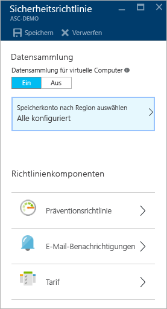
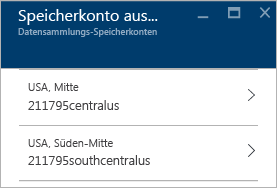
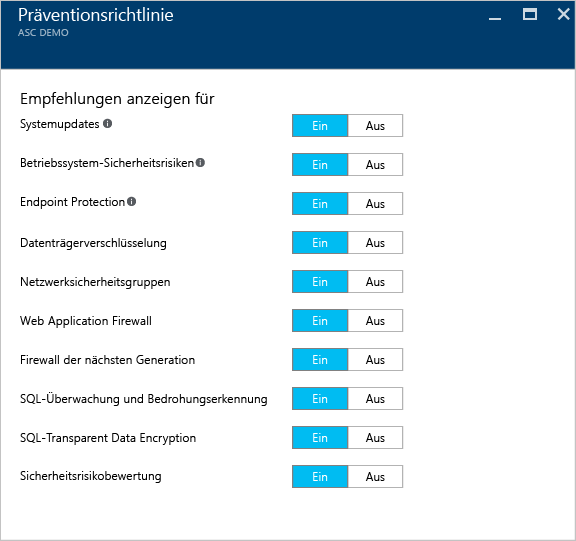
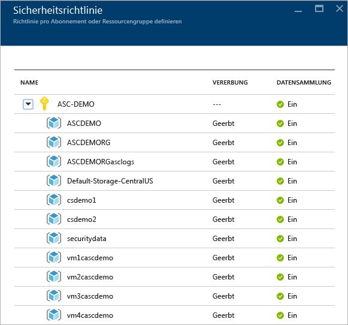
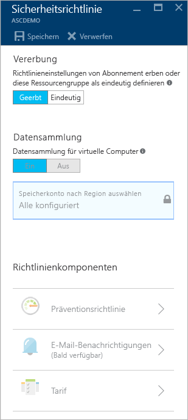

<properties
   pageTitle="Festlegen von Sicherheitsrichtlinien in Azure Security Center | Microsoft Azure"
   description="Dieses Dokument enthält Informationen dazu, wie Sie Sicherheitsrichtlinien in Azure Security Center konfigurieren können."
   services="security-center"
   documentationCenter="na"
   authors="YuriDio"
   manager="swadhwa"
   editor=""/>

<tags
   ms.service="security-center"
   ms.devlang="na"
   ms.topic="hero-article"
   ms.tgt_pltfrm="na"
   ms.workload="na"
   ms.date="09/22/2016"
   ms.author="yurid"/>

# Festlegen von Sicherheitsrichtlinien in Azure Security Center
Dieses Dokument hilft Ihnen dabei, Sicherheitsrichtlinien in Security Center zu konfigurieren. Es werden die erforderlichen Schritte zum Ausführen dieser Aufgabe beschrieben.

## Was sind Sicherheitsrichtlinien?
In einer Sicherheitsrichtlinie wird der Satz von Sicherheitsmechanismen definiert, die für Ressourcen in dem angegebenen Abonnement oder der angegebenen Ressourcengruppe zu empfehlen sind. In Security Center definieren Sie Richtlinien für Ihre Azure-Abonnements oder -Ressourcengruppen gemäß den Sicherheitsanforderungen Ihres Unternehmens sowie gemäß der Art von Anwendungen oder der Vertraulichkeit der Daten in den einzelnen Abonnements.

So gelten beispielsweise für Ressourcen, die zu Entwicklungs- oder Testzwecken verwendet werden, unter Umständen andere Sicherheitsanforderungen als für Ressourcen, die für Produktionsanwendungen verwendet werden. Ebenso kann für Anwendungen mit reglementierten Daten, etwa personenbezogene Informationen (Personally Identifiable Information), eine höhere Sicherheitsstufe erforderlich sein. Die in Azure Security Center aktivierten Sicherheitsrichtlinien werden dazu verwendet, Sicherheitsempfehlungen und die Überwachung zu steuern, damit Sie potenzielle Sicherheitsrisiken identifizieren und Bedrohungen entschärfen können. Weitere Informationen dazu, wie Sie die für Sie am besten geeignete Option ermitteln können, finden Sie unter [Planungs- und Betriebshandbuch für Azure Security Center](security-center-planning-and-operations-guide.md).

## Festlegen von Sicherheitsrichtlinien für Abonnements

Sie können Sicherheitsrichtlinien für jedes Abonnement oder jede Ressourcengruppe konfigurieren. Damit Sie eine Sicherheitsrichtlinie ändern können, müssen Sie ein Besitzer oder Mitwirkender dieses Abonnements sein. Melden Sie sich am Azure-Portal an, und führen Sie die folgenden Schritte aus, um Sicherheitsrichtlinien in Security Center zu konfigurieren:

1. Klicken Sie auf dem Security Center-Dashboard auf die Kachel **Richtlinie**.

2. Wählen Sie auf dem Blatt **Sicherheitsrichtlinie – Richtlinie pro Abonnement oder Ressourcengruppe festlegen**, das geöffnet wird, das Abonnement aus, für das Sie die Sicherheitsrichtlinie aktivieren möchten. Wenn Sie die Sicherheitsrichtlinie nicht für das gesamte Abonnement, sondern nur für eine Ressourcengruppe aktivieren möchten, scrollen Sie zum nächsten Abschnitt, in dem das Einrichten von Sicherheitsrichtlinien für Ressourcengruppen erläutert wird.

    

3. Das Blatt **Sicherheitsrichtlinie** für das ausgewählte Abonnement wird mit einer Reihe von Optionen geöffnet. Die Optionen sind im folgenden Screenshot dargestellt:

    

	Auf diesem Blatt stehen folgende Optionen zur Verfügung:
	- **Präventionsrichtlinie**: Verwenden Sie diese Option, um Richtlinien auf Abonnement- oder Ressourcengruppenebene zu konfigurieren.
	- **E-Mail-Benachrichtigung**: Verwenden Sie diese Option zum Konfigurieren einer E-Mail-Benachrichtigung, die beim ersten täglichen Auftreten einer Warnung und für Warnungen mit hohem Schweregrad gesendet wird. E-Mail-Optionen können nur für Abonnementrichtlinien konfiguriert werden. Weitere Informationen zum Konfigurieren einer E-Mail-Benachrichtigung finden Sie unter [Bereitstellen von Sicherheitskontaktinformationen in Azure Security Center](security-center-provide-security-contact-details.md).
	- **Tarif**: Verwenden Sie diese Option, um für die Tarifauswahl ein Upgrade durchzuführen. Weitere Informationen zu den Preisoptionen finden Sie auf der [Security Center-Seite](https://azure.microsoft.com/pricing/details/security-center/).

4.  Stellen Sie sicher, dass die Option **Datensammlung für virtuelle Computer** auf **Ein** festgelegt ist. Diese Option aktiviert automatische Protokollsammlung für vorhandene und neue Ressourcen.

    >[AZURE.NOTE] Es empfiehlt sich, die Datensammlung für Ihre gesamten Abonnements zu aktivieren, damit die Sicherheitsüberwachung für alle vorhandenen und neuen virtuellen Computer verfügbar ist. Wird Datensammlung aktiviert, wird der Überwachungs-Agent installiert. Wenn Sie die Datensammlung von diesem Standort momentan nicht aktivieren möchten, können Sie dies später über die Ansichten **Integrität** und **Empfehlungen** nachholen. Sie können die Datensammlung auch nur für das Abonnement oder für ausgewählte virtuelle Computer aktivieren. Weitere Informationen zu den unterstützten virtuellen Computern finden Sie unter [Azure Security Center – häufig gestellte Fragen](security-center-faq.md).

5. Wenn das Speicherkonto noch nicht konfiguriert wurde, wird unter Umständen eine Warnung wie im folgenden Screenshot angezeigt, wenn Sie die Option **Sicherheitsrichtlinie** öffnen:

    

6. Sollte diese Warnung angezeigt werden, klicken Sie auf die angegebene Option und wählen die Region aus, wie im folgenden Screenshot zu sehen:

    

7. Wählen Sie für jede Region, in der Sie virtuelle Computer ausführen, ein Speicherkonto aus, in dem Daten gespeichert werden, die von diesen virtuellen Computern gesammelt wurden. Dies macht es einfach, Daten zu Datenschutz- und Datenhoheitszwecken in demselben geografischen Gebiet zu speichern. Nachdem Sie entschieden haben, welche Region verwendet werden soll, wählen Sie die Region und dann das Speicherkonto aus.

8. Klicken Sie auf dem Blatt **Speicherkonten auswählen** auf **OK**.

    > [AZURE.NOTE] Bei Bedarf können Sie Daten für virtuelle Computer in verschiedenen Regionen unter einem zentralen Speicherkonto aggregieren. Weitere Informationen hierzu finden Sie unter [Azure Security Center – Häufig gestellte Fragen](security-center-faq.md).

9. Klicken Sie auf dem Blatt **Sicherheitsrichtlinie** auf **Ein**, um die Sicherheitsempfehlungen zu aktivieren, die Sie für dieses Abonnement verwenden möchten. Klicken Sie auf **Präventionsrichtlinie**, um Optionen wie im folgenden Screenshot anzuzeigen:

	

Die folgende Tabelle gibt Aufschluss über die einzelnen Optionen:

| Richtlinie | Zustand „Ein“ |
|----- |-----|
| Systemupdates | Ruft eine tägliche Liste mit verfügbaren Sicherheitsupdates und kritischen Updates von Windows Update oder Windows Server Update Services ab. Die abgerufene Liste richtet sich nach dem Dienst, der für den virtuellen Computer konfiguriert wurde. Darin wird empfohlen, die fehlenden Updates anzuwenden. Bei Linux-Systemen wird für die Richtlinie das von der Distribution bereitgestellte Paketverwaltungssystem genutzt, um Pakete mit verfügbaren Updates zu ermitteln. Außerdem werden Sicherheitsupdates und kritische Updates für virtuelle [Azure Cloud Services](./cloud-services/cloud-services-how-to-configure.md)-Computer ermittelt. |
| Sicherheitsrisiken des Betriebssystems | Führt eine tägliche Analyse von Betriebssystemkonfigurationen durch, um Probleme zu ermitteln, die mit einer Anfälligkeit des virtuellen Computers für Angriffe verbunden sind. Außerdem werden in der Richtlinie Konfigurationsänderungen empfohlen, um diesen Sicherheitsrisiken zu begegnen. Weitere Informationen zu den speziellen Konfigurationen, die überwacht werden, finden Sie in der [Liste mit den empfohlenen Basisregeln](https://gallery.technet.microsoft.com/Azure-Security-Center-a789e335). |
| Endpoint Protection | Empfiehlt die Bereitstellung von Endpoint Protection für alle virtuellen Windows-Computer, um Viren, Spyware und andere Schadsoftware zu erkennen und zu entfernen.|
| Datenträgerverschlüsselung | Empfiehlt die Aktivierung der Datenträgerverschlüsselung auf allen virtuellen Computern, um den Datenschutz im Ruhezustand zu optimieren.
| Netzwerksicherheitsgruppen | Empfiehlt die Konfiguration von [Netzwerksicherheitsgruppen](../virtual-network/virtual-networks-nsg.md), um den eingehenden und ausgehenden Datenverkehr für VMs mit öffentlichen Endpunkten zu steuern. Netzwerksicherheitsgruppen, die für ein Subnetz konfiguriert sind, werden für alle Netzwerkschnittstellen der virtuellen Computer übernommen, sofern nichts anderes angegeben ist. Zusätzlich zur Überprüfung, ob eine Netzwerksicherheitsgruppe konfiguriert wurde, bewertet diese Richtlinie Sicherheitsregeln für eingehende Daten, um Regeln zu identifizieren, die eingehenden Datenverkehr zulassen. |
| Web Application Firewall | Empfiehlt die Bereitstellung einer Web Application Firewall auf virtuellen Computern, wenn eine der folgenden Bedingungen erfüllt ist:  [Öffentliche IP auf Instanzebene](../virtual-network/virtual-networks-instance-level-public-ip.md) (ILPIP) wird verwendet, und die Sicherheitsregeln für eingehenden Datenverkehr für die zugeordnete Netzwerksicherheitsgruppe sind so konfiguriert, dass der Zugriff auf den Port 80/443 zugelassen wird.  Es wird eine IP-Adresse mit Lastenausgleich verwendet, und die zugehörigen Regeln für Lastenausgleich und eingehenden NAT-Datenverkehr (Netzwerkadressübersetzung) sind so konfiguriert, dass Zugriff auf den Port 80/443 zugelassen wird. Weitere Informationen finden Sie unter [Unterstützung des Azure-Ressourcen-Managers für Load Balancer](../load-balancer/load-balancer-arm.md). |
| Firewall der nächsten Generation | Erweitert den Schutz von Netzwerken über die in Azure integrierten Netzwerksicherheitsgruppen hinaus. Security Center erkennt Bereitstellungen, für die eine Firewall der nächsten Generation empfohlen wird, und ermöglicht Ihnen die Bereitstellung eines virtuellen Geräts. |
| SQL-Überwachung und -Bedrohungserkennung | Empfiehlt die Aktivierung der Zugriffsüberwachung für Azure-Datenbanken zur Erfüllung von Complianceanforderungen sowie die Aktivierung der erweiterten Bedrohungserkennung zu Untersuchungszwecken. |
| Transparent Data Encryption für SQL | Empfiehlt, dass die Verschlüsselung im Ruhezustand für Ihre Azure SQL-Datenbank, die zugehörigen Sicherungen und die Transaktionsprotokolldateien aktiviert wird. So können Ihre Daten auch dann nicht gelesen werden, wenn unberechtigt darauf zugegriffen wird. |
| Sicherheitsrisikobewertung | Empfiehlt die Installation einer Lösung zur Sicherheitsrisikobewertung auf dem virtuellen Computer. |

Klicken Sie dem Konfigurieren aller Optionen auf dem Blatt **Sicherheitsrichtlinie**, das die Empfehlungen enthält, auf **OK**, und klicken Sie anschließend auf dem Blatt **Sicherheitsrichtlinie**, das die ursprünglichen Einstellungen enthält, auf **Speichern**.

## Festlegen von Sicherheitsrichtlinien für Ressourcengruppen

Wenn Sie Ihre Sicherheitsrichtlinien pro Ressourcengruppe konfigurieren möchten, gehen Sie dazu wie beim Einrichten von Sicherheitsrichtlinien für Abonnements vor. Der Hauptunterschied besteht darin, dass Sie den Abonnementnamen erweitern und die Ressourcengruppe auswählen müssen, für die Sie die eindeutige Sicherheitsrichtlinie konfigurieren möchten:

Nach dem Auswählen der Ressourcengruppe wird das Blatt **Sicherheitsrichtlinie** geöffnet. In der Standardeinstellung ist die Option **Vererbung** aktiviert. Dies bedeutet, dass alle Sicherheitsrichtlinien für diese Ressourcengruppe von der Abonnementebene geerbt werden. Sie können diese Konfiguration ändern, falls Sie eine benutzerdefinierte Sicherheitsrichtlinie für eine Ressourcengruppe festlegen möchten. In diesem Fall müssen Sie **Eindeutig** auswählen und entsprechende Änderungen für die Option **Präventionsrichtlinie** vornehmen.

> [AZURE.NOTE] Bei einem Konflikt zwischen der Richtlinie auf Abonnementebene und der Richtlinie auf Ressourcengruppenebene hat die Richtlinie auf Ressourcengruppenebene Vorrang.

## Siehe auch

In diesem Dokument haben Sie erfahren, wie Sie Sicherheitsrichtlinien in Azure Security Center konfigurieren können. Weitere Informationen zu Azure Security Center finden Sie in den folgenden Quellen:

- [Planungs- und Betriebshandbuch für Azure Security Center](security-center-planning-and-operations-guide.md) Hier erfahren Sie, wie Sie die Entwurfsaspekte in Bezug auf die Einführung von Azure Security Center planen und verstehen.
- [Überwachen der Sicherheitsintegrität in Azure Security Center](security-center-monitoring.md) Hier erfahren Sie, wie Sie die Integrität Ihrer Azure-Ressourcen überwachen.
- [Verwalten von und Reagieren auf Sicherheitswarnungen in Azure Security Center](security-center-managing-and-responding-alerts.md) Hier erfahren Sie, wie Sie Sicherheitswarnungen verwalten und darauf reagieren.
- [Überwachen von Partnerlösungen mit Azure Security Center](security-center-partner-solutions.md) Hier erfahren Sie, wie Sie den Integritätsstatus Ihrer Partnerlösungen überwachen.
- [Azure Security Center – Häufig gestellte Fragen](security-center-faq.md) Enthält häufig gestellte Fragen zur Verwendung des Diensts.
- [Azure Security-Blog](http://blogs.msdn.com/b/azuresecurity/) Hier finden Sie Blogbeiträge zur Sicherheit und Compliance von Azure.

<!---HONumber=AcomDC_0928_2016-->