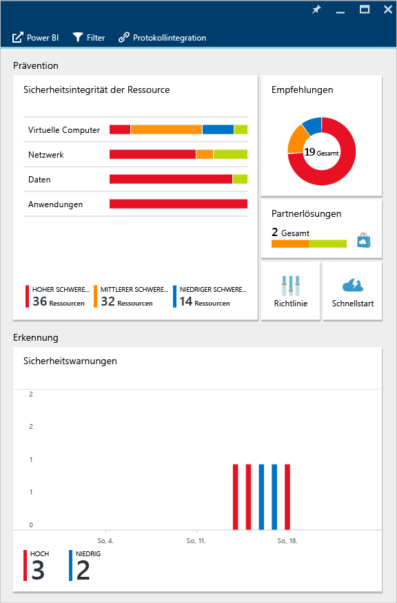
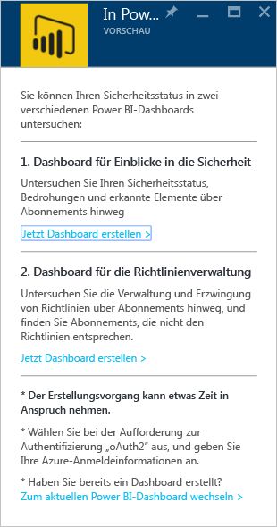
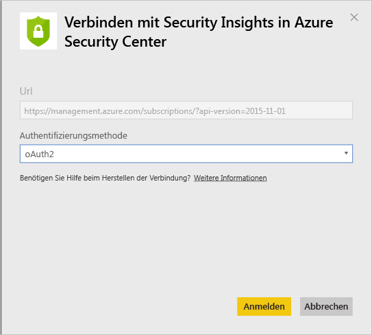
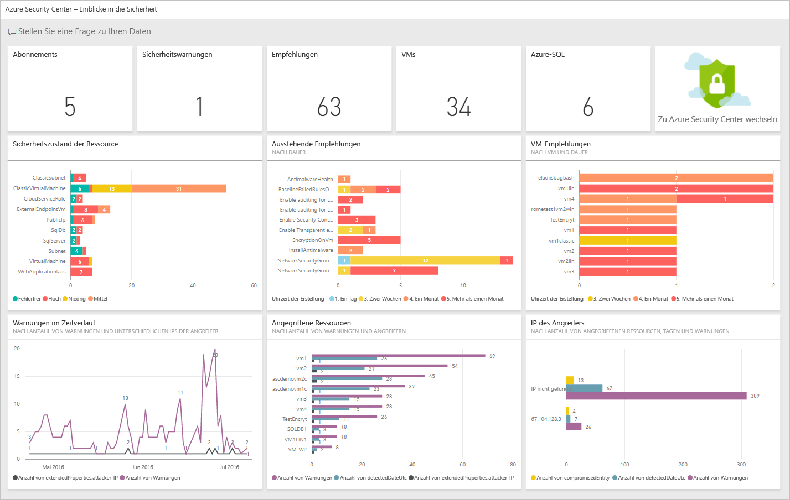
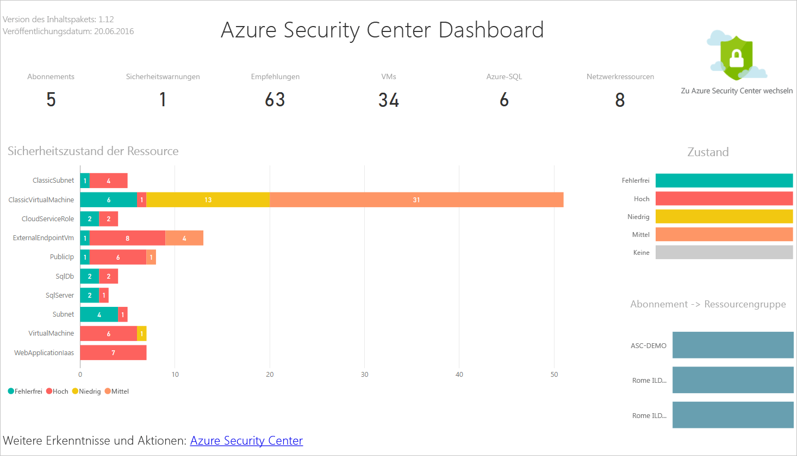
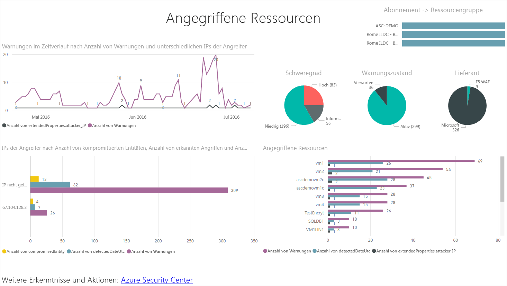
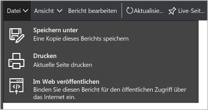
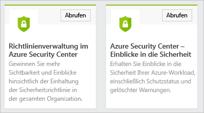
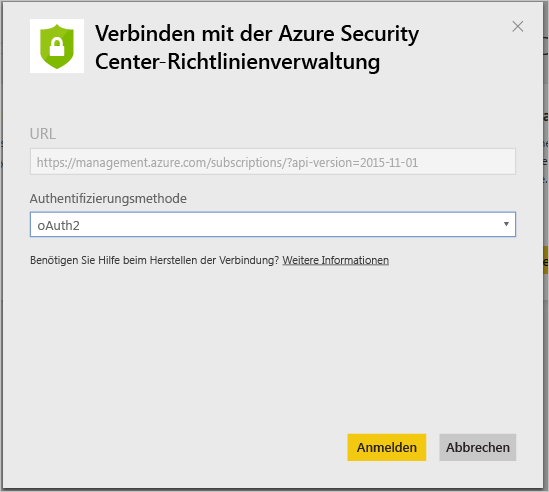
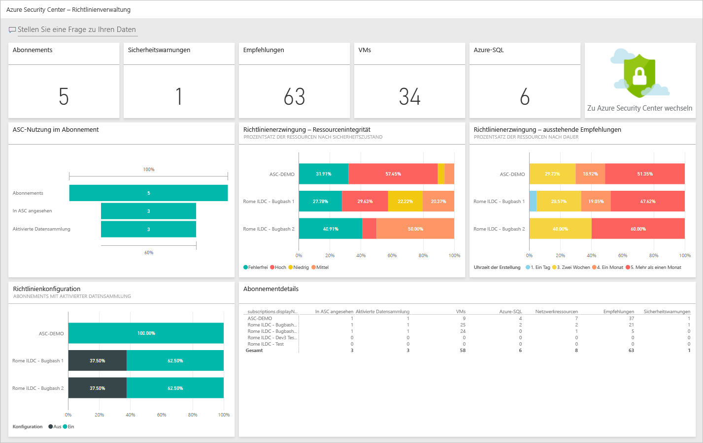

<properties
   pageTitle="Gewinnen von Erkenntnissen aus Azure Security Center-Daten mit Power BI| Microsoft Azure"
   description="Das Azure Security Center Power BI-Inhaltspaket macht es Ihnen leicht, Sicherheitswarnungen und -empfehlungen, angegriffene Ressourcen und Trends ausgehend von einem Datensatz zu finden, der für Ihre Berichte erstellt wurde."
   services="security-center"
   documentationCenter="na"
   authors="YuriDio"
   manager="swadhwa"
   editor=""/>

<tags
   ms.service="security-center"
   ms.devlang="na"
   ms.topic="hero-article"
   ms.tgt_pltfrm="na"
   ms.workload="na"
   ms.date="09/22/2016"
   ms.author="yurid"/>

# Gewinnen von Erkenntnissen aus Azure Security Center-Daten mit Power BI
Das [Power BI-Dashboard](http://aka.ms/azure-security-center-power-bi) für Azure Security Center ermöglicht Ihnen das Visualisieren, Analysieren und Filtern von Empfehlungen und Sicherheitswarnungen über alle Geräte, einschließlich Ihres Mobilgeräts. Erkennen Sie mit dem Power BI-Dashboard Trends und Angriffsmuster, und zeigen Sie Sicherheitswarnungen nach Ressource oder Quell-IP-Adresse und Sicherheitsrisiken ohne Adresse nach Ressource oder Alter an.

Sie können die Empfehlungen und Sicherheitswarnungen aus Security Center auch kreativ mit anderen Daten kombinieren, indem Sie beispielsweise Daten aus [Azure-Überwachungsprotokollen](https://powerbi.microsoft.com/blog/monitor-azure-audit-logs-with-power-bi/) und der [Azure SQL-Datenbanküberwachung](https://powerbi.microsoft.com/blog/monitor-your-azure-sql-database-auditing-activity-with-power-bi/) verwenden. Power BI-Dashboards sind jeweils vorhanden, und Sie können diese Daten auch nach Excel exportieren und so leicht Berichte zum Sicherheitszustand Ihrer Cloudressourcen erstellen.

##Verwenden des Azure Security Center-Dashboards für den Zugriff auf Power BI
Auf Power BI-Berichte können Sie auch über die Azure Security Center-Dashboards zugreifen. Führen Sie diese Schritte aus, um die Aufgabe durchzuführen:

1. Klicken Sie im **Azure Security Center**-Dashboard auf die Schaltfläche **In Power BI erkunden**.

	

2. Das Blatt **In Power BI erkunden** wird wie unten dargestellt auf der rechten Seite geöffnet:

	

3. Wenn Sie das Power BI-Dashboard zum ersten Mal erstellen, können Sie auf dem Blatt **In Power BI erkunden** eine der folgenden Optionen wählen:

	- **Security insights dashboard** (Dashboard „Einblicke in die Sicherheit“): Wählen Sie diese Option, wenn Sie ein Dashboard erstellen möchten, das den Sicherheitsstatus, Threads und Erkennungen enthält. Dies ist eine häufigere Option für Personen mit der DevOps-Rolle, die für das abonnementübergreifende Analysieren ihres Schutzstatus und erkannter Warnungen verantwortlich sind.
	- **Policy management dashboard** (Dashboard „Richtlinienverwaltung“): Wählen Sie diese Option, wenn Sie die Verwaltungs- und Durchsetzungsrichtlinie untersuchen möchten. Dies ist eine häufigere Option für die zentrale IT-Abteilung, bei der es eher um Governance (Kontrolle) geht. Dieses Dashboard bietet Transparenz und Einblicke in die Einhaltung von Sicherheitsrichtlinien im gesamten Unternehmen.
	- Klicken Sie auf **Go to your current Power BI dashboard** (Zu aktuellem Power BI-Dashboard wechseln), wenn Sie bereits über ein Power BI-Dashboard verfügen.

4. Klicken Sie für dieses Beispiel auf die Option **Security insights dashboard** (Dashboard „Einblicke in die Sicherheit“). Wenn dies Ihre erste Erstellung eines Power BI-Dashboards für Security Center ist, werden Sie aufgefordert, das Inhaltspaket zu installieren. Klicken Sie wie in der Abbildung unten im Fenster **Content packs for Power BI** (Inhaltspakete für Power BI) auf die Schaltfläche **Get** (Abrufen):

	

5. Das Fenster **Connect to Azure Security Center Security Insights** (Mit Azure Security Center Security Insights verbinden) wird angezeigt. Stellen Sie sicher, dass die **Authentifizierungsmethode** wie unten gezeigt auf **OAuth2** festgelegt ist, und klicken Sie auf die Schaltfläche **Anmelden**.
	
	

6. Unter Umständen werden Sie aufgefordert, sich erneut mit Ihren Azure-Anmeldeinformationen zu authentifizieren. Nach der Authentifizierung wird das Dashboard erstellt. Nach der Erstellung des Dashboards wird ein Bericht mit einer ähnlichen Struktur wie in der folgenden Abbildung angezeigt:

	

> [AZURE.NOTE] Die Aktualisierung des Berichts ist täglich geplant. Falls bei dieser Aktualisierung ein Fehler auftritt, helfen Ihnen die Informationen zur Problembehandlung unter [Potential Refresh Issues with the Azure Security Center Power BI](https://blogs.msdn.microsoft.com/azuresecurity/2016/04/07/azure-security-center-power-bi-refresh-fails/) (Potenzielle Aktualisierungsprobleme bei Azure Security Center Power BI) weiter.

Hier sehen Sie die Anzahl der Sicherheitswarnungen und Empfehlungen sowie die Zahl der virtuellen Computer, Azure SQL-Datenbanken und Netzwerkressourcen, die von Azure Security Center überwacht werden.

Ein Link zu Azure Security Center leitet Sie zum Azure-Portal weiter. Die Diagramme ermöglichen ein einfaches Visualisieren von Informationen zu Sicherheitsempfehlungen und -warnungen, einschließlich:

- Sicherheitsstatus von Ressourcen
- Ausstehende Empfehlungen
- Empfehlungen für virtuelle Computer
- Warnungen im Laufe der Zeit
- Angegriffene Ressourcen
- Angegriffene IPs

Jedes Diagramm liefert Ihnen zusätzliche Einblicke. Wählen Sie eine Kachel aus, um weitere Informationen anzuzeigen. Die Kachel **Resource Security State** (Sicherheitsstatus von Ressourcen) zeigt beispielsweise wie in der folgenden Abbildung zusätzliche Details zu ausstehenden Empfehlungen nach Ressourcen an:

Wenn Sie auf eine beliebige Zeile in diesem Graphen klicken, werden die anderen abgeblendet, und Sie können sich auf Ihre Auswahl konzentrieren. Klicken Sie im linken Bereich dieser Seite unter der Option **Dashboards** auf **Azure Security Center**, um zum Dashboard zurückzukehren.

> [AZURE.NOTE] Sie können den Bericht bearbeiten und ihn anpassen, zusätzliche Felder hinzufügen oder bestehende Grafiken ändern. Weitere Informationen finden Sie unter [Interagieren mit einem Bericht in der Bearbeitungsansicht von Power BI](https://powerbi.microsoft.com/documentation/powerbi-service-interact-with-a-report-in-editing-view/).

Wenn Sie auf die einzelnen Kacheln **Warnungen im Laufe der Zeit**, „Angegriffene Ressourcen“ und **Angreifer-IPs** klicken, ist deren Ausgabe ähnlich. Dies liegt daran, dass der Bericht wie in der folgenden Abbildung Informationen zu all diesen drei Variablen unter der Bezeichnung **Angegriffene Ressourcen** zusammenführt:

Nun können Sie mit den Optionen im Menü **Datei** eine Kopie dieses Berichts speichern und ihn ausdrucken oder im Internet veröffentlichen.

## Untersuchen von Azure Security Center-Daten mit Power BI-Diensten

Stellen Sie eine Verbindung mit [Power BI Content Pack Services](https://msit.powerbi.com/groups/me/getdata/services) in Power BI her, und führen Sie die folgenden Schritte aus:

1. Im Fenster **Content Pack für Power BI** werden wie unten dargestellt zwei Optionen angezeigt.

	

	>[AZURE.NOTE] Wenn Sie den ersten Teil dieses Artikels bereits durchgearbeitet haben, wird nur eine Option angezeigt, und zwar „Azure Security Center Policy Management“ (Azure Security Center-Richtlinienverwaltung).

2. Klicken Sie in diesem Beispiel in der Kachel **Azure Security Center Policy Management** (Azure Security Center-Richtlinienverwaltung) auf **Abrufen**.

3. Stellen Sie im Fenster **Connect to Azure Security Center Policy Management** (Mit Azure Security Center-Richtlinienverwaltung verbinden) sicher, dass in der Dropdownliste **Authentifizierungsmethode** wie unten gezeigt die Option **OAuth2** ausgewählt ist, und klicken Sie auf die Schaltfläche **Anmelden**.

	

4. Sie werden zu einer Authentifizierungsseite umgeleitet. Geben Sie dort die Anmeldedaten ein, die Sie zum Verbinden mit Azure Security Center verwenden. Nach Abschluss des Authentifizierungsprozesses beginnt Power BI mit dem Import von Daten, um die Berichte zu erstellen. Während dieses Zeitraums erscheint rechts unten im Browser möglicherweise diese Meldung:

	

	>[AZURE.NOTE] Wenn das Dashboard zum ersten Mal erstellt wird, kann der Vorgang länger als üblich dauern. Dies gilt besonders für Szenarien, in denen mehrere Abonnements verwendet werden.

5. Sobald der Prozess abgeschlossen ist, wird das Azure Security Center Power BI-Dashboard mit dem Bericht **Richtlinienverwaltung** geladen. Dies ist hier dargestellt:

	

## Siehe auch
In diesem Dokument haben Sie erfahren, wie Sie Power BI in Azure Security Center verwenden können. Weitere Informationen zu Azure Security Center finden Sie in den folgenden Quellen:

- [Planungs- und Betriebshandbuch für Azure Security Center](security-center-planning-and-operations-guide.md): Erfahren Sie, wie Sie die Einführung von Azure Security Center planen.
- [Festlegen von Sicherheitsrichtlinien in Azure Security Center](security-center-policies.md): Erfahren Sie, wie Sie Sicherheitseinstellungen in Azure Security Center konfigurieren.
- [Verwalten von und Reagieren auf Sicherheitswarnungen in Azure Security Center:](security-center-managing-and-responding-alerts.md) Erfahren Sie, wie Sie Sicherheitswarnungen verwalten und darauf reagieren.
- [Azure Security Center – Häufig gestellte Fragen](security-center-faq.md): Hier finden Sie häufig gestellte Fragen zur Verwendung des Diensts.
- [Azure Security Blog](http://blogs.msdn.com/b/azuresecurity/) (Blog zur Azure-Sicherheit): Hier finden Sie Blogbeiträge zur Azure-Sicherheit und -Compliance.

<!---HONumber=AcomDC_0928_2016-->