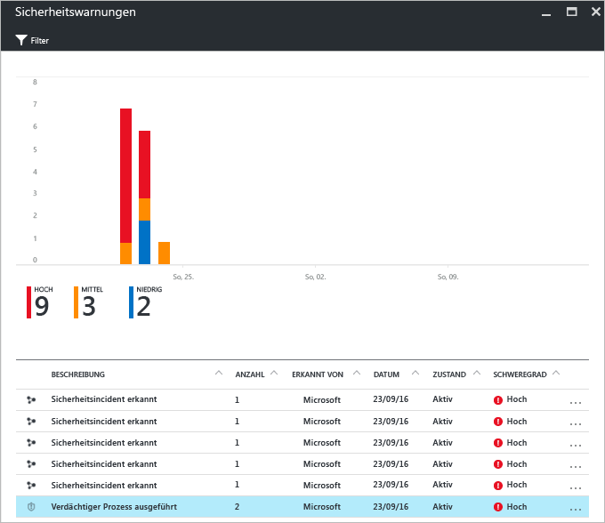
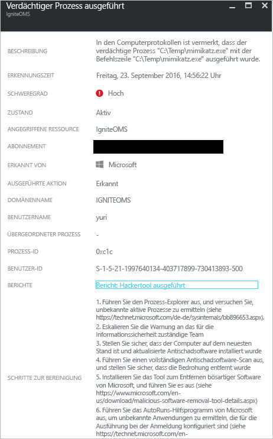

# Azure Security Center-Bericht mit Bedrohungsinformationen
In diesem Dokument erfahren Sie, wie Sie anhand von Azure Security Center-Berichten mit Bedrohungsinformationen weitere Informationen zu einer Bedrohung ermitteln können, die eine Sicherheitswarnung generiert hat.

## Was ist ein Bericht mit Bedrohungsinformationen?
Im Zuge der Bedrohungserkennung von Security Center werden Sicherheitsinformationen von Ihren Azure-Ressourcen, aus dem Netzwerk und von verbundenen Partnerlösungen überwacht. Diese Informationen, bei denen es sich häufig um korrelierende Informationen aus mehreren Quellen handelt, werden analysiert, um Bedrohungen zu identifizieren. Dieser Prozess ist Teil der [Erkennungsfunktionen](security-center-detection-capabilities.md) von Security Center.

Wenn Security Center eine Bedrohung erkennt, wird eine [Sicherheitswarnung](security-center-managing-and-responding-alerts.md) mit ausführlichen Informationen zu einem bestimmten Ereignis sowie mit Vorschlägen zur Beseitigung generiert. Um die dafür zuständigen Teams bei der Untersuchung und Beseitigung von Bedrohungen zu unterstützen, steht in Security Center ein Bericht mit Bedrohungsinformationen zur Verfügung. Dieser enthält unter anderem folgende Informationen zu der erkannten Bedrohung:

* Identität oder Verbindungen des Angreifers (sofern verfügbar)
* Ziele der Angreifer
* Aktuelle und vergangene Angriffskampagnen (sofern verfügbar)
* Taktiken, Tools und Verfahren der Angreifer
* Zugehörige IoCs (Indicators of Compromise) wie URLs und Dateihashes
* Viktimologie (also die betroffene Branche und die geografische Verbreitung), um zu ermitteln, ob Ihre Azure-Ressourcen gefährdet sind
* Informationen zu Risikominderung und Beseitigung

> [!NOTE]
> Die Informationsmenge variiert von Bericht zu Bericht. Der Detailgrad hängt von der Aktivität und der Verbreitung der Schadsoftware ab.
>
>

Security Center bietet drei Arten von Bedrohungsberichten, die abhängig vom jeweiligen Angriff variieren können. Folgende Berichte stehen zur Verfügung:

* **Aktivitätsgruppenbericht:** Enthält detaillierte Informationen zu Angreifern sowie zu ihren Zielen und Taktiken.
* **Kampagnenbericht:** Konzentriert sich auf Details zu bestimmten Angriffskampagnen.
* **Zusammenfassender Bedrohungsbericht:** Enthält alle Elemente der beiden vorherigen Berichte.

Diese Informationen sind hilfreich bei der [Reaktion auf Vorfälle](security-center-incident-response.md), um im Rahmen einer laufenden Untersuchung die Angriffsquelle, die Beweggründe des Angreifers und eine geeignete Vorgehensweise zur Beseitigung des Problems zu ermitteln.

## Wie greife ich auf den Bericht mit Bedrohungsinformationen zu?
Aktuelle Warnungen können Sie auf der Kachel **Sicherheitswarnungen** prüfen. Öffnen Sie das Azure-Portal, und gehen Sie wie folgt vor, um weitere Details zu den einzelnen Warnungen anzuzeigen:

1. Auf dem Security Center-Dashboard sehen Sie die Kachel **Sicherheitswarnungen** .
2. Klicken Sie auf die Kachel, um das Blatt **Sicherheitswarnungen** mit weiteren Details zu den Warnungen zu öffnen, und klicken Sie anschließend auf die Sicherheitswarnung, zu der Sie weitere Informationen erhalten möchten.

    
3. In diesem Fall werden auf dem Blatt **Suspicious process executed** (Verdächtiger Prozess ausgeführt) Details zu der Warnung angezeigt, wie in der folgenden Abbildung zu sehen:

    
4. Der Informationsgehalt von Sicherheitswarnungen ist abhängig von der Art der jeweiligen Warnung. Im Feld **BERICHTE** steht ein Link zum Bericht mit Bedrohungsinformationen zur Verfügung. Nach dem Klicken auf den Link wird ein neues Browserfenster mit der entsprechenden PDF-Datei angezeigt.

   

Hier können Sie die PDF-Datei für diesen Bericht herunterladen, sich ausführlicher über das erkannte Sicherheitsproblem informieren und auf der Grundlage der bereitgestellten Informationen geeignete Maßnahmen ergreifen.

## Weitere Informationen
In diesem Dokument haben Sie erfahren, wie Sie im Rahmen der Untersuchung von Sicherheitswarnungen Azure Security Center-Berichte mit Bedrohungsinformationen nutzen. Weitere Informationen zu Azure Security Center finden Sie in den folgenden Quellen:

* [Azure Security Center – häufig gestellte Fragen](security-center-faq.md)festgelegt ist. Enthält häufig gestellte Fragen zur Verwendung des Diensts.
* [Verwenden von Azure Security Center zur Reaktion auf Vorfälle](security-center-incident-response.md)
* [Azure Security Center-Erkennungsfunktionen](security-center-detection-capabilities.md)
* [Azure Security Center planning and operations guide](security-center-planning-and-operations-guide.md)festgelegt ist. Hier erfahren Sie, wie Sie die Entwurfsaspekte in Bezug auf die Einführung von Azure Security Center planen und verstehen.
* [Verwalten von und Reagieren auf Sicherheitswarnungen in Azure Security Center](security-center-managing-and-responding-alerts.md). Hier erfahren Sie, wie Sie Sicherheitswarnungen verwalten und darauf reagieren.
* [Behandeln von Sicherheitswarnungen in Azure Security Center](security-center-incident.md)
* [Azure Security-Blog](http://blogs.msdn.com/b/azuresecurity/). Hier finden Sie Blogbeiträge zur Sicherheit und Compliance von Azure.

