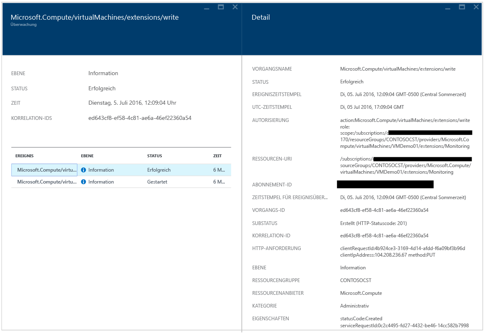
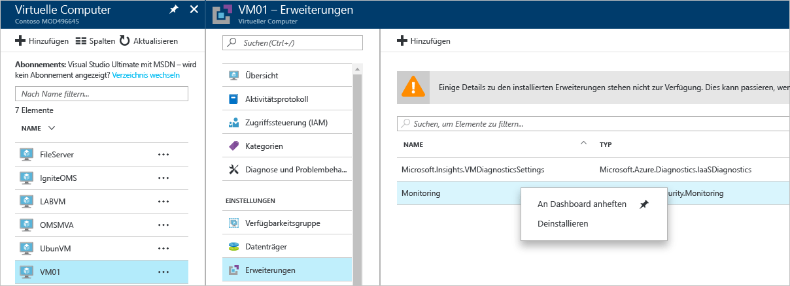
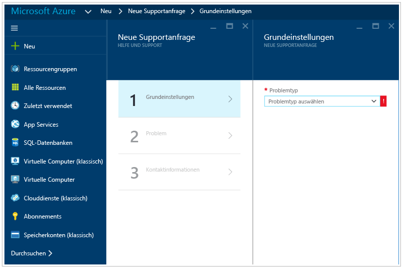

# Azure Security Center – Handbuch zur Problembehandlung
Dieses Handbuch ist für IT-Experten, Informationssicherheitsanalysten und Cloudadministratoren konzipiert, in deren Organisation Azure Security Center verwendet wird und die Security Center-Probleme lösen müssen.

## Handbuch zur Problembehandlung
In diesem Handbuch wird beschrieben, wie Sie Probleme mit Security Center beheben. Der Großteil der Problembehandlung in Security Center erfolgt, indem zuerst die Einträge im [Überwachungsprotokoll](https://azure.microsoft.com/updates/audit-logs-in-azure-preview-portal/) für die fehlerhafte Komponente geprüft werden. Über Überwachungsprotokolle können Sie Folgendes ermitteln:

* Welche Vorgänge durchgeführt werden
* Wer den Vorgang initiiert hat
* Wann der Vorgang durchgeführt wurde
* Status des Vorgangs
* Werte anderer Eigenschaften, mit denen Sie den Vorgang eventuell untersuchen können

Das Überwachungsprotokoll enthält alle Schreibvorgänge (PUT, POST, DELETE), die für Ihre Ressourcen durchgeführt werden, aber keine Lesevorgänge (GET).

## Installation des Überwachungs-Agents für die Problembehandlung in Windows
Der Überwachungs-Agent von Security Center wird zum Durchführen der Datensammlung verwendet. Nachdem die Datensammlung aktiviert und der Agent auf dem Zielcomputer richtig installiert wurde, sollten diese Prozesse ausgeführt werden:

* ASMAgentLauncher.exe – Azure-Überwachungs-Agent 
* ASMMonitoringAgent.exe – Azure-Erweiterung für die Sicherheitsüberwachung
* ASMSoftwareScanner.exe – Azure-Scan-Manager

Die Azure-Erweiterung für Sicherheitsüberwachung sucht nach verschiedenen sicherheitsrelevanten Konfigurationen und erfasst Sicherheitsprotokolle des virtuellen Computers. Der Scan-Manager wird als Patch-Scanner verwendet.

Wenn die Installation erfolgreich durchgeführt wurde, sollte in den Überwachungsprotokollen für den virtuellen Zielcomputer ein Eintrag der folgenden Art angezeigt werden:

Sie können auch weitere Informationen zum Installationsvorgang abrufen, indem Sie die Agent-Protokolle unter *%systemdrive%\windowsazure\logs* (Beispiel: „C:\WindowsAzure\Logs“) lesen.

> [!NOTE]
> Wenn sich der Azure Security Center-Agent nicht richtig verhält, müssen Sie den virtuellen Zielcomputer neu starten, da kein Befehl zum Beenden und Starten des Agents vorhanden ist.

Wenn weiterhin Probleme mit der Datensammlung auftreten, können Sie den Agent mit den folgenden Schritten deinstallieren:

1. Wählen Sie im **Azure-Portal** den virtuellen Computer aus, auf dem Datensammlungsprobleme auftreten, und klicken Sie auf **Erweiterungen**.
2. Klicken Sie mit der rechten Maustaste in **Microsoft.Azure.Security.Monitoring**, und wählen Sie **Deinstallieren**.

Die Azure-Erweiterung für die Sicherheitsüberwachung sollte innerhalb weniger Minuten automatisch neu installiert werden.

## Installation des Überwachungs-Agents für die Problembehandlung in Linux
Wenn Sie die Problembehandlung für eine VM-Agent-Installation auf einem Linux-System durchführen, sollten Sie sicherstellen, dass die Erweiterung nach „/var/lib/waagent/“ heruntergeladen wurde. Sie können den folgenden Befehl ausführen, um zu überprüfen, ob die Installation erfolgreich war:

`cat /var/log/waagent.log` 

Die anderen Protokolldateien, die Sie im Rahmen der Problembehandlung prüfen können, sind: 

* /var/log/mdsd.err
* /var/log/azure/

In einem funktionierenden System sollte eine Verbindung mit dem Prozess „mdsd“ unter TCP 29130 angezeigt werden. Dies ist das Syslog, das mit dem Prozess „mdsd“ kommuniziert. Sie können dieses Verhalten überprüfen, indem Sie den folgenden Befehl ausführen:

`netstat -plantu | grep 29130`

## Schwierigkeiten bei der Endpoint Protection-Problembehandlung

Der Gast-Agent ist der übergeordnete Prozess aller Vorgänge der [Microsoft Antimalware](../security/azure-security-antimalware.md)-Erweiterung. Wenn beim Prozess für den Gast-Agent ein Fehler auftritt, schlägt die Microsoft Antimalware, die als untergeordneter Prozess des Gast-Agents ausgeführt wird, unter Umständen auch fehl.  In diesen Fällen ist es ratsam, die folgenden Optionen zu überprüfen:

- Wenn die Ziel-VM ein benutzerdefiniertes Image ist und der Ersteller der VM den Gast-Agent nicht installiert hat.
- Wenn das Ziel keine Windows-VM ist, sondern eine Linux-VM, tritt bei der Installation der Windows-Version der Antimalware-Erweiterung auf einer Linux-VM ein Fehler auf. Der Linux-Gast-Agent verfügt über bestimmte Anforderungen in Bezug auf die Betriebssystemversion und die erforderlichen Pakete, und wenn diese Anforderungen nicht erfüllt werden, funktioniert der VM-Agent auch dafür nicht. 
- Wenn die VM mit einer alten Version des Gast-Agent erstellt wurde. In diesem Fall sollten Sie beachten, dass einige alte Agents nicht selbst automatisch das Update auf die neuere Version durchführen können, weil dieses Problem dadurch verursacht werden kann. Verwenden Sie immer die aktuelle Version des Gast-Agents, wenn Sie Ihre eigenen Images erstellen.
- Für einige Verwaltungssoftwareanwendungen von Drittanbietern wird der Gast-Agent ggf. deaktiviert oder der Zugriff auf bestimmte Dateispeicherorte blockiert. Stellen Sie sicher, dass der Agent in der Ausschlussliste enthalten ist, wenn auf Ihrer VM Software von Drittanbietern installiert ist.
- Bestimmte Firewalleinstellungen oder Netzwerksicherheitsgruppen (NSGs) können bewirken, dass der Netzwerkdatenverkehr zum und vom Gast-Agent blockiert wird.
- Es kann sein, dass bestimmte Zugriffssteuerungslisten (Access Control Lists, ACLs) den Datenträgerzugriff verhindern.
- Durch einen Mangel an Speicherplatz kann verhindert werden, dass der Gast-Agent richtig funktioniert. 

Die Microsoft Antimalware-Benutzeroberfläche ist standardmäßig deaktiviert. Unter [Enabling Microsoft Antimalware User Interface on ARM VMs Post Deployment](https://blogs.msdn.microsoft.com/azuresecurity/2016/03/09/enabling-microsoft-antimalware-user-interface-post-deployment/) (Aktivieren der Microsoft Antimalware-Benutzeroberfläche auf ARM-VMs nach der Bereitstellung) finden Sie weitere Informationen dazu, wie Sie sie bei Bedarf aktivieren.

## Behandlung von Problemen beim Laden des Dashboards

Wenn beim Laden des Security Center-Dashboards Probleme auftreten, stellen Sie sicher, dass der Benutzer, der das Security Center-Abonnement registriert (d.h. der erste Benutzer, der Security Center mit dem Abonnement geöffnet hat), und der Benutzer, der die Datensammlung aktivieren möchte, entweder *Besitzer* oder *Mitwirkender* des Abonnements sind. Ab diesem Zeitpunkt können auch Benutzer mit der *Leser*-Berechtigung für das Abonnement die Richtlinie unter „dashboard/alerts/recommendation/policy“ anzeigen.

## Kontaktaufnahme mit dem Microsoft-Support
Einige Probleme können mit den Richtlinien in diesem Artikel identifiziert werden, während andere im öffentlichen Security Center- [Forum](https://social.msdn.microsoft.com/Forums/en-US/home?forum=AzureSecurityCenter)dokumentiert sind. Falls Sie weitere Hilfe zur Problembehandlung benötigen, können Sie wie unten gezeigt über das **Azure-Portal** eine neue Supportanfrage erstellen: 

## Weitere Informationen
In diesem Dokument haben Sie erfahren, wie Sie Sicherheitsrichtlinien in Azure Security Center konfigurieren können. Weitere Informationen zu Azure Security Center finden Sie in den folgenden Quellen:

* [Planungs- und Betriebshandbuch für Azure Security Center](security-center-planning-and-operations-guide.md) : Erfahren Sie, wie Sie Entwurfsüberlegungen zur Einführung von Azure Security Center planen und umsetzen können.
* [Überwachen der Sicherheitsintegrität in Azure Security Center](security-center-monitoring.md) : Erfahren Sie, wie Sie die Integrität Ihrer Azure-Ressourcen überwachen.
* [Verwalten von und Reagieren auf Sicherheitswarnungen in Azure Security Center](security-center-managing-and-responding-alerts.md) : Erfahren Sie, wie Sie Sicherheitswarnungen verwalten und darauf reagieren.
* [Überwachen von Partnerlösungen mit Azure Security Center](security-center-partner-solutions.md) : Erfahren Sie, wie der Integritätsstatus Ihrer Partnerlösungen überwacht wird.
* [Azure Security Center – Häufig gestellte Fragen](security-center-faq.md) : Hier finden Sie häufig gestellte Fragen zur Verwendung des Diensts.
* [Azure Security Blog](http://blogs.msdn.com/b/azuresecurity/) (Blog zur Azure-Sicherheit): Hier finden Sie Blogbeiträge zur Azure-Sicherheit und -Compliance.

