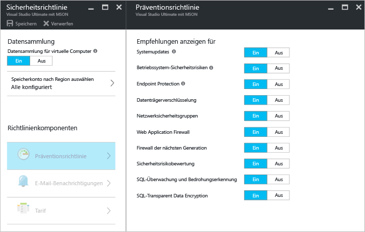
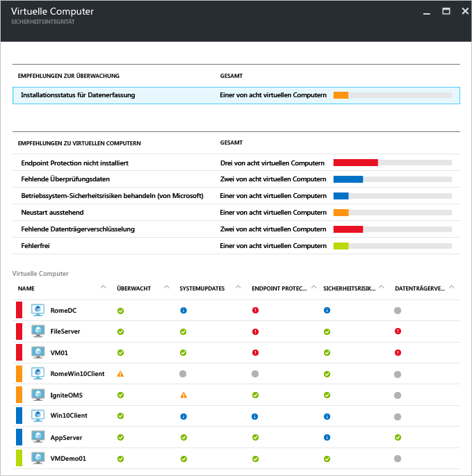
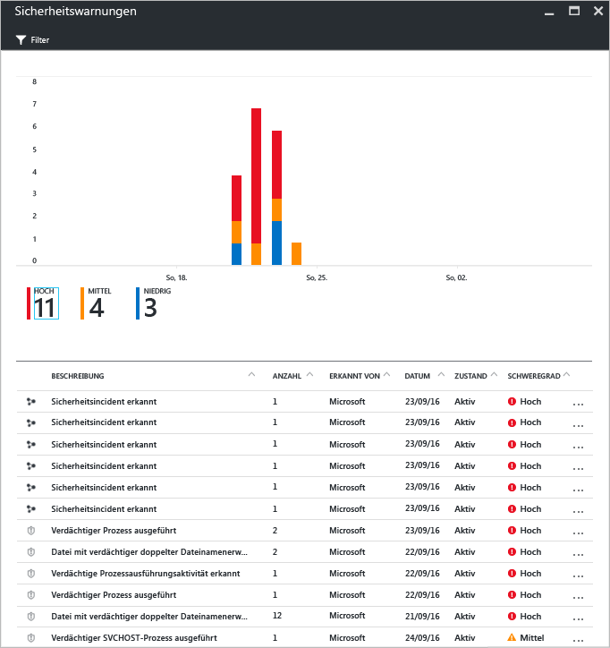

# Azure Security Center und Azure Virtual Machines
Mit [Azure Security Center](https://azure.microsoft.com/services/security-center/) können Sie Bedrohungen verhindern, erkennen und bekämpfen. Es bietet integrierte Sicherheitsüberwachung und Richtlinienverwaltung für Ihre Azure-Abonnements, hilft bei der Erkennung von Bedrohungen, die andernfalls möglicherweise unbemerkt bleiben, und kann gemeinsam mit einem breiten Spektrum an Sicherheitslösungen verwendet werden.

In diesem Artikel wird veranschaulicht, wie Sie Ihre Azure Virtual Machines (VM) mit Security Center schützen können.

## Gründe für die Verwendung von Security Center
Mit Security Center können Sie die Daten von virtuellen Computern in Azure schützen, indem Sie Einblicke in die Sicherheitseinstellungen des jeweiligen virtuellen Computers erhalten. Wenn Ihre VMs mit Security Center geschützt sind, sind die folgenden Funktionen verfügbar:

* Sicherheitseinstellungen des Betriebssystems mit den empfohlenen Konfigurationsregeln
* Systemsicherheit und fehlende kritische Updates
* Empfehlungen zum Endpunktschutz
* Überprüfung der Datenträgerverschlüsselung
* Sicherheitsrisikobewertung und -lösung
* Bedrohungserkennung

Security Center ermöglicht nicht nur den Schutz Ihrer Azure-VMs, sondern stellt auch Möglichkeiten für die Sicherheitsüberwachung und -verwaltung von Clouddiensten, App Services, virtuellen Netzwerken und vielem mehr bereit. 

> [!NOTE]
> Weitere Informationen zu Azure Security Center finden Sie unter [Einführung in Azure Security Center](security-center-intro.md).
> 
> 

## Voraussetzungen
Für die ersten Schritte mit Azure Security Center müssen Sie Folgendes wissen und berücksichtigen:

* Sie benötigen ein Microsoft Azure-Abonnement. Weitere Informationen zum Free- und Standard-Tarif von Security Center finden Sie unter [Security Center Preise](https://azure.microsoft.com/pricing/details/security-center/).
* Weitere Informationen zur Planung und zum Betrieb in Bezug auf die Einführung von Security Center finden Sie unter [Planungs- und Betriebshandbuch für Azure Security Center](security-center-planning-and-operations-guide.md).
* Informationen zu Unterstützungsmöglichkeiten für Betriebssysteme finden Sie unter [Azure Security Center – Häufig gestellte Fragen](security-center-faq.md). 

## Sicherheitsrichtlinie festlegen
Die Datensammlung muss aktiviert sein, damit Azure Security Center die erforderlichen Informationen sammeln kann, um Empfehlungen und Warnungen bereitstellen zu können, die basierend auf der von Ihnen konfigurierten Sicherheitsrichtlinie generiert werden. In der Abbildung unten sehen Sie, dass **Datensammlung** auf **Ein** festgelegt ist.

In einer Sicherheitsrichtlinie wird der Satz von Sicherheitsmechanismen definiert, die für Ressourcen in dem angegebenen Abonnement oder der angegebenen Ressourcengruppe zu empfehlen sind. Vor dem Aktivieren der Sicherheitsrichtlinie muss die Datensammlung aktiviert werden. Security Center sammelt Daten von Ihren virtuellen Computern, um den Sicherheitsstatus zu bewerten, Sicherheitsempfehlungen bereitzustellen und vor Bedrohungen zu warnen. In Security Center definieren Sie Richtlinien für Ihre Azure-Abonnements oder Ressourcengruppen gemäß den Sicherheitsanforderungen Ihres Unternehmens sowie gemäß der Art von Anwendungen oder der Vertraulichkeit der Daten in den einzelnen Abonnements. 

> [!NOTE]
> Weitere Informationen zu den einzelnen verfügbaren **Präventionsrichtlinien** finden Sie im Artikel [Festlegen von Sicherheitsrichtlinien](security-center-policies.md).
> 
> 

## Verwalten von Sicherheitsempfehlungen
Security Center analysiert den Sicherheitsstatus Ihrer Azure-Ressourcen. Wenn Security Center potenzielle Sicherheitsrisiken identifiziert, werden Empfehlungen erstellt. Entsprechend den Empfehlungen werden Sie durch den Prozess der Konfiguration des erforderlichen Sicherheitsmechanismus geführt.

Nach Einstellung einer Sicherheitsrichtlinie analysiert Security Center den Sicherheitsstatus Ihrer Ressourcen, um potenzielle Sicherheitsrisiken zu erkennen. Die Empfehlungen werden in einem Tabellenformat angezeigt, wobei jede Zeile eine bestimmte Empfehlung darstellt. Die Tabelle unten enthält einige Beispiele für Empfehlungen für Azure-VMs. Es ist jeweils angegeben, was durchgeführt wird, wenn Sie ein Empfehlung anwenden. Wenn Sie eine Empfehlung auswählen, erhalten Sie Informationen dazu, wie Sie die Empfehlung in Security Center implementieren.

| Empfehlung | Beschreibung |
| --- | --- |
| [Sammlung von Daten für Abonnements aktivieren](security-center-enable-data-collection.md) |Empfiehlt Ihnen, in der Sicherheitsrichtlinie die Datensammlung für alle Abonnements und alle virtuellen Computer in Ihren Abonnements zu aktivieren. |
| [Betriebssystem-Sicherheitsrisiken beheben](security-center-remediate-os-vulnerabilities.md) |Empfiehlt Ihnen, Ihre Betriebssystemkonfigurationen an den empfohlenen Konfigurationsregeln zu orientieren und z.B. nicht zuzulassen, dass Kennwörter gespeichert werden. |
| [Systemupdates anwenden](security-center-apply-system-updates.md) |Empfiehlt Ihnen, fehlende Systemupdates und kritische Updates für virtuelle Computer bereitzustellen. |
| [Neustart nach Systemupdates](security-center-apply-system-updates.md#reboot-after-system-updates) |Empfiehlt Ihnen, einen virtuellen Computer neu zu starten, um die Anwendung von Systemupdates abzuschließen. |
| [Endpoint Protection installieren](security-center-install-endpoint-protection.md) |Empfiehlt Ihnen, Antischadsoftware für virtuelle Maschinen bereitzustellen (nur Windows-VMs). |
| [Endpoint Protection-Integritätswarnungen auflösen](security-center-resolve-endpoint-protection-health-alerts.md) |Empfiehlt, dass Sie Endpoint Protection-Fehler beheben. |
| [VM-Agent aktivieren](security-center-enable-vm-agent.md) |Ermöglicht Ihnen, anzuzeigen, welche VMs den VM-Agent benötigen. Der VM-Agent muss auf virtuellen Maschinen installiert werden, um das Überprüfen von Patches, Überprüfen von Grundregeln und Antischadsoftware bereitzustellen. Der VM-Agent wird standardmäßig für virtuelle Maschinen installiert, die vom Azure Marketplace bereitgestellt werden. Der Artikel [VM-Agent und Erweiterungen – Teil 2](http://azure.microsoft.com/blog/2014/04/15/vm-agent-and-extensions-part-2/) enthält Informationen zum Installieren des VM-Agents. |
| [Datenträgerverschlüsselung anwenden](security-center-apply-disk-encryption.md) |Empfiehlt Ihnen, dass Sie Ihre VM-Datenträger per Azure Disk Encryption (Windows- und Linux-VMs) verschlüsseln. Die Verschlüsselung wird sowohl für die Betriebssystem- als auch für die Datenvolumes auf Ihrer VM empfohlen. |
| [Sicherheitsrisikobewertung nicht installiert](security-center-vulnerability-assessment-recommendations.md) |Empfiehlt die Installation einer Lösung zur Sicherheitsrisikobewertung auf dem virtuellen Computer. |
| [Sicherheitsrisiken beheben](security-center-vulnerability-assessment-recommendations.md#review-recommendation) |Ermöglicht das Anzeigen von System- und Anwendungssicherheitslücken, die von der auf dem virtuellen Computer installierten Lösung zur Sicherheitsrisikobewertung erkannt werden. |

> [!NOTE]
> Weitere Informationen zu Empfehlungen finden Sie im Artikel [Verwalten von Sicherheitsempfehlungen](security-center-recommendations.md).
> 
> 

## Überwachen der Sicherheitsintegrität
Nachdem Sie die [Sicherheitsrichtlinien](security-center-policies.md) für die Ressourcen des Abonnements aktiviert haben, analysiert Security Center die Sicherheit Ihrer Ressourcen, um mögliche Sicherheitsrisiken zu erkennen.  Sie können den Sicherheitsstatus Ihrer Ressourcen zusammen mit allen Problemen auf dem Blatt **Sicherheitsintegrität von Ressourcen** anzeigen. Wenn Sie auf der Kachel **Ressourcensicherheit** auf **Virtuelle Computer** klicken, wird das Blatt **Virtuelle Computer** mit Empfehlungen für Ihre VMs geöffnet. 

## Verwalten von und Reagieren auf Sicherheitswarnungen
Security Center erfasst, analysiert und vereinigt automatisch Protokolldaten von Ihren Azure-Ressourcen, vom Netzwerk und von verbundenen Partnerlösungen (z.B. Lösungen zum Schutz von Firewalls und Endpunkten), um echte Bedrohungen zu erkennen und falsch positive Ergebnisse zu reduzieren. Indem Aggregation mit vielen verschiedenen [Erkennungsfunktionen](security-center-detection-capabilities.md) genutzt wird, kann Security Center priorisierte Sicherheitswarnungen generieren, damit Sie das Problem schnell untersuchen und Empfehlungen zur Begegnung möglicher Angriffe geben können.

Wählen Sie eine Sicherheitswarnung aus, um weitere Informationen zu den Ereignissen zu erhalten, die die Warnung ausgelöst haben, sowie zu den Schritten, die Sie als Reaktion auf den Angriff ausführen müssen (falls zutreffend). Sicherheitswarnungen werden nach [Typ](security-center-alerts-type.md) und Datum gruppiert.

## Weitere Informationen
Weitere Informationen zu Security Center finden Sie in den folgenden Quellen:

* [Festlegen von Sicherheitsrichtlinien in Azure Security Center:](security-center-policies.md) Erfahren Sie, wie Sie Sicherheitsrichtlinien für Ihre Azure-Abonnements und -Ressourcengruppen konfigurieren.
* [Verwalten von und Reagieren auf Sicherheitswarnungen in Azure Security Center:](security-center-managing-and-responding-alerts.md) Erfahren Sie, wie Sie Sicherheitswarnungen verwalten und darauf reagieren.
* [Azure Security Center – Häufig gestellte Fragen](security-center-faq.md) : Hier finden Sie häufig gestellte Fragen zur Verwendung des Diensts.

<!--HONumber=Dec16_HO2-->

