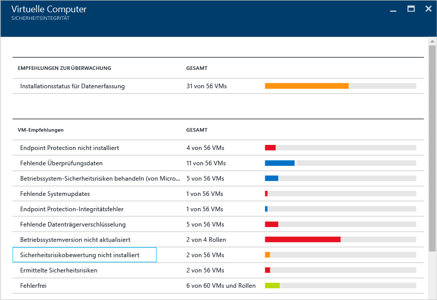
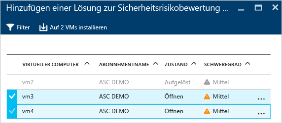
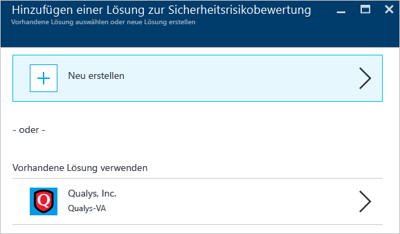
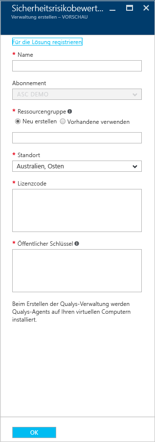
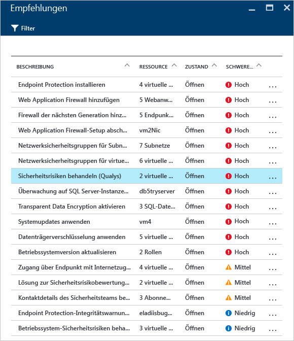
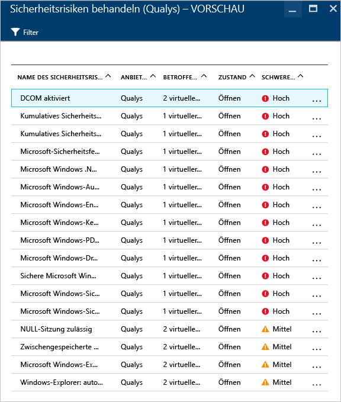
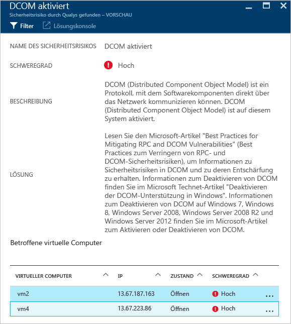

<properties
   pageTitle="Sicherheitsrisikobewertung in Azure Security Center | Microsoft Azure"
   description="In diesem Dokument werden die Empfehlungen in Azure Security Center beschrieben, die Ihnen als Hilfe beim Schützen von virtuellen Computern dienen, indem eine Lösung zur Sicherheitsrisikobewertung installiert wird."
   services="security-center"
   documentationCenter="na"
   authors="YuriDio"
   manager="swadhwa"
   editor=""/>

<tags
   ms.service="security-center"
   ms.devlang="na"
   ms.topic="hero-article"
   ms.tgt_pltfrm="na"
   ms.workload="na"
   ms.date="09/27/2016"
   ms.author="yurid"/>

# Sicherheitsrisikobewertung in Azure Security Center
In diesem Dokument sind Empfehlungen zur Sicherheitsrisikobewertung enthalten, die für die Ausführung von virtuellen Computern in Azure gelten.

## Was ist eine Sicherheitsrisikobewertung?

Die Sicherheitsrisikobewertung in Azure Security Center ist Teil der Empfehlungen für virtuelle Computer (VMs). Wenn Security Center bemerkt, dass auf Ihrer VM keine Lösung für eine Sicherheitsrisikobewertung installiert ist, erhalten Sie eine Installationsempfehlung. Nach der Bereitstellung beginnt der Partner-Agent damit, Daten zu Sicherheitsrisiken an die Verwaltungsplattform des Partners zu melden. Diese stellt im Gegenzug dann Daten zur Überwachung von Sicherheitsrisiken und der Integrität für Security Center bereit. Benutzer können gefährdete VMs schnell im Security Center-Dashboard identifizieren und weitere Berichte und Informationen anzeigen, indem Sie von Security Center direkt zur Partnerverwaltungskonsole wechseln.

> [AZURE.NOTE] Der Dienst wird anhand einer Beispielbereitstellung vorgestellt. Es ist keine schrittweise Anleitung.

## Einschränkungen der öffentlichen Vorschauversion

Für die aktuelle öffentliche Vorschauversion der Sicherheitsrisikobewertung gelten die folgenden Einschränkungen:

- Die einzige verfügbare Partnerlösung zur Sicherheitsrisikobewertung stammt von [Qualys](https://www.qualys.com/lp/azure). Weitere Typen werden in Zukunft hinzugefügt.
- Sie können die Lösung zur Sicherheitsrisikobewertung auf mehreren VMs installieren, solange diese zu demselben Abonnement gehören.
- Nur Windows-VMs werden unterstützt. Die Unterstützung für Linux-VMs wird dann in der Version „Allgemeine Verfügbarkeit“ hinzugefügt.

## Implementieren der Empfehlung für virtuelle Computer

Wenn Security Center mindestens eine unterstützte VM identifiziert, für die keine Lösung zur Sicherheitsrisikobewertung vorhanden ist, wird eine VM-Empfehlung ausgelöst. In den folgenden Schritten wird veranschaulicht, wie Sie auf diese Empfehlung zugreifen und sie für mehrere VMs anwenden, die zu demselben Abonnement gehören:

1. Klicken Sie auf der Kachel **Sicherheitsintegrität der Ressource** auf **Virtuelle Computer**.
2. Wählen Sie auf dem Blatt **Virtuelle Computer** die Option **Keine Sicherheitsrisikobewertung installiert**. Dies ist in der folgenden Abbildung dargestellt:

	

3. Wählen Sie auf dem Blatt **Lösung zur Sicherheitsrisikobewertung hinzufügen – VORSCHAU** die VMs aus, für die Sie die Lösung zur Sicherheitsrisikobewertung installieren möchten. Dies ist in der folgenden Abbildung dargestellt:

	

4. Klicken Sie auf dem Blatt **Lösung zur Sicherheitsrisikobewertung hinzufügen – VORSCHAU** auf die Option **Auf 2 VMs installieren** (Bezeichnung kann je nach Anzahl ausgewählter VMs variieren). Das Blatt **Add Vulnerability Assessment** (Sicherheitsrisikobewertung hinzufügen) wird wie hier dargestellt angezeigt:

	

5. Auf diesem Blatt können Sie angeben, dass Sie eine neue Sicherheitsrisikobewertung erstellen möchten (mit Auswahl einer Partnerlösung im **Azure Marketplace**), oder Sie können unter „Vorhandene Lösung verwenden“ eine vorhandene Partnerlösung auswählen (hier: **Qualys**).

## Erstellen einer neuen Lösung zur Sicherheitsrisikobewertung

Wenn Sie über mehrere Abonnements verfügen, können Sie eine Lösung zur Sicherheitsrisikobewertung für jedes Abonnement erstellen. Die Hauptschritte entsprechen den Schritten im vorherigen Abschnitt. Der einzige Unterschied besteht darin, dass Sie in Schritt 4 auf die Option **Neu erstellen** klicken. Führen Sie nach Auswahl dieser Option die folgenden Schritte aus, um fortzufahren.

> [AZURE.NOTE] Im folgenden Beispiel wird Qualys verwendet. Für die Bereitstellung eines Qualys-Cloud-Agents über Security Center benötigen Sie einen Lizenzcode und einen öffentlichen Schlüssel von Qualys. Informationen zum Abrufen des Lizenzcodes und des öffentlichen Schlüssels finden Sie in der [Qualys-Dokumentation](https://community.qualys.com/docs/DOC-5823-deploying-qualys-cloud-agents-from-microsoft-azure-security-center).

1. Klicken Sie auf dem Blatt **Create a new Vulnerability Assessment** (Neue Sicherheitsrisikobewertung erstellen) auf den Namen des Partners (hier: **Qualys**).
2. Das Blatt für den Partner wird geöffnet. Die auf diesem Blatt angezeigten Felder ändern sich je nach Partner. Wir verwenden beispielsweise **Qualys**:

	

3. Geben Sie im Feld **Name** den Namen für diese Lösung ein. Sie können einen Namen verwenden, der mit der Ressourcengruppe oder dem Abonnement korreliert, für die bzw. das Sie die Bindung durchführen möchten.
4. Wählen Sie im Feld **Abonnement** das Abonnement aus, das Sie für diese Lösung verwenden möchten.
5. Wählen Sie im Feld **Ressourcengruppe** eine vorhandene Ressourcengruppe aus, oder erstellen Sie eine neue.
6. Wählen Sie im Feld **Standort** den geografischen Standort für die Lösung aus.
7. Geben Sie im Feld **Lizenzcode** (Qualys-spezifisch) die vom Partner bereitgestellte Lizenznummer ein.
8. Geben Sie im Feld **Öffentlicher Schlüssel** (Qualys-spezifisch) die Informationen zum öffentlichen Schlüssel ein, die Sie vom Partner erhalten haben, und klicken Sie auf **OK**.

## Überprüfen der Empfehlung

Nachdem die Lösung zur Sicherheitsrisikobewertung auf der Ziel-VM installiert wurde, wird ein Scan der VM durchgeführt, um Sicherheitsrisiken in Bezug auf das System und die Anwendung zu erkennen und zu identifizieren.

> [AZURE.NOTE] Es kann ca. zwei Stunden dauern, bis der erste Scanvorgang abgeschlossen ist. Danach ist es ein stündlicher Prozess.

Diese Probleme werden unter den Optionen von **VM-Empfehlungen** angezeigt. Im folgenden Beispiel wird veranschaulicht, wie die Empfehlung auf dem Blatt **Empfehlungen** angezeigt wird:

In diesem Beispiel ist in der ausgewählten Empfehlung zu sehen, dass die Erkennung mit Qualys durchgeführt wurde. Wenn Sie auf diese Empfehlung klicken, wird wie folgt ein neues Blatt mit einer Liste mit Sicherheitsrisiken angezeigt:

In dieser Liste werden alle Sicherheitsrisiken nach Schweregrad und die Anzahl von virtuellen Computern angezeigt, die von diesem Sicherheitsrisiko betroffen sind. Für dieses Beispiel wurde das Sicherheitsrisiko „DCOM aktivieren“ ausgewählt. Es wird ein neues Blatt mit den empfohlenen Schritten zur Behandlung dieses Sicherheitsrisikos angezeigt:

## Weitere Informationen

In diesem Dokument wurde beschrieben, wie Sie Empfehlungen zur Sicherheitsrisikobewertung in Azure Security Center anwenden. Weitere Informationen zu Azure Security Center finden Sie in den folgenden Quellen:

- [Planungs- und Betriebshandbuch für Azure Security Center](security-center-planning-and-operations-guide.md) Hier erfahren Sie, wie Sie die Entwurfsaspekte in Bezug auf die Einführung von Azure Security Center planen und verstehen.
- [Überwachen der Sicherheitsintegrität in Azure Security Center](security-center-monitoring.md) Hier erfahren Sie, wie Sie die Integrität Ihrer Azure-Ressourcen überwachen.
- [Verwalten von und Reagieren auf Sicherheitswarnungen in Azure Security Center](security-center-managing-and-responding-alerts.md) Hier erfahren Sie, wie Sie Sicherheitswarnungen verwalten und darauf reagieren.
- [Überwachen von Partnerlösungen mit Azure Security Center](security-center-partner-solutions.md) Hier erfahren Sie, wie Sie den Integritätsstatus Ihrer Partnerlösungen überwachen.
- [Azure Security Center – Häufig gestellte Fragen](security-center-faq.md) Enthält häufig gestellte Fragen zur Verwendung des Diensts.
- [Azure Security-Blog](http://blogs.msdn.com/b/azuresecurity/) Hier finden Sie Blogbeiträge zur Sicherheit und Compliance von Azure.

<!---HONumber=AcomDC_0928_2016-->