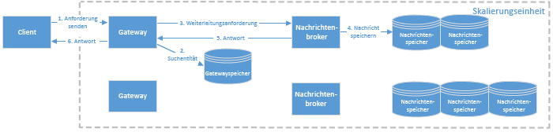
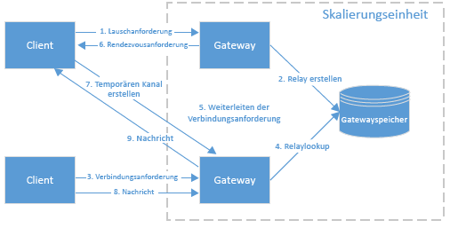

# Service Bus-Architektur
Dieser Artikel beschreibt die Nachrichtenverarbeitungsarchitektur von Azure Service Bus.

## Service Bus-Skalierungseinheiten
Service Bus ist nach *Skalierungseinheiten*strukturiert. Eine Skalierungseinheit ist eine Bereitstellungseinheit und umfasst alle Komponenten, die zum Ausführen des Diensts erforderlich sind. Jede Region stellt mindestens eine Service Bus-Skalierungseinheit bereit.

Ein Service Bus-Namespace wird einer Skalierungseinheit zugeordnet. Die Skalierungseinheit verarbeitet alle Arten von Service Bus-Entitäten: Relays und Brokermessagingentitäten (Warteschlangen, Themen, Abonnements). Eine Service Bus-Skalierungseinheit besteht aus folgenden Komponenten:

* **Eine Gruppe von Gatewayknoten.** Gatewayknoten authentifizieren eingehende Anforderungen und verarbeiten Relayanforderungen. Jeder Gatewayknoten besitzt eine öffentliche IP-Adresse.
* **Eine Sammlung von Messagingbrokerknoten.** Messagingbrokerknoten verarbeiten Anforderungen, die Messagingentitäten betreffen.
* **Ein Gatewayspeicher.** Der Gatewayspeicher enthält die Daten für jede Entität, die in dieser Skalierungseinheit definiert ist. Der Implementierung des Gatewayspeichers liegt eine SQL Azure-Datenbank zugrunde.
* **Mehrere Messagingspeicher.** Die Messagingspeicher enthalten die Nachrichten aller Warteschlangen, Themen und Abonnements, die in dieser Skalierungseinheit definiert sind. Auch sämtliche Abonnementdaten sind darin enthalten. Eine Warteschlange oder ein Thema ist immer einem einzelnen Messagingspeicher zugeordnet, es sei denn, das [Partitionieren von Messagingentitäten](service-bus-partitioning.md) ist aktiviert. Abonnements werden im gleichen Messagingspeicher gespeichert wie ihr übergeordnetes Thema. Mit Ausnahme des [Premium-Messagings](service-bus-premium-messaging.md) von Service Bus liegen der Implementierung von Messagingspeichern SQL Azure-Datenbanken zugrunde.

## Container
Jeder Messagingentität wird ein bestimmter Container zugewiesen. Ein Container ist ein logisches Konstrukt, das genau einen Messagingspeicher verwendet, um alle relevanten Daten für diesen Container zu speichern. Jeder Container wird einem Messagingbrokerknoten zugewiesen. In der Regel übersteigt die Anzahl der Container die Anzahl der Messagingbrokerknoten. Daher lädt jeder Messagingbrokerknoten mehrere Container. Die Verteilung von Containern auf einen Messagingbrokerknoten wird so gestaltet, dass alle Messagingbrokerknoten gleichmäßig ausgelastet sind. Wenn sich die Auslastung verändert (beispielsweise, weil einer der Container besonders stark ausgelastet ist) oder ein Messagingbrokerknoten vorübergehend nicht verfügbar ist, wird die Verteilung der Container entsprechend angepasst.

## Verarbeiten eingehender Messaginganforderungen
Wenn ein Client eine Anforderung an Service Bus sendet, wird diese vom Azure Load Balancer an einen der Gatewayknoten weitergeleitet. Der Gatewayknoten autorisiert die Anforderung. Wenn die Anforderung eine Messagingentität (Warteschlange, Thema, Abonnement) betrifft, sucht der Gatewayknoten die Entität im Gatewayspeicher und ermittelt den Messagingspeicher, in dem sich die Entität befindet. Anschließend wird der Messagingbrokerknoten ermittelt, der momentan für den Container zuständig ist, und die Anforderung wird an diesen Messagingbrokerknoten gesendet. Der Messagingbrokerknoten verarbeitet die Anforderung und aktualisiert den Entitätszustand im Containerspeicher. Anschließend sendet der Messagingbrokerknoten die Antwort an den Gatewayknoten zurück, der wiederum eine entsprechende Antwort an den Client sendet, von dem die ursprüngliche Anforderung stammte.

## Verarbeiten eingehender Relayanforderungen
Wenn ein Client eine Anforderung an Service Bus sendet, wird diese vom Azure Load Balancer an einen der Gatewayknoten weitergeleitet. Handelt es sich dabei um eine Lauschanforderung, erstellt der Gatewayknoten ein neues Relay. Handelt es sich um eine Verbindungsanforderung für ein bestimmtes Relay, leitet der Gatewayknoten die Anforderung an den für das Relay zuständigen Gatewayknoten weiter. Der für das Relay zuständige Gatewayknoten sendet eine Rendezvousanforderung an den lauschenden Client und fordert den Listener auf, einen temporären Kanal zu dem Gatewayknoten zu erstellen, der die Verbindungsanfrage erhalten hat.

Sobald die Relayverbindung besteht, können die Clients Nachrichten über den Gatewayknoten austauschen, die für das Rendezvous verwendet wird.

## Nächste Schritte
Nachdem Sie sich einen Überblick über die Service Bus-Architektur verschafft haben, finden Sie unter den folgenden Links weitere Informationen:

* [Übersicht über Service Bus-Messaging](service-bus-messaging-overview.md)
* [Übersicht über Azure Relay](../service-bus-relay/relay-what-is-it.md)
* [Service Bus – Grundlagen](service-bus-fundamentals-hybrid-solutions.md)
* [Eine Messaginglösung mit Warteschlange unter Verwendung von Service Bus-Warteschlangen](service-bus-dotnet-multi-tier-app-using-service-bus-queues.md)

