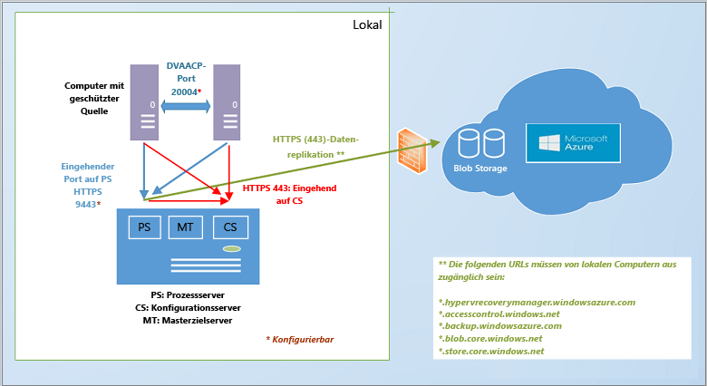
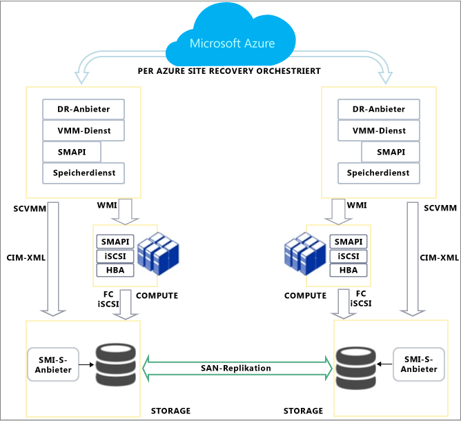

# Wie funktioniert Azure Site Recovery?
Lesen Sie diesen Artikel, um sich über die zugrunde liegende Architektur des Azure Site Recovery-Diensts und die dafür erforderlichen Komponenten zu informieren.

Kommentare oder Fragen können Sie am Ende dieses Artikels oder im [Forum zu Azure Recovery Services](https://social.msdn.microsoft.com/forums/azure/home?forum=hypervrecovmgr)veröffentlichen.

## Übersicht
Organisationen benötigen eine Strategie für die Geschäftskontinuität und Notfallwiederherstellung (BCDR), mit der bestimmt wird, wie Apps, Workloads und Daten bei geplanten und ungeplanten Ausfällen verfügbar bleiben und die normalen Arbeitsbedingungen so schnell wie möglich wiederhergestellt werden können. Bei Ihrer BCDR-Strategie sollten Sie darauf achten, dass Unternehmensdaten geschützt sind und wiederhergestellt werden können. Stellen Sie außerdem sicher, dass Workloads auch nach dem Eintreten eines Notfalls ständig verfügbar sind.

Site Recovery ist ein Azure-Dienst, der einen Beitrag zu Ihrer BCDR-Strategie leistet, indem die Replikation von lokalen physischen Servern und virtuellen Maschinen in die Cloud (Azure) oder in ein sekundäres Rechenzentrum orchestriert wird. Wenn es an Ihrem primären Standort zu Ausfällen kommt, wird ein Failover zum sekundären Standort durchgeführt, um die Verfügbarkeit von Apps und Workloads zu erhalten. Wenn wieder Normalbetrieb herrscht, führen Sie das Failback zum primären Standort durch. Weitere Informationen finden Sie unter [Was ist Site Recovery?](site-recovery-overview.md)

## Site Recovery im Azure-Portal
Azure verfügt über zwei unterschiedliche [Bereitstellungsmodelle](../resource-manager-deployment-model.md) zum Erstellen und Verwenden von Ressourcen: das Azure Resource Manager-Modell und das klassische Dienstverwaltungsmodell. Außerdem verfügt Azure über zwei Portale: das [klassische Azure-Portal](https://manage.windowsazure.com/) mit Unterstützung des klassischen Bereitstellungsmodells und das [Azure-Portal](https://portal.azure.com) mit Unterstützung für beide Bereitstellungsmodelle.

Site Recovery ist sowohl im klassischen Portal als auch im Azure-Portal verfügbar. Im klassischen Azure-Portal können Sie Site Recovery mit dem klassischen Dienstverwaltungsmodell unterstützen. Im Azure-Portal können Sie das klassische Modell oder Resource Manager-Bereitstellungen unterstützen. [hier](site-recovery-overview.md#site-recovery-in-the-azure-portal) .

Die Informationen in diesem Artikel gelten für Bereitstellungen mit dem klassischen Portal und dem Azure-Portal. Die Unterschiede sind jeweils gekennzeichnet.

## Bereitstellungsszenarien
Site Recovery kann bereitgestellt werden, um die Replikation in unterschiedlichen Szenarien zu orchestrieren:

* **Replizieren von virtuellen VMware-Computern**: Sie können lokale virtuelle VMware-Computer in Azure oder einem sekundären Datencenter replizieren.
* * **Replizieren von physischen Computern**: Sie können physische Computer mit Windows oder Linux in Azure oder einem sekundären Datencenter replizieren. Der Prozess für das Replizieren von physischen Computern ist fast identisch mit dem Prozess für das Replizieren von VMware-VMs.
* **Replizieren von Hyper-V-VMs (ohne VMM)**: Sie können Hyper-V-VMs, die nicht per VMM verwaltet werden, in Azure replizieren.
* **Replizieren von Hyper-V-VMs, die in System Center VMM-Clouds verwaltet werden**: Sie können lokale virtuelle Hyper-V-Computer, die in VMM-Clouds auf Hyper-V-Hostservern ausgeführt werden, in Azure oder einem sekundären Datencenter replizieren. Für die Replikation können Sie ein Hyper-V-Standardreplikat oder die SAN-Replikation verwenden.
* **Migrieren von VMs**: Sie können Site Recovery verwenden, um [Azure-IaaS-VMs](site-recovery-migrate-azure-to-azure.md) zwischen Regionen zu migrieren oder um [AWS Windows-Instanzen](site-recovery-migrate-aws-to-azure.md) zu Azure-IaaS-VMs zu migrieren. Derzeit wird nur die Migration unterstützt. Dies bedeutet, dass Sie für diese VMs nur ein Failover durchführen können, aber kein Failback.

Site Recovery kann die meisten auf diesen virtuellen Maschinen und physischen Servern ausgeführten Apps replizieren. Eine vollständige Zusammenfassung der unterstützten Apps finden Sie unter [Welche Workloads können mit Azure Site Recovery geschützt werden?](site-recovery-workload.md)

## Replikation zu Azure: Virtuelle VMware-Computer oder physische Windows-/Linux-Server
Es gibt mehrere Möglichkeiten, virtuelle VMware-Computer mit Site Recovery zu replizieren.

* **Verwendung des Azure-Portals:** Wenn Sie Site Recovery im Azure-Portal bereitstellen, können Sie für VMs ein Failover in einen klassischen Service Manager-Speicher oder zum Resource Manager durchführen. Das Replizieren von VMware-VMs im Azure-Portal ist mit einigen Vorteilen verbunden, z.B. der Möglichkeit zur Replikation in klassischen Speicher oder Resource Manager-Speicher in Azure. [detaillierte Kapazitätsplanung](site-recovery-vmware-to-azure.md)
* **Verwendung des klassischen Portals**: Sie können Site Recovery im klassischen Portal mit einer verbesserten Benutzeroberfläche bereitstellen. Diese sollte für alle neuen Bereitstellungen im klassischen Portal genutzt werden. Bei dieser Bereitstellung können Sie für VMs nur Failover in den klassischen Speicher durchführen, nicht in den Resource Manager-Speicher. [Weitere Informationen](site-recovery-vmware-to-azure-classic.md). Es ist auch eine [Legacy-Benutzeroberfläche](site-recovery-vmware-to-azure-classic-legacy.md) zum Einrichten der VMware-Replikation im klassischen Portal vorhanden. Diese sollte nicht für neue Bereitstellungen verwendet werden.  Falls Sie die Bereitstellung bereits mit der Legacy-Benutzeroberfläche durchgeführt haben, helfen Ihnen die Informationen unter [Migrieren zur erweiterten Bereitstellung](site-recovery-vmware-to-azure-classic-legacy.md#migrate-to-the-enhanced-deployment) weiter.

Die Architekturanforderungen für die Bereitstellung von Site Recovery zum Replizieren von VMware-VMs oder physischen Servern im Azure-Portal oder klassischen Azure-Portal (erweitert) ähneln sich, aber es gibt auch einige Unterschiede:

* Bei der Bereitstellung im Azure-Portal können Sie die Replikation im Resource Manager-basierten Speicher durchführen und Resource Manager-Netzwerke verwenden, um für die Azure-VMs nach dem Failover eine Verbindung herzustellen.
* Für die Bereitstellung im Azure-Portal wird Speicher vom Typ LRS und GRS unterstützt. Im klassischen Portal ist GRS erforderlich.
* Im Azure-Portal ist der Bereitstellungsprozess einfacher und benutzerfreundlicher.

Sie benötigen Folgendes:

* **Azure-Konto**: Sie benötigen ein Microsoft Azure-Konto.
* **Azure-Speicher**: Sie benötigen ein Azure-Speicherkonto, um replizierte Daten zu speichern. Sie können ein klassisches Konto oder ein Resource Manager-Speicherkonto verwenden. Das Konto kann den Typ LRS oder GRS aufweisen, wenn Sie die Bereitstellung über das Azure-Portal durchführen. Replizierte Daten werden im Azure-Speicher gespeichert, und virtuelle Azure-Computer werden bei einem Failover hochgefahren.
* **Azure-Netzwerk**: Sie benötigen ein virtuelles Azure-Netzwerk, mit dem die Azure-VMs eine Verbindung herstellen, wenn sie während eines Failovers erstellt werden. Im Azure-Portal können dies Netzwerke sein, die mit dem klassischen Service-Manager-Modell oder dem Resource Manager-Modell erstellt werden.
* **Lokaler Konfigurationsserver**: Sie benötigen einen lokalen Windows Server 2012 R2-Computer, auf dem der Konfigurationsserver und andere Site Recovery-Komponenten ausgeführt werden. Wenn Sie virtuelle VMware-Computer replizieren, sollte es sich um hoch verfügbare Computer handeln. Wenn Sie physische Server replizieren möchten, können Sie einen physischen Computer verwenden. Die folgenden Site Recovery-Komponenten werden auf dem Computer installiert:
  * **Konfigurationsserver**: Koordiniert die Kommunikation zwischen Ihrer lokalen Umgebung und Azure und verwaltet die Datenreplikation und Wiederherstellung.
  * **Prozessserver**: Fungiert als Replikationsgateway. Sie empfängt Replikationsdaten aus geschützten Quellcomputern, optimiert sie durch Zwischenspeicherung, Komprimierung und Verschlüsselung und sendet die Daten an den Azure-Speicher. Außerdem wickelt er die Pushinstallation des Mobilitätsdiensts auf geschützten Computern ab und führt die automatische Ermittlung von virtuellen VMware-Computern durch. Bei zunehmender Größe der Bereitstellung können Sie zusätzlich separate dedizierte Prozessserver hinzufügen, um steigende Mengen von Replikationsdatenverkehr zu bewältigen.
  * **Masterzielserver**: Verarbeitet die Replikationsdaten während des Failbacks von Azure.
* **Zu replizierende VMware-VMs oder physische Server**: Für jeden Computer, den Sie in Azure replizieren möchten, muss die Mobilitätsdienstkomponente installiert sein. Dieser Dienst erfasst die Datenschreibvorgänge auf dem Computer und sendet sie an den Prozessserver. Die Komponente kann manuell oder mittels Pushvorgang automatisch durch den Prozessserver installiert werden, wenn die Replikation für den Computer aktiviert wird.
* **vSphere-Hosts/vCenter-Server**: Sie benötigen mindestens einen vSphere-Hostserver, auf dem VMware-VMs ausgeführt werden. Zum Verwalten dieser Hosts empfiehlt sich die Bereitstellung eines vCenter-Servers.
* **Failback:** Sie benötigen Folgendes:
  * **Failback vom Typ „physisch-zu-physisch“ wird nicht unterstützt:** Dies bedeutet, dass ein Failback auf eine VMware-VM erforderlich ist, wenn Sie für physische Server ein Failover zu Azure mit anschließendem Failback durchführen möchten. Ein Failback zu einem physischen Server ist nicht möglich. Sie benötigen eine Azure-VM für das Failback. Falls Sie den Konfigurationsserver nicht als VMware-VM bereitgestellt haben, müssen Sie einen separaten Masterzielserver als VMware-VM einrichten. Dies ist erforderlich, weil der Masterzielserver mit dem VMware-Speicher interagiert und diesem Speicher zugeordnet wird, um die Datenträger auf einer VMware-VM wiederherzustellen.
  * * **Temporärer Prozessserver in Azure**: Wenn Sie nach einem Failover ein Failback aus Azure durchführen möchten, müssen Sie eine als Prozessserver konfigurierte Azure-VM für die Replikation aus Azure einrichten. Nach Beendigung des Failbacks können Sie diese VM löschen.
  * **VPN-Verbindung**: Für das Failback benötigen Sie eine VPN-Verbindung (oder Azure ExpressRoute) zwischen dem Azure-Netzwerk und dem lokalen Standort.
  * **Separater lokaler Masterzielserver**: Der lokale Masterzielserver führt das Failback durch. Der Masterzielserver wird standardmäßig auf dem Verwaltungsserver installiert, aber wenn Sie Failbacks für größere Mengen von Datenverkehr durchführen, sollten Sie für diese Zwecke einen separaten lokalen Masterzielserver einrichten.

**Allgemeine Architektur**

**Bereitstellungskomponenten**

**Failback**

* [Informieren Sie sich](site-recovery-vmware-to-azure.md#azure-prerequisites) über die Anforderungen für die Bereitstellung mit dem Azure-Portal.
* [Informieren Sie sich](site-recovery-vmware-to-azure-classic.md#before-you-start-deployment) über die Anforderungen der erweiterten Bereitstellung im klassischen Portal.
* [Informieren Sie sich](site-recovery-failback-azure-to-vmware.md) über das Failback im Azure-Portal.
* [Informieren Sie sich](site-recovery-failback-azure-to-vmware-classic.md) über das Failback im klassischen Portal.

## Replikation zu Azure: Nicht über VMM verwaltete Hyper-V-VMs
Sie können Hyper-V-VMs, die nicht per System Center-VMM verwaltet werden, wie folgt mit Site Recovery in Azure replizieren:

* **Verwendung des Azure-Portals**: Wenn Sie Site Recovery im Azure-Portal bereitstellen, können Sie für VMs ein Failover in einen klassischen Speicher oder zum Resource Manager durchführen. [Weitere Informationen](site-recovery-hyper-v-site-to-azure.md).
* **Verwendung des klassischen Portals**: Sie können Site Recovery im klassischen Portal bereitstellen. Bei dieser Bereitstellung können Sie für VMs nur Failover in den klassischen Speicher durchführen, nicht in den Resource Manager-Speicher. [Weitere Informationen](site-recovery-hyper-v-site-to-azure-classic.md).

Die Architektur für beide Bereitstellungen ähnelt sich bis auf die folgenden Ausnahmen:

* Bei der Bereitstellung im Azure-Portal können Sie die Replikation im Resource Manager Speicher durchführen und Resource Manager-Netzwerke verwenden, um für die Azure-VMs nach dem Failover eine Verbindung herzustellen.
* Im Azure-Portal ist der Bereitstellungsprozess einfacher und benutzerfreundlicher.

Sie benötigen Folgendes:

* **Azure-Konto**: Sie benötigen ein Microsoft Azure-Konto.
* **Azure-Speicher**: Sie benötigen ein Azure-Speicherkonto, um replizierte Daten zu speichern. Im Azure-Portal können Sie ein klassisches Konto oder ein Resource Manager-Speicherkonto verwenden. Im klassischen Portal können Sie nur ein klassisches Konto verwenden. Replizierte Daten werden im Azure-Speicher gespeichert, und virtuelle Azure-Computer werden erstellt, wenn ein Failover durchgeführt wird.
* **Azure-Netzwerk**: Sie benötigen ein Azure-Netzwerk, mit dem die Azure-VMs bei einem Failover eine Verbindung herstellen können, wenn sie nach einem Failover erstellt werden.
* **Hyper-V-Host**: Sie benötigen mindestens einen Windows Server 2012 R2 Hyper-V-Hostserver. Während der Azure Site Recovery-Bereitstellung werden auf dem Host der Azure Site Recovery-Anbieter und der Microsoft Azure Recovery Services-Agent installiert.
* **Hyper-V-VMs**: Sie benötigen mindestens eine VM auf dem Hyper-V-Hostserver. Azure Site Recovery-Anbieter und Azure Recovery Services-Agent auf dem Hyper-V-Host während der Bereitstellung von Site Recovery. Der Anbieter koordiniert und orchestriert die Replikation mit dem Site Recovery-Dienst über das Internet. Der-Agent verarbeitet die Replikation von Daten über HTTPS 443. Sowohl die Kommunikation vom Anbieter als auch vom Agent ist sicher und verschlüsselt. Die replizierten Daten im Azure-Speicher werden ebenfalls verschlüsselt.

**Allgemeine Architektur**

* [Informieren Sie sich](site-recovery-hyper-v-site-to-azure.md#azure-prerequisites) über die Anforderungen für die Bereitstellung mit dem Azure-Portal.
* [Informieren Sie sich](site-recovery-hyper-v-site-to-azure-classic.md#azure-prerequisites) über die Anforderungen für die Bereitstellung mit dem klassischen Portal.

## Replikation zu Azure: Über VMM verwaltete Hyper-V-VMs
Sie können Hyper-V-VMs in VMM-Clouds wie folgt mit Site Recovery in Azure replizieren:

* **Verwendung des Azure-Portals**: Wenn Sie Site Recovery im Azure-Portal bereitstellen, können Sie für VMs ein Failover in einen klassischen Speicher oder zum Resource Manager durchführen. [Weitere Informationen](site-recovery-vmm-to-azure.md).
* **Verwendung des klassischen Portals**: Sie können Site Recovery im klassischen Portal bereitstellen. Bei dieser Bereitstellung können Sie für VMs nur Failover in den klassischen Speicher durchführen, nicht in den Resource Manager-Speicher. [Weitere Informationen](site-recovery-vmm-to-azure-classic.md).

Die Architektur für beide Bereitstellungen ähnelt sich bis auf die folgenden Ausnahmen:

* Bei der Bereitstellung im Azure-Portal können Sie die Replikation im Resource Manager-basierten Speicher durchführen und Resource Manager-Netzwerke verwenden, um für die Azure-VMs nach dem Failover eine Verbindung herzustellen.
* Im Azure-Portal ist der Bereitstellungsprozess einfacher und benutzerfreundlicher.

Sie benötigen Folgendes:

* **Azure-Konto**: Sie benötigen ein Microsoft Azure-Konto.
* **Azure-Speicher**: Sie benötigen ein Azure-Speicherkonto, um replizierte Daten zu speichern. Im Azure-Portal können Sie ein klassisches Konto oder ein Resource Manager-Speicherkonto verwenden. Im klassischen Portal können Sie nur ein klassisches Konto verwenden. Replizierte Daten werden im Azure-Speicher gespeichert, und virtuelle Azure-Computer werden erstellt, wenn ein Failover durchgeführt wird.
* **Azure-Netzwerk**: Sie müssen die Netzwerkzuordnung so einrichten, dass für Azure-VMs eine Verbindung mit geeigneten Netzwerken hergestellt wird, wenn sie nach dem Failover erstellt werden.
* **VMM-Server**: Sie benötigen mindestens einen lokalen VMM-Server, der unter System Center 2012 R2 ausgeführt wird, und ein Setup mit mindestens einer privaten Cloud. Wenn Sie die Bereitstellung über das Azure-Portal durchführen, müssen Sie logische Netzwerke und VM-Netzwerke einrichten, damit Sie die Netzwerkzuordnung konfigurieren können. Im klassischen Portal ist dies optional.  Ein VM-Netzwerk sollte mit einem logischen Netzwerk verbunden sein, das der Cloud zugeordnet ist.
* **Hyper-V-Host**: Sie benötigen mindestens einen Windows Server 2012 R2 Hyper-V-Hostserver in der VMM-Cloud.
* **Hyper-V-VMs**: Sie benötigen mindestens eine VM auf dem Hyper-V-Hostserver.

**Allgemeine Architektur**

* [Informieren Sie sich](site-recovery-vmm-to-azure.md#azure-requirements) über die Anforderungen für die Bereitstellung mit dem Azure-Portal.
* [Informieren Sie sich](site-recovery-vmm-to-azure-classic.md#before-you-start) über die Anforderungen für die Bereitstellung mit dem klassischen Portal.

## Replikation zu einem sekundären Standort: Virtuelle VMware-Computer oder physische Server
Zum Replizieren von VMware-VMs oder physischen Servern an einem sekundären Standort laden Sie die Anwendung InMage Scout herunter, die im Azure Site Recovery-Abonnement enthalten ist. Der Download ist über das Azure-Portal oder das klassische Azure-Portal möglich.

Sie richten die Komponentenserver an jedem Standort ein (Konfiguration, Prozess, Masterziel) und installieren den vereinheitlichten Agent auf Computern, die Sie replizieren möchten. Nach der ersten Replikation sendet der Agent auf jedem Computer die Deltareplikationsänderungen an den Prozessserver. Der Prozessserver optimiert die Daten und überträgt sie an den Masterzielserver am sekundären Standort. Der Konfigurationsserver verwaltet den Replikationsprozess.

Sie benötigen Folgendes:

**Azure-Konto**: Sie stellen dieses Szenario mit InMage Scout bereit. Hierfür benötigen Sie ein Azure-Abonnement. Nachdem Sie einen Site Recovery-Tresor erstellt haben, laden Sie InMage Scout herunter und installieren die aktuellen Updates, um die Bereitstellung einzurichten.
**Prozessserver (primärer Standort)**: Richten Sie die Prozessserverkomponente an Ihrem primären Standort ein, um das Caching, die Komprimierung und die Datenoptimierung zu behandeln. Außerdem erfolgt hierüber die Pushinstallation des vereinheitlichten Agents auf Maschinen, die Sie schützen möchten.
**VMware ESX/ESXi und vCenter Server (primärer Standort)**: Zum Schutz von VMware-VMs benötigen Sie einen VMware EXS/ESXi-Hypervisor und optional einen VMware vCenter-Server zum Verwalten von Hypervisoren.

* **VMs/physische Server (primärer Standort)**: Auf VMware-VMs oder physischen Windows-/Linux-Servern, die geschützt werden sollen, muss der vereinheitlichte Agent installiert sein. Der vereinheitlichte Agent wird auch auf Computern installiert, die als Masterzielserver dienen. Der Agent fungiert als Kommunikationsanbieter zwischen allen Komponenten.
* * **Konfigurationsserver (sekundärer Standort):** Der Konfigurationsserver ist die erste Komponente, die Sie installieren. Er wird am sekundären Standort installiert, um Ihre Bereitstellung zu verwalten, zu konfigurieren und zu überwachen, und zwar mit der Verwaltungswebsite oder der vContinuum-Konsole. Es gibt nur einen Konfigurationsserver in einer Bereitstellung, der auf einem Computer mit Windows Server 2012 R2 installiert sein muss.
* **vContinuum-Server (sekundärer Standort)**: Der Server ist an demselben Ort (sekundärer Standort) wie der Konfigurationsserver installiert. Er enthält eine Konsole zum Verwalten und Überwachen Ihrer geschützten Umgebung. Bei einer standardmäßigen Installation ist der vContinuum-Server der erste Masterzielserver und verfügt über eine Installation des vereinheitlichten Agents.
* **Masterzielserver (sekundärer Standort):** Der Masterzielserver enthält replizierte Daten. Er empfängt Daten vom Prozessserver und erstellt einen Replikatcomputer am sekundären Standort. Außerdem enthält er die Punkte für die Beibehaltung der Daten. Die Anzahl der benötigten Masterzielserver richtet sich nach der Anzahl der Computer, die Sie schützen. Wenn Sie ein Failback zum primären Standort durchführen möchten, benötigen Sie dort ebenfalls einen Masterzielserver.

**Allgemeine Architektur**

## Replikation zu einem sekundären Standort: Per VMM verwaltete Hyper-V-VMs
Sie können Hyper-V-VMs, die per System Center-VMM verwaltet werden, wie folgt mit Site Recovery in einem sekundären Datencenter replizieren:

* **Verwendung des Azure-Portals:**Bei Bereitstellung von Site Recovery im Azure-Portal. [Weitere Informationen](site-recovery-hyper-v-site-to-azure.md).
* **Verwendung des klassischen Portals**: Sie können Site Recovery im klassischen Portal bereitstellen. [Weitere Informationen](site-recovery-hyper-v-site-to-azure-classic.md).

Die Architektur für beide Bereitstellungen ähnelt sich bis auf die folgenden Ausnahmen:

* Wenn Sie die Bereitstellung im Azure-Portal durchführen, müssen Sie die Netzwerkzuordnung einrichten. Dies ist im klassischen Portal optional.
* Im Azure-Portal ist der Bereitstellungsprozess einfacher und benutzerfreundlicher.
* * Wenn Sie die Bereitstellung im klassischen Azure-Portal durchführen, ist die [Speicherzuordnung](site-recovery-storage-mapping.md) verfügbar.

Sie benötigen Folgendes:

* **Azure-Konto**: Sie benötigen ein Microsoft Azure-Konto.
* **VMM-Server**: Es wird empfohlen, einen VMM-Server am primären Standort und einen am sekundären Standort zu verwenden, die jeweils mindestens eine private VMM-Cloud enthalten. Auf dem Server sollte mindestens System Center 2012 SP1 mit den neuesten Updates und einer Internetverbindung ausgeführt werden. Für die Clouds sollte das Hyper-V-Funktionsprofil eingestellt sein. Sie installieren den Azure Site Recovery-Anbieter auf dem VMM-Server. Der Anbieter koordiniert und orchestriert die Replikation mit dem Site Recovery-Dienst über das Internet. Die Kommunikation zwischen dem Anbieter und Azure ist geschützt und verschlüsselt.
* **Hyper-V Server**: Hyper-V-Hostserver sollten in der primären sowie in der sekundären VMM-Cloud angeordnet sein. Die Hostserver müssen mindestens mit Windows Server 2012 mit den neuesten Updates ausgeführt werden und über eine Internetverbindung verfügen. Die Daten werden zwischen dem primären und sekundären Hyper-V-Hostserver über das LAN oder VPN per Kerberos- oder Zertifikatauthentifizierung repliziert.  
* **Geschützte Computer**: Der Quell-Hyper-V-Hostserver muss mindestens eine zu schützende VM enthalten.

**Allgemeine Architektur**

* [Informieren Sie sich](site-recovery-vmm-to-vmm.md#azure-prerequisites) über die Anforderungen der Bereitstellung im Azure-Portal.
* * [Informieren Sie sich](site-recovery-vmm-to-vmm-classic.md#before-you-start) über die Anforderungen der Bereitstellung im klassischen Portal.

## Replikation zu einem sekundären Standort mit SAN-Replikation: Per VMM verwaltete Hyper-V-VMs
Sie können in VMM-Clouds verwaltete Hyper-V-VMs per SAN-Replikation an einem sekundären Standort replizieren, indem Sie das klassische Azure-Portal verwenden. Dieses Szenario wird im neuen Azure-Portal derzeit nicht unterstützt.

Bei diesem Szenario installieren Sie den Azure Site Recovery-Anbieter während der Bereitstellung von Site Recovery auf den VMM-Servern. Der Anbieter koordiniert und orchestriert die Replikation mit dem Site Recovery-Dienst über das Internet. Die Daten werden zwischen den primären und sekundären Speicherarrays per synchroner SAN-Replikation repliziert.

Sie benötigen Folgendes:

**Azure-Konto**: Sie benötigen ein Azure-Abonnement.

* **SAN-Array**: Ein [unterstütztes SAN-Array](http://social.technet.microsoft.com/wiki/contents/articles/28317.deploying-azure-site-recovery-with-vmm-and-san-supported-storage-arrays.aspx) , das vom primären VMM-Server verwaltet wird. Das SAN teilt eine Netzwerkinfrastruktur mit einem anderen SAN-Array am sekundären Standort.
* **VMM-Server**: Es wird empfohlen, einen VMM-Server am primären Standort und einen am sekundären Standort zu verwenden, die jeweils mindestens eine private VMM-Cloud enthalten. Auf dem Server sollte mindestens System Center 2012 SP1 mit den neuesten Updates und einer Internetverbindung ausgeführt werden. Für die Clouds sollte das Hyper-V-Funktionsprofil eingestellt sein.
* **Hyper-V Server**: Hyper-V-Hostserver in der primären sowie in der sekundären VMM-Cloud. Die Hostserver müssen mindestens mit Windows Server 2012 mit den neuesten Updates ausgeführt werden und über eine Internetverbindung verfügen.
* **Geschützte Computer**: Der Quell-Hyper-V-Hostserver muss mindestens eine zu schützende VM enthalten.

**Architektur der SAN-Replikation**

[Erfahren Sie mehr](site-recovery-vmm-san.md#before-you-start) über die Voraussetzungen für die Bereitstellung.

### Lokal
## Lebenszyklus des Hyper-V-Schutzes
Dieser Workflow verdeutlicht den Prozess zum Schützen, Replizieren und Durchführen des Failovers für virtuelle Hyper-V-Maschinen.

1. **Aktivieren des Schutzes**: Sie richten den Site Recovery-Tresor ein, konfigurieren die Replikationseinstellungen für eine VMM-Cloud oder eine Hyper-V-Site und aktivieren den Schutz für die VMs. Es wird ein Auftrag mit der Bezeichnung **Schutz aktivieren** initiiert, und er kann auf der Registerkarte **Aufträge** überwacht werden. Im Rahmen des Auftrags wird überprüft, ob der Computer die Voraussetzungen erfüllt. Anschließend wird die [CreateReplicationRelationship](https://msdn.microsoft.com/library/hh850036.aspx)-Methode aufgerufen, mit der die Replikation zu Azure mit den von Ihnen konfigurierten Einstellungen durchgeführt wird. Im Rahmen des Auftrags **Schutz aktivieren** wird auch die [StartReplication](https://msdn.microsoft.com/library/hh850303.aspx)-Methode aufgerufen, um eine vollständige VM-Replikation zu initialisieren.
2. **Anfängliche Replikation**: Es wird eine Momentaufnahme der virtuellen Maschine erstellt, und die virtuellen Festplatten werden einzeln nacheinander repliziert, bis sie alle zu Azure oder in das sekundäre Rechenzentrum kopiert werden. Wie lange dieser Vorgang dauert, richtet sich nach der VM-Größe, der Netzwerkbandbreite und der Methode für die anfängliche Replikation. Falls es während der anfänglichen Replikation zu Festplattenänderungen kommt, werden diese Änderungen mit dem Replication Tracker für Hyper-V-Replikate in Form von Hyper-V-Replikationsprotokollen (.hrl) nachverfolgt, die sich in demselben Ordner wie die Festplatten befinden. Jeder Datenträger verfügt über eine zugeordnete HRL-Datei, die an den sekundären Speicher gesendet wird. Beachten Sie, dass die Momentaufnahme- und Protokolldateien Festplattenressourcen belegen, während die Replikation durchgeführt wird. Nach Abschluss der anfänglichen Replikation wird die VM-Momentaufnahme gelöscht, und die Festplatten-Deltaänderungen im Protokoll werden synchronisiert und zusammengeführt.
3. **Fertigstellen des Schutzes:** Nachdem die anfängliche Replikation abgeschlossen ist, werden mit dem Auftrag zum **Fertigstellen des Schutzes** das Netzwerk und andere Einstellungen nach der Replikation konfiguriert, damit der virtuelle Computer geschützt ist. Wenn Sie eine Replikation zu Azure durchführen, müssen Sie die Einstellungen für die virtuelle Maschine unter Umständen so optimieren, dass sie bereit für das Failover ist. An diesem Punkt können Sie ein Testfailover durchführen, um zu überprüfen, ob alles wie erwartet funktioniert.
4. **Replikation**: Nach der ersten Replikation beginnt die Deltasynchronisierung gemäß den Replikationseinstellungen.
   * **Replikationsfehler**: Wenn die Deltareplikation fehlschlägt und eine vollständige Replikation einen hohen Aufwand in Bezug auf die Bandbreite oder Dauer bedeuten würde, wird eine Neusynchronisierung durchgeführt. Wenn die HRL-Dateien beispielsweise 50% des Festplattenspeichers füllen, wird die VM für die Neusynchronisierung gekennzeichnet. Bei der Neusynchronisierung wird die Menge der gesendeten Daten verringert, indem Prüfsummen für die virtuellen Quell- und Zielmaschinen berechnet werden und nur das Delta gesendet wird. Nach Abschluss der Neusynchronisierung wird die Deltareplikation fortgesetzt. Standardmäßig ist die Neusynchronisierung so geplant, dass sie automatisch außerhalb der Geschäftszeiten durchgeführt wird, aber Sie können eine virtuelle Maschine auch manuell neu synchronisieren.
   * **Replikationsfehler**: Wenn ein Replikationsfehler auftritt, wird die integrierte Wiederholungsfunktion verwendet. Bei Auftreten eines Fehlers, für den keine Wiederherstellung möglich ist, z.B. ein Authentifizierungs- oder Autorisierungsfehler oder ein Replikatcomputer in einem ungültigen Zustand, wird nicht versucht, den Vorgang zu wiederholen. Bei einem Fehler, bei dem eine Wiederherstellung möglich ist, z.B. einem Netzwerkfehler oder einer geringen Menge an verbleibendem Festplattenspeicher/Arbeitsspeicher, wird eine Wiederholung mit zunehmenden Intervallen durchgeführt (1, 2, 4, 8, 10 und dann alle 30 Minuten).
5. **Geplante/ungeplante Failover**: Sie können geplante oder ungeplante Failover je nach Bedarf durchführen. Wenn Sie ein geplantes Failover durchführen, werden die Quell-VMs heruntergefahren, um sicherzustellen, dass kein Datenverlust auftritt. Nach der Erstellung der Replikat-VMs werden diese in den Zustand „Commit ausstehend“ versetzt. Sie müssen den Commit-Vorgang durchführen, um das Failover abzuschließen, es sei denn, Sie verwenden SAN. In diesem Fall wird der Commit-Vorgang automatisch durchgeführt. Nachdem der primäre Standort betriebsbereit ist, kann ein Failback durchgeführt werden. Wenn Sie zu Azure repliziert haben, erfolgt die umgekehrte Replikation automatisch. Starten Sie andernfalls manuell eine umgekehrte Replikation.

## Nächste Schritte
[Vorbereiten der Bereitstellung](site-recovery-best-practices.md)

<!--HONumber=Nov16_HO2-->

