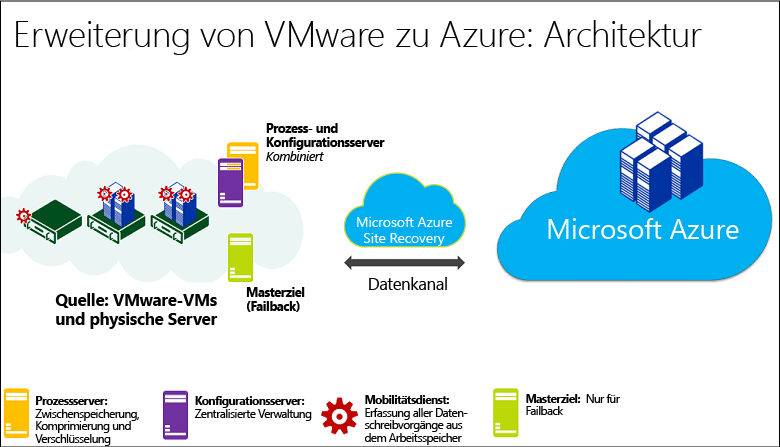
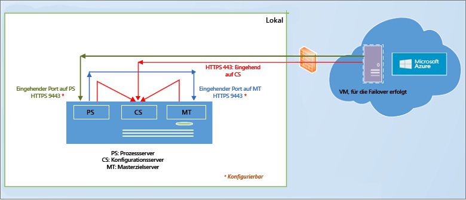
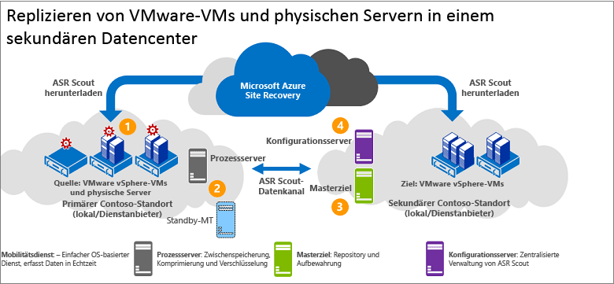
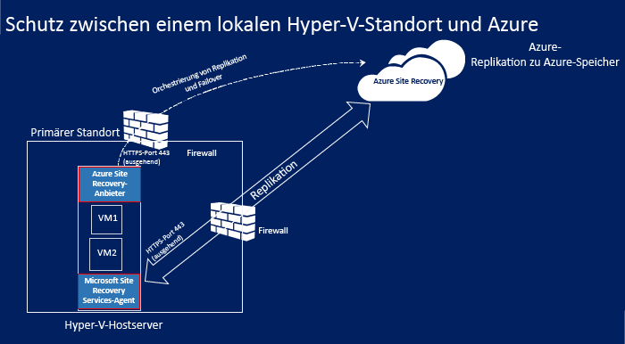
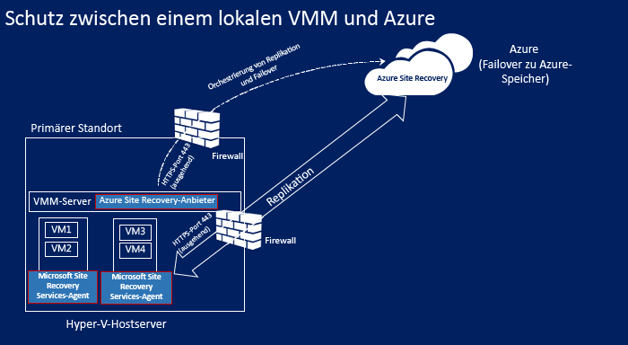
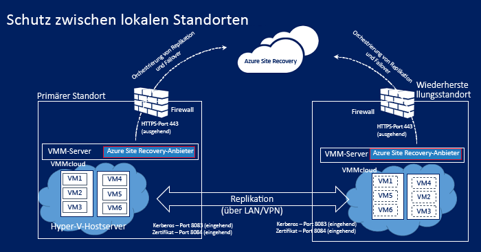
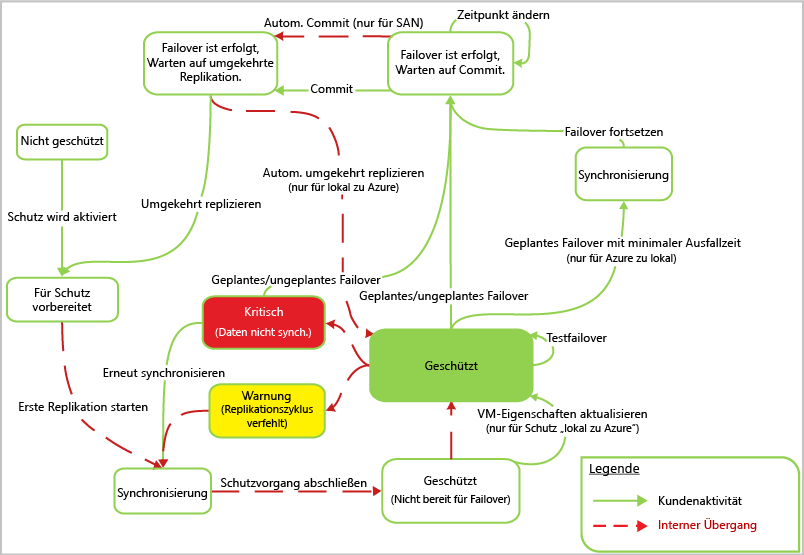

# Wie funktioniert Azure Site Recovery?

Lesen Sie diesen Artikel, um sich über die zugrunde liegende Architektur des Azure Site Recovery-Diensts und die dafür erforderlichen Komponenten zu informieren.

Organisationen benötigen eine Strategie für die Geschäftskontinuität und Notfallwiederherstellung (BCDR), mit der bestimmt wird, wie Apps, Workloads und Daten bei geplanten und ungeplanten Ausfällen verfügbar bleiben und die normalen Arbeitsbedingungen so schnell wie möglich wiederhergestellt werden können. Bei Ihrer BCDR-Strategie sollten Sie darauf achten, dass Unternehmensdaten geschützt sind und wiederhergestellt werden können. Stellen Sie außerdem sicher, dass Workloads auch nach dem Eintreten eines Notfalls ständig verfügbar sind.

Site Recovery ist ein Azure-Dienst, der einen Beitrag zu Ihrer BCDR-Strategie leistet, indem die Replikation von lokalen physischen Servern und virtuellen Computern in die Cloud (Azure) oder in ein sekundäres Datencenter orchestriert wird. Wenn es an Ihrem primären Standort zu Ausfällen kommt, wird ein Failover zum sekundären Standort durchgeführt, um die Verfügbarkeit von Apps und Workloads zu erhalten. Wenn wieder Normalbetrieb herrscht, führen Sie das Failback zum primären Standort durch. Weitere Informationen finden Sie unter [Was ist Site Recovery?](site-recovery-overview.md)

In diesem Artikel wird die Bereitstellung über das [Azure-Portal](https://portal.azure.com) beschrieben. Sie können das [klassische Azure-Portal](https://manage.windowsazure.com/) verwenden, um vorhandene Site Recovery-Tresore zu verwalten, aber Sie können keine neuen Tresore erstellen.

Am Ende dieses Artikels können Sie einen Kommentar eingeben. Im [Azure Recovery Services-Forum](https://social.msdn.microsoft.com/forums/azure/home?forum=hypervrecovmgr)können Sie technische Fragen stellen.

## Bereitstellungsszenarien

Site Recovery kann bereitgestellt werden, um die Replikation in unterschiedlichen Szenarien zu orchestrieren:

- **Replizieren virtueller VMware-Computer**: Sie können lokale virtuelle VMware-Computer nach Azure oder auf einem sekundären Rechenzentrum replizieren.
- **Replizieren physischer Computer**: Sie können physische Computer (Windows oder Linux) in Azure oder in einem sekundären Datencenter replizieren. Der Prozess für das Replizieren von physischen Computern ist fast identisch mit dem Prozess für das Replizieren von VMware-VMs.
- **Replizieren von Hyper-V-VMs**: Sie können Hyper-V-VMs in Azure oder an einem sekundären VMM-Standort replizieren. Wenn Sie die Replikation an einem sekundären Standort durchführen möchten, muss die Verwaltung über System Center Virtual Machine Manager-Clouds erfolgen.
- **Migrieren von VMs**: Zusätzlich zum Replizieren (Replikation, Failover und Failback) von lokalen VMs und physischen Servern in Azure können Sie auch eine Migration dieser Komponenten zu Azure-VMs durchführen (Replikation, Failover, kein Failback). Sie können Folgendes migrieren:
    - Migrieren Sie Workloads, die auf lokalen Hyper-V-VMs, VMware-VMs und physischen Servern ausgeführt werden, um die Ausführung auf Azure-VMs zu ermöglichen.
    - Migrieren Sie [Azure IaaS-VMs](site-recovery-migrate-azure-to-azure.md) zwischen Azure-Regionen. Derzeit wird für dieses Szenario nur die Migration unterstützt. Ein Failback wird also nicht unterstützt.
    - Migrieren Sie [AWS Windows-Instanzen](site-recovery-migrate-aws-to-azure.md) zu Azure IaaS-VMs. Derzeit wird für dieses Szenario nur die Migration unterstützt. Ein Failback wird also nicht unterstützt.

Site Recovery repliziert Apps, die auf unterstützten VMs und physischen Servern ausgeführt werden. Eine vollständige Zusammenfassung der unterstützten Apps finden Sie unter [Welche Workloads können mit Azure Site Recovery geschützt werden?](site-recovery-workload.md)

## Replizieren von VMware-VMs/physischen Servern in Azure

### Komponenten

**Komponente** | **Details**
--- | ---
**Azure** | In Azure benötigen Sie ein Microsoft Azure-Konto, ein Azure-Speicherkonto und ein Azure-Netzwerk.   Bei Speicher und Netzwerk kann es sich um Resource Manager-Konten oder klassische Konten handeln.    Replizierte Daten werden im Speicherkonto gespeichert, und Azure-VMs werden mit den replizierten Daten erstellt, wenn ein Failover von Ihrem lokalen Standort durchgeführt wird. Für die Azure-VMs wird eine Verbindung mit dem virtuellen Azure-Netzwerk hergestellt, wenn diese erstellt werden.
**Konfigurationsserver** | Sie richten lokal einen Konfigurationsserver ein, um die Kommunikation zwischen dem lokalen Standort und Azure zu koordinieren und die Datenreplikation zu verwalten.
**Prozessserver** | Wird standardmäßig auf dem lokalen Konfigurationsserver installiert.   Fungiert als Replikationsgateway. Empfängt Replikationsdaten aus geschützten Quellcomputern, optimiert sie durch Zwischenspeicherung, Komprimierung und Verschlüsselung und sendet die Daten an den Azure-Speicher.   Wickelt die Pushinstallation des Mobilitätsdiensts auf geschützten Computern ab und führt die automatische Ermittlung von virtuellen VMware-Computern durch.   Bei zunehmender Größe der Bereitstellung können Sie zusätzlich separate dedizierte Prozessserver hinzufügen, um steigende Mengen von Replikationsdatenverkehr zu bewältigen.
**Masterzielserver** | Wird standardmäßig auf dem lokalen Konfigurationsserver installiert.   Verarbeitet die Replikationsdaten während des Failbacks von Azure. Wenn der Failback-Datenverkehr ein hohes Volumen aufweist, können Sie für das Failback einen separaten Masterzielserver bereitstellen.
**VMware-Server** | Sie fügen Ihrem Recovery Services-Tresor für die Replikation von VMware-VMs vCenter- und vSphere-Server hinzu.   Wenn Sie physische Server replizieren, benötigen Sie eine lokale VMware-Infrastruktur für das Failback. Ein Failback zu einem physischen Computer ist nicht möglich.
**Replizierte Computer** | Der Mobilitätsdienst muss auf jedem Computer installiert sein, den Sie replizieren möchten. Er kann auf jedem Computer manuell installiert werden, oder Sie können eine Pushinstallation über den Prozessserver verwenden.

**Abbildung 1: Komponenten für VMware zu Azure**

### Replikationsprozess

1. Sie richten die Bereitstellung, einschließlich der Azure-Komponenten, und einen Recovery Services-Tresor ein. Im Tresor geben Sie die Quelle und das Ziel der Replikation an, richten den Konfigurationsserver ein, fügen VMware-Server hinzu, erstellen eine Replikationsrichtlinie, stellen den Mobilitätsdienst bereit, aktivieren die Replikation und führen ein Testfailover aus.
2.  Die Replikation der Computer beginnt gemäß der Replikationsrichtlinie, und eine erste Kopie der Daten wird im Azure-Speicher repliziert.
4. Die Replikation von Deltaänderungen in Azure beginnt, nachdem die erste Replikation abgeschlossen wurde. Nachverfolgte Änderungen für einen Computer werden in einer HRL-Datei gespeichert.
    - An der Replikation beteiligte Computer kommunizieren mit dem Konfigurationsserver über Port HTTPS 443 für eingehenden Datenverkehr, um die Replikationsverwaltung durchzuführen.
    - An der Replikation beteiligte Computer senden Replikationsdaten an den Prozessserver über Port HTTPS 9443 für eingehenden Datenverkehr (Konfiguration möglich).
    - Der Konfigurationsserver orchestriert die Replikationsverwaltung mit Azure über Port HTTPS 443 für ausgehenden Datenverkehr.
    - Der Prozessserver empfängt Daten von Quellcomputern, optimiert und verschlüsselt sie und sendet sie über Port 443 für ausgehenden Datenverkehr an den Azure-Speicher.
    - Wenn Sie die Multi-VM-Konsistenz aktivieren, kommunizieren Computer in der Replikationsgruppe über Port 20004 miteinander. Multi-VM wird verwendet, wenn Sie mehrere Computer in Replikationsgruppen zusammenfassen, für die bei einem Failover gemeinsame ausfallsichere und anwendungskonsistente Wiederherstellungspunkte verwendet werden. Dies ist hilfreich, wenn auf Computern dieselbe Workload ausgeführt wird und die Computer einheitlich sein müssen.
5. Der Datenverkehr wird auf öffentlichen Endpunkten des Azure-Speichers über das Internet repliziert. Alternativ hierzu können Sie das [öffentliche Peering](https://docs.microsoft.com/en-us/azure/expressroute/expressroute-circuit-peerings#public-peering) von Azure ExpressRoute verwenden. Das Replizieren von Datenverkehr über ein Site-to-Site-VPN von einem lokalen Standort nach Azure wird nicht unterstützt.

**Abbildung 2: Replikation von VMware zu Azure**

### Failover- und Failbackprozesse

1. Sie führen ungeplante Failover von lokalen VMware-VMs und physischen Servern zu Azure durch. Geplante Failover werden nicht unterstützt.
2. Sie können ein Failover für einen einzelnen Computer durchführen oder [Wiederherstellungspläne](site-recovery-create-recovery-plans.md) erstellen, um das Failover von mehreren Computern zu orchestrieren.
3. Wenn Sie ein Failover ausführen, werden in Azure Replikat-VMs erstellt. Sie führen ein Commit für ein Failover durch, um von der Replikat-VM in Azure auf die Workload zuzugreifen.
4. Wenn Ihr primärer lokaler Standort wieder verfügbar ist, können Sie das Failback durchführen. Sie richten eine Failbackinfrastruktur ein, beginnen mit der Replikation des Computers vom sekundären Standort zum primären Standort und führen ein ungeplantes Failover vom sekundären Standort aus. Nachdem Sie den Commit für dieses Failover durchgeführt haben, befinden sich die Daten wieder am lokalen Standort, und Sie müssen die Replikation in Azure erneut aktivieren. [Weitere Informationen](site-recovery-failback-azure-to-vmware.md)

Für Failbacks gelten einige Anforderungen:

- **Failback vom Typ „physisch-zu-physisch“ wird nicht unterstützt:** Dies bedeutet, dass ein Failback auf eine VMware-VM erforderlich ist, wenn Sie für physische Server ein Failover zu Azure mit anschließendem Failback durchführen möchten. Ein Failback zu einem physischen Server ist nicht möglich. Sie benötigen eine Azure-VM für das Failback. Falls Sie den Konfigurationsserver nicht als VMware-VM bereitgestellt haben, müssen Sie einen separaten Masterzielserver als VMware-VM einrichten. Dies ist erforderlich, weil der Masterzielserver mit dem VMware-Speicher interagiert und diesem Speicher zugeordnet wird, um die Datenträger auf einer VMware-VM wiederherzustellen.
- **Temporärer Prozessserver in Azure**: Wenn Sie nach einem Failover ein Failback aus Azure durchführen möchten, müssen Sie eine als Prozessserver konfigurierte Azure-VM für die Replikation aus Azure einrichten. Nach Beendigung des Failbacks können Sie diese VM löschen.
- **VPN-Verbindung**: Für das Failback benötigen Sie eine VPN-Verbindung (oder Azure ExpressRoute) zwischen dem Azure-Netzwerk und dem lokalen Standort.
- **Separater lokaler Masterzielserver**: Der lokale Masterzielserver führt das Failback durch. Der Masterzielserver wird standardmäßig auf dem Verwaltungsserver installiert, aber wenn Sie Failbacks für größere Mengen von Datenverkehr durchführen, sollten Sie für diese Zwecke einen separaten lokalen Masterzielserver einrichten.
- **Failbackrichtlinie**: Für die Replikation zurück an den lokalen Standort benötigen Sie eine Failbackrichtlinie. Sie wird automatisch erstellt, wenn Sie die Replikationsrichtlinie erstellen.

**Abbildung 3: Failback „VMware/physisch“**

## Replizieren von VMware-VMs/physischen Servern an einem sekundären Standort

### Komponenten

**Komponente** | **Details**
--- | ---
**Azure** | Sie stellen dieses Szenario mit InMage Scout bereit. Hierfür benötigen Sie ein Azure-Abonnement.   Nachdem Sie einen Recovery Services-Tresor erstellt haben, laden Sie InMage Scout herunter und installieren die aktuellen Updates, um die Bereitstellung einzurichten.
**Prozessserver** | Sie stellen die Prozessserverkomponente an Ihrem primären Standort bereit, um das Caching, die Komprimierung und die Datenoptimierung zu behandeln.   Außerdem erfolgt hierüber die Pushinstallation des vereinheitlichten Agents auf Maschinen, die Sie schützen möchten.
**VMware ESX/ESXi und vCenter-Server** |  Sie benötigen eine VMware-Infrastruktur, um VMware-VMs zu replizieren.
**VMs/physische Server** |  Sie installieren den vereinheitlichten Agent auf VMware-VMs oder physischen Windows/Linux-Servern, die Sie replizieren möchten.   Der Agent fungiert als Kommunikationsanbieter zwischen allen Komponenten.
**Konfigurationsserver** | Der Konfigurationsserver wird am sekundären Standort installiert, um Ihre Bereitstellung zu verwalten, zu konfigurieren und zu überwachen, indem entweder die Verwaltungswebsite oder die vContinuum-Konsole verwendet wird.
**vContinuum-Server** | Wird an demselben Standort wie der Konfigurationsserver installiert.   Er enthält eine Konsole zum Verwalten und Überwachen Ihrer geschützten Umgebung.
**Masterzielserver (sekundärer Standort)** | Der Masterzielserver enthält replizierte Daten. Er empfängt Daten vom Prozessserver und erstellt einen Replikatcomputer am sekundären Standort. Außerdem enthält er die Punkte für die Beibehaltung der Daten.   Die Anzahl der benötigten Masterzielserver richtet sich nach der Anzahl der Computer, die Sie schützen.   Wenn Sie ein Failback zum primären Standort durchführen möchten, benötigen Sie dort ebenfalls einen Masterzielserver. Der vereinheitlichte Agent wird auf diesem Server installiert.

### Replikationsprozess

1. Sie richten die Komponentenserver an jedem Standort ein (Konfiguration, Prozess, Masterziel) und installieren den vereinheitlichten Agent auf Computern, die Sie replizieren möchten.
2. Nach der ersten Replikation sendet der Agent auf jedem Computer die Deltareplikationsänderungen an den Prozessserver.
3. Der Prozessserver optimiert die Daten und überträgt sie an den Masterzielserver am sekundären Standort. Der Konfigurationsserver verwaltet den Replikationsprozess.

**Abbildung 4: Replikation von VMware zu VMware**

## Replizieren von Hyper-V-VMs in Azure

### Komponenten

**Komponente** | **Details**
--- | ---
**Azure** | In Azure benötigen Sie ein Microsoft Azure-Konto, ein Azure-Speicherkonto und ein Azure-Netzwerk.   Bei Speicher und Netzwerk kann es sich um Resource Manager-basierte Konten oder klassische Konten handeln.   Replizierte Daten werden im Speicherkonto gespeichert, und Azure-VMs werden mit den replizierten Daten erstellt, wenn ein Failover von Ihrem lokalen Standort durchgeführt wird.   Für die Azure-VMs wird eine Verbindung mit dem virtuellen Azure-Netzwerk hergestellt, wenn diese erstellt werden.
**VMM-Server** | Wenn sich Ihre Hyper-V-Hosts in VMM-Clouds befinden, müssen Sie logische Netzwerke und VM-Netzwerke einrichten, um die [Netzwerkzuordnung](site-recovery-network-mapping.md) zu konfigurieren. Ein VM-Netzwerk sollte mit einem logischen Netzwerk verbunden sein, das der Cloud zugeordnet ist.
**Hyper-V-Host** | Sie benötigen einen oder mehrere Hyper-V-Hostserver.
**Virtuelle Hyper-V-Computer** | Sie benötigen mindestens eine VM auf dem Hyper-V-Hostserver. Der auf dem Hyper-V-Host ausgeführte Anbieter koordiniert und orchestriert die Replikation mit dem Site Recovery-Dienst über das Internet. Der-Agent verarbeitet die Replikation von Daten über HTTPS 443. Sowohl die Kommunikation vom Anbieter als auch vom Agent ist sicher und verschlüsselt. Die replizierten Daten im Azure-Speicher werden ebenfalls verschlüsselt.

## Replikationsprozess

1. Sie richten die Azure-Komponenten ein. Wir empfehlen Ihnen, Speicher- und Netzwerkkonten einzurichten, bevor Sie mit der Site Recovery-Bereitstellung beginnen.
2. Sie erstellen einen Replikationsdiensttresor für Site Recovery und konfigurieren die Tresoreinstellungen, z.B.:
    - Wenn Sie Hyper-V-Hosts nicht in einer VMM-Cloud verwalten, erstellen Sie einen Hyper-V-Standortcontainer und fügen ihm Hyper-V-Hosts hinzu.
    - Die Replikationsquelle und das Replikationsziel. Wenn Ihre Hyper-V-Hosts in VMM verwaltet werden, ist die Quelle die VMM-Cloud. Falls nicht, ist die Quelle der Hyper-V-Standort.
    - Die Installation des Azure Site Recovery-Anbieters und des Microsoft Azure Recovery Services-Agents. Wenn Sie VMM verwenden, wird der Anbieter darunter installiert, und der Agent wird auf jedem Hyper-V-Host installiert. Falls Sie nicht über VMM verfügen, werden sowohl der Anbieter als auch der Agent auf jedem Host installiert.
    - Sie erstellen eine Replikationsrichtlinie für den Hyper-V-Standort oder die VMM-Cloud. Die Richtlinie wird auf alle VMs angewendet, die sich auf Hosts am Standort oder in der Cloud befinden.
    - Sie aktivieren die Replikation für Hyper-V-VMs. Die erste Replikation wird gemäß den Einstellungen der Replikationsrichtlinie durchgeführt.
4. Datenänderungen werden nachverfolgt, und die Replikation von Deltaänderungen in Azure beginnt, nachdem die erste Replikation abgeschlossen wurde. Nachverfolgte Änderungen für eine Komponente werden in einer HRL-Datei gespeichert.
5. Sie führen ein Testfailover aus, um sicherzustellen, dass alles richtig funktioniert.

### Failover- und Failbackprozesse

1. Sie können ein geplantes oder ungeplantes [Failover](site-recovery-failover.md) von lokalen Hyper-V-VMs nach Azure ausführen. Wenn Sie ein geplantes Failover durchführen, werden die Quell-VMs heruntergefahren, um sicherzustellen, dass kein Datenverlust auftritt.
2. Sie können ein Failover für einen einzelnen Computer durchführen oder [Wiederherstellungspläne](site-recovery-create-recovery-plans.md) erstellen, um das Failover von mehreren Computern zu orchestrieren.
4. Nachdem Sie das Failover ausgeführt haben, sollten Sie die erstellten Replikat-VMs in Azure sehen können. Sie können der VM bei Bedarf eine öffentliche IP-Adresse zuweisen.
5. Anschließend führen Sie ein Commit für das Failover durch, um von der Replikat-VM in Azure auf die Workload zuzugreifen.
6. Wenn Ihr primärer lokaler Standort wieder verfügbar ist, können Sie das Failback durchführen. Sie lösen ein geplantes Failover von Azure zum primären Standort aus. Für ein geplantes Failover können Sie wählen, ob ein Failback auf dieselbe VM oder an einen anderen Standort durchgeführt werden soll, und Sie können die Änderungen zwischen Azure und dem lokalen Standort synchronisieren, um Datenverluste zu verhindern. Wenn die VMs lokal erstellt werden, führen Sie ein Commit für das Failover aus.

**Abbildung 5: Replikation von Hyper-V-Standort zu Azure**

**Abbildung 6: Replikation von Hyper-V in VMM-Clouds zu Azure**

## Replizieren von Hyper-V-VMs an einem sekundären Standort

### Komponenten

**Komponente** | **Details**
--- | ---
**Azure-Konto** | Sie benötigen ein Microsoft Azure-Konto.
**VMM-Server** | Wir empfehlen Ihnen die Verwendung eines VMM-Servers am primären Standort und eines VMM-Servers am sekundären Standort mit Internetverbindung.   Jeder Server sollte mindestens über eine private VMM-Cloud verfügen, und das Hyper-V-Funktionsprofil sollte eingestellt sein.   Sie Installieren den Azure Site Recovery-Anbieter auf dem VMM-Server. Der Anbieter koordiniert und orchestriert die Replikation mit dem Site Recovery-Dienst über das Internet. Die Kommunikation zwischen dem Anbieter und Azure ist geschützt und verschlüsselt.
**Hyper-V-Server** |  Sie benötigen in den primären und sekundären VMM-Clouds mindestens einen Hyper-V-Hostserver. Die Server sollten über eine Internetverbindung verfügen.   Die Daten werden zwischen dem primären und sekundären Hyper-V-Hostserver über das LAN oder VPN per Kerberos- oder Zertifikatauthentifizierung repliziert.  
**Quellcomputer** | Der Quell-Hyper-V-Hostserver muss mindestens eine zu replizierende VM enthalten.

## Replikationsprozess

1. Sie richten das Azure-Konto ein.
2. Sie erstellen einen Replikationsdiensttresor für Site Recovery und konfigurieren die Tresoreinstellungen, z.B.:

    - Replikationsquelle und -ziel (primäre und sekundäre Standorte).
    - Die Installation des Azure Site Recovery-Anbieters und des Microsoft Azure Recovery Services-Agents. Der Anbieter wird auf VMM-Servern installiert, und der Agent wird auf allen Hyper-V-Hosts installiert.
    - Sie erstellen eine Replikationsrichtlinie für die VMM-Quellcloud. Die Richtlinie wird auf alle VMs angewendet, die sich auf Hosts in der Cloud befinden.
    - Sie aktivieren die Replikation für Hyper-V-VMs. Die erste Replikation wird gemäß den Einstellungen der Replikationsrichtlinie durchgeführt.
4. Datenänderungen werden nachverfolgt, und die Replikation von Deltaänderungen in Azure beginnt, nachdem die erste Replikation abgeschlossen wurde. Nachverfolgte Änderungen für eine Komponente werden in einer HRL-Datei gespeichert.
5. Sie führen ein Testfailover aus, um sicherzustellen, dass alles richtig funktioniert.

**Abbildung 7: Replikation von VMM zu VMM**

### Failover- und Failbackprozesse

1. Sie können ein geplantes oder ungeplantes [Failover](site-recovery-failover.md) zwischen lokalen Standorten ausführen. Wenn Sie ein geplantes Failover durchführen, werden die Quell-VMs heruntergefahren, um sicherzustellen, dass kein Datenverlust auftritt.
2. Sie können ein Failover für einen einzelnen Computer durchführen oder [Wiederherstellungspläne](site-recovery-create-recovery-plans.md) erstellen, um das Failover von mehreren Computern zu orchestrieren.
4. Nach einem nicht geplanten Failover zu einem sekundären Standort sind die Computer am sekundären Standort nicht für den Schutz und die Replikation aktiviert. Nach einem geplanten Failover sind die Computer am sekundären Standort geschützt.
5. Anschließend führen Sie ein Commit für das Failover durch, um von der Replikat-VM auf die Workload zuzugreifen.
6. Wenn der primäre Standort wieder verfügbar ist, initiieren Sie die umgekehrte Replikation, um vom sekundären Standort an den primären Standort zu replizieren. Die umgekehrte Replikation versetzt die virtuellen Computer in einen geschützten Zustand, aber das sekundäre Datencenter bleibt weiterhin aktiv.
7. Initiieren Sie ein geplantes Failover vom sekundären zum primären Standort, und führen Sie anschließend eine erneute umgekehrte Replikation durch, um den primären Standort wieder zum aktiven Standort zu machen.

### Workflow der Hyper-V-Replikation

**Workflowphase** | **Aktion**
--- | ---
1. **Schutz aktivieren** | Nach dem Aktivieren des Schutzes für eine Hyper-V-VM wird der Auftrag **Schutz aktivieren** initiiert, um sicherzustellen, dass der Computer die Voraussetzungen erfüllt. Der Auftrag ruft zwei Methoden auf:   [CreateReplicationRelationship](https://msdn.microsoft.com/library/hh850036.aspx), um die Replikation mit den von Ihnen konfigurierten Einstellungen einzurichten.   [StartReplication](https://msdn.microsoft.com/library/hh850303.aspx), um eine vollständige VM-Replikation zu initialisieren.
2. **Erste Replikation** |  Es wird eine Momentaufnahme des virtuellen Computers erstellt, und die virtuellen Festplatten werden einzeln nacheinander repliziert, bis sie alle an den sekundären Standort kopiert wurden.   Wie lange dieser Vorgang dauert, richtet sich nach der VM-Größe, der Netzwerkbandbreite und der Methode für die anfängliche Replikation.   Falls es während der ersten Replikation zu Festplattenänderungen kommt, werden diese Änderungen mit dem Replication Tracker für Hyper-V-Replikate in Form von Hyper-V-Replikationsprotokollen (.hrl) nachverfolgt, die sich in demselben Ordner wie die Festplatten befinden.   Jeder Datenträger verfügt über eine zugeordnete HRL-Datei, die an den sekundären Speicher gesendet wird.   Beachten Sie, dass die Momentaufnahme- und Protokolldateien Festplattenressourcen belegen, während die anfängliche Replikation durchgeführt wird. Nach Abschluss der ersten Replikation wird die VM-Momentaufnahme gelöscht, und die Festplatten-Deltaänderungen im Protokoll werden synchronisiert und zusammengeführt.
3. **Schutz abschließen** | Nachdem die erste Replikation abgeschlossen ist, werden mit dem Auftrag **Schutz abschließen** das Netzwerk und andere Einstellungen für die Zeit nach der Replikation konfiguriert, damit der virtuelle Computer geschützt ist.   Wenn Sie eine Replikation zu Azure durchführen, müssen Sie die Einstellungen für die virtuelle Maschine unter Umständen so optimieren, dass sie bereit für das Failover ist.   An diesem Punkt können Sie ein Testfailover durchführen, um zu überprüfen, ob alles wie erwartet funktioniert.
4. **Replikation** | Nach der ersten Replikation beginnt die Deltasynchronisierung gemäß den Replikationseinstellungen.   **Replikationsfehler**: Wenn die Deltareplikation fehlschlägt und eine vollständige Replikation einen hohen Aufwand in Bezug auf die Bandbreite oder Dauer bedeuten würde, wird eine Neusynchronisierung durchgeführt. Wenn die HRL-Dateien beispielsweise 50% des Festplattenspeichers füllen, wird die VM für die Neusynchronisierung gekennzeichnet. Bei der Neusynchronisierung wird die Menge der gesendeten Daten verringert, indem Prüfsummen für die virtuellen Quell- und Zielmaschinen berechnet werden und nur das Delta gesendet wird. Nach Abschluss der Neusynchronisierung wird die Deltareplikation fortgesetzt. Standardmäßig ist die Neusynchronisierung so geplant, dass sie automatisch außerhalb der Geschäftszeiten durchgeführt wird, aber Sie können eine virtuelle Maschine auch manuell neu synchronisieren.   **Replikationsfehler**: Wenn ein Replikationsfehler auftritt, wird die integrierte Wiederholungsfunktion verwendet. Bei Auftreten eines Fehlers, für den keine Wiederherstellung möglich ist, z.B. ein Authentifizierungs- oder Autorisierungsfehler oder ein Replikatcomputer in einem ungültigen Zustand, wird nicht versucht, den Vorgang zu wiederholen. Bei einem Fehler, bei dem eine Wiederherstellung möglich ist, z.B. einem Netzwerkfehler oder einer geringen Menge an verbleibendem Festplattenspeicher/Arbeitsspeicher, wird eine Wiederholung mit zunehmenden Intervallen durchgeführt (1, 2, 4, 8, 10 und dann alle 30 Minuten).
5. **Geplantes/ungeplantes Failover** | Sie können je nach Bedarf geplante oder ungeplante Failover durchführen.   Wenn Sie ein geplantes Failover durchführen, werden die Quell-VMs heruntergefahren, um sicherzustellen, dass kein Datenverlust auftritt.   Nach der Erstellung der Replikat-VMs werden diese in den Zustand „Commit ausstehend“ versetzt. Sie müssen ein Commit durchführen, um das Failover abzuschließen.   Nachdem der primäre Standort fertig eingerichtet ist und ausgeführt wird, können Sie ein Failback zum primären Standort durchführen, wenn er verfügbar ist.

**Abbildung 8: Hyper-V-Workflow**

## Nächste Schritte

[Vorbereiten der Bereitstellung](site-recovery-best-practices.md)

<!--HONumber=Jan17_HO1-->

