#Azure Site Recovery Deployment Planner
Dies ist der Leitfaden zum Deployment Planner (Bereitstellungsplaner) von Azure Site Recovery für Bereitstellungen von „VMware zu Azure“ in der Produktion.

##Übersicht

Bevor Sie virtuelle VMware-Computer mit Azure Site Recovery schützen, müssen Sie basierend auf Ihrer täglichen Datenänderungsrate ausreichend Bandbreite zuordnen, um die gewünschte RPO (Recovery Point Objective) zu erzielen. Es ist erforderlich, lokal die richtige Anzahl von Konfigurationsservern und Prozessservern bereitzustellen. Außerdem müssen Sie den richtigen Typ und die richtige Anzahl von Azure Storage-Konten (Standard oder Premium) erstellen und dabei den Zuwachs der Quellserver für die Produktion berücksichtigen, zu dem es im Laufe der Zeit bei einer vermehrten Nutzung kommen kann. Die Entscheidung über den Speichertyp wird pro VM basierend auf den Workloadmerkmalen (Lesen/Schreiben-IOPS, Datenänderungsrate) und den Azure Site Recovery-Grenzwerten getroffen.  

Die öffentliche Vorschauphase für den Azure Site Recovery Deployment Planner umfasst ein Befehlszeilentool, das derzeit nur für das Szenario „VMware zu Azure“ verfügbar ist. Sie können mit diesem Tool per Remoteverbindung ein Profil für Ihre virtuellen VMware-Computer erstellen (ohne jegliche Auswirkung auf die Produktion), um die Anforderungen an die Bandbreite und den Azure-Speicher zu ermitteln und für einen erfolgreichen Ablauf der Replikation und des Testfailovers zu sorgen.  Sie können das Tool ausführen, ohne Azure Site Recovery-Komponenten lokal zu installieren. Um genaue Ergebnisse zum erreichten Durchsatz zu erhalten, wird aber empfohlen, den Planner auf einem Windows Server auszuführen, der die Mindestanforderungen des Azure Site Recovery-Konfigurationsservers erfüllt, den Sie später in einem der ersten Schritte bei der Bereitstellung für die Produktion bereitstellen müssen.

Das Tool umfasst die folgenden Details:

**Kompatibilitätsbewertung** 
* Bewertung der Eignung von virtuellen Computern basierend auf Datenträgeranzahl, Datenträgergröße, IOPS und Änderungsrate

**Vergleich von Netzwerkbandbreitenanforderung und RPO-Bewertung** 
* Geschätzte erforderliche Netzwerkbandbreite für die Deltareplikation 
* Durchsatz für Azure Site Recovery vom lokalen Standort zu Azure 
* Anzahl von virtuellen Computern für die Batcherstellung basierend auf der geschätzten Bandbreite zur Durchführung der ersten Replikation innerhalb eines bestimmten Zeitraums 

**Anforderungen an die Microsoft Azure-Infrastruktur** 
* Speichertypanforderung (Standard oder Premium) für jeden virtuellen Computer 
* Gesamtzahl von Standard- und Premium-Speicherkonten zur Bereitstellung für die Replikation 
* Vorschläge für die Benennung von Speicherkonten gemäß Azure Storage-Vorgabe 
* Speicherkontoanordnung für jeden virtuellen Computer 
* Anzahl von Microsoft Azure-Kernen für die Bereitstellung vor dem Testfailover/Failover für das Abonnement 
* Empfohlene Microsoft Azure-VM-Größe für jeden lokalen virtuellen Computer 

**Anforderungen an die lokale Infrastruktur** 
* Erforderliche Anzahl von Konfigurationsservern und Prozessservern für die lokale Bereitstellung 

>[!IMPORTANT]
>
>Für alle diese Berechnungen wird im Tool in Bezug auf die Workloadmerkmale ein Zuwachsfaktor von 30% vorausgesetzt, weil es im Laufe der Zeit zu einer vermehrten Nutzung kommen kann, und für alle Profilerstellungsmetriken (Lesen/Schreiben-IOPS, Änderungsrate usw.) wird das 95. Perzentil angesetzt. Beide Parameter – für die Berechnung des Zuwachsfaktors und des Perzentils – sind konfigurierbar. Lesen Sie sich die Informationen zum [Zuwachsfaktor](site-recovery-deployment-planner.md#growth-factor) und [Perzentilwert für die Berechnung](site-recovery-deployment-planner.md#percentile-value-used-for-the-calculation) durch.
>

## Anforderungen
Das Tool verfügt über zwei Hauptphasen: die Profilerstellung und die Berichterstellung. Es gibt auch noch eine dritte Option, mit der nur der Durchsatz berechnet werden kann. Unten sind die Anforderungen für den Server angegeben, über den die Profilerstellung bzw. die Messung des Durchsatzes initiiert wird.

| Voraussetzung | Beschreibung|
|---|---|
|Profilerstellung und Messung des Durchsatzes|  Betriebssystem: Microsoft Windows Server 2012 R2  Idealerweise sollte der Konfigurationsserver mindestens die folgende [Größe](https://aka.ms/asr-v2a-on-prem-components) haben: Computerkonfiguration : 8 vCPUs, 16 GB RAM, 300 GB HDD [VMware vSphere PowerCLI 6.0 R3](https://developercenter.vmware.com/tool/vsphere_powercli/6.0) [Microsoft Visual C++ Redistributable für Visual Studio 2012](https://aka.ms/vcplusplus-redistributable)  Zugriff auf Microsoft Azure über das Internet von diesem Server  Microsoft Azure-Speicherkonto Administratorzugriff auf dem Server Mindestens 100 GB freier Speicherplatz (Annahme: 1.000 virtuelle Computer mit durchschnittlich drei Datenträgern und Profilerstellung für 30 Tage)|
| Berichterstellung| Beliebiger Windows-PC/Windows-Server mit Microsoft Excel 2013 und höher |
| Benutzerberechtigungen | Leseberechtigung für das Benutzerkonto, das zum Zugreifen auf den VMware vCenter-/vSphere-Server während der Profilerstellung verwendet wird|

> [!NOTE]
>
> Mit dem Tool kann nur die Profilerstellung für virtuelle Computer mit VMDK- und RDM-Datenträgern durchgeführt werden. Die Profilerstellung für virtuelle Computer mit iSCSI- oder NFS-Datenträgern ist nicht möglich. Azure Site Recovery unterstützt zwar iSCSI- und NFS-Datenträger für VMware-Server, aber wenn sich der Deployment Planner nicht auf dem Gast befindet und die Profilerstellung nur mithilfe von vCenter-Leistungsindikatoren durchführt, hat das Tool keinen Einblick in diese Datenträgertypen.
>

##Download
[Laden Sie die aktuelle Version des Azure Site Recovery Deployment Planner (öffentliche Vorschauversion) herunter.](https://aka.ms/asr-deployment-planner)  Das Tool liegt im ZIP-Format vor.  Die aktuelle Version des Tools unterstützt nur das Szenario „VMware zu Azure“.

Kopieren Sie die ZIP-Datei auf den Windows-Server, auf dem Sie das Tool ausführen möchten. Sie können das Tool mit jeder Windows Server 2012 R2-Instanz mit Netzwerkzugriff ausführen, um die Verbindung mit dem VMware vCenter-Server oder dem VMware vSphere ESXi-Host herzustellen, auf dem sich die virtuellen Computer für die Profilerstellung befinden. Es wird aber empfohlen, das Tool auf einem Server auszuführen, für dessen Hardwarekonfiguration die [Größenrichtlinie für Konfigurationsserver](https://aka.ms/asr-v2a-on-prem-components) befolgt wird.  Falls Sie Azure Site Recovery-Komponenten bereits lokal bereitgestellt haben, sollten Sie das Tool auf dem Konfigurationsserver ausführen. Es wird empfohlen, die gleiche Hardwarekonfiguration wie für den Konfigurationsserver (mit integriertem Prozessserver) auf dem Server zu verwenden, auf dem Sie das Tool ausführen. So stimmt der erzielte Durchsatz, der vom Tool gemeldet wird, mit dem tatsächlichen Durchsatz überein, der von Azure Site Recovery während der Replikation erreicht werden kann. Die Berechnung des Durchsatzes hängt von der verfügbaren Netzwerkbandbreite auf dem Server und der Hardwarekonfiguration (CPU, Speicher usw.) des Servers ab. Wenn Sie das Tool auf einem anderen Server ausführen, wird der Durchsatz von diesem Server zu Microsoft Azure berechnet. Die Hardwarekonfiguration des Servers kann aber anders als auf dem Konfigurationsserver sein, sodass der vom Tool gemeldete erzielte Durchsatz ggf. nicht stimmt.

Extrahieren Sie das ZIP-Archiv. Es werden mehrere Dateien und Unterordner angezeigt. Die ausführbare Datei ist die Datei „ASRDeploymentPlanner.exe“ im übergeordneten Ordner.

Beispiel: Kopieren Sie die ZIP-Datei auf das Laufwerk „E:\“, und extrahieren Sie sie.
E:\ASR Deployment Planner-Preview_v1.0.zip

E:\ASR Deployment Planner-Preview_v1.0\ ASR Deployment Planner-Preview_v1.0\ ASRDeploymentPlanner.exe

##Funktionen
Das Befehlszeilentool (ASRDeploymentPlanner.exe) kann in einem der folgenden drei Modi ausgeführt werden:

1.    Profilerstellung  
2.    Berichterstellung
3.    Durchsatzberechnung

Es ist erforderlich, das Tool zuerst im Modus für die Profilerstellung auszuführen, um die Datenänderungsrate und den IOPS-Wert für die virtuellen Computer zu ermitteln.  Führen Sie im Tool dann die Berichterstellung durch, um die Netzwerkbandbreite und die Speicheranforderungen zu ermitteln.

##Profilerstellung
Im Profilerstellungsmodus stellt das Deployment Planner-Tool eine Verbindung mit den vCenter Server- oder vSphere ESXi-Hosts her, um Leistungsdaten zum virtuellen Computer zu sammeln.

* Die Profilerstellung hat keine negativen Auswirkungen auf die Leistung der virtuellen Computer für die Produktion, da keine direkte Verbindung mit diesen Computern hergestellt wird. Alle Leistungsdaten werden über den vCenter-Server/vSphere ESXi-Host ermittelt.
* Der vCenter-Server/vSphere EXSi-Host wird einmal alle 15 Minuten abgefragt, um sicherzustellen, dass sich die Auswirkungen auf den Server aufgrund der Profilerstellung in einem vernachlässigbaren Rahmen bewegen. Die Genauigkeit der Profilerstellung wird hierdurch nicht beeinträchtigt, weil vom Tool die Leistungsindikatordaten minutengenau gespeichert werden.

####Erstellen einer Liste mit virtuellen Computern für die Profilerstellung
Zuerst benötigen Sie die Liste mit den virtuellen Computern, für die die Profilerstellung durchgeführt werden soll. Sie erhalten alle Namen von virtuellen Computern eines VMware vCenter- oder VMware vSphere ESXi-Hosts, indem Sie die unten angegebenen VMware vSphere PowerCLI-Befehle verwenden. Alternativ dazu können Sie auch einfach die Anzeigenamen bzw. IP-Adressen der virtuellen Computer, für die die Profilerstellung durchgeführt werden soll, manuell in einer Datei auflisten.

1.    Melden Sie sich an dem virtuellen Computer an, auf dem VMware vSphere PowerCLI installiert ist.
2.    Öffnen Sie die VMware vSphere PowerCLI-Konsole.
3.    Stellen Sie sicher, dass die Ausführungsrichtlinie für das Skript nicht deaktiviert ist. Wenn sie deaktiviert ist, können Sie die VMware vSphere PowerCLI-Konsole im Administratormodus starten und den folgenden Befehl ausführen, um sie zu aktivieren:

            Set-ExecutionPolicy –ExecutionPolicy AllSigned

4.    Führen Sie die folgenden beiden Befehle aus, um alle Namen von virtuellen Computern auf einem VMware vCenter- oder VMware vSphere ESXi-Host zu erhalten und in einer TXT-Datei zu speichern.
Ersetzen Sie &lsaquo;server name&rsaquo;, &lsaquo;user name&rsaquo;, &lsaquo;password&rsaquo; und &lsaquo;outputfile.txt&rsaquo; durch Ihre Angaben:

            Connect-VIServer -Server <server name> -User <user name> -Password <password>

            Get-VM |  Select Name | Sort-Object -Property Name >  <outputfile.txt>

5.    Öffnen Sie die Ausgabedatei im Editor. Kopieren Sie die Namen aller virtuellen Computer, für die die Profilerstellung durchgeführt werden soll, in eine andere Datei (z.B. ProfileVMList.txt), und verwenden Sie jeweils einen VM-Namen pro Zeile. Diese Datei wird als Eingabe für den Parameter „-VMListFile“ des Befehlszeilentools verwendet.

    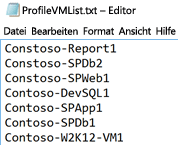

####Starten der Profilerstellung
Nachdem Sie die Liste mit den VMs für die Profilerstellung vorliegen haben, können Sie für das Tool den Modus für die Profilerstellung ausführen. Unten ist die Liste mit den obligatorischen und optionalen Parametern des Tools für die Ausführung im Modus für die Profilerstellung angegeben. Parameter in eckigen Klammern ([]) sind optional.

ASRDeploymentPlanner.exe -Operation StartProfiling /?

| Name des Parameters | Beschreibung |
|---|---|
| -Operation |      StartProfiling |
| -Server | Vollständig qualifizierter Domänenname oder IP-Adresse des vCenter-Servers/ESXi-Hosts, für dessen virtuelle Computer die Profilerstellung durchgeführt werden soll.|
| -User | Der Benutzername für die Herstellung der Verbindung mit dem vCenter-Server/ESXi-Host. Der Benutzer muss mindestens über Lesezugriff verfügen.|
| -VMListFile |    Die Datei mit der Liste der virtuellen Computer für die Profilerstellung. Der Dateipfad kann absolut oder relativ sein. Diese Datei sollte pro Zeile einen VM-Namen bzw. eine IP-Adresse enthalten. Der in der Datei angegebene Name des virtuellen Computers sollte mit dem VM-Namen auf dem vCenter-Server bzw. dem ESXi-Host identisch sein.   Beispiel: „VMList.txt“ enthält die folgenden virtuellen Computer: virtual_machine_A  10.150.29.110 virtual_machine_B |
| -NoOfDaysToProfile | Gibt an, wie lange die Profilerstellung durchgeführt werden soll (in Tagen). Es wird empfohlen, die Profilerstellung länger als 15 Tage durchzuführen. So kann sichergestellt werden, dass das Workloadmuster in Ihrer Umgebung im angegebenen Zeitraum eingehalten und verwendet wird, um eine genaue Empfehlung zu erhalten. |
| [-Directory] |    UNC- oder lokaler Verzeichnispfad zum Speichern von Daten, die während der Profilerstellung generiert wurden. Wenn keine Angabe vorhanden ist, wird das Verzeichnis mit dem Namen „ProfiledData“ unter dem aktuellen Pfad als Standardverzeichnis verwendet. |
| [-Password] | Das Kennwort für die Herstellung der Verbindung mit dem vCenter-Server/ESXi-Host. Wenn Sie es jetzt nicht angeben, werden Sie bei Ausführung des Befehls zur Eingabe aufgefordert.|
|  [-StorageAccountName]  | Der Name des Azure Storage-Kontos zur Ermittlung des Durchsatzes, der für die Replikation von Daten aus der lokalen Umgebung in Azure erreichbar ist. Mit dem Tool werden Testdaten in dieses Speicherkonto hochgeladen, um den Durchsatz zu berechnen.|
| [-StorageAccountKey] | Der Schlüssel des Azure Storage-Kontos, der zum Zugreifen auf das Speicherkonto verwendet wird. Navigieren Sie im Azure-Portal zu „Speicherkonten“ > [Name des Speicherkontos] > „Einstellungen“ > „Zugriffsschlüssel“ > „Key1“ (oder primärer Zugriffsschlüssel für das klassische Speicherkonto). |

Es wird empfohlen, die Profilerstellung für Ihre virtuellen Computer mindestens 15 bis 30 Tage lang durchzuführen. Während des Zeitraums der Profilerstellung wird „ASRDeploymentPlanner.exe“ weiter ausgeführt. Im Tool wird der Zeitraum für die Profilerstellung in Tagen eingegeben. Wenn Sie die Profilerstellung nur einige Stunden oder Minuten lang durchführen möchten, um das Tool zu testen, müssen Sie in der öffentlichen Vorschauversion den Zeitraum in den entsprechenden Tageswert umrechnen.  Wenn die Profilerstellung beispielsweise 30 Minuten dauern soll, muss die Eingabe 30/(60·24) = 0,021 Tage lauten.  Die kürzeste zulässige Dauer für die Profilerstellung beträgt 30 Minuten.

Während der Profilerstellung können Sie optional den Namen eines Azure Storage-Kontos und den dazugehörigen Schlüssel übergeben, um den Durchsatz zu ermitteln, der für Azure Site Recovery bei der Replikation vom Konfigurationsserver/Prozessserver zu Azure erreicht werden kann. Wenn der Name des Azure Storage-Kontos und der Schlüssel während der Profilerstellung nicht übergeben werden, wird der erreichbare Durchsatz vom Tool nicht berechnet.

Sie können für unterschiedliche Gruppen von virtuellen Computern mehrere Instanzen des Tools ausführen. Stellen Sie sicher, dass in den Gruppen für die Profilerstellung die Namen der virtuellen Computer nicht mehr als einmal vorkommen. Wenn Sie beispielsweise die Profile für zehn virtuelle Computer (VM1 bis VM10) erstellt haben und dies nach einigen Tagen für weitere fünf virtuelle Computer (VM11 bis VM15) durchführen möchten, können Sie das Tool über eine andere Befehlszeilenkonsole für die zweite Gruppe mit den virtuellen Computern (VM11 bis VM15) ausführen. Stellen Sie hierbei aber sicher, dass die zweite Gruppe von virtuellen Computern keine Namen der virtuellen Computer aus der ersten Profilerstellungsinstanz enthält, oder verwenden Sie für die zweite Ausführung ein anderes Ausgabeverzeichnis. Wenn zwei Instanzen des Tools für die Profilerstellung derselben virtuellen Computer verwendet werden und dabei dasselbe Ausgabeverzeichnis genutzt wird, ist der generierte Bericht fehlerhaft.

Die VM-Konfiguration wird zu Beginn des Profilerstellungsvorgangs einmal erfasst und in einer Datei mit dem Namen „VMDetailList.xml“ gespeichert. Diese Informationen werden während der Erstellung des Berichts verwendet. Alle Änderungen der VM-Konfiguration (z.B. erhöhte Anzahl von Kernen, Datenträgern, NICs usw.) ab dem Beginn der Profilerstellung bis zu ihrem Ende werden nicht erfasst. Falls sich eine VM-Konfiguration für einen beteiligten virtuellen Computer während der Profilerstellung geändert hat, können Sie in der öffentlichen Vorschauversion wie folgt vorgehen, um beim Erstellen des Berichts die aktuellen Details des virtuellen Computers zu erhalten:   

* Sichern Sie die Datei „VMdetailList.xml“, und löschen Sie die Datei an ihrem aktuellen Speicherort.
* Übergeben Sie die Argumente „-User“ und „-Password“ während der Berichterstellung.

Mit dem Befehl für die Profilerstellung werden im entsprechenden Verzeichnis mehrere Dateien generiert. Löschen Sie diese Dateien nicht, weil sich dies negativ auf die Berichterstellung auswirkt.

#####Beispiel 1: Profilerstellung für virtuelle Computer über einen Zeitraum von 30 Tagen und Ermittlung des Durchsatzes von der lokalen Umgebung zu Azure
ASRDeploymentPlanner.exe **-Operation** StartProfiling -Directory “E:\vCenter1_ProfiledData” **-Server** vCenter1.contoso.com **-VMListFile** “E:\vCenter1_ProfiledData\ProfileVMList1.txt”  **-NoOfDaysToProfile**  30  **-User** vCenterUser1 **-StorageAccountName**  asrspfarm1 **-StorageAccountKey** Eby8vdM02xNOcqFlqUwJPLlmEtlCDXJ1OUzFT50uSRZ6IFsuFq2UVErCz4I6tq/K1SZFPTOtr/KBHBeksoGMGw==

#####Beispiel 2: Profilerstellung für virtuelle Computer über einen Zeitraum von 15 Tagen
ASRDeploymentPlanner.exe **-Operation** StartProfiling **-Directory** “E:\vCenter1_ProfiledData” **-Server** vCenter1.contoso.com **-VMListFile** “E:\vCenter1_ProfiledData\ProfileVMList1.txt”  **-NoOfDaysToProfile**  15  -User vCenterUser1

#####Beispiel 3: Profilerstellung für virtuelle Computer über einen Zeitraum von einer Stunde zum schnellen Testen des Tools
ASRDeploymentPlanner.exe **-Operation** StartProfiling **-Directory** “E:\vCenter1_ProfiledData” **-Server** vCenter1.contoso.com **-VMListFile** “E:\vCenter1_ProfiledData\ProfileVMList1.txt”  **-NoOfDaysToProfile**  0.04  **-User** vCenterUser1

>[!NOTE]
>
> * Wenn der Server, auf dem das Tool ausgeführt wird, neu gestartet wird oder abstürzt oder wenn Sie das Tool mit STRG+C beenden, werden die Daten der Profilerstellung beibehalten. Es kann aber sein, dass in diesem Fall die letzten 15 Minuten der Daten für die Profilerstellung fehlen. Sie müssen das Tool im Profilerstellungsmodus erneut ausführen, nachdem der Server wieder gestartet wurde.
>
> * Wenn der Name des Azure Storage-Kontos und der dazugehörige Schlüssel übergeben werden, misst das Tool den Durchsatz im letzten Schritt der Profilerstellung. Falls das Tool vor dem korrekten Abschluss der Profilerstellung beendet wird, wird der Durchsatz nicht berechnet. Sie können den GetThroughput-Vorgang immer über die Befehlszeilenkonsole ausführen, um den Durchsatz vor der Berichterstellung zu ermitteln. Andernfalls enthält der erstellte Bericht keine Informationen zum erreichten Durchsatz.
>

##Erstellen des Berichts
Das Tool generiert eine XLSM-Datei (makrofähige Microsoft Excel-Datei) als Berichtsausgabe, in der alle Bereitstellungsempfehlungen zusammengefasst sind. Der Bericht hat den Namen „DeploymentPlannerReport_<Unique Numeric Identifier>.xlsm“ und wird im angegebenen Verzeichnis abgelegt.

Nach Abschluss der Profilerstellung können Sie das Tool im Berichterstellungsmodus ausführen. Unten ist die Liste mit den obligatorischen und optionalen Parametern des Tools für die Ausführung im Modus für die Berichterstellung angegeben. Parameter in eckigen Klammern ([]) sind optional.

ASRDeploymentPlanner.exe -Operation GenerateReport /?

|Name des Parameters | Beschreibung |
|-|-|
| -Operation | GenerateReport |
| -Server |  Vollqualifizierter Name oder IP-Adresse (derselbe Name bzw. dieselbe IP-Adresse wie bei der Profilerstellung) des vCenter-/vSphere-Servers, auf dem sich die virtuellen Computer für die Profilerstellung befinden, für die der Bericht erstellt werden soll. Beachten Sie Folgendes: Wenn Sie bei der Profilerstellung einen vCenter-Server verwendet haben, können Sie keinen vSphere-Server für die Berichterstellung verwenden (und umgekehrt).|
| -VMListFile | Die Datei mit der Liste der Computer, für die die Profilerstellung durchgeführt wurde und der Bericht erstellt werden soll. Der Dateipfad kann absolut oder relativ sein. Diese Datei sollte pro Zeile einen VM-Namen bzw. eine IP-Adresse enthalten. Die Namen der virtuellen Computer, die in der Datei angegeben sind, sollten den Namen der virtuellen Computer auf dem vCenter-Server bzw. dem ESXi-Host entsprechen und mit den bei der Profilerstellung verwendeten Daten übereinstimmen.|
| [-Directory] | UNC- oder lokaler Verzeichnispfad des Speicherorts, an dem die Daten der Profilerstellung (während der Profilerstellung generiert) gespeichert werden. Diese Daten werden für die Erstellung des Berichts benötigt. Wenn keine Angabe vorhanden ist, wird das Verzeichnis „ProfiledData“ verwendet. |
| [-GoalToCompleteIR] |    Anzahl von Stunden, in denen die erste Replikation der virtuellen Computer für die Profilerstellung abgeschlossen werden muss. Im erstellten Bericht ist die Anzahl der virtuellen Computer angegeben, für die die erste Replikation im angegebenen Zeitraum abgeschlossen werden kann. Die Standardeinstellung beträgt 72 Stunden. |
| [-User] | Der Benutzername für die Herstellung der Verbindung mit dem vCenter-/vSphere-Server. Er dient zum Abrufen der aktuellen Konfigurationsinformationen der virtuellen Computer, z.B. Anzahl von Datenträgern, Anzahl von Kernen, Anzahl von NICs usw., für die Verwendung im Bericht. Wenn Sie den Namen nicht angeben, werden die Konfigurationsinformationen verwendet, die zu Beginn des Profilerstellungsvorgangs gesammelt werden. |
| [-Password] | Das Kennwort für die Herstellung der Verbindung mit dem vCenter-Server/ESXi-Host. Wenn es nicht als Parameter angegeben ist, werden Sie später bei der Ausführung des Befehls zum Eingeben aufgefordert. |
| [-DesiredRPO] | Gewünschter RPO-Wert (Recovery Point Objective) in Minuten. Die Standardeinstellung ist 15 Minuten.|
| [-Bandwidth] | Bandbreite in MBit/s. Wird zum Berechnen des RPO-Werts verwendet, der für die angegebene Bandbreite erzielt werden kann. |
| [-StartDate]  | Startdatum und -uhrzeit im Format MM-TT-JJJJ:HH:MM (24-Stunden-Format). „StartDate“ muss zusammen mit „EndDate“ angegeben werden. Wenn diese Angaben vorhanden sind, wird der Bericht für die Profilerstellungsdaten erstellt, die zwischen StartDate und EndDate erfasst wurden. |
| [-EndDate] | Enddatum und -uhrzeit im Format MM-TT-JJJJ:HH:MM (24-Stunden-Format). „EndDate“ muss zusammen mit „StartDate“ angegeben werden. Wenn diese Angaben vorhanden sind, wird der Bericht für die Profilerstellungsdaten erstellt, die zwischen StartDate und EndDate erfasst wurden. |
| [-GrowthFactor] |Der Zuwachsfaktor in Prozent. Die Standardeinstellung ist „30%“.  |

##### Beispiel 1: Berichterstellung mit Standardwerten, wenn sich die Profilerstellungsdaten auf dem lokalen Laufwerk befinden
ASRDeploymentPlanner.exe **-Operation** GenerateReport **-Server** vCenter1.contoso.com **-Directory** “E:\vCenter1_ProfiledData” **-VMListFile** “E:\vCenter1_ProfiledData\ProfileVMList1.txt”

##### Beispiel 2: Berichterstellung, wenn sich die Profilerstellungsdaten auf einem Remoteserver befinden. Der Benutzer sollte über Lese-/Schreibzugriff für das Remoteverzeichnis verfügen.
ASRDeploymentPlanner.exe **-Operation** GenerateReport **-Server** vCenter1.contoso.com **-Directory** “\\PS1-W2K12R2\vCenter1_ProfiledData” **-VMListFile** “\\PS1-W2K12R2\vCenter1_ProfiledData\ProfileVMList1.txt”

##### Beispiel 3: Berichterstellung mit spezifischer Bandbreite und der Vorgabe, die erste Replikation innerhalb der angegebenen Zeit abzuschließen
ASRDeploymentPlanner.exe **-Operation** GenerateReport **-Server** vCenter1.contoso.com **-Directory** “E:\vCenter1_ProfiledData” **-VMListFile** “E:\vCenter1_ProfiledData\ProfileVMList1.txt” **-Bandwidth** 100 **-GoalToCompleteIR** 24

##### Beispiel 4: Berichterstellung mit einem Zuwachsfaktor von 5% anstelle der Standardeinstellung von 30%
ASRDeploymentPlanner.exe **-Operation** GenerateReport **-Server** vCenter1.contoso.com **-Directory** “E:\vCenter1_ProfiledData” **-VMListFile** “E:\vCenter1_ProfiledData\ProfileVMList1.txt” **-GrowthFactor** 5

##### Beispiel 5: Berichterstellung mit einer Teilmenge der Profilerstellungsdaten. Angenommen, Sie verfügen über Profilerstellungsdaten für 30 Tage und möchten den Bericht nur für 20 Tage erstellen.
ASRDeploymentPlanner.exe **-Operation** GenerateReport **-Server** vCenter1.contoso.com **-Directory** “E:\vCenter1_ProfiledData” **-VMListFile** “E:\vCenter1_ProfiledData\ProfileVMList1.txt” **-StartDate**  01-10-2017:12:30 -**EndDate** 01-19-2017:12:30

##### Beispiel 6: Berichterstellung für RPO von 5 Minuten
ASRDeploymentPlanner.exe **-Operation** GenerateReport **-Server** vCenter1.contoso.com **-Directory** “E:\vCenter1_ProfiledData” **-VMListFile** “E:\vCenter1_ProfiledData\ProfileVMList1.txt”  **-DesiredRPO** 5

### Für die Berechnung verwendeter Perzentilwert
**Welcher Perzentilstandardwert der Leistungsmetriken, die während der Profilerstellung gesammelt wurden, wird bei der Berichterstellung verwendet?**

Für das Tool werden standardmäßig die Werte des 95. Perzentils für Lesen/Schreiben-IOPS, Schreiben-IOPS und die Datenänderung verwendet, die während der Profilerstellung aller VMs gesammelt wurden. So wird sichergestellt, dass Spitzen des 100. Perzentils Ihrer VMs, die aufgrund von temporären Ereignissen auftreten – z.B. ein einmal pro Tag ausgeführter Sicherungsauftrag, eine regelmäßige Aktivität zur Datenbankindizierung oder die Erstellung eines Analyseberichts oder ein beliebiges ähnliches Ereignis mit kurzer Lebensdauer während des Profilerstellungszeitraums –, nicht für die Ermittlung Ihrer Ziel- und Quellanforderungen in Bezug auf Azure Storage und die Bandbreite herangezogen werden. Bei Verwendung der Werte des 95. Perzentils erhalten Sie ein genaues Bild der echten Workloadmerkmale und erzielen die beste Leistung, wenn diese Workloads in Microsoft Azure ausgeführt werden. Es ist eher unwahrscheinlich, dass Sie diese Angabe häufig ändern. Wenn Sie aber einen noch niedrigeren Wert wählen, z.B. das 90. Perzentil, können Sie die Konfigurationsdatei „ASRDeploymentPlanner.exe.config“ im Standardordner aktualisieren und speichern, um für die vorhandenen Profilerstellungsdaten einen neuen Bericht zu erstellen.

        &lsaquo;add key="WriteIOPSPercentile" value="95" /&rsaquo;>      
        &lsaquo;add key="ReadWriteIOPSPercentile" value="95" /&rsaquo;>      
        &lsaquo;add key="DataChurnPercentile" value="95" /&rsaquo;

### Zuwachsfaktor
**Warum sollte beim Planen der Bereitstellung der Zuwachsfaktor berücksichtigt werden?**

Es ist wichtig, dass Sie in Bezug auf Ihre Workloadmerkmale den Zuwachs und eine potenzielle vermehrte Nutzung im Laufe der Zeit berücksichtigen. Der Grund ist, dass es bei einer Änderung der Workloadmerkmale nach dem Aufbau des Schutzes derzeit keine Möglichkeit gibt, für den Schutz zu einem anderen Azure Storage-Konto zu wechseln, ohne den Schutz zu deaktivieren und dann wieder zu aktivieren. Beispiel: Sie müssen den Schutz für ein Storage Premium-Konto im folgenden Fall deaktivieren und dann wieder aktivieren: Wenn ein virtueller Computer heute von einem Standard-Speicherkonto für die Replikation abgedeckt wird und sich nach drei Monaten aufgrund einer höheren Zahl von Benutzern der Anwendung, die auf dem virtuellen Computer ausgeführt wird, die Änderungsrate auf der VM erhöht und ein Wechsel zu Storage Premium erforderlich ist, damit die neue höhere Änderungsrate von der Azure Site Recovery-Replikation verarbeitet werden kann. Es wird also dringend empfohlen, beim Planen der Bereitstellung den Zuwachs zu berücksichtigen. Die Standardeinstellung ist „30%“. Sie kennen das Nutzungsmuster Ihrer Anwendungen und den projizierten Zuwachs am besten und können diese Angabe beim Erstellen des Berichts entsprechend ändern. Sie haben die Möglichkeit, mehrere Berichte mit unterschiedlichen Zuwachsfaktoren für dieselben Profilerstellungsdaten zu erstellen, um zu ermitteln, welche Empfehlungen für die Azure Storage-Zielbandbreite und die Quellbandbreite für Sie am besten geeignet sind.

Der erstellte Microsoft Excel-Bericht enthält die folgenden Teile:

* [Input](site-recovery-deployment-planner.md#input) (Eingabe)
* [Recommendations](site-recovery-deployment-planner.md#recommendations-with-desired-rpo-as-input) (Empfehlungen)
* [Recommendations-Bandwidth Input](site-recovery-deployment-planner.md#recommendations-with-available-bandwidth-as-input) (Empfehlungen – Bandbreiteneingabe)
* [VM<->Storage Placement](site-recovery-deployment-planner.md#vm-storage-placement) (VM/Speicher-Anordnung)
* [Compatible VMs](site-recovery-deployment-planner.md#compatible-vms) (Kompatible VMs)
* [Incompatible VMs](site-recovery-deployment-planner.md#incompatible-vms) (Inkompatible VMs)

##Durchsatzberechnung
Führen Sie das Tool im GetThroughput-Modus aus, um den Durchsatz zu schätzen, der von Azure Site Recovery während der Replikation von der lokalen Umgebung zu Azure erreicht werden kann. Mit dem Tool wird der Durchsatz von dem Server berechnet, auf dem das Tool ausgeführt wird (idealerweise basiert der Server auf dem Leitfaden zur Größe des Konfigurationsservers).  Führen Sie das Tool auf dem Konfigurationsserver aus, falls Sie Azure Site Recovery-Infrastrukturkomponenten bereits lokal bereitgestellt haben.

Öffnen Sie eine Befehlszeilenkonsole, und wechseln Sie in den Ordner mit dem Tool für die ASR-Bereitstellungsplanung.  Führen Sie die Datei „ASRDeploymentPlanner.exe“ mit den unten angegebenen Parametern aus. Parameter in eckigen Klammern ([]) sind optional.

ASRDeploymentPlanner.exe -Operation GetThroughput /?

|Name des Parameters | Beschreibung |
|-|-|
| -operation | GetThroughput |
| [-Directory] | UNC- oder lokaler Verzeichnispfad des Speicherorts, an dem die Daten der Profilerstellung (während der Profilerstellung generiert) gespeichert werden. Diese Daten werden für die Erstellung des Berichts benötigt. Wenn keine Angabe vorhanden ist, wird das Verzeichnis „ProfiledData“ verwendet.  |
| -StorageAccountName | Der Name des Azure Storage-Kontos zur Ermittlung der Bandbreite, die für die Replikation von Daten aus der lokalen Umgebung in Azure verbraucht wird. Mit dem Tool werden Testdaten in dieses Speicherkonto hochgeladen, um die verbrauchte Bandbreite zu ermitteln. |
| -StorageAccountKey | Der Schlüssel des Azure Storage-Kontos, der zum Zugreifen auf das Speicherkonto verwendet wird. Navigieren Sie im Azure-Portal zu „Speicherkonten“ > [Name des Speicherkontos] > „Einstellungen“ > „Zugriffsschlüssel“ > „Key1“ (oder primärer Zugriffsschlüssel für das klassische Speicherkonto). |
| -VMListFile | Die Datei mit der Liste der virtuellen Computer, für die Profile erstellt werden sollen, um die verbrauchte Bandbreite zu berechnen. Der Dateipfad kann absolut oder relativ sein. Diese Datei sollte pro Zeile einen VM-Namen bzw. eine IP-Adresse enthalten. Die in der Datei angegebenen Namen der virtuellen Computer sollten den Namen der virtuellen Computer auf dem vCenter-Server oder ESXi-Host entsprechen. Beispiel: Die Datei „VMList.txt“ enthält die folgenden virtuellen Computer: virtual machine_A  10.150.29.110 virtual machine_B|

Mit dem Tool werden im angegebenen Verzeichnis mehrere Dateien vom Typ „asrvhdfile<#>.vhd“ (wobei # für eine Zahl steht) mit 64 MB erstellt.  Diese Dateien werden in das Azure Storage-Konto hochgeladen, um den Durchsatz zu ermitteln. Nach dem Messen des Durchsatzes werden diese Dateien aus dem Azure Storage-Konto und vom lokalen Server gelöscht. Wenn das Tool beim Berechnen des Durchsatzes aus irgendeinem Grund beendet wird, werden die Dateien nicht aus Azure Storage oder vom lokalen Server gelöscht, und Sie müssen diesen Schritt manuell durchführen.

Der Durchsatz wird zu einem bestimmten Zeitpunkt gemessen, und es handelt sich um den maximalen Durchsatz, der von Azure Site Recovery während der Replikation erreicht werden kann, wenn alle anderen Faktoren gleich bleiben. Falls eine Anwendung beispielsweise in demselben Netzwerk auf einmal mehr Bandbreite verbraucht, variiert der tatsächliche Durchsatz während der Replikation. Wenn Sie den GetThroughput-Befehl über einen Konfigurationsserver ausführen, hat das Tool keinerlei Informationen zu geschützten virtuellen Computern und zur laufenden Replikation. Das Ergebnis der Durchsatzmessung unterscheidet in Abhängigkeit davon, ob der GetThroughput-Vorgang für geschützte virtuelle Computer mit einer hohen Datenänderungsrate oder einer niedrigen Datenänderungsrate durchgeführt wird.  Es wird empfohlen, das Tool zu verschiedenen Zeitpunkten der Profilerstellung auszuführen, um besser zu verstehen, welcher Durchsatz jeweils erzielt werden kann. Im Bericht wird vom Tool der zuletzt gemessene Durchsatz angezeigt.

##### Beispiel
ASRDeploymentPlanner.exe **-Operation** GetThroughput **-Directory**  E:\vCenter1_ProfiledData **-VMListFile** E:\vCenter1_ProfiledData\ProfileVMList1.txt  **-StorageAccountName**  asrspfarm1 **-StorageAccountKey** by8vdM02xNOcqFlqUwJPLlmEtlCDXJ1OUzFT50uSRZ6IFsuFq2UVErCz4I6tq/K1SZFPTOtr/KBHBeksoGMGw==

>[!NOTE]
>
> * Führen Sie das Tool auf einem Server aus, der über die gleichen Speicher- und CPU-Merkmale wie der Konfigurationsserver verfügt.
>
> * Stellen Sie für die Replikation die empfohlene Bandbreite bereit, um den RPO-Wert in 100% der Fälle zu erreichen. Auch nach der Bereitstellung der passenden Bandbreite sollten Sie Folgendes überprüfen, wenn vom Tool kein Anstieg des erzielten Durchsatzes gemeldet wird:
>
> a. Überprüfen Sie, ob der Azure Site Recovery-Durchsatz durch die Dienstqualität (Quality of Service, QoS) des Netzwerks eingeschränkt wird.
>
> b. Überprüfen Sie, ob sich Ihr Azure Site Recovery-Tresor in der nächstgelegenen physisch unterstützten Microsoft Azure-Region befindet, um die Netzwerkwartezeit zu verringern.
>
> c. Überprüfen Sie die Merkmale Ihres lokalen Speichers, und erwägen Sie eine Verbesserung in Bezug auf die Hardware (z.B. Wechseln von HDD zu SSD usw.).
>
> d. Ändern Sie die Azure Site Recovery-Einstellungen auf dem Prozessserver, um [die für die Replikation verwendete Menge an Netzwerkbandbreite zu erhöhen](./site-recovery-plan-capacity-vmware.md#control-network-bandwidth).
>

##Empfehlungen mit gewünschtem RPO-Wert als Eingabe

###Profilerstellungsdaten

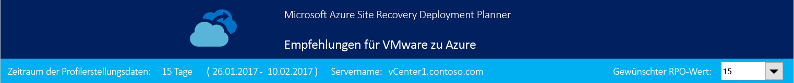

**Profiled data period** (Zeitraum der Profilerstellungsdaten) ist die Dauer der Profilerstellung. Standardmäßig verwendet das Tool alle Profilerstellungsdaten für die Berechnung, sofern der Bericht nicht nur für einen bestimmten Zeitraum erstellt wird, indem bei der Berichterstellung die Optionen „StartDate“ und „EndDate“ genutzt werden.

**Server Name** (Servername) ist der Name oder die IP-Adresse des VMware vCenter- oder ESXi-Hosts, für dessen virtuelle Computer der Bericht erstellt wird.

**Desired RPO** (Gewünschter RPO-Wert) ist das RPO-Ziel (Recovery Point Objective) für Ihre Bereitstellung. Standardmäßig wird die erforderliche Netzwerkbandbreite für RPO-Werte von 15, 30 und 60 Minuten berechnet. Basierend auf der Auswahl werden die betroffenen Werte auf dem Blatt aktualisiert. Wenn Sie beim Erstellen des Berichts den Parameter „DesiredRPOinMin“ verwendet haben, wird dieser Wert in der Dropdownliste der Option „Desired RPO“ (Gewünschter RPO-Wert) angezeigt.

###Übersicht über die Profilerstellung

**Total Profiled Virtual Machines** (Gesamte VMs für Profilerstellung) ist die Gesamtzahl der virtuellen Computer, für die Profilerstellungsdaten verfügbar sind. Wenn VMListFile Namen von virtuellen Computern enthält, für die keine Profilerstellung durchgeführt wurde, werden diese virtuellen Computer bei der Berichterstellung nicht berücksichtigt und aus der Anzahl von gesamten VMs für die Profilerstellung ausgeschlossen.

**Compatible Virtual Machines** (Kompatible VMs) enthält die Anzahl von virtuellen Computern, die per Azure Site Recovery in Azure geschützt werden können. Dies ist die Gesamtzahl von kompatiblen virtuellen Computern, für die die erforderliche Netzwerkbandbreite, die Anzahl von Azure Storage-Konten, die Anzahl von Microsoft Azure-Kernen und die Anzahl von Konfigurationsservern und zusätzlichen Prozessservern berechnet werden. Die Details jedes kompatiblen virtuellen Computers sind auf dem Blatt „Compatible VMs“ (Kompatible VMs) des Berichts verfügbar.

**Incompatible Virtual Machines** (Inkompatible VMs) gibt die Anzahl von virtuellen Computern für die Profilerstellung an, die für den Schutz mit Azure Site Recovery inkompatibel sind. Die Gründe für die Inkompatibilität sind unten im Abschnitt „Inkompatible VMs“ beschrieben. Wenn VMListFile Namen von virtuellen Computern enthält, für die keine Profilerstellung durchgeführt wurde, werden diese virtuellen Computer aus der Anzahl von inkompatiblen VMs ausgeschlossen. Diese virtuellen Computer werden unten auf dem Blatt „Incompatible VMs“ (Inkompatible VMs) unter „Data not found“ (Daten nicht gefunden) aufgeführt.

**Desired RPO** (Gewünschter RPO-Wert) ist der gewünschte RPO-Wert in Minuten. Der Bericht wird für drei RPO-Werte erstellt: 15, 30 und 60 Minuten, wobei 15 Minuten die Standardeinstellung ist. Die Bandbreitenempfehlung im Bericht wird basierend auf Ihrer Auswahl in der Dropdownliste „Desired RPO“ (Gewünschter RPO-Wert) oben rechts auf dem Blatt geändert. Wenn Sie den Bericht mit dem Parameter „-DesiredRPO“ und einem benutzerdefinierten Wert erstellt haben, wird dieser benutzerdefinierte Wert in der Dropdownliste „Desired RPO“ (Gewünschter RPO-Wert) als Standardwert angezeigt.

###Erforderliche Netzwerkbandbreite (MBit/s)

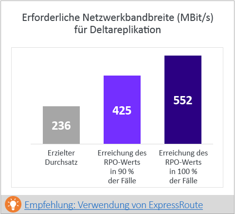

**To meet RPO 100% of the time** (Erreichung des RPO-Werts in 100% der Fälle): Dies ist die empfohlene Bandbreite in MBit/s, die zugeordnet werden sollte, um den gewünschten RPO-Wert in 100% der Fälle zu erzielen. Diese Menge an Bandbreite muss dediziert für die Deltareplikation im stabilen Zustand für alle kompatiblen virtuellen Computer bereitgestellt werden, um RPO-Verstöße zu vermeiden.

**To meet RPO 90% of the time** (Erreichung des RPO-Werts in 90% der Fälle): Wenn Sie aufgrund der Breitbandpreise oder aus einem anderen Grund nicht die Bandbreite bereitstellen können, die zur Erreichung des gewünschten RPO-Werts in 100% der Fälle erforderlich ist, können Sie auch eine geringere Menge an Bandbreite bereitstellen, mit der der gewünschte RPO-Wert in 90% der Fälle erreicht wird. Zum besseren Verständnis der Auswirkungen, die mit der Bereitstellung dieser geringeren Bandbreite verbunden sind, enthält der Bericht eine Was-wäre-wenn-Analyse zu Anzahl und Dauer der zu erwartenden RPO-Verstöße.

**Achieved Throughput** (Erzielter Durchsatz): Dies ist der Durchsatz von dem Server, auf dem Sie den GetThroughput-Befehl ausgeführt haben, zu der Microsoft Azure-Region, in der sich das Azure Storage-Konto befindet. Hier wird der geschätzte Durchsatz angegeben, der erreicht werden kann, wenn Sie die kompatiblen virtuellen Computer mit Azure Site Recovery schützen. Voraussetzung hierfür ist, dass die Speicher- und Netzwerkmerkmale Ihres Konfigurations- bzw. Prozessservers weiterhin mit den Merkmalen des Servers übereinstimmen, auf dem Sie das Tool ausgeführt haben.    

Für die Replikation sollten Sie die Bandbreite bereitstellen, die empfohlen wird, um den RPO-Wert in 100% der Fälle zu erreichen. Auch nach der Bereitstellung der passenden Bandbreite sollten Sie Folgendes überprüfen, wenn vom Tool kein Anstieg des erzielten Durchsatzes gemeldet wird:

a.    Überprüfen Sie, ob der Azure Site Recovery-Durchsatz durch die Dienstqualität (Quality of Service, QoS) des Netzwerks eingeschränkt wird.

b.    Überprüfen Sie, ob sich Ihr Azure Site Recovery-Tresor in der nächstgelegenen physisch unterstützten Microsoft Azure-Region befindet, um die Netzwerkwartezeit zu verringern.

c.    Überprüfen Sie die Merkmale Ihres lokalen Speichers, und erwägen Sie eine Verbesserung in Bezug auf die Hardware (z.B. Wechseln von HDD zu SSD usw.).

d. Ändern Sie die Azure Site Recovery-Einstellungen auf dem Prozessserver, um [die für die Replikation verwendete Menge an Netzwerkbandbreite zu erhöhen](./site-recovery-plan-capacity-vmware.md#control-network-bandwidth).

Falls Sie das Tool auf einem Konfigurations- bzw. Prozessserver ausführen, der bereits über geschützte virtuelle Computer verfügt, sollten Sie das Tool einige Male ausführen. Der erzielte Durchsatz ändert sich nämlich je nach Menge der Datenänderung, die zum jeweiligen Zeitpunkt gerade verarbeitet wird.

Für alle Azure Site Recovery-Bereitstellungen für Unternehmen wird die Verwendung von [ExpressRoute](https://aka.ms/expressroute) empfohlen.

###Erforderliche Azure Storage-Konten
In diesem Diagramm wird die Gesamtzahl von Azure Storage-Konten (Standard und Premium) angegeben, die zum Schützen aller kompatiblen virtuellen Computer erforderlich sind.  Klicken Sie auf [Recommended VM placement plan](site-recovery-deployment-planner.md#vm-storage-placement) (Empfohlener Plan für VM-Anordnung), um zu ermitteln, welches Speicherkonto für die einzelnen virtuellen Computer verwendet werden soll.  

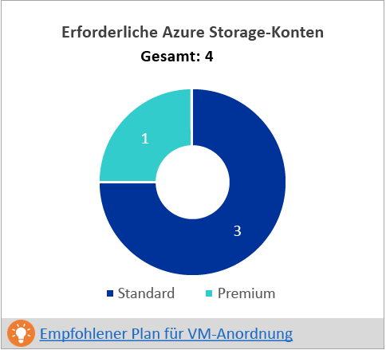

###Erforderliche Anzahl von Azure-Kernen
Dies ist die Gesamtzahl von Kernen, die bereitgestellt werden sollten, bevor ein Failover oder Testfailover für alle kompatiblen virtuellen Computer durchgeführt wird. Wenn im Abonnement nicht genügend Kerne verfügbar sind, können von Azure Site Recovery beim Testfailover bzw. Failover keine virtuellen Computer erstellt werden.

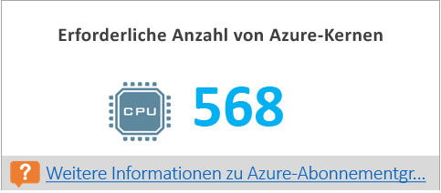

###Erforderliche lokale Infrastruktur
Dies ist die Gesamtzahl von Konfigurationsservern und zusätzlichen Prozessservern, die konfiguriert werden müssen, um alle kompatiblen virtuellen Computer zu schützen. Basierend auf den unterstützten [Grenzwerten](https://aka.ms/asr-v2a-on-prem-components) der größten Konfiguration werden vom Tool weitere Server empfohlen – entweder anhand der Änderungsrate pro Tag oder anhand der maximalen Anzahl von geschützten virtuellen Computern (bei durchschnittlich drei Datenträgern pro virtuellem Computer), je nachdem, was auf dem Konfigurationsserver oder zusätzlichen Prozessserver zuerst erreicht wird. Die Details der Gesamtänderungsrate pro Tag und die Gesamtzahl von geschützten Datenträgern sind auf dem Blatt [Input](site-recovery-deployment-planner.md#input) (Eingabe) angegeben.

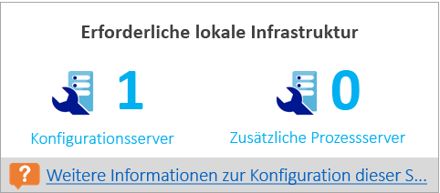

###Was-wäre-wenn-Analyse
Bei dieser Analyse wird angegeben, wie viele Verstöße während des Zeitraums der Profilerstellung auftreten können, wenn Sie eine geringere Bandbreite bereitstellen, um den gewünschten RPO-Wert nur in 90% der Fälle zu erreichen. An einem Tag können eine oder mehrere RPO-Verstöße auftreten. Mit dem Graphen wird der RPO-Spitzenwert für den Tag angegeben.
Anhand dieser Analyse können Sie entscheiden, ob die Anzahl von RPO-Verstößen über alle Tage hinweg und die RPO-Spitzenwerte pro Tag für die angegebene geringere Bandbreite akzeptabel sind. Wenn ja, können Sie die geringere Bandbreite für die Replikation zuordnen. Ordnen Sie ansonsten die höhere Bandbreite gemäß dem Vorschlag zu, um den gewünschten RPO-Wert in 100% der Fälle zu erreichen.

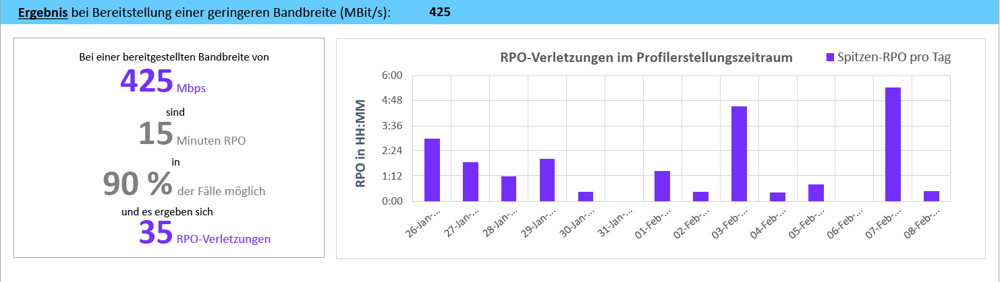

###Empfohlene VM-Batchgröße für die erste Replikation
In diesem Abschnitt wird die Anzahl von virtuellen Computern empfohlen, die parallel geschützt werden können, um die erste Replikation innerhalb von 72 Stunden (konfigurierbarer Wert, der während der Berichterstellung mit dem Parameter GoalToCompleteIR geändert werden kann) mit der vorgeschlagenen bereitgestellten Bandbreite durchzuführen, um den gewünschten RPO-Wert in 100% der Fälle zu erreichen.  Der Graph zeigt einen Bereich mit Bandbreitenwerten und die berechnete VM-Batchgrößenanzahl, um die erste Replikation innerhalb von 72 Stunden durchzuführen – basierend auf der ermittelten durchschnittlichen VM-Größe über alle kompatiblen virtuellen Computer hinweg.  

In der öffentlichen Vorschauversion wird im Bericht nicht angegeben, welche virtuellen Computer in einem Batch enthalten sein sollten. Sie können die auf dem Blatt „Compatible VMs“ (Kompatible VMs) angezeigte Datenträgergröße verwenden, um die Größe für die einzelnen virtuellen Computer zu ermitteln, und Ihre virtuellen Computer für einen Batch oder basierend auf bekannten Workloadmerkmalen auswählen.  Die Dauer der ersten Replikation ändert sich anhand der tatsächlichen VM-Datenträgergröße, des verwendeten Datenträgerspeichers und des verfügbaren Netzwerkdurchsatzes.

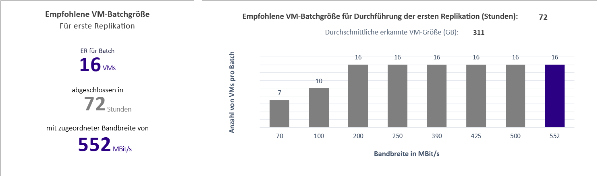

###Verwendeter Zuwachsfaktor und Perzentilwerte
In diesem Abschnitt werden unten auf dem Blatt der verwendete Perzentilwert für alle Leistungsindikatoren der virtuellen Computer für die Profilerstellung (Standardeinstellung: 95. Perzentil) und der für alle Berechnungen verwendete Zuwachsfaktor in Prozent (Standardeinstellung: 30%) angezeigt.

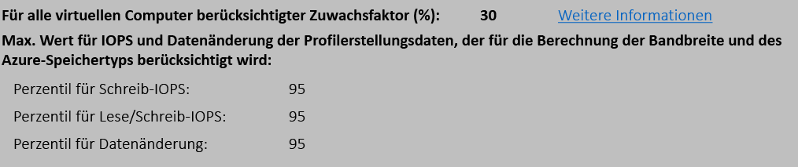

##Empfehlungen mit verfügbarer Bandbreite als Eingabe

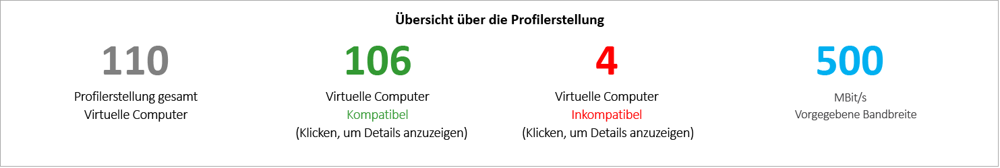

Stellen Sie sich eine Situation vor, in der Sie wissen, dass Sie nicht mehr als x MBit/s an Bandbreite für die Azure Site Recovery-Replikation bereitstellen können. Das Tool ermöglicht Ihnen das Eingeben der verfügbaren Bandbreite (mit Verwendung des Parameters „-Bandwidth“ während der Berichterstellung) und das Ermitteln des erreichbaren RPO-Werts in Minuten. Anhand dieser Angabe zum erreichbaren RPO-Wert können Sie entscheiden, ob Sie zusätzliche Bandbreite bereitstellen müssen oder ob eine Lösung für die Notfallwiederherstellung mit diesem RPO-Wert für Sie ausreicht.

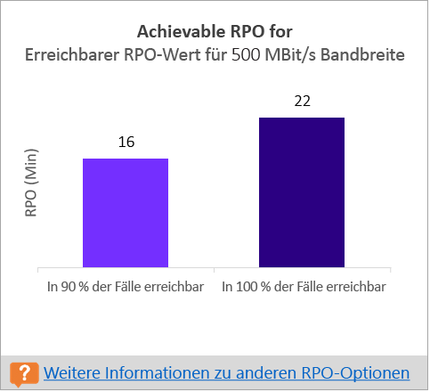

##Eingabe
Die Seite „Input“ (Eingabe) enthält eine Übersicht über die VMware-Umgebung für die Profilerstellung.

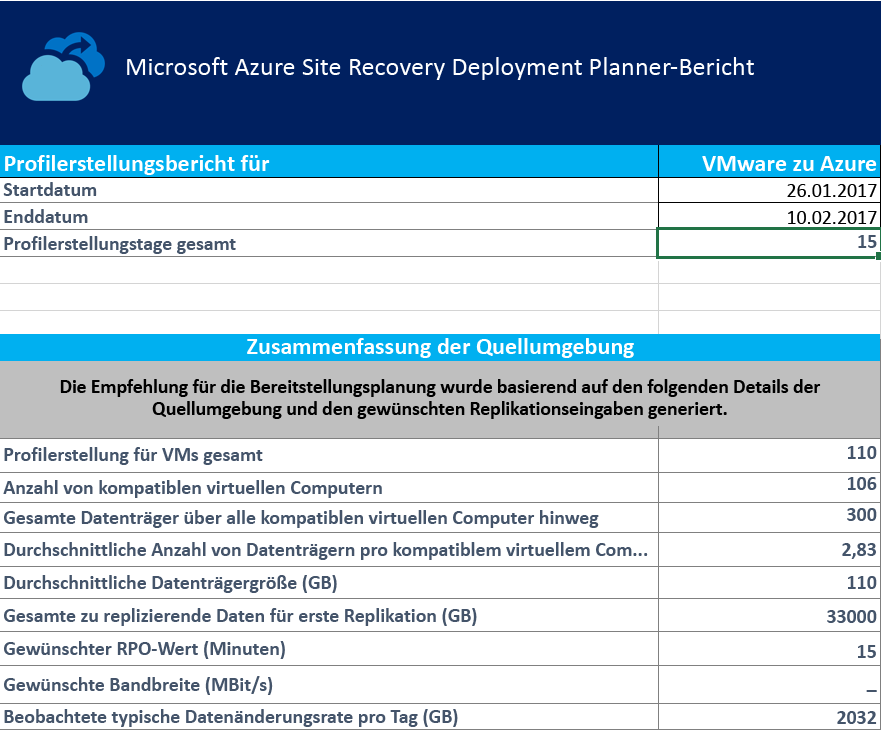

Unter **„Start Date“ (Startdatum) und „End Date“ (Enddatum)** ist das Start- und Enddatum der Profilerstellungsdaten angegeben, die bei der Berichterstellung berücksichtigt werden. Das Startdatum ist standardmäßig das Datum, an dem die Profilerstellung begonnen hat, und das Enddatum ist das Datum, an dem die Profilerstellung beendet wurde.  Dies können die Werte von „StartDate“ und „EndDate“ sein, wenn der Bericht mit diesen Parametern erstellt wird. „Start Date“ (Startdatum) und „End Date“ (Enddatum): Dies ist das Start- und Enddatum der Profilerstellungsdaten, die bei der Berichterstellung berücksichtigt werden. Das Startdatum ist standardmäßig das Datum, an dem die Profilerstellung begonnen hat, und das Enddatum ist das Datum, an dem die Profilerstellung beendet wurde.  Dies können die Werte von „StartDate“ und „EndDate“ sein, wenn der Bericht mit diesen Parametern erstellt wird.

**Total number of profiling days** (Gesamtzahl von Profilerstellungstagen) ist die gesamte Anzahl von Tagen der Profilerstellung zwischen dem Start- und Enddatum, für die der Bericht erstellt wird. „Total number of profiling days“ (Gesamtzahl von Profilerstellungstagen) ist die gesamte Anzahl von Tagen der Profilerstellung zwischen dem Start- und Enddatum, für die der Bericht erstellt wird.

**Number of compatible virtual machines** (Anzahl von kompatiblen virtuellen Computern) ist die Gesamtzahl von kompatiblen virtuellen Computern, für die die erforderliche Netzwerkbandbreite, die erforderliche Anzahl von Azure Storage-Konten, Microsoft Azure-Kerne, Konfigurationsserver und zusätzliche Prozessserver berechnet werden.
Eine weitere Angabe ist „Total number of disks across all compatible virtual machines“ (Gesamtzahl von Datenträgern über alle kompatiblen virtuellen Computer hinweg). Diese Anzahl wird als eine der Eingaben genutzt, um eine Entscheidung über die Anzahl von Konfigurationsservern und zusätzlichen Prozessservern zu treffen, die in der Bereitstellung verwendet werden sollen.

**Average number of disks per compatible virtual machine** (Durchschnittliche Anzahl von Datenträgern pro kompatiblem virtuellem Computer) ist die durchschnittliche Anzahl von Datenträgern, die über alle kompatiblen virtuellen Computer hinweg berechnet wird.

**Average disk size (GB)** (Durchschnittliche Datenträgergröße (GB)) ist die durchschnittliche Datenträgergröße, die über alle kompatiblen virtuellen Computer hinweg berechnet wird.

**Desired RPO (minutes)** (Gewünschter RPO-Wert (Minuten)) ist entweder der RPO-Standardwert oder der Wert, der für den Parameter „DesiredRPO“ zum Zeitpunkt der Berichterstellung übergeben wird, um die erforderliche Bandbreite zu schätzen.

**Desired bandwidth (Mbps)** (Gewünschte Bandbreite (MBit/s)) ist der Wert, den Sie für den Parameter „Bandwidth“ zum Zeitpunkt der Berichterstellung übergeben haben, um den erreichbaren RPO-Wert zu schätzen.

**Observed typical data churn per day (GB)** (Beobachtete typische Datenänderungsrate pro Tag (GB)) ist die durchschnittliche Datenänderungsrate über alle Tage der Profilerstellung hinweg. Diese Anzahl wird als eine der Eingaben genutzt, um eine Entscheidung über die Anzahl von Konfigurationsservern und zusätzlichen Prozessservern zu treffen, die in der Bereitstellung verwendet werden sollen.

##VM/Speicher-Anordnung

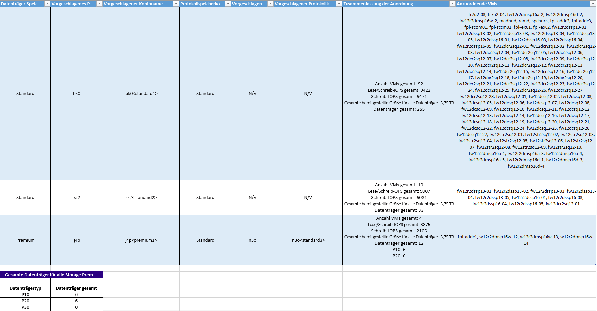

**Disk Storage Type** (Datenträger-Speichertyp) lautet entweder „Standard“ oder „Premium“. Es handelt sich um das Azure Storage-Konto, das zum Replizieren aller entsprechenden virtuellen Computer verwendet wird, die in der Spalte „VMs to Place“ (Anzuordnende VMs) angegeben sind.

**Suggested Prefix** (Vorgeschlagenes Präfix) ist das vorgeschlagene Präfix aus drei Zeichen, das zum Benennen des Azure Storage-Kontos verwendet werden kann. Sie können immer Ihr eigenes Präfix verwenden, aber der Vorschlag des Tools basiert auf der [Partitionsbenennungskonvention für Azure Storage-Konten](https://aka.ms/storage-performance-checklist).

**Suggested Account Name** (Vorgeschlagener Kontoname) gibt an, wie der Azure Storage-Kontoname nach dem Einbinden des vorgeschlagenen Präfix aussehen sollte. Ersetzen Sie den Namen in „< >“ durch Ihre benutzerdefinierte Eingabe.

**Log Storage Account** (Protokollspeicherkonto): Alle Replikationsprotokolle werden in einem Azure Storage-Konto vom Typ „Standard“ gespeichert. Für die virtuellen Computer, die unter einem Azure Storage-Konto vom Typ „Premium“ repliziert werden, muss ein zusätzliches Azure Storage-Standardkonto für den Protokollspeicher bereitgestellt werden. Ein einzelnes Standardkonto für Protokollspeicher kann von mehreren Premium-Replikationsspeicherkonten genutzt werden. Für virtuelle Computer, die unter Standardspeicherkonten repliziert werden, wird dasselbe Speicherkonto für Protokolle verwendet.

**Suggested Log Account Name** (Vorgeschlagener Protokollkontoname) gibt an, wie der Azure Storage-Protokollkontoname nach dem Einbinden des vorgeschlagenen Präfix aussehen sollte. Ersetzen Sie den Namen in „< >“ durch Ihre benutzerdefinierte Eingabe.

**Placement Summary** (Übersicht der Anordnung) enthält eine Übersicht über die gesamte VM-Last für das Azure Storage-Konto zum Zeitpunkt der Replikation und des Testfailovers bzw. Failovers. Folgendes wird angegeben: Gesamtzahl der virtuellen Computer, die dem Azure Storage-Konto zugeordnet sind, Lesen/Schreiben-IOPS-Gesamtwert über alle virtuellen Computer hinweg, die unter diesem Azure Storage-Konto angeordnet werden, Schreiben-IOPS-Gesamtwert (Replikation), insgesamt bereitgestellte Größe über alle Datenträger hinweg und Gesamtzahl von Datenträgern.

Unter **Virtual Machines to Place** (Anzuordnende VMs) werden alle virtuellen Computer aufgelistet, die unter dem angegebenen Azure Storage-Konto angeordnet werden sollten, um eine optimale Leistung und Auslastung zu erzielen.

##Kompatible VMs
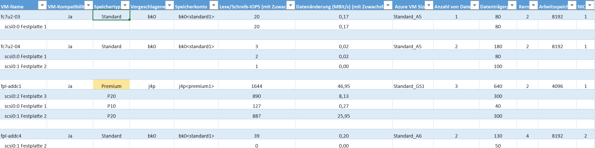

**VM Name** (VM-Name) ist der Name oder die IP-Adresse des virtuellen Computers, der bzw. die bei der Berichterstellung in VMListFile verwendet wird. In dieser Spalte sind auch die Datenträger (VMDKs) angegeben, die an die virtuellen Computer angefügt sind.

**VM Compatibility** (VM-Kompatibilität) hat zwei Werte: Yes/Yes* (Ja/Ja). Yes* (Ja) gilt für die Fälle, in denen der virtuelle Computer für [Azure Storage vom Typ „Premium“](https://aka.ms/premium-storage-workload) geeignet ist und der Datenträger mit hoher Änderungsrate bzw. hohem IOPS-Wert für die Profilerstellung in die Kategorie P20 oder P30 fällt, aber aufgrund der Größe des Datenträgers eine Herabstufung auf P10 oder P20 erfolgt. In Azure Storage wird anhand der Größe entschieden, welchem Storage Premium-Datenträgertyp ein Datenträger zugeordnet wird: < 128 GB entspricht P10, 128 bis 512 GB entspricht P20 und 512 GB bis 1.023 GB entspricht P30. Wenn ein Datenträger also anhand der Workloadmerkmale in die Kategorie P20 oder P30 fällt, er aber aufgrund der Größe auf einen niedrigeren Storage Premium-Datenträgertyp heruntergestuft wird, kennzeichnet das Tool den virtuellen Computer als „Yes*“ (Ja). Sie erhalten die Empfehlung, entweder die Größe des Quelldatenträgers zu ändern, damit er für den entsprechenden empfohlenen Storage Premium-Datenträgertyp geeignet ist, oder den Zieldatenträgertyp nach dem Failover zu ändern.
Der Speichertyp lautet „Standard“ oder „Premium“.

**Suggested Prefix** (Empfohlenes Präfix) ist das dreistellige Präfix für das Azure Storage-Konto.

**Storage Account** (Speicherkonto) ist der Name, für den das vorgeschlagene Präfix verwendet wird.

**R/W IOPS (with Growth Factor)** (IOPS für Lesen/Schreiben (mit Zuwachsfaktor)) ist der IOPS-Wert für die Spitzenworkload auf dem Datenträger (Standardeinstellung: 95. Perzentil), einschließlich des Faktors für den zukünftigen Zuwachs (Standardeinstellung: 30%). Beachten Sie Folgendes: Der Lesen/Schreiben-IOPS-Gesamtwert des virtuellen Computers ist nicht immer die Summe des Lesen/Schreiben-IOPS-Werts der einzelnen VM-Datenträger, da der Lesen/Schreiben-IOPS-Spitzenwert des virtuellen Computers der Spitzenwert der Summe des Lesen/Schreiben-IOPS-Werts seiner einzelnen Datenträger für jede Minute des Profilerstellungszeitraums ist.

**Data Churn in Mbps (with Growth Factor)** (Datenänderung in MBit/s (mit Zuwachsfaktor)) ist die Spitzenänderungsrate auf dem Datenträger (Standardeinstellung: 95. Perzentil), einschließlich des Faktors für den zukünftigen Zuwachs (Standardeinstellung: 30%). Beachten Sie Folgendes: Die gesamte VM-Datenänderung ist nicht immer die Summe der Datenänderung der einzelnen VM-Datenträger, da der Spitzenwert der VM-Datenänderung der Spitzenwert der Summe der Datenänderung seiner einzelnen Datenträger für jede Minute des Profilerstellungszeitraums ist.

**Azure VM Size** (Azure-VM-Größe) ist die Idealgröße für die Zuordnung von Azure Compute-VMs für diesen lokalen virtuellen Computer. Diese Zuordnung erfolgt basierend auf dem Arbeitsspeicher des lokalen virtuellen Computers, der Anzahl von Datenträgern/Kernen/NICs und dem Lesen/Schreiben-IOPS-Wert. Die Empfehlung ist immer die geringstmögliche Azure-VM-Größe, die für all diese Merkmale des lokalen virtuellen Computers geeignet ist.

**Number of Disks** (Anzahl von Datenträgern) ist die Gesamtzahl von Datenträgern (VMDKs) auf dem virtuellen Computer.

**Disk size (GB)** (Datenträgergröße (GB)) ist die insgesamt bereitgestellte Größe aller Datenträger des virtuellen Computers. Im Tool wird auch die Datenträgergröße für die einzelnen Datenträger des virtuellen Computers angezeigt.

**Cores** (Kerne) ist die Anzahl von CPU-Kernen des virtuellen Computers.

**Memory (MB)** (Arbeitsspeicher (MB)) ist der RAM des virtuellen Computers.

**NICs** ist die Anzahl von Netzwerkkarten des virtuellen Computers.

##Inkompatible VMs

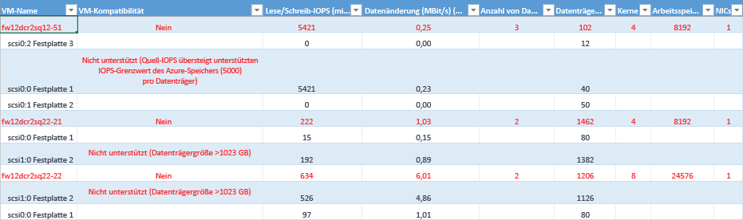

**VM Name** (VM-Name) ist der Name oder die IP-Adresse des virtuellen Computers, der bzw. die bei der Berichterstellung in VMListFile verwendet wird. In dieser Spalte sind auch die Datenträger (VMDKs) angegeben, die an die virtuellen Computer angefügt sind.

**VM Compatibility** (VM-Kompatibilität) gibt an, warum der jeweilige virtuelle Computer für die Verwendung mit Azure Site Recovery nicht kompatibel ist. Die Gründe werden pro inkompatiblem Datenträger des virtuellen Computers angegeben. Dies können basierend auf den veröffentlichten Azure Storage-[Grenzwerten](https://aka.ms/azure-storage-scalbility-performance) folgende Gründe sein:

* Datenträgergröße von mehr als 1.023 GB: Azure Storage unterstützt derzeit keine Datenträger, die größer als 1 TB sind.
* Die VM-Gesamtgröße (Replikation und Testfailover) übersteigt den unterstützten Grenzwert für die Größe des Azure Storage-Kontos (35 TB): Dies kommt normalerweise vor, wenn der virtuelle Computer einen einzelnen Datenträger mit einigen Leistungsmerkmalen enthält, der die maximal unterstützten Microsoft Azure-/Azure Site Recovery-Grenzwerte für Standardspeicher übersteigt, sodass der virtuelle Computer in die Storage Premium-Zone fällt. Die maximal unterstützte Größe für ein Azure Storage-Konto vom Typ „Premium“ beträgt aber 35 TB, und ein einzelner geschützter virtueller Computer kann nicht über mehrere Speicherkonten hinweg geschützt werden. Beachten Sie außerdem Folgendes: Wenn ein Testfailover (TFO) auf einem geschützten virtuellen Computer ausgeführt wird, erfolgt dies unter demselben Speicherkonto, unter dem die Replikation durchgeführt wird. Wir müssen also das Doppelte der Datenträgergröße bereitstellen, damit die Replikation und das Testfailover erfolgreich parallel durchgeführt werden können.
* Quell-IOPS-Wert übersteigt den unterstützten Azure Storage-IOPS-Grenzwert von 5.000 pro Datenträger.
* Quell-IOPS-Wert übersteigt den unterstützten Azure Storage-IOPS-Grenzwert von 80.000 pro VM.
* Durchschnittliche Datenänderungsrate übersteigt den unterstützten Grenzwert für die Azure Site Recovery-Datenänderungsrate von 10 MBit/s für die durchschnittliche E/A-Größe für den Datenträger.
* Die gesamte Datenänderungsrate über alle Datenträger auf der VM übersteigt den maximal unterstützten Grenzwert für die Azure Site Recovery-Datenänderungsrate von 54 MBit/s pro VM.
* Durchschnittlicher effektiver Schreib-IOPS-Wert übersteigt den unterstützten Azure Site Recovery-IOPS-Grenzwert von 840 für den Datenträger.
* Berechneter Momentaufnahmespeicher übersteigt den unterstützten Grenzwert für Momentaufnahmespeicher von 10 TB.

**R/W IOPS (with Growth Factor)** (IOPS für Lesen/Schreiben (mit Zuwachsfaktor)) ist der IOPS-Wert für die Spitzenworkload auf dem Datenträger (Standardeinstellung: 95. Perzentil), einschließlich des Faktors für den zukünftigen Zuwachs (Standardeinstellung: 30%). Beachten Sie Folgendes: Der Lesen/Schreiben-IOPS-Gesamtwert des virtuellen Computers ist nicht immer die Summe des Lesen/Schreiben-IOPS-Werts der einzelnen VM-Datenträger, da der Lesen/Schreiben-IOPS-Spitzenwert des virtuellen Computers der Spitzenwert der Summe des Lesen/Schreiben-IOPS-Werts seiner einzelnen Datenträger für jede Minute des Profilerstellungszeitraums ist.

**Data Churn in Mbps (with Growth Factor)** (Datenänderung in MBit/s (mit Zuwachsfaktor)) ist die Spitzenänderungsrate auf dem Datenträger (Standardeinstellung: 95. Perzentil), einschließlich des Faktors für den zukünftigen Zuwachs (Standardeinstellung: 30%). Beachten Sie Folgendes: Die gesamte VM-Datenänderung ist nicht immer die Summe der Datenänderung der einzelnen VM-Datenträger, da der Spitzenwert der VM-Datenänderung der Spitzenwert der Summe der Datenänderung seiner einzelnen Datenträger für jede Minute des Profilerstellungszeitraums ist.

**Number of Disks** (Anzahl von Datenträgern) ist die Gesamtzahl von Datenträgern (VMDKs) auf dem virtuellen Computer.

**Disk size (GB)** (Datenträgergröße (GB)) ist die insgesamt bereitgestellte Größe aller Datenträger des virtuellen Computers. Im Tool wird auch die Datenträgergröße für die einzelnen Datenträger des virtuellen Computers angezeigt.

**Cores** (Kerne) ist die Anzahl von CPU-Kernen des virtuellen Computers.

**Memory (MB)** (Arbeitsspeicher (MB)) ist der RAM des virtuellen Computers.

**NICs** ist die Anzahl von Netzwerkkarten des virtuellen Computers.

##Azure Site Recovery-Grenzwerte

**Replikationsspeicherziel** | **Durchschnittliche E/A-Größe des Quelldatenträgers** |**Durchschnittliche Datenänderungsrate des Quelldatenträgers** | **Gesamte Datenänderungsrate des Quelldatenträgers pro Tag**
---|---|---|---
Standardspeicher | 8 KB    | 2 MB/s | 168 GB pro Datenträger
Premium-P10-Datenträger | 8 KB    | 2 MB/s | 168 GB pro Datenträger
Premium-P10-Datenträger | 16 KB | 4 MB/s |    336 GB pro Datenträger
Premium-P10-Datenträger | 32 KB oder höher | 8 MB/s | 672 GB pro Datenträger
Premium-P20/P30-Datenträger | 8 KB    | 5 MB/s | 421 GB pro Datenträger
Premium-P20/P30-Datenträger | 16 KB oder höher |10 MB/s    | 842 GB pro Datenträger

Dies sind Durchschnittswerte, bei denen eine E/A-Überlappung von 30% angenommen wird. Azure Site Recovery kann einen höheren Durchsatz basierend auf dem Überlappungsverhältnis, höheren Schreibgrößen und dem tatsächlichen Workload-E/A-Verhalten verarbeiten. Bei den obigen Zahlen wird ein typischer Backlog von ca. fünf Minuten vorausgesetzt. Dies bedeutet, dass die Daten nach dem Hochladen verarbeitet werden und innerhalb von fünf Minuten ein Wiederherstellungspunkt erstellt wird.

Die obigen veröffentlichten Grenzwerte basieren auf unseren Tests, können aber nicht alle möglichen E/A-Kombinationen für Anwendungen abdecken. Die tatsächlichen Ergebnisse variieren basierend auf Ihrer E/A-Mischung für die Anwendungen. Auch nach der Planung der Bereitstellung ist es zum Erzielen der bestmöglichen Ergebnisse stets zu empfehlen, umfangreiche Anwendungstests per Testfailover durchzuführen, um sich ein eindeutiges Bild der Leistung zu verschaffen.

##Versionshinweise
Die öffentliche Vorschauversion des Azure Site Recovery Deployment Planner 1.0 weist die folgenden bekannten Probleme auf, an deren Behebung im Rahmen der nächsten Updates gearbeitet wird.

* Das Tool funktioniert nur für das Szenario „VMware zu Azure“ und nicht für Bereitstellungen vom Typ „Hyper-V zu Azure“. Verwenden Sie für das Szenario „Hyper-V zu Azure“ das [Hyper-V Capacity Planner-Tool](./site-recovery-capacity-planning-for-hyper-v-replication.md).
* Der GetThroughput-Vorgang wird nicht für die Microsoft Azure-Regionen „US Government“ und „China“ unterstützt.
* Mit dem Tool kann die Profilerstellung für virtuelle Computer nicht durchgeführt werden, wenn vCenter über zwei oder mehr virtuelle Computer mit demselben Namen bzw. derselben IP-Adresse über verschiedene ESXi-Hosts hinweg verfügt. In dieser Version überspringt das Tool die Profilerstellung für doppelte Namen und IP-Adressen in der VMListFile. Die Problemumgehung besteht darin, die Profilerstellung für virtuelle Computer nicht per vCenter-Server, sondern mit dem ESXi-Host durchzuführen. Sie müssen für jeden ESXi-Host eine Instanz ausführen.

