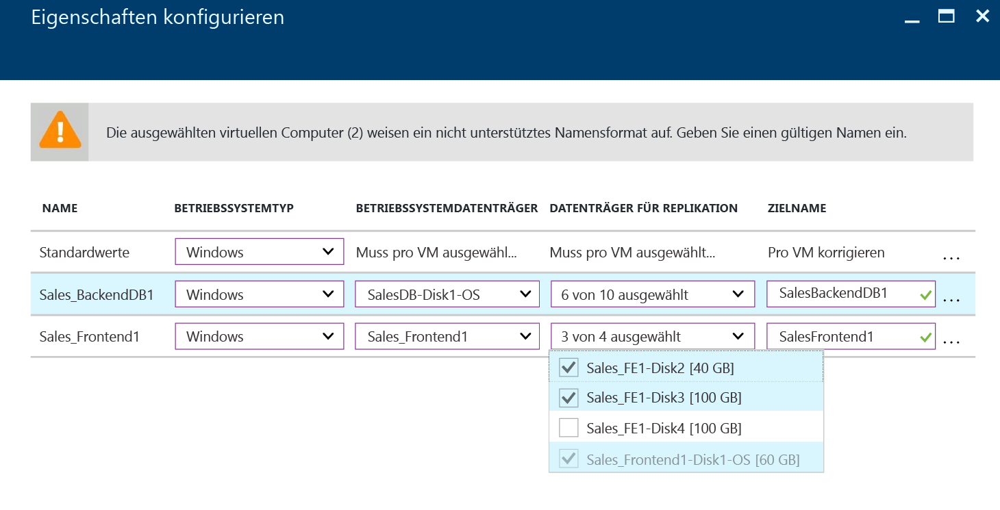
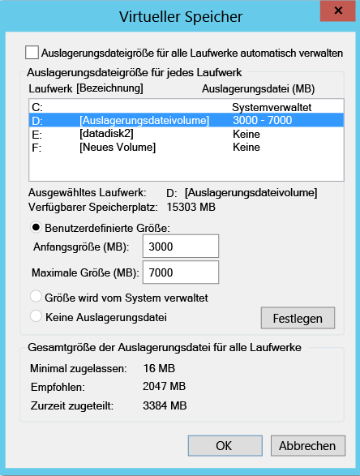
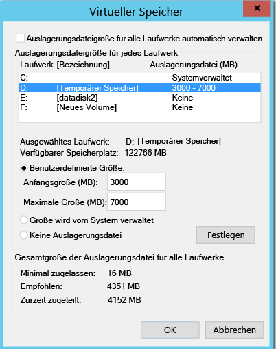
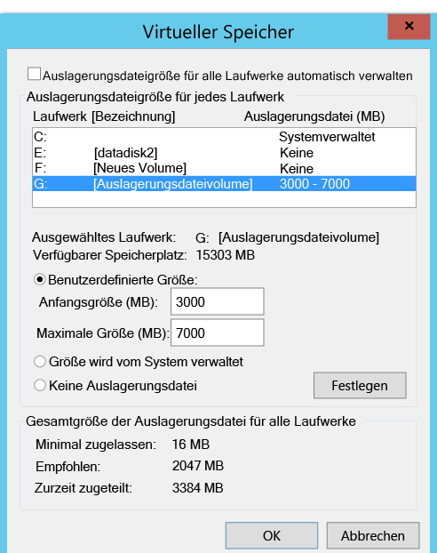
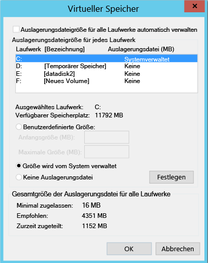

#Ausschließen des Datenträgers aus der Replikation
In diesem Artikel wird beschrieben, wie Sie Datenträger aus der Replikation ausschließen, um die verbrauchte Replikationsbandbreite oder die von den Datenträgern genutzten zielseitigen Ressourcen zu optimieren. Dieses Feature wird für die Szenarien „VMware zu Azure“ und „Hyper-V zu Azure“ unterstützt.

##Voraussetzungen

Standardmäßig werden alle Datenträger auf einem Computer repliziert. Der Mobilitätsdienst muss bei einer Replikation von **VMware zu Azure** vor der Aktivierung der Replikation manuell auf dem Computer installiert werden, um einen Datenträger von der Replikation auszuschließen.

## Gründe für das Ausschließen von Datenträgern von der Replikation
Das Ausschließen von Datenträgern von der Replikation ist häufig aus folgenden Gründen erforderlich:

1. Die auf dem ausgeschlossenen Datenträger verarbeiteten Daten sind nicht wichtig oder müssen nicht repliziert werden.

2. Es können Speicher- und Netzwerkressourcen gespart werden, indem diese Daten nicht repliziert werden.

##Was sind die typischen Szenarien?
Es gibt einige bestimmte Beispiele für Datenänderungen, die einfach identifiziert werden können und gute Kandidaten für den Ausschluss sind, z.B. Schreibvorgänge in Auslagerungsdateien, tempdb-Schreibvorgänge für Microsoft SQL Server usw. Je nach Workload und Speichersubsystem kann in der Auslagerungsdatei eine beträchtliche Menge an Datenänderungen registriert werden. Wenn diese Daten vom primären Standort in Azure repliziert werden, ist der Ressourcenaufwand sehr hoch. Daher kann die Replikation einer VM mit einem einzelnen virtuellen Datenträger, der sowohl das Betriebssystem als auch die Auslagerungsdatei enthält, wie folgt optimiert werden:

1. Aufteilen des einzelnen virtuellen Datenträgers auf zwei virtuelle Datenträger – einer mit dem Betriebssystem und einer mit der Auslagerungsdatei
2. Ausschließen des Datenträgers mit der Auslagerungsdatei von der Replikation

Ebenso können Sie wie folgt eine Optimierung erreichen, wenn sich Microsoft SQL Server mit tempdb und die Systemdatenbankdatei auf demselben Datenträger befinden:

1. Verwenden von zwei unterschiedlichen Datenträgern für die Systemdatenbank und tempdb
2. Ausschließen des tempdb-Datenträgers von der Replikation

##Wie kann ein Datenträger von der Replikation ausgeschlossen werden?

###VMware zu Azure
Folgen Sie dem Workflow für [Replikation aktivieren](site-recovery-vmware-to-azure.md#enable-replication), um eine VM über das Azure Site Recovery-Portal zu schützen. Schritt 4 von „Replikation aktivieren“ enthält eine Spalte für den **ZU REPLIZIERENDEN DATENTRÄGER**, die verwendet werden kann, um den Datenträger aus der Replikation auszuschließen. Standardmäßig sind alle Datenträger ausgewählt. Deaktivieren Sie den Datenträger, den Sie von der Replikation ausschließen möchten, und führen Sie die Schritte zum Aktivieren der Replikation aus. 

    
    
>[!NOTE]
> 
> * Sie können nur Datenträger ausschließen, auf denen der Mobilitätsdienst bereits installiert ist. Sie müssen den Mobilitätsdienst manuell installieren, da dieser nur nach Aktivierung der Replikation mithilfe des Pushmechanismus installiert wird.
> * Nur Basisdatenträger können von der Replikation ausgeschlossen werden. Betriebssystem- oder dynamische Datenträger können nicht ausgeschlossen werden.
> * Nach Aktivierung der Replikation können Sie keine Datenträger für die Replikation hinzufügen oder entfernen. Wenn Sie einen Datenträger hinzufügen oder entfernen möchten, müssen Sie den Schutz für den Computer deaktivieren und anschließend wieder aktivieren.
> * Wenn Sie einen Datenträger ausschließen, der für den Betrieb einer Anwendung erforderlich ist, müssen Sie ihn nach dem Failover in Azure manuell in Azure erstellen, damit die replizierte Anwendung ausgeführt werden kann. Alternativ können Sie Azure Automation in einen Wiederherstellungsplan integrieren, um den Datenträger während des Failovers des Computers zu erstellen.
> * Windows-VM: Für Datenträger, die Sie manuell in Azure erstellen, wird kein Failback durchgeführt. Wenn Sie also beispielsweise ein Failover für drei Datenträger durchführen und zwei Datenträger direkt auf dem virtuellen Azure-Computer erstellen, erfolgt nur für die drei Datenträger, für die das Failover durchgeführt wurde, ein Failback. Manuell erstellte Datenträger können nicht in das Failback oder in den erneuten Schutz vom lokalen Standort nach Azure einbezogen werden.
> * Linux-VM: Für Datenträger, die Sie manuell in Azure erstellen, wird ein Failback durchgeführt. Wenn Sie beispielsweise ein Failover für drei Datenträger ausführen und zwei direkt in Azure erstellen, wird für alle fünf ein Failback ausgeführt. Sie können keine Datenträger von einem Failback ausschließen, die manuell erstellt wurden.
> 

###Hyper-V in Azure
Folgen Sie dem Workflow für [Replikation aktivieren](site-recovery-hyper-v-site-to-azure.md#step-6-enable-replication), um eine VM über das Azure Site Recovery-Portal zu schützen. Schritt 4 von „Replikation aktivieren“ enthält eine Spalte für den **ZU REPLIZIERENDEN DATENTRÄGER**, die verwendet werden kann, um Datenträger aus der Replikation auszuschließen. Standardmäßig sind alle Datenträger für die Replikation ausgewählt. Deaktivieren Sie den Datenträger, den Sie von der Replikation ausschließen möchten, und führen Sie die Schritte zum Aktivieren der Replikation aus. 

    
>[!NOTE]
> 
> * Nur Basisdatenträger können von der Replikation ausgeschlossen werden. Der Betriebssystemdatenträger kann nicht ausgeschlossen werden, und es wird davon abgeraten, dynamische Datenträger auszuschließen. ASR kann nicht ermitteln, ob es sich bei einer VHD des virtuellen Gastcomputers um einen Basisdatenträger oder um einen dynamischen Datenträger handelt.  Wenn keiner der abhängigen dynamischen Volumedatenträger ausgeschlossen wird, tritt bei geschützten dynamischen Datenträgern auf einem virtuellen Failovercomputer ein Fehler auf, und auf die Daten des Datenträgers kann nicht zugegriffen werden.    
> * Nach Aktivierung der Replikation können Sie keine Datenträger für die Replikation hinzufügen oder entfernen. Wenn Sie einen Datenträger hinzufügen oder entfernen möchten, müssen Sie den Schutz für den virtuellen Computer deaktivieren und anschließend wieder aktivieren.
> * Wenn Sie einen Datenträger ausschließen, der für den Betrieb einer Anwendung erforderlich ist, müssen Sie ihn nach dem Failover auf Azure manuell in Azure erstellen, damit die replizierte Anwendung ausgeführt werden kann. Alternativ können Sie Azure Automation in einen Wiederherstellungsplan integrieren, um den Datenträger während des Failovers des Computers zu erstellen.
> * Für Datenträger, die Sie manuell in Azure erstellen, wird kein Failback durchgeführt. Wenn Sie also beispielsweise ein Failover für drei Datenträger ausführen und zwei Datenträger direkt auf dem virtuellen Azure-Computer erstellen, wird nur für die drei Datenträger, für die das Failover ausgeführt wurde, ein Failback von Azure zu Hyper-V ausgeführt. Manuell erstellte Datenträger können nicht in das Failback oder in die umgekehrte Replikation von Hyper-V zu Azure einbezogen werden.
 

##End-to-End-Szenarien zum Ausschließen von Datenträgern
Hier werden zwei Szenarien beschrieben, um die Funktion zum Ausschließen von Datenträgern genauer zu erläutern.

1. tempdb-Datenträger von SQL Server
2. Datenträger mit Auslagerungsdatei

###Ausschließen des tempdb-Datenträgers von SQL Server
Angenommen, Sie verwenden einen virtuellen SQL Server-Computer mit einer tempdb, der ausgeschlossen werden kann.

Name der VM: SalesDB-Datenträger auf der Quell-VM:

**Name des Datenträgers** | **Datenträger mit Gastbetriebssystem** | **Laufwerkbuchstabe** | **Datentyp auf dem Datenträger**
--- | --- | --- | ---
DB-Disk0-OS | DISK0 | C:\ | Betriebssystem-Datenträger
DB-Disk1| Disk1 | D:\ | SQL-Systemdatenbank und Benutzerdatenbank&1;
DB-Disk2 (Datenträger aus Schutz ausgeschlossen) | Disk2 | E:\ | Temporäre Dateien
DB-Disk3 (Datenträger aus Schutz ausgeschlossen) | Disk3 | F:\ | SQL-tempdb-Datenbank (Ordnerpfad F:\MSSQL\Data\) --> Notieren Sie sich den Ordnerpfad vor dem Failover.
DB-Disk4 | Disk4 |G:\ |Benutzerdatenbank&2;

Da die Datenänderungen auf zwei Datenträgern auf der VM temporärer Art sind, schließen Sie beim Schützen der SalesDB-VM „Disk2“ und „Disk3“ von der Replikation aus. Diese Datenträger werden von Azure Site Recovery dann nicht repliziert, und beim Failover sind sie auf der Failover-VM in Azure nicht vorhanden.

Datenträger auf der Azure-VM nach einem Failover:

**Datenträger mit Gastbetriebssystem** | **Laufwerkbuchstabe** | **Datentyp auf dem Datenträger**
--- | --- | ---
DISK0 |    C:\ | Betriebssystem-Datenträger
Disk1 |    E:\ | Temporäre Speicherung [Azure fügt diesen Datenträger hinzu und weist den ersten verfügbaren Laufwerkbuchstaben zu.]
Disk2 | D:\ | SQL-Systemdatenbank und Benutzerdatenbank&1;
Disk3 | G:\ | Benutzerdatenbank&2;

Da „Disk2“ und „Disk3“ aus der SalesDB-VM ausgeschlossen wurden, ist „E:“ der erste Laufwerkbuchstabe aus der verfügbaren Liste. Azure weist „E:“ einem temporären Speichervolume zu. Für alle replizierten Datenträger bleibt der Laufwerkbuchstabe gleich.

Datenträger „Disk3“, der als SQL-tempdb-Datenträger gedient hat (tempdb-Ordnerpfad F:\MSSQL\Data\) und von der Replikation ausgeschlossen war, ist nicht auf der Failover-VM verfügbar. Daher befindet sich der SQL-Dienst im Status „Beendet“ und benötigt den Pfad „F:\MSSQL\Data“.

Es gibt zwei Möglichkeiten, wie Sie diesen Pfad erstellen können.

1. Fügen Sie einen neuen Datenträger hinzu, und weisen Sie den tempdb-Ordnerpfad zu.
2. Verwenden Sie einen vorhandenen temporären Speicherdatenträger für den tempdb-Ordnerpfad.

####Hinzufügen eines neuen Datenträgers:

1. Notieren Sie sich vor dem Failover den SQL-Pfad für „tempdb.mdf“ und „tempdb.ldf“.
2. Fügen Sie der Failover-VM über das Azure-Portal einen neuen Datenträger hinzu, der mindestens die gleiche Größe wie der SQL-tempdb-Quelldatenträger (Disk3) hat.
3. Melden Sie sich an der Azure-VM an. Initialisieren Sie über die Konsole für die Datenträgerverwaltung (diskmgmt.msc) den neu hinzugefügten Datenträger, und formatieren Sie sie.
4. Weisen Sie den gleichen Laufwerkbuchstaben zu, der für den SQL-tempdb-Datenträger verwendet wurde (F:).
5. Erstellen Sie auf dem Volume „F:“ den tempdb-Ordner (F:\MSSQL\Data).
6. Starten Sie den SQL-Dienst über die Dienstkonsole.

####Verwenden Sie einen vorhandenen temporären Speicherdatenträger für den SQL-tempdb-Ordnerpfad:

1. Öffnen Sie eine Befehlszeilenkonsole.
2. Führen Sie SQL Server im Wiederherstellungsmodus über die Befehlszeilenkonsole aus.

        Net start MSSQLSERVER /f / T3608

3. Führen Sie den folgenden sqlcmd-Befehl aus, um den tempdb-Pfad in einen neuen Pfad zu ändern.

        sqlcmd -A -S SalesDB        **Use your SQL DBname**
        USE master;        
        GO        
        ALTER DATABASE tempdb        
        MODIFY FILE (NAME = tempdev, FILENAME = 'E:\MSSQL\tempdata\tempdb.mdf');
        GO        
        ALTER DATABASE tempdb        
        MODIFY FILE (NAME = templog, FILENAME = 'E:\MSSQL\tempdata\templog.ldf');        
        GO

4. Beenden Sie den Microsoft SQL Server-Dienst.

        Net stop MSSQLSERVER
5. Starten Sie den Microsoft SQL Server-Dienst.

        Net start MSSQLSERVER

Lesen Sie sich die folgenden Informationen zu Azure-Richtlinien für temporäre Speicherdatenträger durch:

* Using SSDs in Azure VMs to store SQL Server TempDB and Buffer Pool Extensions (Verwenden von SSDs in Azure-VMs zum Speichern von SQL Server-TempDB- und Pufferpoolerweiterungen)
* Bewährte Methoden zur Leistung für SQL Server auf virtuellen Azure-Computern

###Failback (von Azure zu lokal)
Als Nächstes wird beschrieben, wie die Replikation für alle Datenträger verläuft, wenn Sie ein Failover von Azure zu Ihrem lokalen VMware- oder Hyper-V-Host durchführen. Datenträger, die Sie in Azure manuell erstellen, werden nicht repliziert. Wenn Sie also beispielsweise ein Failover für drei Datenträger ausführen und zwei Datenträger direkt auf dem virtuellen Azure-Computer erstellen, wird nur für die drei Datenträger, für die das Failover ausgeführt wurde, ein Failback ausgeführt. Manuell erstellte Datenträger können nicht in das Failback oder in den erneuten Schutz von lokal nach Azure einbezogen werden. Außerdem werden keine temporären Speicherdatenträger lokal repliziert.

####Failback zur Wiederherstellung am ursprünglichen Speicherort (Original Location Recovery, OLR)

Azure-VM-Datenträgerkonfiguration im obigen Beispiel:

**Datenträger mit Gastbetriebssystem** | **Laufwerkbuchstabe** | **Datentyp auf dem Datenträger** 
--- | --- | --- 
DISK0 | C:\ | Betriebssystem-Datenträger
Disk1 |    E:\ | Temporäre Speicherung [Azure fügt diesen Datenträger hinzu und weist den ersten verfügbaren Laufwerkbuchstaben zu.]
Disk2 |    D:\ | SQL-Systemdatenbank und Benutzerdatenbank&1;
Disk3 |    G:\ | Benutzerdatenbank&2;

####VMware zu Azure
Wenn das Failback zum ursprünglichen Standort durchgeführt wird, umfasst die Failback-VM-Datenträgerkonfiguration den ausgeschlossenen Datenträger nicht. Dies bedeutet, dass die Datenträger, die für „VMware zu Azure“ ausgeschlossen wurden, auf der Failback-VM nicht verfügbar sind. 

Datenträger auf der VMWare-VM (ursprünglicher Speicherort) nach dem geplanten Failover von Azure zur lokalen VMware-Instanz:

**Datenträger mit Gastbetriebssystem** | **Laufwerkbuchstabe** | **Datentyp auf dem Datenträger** 
--- | --- | --- 
DISK0 | C:\ | Betriebssystem-Datenträger
Disk1 |    D:\ | SQL-Systemdatenbank und Benutzerdatenbank&1;
Disk2 |    G:\ | Benutzerdatenbank&2;

####Hyper-V in Azure
Beim Failback zum ursprünglichen Speicherort bleibt die Failback-VM-Datenträgerkonfiguration mit der Datenträgerkonfiguration für die ursprüngliche VM für Hyper-V identisch. Dies bedeutet, dass die Datenträger, die für „Hyper-V-Standort zu Azure“ ausgeschlossen wurden, auf der Failback-VM verfügbar sind.

Datenträger auf der Hyper-V-VM (ursprünglicher Speicherort) nach dem geplanten Failover von Azure zur lokalen Hyper-V-Instanz:

**Name des Datenträgers** | **Datenträger mit Gastbetriebssystem** | **Laufwerkbuchstabe** | **Datentyp auf dem Datenträger**
--- | --- | --- | ---
DB-Disk0-OS | DISK0 |    C:\ | Betriebssystem-Datenträger
DB-Disk1 | Disk1 | D:\ | SQL-Systemdatenbank und Benutzerdatenbank&1;
DB-Disk2 (ausgeschlossener Datenträger) | Disk2 | E:\ | Temporäre Dateien
DB-Disk3 (ausgeschlossener Datenträger) | Disk3 | F:\ | SQL-tempdb-Datenbank (Ordnerpfad F:\MSSQL\Data\)
DB-Disk4 | Disk4 | G:\ | Benutzerdatenbank&2;

####Datenträger mit Auslagerungsdatei ausschließen

Angenommen, Sie verwenden einen virtuellen Computer mit einem Datenträger für die Auslagerungsdatei, der ausgeschlossen werden kann.
Es gibt zwei Fälle:

####Fall 1: Auslagerungsdatei wurde auf dem Laufwerk „D:“ konfiguriert
Datenträgerkonfiguration:

**Name des Datenträgers** | **Datenträger mit Gastbetriebssystem** | **Laufwerkbuchstabe** | **Datentyp auf dem Datenträger**
--- | --- | --- | ---
DB-Disk0-OS | DISK0 | C:\ | Betriebssystem-Datenträger
DB-Disk1 (Datenträger aus Schutz ausgeschlossen) | Disk1 | D:\ | pagefile.sys
DB-Disk2 | Disk2 | E:\ | Benutzerdaten 1
DB-Disk3 | Disk3 | F:\ | Benutzerdaten 2

Einstellungen der Auslagerungsdatei auf der Quell-VM:

    

Datenträger auf der Azure-VM nach dem Failover der VM von „VMware zu Azure“ oder „Hyper-V zu Azure“:
**Name des Datenträgers** | **Datenträger mit Gastbetriebssystem** | **Laufwerkbuchstabe** | **Datentyp auf dem Datenträger**
--- | --- | --- | ---
DB-Disk0-OS | DISK0 | C:\ | Betriebssystem-Datenträger
DB-Disk1 | Disk1 | D:\ | Temporäre Speicherung –> pagefile.sys
DB-Disk2 | Disk2 | E:\ | Benutzerdaten 1
DB-Disk3 | Disk3 | F:\ | Benutzerdaten 2

Da Disk1 (D:) ausgeschlossen wurde, ist „D:“ der erste Laufwerkbuchstabe der verfügbaren Liste, und von Azure wird „D:“ als Laufwerkbuchstabe für das Volume für die temporäre Speicherung zugewiesen.  Da „D:“ auf der Azure-VM verfügbar ist, bleibt die Einstellung der Auslagerungsdatei für die VM gleich.

Einstellungen der Auslagerungsdatei auf der Azure-VM:

####Fall 2: Auslagerungsdatei ist auf einem anderen Laufwerk konfiguriert (nicht auf Laufwerk „D:“)

Konfiguration des VM-Quelldatenträgers:

**Name des Datenträgers** | **Datenträger mit Gastbetriebssystem** | **Laufwerkbuchstabe** | **Datentyp auf dem Datenträger**
--- | --- | --- | ---
DB-Disk0-OS | DISK0 | C:\ | Betriebssystem-Datenträger
DB-Disk1 (Datenträger aus Schutz ausgeschlossen) | Disk1 | G:\ | pagefile.sys
DB-Disk2 | Disk2 | E:\ | Benutzerdaten 1
DB-Disk3 | Disk3 | F:\ | Benutzerdaten 2

Einstellungen der Auslagerungsdatei auf der lokalen VM:

Datenträger auf der Azure-VM nach dem Failover der VM von VMware/Hyper-V zu Azure:

**Name des Datenträgers**| **Datenträger mit Gastbetriebssystem**| **Laufwerkbuchstabe** | **Datentyp auf dem Datenträger**
--- | --- | --- | ---
DB-Disk0-OS | DISK0  |C:\ |Betriebssystem-Datenträger
DB-Disk1 | Disk1 | D:\ | Temporäre Speicherung –> pagefile.sys
DB-Disk2 | Disk2 | E:\ | Benutzerdaten 1
DB-Disk3 | Disk3 | F:\ | Benutzerdaten 2

Da „D:“ der erste in der Liste verfügbare Laufwerkbuchstabe ist, weist Azure dem Volume für die temporäre Speicherung „D:“ zu. Für alle replizierten Datenträger bleibt der Laufwerkbuchstabe gleich. Da der Datenträger „G:“ nicht verfügbar ist, wird das Laufwerk „C:“ für die Auslagerungsdatei verwendet.

Einstellungen der Auslagerungsdatei auf der Azure-VM:

## Nächste Schritte
Nachdem die Bereitstellung eingerichtet wurde und ausgeführt wird, können Sie sich über die unterschiedlichen Failoverarten [informieren](site-recovery-failover.md) .

