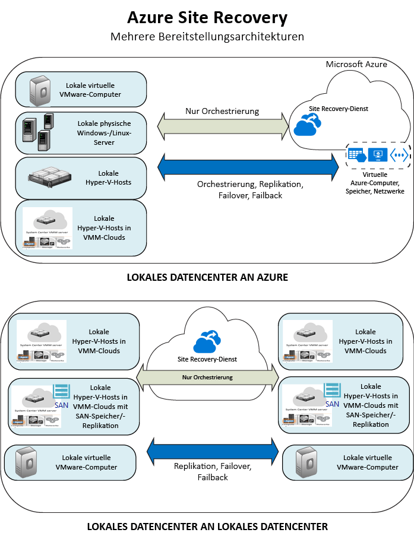

# Was ist Site Recovery?
Willkommen beim Azure Site Recovery-Dienst! Dieser Artikel enthält eine kurze Übersicht über Site Recovery.

Ihre Organisation benötigt eine Strategie für die Bereiche Geschäftskontinuität und Notfallwiederherstellung (Business Continuity and Disaster Recovery, BCDR), mit der bestimmt wird, wie Apps und Daten bei geplanten und ungeplanten Ausfallzeiten geschützt und verfügbar bleiben und so schnell wie möglich die normalen Arbeitsbedingungen wiederhergestellt werden können.

Site Recovery leistet einen Beitrag zu Ihrer BCDR-Strategie, indem die Orchestrierung der Replikation von lokalen virtuellen Computern und physischen Servern orchestriert wird. Sie replizieren Server und VMs aus Ihrem primären lokalen Datencenter in die Cloud (Azure) oder in ein sekundäres Datencenter.

Wenn es am Hauptstandort zu Ausfällen kommt, wird ein Failover zum sekundären Standort durchgeführt, um die Erreichbarkeit und Verfügbarkeit von Workloads zu erhalten. Wenn wieder Normalbetrieb herrscht, führen Sie das Failback zum primären Standort durch.

## Site Recovery im Azure-Portal
Azure verfügt über zwei verschiedene [Bereitstellungsmodelle](../resource-manager-deployment-model.md) für das Erstellen und Verwenden von Ressourcen. Dies sind das Azure Resource Manager-Modell und das klassische Dienstverwaltungsmodell. Außerdem verfügt Azure über zwei Portale. Dies sind das [klassische Azure-Portal](https://manage.windowsazure.com/) und das [Azure-Portal](https://portal.azure.com).

* Site Recovery kann sowohl im klassischen Portal als auch im Azure-Portal bereitgestellt werden.
* Im klassischen Azure-Portal können Sie Site Recovery mit dem klassischen Dienstverwaltungsmodell unterstützen.
* Im Azure-Portal können Sie das klassische Modell oder Resource Manager-Bereitstellungen unterstützen.

Die Informationen in diesem Artikel gelten für Bereitstellungen mit dem klassischen Portal und dem Azure-Portal. Wir haben die Unterschiede angegeben (falls zutreffend).

## Gründe für die Bereitstellung von Site Recovery
Site Recovery hat für Ihr Unternehmen folgende Vorteile:

* **Vereinfachung von Geschäftskontinuität und Notfallwiederherstellung:** Sie können mehrere Workloads über einen zentralen Ort im Azure-Portal replizieren und Failover und die Wiederherstellung dafür durchführen. Site Recovery orchestriert die Replikation und das Failover, ohne dass dies Auswirkungen auf die Anwendungsdaten hat.
* **Bereitstellung einer flexiblen Replikation:**Sie können beliebige Workloads replizieren, die auf unterstützten virtuellen Hyper-V-Computern, virtuellen VMware-Computern und physischen Windows- bzw. Linux-Servern ausgeführt werden.
* **Beseitigung eines sekundären Datencenters:** Sie können Workloads in Azure replizieren, anstatt an einem sekundären Standort. So entfallen die Kosten und die Komplexität, die mit der Verwaltung eines sekundären Datencenters verbunden sind. Replizierte Daten werden in Azure Storage gespeichert, sodass für Ausfallsicherheit gesorgt ist. Bei einem Failover werden Azure-VMs mit den replizierten Daten erstellt.
* **Einfache Replikationstests:** Sie können leicht Testfailover durchführen, mit denen Übungen zur Notfallwiederherstellung unterstützt werden, ohne dass sich dies auf Produktionsumgebungen auswirkt.
* **Failover und Wiederherstellung:** Sie können geplante Failover ohne Datenverlust für erwartete Ausfälle oder ungeplante Failover mit minimalem Datenverlust (je nach Replikationsfrequenz) für unerwartete Notfälle ausführen. Ein Failback an den primären Standort ist dann möglich, wenn dieser wieder verfügbar ist.
* **Failover über mehrere VMs hinweg:** Sie können Wiederherstellungspläne einrichten, die Skripts und Azure Automation-Runbooks enthalten. Mit Wiederherstellungsplänen können Sie das Failover und die Wiederherstellung von Anwendungen mit mehreren Ebenen, die auf mehrere VMs verteilt sind, modellieren und anpassen.
* **Integration mit vorhandenen BCDR-Technologien:** Site Recovery kann mit anderen BCDR-Technologien integriert werden. Beispielsweise können Sie Site Recovery verwenden, um das SQL Server-Back-End von geschäftlichen Workloads zu schützen, einschließlich der nativen Unterstützung für SQL Server Always On zum Verwalten des Failovers von Verfügbarkeitsgruppen.

## Was kann ich replizieren?
Hier ist eine Übersicht dazu angegeben, was Sie mit Site Recovery replizieren können.

| **REPLICATE** | **REPLIKATIONSZIEL** |
| --- | --- |
| Lokale VMware-VMs |[Azure](site-recovery-vmware-to-azure-classic.md)   [Sekundärer Standort](site-recovery-vmware-to-vmware.md) |
| Lokale Hyper-V-VMs, die in VMM-Clouds verwaltet werden |[Azure](site-recovery-vmm-to-azure.md)   [Sekundärer Standort](site-recovery-vmm-to-vmm.md) |
| Lokale Hyper-V-VMs, die in VMM-Clouds verwaltet werden, mit SAN-Speicher |[Sekundärer Standort](site-recovery-vmm-san.md) |
| Lokale Hyper-V-VMs ohne VMM |[Azure](site-recovery-hyper-v-site-to-azure.md) |
| Lokale physische Windows-/Linux-Server |[Azure](site-recovery-vmware-to-azure-classic.md)   [Sekundärer Standort](site-recovery-vmware-to-vmware.md) |

## Wie werden Workloads mit Site Recovery geschützt?
Site Recovery ermöglicht die anwendungsorientierte Replikation, damit Workloads und Apps auch bei Ausfällen auf konsistente Weise ausgeführt werden können.

* **Anwendungskonsistente Momentaufnahmen:** Computer werden mit anwendungskonsistenten Momentaufnahmen für Single- oder N-Tier-Apps repliziert. Zusätzlich zur Erfassung von Datenträgerdaten werden mit anwendungskonsistenten Momentaufnahmen alle Daten im Arbeitsspeicher und alle Transaktionen des Prozesses erfasst.
* **Nahezu synchrone Replikation:** Site Recovery ermöglicht eine Replikationsfrequenz von bis zu lediglich 30 Sekunden für Hyper-V und fortlaufende Replikation für VMware.
* **Flexible Wiederherstellungspläne:** Sie können Wiederherstellungspläne mit externen Skripts und manuellen Aktionen erstellen und anpassen. Dank der Integration mit Azure Automation-Runbooks können Sie einen gesamten Anwendungsstapel per Klick wiederherstellen.
* **Integration in SQL Server Always On:**Sie können das Failover von Verfügbarkeitsgruppen mit Wiederherstellungsplänen verwalten.
* **Automation-Bibliothek:**Eine umfassende Azure Automation-Bibliothek bietet produktionsbereite, anwendungsspezifische Skripts, die heruntergeladen und in Site Recovery integriert werden können.
* **Einfache Netzwerkverwaltung:** Die erweiterte Netzwerkverwaltung in Site Recovery und Azure vereinfacht Anforderungen für Anwendungsnetzwerke, z.B. das Reservieren von IP-Adressen, Konfigurieren von Lastenausgleichsmodulen und Integrieren von Azure Traffic Manager für effiziente Netzwerkwechsel.

## Nächste Schritte
* Unter [Welche Workloads kann Site Recovery schützen?](site-recovery-workload.md)
* Weitere Informationen zur Site Recovery-Architektur finden Sie unter [Wie funktioniert Site Recovery?](site-recovery-components.md)

<!---HONumber=Nov16_HO2-->

