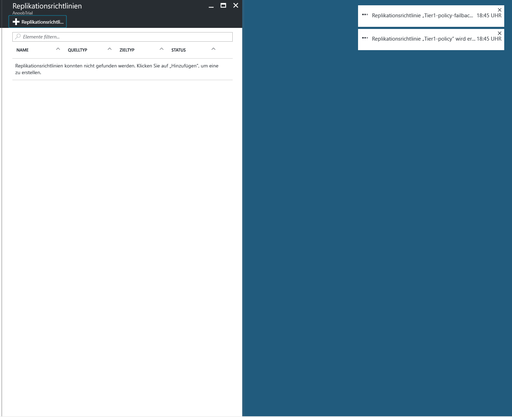
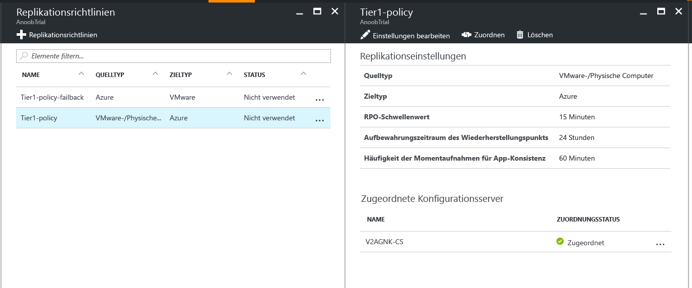
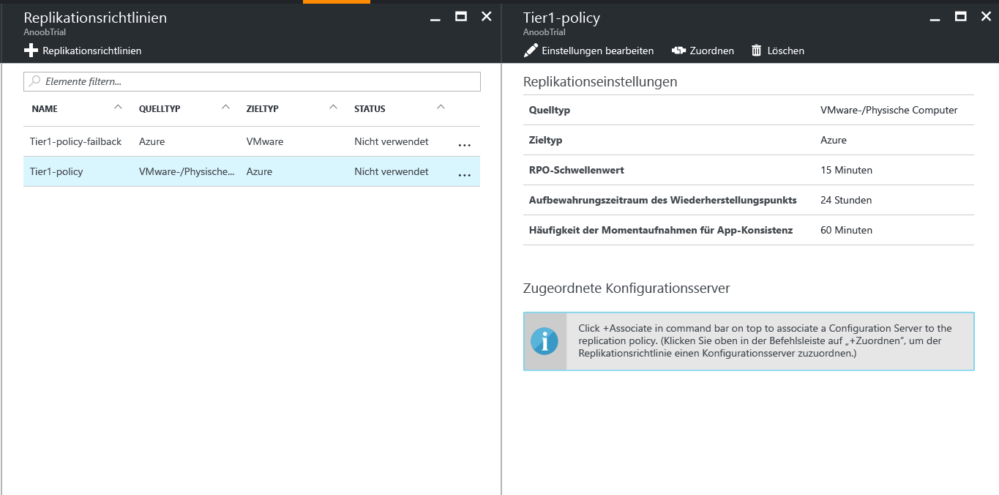
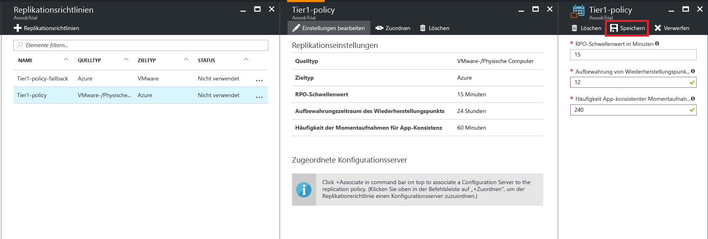

# Verwalten der Replikationsrichtlinie für VMware in Azure

## Erstellen einer neuen Replikationsrichtlinie

1. Klicken Sie im Menü auf der linken Seite auf „Verwalten -> Site Recovery-Infrastruktur“. 
2. Wählen Sie im Abschnitt „For VMware and Physical machines“ (Für VMware und physische Computer) die Option „Replikationsrichtlinien“ aus.
3. Klicken Sie oben auf „+Replikationsrichtlinie“.

    

4. Geben Sie den Namen der Richtlinie ein.

5. Geben Sie unter „RPO-Schwellenwert“ den RPO-Grenzwert an. Warnungen werden generiert, wenn die fortlaufende Replikation diesen Grenzwert überschreitet.
6. Geben Sie unter „Aufbewahrungszeitraum des Wiederherstellungspunkts“ das Aufbewahrungszeitfenster für die einzelnen Wiederherstellungspunkte in Stunden an. Geschützte Computer können innerhalb eines Zeitfensters an einem beliebigen Punkt wiederhergestellt werden. 

    > [!NOTE] 
    > Für Computer, die in Storage Premium repliziert werden, wird eine Aufbewahrungsdauer von bis zu 24 Stunden unterstützt. Für Computer, die im Standardspeicher repliziert werden, wird eine Aufbewahrungsdauer von 72 Stunden unterstützt.
    
    > [!NOTE] 
    > Eine Replikationsrichtlinie für ein Failback wird automatisch erstellt.

7. Geben Sie unter „App-konsistente Momentaufnahmehäufigkeit“ an, wie häufig (in Minuten) Wiederherstellungspunkte erstellt werden sollen, die anwendungskonsistente Momentaufnahmen enthalten.

8. Klicken Sie auf „OK“. Die Richtlinie sollte in etwa 30 bis 60 Sekunden erstellt werden.

## Zuordnen des Konfigurationsservers zur Replikationsrichtlinie
1. Klicken Sie auf die Replikationsrichtlinie, der der Konfigurationsserver zugeordnet werden soll.
2. Klicken Sie oben auf „Zuordnen“.

3. Wählen Sie aus der Liste der Server „Konfigurationsserver“ aus.
4. Klicken Sie auf OK. Der Konfigurationsserver sollte in etwa ein bis zwei Minuten zugeordnet sein.

## Bearbeiten einer Replikationsrichtlinie
1. Klicken Sie auf die Replikationsrichtlinie, für die Sie die Replikationseinstellungen bearbeiten möchten.

2. Klicken Sie oben auf „Einstellungen bearbeiten“.

3. Ändern Sie die Einstellungen abhängig von Ihren Anforderungen.
4. Klicken Sie oben auf „Speichern“. Die Richtlinie sollte in etwa zwei bis fünf Minuten gespeichert werden, je nachdem, wie viele virtuelle Computer diese Replikationsrichtlinie verwenden.

## Aufheben der Zuordnung des Konfigurationsservers zur Replikationsrichtlinie
1. Klicken Sie auf die Replikationsrichtlinie, der der Konfigurationsserver zugeordnet werden soll.
2. Klicken Sie oben auf „Zuordnung aufheben“.
3. Wählen Sie aus der Liste der Server „Konfigurationsserver“ aus.
4. Klicken Sie auf OK. Die Zuordnung des Konfigurationsservers sollte in etwa ein bis zwei Minuten aufgehoben sein.
    
    > [!NOTE] 
    > Sie können die Zuordnung eines Konfigurationsservers nicht aufheben, wenn mindestens ein mithilfe der Richtlinie repliziertes Element vorhanden ist. Stellen Sie sicher, dass keine mithilfe der Richtlinie replizierten Elemente vorhanden sind, ehe Sie die Zuordnung des Konfigurationsservers aufheben.

## Löschen einer Replikationsrichtlinie 

1. Klicken Sie auf die Replikationsrichtlinie, die Sie löschen möchten.
2. Klicken Sie auf „Löschen“. Die Richtlinie sollte in etwa 30 bis 60 Sekunden gelöscht werden.

    > [!NOTE] 
    > Sie können eine Replikationsrichtlinie nicht löschen, wenn ihr mindestens ein Konfigurationsserver zugeordnet ist. Stellen Sie sicher, dass keine mithilfe der Richtlinie replizierten Elemente vorhanden sind, und löschen Sie alle zugeordneten Konfigurationsserver, bevor Sie die Richtlinie löschen.

<!--HONumber=Jan17_HO4-->

