# Replizieren von virtuellen Hyper-V-Computern in VMM-Clouds an Azure über das Azure-Portal
> * [Azure-Portal](site-recovery-vmm-to-azure.md)
> * [Klassisches Azure](site-recovery-vmm-to-azure-classic.md)
> * [PowerShell – Resource Manager](site-recovery-vmm-to-azure-powershell-resource-manager.md)
> * [PowerShell – klassisch](site-recovery-deploy-with-powershell.md)
>
>

Willkommen beim Azure Site Recovery-Dienst!

Der Azure Site Recovery-Dienst unterstützt Ihre Strategie für Geschäftskontinuität und Notfallwiederherstellung (Business Continuity and Disaster Recovery, BCDR). Site Recovery dient zum Orchestrieren der Replikation von lokalen physischen Servern und virtuellen Computern in die Cloud (Azure) oder in ein sekundäres Datencenter. Wenn es an Ihrem primären Standort zu Ausfällen kommt, wird ein Failover zum sekundären Standort durchgeführt, um die Verfügbarkeit von Apps und Workloads zu erhalten. Wenn wieder Normalbetrieb herrscht, führen Sie das Failback zum primären Standort durch. Weitere Informationen finden Sie unter [Was ist Azure Site Recovery?](site-recovery-overview.md)

In diesem Artikel erfahren Sie, wie Sie lokale virtuelle Hyper-V-Computer, die in System Center-VMM-Clouds verwaltet werden, mithilfe von Azure Site Recovery über das Azure-Portal an Azure replizieren.

Nachdem Sie diesen Artikel gelesen haben, können Sie unten im Disqus-Kommentarbereich Ihre Kommentare eingeben. Im [Azure Recovery Services-Forum](https://social.msdn.microsoft.com/forums/azure/home?forum=hypervrecovmgr)können Sie technische Fragen stellen.

## Kurzübersicht
Für eine vollständige Bereitstellung empfiehlt es sich dringend, alle Schritte in diesem Artikel auszuführen. Sollten Sie wenig Zeit haben, finden Sie hier eine kurze Zusammenfassung.

| **Bereich** | **Details** |
| --- | --- |
| **Bereitstellungsszenario** |Replizieren von virtuellen Hyper-V-Computern in VMM-Clouds an Azure über das Azure-Portal |
| **Lokale Anforderungen** |Mindestens ein VMM-Server unter System Center 2012 R2 mit mindestens einer Cloud   Die Clouds müssen mindestens eine VMM-Hostgruppe enthalten.   Mindestens ein Hyper-V-Server in der Cloud, auf dem mindestens Windows Server 2012 R2 mit Hyper-V-Rolle oder Microsoft Hyper-V Server 2012 R2 mit den neuesten Updates ausgeführt wird   VMM-Server und Hyper-V-Hosts benötigen Internetzugriff und müssen entweder direkt oder über einen Proxy auf bestimmte URLs zugreifen können. [Details](#on-premises-prerequisites) |
| **Lokale Einschränkungen** |HTTPS-basierte Proxys werden nicht unterstützt. |
| **Anbieter/Agent** |Replizierte virtuelle Computer benötigen den Azure Site Recovery-Anbieter.   Hyper-V-Hosts benötigen den Recovery Services-Agent.   Diese werden während der Bereitstellung installiert. |
|  **Anforderungen für Azure** |Azure-Konto   Recovery Services-Tresor   LRS- oder GRS-Speicherkonto in der Tresorregion   Standardspeicherkonto   Virtuelles Azure-Netzwerk in der Tresorregion. [Details](#azure-prerequisites) |
|  **Azure-Einschränkungen** |Bei Verwendung von GRS benötigen Sie ein weiteres LRS-Konto für die Protokollierung.   Beachten Sie, dass im Azure-Portal erstellte Speicherkonten nicht über Ressourcengruppen in einem oder mehreren Abonnements hinweg verschoben werden können.    Storage Premium wird nicht unterstützt.   Für Site Recovery verwendete Azure-Netzwerke können nicht über Ressourcengruppen in einem oder mehreren Abonnements hinweg verschoben werden. |
|  **VM-Replikation** |[VMs müssen die Anforderungen für Azure erfüllen ](site-recovery-best-practices.md#azure-virtual-machine-requirements)   |
|  **Replikationseinschränkungen** |Virtuelle Linux-Computer mit einer statischen IP-Adresse können nicht repliziert werden.   Es ist nicht möglich, bestimmte Datenträger von der Replikation auszuschließen. |
| **Bereitstellungsschritte** |1) Vorbereiten von Azure (Abonnement, Speicher, Netzwerk) -> 2) Vorbereiten der lokalen Umgebung (VMM und Netzwerkzuordnung) -> 3) Erstellen des Recovery Services-Tresors -> 4) Einrichten von VMM- und Hyper-V-Host -> 5) Konfigurieren der Replikationseinstellungen -> 6) Aktivieren der Replikation -> 7) Testen von Replikation und Failover |

## Site Recovery im Azure-Portal

Azure verfügt über zwei verschiedene [Bereitstellungsmodelle](../resource-manager-deployment-model.md) für das Erstellen und Verwenden von Ressourcen: Azure Resource Manager- und klassische Bereitstellung. Azure verfügt zudem über zwei Portale: das klassische Azure-Portal und das Azure-Portal. In diesem Artikel wird die Bereitstellung über das Azure-Portal beschrieben.

Hier erfahren Sie, wie Sie die optimierte Bereitstellungsfunktion im Azure-Portal verwenden. Das klassische Portal kann verwendet werden, um bestehende Tresore zu verwalten. Sie können keine neuen Tresore mithilfe des klassischen Azure-Portals erstellen.

## Site Recovery in Ihrem Unternehmen

Organisationen benötigen eine BCDR-Strategie, die bestimmt, wie Apps und Daten bei geplanten und ungeplanten Ausfällen verfügbar bleiben und die normalen Arbeitsbedingungen so schnell wie möglich wiederhergestellt werden können. Site Recovery bietet folgende Vorteile:

* Offsite-Schutz für Unternehmens-Apps, die auf virtuellen Hyper-V-Computern ausgeführt werden
* Zentraler Ort zum Einrichten, Verwalten und Überwachen von Replikation, Failover und Wiederherstellung
* Unkompliziertes Failover zu Azure und Failback (Wiederherstellung) von Azure zu Hyper-V-Hostservern an Ihrem lokalen Standort
* Wiederherstellungspläne mit mehreren virtuellen Computern, sodass für mehrstufige Anwendungsworkloads ein gemeinsames Failover ausgeführt wird

## Szenarioarchitektur
Dies sind die Szenariokomponenten:

* **VMM-Server**: Ein lokaler VMM-Server mit einer oder mehreren Clouds.
* **Hyper-V-Host oder -Cluster**: Hyper-V-Hostserver oder -Cluster, die in VMM-Clouds verwaltet werden.
* **Azure Site Recovery-Anbieter und Recovery Services-Agent**: Während der Bereitstellung installieren Sie den Azure Site Recovery-Anbieter auf dem VMM-Server und den Microsoft Azure Recovery Services-Agent auf Hyper-V-Hostservern. Der Anbieter auf dem VMM-Server kommuniziert mit Site Recovery über HTTPS 443, um die Orchestrierung zu replizieren. Standardmäßig repliziert der Agent Daten auf dem Hyper-V-Hostserver über HTTPS 443 in den Azure-Speicher.
* **Azure**: Sie benötigen ein Azure-Abonnement, ein Azure-Speicherkonto zum Speichern replizierter Daten und ein virtuelles Azure-Netzwerk, damit Azure-VMs nach dem Failover über eine Netzwerkverbindung verfügen.

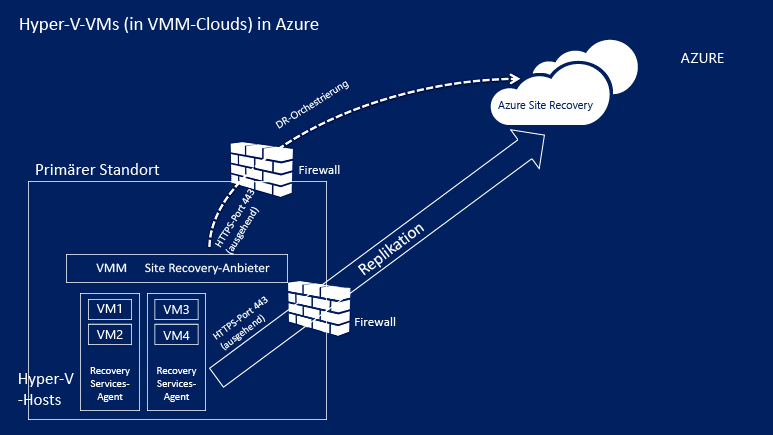

## Voraussetzungen für Azure
In Azure benötigen Sie Folgendes:

| **Voraussetzung** | **Details** |
| --- | --- |
| **Azure-Konto** |Sie benötigen ein [Microsoft Azure](http://azure.microsoft.com/) -Konto. Für den Einstieg steht eine [kostenlose Testversion](https://azure.microsoft.com/pricing/free-trial/)zur Verfügung. [hier](https://azure.microsoft.com/pricing/details/site-recovery/) . |
| **Azure-Speicher** |Sie benötigen ein standardmäßiges Azure-Speicherkonto, um replizierte Daten zu speichern. Hierfür können Sie ein LRS- oder GRS-Speicherkonto verwenden. Wir empfehlen Ihnen die Verwendung von GRS, damit Resilienz für die Daten besteht, wenn es zu einem regionalen Ausfall kommt oder wenn die primäre Region nicht wiederhergestellt werden kann. [Weitere Informationen](../storage/storage-redundancy.md). Das Konto muss sich in derselben Region wie der Recovery Services-Tresor befinden.  Storage Premium wird nicht unterstützt.   Replizierte Daten werden im Azure-Speicher gespeichert, und virtuelle Azure-Computer werden erstellt, wenn ein Failover durchgeführt wird.    [Erfahren Sie mehr](../storage/storage-introduction.md) zum Azure-Speicher. |
| **Azure-Netzwerk** |Sie benötigen ein virtuelles Azure-Netzwerk, mit dem die virtuellen Azure-Computer eine Verbindung herstellen, wenn ein Failover stattfindet. Das Netzwerk muss sich in derselben Region wie der Recovery Services-Tresor befinden. |

## Lokale Voraussetzungen
Lokal benötigen Sie Folgendes:

| **Voraussetzung** | **Details** |
| --- | --- |
| **VMM** |Mindestens einen VMM-Server, der unter System Center 2012 R2 ausgeführt wird. Für jeden VMM-Server sollte mindestens eine Cloud konfiguriert sein. Eine Cloud sollte Folgendes enthalten:   Eine oder mehrere VMM-Hostgruppen.   Einen oder mehrere Hyper-V-Hostserver oder Cluster in jeder Hostgruppe.  [hier](http://social.technet.microsoft.com/wiki/contents/articles/2729.how-to-create-a-cloud-in-vmm-2012.aspx) zum Einrichten von VMM-Clouds. |
| **Hyper-V** |Auf Hyper-V-Hostservern muss mindestens **Windows Server 2012 R2** mit Hyper-V-Rolle oder **Microsoft Hyper-V Server 2012 R2** ausgeführt werden, und die neuesten Updates müssen installiert sein.   Ein Hyper-V-Server muss mindestens einen virtuellen Computer enthalten.   Ein Hyper-V-Hostserver oder -Cluster, der zu replizierende VMs enthält, muss in einer VMM-Cloud verwaltet werden.  Hyper-V-Server müssen entweder direkt oder über einen Proxy mit dem Internet verbunden sein.  Auf Hyper-V-Servern sollten die in [Artikel 2961977](https://support.microsoft.com/kb/2961977) genannten Fehlerbehebungen installiert sein.  Hyper-V-Hostserver benötigen Internetzugriff für die Datenreplikation in Azure. |
| **Anbieter und Agent** |Während der Azure Site Recovery-Bereitstellung installieren Sie den Azure Site Recovery-Anbieter auf dem VMM-Server und den Recovery Services-Agent auf Hyper-V-Hosts. Anbieter und Agent müssen direkt oder über einen Proxy eine Internetverbindung mit Azure herstellen. Ein HTTPS-basierter Proxy wird nicht unterstützt. Der Proxyserver auf dem VMM-Server und auf Hyper-V-Hosts sollte den Zugriff auf folgende URLs zulassen:    ``*.accesscontrol.windows.net``   ``*.backup.windowsazure.com``   ``*.hypervrecoverymanager.windowsazure.com``   ``*.store.core.windows.net``   ``*.blob.core.windows.net``   ``https://www.msftncsi.com/ncsi.txt``   ``time.windows.com``   ``time.nist.gov``   Wenn Sie auf dem VMM-Server über Firewallregeln verfügen, die auf IP-Adressen basieren, sollten Sie sicherstellen, dass die Regeln die Kommunikation mit Azure zulassen.   Lassen Sie die [IP-Bereiche für Azure-Rechenzentren](https://www.microsoft.com/download/confirmation.aspx?id=41653) und den HTTPS-Port (443) zu.   Lassen Sie IP-Adressbereiche für die Azure-Region Ihres Abonnements und für die Region „USA, Westen“ zu.   |

## Voraussetzungen für geschützte Computer
| **Voraussetzung** | **Details** |
| --- | --- |
| **Geschützte VMs** |Stellen Sie vor dem Durchführen des Failovers für eine VM sicher, dass der Name, der dem virtuellen Azure-Computer zugewiesen wird, die [Voraussetzungen für Azure](site-recovery-best-practices.md#azure-virtual-machine-requirements)erfüllt. Sie können den Namen ändern, nachdem Sie die Replikation für die VM aktiviert haben.    Die individuelle Datenträgerkapazität auf geschützten Computern sollte nicht mehr als 1023 GB betragen. Ein virtueller Computer kann bis zu 64 Datenträger haben (also bis zu 64 TB).   Gastcluster mit freigegebenen Datenträgern werden nicht unterstützt.   Das Starten über Unified Extensible Firmware Interface (UEFI)/Extensible Firmware Interface (EFI) wird nicht unterstützt.   Wenn auf dem virtuellen Quellcomputer NIC-Teamvorgänge ausgeführt wurden, wird er nach dem Failover zu Azure in eine einzelne NIC konvertiert.  Das Schützen von Hyper-V-VMs, auf denen Linux mit einer statischen IP-Adresse ausgeführt wird, wird nicht unterstützt. |

## Vorbereiten der Bereitstellung
Für die Vorbereitung der Bereitstellung benötigen Sie Folgendes:

1. [Richten Sie ein Azure-Netzwerk ein](#set-up-an-azure-network) , in dem sich Azure-VMs nach dem Failover befinden.
2. [Richten Sie ein Azure-Speicherkonto ein](#set-up-an-azure-storage-account) , das für replizierte Daten verwendet werden kann.
3. [Bereiten Sie den VMM-Server vor](#prepare-the-vmm-server) , um die Site Recovery-Bereitstellung durchführen zu können.
4. [Bereiten Sie sich auf die Netzwerkzuordnung vor](#prepare-for-network-mapping). Richten Sie Netzwerke ein, damit Sie die Netzwerkzuordnung während der Site Recovery-Bereitstellung konfigurieren können.

### Richten Sie ein Azure-Netzwerk ein
Sie benötigen ein Azure-Netzwerk, mit dem nach dem Failover erstellte virtuelle Azure-Computer eine Verbindung herstellen.

* Das Netzwerk muss sich in der gleichen Region befinden wie der Recovery Services-Tresor.
* Richten Sie das Azure-Netzwerk im [Resource Manager-Modus](../virtual-network/virtual-networks-create-vnet-arm-pportal.md) oder im [klassischen Modus](../virtual-network/virtual-networks-create-vnet-classic-pportal.md) ein (je nachdem, welches Ressourcenmodell Sie für virtuelle Azure-Computer nach dem Failover verwenden möchten).
* Wir empfehlen Ihnen, ein Netzwerk einzurichten, bevor Sie beginnen. Falls Sie es nicht tun, müssen Sie diesen Schritt während der Site Recovery-Bereitstellung ausführen.
Beachten Sie, dass von Site Recovery verwendete Azure-Netzwerke nicht innerhalb eines Abonnements oder über mehrere Abonnements hinweg [verschoben](../resource-group-move-resources.md) werden können.

### Richten Sie ein Azure-Speicherkonto ein
* Für die Daten, die in Azure repliziert werden, benötigen Sie ein standardmäßiges Azure-Speicherkonto. Das Konto muss sich in derselben Region wie der Recovery Services-Tresor befinden.
* Richten Sie ein Konto im [Resource Manager-Modus](../storage/storage-create-storage-account.md) oder im [klassischen Modus](../storage/storage-create-storage-account-classic-portal.md) ein (je nachdem, welches Ressourcenmodell Sie für virtuelle Azure-Computer nach dem Failover verwenden möchten).
* Es wird empfohlen, ein Konto einzurichten, bevor Sie beginnen. Falls Sie es nicht tun, müssen Sie diesen Schritt während der Site Recovery-Bereitstellung ausführen.
- Beachten Sie, dass von Site Recovery verwendete Azure-Speicherkonten nicht innerhalb eines Abonnements oder über mehrere Abonnements hinweg [verschoben](../resource-group-move-resources.md) werden können.

### Bereiten Sie den VMM-Server vor
* Stellen Sie sicher, dass der VMM-Server die [Voraussetzungen](#on-premises-prerequisites)erfüllt.
* Während der Bereitstellung von Site Recovery können Sie angeben, dass alle Clouds auf einem VMM-Server im Azure-Portal verfügbar sein sollen. Falls nur bestimmte Clouds im Portal angezeigt werden sollen, können Sie diese Einstellung in der Cloud in der VMM-Administratorkonsole aktivieren.

### Bereiten Sie sich auf die Netzwerkzuordnung vor
Sie müssen die Netzwerkzuordnung während der Site Recovery-Bereitstellung einrichten. Die Netzwerkzuordnung wird zwischen VMM-VM-Quellnetzwerken und Azure-Zielnetzwerken erstellt und ermöglicht Folgendes:

* Computer, für die das Failover in demselben Netzwerk durchgeführt wird, können eine Verbindung miteinander herstellen. Dies gilt auch, wenn das Failover nicht auf die gleiche Weise oder innerhalb desselben Wiederherstellungsplans durchgeführt wird.
* Wenn ein Netzwerkgateway im Azure-Zielnetzwerk eingerichtet ist, können virtuelle Azure-Computer eine Verbindung mit lokalen virtuellen Computern herstellen.
* Zur Einrichtung der Netzwerkzuordnung benötigen Sie Folgendes:

  * Stellen Sie sicher, dass VMs auf dem Hyper-V-Quellhostserver mit einem VMM-VM-Netzwerk verbunden sind. Dieses Netzwerk sollte mit einem logischen Netzwerk verbunden sein, das der Cloud zugeordnet ist.
  * Ein Azure-Netzwerk wie [oben](#set-up-an-azure-network)
* [Erfahren Sie mehr](site-recovery-network-mapping.md) zur Funktionsweise der Netzwerkzuordnung.

## Erstellen eines Recovery Services-Tresors
1. Melden Sie sich auf dem [Azure-Portal](https://portal.azure.com)an.
2. Klicken Sie auf **Neu** > **Verwaltung** > **Recovery Services**. Alternativ können Sie auf **Durchsuchen** > **Recovery Services-Tresore > ****Hinzufügen** klicken.

    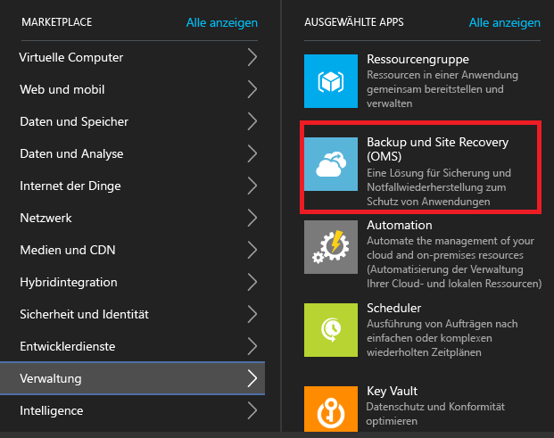
3. Geben Sie unter **Name**einen Anzeigenamen an, mit dem der Tresor identifiziert wird. Wenn Sie mehrere Abonnements haben, müssen Sie ein Abonnement auswählen.
4. [Erstellen Sie eine Ressourcengruppe](../resource-group-template-deploy-portal.md), oder wählen Sie eine vorhandene Ressourcengruppe aus. Geben Sie eine Azure-Region an. Computer werden in dieser Region repliziert. Sie finden eine Liste der unterstützten Regionen unter Geografische Verfügbarkeit auf der Seite [Azure Site Recovery – Preisübersicht](https://azure.microsoft.com/pricing/details/site-recovery/)
5. Wenn Sie schnell über das Dashboard auf den Tresor zugreifen möchten, klicken Sie auf **An Dashboard anheften** > **Tresor erstellen**.

    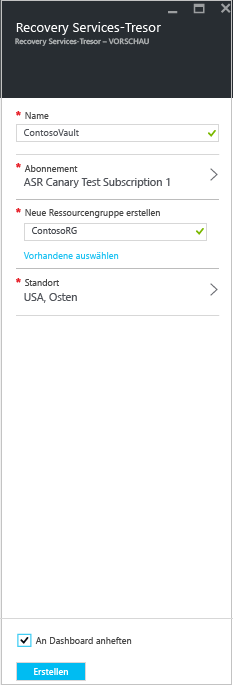

Der neue Tresor wird unter **Dashboard** > **Alle Ressourcen** und auf dem Hauptblatt **Recovery Services-Tresore** angezeigt.

## Erste Schritte

Site Recovery verfügt über eine Benutzeroberfläche für die ersten Schritte, damit Sie die Bereitstellung so schnell wie möglich durchführen können. Im Rahmen der ersten Schritte werden die Voraussetzungen überprüft, und Sie werden in der richtigen Reihenfolge durch die Schritte für die Site Recovery-Bereitstellung geführt.

Sie wählen den Typ der Computer aus, die Sie replizieren möchten, und geben an, wonach sie repliziert werden sollen. Sie richten lokale Server, Azure-Speicherkonten und Netzwerke ein. Sie erstellen Replikationsrichtlinien und führen die Kapazitätsplanung durch. Nach der Einrichtung Ihrer Infrastruktur aktivieren Sie die Replikation für virtuelle Computer. Sie können Failover für bestimmte Computer ausführen oder Wiederherstellungspläne erstellen, um das Failover für mehrere Computer durchzuführen.

Beginnen Sie mit den ersten Schritten, indem Sie auswählen, wie Sie Site Recovery bereitstellen möchten. Der Ablauf der ersten Schritte kann je nach Replikationsanforderungen leicht variieren.

## Schritt 1: Auswählen der Schutzziele
Wählen Sie aus, was Sie replizieren möchten und wohin die Daten repliziert werden sollen.

1. Wählen Sie auf dem Blatt **Recovery Services-Tresore** Ihren Tresor aus, und klicken Sie auf **Einstellungen**.
2. Klicken Sie unter **Erste Schritte** auf **Site Recovery** > **Schritt 1: Bereiten Sie die Infrastruktur vor** > **Schutzziel**.

    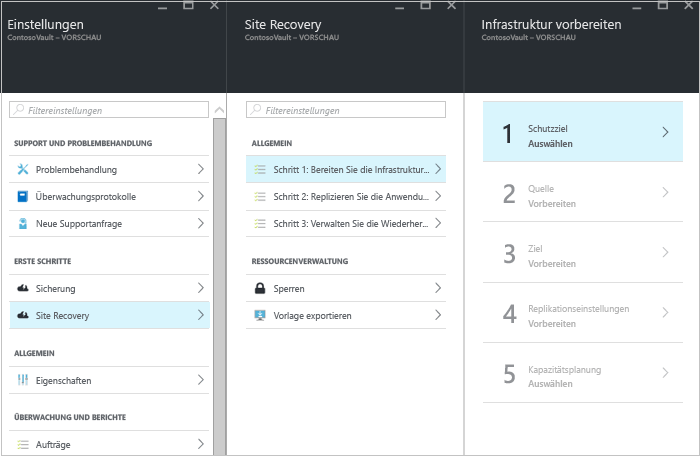
3. Wählen Sie unter **Schutzziel** die Option **To Azure** (Zu Azure) und dann **Yes, with Hyper-V** (Ja, mit Hyper-V) aus. Wählen Sie **Ja** , um zu bestätigen, dass Sie VMM zum Verwalten von Hyper-V-Hosts und des Wiederherstellungsstandorts verwenden. Klicken Sie dann auf **OK**.

    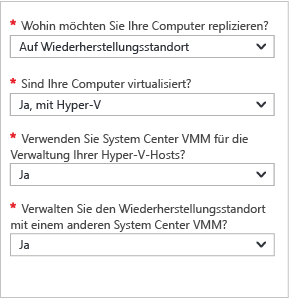

## Schritt 2: Einrichten der Quellumgebung
Installieren Sie den Azure Site Recovery-Anbieter auf dem VMM-Server, und registrieren Sie den Server im Tresor. Installieren Sie den Azure Recovery Services-Agent auf den Hyper-V-Hosts.

1. Klicken Sie auf **Schritt 2: Bereiten Sie die Infrastruktur vor** > **Quelle**.

    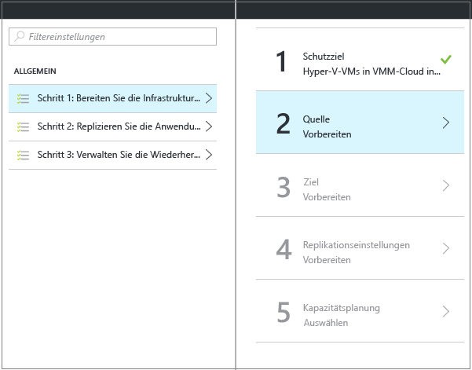
2. Klicken Sie unter **Quelle vorbereiten** auf **+ VMM**, um einen VMM-Server hinzuzufügen.

    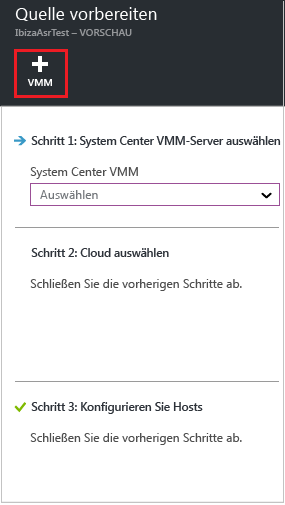
3. Vergewissern Sie sich auf dem Blatt **Server hinzufügen**, dass unter **Servertyp** der Eintrag **System Center-VMM-Server** angezeigt wird und dass der VMM-Server die [Voraussetzungen und URL-Anforderungen](#on-premises-prerequisites) erfüllt.
4. Laden Sie die Installationsdatei für den Azure Site Recovery-Anbieter herunter.
5. Laden Sie den Registrierungsschlüssel herunter. Sie benötigen diese Angaben beim Ausführen des Setups. Der Schlüssel ist nach der Erstellung fünf Tage lang gültig.

    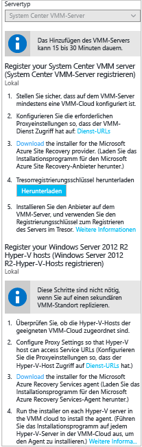
6. Installieren Sie den Azure Site Recovery-Anbieter auf dem VMM-Server.

### Einrichten des Azure Site Recovery-Anbieters
1. Führen Sie die Setupdatei für den Anbieter aus.
2. Unter **Microsoft Update** können Sie Updates aktivieren, damit Updates für den Anbieter gemäß Ihrer Microsoft Update-Richtlinie installiert werden.
3. Ändern Sie unter **Installation** den Speicherort für die Anbieterinstallation, oder akzeptieren Sie den Standardspeicherort, und klicken Sie auf **Installieren**.

    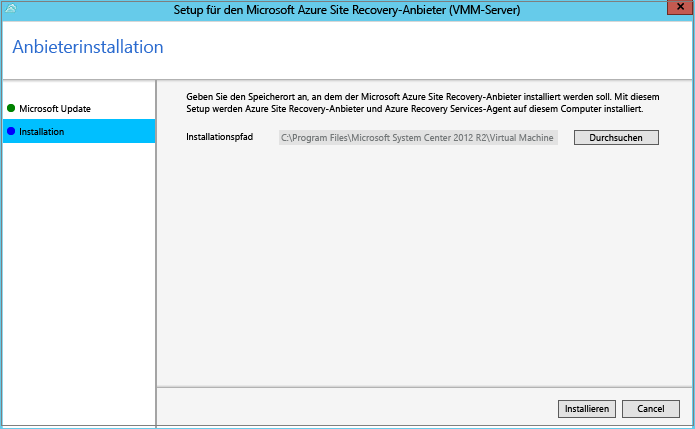
4. Klicken Sie nach Abschluss der Installation auf **Registrieren**, um den VMM-Server im Tresor zu registrieren.
5. Klicken Sie auf der Seite **Tresoreinstellungen** auf **Durchsuchen**, um die Tresorschlüsseldatei auszuwählen. Geben Sie das Azure Site Recovery-Abonnement und den Tresornamen an.

    
6. Geben Sie unter **Internetverbindung**an, wie für den Anbieter, der auf dem VMM-Server ausgeführt wird, über das Internet eine Verbindung mit Site Recovery hergestellt wird.

   * Wenn der Anbieter eine direkte Verbindung herstellen soll, wählen Sie **Direkt mit Azure Site Recovery verbinden (ohne Proxyserver)** aus.
   * Wenn für den vorhandenen Proxy eine Authentifizierung erforderlich ist oder wenn Sie einen benutzerdefinierten Proxy verwenden möchten, wählen Sie **Unter Verwendung eines Proxyservers mit Azure Site Recovery verbinden** aus.
   * Geben Sie bei einem benutzerdefinierten Proxy die Adresse, den Port und Anmeldeinformationen ein.
   * Bei Verwendung eines Proxys sollten Sie die unter [Voraussetzungen](#on-premises-prerequisites) beschriebenen URLs bereits zugelassen haben.
   * Wenn Sie einen benutzerdefinierten Proxy verwenden, wird ein ausführendes VMM-Konto (DRAProxyAccount) automatisch mit den angegebenen Proxyanmeldeinformationen erstellt. Konfigurieren Sie den Proxyserver so, dass dieses Konto erfolgreich authentifiziert werden kann. In der VMM-Konsole können die Einstellungen des ausführenden VMM-Kontos geändert werden. Erweitern Sie unter **Einstellungen** die Option **Sicherheit** > **Ausführende Konten**, und ändern Sie das Kennwort für DRAProxyAccount. Sie müssen den VMM-Dienst neu starten, damit diese Einstellung wirksam wird.

     
7. Akzeptieren oder ändern Sie den Speicherort eines SSL-Zertifikats, das für die Datenverschlüsselung automatisch generiert wird. Dieses Zertifikat wird verwendet, wenn Sie Datenverschlüsselung für eine Cloud im Azure Site Recovery-Portal aktivieren. Bewahren Sie dieses Zertifikat sicher auf. Wenn Sie ein Failover zu Azure ausführen, benötigen Sie es für die Entschlüsselung, falls die Datenverschlüsselung aktiviert ist.
8. Geben Sie unter **Servername**einen Anzeigenamen ein, um den VMM-Server im Tresor zu identifizieren. Geben Sie in einer Clusterkonfiguration den Rollennamen des VMM-Clusters an.
9. Aktivieren Sie die Option **Cloudmetadaten synchronisieren**, wenn Metadaten für alle Clouds auf dem VMM-Server mit dem Tresor synchronisiert werden sollen. Diese Aktion muss für jeden VMM-Server nur einmal ausgeführt werden. Wenn Sie nicht alle Clouds synchronisieren möchten, können Sie diese Einstellung deaktiviert lassen und in den Cloudeigenschaften in der VMM-Konsole jede Cloud einzeln synchronisieren. Klicken Sie auf **Registrieren** , um den Prozess abzuschließen.

    
10. Die Registrierung beginnt. Nach Abschluss der Registrierung wird der Server auf dem Blatt **Einstellungen** > **Server** im Tresor angezeigt.

#### Befehlszeileninstallation für den Azure Site Recovery-Anbieter
Der Azure Site Recovery-Anbieter kann über die Befehlszeile installiert werden. Mit dieser Methode kann der Anbieter in Server Core für Windows Server 2012 R2 installiert werden.

1. Laden Sie die Installationsdatei und den Registrierungsschlüssel des Anbieters in einen Ordner herunter. Beispiel: C:\ASR.
2. Extrahieren Sie über eine Eingabeaufforderung mit erhöhten Rechten das Installationsprogramm des Anbieters, indem Sie diese Befehle ausführen:

            C:\Windows\System32> CD C:\ASR
            C:\ASR> AzureSiteRecoveryProvider.exe /x:. /q
3. Führen Sie diesen Befehl aus, um die Komponenten zu installieren:

            C:\ASR> setupdr.exe /i
4. Führen Sie anschließend die folgenden Befehle aus, um den Server im Tresor zu registrieren:

        CD C:\Program Files\Microsoft System Center 2012 R2\Virtual Machine Manager\bin
        C:\Program Files\Microsoft System Center 2012 R2\Virtual Machine Manager\bin\> DRConfigurator.exe /r  /Friendlyname <friendly name of the server> /Credentials <path of the credentials file> /EncryptionEnabled <full file name to save the encryption certificate>       

Hierbei gilt:

* **/Credentials**: erforderlicher Parameter zum Angeben des Speicherorts der Registrierungsschlüsseldatei.  
* **/FriendlyName**: erforderlicher Parameter für den Namen des Hyper-V-Hostservers, der im Azure Site Recovery-Portal angezeigt wird.
* * **/EncryptionEnabled**: optionaler Parameter beim Replizieren von Hyper-V-VMs in VMM-Clouds in Azure. Geben Sie an, ob Sie virtuelle Computer in Azure verschlüsseln möchten (Verschlüsselung im ruhenden Zustand). Stellen Sie sicher, dass der Dateiname über die Erweiterung **.pfx** verfügt. Die Verschlüsselung ist standardmäßig deaktiviert.
* **/proxyAddress**: optionaler Parameter, der die Adresse des Proxyservers angibt.
* **/proxyport**: optionaler Parameter, der den Port des Proxyservers angibt.
* **/proxyUsername**: optionaler Parameter, der den Proxybenutzernamen angibt (sofern für den Proxy eine Authentifizierung erforderlich ist).
* **/proxyPassword**: optionaler Parameter, der das Kennwort für die Authentifizierung mit dem Proxyserver angibt (sofern für den Proxy eine Authentifizierung erforderlich ist).

### Installieren des Azure Recovery Services-Agent auf den Hyper-V-Hosts
1. Nachdem Sie den Anbieter eingerichtet haben, müssen Sie die Installationsdatei für den Azure Recovery Services-Agent herunterladen. Führen Sie das Setup auf jedem Hyper-V-Server in der VMM-Cloud aus.

    
2. Klicken Sie in der **Voraussetzungsüberprüfung** auf **Weiter**. Alle fehlenden Komponenten, die Voraussetzung sind, werden automatisch installiert.

    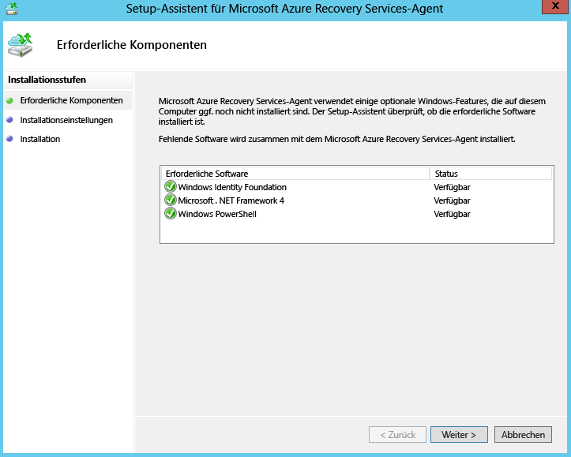
3. Übernehmen oder ändern Sie in den **Installationseinstellungen** den Installationsspeicherort und den Cachespeicherort. Sie können den Cache auf einem Laufwerk konfigurieren, auf dem mindestens 5 GB Speicherplatz verfügbar sind, aber wir raten Ihnen zu einem Cachelaufwerk mit mindestens 600 GB freiem Speicherplatz. Klicken Sie dann auf **Weiter**.
4. Klicken Sie nach Abschluss der Installation auf **Schließen** , um den Vorgang zu beenden.

    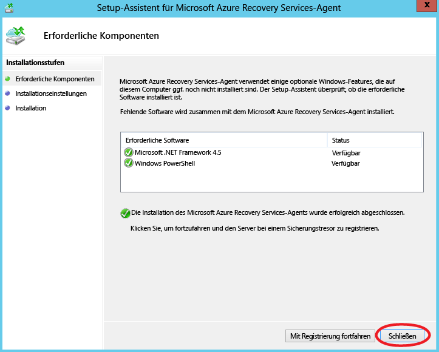

#### Befehlszeileninstallation für den Azure Site Recovery Services-Agent
Sie können den Microsoft Azure Recovery Services-Agent mit dem folgenden Befehl über die Befehlszeile installieren:

     marsagentinstaller.exe /q /nu

#### Einrichten des Internetzugriffs auf Site Recovery per Proxy auf Hyper-V-Hosts
Für den Recovery Services-Agent, der auf Hyper-V-Hosts ausgeführt wird, ist für die VM-Replikation Internetzugriff auf Azure erforderlich. Gehen Sie bei der Einrichtung wie folgt vor, wenn Sie über einen Proxy auf das Internet zugreifen:

1. Öffnen Sie das Microsoft Azure Backup-MMC-Snap-In auf dem Hyper-V-Host. Standardmäßig ist auf dem Desktop oder unter „C:\Programme\Microsoft Azure Recovery Services Agent\bin\wabadmin“ eine Verknüpfung für Microsoft Azure Backup verfügbar.
2. Klicken Sie im Snap-In auf **Eigenschaften ändern**.
3. Geben Sie auf der Registerkarte **Proxykonfiguration** Informationen zum Proxyserver an.

    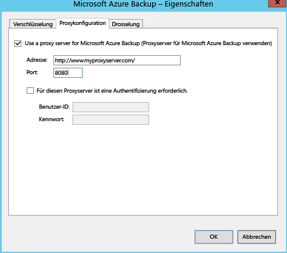
4. Vergewissern Sie sich, dass der Agent die unter [Voraussetzungen](#on-premises-prerequisites) beschriebenen URLs erreichen kann.

## Schritt 3: Einrichten der Zielumgebung
Geben Sie das Azure-Speicherkonto, das für die Replikation verwendet werden soll, und das Azure-Netzwerk an, mit dem Azure-VMs nach dem Failover eine Verbindung herstellen.

1. Klicken Sie auf **Infrastruktur vorbereiten** > **Ziel**, und wählen Sie das Abonnement und die Ressourcengruppe aus, in dem bzw. der Sie die virtuellen Computer erstellen möchten, für die ein Failover durchgeführt wurde. Wählen Sie das Bereitstellungsmodell aus, das in Azure für die virtuellen Computer verwendet werden soll, für die ein Failover durchgeführt wurde (klassisch oder Resource Manager).

    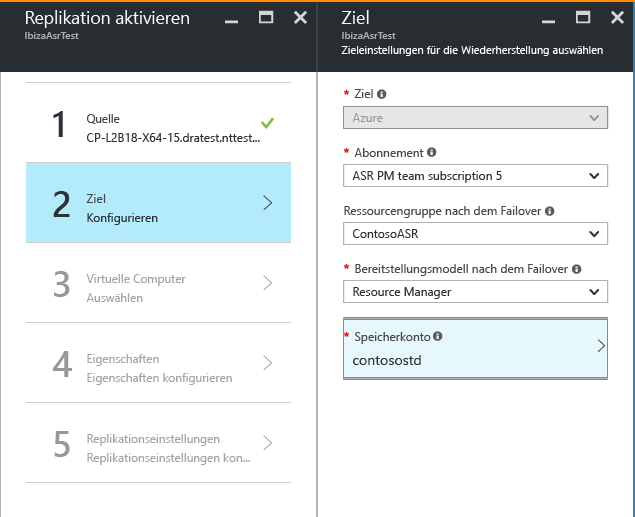

2. Site Recovery prüft, ob Sie über ein oder mehrere kompatible Azure-Speicherkonten und -Netzwerke verfügen.
    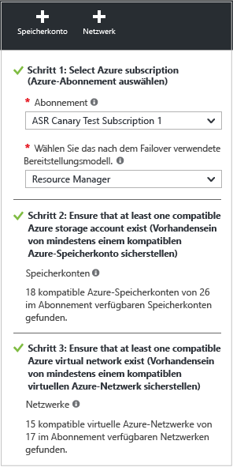

4. Falls Sie noch kein Speicherkonto erstellt haben und dies unter Verwendung von Resource Manager nachholen möchten, können Sie auf **+Speicherkonto** klicken und diesen Schritt direkt ausführen.  Geben Sie auf dem Blatt **Speicherkonto erstellen** einen Kontonamen, einen Typ, ein Abonnement und einen Standort an. Das Konto sollte sich an demselben Standort wie der Recovery Services-Tresor befinden.

   

   Beachten Sie Folgendes:

   * Wenn Sie ein Speicherkonto mit dem klassischen Modell erstellen möchten, verwenden Sie das Azure-Portal. [Weitere Informationen](../storage/storage-create-storage-account-classic-portal.md)
   * Wenn Sie ein Storage Premium-Konto für replizierte Daten verwenden, müssen Sie ein weiteres Standardspeicherkonto zum Speichern von Replikationsprotokollen einrichten, mit denen laufende Änderungen lokaler Daten erfasst werden.
5. Falls Sie noch kein Azure-Netzwerk erstellt haben und dies unter Verwendung von Resource Manager nachholen möchten, können Sie auf **+Netzwerk** klicken und diesen Schritt direkt ausführen. Geben Sie auf dem Blatt **Virtuelles Netzwerk erstellen** einen Netzwerknamen, einen Adressbereich, Subnetzdetails, ein Abonnement und einen Standort an. Das Netzwerk sollte sich an demselben Standort wie der Recovery Services-Tresor befinden.

   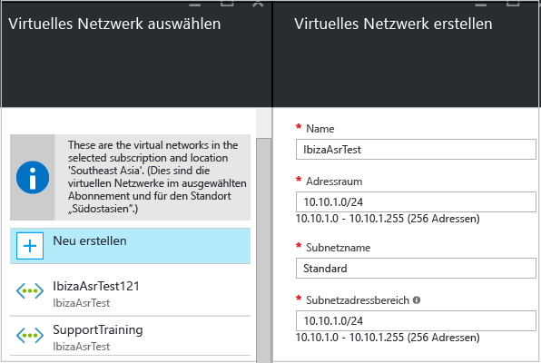

   Falls Sie ein Netzwerk mit dem klassischen Modell erstellen möchten, verwenden Sie hierfür das Azure-Portal. [detaillierte Kapazitätsplanung](../virtual-network/virtual-networks-create-vnet-classic-pportal.md)

### Konfigurieren der Netzwerkzuordnung
* [kurze Übersicht](#prepare-for-network-mapping) über die Abläufe bei der Netzwerkzuordnung durch. [Hier](site-recovery-network-mapping.md) finden Sie ausführlichere Informationen.
* Vergewissern Sie sich, dass virtuelle Computer auf dem VMM-Server über eine Verbindung mit einem VM-Netzwerk verfügen und dass Sie mindestens ein virtuelles Azure-Netzwerk erstellt haben. Einem einzelnen Azure-Netzwerk können mehrere VM-Netzwerke zugeordnet werden.

Konfigurieren Sie die Zuordnung wie folgt:

1. Klicken Sie unter **Einstellungen** > **Site Recovery-Infrastruktur** > **Netzwerkzuordnungen** > **Netzwerkzuordnung** auf das Symbol **+Netzwerkzuordnung**.

    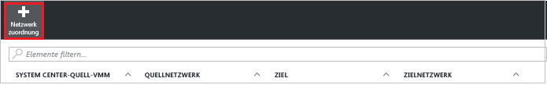
2. Wählen Sie unter **Netzwerkzuordnung hinzufügen** den VMM-Quellserver und **Azure** als Ziel aus.
3. Überprüfen Sie das Abonnement und das Bereitstellungsmodell nach einem Failover.
4. Wählen Sie unter **Quellnetzwerk**das lokale VM-Quellnetzwerk aus, das Sie über die Liste des VMM-Servers zuordnen möchten.
5. Wählen Sie unter **Zielnetzwerk**das Azure-Netzwerk aus, in dem Replikate von Azure-VMs nach der Erstellung angeordnet werden. Klicken Sie dann auf **OK**.

    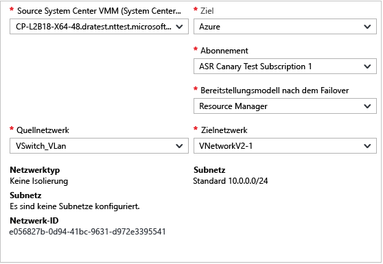

Wenn die Netzwerkzuordnung beginnt, passiert Folgendes:

* Vorhandene VMs im VM-Quellnetzwerk werden mit dem Zielnetzwerk verbunden, wenn die Zuordnung beginnt. Neue VMs, die mit dem VM-Quellnetzwerk verbunden sind, werden mit dem zugeordneten Azure-Netzwerk verbunden, wenn die Replikation durchgeführt wird.
* Wenn Sie eine vorhandene Netzwerkzuordnung ändern, verwenden virtuelle Replikatcomputer bei der Verbindungsherstellung die neuen Einstellungen.
* Fall das Zielnetzwerk mehrere Subnetze enthält und eines dieser Subnetze den gleichen Namen besitzt wie das Subnetz des virtuellen Quellcomputers, stellt der virtuelle Replikatcomputer nach dem Failover eine Verbindung mit diesem Zielsubnetz her.
* Ist kein Zielsubnetz mit einem übereinstimmenden Namen vorhanden, stellt der virtuelle Computer eine Verbindung mit dem ersten Subnetz im Netzwerk her.

## Schritt 4: Einrichten der Replikationseinstellungen
1. Klicken Sie zum Erstellen einer neuen Replikationsrichtlinie auf **Infrastruktur vorbereiten** > **Replikationseinstellungen** > **+Erstellen und zuordnen**.

    
2. Geben Sie unter **Richtlinie erstellen und zuordnen**einen Richtliniennamen an.
3. Geben Sie unter **Kopierhäufigkeit**an, wie oft Sie Deltadaten nach der ersten Replikation replizieren möchten (alle 30 Sekunden, nach 5 Minuten oder nach 15 Minuten).
4. Geben Sie unter **Aufbewahrungszeitraum des Wiederherstellungspunkts**das Aufbewahrungszeitfenster für die einzelnen Wiederherstellungspunkte in Stunden an. Geschützte Computer können innerhalb eines Zeitfensters an einem beliebigen Punkt wiederhergestellt werden.
5. Geben Sie unter **App-konsistente Momentaufnahmehäufigkeit**an, wie häufig (1 bis 12 Stunden) Wiederherstellungspunkte erstellt werden sollen, die anwendungskonsistente Momentaufnahmen enthalten. Hyper-V verwendet zwei Momentaufnahmen: eine Standard-Momentaufnahme, die eine inkrementelle Momentaufnahme des gesamten virtuellen Computers bereitstellt, und eine anwendungskonsistente Momentaufnahme, die eine Zeitpunkt-Momentaufnahme der Anwendungsdaten innerhalb des virtuellen Computers erfasst. Anwendungskonsistente Momentaufnahmen verwenden den Volumeschattenkopie-Dienst (Volume Shadow Copy Service, VSS), um sicherzustellen, dass Anwendungen sich bei der Erstellung der Momentaufnahme in einem konsistenten Zustand befinden. Beachten Sie, dass die Leistung von Anwendungen auf virtuellen Quellcomputern durch die Aktivierung anwendungskonsistenter Momentaufnahmen beeinträchtigt wird. Stellen Sie sicher, dass der festgelegte Wert kleiner als die konfigurierte Anzahl der zusätzlichen Wiederherstellungspunkte ist.
6. Geben Sie unter **Startzeit der ersten Replikation**an, wann die erste Replikation starten soll. Da die Replikation über Ihre Internetbandbreite durchgeführt wird, ist es ratsam, sie außerhalb der Zeiten mit der höchsten Arbeitsbelastung einzuplanen.
7. Geben Sie unter **In Azure gespeicherte Daten verschlüsseln**an, ob ruhende Daten im Azure-Speicher verschlüsselt werden sollen. Klicken Sie dann auf **OK**.

    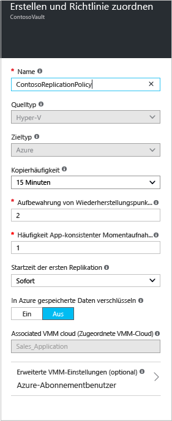
8. Wenn Sie eine neue Richtlinie erstellen, wird sie der VMM-Cloud automatisch zugeordnet. Klicken Sie auf **OK**. Sie können dieser Replikationsrichtlinie unter **Einstellungen** > **Replikation** > „<Richtlinienname>“ > **VMM-Cloud zuordnen** zusätzliche VMM-Clouds (und die darin enthaltenen VMs) zuordnen.

    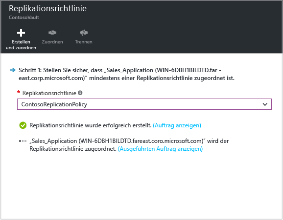

## Schritt 5: Kapazitätsplanung
Nachdem Sie nun Ihre grundlegende Infrastruktur eingerichtet haben, können Sie sich mit der Kapazitätsplanung beschäftigen und ermitteln, ob Sie zusätzliche Ressourcen benötigen.

Site Recovery verfügt über einen Kapazitätsplaner, der Sie dabei unterstützt, die richtigen Ressourcen für die Quellumgebung, die Site Recovery-Komponenten, das Netzwerk und den Speicher zuzuordnen. Sie können den Planer im Schnellmodus für Schätzungen ausführen, die auf einer durchschnittlichen Anzahl von VMs, Datenträgern und Speicher basieren, oder im ausführlichen Modus, in dem Sie Zahlen auf Workloadebene eingeben. Vorbereitung:

* Sammeln Sie Informationen zu Ihrer Replikationsumgebung, z.B. VMs, Datenträger pro VM und Speicher pro Datenträger.
* Schätzen Sie die tägliche Änderungsrate für replizierte Daten. Zur Unterstützung können Sie den [Capacity Planner für Hyper-V-Replikat](https://www.microsoft.com/download/details.aspx?id=39057) verwenden.

1. Klicken Sie auf **Herunterladen**, um das Tool herunterzuladen, und führen Sie es anschließend aus. [entsprechenden Artikel](site-recovery-capacity-planner.md) durch.
2. Wählen Sie anschließend unter **Haben Sie den Capacity Planner ausgeführt?** die Option **Ja** aus.

   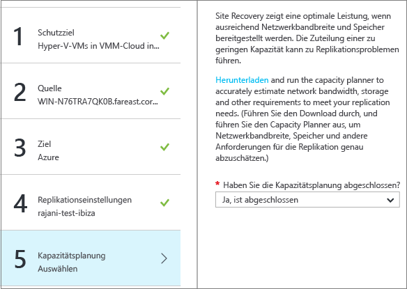

### Aspekte der Netzwerkbandbreite
Sie können den Capacity Planner verwenden, um die Bandbreite zu berechnen, die Sie für die Replikation benötigen (erste Replikation und dann Deltareplikation). Zur Steuerung der verwendeten Bandbreite für die Replikation stehen verschiedene Optionen zur Verfügung:

* **Bandbreite einschränken**: Hyper-V-Datenverkehr, der an einem sekundären Standort repliziert wird, verläuft über einen speziellen Hyper-V-Host. Sie können die Bandbreite auf dem Hostserver drosseln.
* **Bandbreite optimieren**: Sie können beeinflussen, wie viel Bandbreite für die Replikation verwendet wird, indem Sie einige Registrierungsschlüssel nutzen.

#### Bandbreite einschränken
1. Öffnen Sie das Microsoft Azure Backup-MMC-Snap-In auf dem Hyper-V-Hostserver. Standardmäßig ist auf dem Desktop oder unter „C:\Programme\Microsoft Azure Recovery Services Agent\bin\wabadmin“ eine Verknüpfung für Microsoft Azure Backup verfügbar.
2. Klicken Sie im Snap-In auf **Eigenschaften ändern**.
3. Wählen Sie auf der Registerkarte **Drosselung** die Option **Internet-Bandbreiteneinschränkung für Sicherungsvorgänge aktivieren** aus, und legen Sie die Grenzwerte für Geschäftszeiten und arbeitsfreie Zeiten fest. Der gültige Bereich reicht von 512 KBit/s bis 102 MBit/s.

    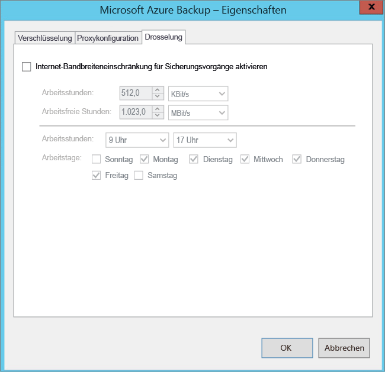

Sie können auch das Cmdlet [Set-OBMachineSetting](https://technet.microsoft.com/library/hh770409.aspx) verwenden, um die Drosselung festzulegen. Hier ein Beispiel:

    $mon = [System.DayOfWeek]::Monday
    $tue = [System.DayOfWeek]::Tuesday
    Set-OBMachineSetting -WorkDay $mon, $tue -StartWorkHour "9:00:00" -EndWorkHour "18:00:00" -WorkHourBandwidth  (512*1024) -NonWorkHourBandwidth (2048*1024)

**Set-OBMachineSetting -NoThrottle** gibt an, dass keine Drosselung erforderlich ist.

#### Netzwerkbandbreite beeinflussen
Mit dem Registrierungswert **UploadThreadsPerVM** wird die Anzahl von Threads gesteuert, die für die Datenübertragung (erste Replikation oder Deltareplikation) eines Datenträgers verwendet werden. Bei einem höheren Wert wird die Netzwerkbandbreite für die Replikation erhöht. Mit dem Registrierungswert **DownloadThreadsPerVM** wird die Anzahl von Threads angegeben, die während des Failbacks für die Datenübertragung verwendet werden.

1. Navigieren Sie in der Registrierung zu **HKEY_LOCAL_MACHINE\SOFTWARE\Microsoft\Windows Azure Backup\Replication**.

   * Ändern Sie den Wert **UploadThreadsPerVM** (oder erstellen Sie den Schlüssel, falls er nicht vorhanden ist), um die für die Datenträgerreplikation verwendeten Threads zu steuern.
   * Ändern Sie den Wert **DownloadThreadsPerVM** (oder erstellen Sie den Schlüssel, falls er nicht vorhanden ist), um die Threads zu steuern, die für den Failback-Datenverkehr von Azure verwendet werden.
2. Der Standardwert ist 4. In einem absichtlich mit großen Reserven ausgestatteten Netzwerk müssen die Standardwerte dieser Registrierungsschlüssel geändert werden. Der maximale Wert beträgt 32. Überwachen Sie den Datenverkehr, um den Wert zu optimieren.

## Schritt 6: Aktivieren der Replikation
Aktivieren Sie die Replikation jetzt wie folgt:

1. Klicken Sie auf **Schritt 2: Replizieren Sie die Anwendung** > **Quelle**. Klicken Sie nach der erstmaligen Aktivierung der Replikation im Tresor auf **+Replizieren**, um die Replikation für weitere Computer zu aktivieren.

    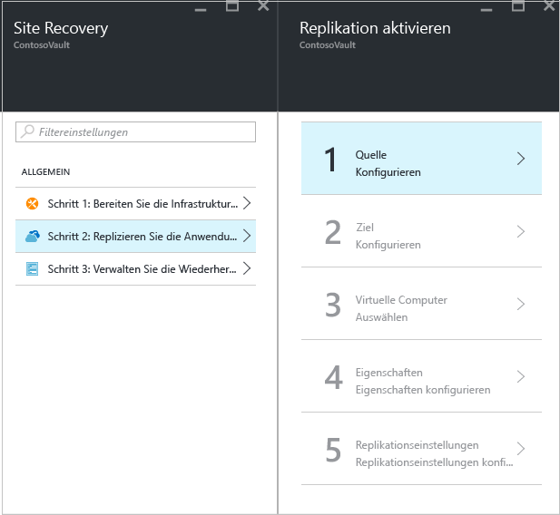
2. Wählen Sie auf dem Blatt **Quelle** den VMM-Server und die Cloud aus, in der sich die Hyper-V-Hosts befinden. Klicken Sie dann auf **OK**.

    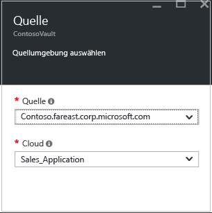
3. Wählen Sie unter **Ziel** das Abonnement, das Bereitstellungsmodell für die Zeit nach dem Failover und das Speicherkonto für die replizierten Daten aus.

    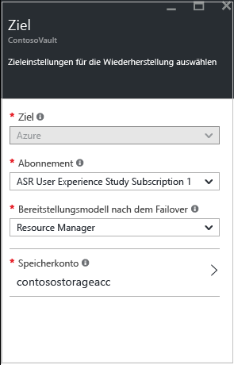
4. Wählen Sie das Speicherkonto aus, das Sie verwenden möchten. Falls Sie keines der bereits vorhandenen Speicherkonten verwenden möchten, können Sie ein [Speicherkonto erstellen](#set-up-an-azure-storage-account). Klicken Sie zum Erstellen eines Speicherkontos mit dem Resource Manager-Modell auf **Neu erstellen**. Wenn Sie ein Speicherkonto mit dem klassischen Modell erstellen möchten, verwenden Sie das [Azure-Portal](../storage/storage-create-storage-account-classic-portal.md). Klicken Sie dann auf **OK**.
5. Wählen Sie das Azure-Netzwerk und das Subnetz aus, mit dem virtuelle Azure-Computer, die nach einem Failover erstellt werden, eine Verbindung herstellen. Wählen Sie die Option **Jetzt für die ausgewählten Computer konfigurieren** aus, um die Netzwerkeinstellung auf alle Computer anzuwenden, die geschützt werden sollen. Wählen Sie **Später konfigurieren** aus, um das Azure-Netzwerk pro Computer auszuwählen. Falls Sie keines der bereits vorhandenen Netzwerke verwenden möchten, können Sie [ein Netzwerk erstellen](#set-up-an-azure-network). Klicken Sie zum Erstellen eines Netzwerks mit dem Resource Manager-Modell auf **Neu erstellen**. Falls Sie ein Netzwerk mit dem klassischen Modell erstellen möchten, verwenden Sie hierfür das [Azure-Portal](../virtual-network/virtual-networks-create-vnet-classic-pportal.md). Wählen Sie, falls zutreffend, ein Subnetz aus. Klicken Sie dann auf **OK**.
6. Klicken Sie auf **Virtuelle Computer** > **Virtuelle Computer auswählen**, und wählen Sie die Computer aus, die Sie replizieren möchten. Sie können nur Computer auswählen, für die die Replikation aktiviert werden kann. Klicken Sie dann auf **OK**.

    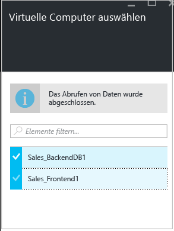
7. Geben Sie unter **Eigenschaften** > **Eigenschaften konfigurieren**das Betriebssystem für die ausgewählten VMs und den Betriebssystem-Datenträger aus. Klicken Sie dann auf **OK**. Sie können später weitere Eigenschaften festlegen.

    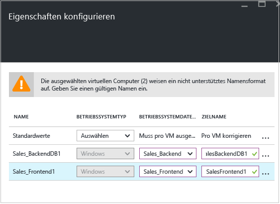
8. Wählen Sie unter **Replikationseinstellungen** > **Replikationseinstellungen konfigurieren** die Replikationsrichtlinie aus, die Sie für die geschützten VMs anwenden möchten. Klicken Sie dann auf **OK**. Sie können die Replikationsrichtlinie unter **Einstellungen** > **Replikationsrichtlinien** > Richtlinienname > **Einstellungen bearbeiten** ändern. Von Ihnen vorgenommene Änderungen werden für Computer, die bereits repliziert werden, und für neue Computer verwendet.

   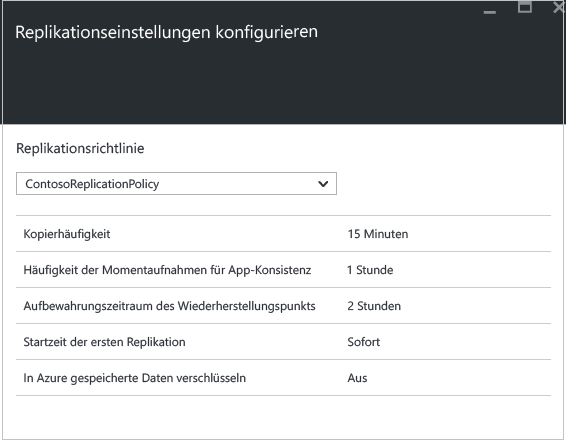

Sie können den Fortschritt des Auftrags **Schutz aktivieren** unter **Einstellungen** > **Aufträge** > **Site Recovery-Aufträge** verfolgen. Nachdem der Auftrag **Schutz abschließen** ausgeführt wurde, ist der Computer bereit für das Failover.

### Anzeigen und Verwalten von VM-Eigenschaften
Es wird empfohlen, dass Sie die Eigenschaften des Quellcomputers überprüfen. Beachten Sie, dass der Name des virtuellen Azure-Computers die [Anforderungen für virtuelle Azure-Computer](site-recovery-best-practices.md#azure-virtual-machine-requirements)erfüllen muss.

1. Klicken Sie auf **Einstellungen** > **Geschützte Elemente** > **Replizierte Elemente**, und wählen Sie den Computer aus, um Details dazu anzuzeigen.

    
2. Unter **Eigenschaften** können Sie die Informationen zur Replikation und zum Failover für den virtuellen Computer anzeigen.

    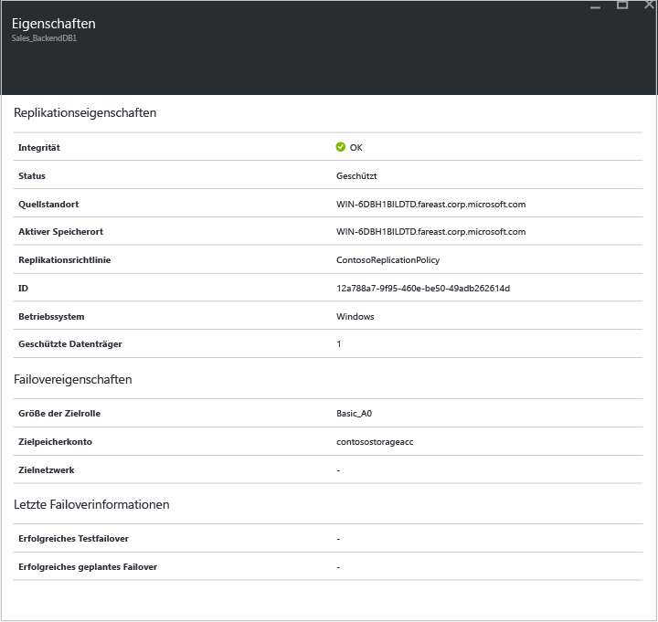
3. Unter **Compute und Netzwerk** > **Compute-Eigenschaften** können Sie den Namen und die Zielgröße des virtuellen Azure-Computers angeben. Ändern Sie ggf. den Namen, damit er die [Azure-Anforderungen](site-recovery-best-practices.md#azure-virtual-machine-requirements) erfüllt. Sie können auch Informationen zum Zielnetzwerk, zum Subnetz sowie zur IP-Adresse anzeigen und ändern, die dem virtuellen Azure-Computer zugewiesen wird. Beachten Sie Folgendes:

   * Sie können die Ziel-IP-Adresse festlegen. Wenn Sie keine Adresse angeben, wird für den Computer, für den das Failover durchgeführt wurde, DHCP verwendet. Wenn Sie eine Adresse festlegen, die beim Failover nicht verfügbar ist, tritt beim Failover ein Fehler auf. Dieselbe Ziel-IP-Adresse kann für das Testfailover verwendet werden, wenn die Adresse im Testfailover-Netzwerk verfügbar ist.
   * Die Anzahl der Netzwerkkarten hängt von der Größe ab, die Sie für den virtuellen Zielcomputer angeben. Hierbei gilt Folgendes:

     * Wenn die Anzahl der Netzwerkkarten des Quellcomputers maximal der Anzahl der Netzwerkkarten entspricht, die für die Größe des Zielcomputers zulässig ist, hat der Zielcomputer die gleiche Anzahl von Netzwerkkarten wie der Quellcomputer.
     * Wenn die Anzahl von Netzwerkadaptern für den virtuellen Quellcomputer die maximal zulässige Anzahl für die Größe des Zielcomputers übersteigt, wird die Anzahl verwendet, die maximal für die Größe des Zielcomputers zulässig ist.
     * Ein Beispiel: Wenn ein Quellcomputer zwei Netzwerkkarten besitzt und der Zielcomputer aufgrund seiner Größe vier Netzwerkkarten unterstützt, erhält der Zielcomputer zwei Netzwerkkarten. Wenn der Quellcomputer dagegen zwei Netzwerkadapter besitzt und der Zielcomputer aufgrund seiner Größe nur einen Adapter unterstützt, erhält der Zielcomputer nur einen Adapter.     
     * Wenn der virtuelle Computer über mehrere Netzwerkkarten verfügt, werden alle mit dem gleichen Netzwerk verbunden.

     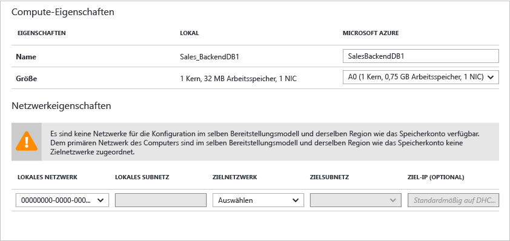
4. Unter **Datenträger** werden das Betriebssystem und die Datenträger auf der VM angezeigt, die repliziert wird.

## Schritt 7: Testen der Bereitstellung
Zum Testen der Bereitstellung können Sie ein Testfailover für einen einzelnen virtuellen Computer durchführen. Alternativ können Sie einen Wiederherstellungsplan erstellen, der mehrere virtuelle Computer enthält.

### Vorbereiten des Failovers
* Zum Ausführen eines Testfailovers empfehlen wir Folgendes: Erstellen Sie ein neues Azure-Zielnetzwerk, das von Ihrem Azure-Produktionsnetzwerk isoliert ist. Dies ist das Standardverhalten bei der Erstellung eines neuen Netzwerks in Azure. [Erfahren Sie mehr](site-recovery-failover.md#run-a-test-failover) über die Ausführung von Testfailovervorgängen.
* Installieren Sie den Azure-Agent auf dem geschützten Computer, um für das Failover zu Azure die beste Leistung zu erzielen. Hierdurch wird der Startvorgang beschleunigt und die Problembehandlung vereinfacht. Installieren Sie den Agent für [Linux](https://github.com/Azure/WALinuxAgent) oder [Windows](http://go.microsoft.com/fwlink/?LinkID=394789).
* Zum vollständigen Testen der Bereitstellung benötigen Sie eine entsprechende Infrastruktur, damit der replizierte Computer wie erwartet funktioniert. Wenn Sie Active Directory und DNS testen möchten, können Sie einen virtuellen Computer als Domänencontroller mit DNS erstellen und per Azure Site Recovery zu Azure replizieren. Weitere Informationen finden Sie unter [Überlegungen zum Testfailover für Active Directory](site-recovery-active-directory.md#test-failover-considerations).
* Wenn Sie anstelle eines Testfailovers ein ungeplantes Failover durchführen möchten, beachten Sie Folgendes:

  * Fahren Sie primäre Computer nach Möglichkeit herunter, bevor Sie ein ungeplantes Failover ausführen. Dadurch wird sichergestellt, dass die Quell- und Replikatcomputer nicht gleichzeitig ausgeführt werden.
  * Beim Durchführen eines ungeplanten Failovers wird die Datenreplikation der primären Computer beendet. Das heißt, dass nach dem Beginn des Failovers keine Datenänderungen mehr übertragen werden. Außerdem wird ein ungeplantes Failover, das auf einem Wiederherstellungsplan basiert, auch dann bis zum Ende durchgeführt, wenn ein Fehler auftritt.

### Vorbereiten der Verbindungsherstellung mit Azure-VMs nach dem Failover
Gehen Sie wie folgt vor, wenn Sie die Verbindung mit Azure-VMs nach dem Failover per RDP herstellen möchten:

**Auf dem lokalen Computer vor dem Failover**:

* Aktivieren Sie für den Zugriff über das Internet RDP. Stellen Sie sicher, dass TCP- und UDP-Regeln für **Öffentlich** hinzugefügt werden, und stellen Sie sicher, dass RDP unter **Windows-Firewall** -> **Zugelassene Apps und Features** für alle Profile zugelassen ist.
* Aktivieren Sie für den Zugriff über eine Site-to-Site-Verbindung RDP auf dem Computer, und stellen Sie sicher, dass RDP unter **Windows-Firewall** -> **Zugelassene Apps und Features** für die Netzwerke vom Typ **Domäne** und **Privat** zugelassen ist.
* Installieren Sie den [Azure-VM-Agent](http://go.microsoft.com/fwlink/?LinkID=394789&clcid=0x409) auf dem lokalen Computer.
* Achten Sie darauf, dass die SAN-Richtlinie des Betriebssystems auf OnlineAll festgelegt ist. [Weitere Informationen](https://support.microsoft.com/kb/3031135)
* Deaktivieren Sie den IPSec-Dienst, bevor Sie das Failover durchführen.

**Auf der Azure-VM nach einem Failover**:

* Fügen Sie einen öffentlichen Endpunkt für das RDP-Protokoll (Port 3389) hinzu, und geben Sie die Anmeldeinformationen für die Anmeldung an.
* Stellen Sie sicher, dass keine Domänenrichtlinien vorhanden sind, die das Verbinden mit einem virtuellen Computer über eine öffentliche Adresse verhindern.
* Versuchen Sie, eine Verbindung herzustellen. Wenn Sie keine Verbindung herstellen können, sollten Sie überprüfen, ob der virtuelle Computer ausgeführt wird. Weitere Tipps zur Problembehandlung finden Sie in [diesem Artikel](http://social.technet.microsoft.com/wiki/contents/articles/31666.troubleshooting-remote-desktop-connection-after-failover-using-asr.aspx).

Gehen Sie wie folgt vor, wenn Sie nach dem Failover auf eine Azure-VM mit Linux über einen Secure Shell-Client (ssh) zugreifen möchten:

**Auf dem lokalen Computer vor dem Failover**:

* Stellen Sie sicher, dass der Secure Shell-Dienst auf der Azure-VM so festgelegt ist, dass er beim Systemstart automatisch gestartet wird.
* Überprüfen Sie, ob die Firewallregeln eine SSH-Verbindung damit zulassen.

**Auf der Azure-VM nach einem Failover**:

* In den Netzwerksicherheitsgruppen-Regeln auf dem virtuellen Computer nach dem Failover und für das Azure-Subnetz, mit dem der virtuelle Computer verbunden ist, müssen eingehende Verbindungen über den SSH-Port zulässig sein.
* Es sollte ein öffentlicher Endpunkt erstellt werden, um eingehende Verbindungen für den SSH-Port (standardmäßig TCP-Port 22) zuzulassen.
* Wenn auf den virtuellen Computer über eine VPN-Verbindung (ExpressRoute- oder Site-to-Site-VPN-Verbindung) zugegriffen wird, kann der Client verwendet werden, um per SSH eine direkte Verbindung mit dem virtuellen Computer herzustellen.

### Durchführen eines Test-Failovers
1. Klicken Sie zum Durchführen eines Failovers für einen einzelnen virtuellen Computer unter **Einstellungen** > **Replizierte Elemente** auf den virtuellen Computer und dann auf **+Testfailover**.
2. Klicken Sie zum Durchführen eines Failovers für einen Wiederherstellungsplan unter **Einstellungen** > **Wiederherstellungspläne** mit der rechten Maustaste auf den Plan, und klicken Sie dann auf **Testfailover**. Eine Anleitung zum Erstellen eines Wiederherstellungsplans finden Sie [hier](site-recovery-create-recovery-plans.md).
3. Wählen Sie unter **Testfailover** das Azure-Netzwerk aus, mit dem virtuelle Azure-Computer nach dem Failover eine Verbindung herstellen.
4. Klicken Sie auf **OK**, um den Failovervorgang zu starten. Sie können den Fortschritt verfolgen, indem Sie auf den virtuellen Computer klicken, um die Eigenschaften zu öffnen. Alternativ dazu können Sie unter **Einstellungen** > **Site Recovery-Aufträge** auf den Auftrag **Testfailover** klicken.
5. Gehen Sie wie folgt vor, wenn das Failover die Phase **Test abschließen** erreicht hat:

   1. Zeigen Sie den virtuellen Replikatcomputer im Azure-Portal an. Prüfen Sie, ob der virtuelle Computer erfolgreich startet.
   2. Wenn Sie den Zugriff auf virtuelle Computer über Ihr lokales Netzwerk eingerichtet haben, können Sie eine Remotedesktopverbindung mit dem virtuellen Computer herstellen.
   3. Klicken Sie auf **Test abschließen** , um den Test abzuschließen.
   4. Klicken Sie auf **Notizen**, um alle Beobachtungen im Zusammenhang mit dem Test-Failover zu erfassen und zu speichern.
   5. Klicken Sie auf **Das Testfailover ist abgeschlossen**. Bereinigen Sie die Testumgebung, um den virtuellen Testcomputer automatisch auszuschalten und ihn zu löschen.
   6. An diesem Punkt werden alle Elemente oder VMs gelöscht, die von Site Recovery während des Testfailovers automatisch erstellt wurden. Alle weiteren Elemente, die Sie für das Testfailover erstellt haben, werden nicht gelöscht.

      > [!NOTE]
      > Sollte ein Testfailover länger als zwei Wochen dauern, wird der Abschluss des Vorgangs erzwungen.
      >
      >
6. Nach Abschluss des Failovers sollte der Azure-Replikatcomputer im Azure-Portal unter **Virtuelle Computer** angezeigt werden. Vergewissern Sie sich, dass der virtuelle Computer die richtige Größe hat, mit dem richtigen Netzwerk verbunden ist und ausgeführt wird.
7. Wenn Sie die [Vorbereitung für Verbindungen nach dem Failover](#prepare-to-connect-to-Azure-VMs-after-failover) durchgeführt haben, sollten Sie eine Verbindung mit dem virtuellen Azure-Computer herstellen können.

## Überwachen der Bereitstellung
Hier wird beschrieben, wie Sie die Konfigurationseinstellungen, den Status und die Integrität für die Site Recovery-Bereitstellung überwachen können:

1. Klicken Sie auf den Tresornamen, um auf das Dashboard **Zusammenfassung** zuzugreifen. In diesem Dashboard werden Site Recovery-Aufträge, Replikationsstatus, Wiederherstellungspläne, Serverzustand und Ereignisse angezeigt.  Sie können die **Zusammenfassung** so anpassen, dass die nützlichsten Kacheln und Layouts angezeigt werden (einschließlich des Status anderer Site Recovery- und Backup-Tresore).

    
2. Auf der Kachel **Integrität** können Sie Probleme mit Standortservern (VMM- oder Konfigurationsserver) sowie die Ereignisse überwachen, die von Site Recovery in den letzten 24 Stunden ausgelöst wurden.
3. Über die Kacheln **Replizierte Elemente**, **Wiederherstellungspläne** und **Site Recovery-Aufträge** können Sie die Replikation verwalten und überwachen. Genauere Details zu Aufträgen können Sie unter **Einstellungen** > **Aufträge** > **Site Recovery-Aufträge** anzeigen.

## Nächste Schritte
Nachdem die Bereitstellung eingerichtet wurde und ausgeführt wird, können Sie sich über die unterschiedlichen Failoverarten [informieren](site-recovery-failover.md) .

<!--HONumber=Nov16_HO5-->

